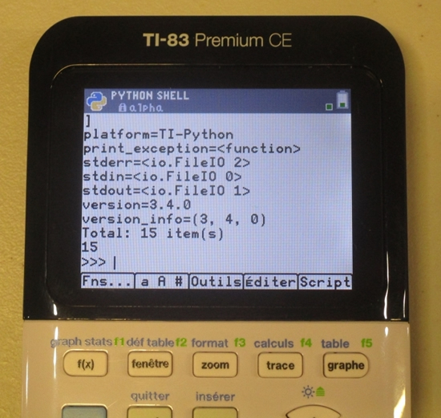
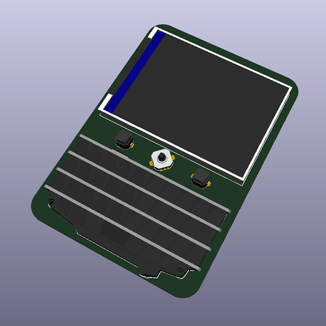
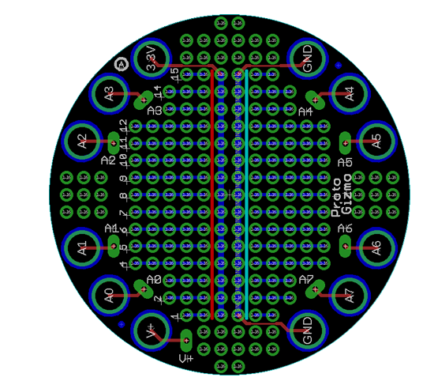
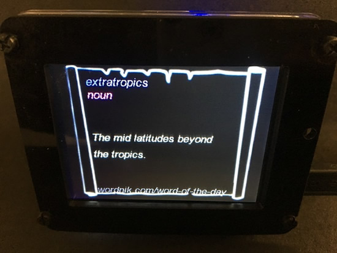
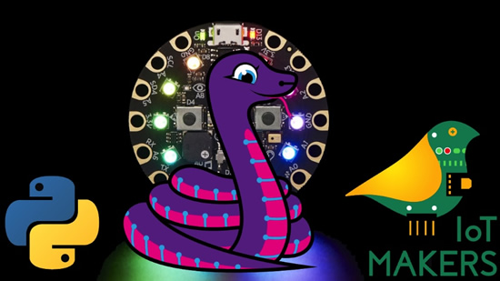
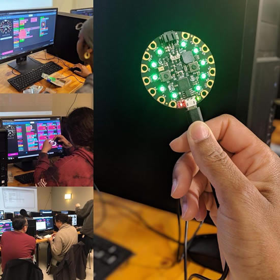

## Blinka snakes its way to Google Coral

We've got tons of projects, libraries and example code for CircuitPython on microcontrollers, and thanks to the flexibility and power of Python its pretty easy to get it working with micro-computers like Google Coral or other 'Linux with GPIO pins available' single board computers - [learn.adafruit.com](https://learn.adafruit.com/circuitpython-on-google-coral-linux-blinka?view=all#circuitpython-coral).

## The console you can wear as a badge

Wireframe takes a look at a tiny coding handheld – and badge – for beginners: Adafruit’s PyBadge - [Page 24 & 25, Wireframe issue 13](https://wireframe.raspberrypi.org/issues/13) & [PDF](https://magazines-static.raspberrypi.org/issues/full_pdfs/000/000/079/original/Wireframe13.pdf?1556803146).

## All a'board! Metro M4 Express AirLift (WiFi)

The CircuitPython-powered Metro M4 Express AirLift (WiFi) is here, and there's a new guide to go along with it on running CircuitPython - [learn.adafruit.com](https://learn.adafruit.com/adafruit-metro-m4-express-airlift-wifi?view=all#install-circuitpython).

## CircuitPython snakes its way to MAKE Magazine

Edge-Lit LED Rainbow. Explore light piping and color mixing in edge-lit acrylic with this fun IoT weather display by Debra Ansell - [Make: Magazine Volume 69](https://makezine.com/).

## News from around the web!

CircuitPython Weekly meetin recording for May 13th, 2019 - [YouTube]().

Here's a preview of the TI-83 Premium CE Python Edition which appears to be coming out in the fall of 2019, the Python feature is now internal, not an external CircuitPython module. The internal Python is now called tipython - [TI-Planet.org](https://tiplanet.org/forum/viewtopic.php?t=22585&p=242160&utm_source=dlvr.it&utm_medium=twitter#p242160). There are also [2 videos](https://www.youtube.com/watch?v=k2YaXOLVosE) of the calc [controlling a robot](https://www.youtube.com/watch?v=Hyto6BvDxcU).

Adafruit PyPortal UK tide viewer - [digital-maker.co.uk](https://digital-maker.co.uk/adafruit-pyportal-uk-tide-viewer) via [Twitter](https://twitter.com/digitalMakerCIC/status/1126858944306192385).

Twitter display on PyPort from Zach - [Twitter](https://twitter.com/Chewy_Turtle/status/1127369939898126336).

A few PyPortal projects from the Discord community on [adafru.it/discord](https://adafru.it/discord)! pdbartsch's PyPortal with Strava API, Google app scripts, published on Google Sheets. JasonP's PyPortal camera switcher. And! Cater's International Space Station tracker!

Sophy Wong is a Seattle-based maker whose work has appeared on Adafruit and in HackSpace Magazine, and you may know her iconic projects like the Selfie Bot and her Spacesuit. She stopped by Hackster’s Seattle office to chat about documenting projects, design thinking versus engineering, and her upcoming talks at Maker Faire - [Hackster.io](https://blog.hackster.io/interview-with-sophy-wong-2008c1a1a6c2)

Handheld Feather Wing: A Feather Wing with a LCD, BB Q10 keyboard and a 5-way button. aka. Fauxberry - [hackaday.io](https://hackaday.io/project/165450-handheld-feather-wing/log/163148-first-entry-initial-schematic).

Here's a script for Macs that will copy `code.py` to the CIRCUITPY volume on Mac - [GitHub](https://gist.github.com/t-eckert/66ca8f83f35aff64fbe37326ffdb440f).

No big deal, just [Guido van Rossum](https://bugs.python.org/issue36807) working on some things with us in CircuitPython - [GitHub](https://github.com/python/cpython/pull/13102).

Speaking of! TFiR: Open Source & Emerging Technologies with Swapnil Bhartiya: [Does Python Belong In the Cloud](https://www.youtube.com/watch?v=YtZCjK86w60), and interview with [Guido van Rossum](https://www.youtube.com/watch?v=qxMcGDnT8uc), creator of Python - [YouTube](https://www.youtube.com/user/muktware/).

pewpew-game-maze3d, an experimental real-time 3D game for PewPew - [GitHub](https://github.com/cwalther/pewpew-game-maze3d).

Snek and the Amusement Park - [keithp.com](https://keithp.com/blogs/snek-amusement/).

TinyPICO by Unexpected Maker: A tiny, mighty ESP32 development board, launched, we're a backer! - [Crowd Supply](https://www.crowdsupply.com/unexpected-maker/tinypico).

May edition of ESP News is here, includes: ESP-IDF v3.2, the latest version of Espressif's IoT Development framework, and more - [ESP MAY 2019](https://mailchi.mp/daa804d5fc80/espressif-esp-news-may-2019?e=ed7e71c663).

PyDev of the Week: Joel Grus on [Mouse vs Python](https://www.blog.pythonlibrary.org/2019/05/06/pydev-of-the-week-joel-grus/).

GDB dashboard, modular visual interface for GDB in Python - [GitHub](https://github.com/cyrus-and/gdb-dashboard).

[A Bird’s Eye View: How Machine Learning Can Help You Charge Your E-Scooters](https://towardsdatascience.com/a-birds-eye-view-leveraging-machine-learning-to-generate-nests-30dd2136a839) by Perry Johnson.

Gameboy.Live is a Gameboy emulator written in go for learning purposes - [GitHub](https://github.com/HFO4/gameboy.live).

GitHub Package Registry is in beta. GitHub Package Registry is a software package hosting service, similar to npmjs.org, rubygems.org, or hub.docker.com, that allows you to host your packages and code in one place - [GitHub](https://github.com/features/package-registry).

Limor Fried, Founder and Lead Engineer, at Adafruit, Saloni Garg, Undergraduate, The LNM Institute of Information Technology, Jaipur-India, & DeLisa Alexander, EVP & CPO, Red Hat talk with John Walls at Red Hat Summit 2019 in Boston, MA - [YouTube](https://youtu.be/R4UfPUHVAgE). AND an article on [opensource.com](https://opensource.com/article/19/5/award-winner-limor-fried).

CircuitPython Weekly meeting recording for May 13th, 2019 [on YouTube](https://youtu.be/rW70CS52Qsc)

PyDev of the Week: Tania Allard on [Mouse vs Python](https://www.blog.pythonlibrary.org/2019/05/13/pydev-of-the-week-tania-allard/)

#ICYDNCI What was the most popular, most clicked link, in [last week's newsletter?](https://www.adafruitdaily.com/2019/05/07/pycon-is-here-pythonhardware-red-hat-summit-and-more-python-adafruit-circuitpython-circuitpython-micropython-thepsf-adafruit/) [Crowd Supply](https://www.crowdsupply.com/).

## Coming soon

A Circuit Playground "shield."

## New Learn Guides!

[PyPortal Word of the Day](https://learn.adafruit.com/pyportal-word-of-the-day-display) from [Isaac Wellish](https://learn.adafruit.com/users/isaacwellish)

[CircuitPython Display Support Using displayio](https://learn.adafruit.com/circuitpython-display-support-using-displayio) from [Carter Nelson](https://learn.adafruit.com/users/caternuson)

[CircuitPython displayio Setup for TFT FeatherWings](https://learn.adafruit.com/using-circuitpython-displayio-with-a-tft-featherwing) from [Melissa LeBlanc-Williams](https://learn.adafruit.com/users/MakerMelissa)

[Multi-Sensor IoT Environmental Sensor Box With CircuitPython](https://learn.adafruit.com/remote-iot-environmental-sensor) from [Dave Astels](https://learn.adafruit.com/users/dastels)

## Updated Guides - Now With More Python!

**You can use CircuitPython libraries on Raspberry Pi!** We're updating all of our CircuitPython guides to show how to wire up sensors to your Raspberry Pi, and load the necessary CircuitPython libraries to get going using them with Python. We'll be including the updates here so you can easily keep track of which sensors are ready to go. Check it out!

Keep checking back for more updated guides!

## CircuitPython Libraries!

CircuitPython support for hardware continues to grow. We are adding support for new sensors and breakouts all the time, as well as improving on the drivers we already have. As we add more libraries and update current ones, you can keep up with all the changes right here!

For the latest drivers, download the [Adafruit CircuitPython Library Bundle](https://github.com/adafruit/Adafruit_CircuitPython_Bundle/releases/latest).

If you'd like to contribute, CircuitPython libraries are a great place to start. Have an idea for a new driver? File an issue on [CircuitPython](https://github.com/adafruit/circuitpython/issues)! Interested in helping with current libraries? Check out [this GitHub issue on CircuitPython](https://github.com/adafruit/circuitpython/issues/1246) for an overview of the State of the CircuitPython Libraries, updated each week. We've included open issues from the library issue lists, and details about repo-level issues that need to be addressed. We have a guide on [contributing to CircuitPython with Git and Github](https://learn.adafruit.com/contribute-to-circuitpython-with-git-and-github) if you need help getting started. You can also find us in the #circuitpython channel on the [Adafruit Discord](https://adafru.it/discord). Feel free to contact Kattni (@kattni) with any questions.

You can check out this [list of all the CircuitPython libraries and drivers available](https://github.com/adafruit/Adafruit_CircuitPython_Bundle/blob/master/circuitpython_library_list.md). 

The current number of CircuitPython libraries is **155**!

**Updated Libraries!**

Here's this week's updated CircuitPython libraries:

* [Adafruit_CircuitPython_ADS1x15](https://github.com/adafruit/Adafruit_CircuitPython_ADS1x15)
* [Adafruit_CircuitPython_ADXL34x](https://github.com/adafruit/Adafruit_CircuitPython_ADXL34x)
* [Adafruit_CircuitPython_AMG88xx](https://github.com/adafruit/Adafruit_CircuitPython_AMG88xx)
* [Adafruit_CircuitPython_AVRprog](https://github.com/adafruit/Adafruit_CircuitPython_AVRprog)
* [Adafruit_CircuitPython_BluefruitConnect](https://github.com/adafruit/Adafruit_CircuitPython_BluefruitConnect)
* [Adafruit_CircuitPython_BNO055](https://github.com/adafruit/Adafruit_CircuitPython_BNO055)
* [Adafruit_CircuitPython_BusDevice](https://github.com/adafruit/Adafruit_CircuitPython_BusDevice)
* [Adafruit_CircuitPython_Display_Text](https://github.com/adafruit/Adafruit_CircuitPython_Display_Text)
* [Adafruit_CircuitPython_ESP_ATcontrol](https://github.com/adafruit/Adafruit_CircuitPython_ESP_ATcontrol)
* [Adafruit_CircuitPython_FeatherWing](https://github.com/adafruit/Adafruit_CircuitPython_FeatherWing)
* [Adafruit_CircuitPython_GPS](https://github.com/adafruit/Adafruit_CircuitPython_GPS)
* [Adafruit_CircuitPython_IRRemote](https://github.com/adafruit/Adafruit_CircuitPython_IRRemote)
* [Adafruit_CircuitPython_LIS3DH](https://github.com/adafruit/Adafruit_CircuitPython_LIS3DH)
* [Adafruit_CircuitPython_LSM303](https://github.com/adafruit/Adafruit_CircuitPython_LSM303)
* [Adafruit_CircuitPython_MAX7219](https://github.com/adafruit/Adafruit_CircuitPython_MAX7219)
* [Adafruit_CircuitPython_miniesptool](https://github.com/adafruit/Adafruit_CircuitPython_miniesptool)
* [Adafruit_CircuitPython_MLX90393](https://github.com/adafruit/Adafruit_CircuitPython_MLX90393)
* [Adafruit_CircuitPython_MMA8451](https://github.com/adafruit/Adafruit_CircuitPython_MMA8451)
* [Adafruit_CircuitPython_Motor](https://github.com/adafruit/Adafruit_CircuitPython_Motor)
* [Adafruit_CircuitPython_MPL3115A2](https://github.com/adafruit/Adafruit_CircuitPython_MPL3115A2)
* [Adafruit_CircuitPython_MPR121](https://github.com/adafruit/Adafruit_CircuitPython_MPR121)
* [Adafruit_CircuitPython_NeoPixel](https://github.com/adafruit/Adafruit_CircuitPython_NeoPixel)
* [Adafruit_CircuitPython_NeoTrellis](https://github.com/adafruit/Adafruit_CircuitPython_NeoTrellis)
* [Adafruit_CircuitPython_PN532](https://github.com/adafruit/Adafruit_CircuitPython_PN532)
* [Adafruit_CircuitPython_PyPortal](https://github.com/adafruit/Adafruit_CircuitPython_PyPortal)
* [Adafruit_CircuitPython_Register](https://github.com/adafruit/Adafruit_CircuitPython_Register)
* [Adafruit_CircuitPython_RFM9x](https://github.com/adafruit/Adafruit_CircuitPython_RFM9x)
* [Adafruit_CircuitPython_RGB_Display](https://github.com/adafruit/Adafruit_CircuitPython_RGB_Display)
* [Adafruit_CircuitPython_SI5351](https://github.com/adafruit/Adafruit_CircuitPython_SI5351)
* [Adafruit_CircuitPython_SimpleIO](https://github.com/adafruit/Adafruit_CircuitPython_SimpleIO)
* [Adafruit_CircuitPython_SSD1306](https://github.com/adafruit/Adafruit_CircuitPython_SSD1306)
* [Adafruit_CircuitPython_VC0706](https://github.com/adafruit/Adafruit_CircuitPython_VC0706)
* [Adafruit_CircuitPython_VEML6070](https://github.com/adafruit/Adafruit_CircuitPython_VEML6070)

**PyPI Download Stats!**

We've written a special library called Adafruit Blinka that makes it possible to use CircuitPython Libraries on [Raspberry Pi and other compatible single-board computers](https://learn.adafruit.com/circuitpython-on-raspberrypi-linux/). Adafruit Blinka and all the CircuitPython libraries have been deployed to PyPI for super simple installation on Linux! Here are the top 10 CircuitPython libraries downloaded from PyPI in the last week, including the total downloads for those libraries:

| Library                                     | Last Week   | Total |   
|:-------                                     |:--------:   |:-----:|   
| Adafruit-Blinka                             | 2274        | 32810 |   
| Adafruit_CircuitPython_BusDevice            | 422         | 10210 |   
| Adafruit_CircuitPython_Register             | 416         | 5171 |    
| Adafruit_CircuitPython_NeoPixel             | 354         | 4897 |    
| Adafruit_CircuitPython_PCA9685              | 292         | 2861 |    
| Adafruit_CircuitPython_Motor                | 288         | 3211 |    
| Adafruit_CircuitPython_ServoKit             | 240         | 2343 |    
| Adafruit_CircuitPython_framebuf             | 166         | 1095 |    
| Adafruit_CircuitPython_CharLCD              | 120         | 8533 |    
| Adafruit_CircuitPython_MotorKit             | 119         | 2239 |    

## Upcoming events!

CircuitPython Hands-On Workshop at IoT Makers Israel. Thursday, May 16, 2019 - [Meetup](https://www.meetup.com/IoT-Makers-Israel/events/261233509/).

Circuit Playground: A Beginner’s Workshop on Electronics and Coding! Sunday, May 19th and Sunday, June 1 2019. MakerSpace NYC - Futureworks MakerSpace at Brooklyn Army Terminal - [Eventbrite](https://www.eventbrite.com/e/circuit-playground-a-beginners-workshop-on-electronics-and-coding-tickets-61650333808?ref=eios), via [Twitter](https://twitter.com/ValerieBrock24/status/1126643723604041728).

## Latest releases

CircuitPython's stable release is [3.1.2](https://github.com/adafruit/circuitpython/releases/latest) and its unstable release is [4.0.0-rc.2](https://github.com/adafruit/circuitpython/releases). New to CircuitPython? Start with our [Welcome to CircuitPython Guide](https://learn.adafruit.com/welcome-to-circuitpython).

[20190513](https://github.com/adafruit/Adafruit_CircuitPython_Bundle/releases/latest) is the latest CircuitPython library bundle.

[v1.10](https://micropython.org/download) is the latest MicroPython release. Documentation for it is [here](http://docs.micropython.org/en/latest/pyboard/).

[3.7.3](https://www.python.org/downloads/) is the latest Python release. The latest pre-release version is [3.8.0a4](https://www.python.org/download/pre-releases/).

[1198 Stars](https://github.com/adafruit/circuitpython/stargazers) Like CircuitPython? [Star it on GitHub!](https://github.com/adafruit/circuitpython)

## Call for help – CircuitPython messaging to other languages!

We [posted on the Adafruit blog](https://blog.adafruit.com/2018/08/15/help-bring-circuitpython-messaging-to-other-languages-circuitpython/) about bringing CircuitPython messaging to other languages, one of the exciting features of CircuitPython 4.x is translated control and error messages. Native language messages will help non-native English speakers understand what is happening in CircuitPython even though the Python keywords and APIs will still be in English. If you would like to help, [please post](https://github.com/adafruit/circuitpython/issues/1098) to the main issue on GitHub and join us on [Discord](https://adafru.it/discord).

We made this graphic with translated text, we could use your help with that to make sure we got the text right, please check out the text in the image – if there is anything we did not get correct, please let us know. Dan sent me this [handy site too](http://helloworldcollection.de/#Human).

## jobs.adafruit.com is back

[jobs.adafruit.com](https://jobs.adafruit.com/) has returned and folks are posting their skills (including CircuitPython) and companies are looking for talented makers to join their companies - from Digi-Key, to Hackaday, Microcenter, Raspberry Pi and more.

## 12,156 thanks!

The Adafruit Discord community, where we do all our CircuitPython development in the open, reached over 12,156 humans, thank you! Join today! [https://adafru.it/discord](https://adafru.it/discord)

## ICYMI - In case you missed it

The wonderful world of Python on hardware! This is our first video-newsletter-podcast that we’ve started! The news comes from the Python community, Discord, Adafruit communities and more. It’s part of the weekly newsletter, then we have a segment on ASK an ENGINEER and this is the video slice from that! The complete Python on Hardware weekly VideoCast [playlist is here](https://www.youtube.com/playlist?list=PLjF7R1fz_OOXRMjM7Sm0J2Xt6H81TdDev). 

This video podcast is on [iTunes](https://itunes.apple.com/us/podcast/python-on-hardware/id1451685192?mt=2), [YouTube](https://www.youtube.com/playlist?list=PLjF7R1fz_OOXRMjM7Sm0J2Xt6H81TdDev), [IGTV (Instagram TV](https://www.instagram.com/adafruit/channel/)), and [XML](https://itunes.apple.com/us/podcast/python-on-hardware/id1451685192?mt=2).

[Weekly community chat on Adafruit Discord server CircuitPython channel - Audio / Podcast edition](https://itunes.apple.com/us/podcast/circuitpython-weekly-meeting/id1451685016) - Audio from the Discord chat space for CircuitPython, meetings are usually Mondays at 2pm ET, this is the audio version on [iTunes](https://itunes.apple.com/us/podcast/circuitpython-weekly-meeting/id1451685016), Pocket Casts, [Spotify](https://adafru.it/spotify), and [XML feed](https://adafruit-podcasts.s3.amazonaws.com/circuitpython_weekly_meeting/audio-podcast.xml).

## Contribute!

The CircuitPython Weekly Newsletter is a CircuitPython community-run newsletter emailed every Tuesday. The complete [archives are here](https://www.adafruitdaily.com/category/circuitpython/). It highlights the latest CircuitPython related news from around the web including Python and MicroPython developments. To contribute, edit next week's draft [on GitHub](https://github.com/adafruit/circuitpython-weekly-newsletter/tree/gh-pages/_drafts) and [submit a pull request](https://help.github.com/articles/editing-files-in-your-repository/) with the changes. Join our [Discord](https://adafru.it/discord) or [post to the forum](https://forums.adafruit.com/viewforum.php?f=60) for any further questions.
