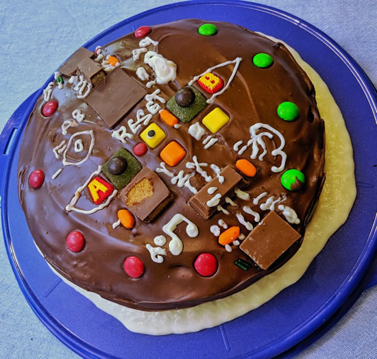
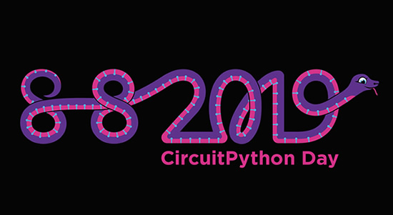

Feature story text here
update title

## Feather format takes flight with the SparkFun Thing Plus

Adafruit Feather format takes flight with the [SparkFun Thing Plus – SAMD51 – DEV-14713](https://www.sparkfun.com/products/14713) -

"_Is it power you seek? With a 32-bit ARM Cortex-M4F MCU, the SparkFun SAMD51 Thing Plus is one of our most powerful microcontroller boards yet! The SAMD51 Thing Plus provides you with an economical and easy to use development platform if you’re needing more power with minimal working space. This Thing even comes flashed with the same convenient UF2 bootloader as the RedBoard Turbo. To make the Thing Plus even easier to use, we’ve moved a few pins around to make the board Feather compatible…"_

UF2 bootloader, Feather pin layout, should also be easy to get CircuitPython runnin’ on it too. According to [one of the developers](https://www.sparkfun.com/news/2930#comment-5ce8150487756d6dfa678ce3), expect it soon *"The CircuitPython firmware for the board should be built up next week."*

## IoT Makers workshop recap

The CircuitPython workshop at IoT Makers Israel was a blast! - [Video](https://twitter.com/IoTMakersIL/status/1130808191133130752).

>_"Thanks @adafruit for helping this happen. These little boards sparked a lot of creativity in the attendees!"_

## News from around the web!

[CircuitPlayground takes the cake](https://twitter.com/mkgray/status/1131751693945856000) :) At the Reading Public Library Girls Who Code final celebration, a CircuitPlayground Express cake was made since it was used to teach a lot in the club. The Girls made a trivia game, a robocat, a Creed from The Office quote machine, and a magic wand.

[A Snek Family Portrait](https://twitter.com/keith_x11/status/1130635080706142208). These are all of the devices Keith has gotten Snek running on. Two from Arduino, five from Adafruit. Snek is tiny Python-like lanugage for hardware - [snek](https://keithp.com/snek/).

[Discussion on Twitter](https://twitter.com/MstrBlinky/status/1132330904154771456) about the upcoming [PlayDate from Panic handheld](https://play.date/), looks like it's a STM32F7, good chance MicroPython will run on it.

[GitHub Sponsors](https://help.github.com/en/articles/about-github-sponsors) allows the developer community to financially support the people who design, build, and maintain the open source projects they depend on, directly on GitHub.

#ICYDNCI What was the most popular, most clicked link, in [last week's newsletter](https://www.adafruitdaily.com/2019/05/21/circuitpython-4-released-upcoming-hardware-and-more-python-adafruit-circuitpython-pythonhardware-circuitpython-micropython-thepsf-adafruit/)? [CircuitPython Downloads on CircuitPython.org](https://circuitpython.org/downloads)!

## Made with Mu, Kushal's Colourful Adafruit Adventures

Friend of Mu, community hero, Tor core team member, Python core developer and programmer extraordinaire Kushal Das, has [blogged about the fun](https://kushaldas.in/posts/game-of-guessing-colors-using-circuitpython.html) he’s been having with Adafruit’s Circuit Playground Express board, CircuitPython and Mu.

Kushal's Colourful Adafruit Adventures - [madewith.mu](https://madewith.mu/mu/users/2019/05/22/pycon-cpx.html)

Why Mu? Mu tries to make it as easy as possible to get started with programming but aims to help you graduate to "real" development tools soon after. Everything in Mu is the "real thing" but presented in as simple and obvious way possible. It's like the toddling stage in learning to walk: you're finding your feet and once you're confident, you should move on and explore! Put simply, Mu aims to foster autonomy. Try out Mu today! - [codewith.mu](https://codewith.mu/)

## Coming soon

## New Learn Guides!

[Using micro:bit and CRICKIT with MicroPython](https://learn.adafruit.com/using-micro-bit-and-crickit-with-micropython) from [Mike Barela](https://learn.adafruit.com/users/MikeBarela)

## Updated Guides - Now With More Python!

**You can use CircuitPython libraries on Raspberry Pi!** We're updating all of our CircuitPython guides to show how to wire up sensors to your Raspberry Pi, and load the necessary CircuitPython libraries to get going using them with Python. We'll be including the updates here so you can easily keep track of which sensors are ready to go. Check it out!

Keep checking back for more updated guides!

## CircuitPython Libraries!

CircuitPython support for hardware continues to grow. We are adding support for new sensors and breakouts all the time, as well as improving on the drivers we already have. As we add more libraries and update current ones, you can keep up with all the changes right here!

For the latest drivers, download the [Adafruit CircuitPython Library Bundle](https://github.com/adafruit/Adafruit_CircuitPython_Bundle/releases/latest).

If you'd like to contribute, CircuitPython libraries are a great place to start. Have an idea for a new driver? File an issue on [CircuitPython](https://github.com/adafruit/circuitpython/issues)! Interested in helping with current libraries? Check out [this GitHub issue on CircuitPython](https://github.com/adafruit/circuitpython/issues/1246) for an overview of the State of the CircuitPython Libraries, updated each week. We've included open issues from the library issue lists, and details about repo-level issues that need to be addressed. We have a guide on [contributing to CircuitPython with Git and Github](https://learn.adafruit.com/contribute-to-circuitpython-with-git-and-github) if you need help getting started. You can also find us in the #circuitpython channel on the [Adafruit Discord](https://adafru.it/discord). Feel free to contact Kattni (@kattni) with any questions.

You can check out this [list of all the CircuitPython libraries and drivers available](https://github.com/adafruit/Adafruit_CircuitPython_Bundle/blob/master/circuitpython_library_list.md). 

The current number of CircuitPython libraries is **155**!

**Updated Libraries!**

Here's this week's updated CircuitPython libraries:

* [Adafruit_CircuitPython_EPD](https://github.com/adafruit/Adafruit_CircuitPython_EPD)
* [Adafruit_CircuitPython_LIFX](https://github.com/adafruit/Adafruit_CircuitPython_LIFX)
* [Adafruit_CircuitPython_MCP230xx](https://github.com/adafruit/Adafruit_CircuitPython_MCP230xx)
* [Adafruit_CircuitPython_BMP280](https://github.com/adafruit/Adafruit_CircuitPython_BMP280)
* [Adafruit_CircuitPython_Bitmap_Font](https://github.com/adafruit/Adafruit_CircuitPython_Bitmap_Font)
* [Adafruit_CircuitPython_STMPE610](https://github.com/adafruit/Adafruit_CircuitPython_STMPE610)
* [Adafruit_CircuitPython_PyPortal](https://github.com/adafruit/Adafruit_CircuitPython_PyPortal)
* [Adafruit_CircuitPython_LPS35HW](https://github.com/adafruit/Adafruit_CircuitPython_LPS35HW)
* [Adafruit_CircuitPython_HID](https://github.com/adafruit/Adafruit_CircuitPython_HID)

**PyPI Download Stats!**

We've written a special library called Adafruit Blinka that makes it possible to use CircuitPython Libraries on [Raspberry Pi and other compatible single-board computers](https://learn.adafruit.com/circuitpython-on-raspberrypi-linux/). Adafruit Blinka and all the CircuitPython libraries have been deployed to PyPI for super simple installation on Linux! Here are the top 10 CircuitPython libraries downloaded from PyPI in the last week, including the total downloads for those libraries:

| Library                                     | Last Week   | Total |   
|:-------                                     |:--------:   |:-----:|   
| Adafruit-Blinka                             | 2138        | 36286 |   
| Adafruit_CircuitPython_BusDevice            | 1247        | 11838 |   
| Adafruit_CircuitPython_Register             | 388         | 5824 |    
| Adafruit_CircuitPython_NeoPixel             | 376         | 5346 |    
| Adafruit_CircuitPython_Motor                | 304         | 3788 |    
| Adafruit_CircuitPython_PCA9685              | 288         | 3378 |    
| Adafruit_CircuitPython_MCP230xx             | 198         | 1117 |    
| Adafruit_CircuitPython_LIS3DH               | 186         | 1630 |    
| Adafruit_CircuitPython_ServoKit             | 182         | 2734 |    
| Adafruit_CircuitPython_ADS1x15              | 168         | 1805 |    

## Upcoming events!

Circuit Playground: A Beginner’s Workshop on Electronics and Coding! Sunday, May 19th and Sunday, June 1 2019. MakerSpace NYC – Futureworks MakerSpace at Brooklyn Army Terminal – [Eventbrite](https://www.eventbrite.com/e/circuit-playground-a-beginners-workshop-on-electronics-and-coding-tickets-61650333808?ref=eios), via [Twitter](https://twitter.com/ValerieBrock24/status/1126643723604041728).

PyLondinium is back for 2019, with a diverse program of sprints, workshops and talks. We'll be returning to Bloomberg's European HQ in the heart of the City of London, June 14th, 15th, and 16th, 2019 - [pylondinium.org](https://pylondinium.org/)

July, 8 to 14th 2019. The EuroPython conference series was initiated by the European Python community in 2001 and started with EuroPython 2002 in Charleroi, Belgium, as the first major Python conference entirely run by volunteers - [ep2019.europython.eu](https://ep2019.europython.eu/)

Open Source Summit and Embedded Linux Conference, August 21 – 23, 2019 at the Hilton San Diego Bayfront. The Open Source Summit North America combines with Embedded Linux Conference North America (ELC).  ELC has been a vendor-neutral technical conference where developers working on embedded Linux and industrial IoT products and deployments gather for education and collaboration. Open Source Summit brings together developers and open source professionals to collaborate and learn about the latest technologies - [Linux Foundation](https://www.linuxfoundation.org/press-release/2019/05/open-source-summit-to-include-embedded-linux-conference-bring-together-both-technical-and-leadership-programs-under-one-roof/).

PYCON UK 2019 - Cardiff City Hall, Friday 13th to Tuesday 17th September. PyCon UK is back at Cardiff City Hall, for five days of talks, workshops and collaboration. The conference also features a young coders' day, themes dedicated to science and education, and numerous Python-related events - [PyCon UK](https://2019.pyconuk.org/).

## Latest releases

CircuitPython's stable release is [#.#.#](https://github.com/adafruit/circuitpython/releases/latest) and its unstable release is [#.#.#-##.#](https://github.com/adafruit/circuitpython/releases). New to CircuitPython? Start with our [Welcome to CircuitPython Guide](https://learn.adafruit.com/welcome-to-circuitpython).

[2019####](https://github.com/adafruit/Adafruit_CircuitPython_Bundle/releases/latest) is the latest CircuitPython library bundle.

[v#.#.#](https://micropython.org/download) is the latest MicroPython release. Documentation for it is [here](http://docs.micropython.org/en/latest/pyboard/).

[#.#.#](https://www.python.org/downloads/) is the latest Python release. The latest pre-release version is [#.#.#](https://www.python.org/download/pre-releases/).

[1241 Stars](https://github.com/adafruit/circuitpython/stargazers) Like CircuitPython? [Star it on GitHub!](https://github.com/adafruit/circuitpython)

## circuitpython.org updates!

Downloads are now available from [circuitpython.org](https://circuitpython.org)! This site makes it much easier to select the correct file and language for your board. The downloads page is [here](https://circuitpython.org/downloads). Here are the latest boards added! **There are now 59 boards!**

**Updates:**

 -  by x.

## Call for help – CircuitPython messaging to other languages!

We [posted on the Adafruit blog](https://blog.adafruit.com/2018/08/15/help-bring-circuitpython-messaging-to-other-languages-circuitpython/) about bringing CircuitPython messaging to other languages, one of the exciting features of CircuitPython 4.x is translated control and error messages. Native language messages will help non-native English speakers understand what is happening in CircuitPython even though the Python keywords and APIs will still be in English. If you would like to help, [please post](https://github.com/adafruit/circuitpython/issues/1098) to the main issue on GitHub and join us on [Discord](https://adafru.it/discord).

We made this graphic with translated text, we could use your help with that to make sure we got the text right, please check out the text in the image – if there is anything we did not get correct, please let us know. Dan sent me this [handy site too](http://helloworldcollection.de/#Human).

## jobs.adafruit.com is back

[jobs.adafruit.com](https://jobs.adafruit.com/) has returned and folks are posting their skills (including CircuitPython) and companies are looking for talented makers to join their companies - from Digi-Key, to Hackaday, Microcenter, Raspberry Pi and more.

## 12,393 thanks!

The Adafruit Discord community, where we do all our CircuitPython development in the open, reached over 12,393 humans, thank you! Join today! [https://adafru.it/discord](https://adafru.it/discord)

## ICYMI - In case you missed it

The wonderful world of Python on hardware! This is our first video-newsletter-podcast that we’ve started! The news comes from the Python community, Discord, Adafruit communities and more. It’s part of the weekly newsletter, then we have a segment on ASK an ENGINEER and this is the video slice from that! The complete Python on Hardware weekly VideoCast [playlist is here](https://www.youtube.com/playlist?list=PLjF7R1fz_OOXRMjM7Sm0J2Xt6H81TdDev). 

This video podcast is on [iTunes](https://itunes.apple.com/us/podcast/python-on-hardware/id1451685192?mt=2), [YouTube](https://www.youtube.com/playlist?list=PLjF7R1fz_OOXRMjM7Sm0J2Xt6H81TdDev), [IGTV (Instagram TV](https://www.instagram.com/adafruit/channel/)), and [XML](https://itunes.apple.com/us/podcast/python-on-hardware/id1451685192?mt=2).

[Weekly community chat on Adafruit Discord server CircuitPython channel - Audio / Podcast edition](https://itunes.apple.com/us/podcast/circuitpython-weekly-meeting/id1451685016) - Audio from the Discord chat space for CircuitPython, meetings are usually Mondays at 2pm ET, this is the audio version on [iTunes](https://itunes.apple.com/us/podcast/circuitpython-weekly-meeting/id1451685016), Pocket Casts, [Spotify](https://adafru.it/spotify), and [XML feed](https://adafruit-podcasts.s3.amazonaws.com/circuitpython_weekly_meeting/audio-podcast.xml).

## Codecademy "Learn Hardware Programming with CircuitPython"

Codecademy, an online interactive learning platform used by more than 45 million people, has teamed up with the leading manufacturer in STEAM electronics, Adafruit Industries, to create a coding course, "Learn Hardware Programming with CircuitPython". The course is now available in the [Codecademy catalog](https://www.codecademy.com/learn/learn-circuitpython?utm_source=adafruit&utm_medium=partners&utm_campaign=circuitplayground&utm_content=pythononhardwarenewsletter).

Python is a highly versatile, easy to learn programming language that a wide range of people, from visual effects artists in Hollywood to mission control at NASA, use to quickly solve problems. But you don’t need to be a rocket scientist to accomplish amazing things with it. This new course introduces programmers to Python by way of a microcontroller — CircuitPython — which is a Python-based programming language optimized for use on hardware.

CircuitPython’s hardware-ready design makes it easier than ever to program a variety of single-board computers, and this course gets you from no experience to working prototype faster than ever before. Codecademy’s interactive learning environment, combined with Adafruit's highly rated Circuit Playground Express, present aspiring hardware hackers with a never-before-seen opportunity to learn hardware programming seamlessly online.

Whether for those who are new to programming, or for those who want to expand their skill set to include physical computing, this course will have students getting familiar with Python and creating incredible projects along the way. By the end, students will have built their own bike lights, drum machine, and even a moisture detector that can tell when it's time to water a plant.

Visit Codecademy to access the [Learn Hardware Programming with CircuitPython](https://www.codecademy.com/learn/learn-circuitpython?utm_source=adafruit&utm_medium=partners&utm_campaign=circuitplayground&utm_content=pythononhardwarenewsletter) course and Adafruit to purchase a [Circuit Playground Express](https://www.adafruit.com/product/3333).

Codecademy has helped more than 45 million people around the world upgrade their careers with technology skills. The company’s online interactive learning platform is widely recognized for providing an accessible, flexible, and engaging experience for beginners and experienced programmers alike. Codecademy has raised a total of $43 million from investors including Union Square Ventures, Kleiner Perkins, Index Ventures, Thrive Capital, Naspers, Yuri Milner and Richard Branson, most recently raising its $30 million Series C in July 2016.

## Contribute!

The CircuitPython Weekly Newsletter is a CircuitPython community-run newsletter emailed every Tuesday. The complete [archives are here](https://www.adafruitdaily.com/category/circuitpython/). It highlights the latest CircuitPython related news from around the web including Python and MicroPython developments. To contribute, edit next week's draft [on GitHub](https://github.com/adafruit/circuitpython-weekly-newsletter/tree/gh-pages/_drafts) and [submit a pull request](https://help.github.com/articles/editing-files-in-your-repository/) with the changes. Join our [Discord](https://adafru.it/discord) or [post to the forum](https://forums.adafruit.com/viewforum.php?f=60) for any further questions.
