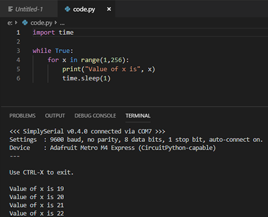
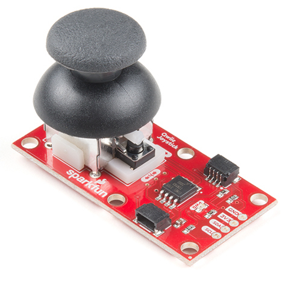
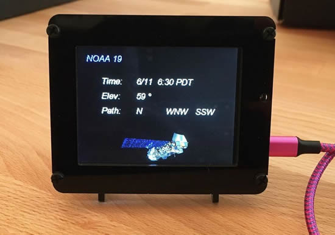
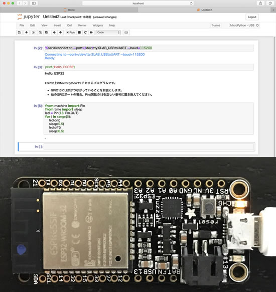

Feature story text here

update title

Monday notes - [Google Docs](https://docs.google.com/document/d/17bOJ2-2B11kmfcJQzcs_5tMk-FBWzA_SeUYtInaBws8/edit?usp=sharing).

## The need for speed, CircuitPython 4.1.0 Beta 0 Released!

[CircuitPython 4.1.0 Beta 0 Released](https://github.com/adafruit/circuitpython/releases/tag/4.1.0-beta.0)! 4.1.0’s biggest feature is speed! General execution of Python should be 2-5x faster and display refreshing will be faster as well.

This is the first beta version for testing. It shouldn’t break any code compatible with previous 4.x releases. Please use the latest 4.x stable release (available from the new website!) when first starting with CircuitPython. It is stable.

Download it now from [circuitpython.org](https://circuitpython.org/downloads) - [full release notes](https://github.com/adafruit/circuitpython/releases/tag/4.1.0-beta.0).

## EuroPython 2019 attendees getting CircuitPython-powered PewPew Game Consoles!

The device was created and designed by [Radomir Dopieralski](https://hackaday.io/deshipu), a long time EuroPython regular and enthusiastic Python device and robotics builder. 

The [PewPew](https://pewpew.rtfd.io/) is a simplified game console, programmable with [CircuitPython](https://circuitpython.rtfd.io/), a variant of MicroPython. It comes with a 64 LED display and a set of small buttons to drive the console. They are looking for attendees to help Radomir with workshops on the PewPew. See more on [the blog post](https://blog.europython.eu/post/185584014022/europython-2019-warning-spoiler-alert) and on the [PewPew workshop page](https://ep2019.europython.eu/events/pewpew-workshops/).

EuroPython 2019 will be in Basel, Switzerland, July 8-14\. [More details](https://ep2019.europython.eu/).

## Console-based serial terminal for Windows/Visual Studio Code

[From the CircuitPython forums](https://forums.adafruit.com/viewtopic.php?f=60&t=152894), Fasteddy516 writes -

*_I've written a simple serial terminal in C# that runs as a Windows Console application (i.e. in command prompt or powershell). It should work with most devices that show up as "COMx" in Device Manager, but I wrote it specifically to work in a terminal window in Visual Studio Code with CircuitPython devices. It includes COM port auto detection, automatic re-connection (if you disconnect and reconnect your device), and uses USB VID and PID values to identify and give preference to CircuitPython-capable devices. The idea was to get a serial monitor in VSCode that was as simple and functional as the serial monitor in the Mu editor. (I like the Mu editor quite a bit, but I do a lot of other work in Visual Studio Code and found switching between the two frustrating - particularly since I use CTRL-H in VSCode all the time!) I've attached a screenshot to this message showing it in action in a Visual Studio Code terminal window. Everything is available on Github, so anyone who is interested is [welcome to check it out](https://github.com/fasteddy516/SimplySerial). If you find it useful (or not), I'd love to hear from you!*

## The Joy(stick) of CircuitPython for QwiicJoystick

CircuitPython library for the Sparkfun QwiicJoystick - [GitHub](https://github.com/fourstix/Sparkfun_CircuitPython_QwiicJoystick).

## Blinka snakes her way to the Odroid C2

CircuitPython Libraries on Linux and Odroid C2. Make hardware and interface with sensors super easy using CircuitPython - [learn.adafruit.com](https://learn.adafruit.com/circuitpython-libaries-linux-odroid-c2)

## Python predicted to overtake C and Java in next 4 years. 

Python's ascent continues among software developers, bolstered by its usability compared with Java and C - [ZDNet](https://www.zdnet.com/article/programming-languages-python-predicted-to-overtake-c-and-java-in-next-4-years/). Here's the [TIOBE Index for June 2019](https://www.tiobe.com/tiobe-index/).

_*This month Python has reached again an all time high in TIOBE index of 8.5%. If Python can keep this pace, it will probably replace C and Java in 3 to 4 years time, thus becoming the most popular programming language of the world. The main reason for this is that software engineering is booming. It attracts lots of newcomers to the field. Java's way of programming is too verbose for beginners. In order to fully understand and run a simple program such as "hello world" in Java you need to have knowledge of classes, static methods and packages. In C this is a bit easier, but then you will be hit in the face with explicit memory management. In Python this is just a one-liner. Enough said."*

## News from around the web!

Blitz City DIY made a rover robot with the Adafruit Crickit board. It's controlled with an IR remote using an Adafruit Trinket M0, Adafruit Seesaw and custom PCB. Coded with CircuitPython - [GitHub](https://github.com/BlitzCityDIY/irRobotAndRemote).

smes_astronautics from the [Advanced Engineering at St. Margaret's Episcopal School](https://sites.google.com/view/smesastronautics/) programmed a display that shows the next high elevation pass of the four satellites they are getting images from. It pulls live data from the n2yo website API and combines it with stored images of the satellites - [Instagram](https://www.instagram.com/p/BylvYHbBuPe/).

Adafruit Just Made It Really Easy to Build Your Own GameBoy - [Gizmodo](https://gizmodo.com/adafruit-just-made-it-really-easy-to-build-your-own-gam-1835528637).

Scott's Python language summit 2019 slides from Pycon are now online - [GitHub](https://github.com/tannewt/presentations).

JP's MIDI sniffer now running CircuitPython on a Feather M4 Express and sporting clean white headers - [Twitter](https://twitter.com/johnedgarpark/status/1140004568010375168).

Here's an animatronic singing skeleton with a CPX + a CRICKIT coded with CircuitPython - [Twitter](https://twitter.com/slogworx/status/1139330996900421632).

Building a HomeKit Compatible Laser Trip Wire With CircuitPython using Adafruit and Particle hardware - [movingelectrons.net](http://www.movingelectrons.net/blog/2019/06/13/Building-a-HomeKit-Compatible-Laser-Trip-Wire.html).

Wow! *"Time to Say Goodbye to Arduino and Go On to Micropython/ Adafruit Circuitpython?"* is almost the #1 video on [Andreas](https://twitter.com/spiessa) channel, congrats! - [YouTube](https://youtu.be/m1miwCJtxeM).

Use Jupyter notebook with ESP32 - [Computer room](http://asamomiji.jp/contents/jupyter-notebook-on-esp32).

Driver for Grid-EYE thermal infra red array sensor - [GitHub](https://github.com/peterhinch/micropython-amg88xx).

Tod made another USB HID tool to help test RawHID projects - [GitHub](https://github.com/todbot/hidapitester).

A GUI software that can interface with a USB camera connected to a microscope - [Pycroscope](https://gitlab.com/Ningirama/pycroscope).

Implementation of 4D chess, with an AI in Python - [GitHub](https://github.com/anonamause10/4D-chess).

It's Triggy! AI learns to play TRON - [YouTube](https://www.youtube.com/watch?v=uZ9CcdBHp-I).

Meet Adafruit Founder Limor Fried: open-source hardware Revolution – [TFiR: Open Source & Emerging Technologies](https://www.tfir.io/2019/06/04/meet-adafruit-founder-limor-fried-open-source-hardware-revolution/) & [YouTube](https://youtu.be/LpWugMMEeeY).

NeXTSTEP-like desktop environment for Linux - [GitHub](https://github.com/trunkmaster/nextspace).

#ICYDNCI What was the most popular, most clicked link, in [last week's newsletter](https://www.adafruitdaily.com/2019/06/11/step-into-the-light-with-python-python-adafruit-circuitpython-pythonhardware-circuitpython-micropython-thepsf-adafruit/)? [Adafruit’s Feather nRF52840 Express Board and Developing with CircuitPython] from [Nordic](https://blog.nordicsemi.com/getconnected/adafruits-feather-nrf52840-express-board-and-developing-with-circuitpython)!

## Coming soon

Bluefruit Circuit Playground Express is in early prototyping phase - YouTube.

## New Learn Guides!

[USB HID Crank Controller](https://learn.adafruit.com/usb-hid-crank-controller) from [Noe and Pedro](https://learn.adafruit.com/users/pixil3d)

[Circuit Playground + CircuitPython Quickstart Guide](https://learn.adafruit.com/circuit-playground-express-circuitpython-5-minute-guide) from [Collin Cunningham](https://learn.adafruit.com/users/collinmel)

## Updated Guides - Now With More Python!

**You can use CircuitPython libraries on Raspberry Pi!** We're updating all of our CircuitPython guides to show how to wire up sensors to your Raspberry Pi, and load the necessary CircuitPython libraries to get going using them with Python. We'll be including the updates here so you can easily keep track of which sensors are ready to go. Check it out!

Keep checking back for more updated guides!

## CircuitPython Libraries!

[{:width="418px"}](https://github.com/adafruit/Adafruit_CircuitPython_Bundle/releases/latest)

CircuitPython support for hardware continues to grow. We are adding support for new sensors and breakouts all the time, as well as improving on the drivers we already have. As we add more libraries and update current ones, you can keep up with all the changes right here!

For the latest drivers, download the [Adafruit CircuitPython Library Bundle](https://github.com/adafruit/Adafruit_CircuitPython_Bundle/releases/latest).

If you'd like to contribute, CircuitPython libraries are a great place to start. Have an idea for a new driver? File an issue on [CircuitPython](https://github.com/adafruit/circuitpython/issues)! Interested in helping with current libraries? Check out [this GitHub issue on CircuitPython](https://github.com/adafruit/circuitpython/issues/1246) for an overview of the State of the CircuitPython Libraries, updated each week. We've included open issues from the library issue lists, and details about repo-level issues that need to be addressed. We have a guide on [contributing to CircuitPython with Git and Github](https://learn.adafruit.com/contribute-to-circuitpython-with-git-and-github) if you need help getting started. You can also find us in the #circuitpython channel on the [Adafruit Discord](https://adafru.it/discord). Feel free to contact Kattni (@kattni) with any questions.

You can check out this [list of all the CircuitPython libraries and drivers available](https://github.com/adafruit/Adafruit_CircuitPython_Bundle/blob/master/circuitpython_library_list.md). 

The current number of CircuitPython libraries is **158**!

**New Libraries!**

Here's this week's new CircuitPython libraries:

 * [Adafruit_CircuitPython_RGBLED](https://github.com/adafruit/Adafruit_CircuitPython_RGBLED)

**Updated Libraries!**

Here's this week's updated CircuitPython libraries:

 * [Adafruit_CircuitPython_CircuitPlayground](https://github.com/adafruit/Adafruit_CircuitPython_CircuitPlayground)
 * [Adafruit_CircuitPython_DS3502](https://github.com/adafruit/Adafruit_CircuitPython_DS3502)
 * [Adafruit_CircuitPython_ESP32SPI](https://github.com/adafruit/Adafruit_CircuitPython_ESP32SPI)
 * [Adafruit_CircuitPython_BusDevice](https://github.com/adafruit/Adafruit_CircuitPython_BusDevice)
 * [Adafruit_CircuitPython_EPD](https://github.com/adafruit/Adafruit_CircuitPython_EPD)

**PyPI Download Stats!**

We've written a special library called Adafruit Blinka that makes it possible to use CircuitPython Libraries on [Raspberry Pi and other compatible single-board computers](https://learn.adafruit.com/circuitpython-on-raspberrypi-linux/). Adafruit Blinka and all the CircuitPython libraries have been deployed to PyPI for super simple installation on Linux! Here are the top 10 CircuitPython libraries downloaded from PyPI in the last week, including the total downloads for those libraries:

| Library                                     | Last Week   | Total |   
|:-------                                     |:--------:   |:-----:|   
| Adafruit-Blinka                             | 2856        | 40102 |   
| Adafruit_CircuitPython_BusDevice            | 1632        | 14431 |   
| Adafruit_CircuitPython_Register             | 412         | 6726 |    
| Adafruit_CircuitPython_MCP230xx             | 379         | 1994 |    
| Adafruit_CircuitPython_NeoPixel             | 338         | 5927 |    
| Adafruit_CircuitPython_Motor                | 296         | 4511 |    
| Adafruit_CircuitPython_PCA9685              | 251         | 4025 |    
| Adafruit_CircuitPython_ADS1x15              | 228         | 2190 |    
| Adafruit_CircuitPython_SSD1306              | 178         | 1429 |    
| Adafruit_CircuitPython_framebuf             | 174         | 1817 |   

## Upcoming events!

## Latest releases

CircuitPython's stable release is [#.#.#](https://github.com/adafruit/circuitpython/releases/latest) and its unstable release is [#.#.#-##.#](https://github.com/adafruit/circuitpython/releases). New to CircuitPython? Start with our [Welcome to CircuitPython Guide](https://learn.adafruit.com/welcome-to-circuitpython).

[2019####](https://github.com/adafruit/Adafruit_CircuitPython_Bundle/releases/latest) is the latest CircuitPython library bundle.

[v#.#.#](https://micropython.org/download) is the latest MicroPython release. Documentation for it is [here](http://docs.micropython.org/en/latest/pyboard/).

[#.#.#](https://www.python.org/downloads/) is the latest Python release. The latest pre-release version is [#.#.#](https://www.python.org/download/pre-releases/).

[1266 Stars](https://github.com/adafruit/circuitpython/stargazers) Like CircuitPython? [Star it on GitHub!](https://github.com/adafruit/circuitpython)

## Call for help – CircuitPython messaging to other languages!

We [posted on the Adafruit blog](https://blog.adafruit.com/2018/08/15/help-bring-circuitpython-messaging-to-other-languages-circuitpython/) about bringing CircuitPython messaging to other languages, one of the exciting features of CircuitPython 4.x is translated control and error messages. Native language messages will help non-native English speakers understand what is happening in CircuitPython even though the Python keywords and APIs will still be in English. If you would like to help, [please post](https://github.com/adafruit/circuitpython/issues/1098) to the main issue on GitHub and join us on [Discord](https://adafru.it/discord).

We made this graphic with translated text, we could use your help with that to make sure we got the text right, please check out the text in the image – if there is anything we did not get correct, please let us know. Dan sent me this [handy site too](http://helloworldcollection.de/#Human).

## jobs.adafruit.com

[jobs.adafruit.com](https://jobs.adafruit.com/) has returned and folks are posting their skills (including CircuitPython) and companies are looking for talented makers to join their companies - from Digi-Key, to Hackaday, Microcenter, Raspberry Pi and more.

Additionally, Adafruit is hiring too! We're looking for PHP developers in the NYC area!

## 12,643 thanks!

The Adafruit Discord community, where we do all our CircuitPython development in the open, reached over 12,643 humans, thank you! Join today! [https://adafru.it/discord](https://adafru.it/discord)

Discord now offers "server boosts" we have 6 on our server (level 1), if we get to 10 boosts we get a banner and some other good features for the community: 150 emojis, 256 Kbps audio, server banner, 50 mb uploads for all members. Stop by and boost! [https://adafru.it/discord](https://adafru.it/discord).

## ICYMI - In case you missed it

The wonderful world of Python on hardware! This is our first video-newsletter-podcast that we’ve started! The news comes from the Python community, Discord, Adafruit communities and more. It’s part of the weekly newsletter, then we have a segment on ASK an ENGINEER and this is the video slice from that! The complete Python on Hardware weekly VideoCast [playlist is here](https://www.youtube.com/playlist?list=PLjF7R1fz_OOXRMjM7Sm0J2Xt6H81TdDev). 

This video podcast is on [iTunes](https://itunes.apple.com/us/podcast/python-on-hardware/id1451685192?mt=2), [YouTube](https://www.youtube.com/playlist?list=PLjF7R1fz_OOXRMjM7Sm0J2Xt6H81TdDev), [IGTV (Instagram TV](https://www.instagram.com/adafruit/channel/)), and [XML](https://itunes.apple.com/us/podcast/python-on-hardware/id1451685192?mt=2).

[Weekly community chat on Adafruit Discord server CircuitPython channel - Audio / Podcast edition](https://itunes.apple.com/us/podcast/circuitpython-weekly-meeting/id1451685016) - Audio from the Discord chat space for CircuitPython, meetings are usually Mondays at 2pm ET, this is the audio version on [iTunes](https://itunes.apple.com/us/podcast/circuitpython-weekly-meeting/id1451685016), Pocket Casts, [Spotify](https://adafru.it/spotify), and [XML feed](https://adafruit-podcasts.s3.amazonaws.com/circuitpython_weekly_meeting/audio-podcast.xml).

## Codecademy "Learn Hardware Programming with CircuitPython"

Codecademy, an online interactive learning platform used by more than 45 million people, has teamed up with the leading manufacturer in STEAM electronics, Adafruit Industries, to create a coding course, "Learn Hardware Programming with CircuitPython". The course is now available in the [Codecademy catalog](https://www.codecademy.com/learn/learn-circuitpython?utm_source=adafruit&utm_medium=partners&utm_campaign=circuitplayground&utm_content=pythononhardwarenewsletter).

Python is a highly versatile, easy to learn programming language that a wide range of people, from visual effects artists in Hollywood to mission control at NASA, use to quickly solve problems. But you don’t need to be a rocket scientist to accomplish amazing things with it. This new course introduces programmers to Python by way of a microcontroller — CircuitPython — which is a Python-based programming language optimized for use on hardware.

CircuitPython’s hardware-ready design makes it easier than ever to program a variety of single-board computers, and this course gets you from no experience to working prototype faster than ever before. Codecademy’s interactive learning environment, combined with Adafruit's highly rated Circuit Playground Express, present aspiring hardware hackers with a never-before-seen opportunity to learn hardware programming seamlessly online.

Whether for those who are new to programming, or for those who want to expand their skill set to include physical computing, this course will have students getting familiar with Python and creating incredible projects along the way. By the end, students will have built their own bike lights, drum machine, and even a moisture detector that can tell when it's time to water a plant.

Visit Codecademy to access the [Learn Hardware Programming with CircuitPython](https://www.codecademy.com/learn/learn-circuitpython?utm_source=adafruit&utm_medium=partners&utm_campaign=circuitplayground&utm_content=pythononhardwarenewsletter) course and Adafruit to purchase a [Circuit Playground Express](https://www.adafruit.com/product/3333).

Codecademy has helped more than 45 million people around the world upgrade their careers with technology skills. The company’s online interactive learning platform is widely recognized for providing an accessible, flexible, and engaging experience for beginners and experienced programmers alike. Codecademy has raised a total of $43 million from investors including Union Square Ventures, Kleiner Perkins, Index Ventures, Thrive Capital, Naspers, Yuri Milner and Richard Branson, most recently raising its $30 million Series C in July 2016.

## Contribute!

The CircuitPython Weekly Newsletter is a CircuitPython community-run newsletter emailed every Tuesday. The complete [archives are here](https://www.adafruitdaily.com/category/circuitpython/). It highlights the latest CircuitPython related news from around the web including Python and MicroPython developments. To contribute, edit next week's draft [on GitHub](https://github.com/adafruit/circuitpython-weekly-newsletter/tree/gh-pages/_drafts) and [submit a pull request](https://help.github.com/articles/editing-files-in-your-repository/) with the changes. Join our [Discord](https://adafru.it/discord) or [post to the forum](https://forums.adafruit.com/viewforum.php?f=60) for any further questions.
