## PyOhio - Kattni's Keynote!

PyOhio was July 27-28, 2019 in Columbus, Ohio, USA! Kattni Rembor was the [opening keynote speaker](https://www.pyohio.org/2019/presentations/126)!

>_"In trying to learn Python, I stumbled into a passion I had never considered. My path began with learning Python on hardware. Through mentorship and the help of friends, I began to flourish. Since then I have continued to contribute in ways I never thought possible, between code, community, and becoming a mentor myself. This is the story of my journey and how mentorship can change lives._"

PyOhio is a non-profit annual Python community conference held in Columbus, OH. It was free to attend and welcomes anyone with an interest in Python. Content ranged from beginner to advanced and was intended to be relevant to all types of Python users: students, software professionals, scientists, hobbyists, and anyone looking to learn more. There were keynotes, tutorials, talks, sprints, open spaces, lightning talks and more - [PyOhio](https://www.pyohio.org/2019/).

[Photo / Tweet](https://twitter.com/EWDurbin/status/1155111965053915137) by [@EWDurbin](https://twitter.com/EWDurbin/).

## STM32 support snakes its way to CircuitPython!

This is a bit of a coming soon but deserves its own news item! Add STM32 Discovery [F412ZG](https://www.st.com/en/evaluation-tools/nucleo-f412zg.html) and [F411RE](https://www.st.com/en/evaluation-tools/nucleo-f411re.html) support by [@hierophect](https://github.com/hierophect) - [GitHub](https://github.com/adafruit/circuitpython/pull/2007):

>_"This PR adds rudimentary support for the STM32F4 series. Supported features are REPL access over UART, and Microcontroller, Board and DigitalIO object support. Specify USB=FALSE when building. Also includes minor additions to Main.c and supervisor files to add preprocessor exclusion of optional modules for early stage ports, and fixes a potential bug in the nrf port."_

## 8/8/2019 is CircuitPython day!

Mark your cals' some CircuitPython day events coming up!

Getting started programming microcontrollers with CircuitPython by NYC Resistor - [August 3, 2019](https://www.eventbrite.com/e/getting-started-programming-microcontrollers-with-circuitpython-tickets-63905511104).

CircuitPython Day with the India Linux Users Group Delhi (ILUGD) at the Delhi Technical University for Women - August 4, 2019. [Meetup](https://www.meetup.com/ilugdelhi/events/jkbtdqyzlbnb/) & [Eventbrite](https://www.eventbrite.com/e/circuitpython-day-tickets-63844092399).

8/8/2019 is CircuitPython day! We’re in the planning stages and will have live videos, celebrations, and more for this very snake friendly date! Here's some artwork in our public DropBox CircuitPython folder, check it out - [DropBox](https://www.dropbox.com/sh/cod3wllmyninyn5/AADC6Z5EhEsG18X8WDRMEZuta?dl=0).

If you need to get in touch with us for planning your event and more, email: [circuitpythonday@adafruit.com](mailto:circuitpythonday@adafruit.com)

## DiY Light Painting wand using CircuitPython

[Ayan](https://twitter.com/iayanpahwa) sent this over for CircuitPython day!

>_"Made a long exposure light painting wand using CircuitPython for CircuitPython day hackathon attendees project inspiration."_

[Blog post / How-to guide](https://www.codensolder.com/blog/diy-light-painting-wand-using-circuitpython) and video - [YouTube](https://youtu.be/dRbCzlQQel0).

## Resistance (to caitlinsdad) is futile

[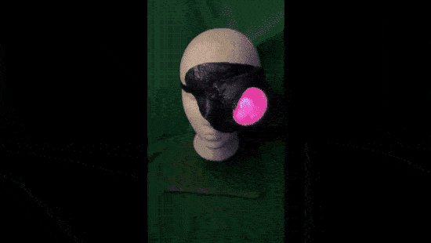](https://twitter.com/caitlinsdad/status/1155683944278482944)

Be a PyBorg for CircuitPython day, by caitlinsdad - [Twitter](https://twitter.com/caitlinsdad/status/1155683944278482944).

## Issue 84 – The MagPi Magazine: Control servos with CircuitPython & Raspberry Pi

[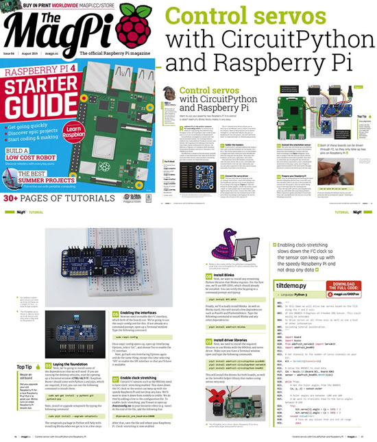](https://www.raspberrypi.org/magpi/issues/84/)

Issue 84 – The MagPi MagazineThe MagPi Magazine.

>_"Get your Raspberry Pi 4 Starter Guide in The MagPi magazine issue #84. Get to know your Raspberry Pi 4 with our in-depth starter guide. We’ll help you take the first steps with your new computer: discover the best way to set up and use a Raspberry Pi 4. Raspberry Pi 4 comes with a whole new operating system, called Raspbian ‘Buster’. Our starter guide has advice on the new features, and how to get the most from Buster. Coding and making with Raspberry Pi is the most fun you can have with a computer. And our starter guide will get you on your way."_

[Read more](https://www.raspberrypi.org/magpi/issues/84/), AND on page 44: Control servos, with CircuitPython and Raspberry Pi. Want to use your powerful new Raspberry Pi 4 to control a robot? Adafruit’s Blinka library makes it very easy by [Melissa LeBlanc-Williams](https://twitter.com/makermelissa?lang=en-gb).

## Issue 21 HackSpace magazine: CircuitPython storage

CircuitPython storage: Save data to the flash drive for later retrieval by Ben Everard –

>_"While investigating the performance of the latest CircuitPython release, we wrote a program to perform some benchmarks and then save the results to the storage so that it can be read by the computer the next time that the device is plugged in. Flash different versions of CircuitPython to the board and, voilà, we had all our benchmarks in one handy place."_

[Read more in Issue 21, HackSpace Magazine](https://hackspace.raspberrypi.org/issues/21) ([PDF page 86](https://magazines-static.raspberrypi.org/issues/full_pdfs/000/000/091/original/HackSpaceMagazine21.pdf)). Full code here: [hsmag.cc/DxIsRz](hsmag.cc/DxIsRz)

## Gizmo for Circuit Playground!

[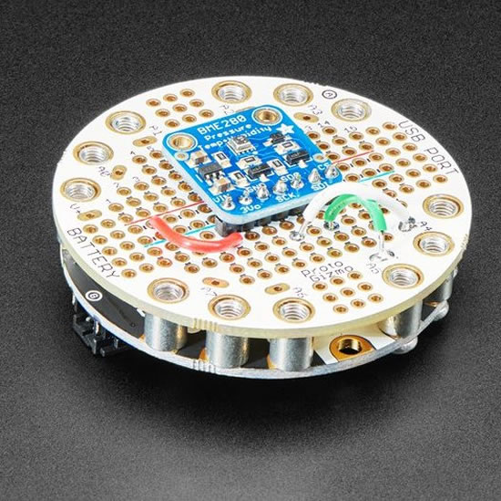](https://www.adafruit.com/product/4320)

Extend and expand CircuitPython-powered Circuit Playground projects with a bolt on Perma-Proto that lets you connect solderable circuits in a sturdy and reliable fashion. This PCB looks just like a solderless breadboard but has permanently affixed M3 standoffs that act as mechanical and electrical connections. Solder to the gold-plated traces to create your custom invention - [Adafruit](https://www.adafruit.com/product/4320).

## stemma and stemma QT - easy connections!

Here is our latest STEMMA Sunday video! - [YouTube](https://youtu.be/_Cu7UOcGL14). STEMMA is not an original idea, we're working within an ecosystem of many other plug and play systems. We started STEMMA in 2014, and intended to be compatible with Grove only (cause that's all that existed at the time) but then when Qwiic came around in 2017, added a smaller connector so we could work with those parts too! STEMMA attempts to be as cross-compatible as possible with both Grove and Gravity (compatible connectors & 3-5V power/logic). STEMMA QT is cross-compatible with Qwiic - STEMMA QT connector/cable is same as Qwiic. You can use STEMMA QT devices with Qwiic devices/controllers - [learn.adafruit.com](https://learn.adafruit.com/introducing-adafruit-stemma-qt?view=all)

## Snekboard v0.2 Update: Snek sneks its way to CircuitPython

Snek sneks its way to CircuitPython, [Keith writes](https://keithp.com/blogs/snekboard-0.2/) - 

>_"I included a [W25Q16 2MB NOR flash chip](https://www.winbond.com/resource-files/w25q16jv%20spi%20revd%2008122016.pdf) on the board so that it could also run CircuitPython. Before finalizing the design, I thought it might be a good idea to actually get that running. I've submitted a [pull request](https://github.com/adafruit/circuitpython/pull/2018) with the necessary changes. I hope to see that merged at some point, which will allow users to select between CircuitPython and snek."_

## Roadmap for next release of MicroPython v1.11 -> v2.0

[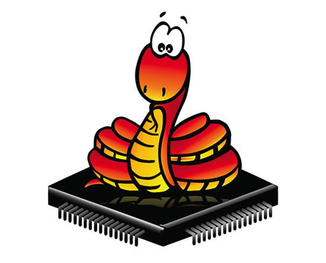](https://github.com/micropython/micropython/issues/4821)

Here's the latest GitHub issue which discusses the roadmap for the next set of features in MicroPython - [GitHub](https://github.com/micropython/micropython/issues/4821).

## News from around the web!

[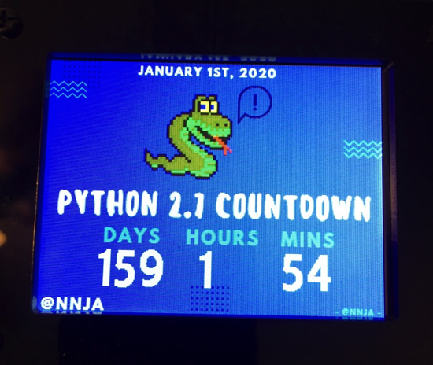](https://twitter.com/Darrell_VA/status/1154577315055243264)

[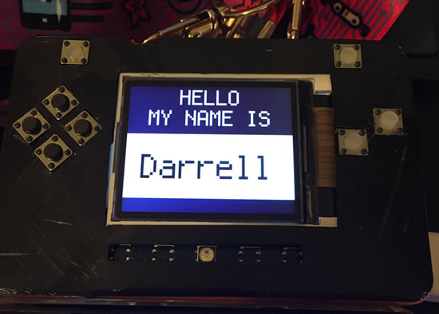](https://twitter.com/Darrell_VA/status/1154577315055243264)

Check out Darrell's PyPortal and PyBade, all set up for PyOhio - [Twitter](https://twitter.com/Darrell_VA/status/1154577315055243264).

Issue 21 HackSpace magazine: [Air quality monitor using adafruit.io](https://blog.adafruit.com/2019/07/19/issue-21-hackspace-magazine-air-quality-monitor-by-ben_everard-adafruit-adafruitio-python-hackspacemag-raspberry_pi/)!

[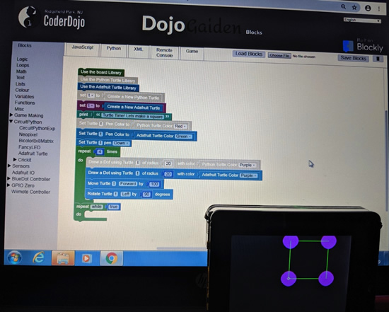](https://twitter.com/RP_NJcoderdojo/status/1154569620734521345)

CoderDojo session using Turtle Graphics on Pyportal, code runs in both Chrome and the Pyportal - [Twitter](https://twitter.com/RP_NJcoderdojo/status/1154569620734521345).

[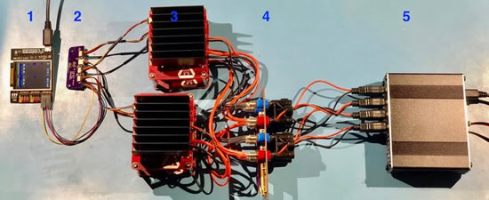](https://www.crowdsupply.com/capable-robot-components/programmable-usb-hub/updates/power-capability-and-testing)

Power Capability & Testing by Capable Robot Components. This is the CircuitPython supported programmable USB Hub with per-port power and data disconnects + dev board + I2C, GPIO, and SPI bridges - [Crowd Supply](https://www.crowdsupply.com/capable-robot-components/programmable-usb-hub/updates/power-capability-and-testing).

Issue 21 HackSpace magazine: [10/10 for the Adafruit Perma-Proto HAT](https://blog.adafruit.com/2019/07/19/issue-21-hackspace-magazine-10-10-for-the-adafruit-perma-proto-hat-for-raspberry_pi-adafruit-raspberrypi-hackspacemag/).

Game Devs of Color Expo was this weekend, [Adafruit was a sponsor](https://gamedevsofcolorexpo.com/sponsor/) (with special thanks to RedHat) -

>_"Game Devs of Color Expo returns to the Schomburg Center in Harlem, New York on July 27, 2019! Join us for the 4th annual Game Devs of Color Expo - an inclusive games expo and conference creating a new normal in games by putting creators of color at the forefront, showing off their games, building conversations, and pushing games forward as an artform. [#GDoCExpo](https://twitter.com/search?q=%23GDoCExpo&src=hashtag_click&f=live)"_

[Read more](https://gamedevsofcolorexpo.com/), and [eventbrite page](https://www.eventbrite.com/e/2019-game-devs-of-color-expo-tickets-57396620838). Check out the live tweets and more with the tag [#GDoCExpo](https://twitter.com/hashtag/GDoCExpo?src=hashtag_click&f=live)

[Custom Kernel Configuration and Device Images](https://www.crowdsupply.com/groboards/giant-board/updates/custom-kernel-configuration-and-device-images) by Chris A at Crowd Supply. Giant Board by Groboards is a single-board computer in the Adafruit Feather form factor.

SAMD51 Support Confirmed; Production + Manufacturing Update - [Crowd Supply](https://www.crowdsupply.com/robotics-masters/robo-hat-mm1/updates/samd51-support-confirmed-production-plus-manufacturing-update) & Quick LED hardware modification to test a new bootloader and latest CircuitPython - [Twitter](https://twitter.com/RoboticMasters/status/1155048123275698177).

Looks like Seeed Studio is gearing up to do some Python on hardware with ArduPy: MicroPython and Arduino - [GitHub](https://github.com/Seeed-Studio/ArduPy).

PyPy JIT for Aarch64 - [PyPy Status Blog](https://morepypy.blogspot.com/2019/07/pypy-jit-for-aarch64.html).

Raspberry Pi Model Railway Automation - [phwallen.github.io/smrc](https://phwallen.github.io/smrc/)

[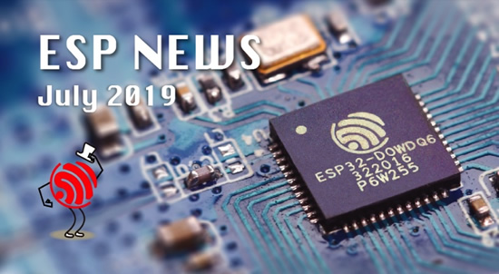](https://mailchi.mp/d16d12b0e004/espressif-esp-news-july-2019?e=ed7e71c663)

ESP News, July 2019 - [Newsletter](https://mailchi.mp/d16d12b0e004/espressif-esp-news-july-2019?e=ed7e71c663).

[Congrats to piwheels! 10,000,000 downloads](https://twitter.com/piwheels/status/1154059992942727170) - [piwheels.org](https://blog.piwheels.org/raspbian-buster-builds-complete/)

[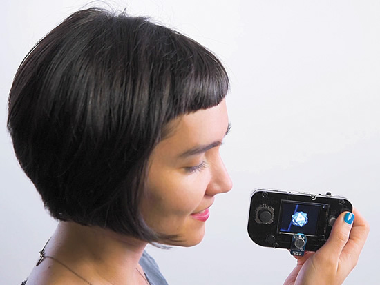](https://spectrum.ieee.org/geek-life/hands-on/machine-learning-thats-light-enough-for-an-arduino)

Machine Learning on the Edge, with Adafruit! - [IEEE Spectrum](https://spectrum.ieee.org/geek-life/hands-on/machine-learning-thats-light-enough-for-an-arduino) & [YouTube](https://youtu.be/v33DGb31HGA).

Pete Warden is the technical lead of the mobile, embedded TensorFlow Group on Google’s Brain team, and was on ASK AN ENGINEER - [YouTube](https://youtu.be/0KPm3n7ZSQU).

Python sample codes for robotics algorithms - [GitHub](https://github.com/AtsushiSakai/PythonRobotics).

GNES is Generic Neural Elastic Search, a cloud-native semantic search system based on deep neural network - [GitHub](https://github.com/gnes-ai/gnes).

“In Search of Excellence” at Apple Computer in 1984 - [YouTube](https://youtu.be/l3agg64LM88). Video posted by Andy Hertzfeld, wow!

>_“In Search Of Excellence” is a documentary produced by John Nathan, based on Tom Peter’s bestselling business book, that profiled six excellent companies. This is the segment about Apple Computer, filmed in the summer of 1984, featuring interviews with Steve Jobs and the original Macintosh team. Highlights include footage of the actual pirate flag waving in the wind._

EXPLORING THE FRONTIERS OF VISUAL IDENTITY DESIGN AS ENVISIONED BY SCIENCE FICTION - [peculativeidentities.com/research](https://speculativeidentities.com/research)

Alibaba's chip division releases first core processor IP (based on RISC-V) - [Adafruit](https://blog.adafruit.com/2019/07/29/alibabas-chip-division-releases-first-core-processor-ip-based-on-risc-v-alibabagroup-riscv/).

Convert Inkscape SVG drawings to KiCad PCB and footprint modules with svg2shenzhen - [GitHub](https://github.com/badgeek/svg2shenzhen/).

kicad_halftone turns raster images in to PCB silkscreen images using halftone technique - [GitHub](https://github.com/ianrrees/kicad_halftone).

[From Matt](https://twitter.com/matt_trentini/status/1153440745652535297) - [@roguelynn](https://twitter.com/roguelynn) has posted her slides from [#europython](https://twitter.com/hashtag/europython?src=hashtag_click) where she dives deep into asyncio. Although not targeting MicroPython specifically, this is invaluable for anyone using asyncio (including on MicroPython) - [asyncio: We Did It Wrong](https://www.roguelynn.com/words/asyncio-we-did-it-wrong/).

Are We Really Making Much Progress? A Worrying Analysis of Recent Neural Recommendation Approaches - [arXiv.org](https://arxiv.org/abs/1907.06902v1)

Unraveling the JPEG - [parametric.press](https://parametric.press/issue-01/unraveling-the-jpeg/)

Working with MIDI data in Python using Mido - [twillio blog](https://www.twilio.com/blog/working-with-midi-data-in-python-using-mido).

Secure Everything with Azure Sphere – [Hackster.io](https://www.hackster.io/contests/SecureEverything)

CircuitPython Weekly July 29th, 2019 [on YouTube](https://youtu.be/upkOsW_hCEk) and [on diode.zone](https://diode.zone/videos/watch/1006a100-1535-4477-8d6c-1c9b3c23d041)

PyDev of the Week: Ines Montani on [Mouse vs Python](https://www.blog.pythonlibrary.org/2019/07/29/pydev-of-the-week-ines-montani/)

## ICYDNCI - In case ya did not click it ...

ICYDNCI! What was the most popular, most clicked link, in [last week's newsletter](https://www.adafruitdaily.com/2019/07/23/python-on-hardware-circuitpython-gets-10-out-of-10-for-speed-from-hackspace-python-adafruit-circuitpython-pythonhardware-circuitpython-micropython-thepsf-adafruit/)? A speedier CircuitPython gets 10 out of 10 in the [latest issue of HackSpace Magazine](https://hackspace.raspberrypi.org/features/circuitpython-4-1-0-review)!

## Made with Mu - A HyperCard inspired GUI framework for beginner developers in Python

[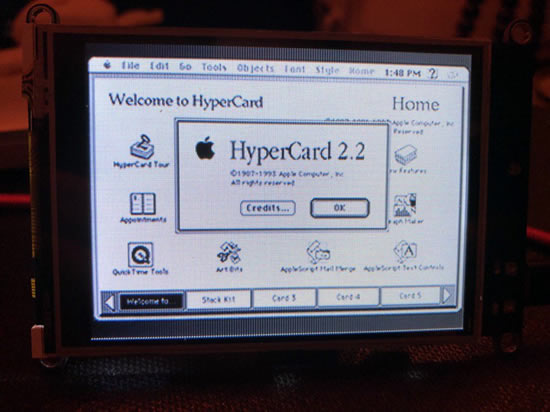](https://github.com/ntoll/pypercard)

A HyperCard inspired GUI framework for beginner developers in Python - [GitHub](https://github.com/ntoll/pypercard).

Nicholas Tollervey is looking for feedback and more PyperCard! - [Twitter](https://twitter.com/ntoll/status/1155567530876055552).

>_"A re-implementation of Adafruit's CircuitPython PYOA module for non-CircuitPython computing environments. This module re-uses the JSON specification used to create HyperCard like "stacks" of states between which users transition in a Python-your-own-adventure style."_

Why Mu? Mu tries to make it as easy as possible to get started with programming but aims to help you graduate to "real" development tools soon after. Everything in Mu is the "real thing" but presented in as simple and obvious way possible. It's like the toddling stage in learning to walk: you're finding your feet and once you're confident, you should move on and explore! Put simply, Mu aims to foster autonomy. Try out Mu today! - [codewith.mu](https://codewith.mu/)

## Coming soon

Hallowing M4 - [YouTube](https://youtu.be/4qf8WsLopQQ).

PyPortal Pynt. A tiny PyPortal. "Pint" sized, get it?

[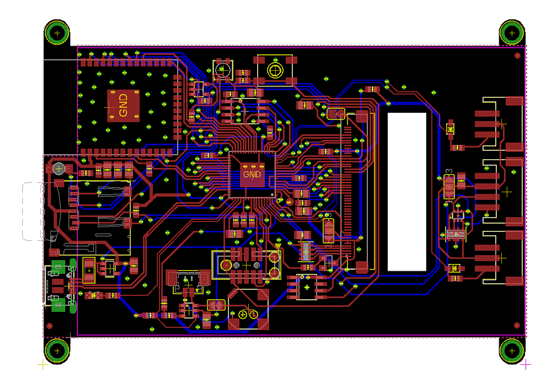](https://www.adafruit.com/new)

PyPortal ... "MEGA"? not sure what we're gonna call this yet, it's big!  It looks just like the PyPortal but this one has a small change - instead of a 320x240 pixel display, its a 3.5" 320x480, so twice as many pixels in about the same size!

Here are the names we are thinking of :) It's Pygantic!

PyPortal Aorta, PyPortal Atrium Colonnade, PyPortal Axis, PyPortal Beast Mode, PyPortal Billboard, PyPortal Boa, PyPortal Bridge, PyPortal Brydge, PyPortal Cavern, PyPortal Chanter, PyPortal Chonk, PyPortal Cinepy, PyPortal Companion, PyPortal Dolmen, PyPortal Drive-in, PyPortal Drive-py, PyPortal Eleven, PyPortal Epyc, PyPortal Eye-oh-tee, PyPortal Fetch, PyPortal Friend, PyPortal Fynd, PyPortal Gigantic (a big big love), PyPortal Grande, PyPortal Guide, PyPortal Guru, PyPortal Henge, PyPortal Hyper, PyPortal Impart, PyPortal Kiosk, PyPortal Locate, PyPortal Loggia, PyPortal Mentor, PyPortal Monolith, PyPortal Muri, PyPortal Neuron, PyPortal Oracle, PyPortal Pangolin, PyPortal Pano, PyPortal Panorama, PyPortal Panoramic, PyPortal Panos, PyPortal Piazza, PyPortal Picta, PyPortal Portico, PyPortal Py-oh-tee, PyPortal PyEye, PyPortal PyPad, PyPortal PyPanel, PyPortal PyPath, PyPortal Pyosk, PyPortal Pytcher, PyPortal Quake, PyPortal Scout, PyPortal Sensei, PyPortal Shift, PyPortal Stout, PyPortal Teleport, PyPortal Teton, PyPortal Titano, PyPortal Traveller, PyPortal Window, PyPortal Wisdom, PyPortal Wise, PyPortal X , PyPortal X2 ... Deep Dish PyPortal, Heckin PyPortal, and Hella PyPortal.

Designing the Machine Learning board on the EDGE… BRAINCRAFT! [YouTube](https://youtu.be/mezMYQMWQWk) & [blog post on Adafruit](https://blog.adafruit.com/2019/07/28/designing-the-machine-learning-board-on-the-edge-braincraft-tensorflow-adafruit-machinelearning-tinyml/).

[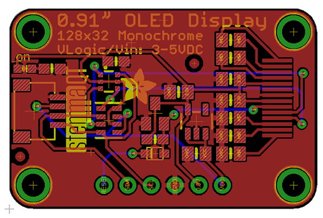](https://www.adafruit.com/new)

stemmaQT OLED!

[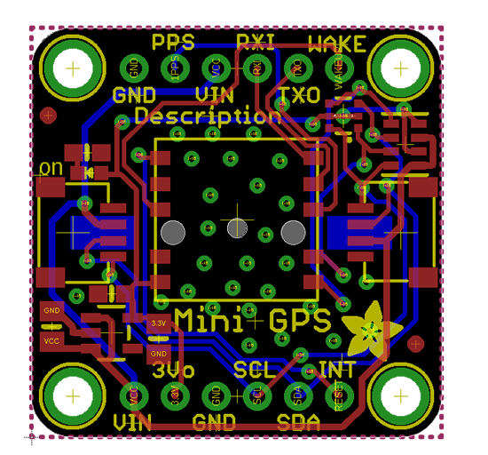](https://www.adafruit.com/new)

This STEMMA QT - equipped GPS unit is I2C compatible (whew no UART required) and is only 1"x1" for a super compact GPS/GLONASS receiver. The backup battery is on the back.

Another secure chip... in stemma QT format!

[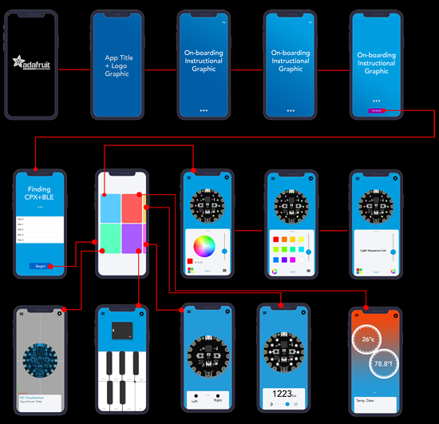](https://www.adafruit.com/new)

Trevor at Adafruit is working on the features and interface for our new app Circuit Playground Express BlueFruit.

## New Learn Guides!

## Updated Guides - Now With More Python!

**You can use CircuitPython libraries on Raspberry Pi!** We're updating all of our CircuitPython guides to show how to wire up sensors to your Raspberry Pi, and load the necessary CircuitPython libraries to get going using them with Python. We'll be including the updates here so you can easily keep track of which sensors are ready to go. Check it out!

## CircuitPython Libraries!

CircuitPython support for hardware continues to grow. We are adding support for new sensors and breakouts all the time, as well as improving on the drivers we already have. As we add more libraries and update current ones, you can keep up with all the changes right here!

For the latest drivers, download the [Adafruit CircuitPython Library Bundle](https://github.com/adafruit/Adafruit_CircuitPython_Bundle/releases/latest).

If you'd like to contribute, CircuitPython libraries are a great place to start. Have an idea for a new driver? File an issue on [CircuitPython](https://github.com/adafruit/circuitpython/issues)! Interested in helping with current libraries? Check out [this GitHub issue on CircuitPython](https://github.com/adafruit/circuitpython/issues/1246) for an overview of the State of the CircuitPython Libraries, updated each week. We've included open issues from the library issue lists, and details about repo-level issues that need to be addressed. We have a guide on [contributing to CircuitPython with Git and Github](https://learn.adafruit.com/contribute-to-circuitpython-with-git-and-github) if you need help getting started. You can also find us in the #circuitpython channel on the [Adafruit Discord](https://adafru.it/discord). Feel free to contact Kattni (@kattni) with any questions.

You can check out this [list of all the CircuitPython libraries and drivers available](https://github.com/adafruit/Adafruit_CircuitPython_Bundle/blob/master/circuitpython_library_list.md). 

The current number of CircuitPython libraries is **171**!

**New Libraries!**

Here's this week's new CircuitPython libraries:

 * [Adafruit_CircuitPython_DisplayIO_SSD1306](https://github.com/adafruit/Adafruit_CircuitPython_DisplayIO_SSD1306)
 * [Adafruit_CircuitPython_Requests](https://github.com/adafruit/Adafruit_CircuitPython_Requests)
 * [Adafruit_CircuitPython_SSD1325](https://github.com/adafruit/Adafruit_CircuitPython_SSD1325)
 * [Adafruit_CircuitPython_SSD1322](https://github.com/adafruit/Adafruit_CircuitPython_SSD1322)
 * [Adafruit_CircuitPython_SSD1327](https://github.com/adafruit/Adafruit_CircuitPython_SSD1327)

**Updated Libraries!**

Here's this week's updated CircuitPython libraries:

 * [Adafruit_CircuitPython_SI5351](https://github.com/adafruit/Adafruit_CircuitPython_SI5351)
 * [Adafruit_CircuitPython_CursorControl](https://github.com/adafruit/Adafruit_CircuitPython_CursorControl)
 * [Adafruit_CircuitPython_ST7789](https://github.com/adafruit/Adafruit_CircuitPython_ST7789)
 * [Adafruit_CircuitPython_PyBadger](https://github.com/adafruit/Adafruit_CircuitPython_PyBadger)
 * [Adafruit_CircuitPython_PYOA](https://github.com/adafruit/Adafruit_CircuitPython_PYOA)
 * [Adafruit_CircuitPython_ILI9341](https://github.com/adafruit/Adafruit_CircuitPython_ILI9341)
 * [Adafruit_CircuitPython_seesaw](https://github.com/adafruit/Adafruit_CircuitPython_seesaw)
 * [Adafruit_CircuitPython_ESP32SPI](https://github.com/adafruit/Adafruit_CircuitPython_ESP32SPI)
 * [Adafruit_CircuitPython_PyPortal](https://github.com/adafruit/Adafruit_CircuitPython_PyPortal)

**PyPI Download Stats!**

We've written a special library called Adafruit Blinka that makes it possible to use CircuitPython Libraries on [Raspberry Pi and other compatible single-board computers](https://learn.adafruit.com/circuitpython-on-raspberrypi-linux/). Adafruit Blinka and all the CircuitPython libraries have been deployed to PyPI for super simple installation on Linux! Here are the top 10 CircuitPython libraries downloaded from PyPI in the last week, including the total downloads for those libraries:

| Library                                     | Last Week   | Total |   
|:-------                                     |:--------:   |:-----:|   
| Adafruit-Blinka                             | 1069        | 42089 |   
| Adafruit_CircuitPython_BusDevice            | 705         | 17494 |   
| Adafruit_CircuitPython_MCP230xx             | 407         | 4133 |    
| Adafruit_CircuitPython_seesaw               | 211         | 1618 |    
| Adafruit_CircuitPython_NeoPixel             | 146         | 6362 |    
| Adafruit_CircuitPython_Register             | 139         | 7504 |    
| Adafruit_CircuitPython_Motor                | 105         | 5052 |    
| Adafruit_CircuitPython_BME280               | 91          | 2525 |    
| Adafruit_CircuitPython_PCA9685              | 90          | 4536 |    
| Adafruit_CircuitPython_ESP32SPI             | 87          | 1511 |    

## Upcoming events!

Open Source Summit and Embedded Linux Conference, August 21 – 23, 2019 at the Hilton San Diego Bayfront. The Open Source Summit North America combines with Embedded Linux Conference North America (ELC).  ELC has been a vendor-neutral technical conference where developers working on embedded Linux and industrial IoT products and deployments gather for education and collaboration. Open Source Summit brings together developers and open source professionals to collaborate and learn about the latest technologies - [Linux Foundation](https://www.linuxfoundation.org/press-release/2019/05/open-source-summit-to-include-embedded-linux-conference-bring-together-both-technical-and-leadership-programs-under-one-roof/).

PYCON UK 2019 - Cardiff City Hall, Friday 13th to Tuesday 17th September. PyCon UK is back at Cardiff City Hall, for five days of talks, workshops and collaboration. The conference also features a young coders' day, themes dedicated to science and education, and numerous Python-related events - [PyCon UK](https://2019.pyconuk.org/).

[October is Open Hardware Month @ Open Source Hardware Association](https://www.oshwa.org/2019/07/26/october-is-open-hardware-month-2/).

>_"October is Open Hardware Month! Check out the [Open Hardware Month website](http://ohm.oshwa.org/). Host an event, find a local event, or [certify](https://certification.oshwa.org/) your hardware to support Open Source Hardware. We are providing resources and asking you, the community, to host small, local events in the name of open source hardware. Tell us about your October event by f[illing out the form below](https://docs.google.com/forms/d/e/1FAIpQLSfjvJmcRXbpgjRACgY_BbaDzQZRa6wxEcP-xwaBpC0X6mvsPw/viewform). Your event will be featured on [OSHWA’s Open Hardware Month page](http://ohm.oshwa.org/) (provided you have followed OSHWA’s rules listed on the [“Do’s and Don’ts”](http://ohm.oshwa.org/dos-and-donts/) page)."_

[Read more](https://www.oshwa.org/2019/07/26/october-is-open-hardware-month-2/), [Tweet for speakers in 2020](https://twitter.com/ohsummit/status/1154881782677831680), and Open Hardware Month @ [http://ohm.oshwa.org/](http://ohm.oshwa.org/)

micro:bit Live 2019 is coming to BBC MediaCityUK, Greater Manchester, England on October 4-5. This will be the very first annual gathering of the global micro:bit community of educators and partners - [micro:bit](https://microbit.org/en/2019-04-12-microbit-live/).

## 2020 Open Hardware Summit – March 13th 2020, Tishman Auditorium at NYU School of Law, New York

The Open Hardware. In 2020, we will be celebrating tenth anniversary of the Open Hardware Summit. The 2020 Open Hardware Summit will be held Friday, March 13th, 2020 at Tishman Auditorium – NYU School of Law located at 63 5th Ave, New York, NY 10003, USA.

In addition to it being the 10th of the Open Hardware Summit, it's the 20th aniversary of the keyhole logo that evolved to the logo for the Open Source Association as well as the community-made Open-Source Hardware logo.

## Latest releases

CircuitPython's stable release is [4.0.2](https://github.com/adafruit/circuitpython/releases/latest) and its unstable release is [4.1.0-rc.1](https://github.com/adafruit/circuitpython/releases). New to CircuitPython? Start with our [Welcome to CircuitPython Guide](https://learn.adafruit.com/welcome-to-circuitpython).

[20190729](https://github.com/adafruit/Adafruit_CircuitPython_Bundle/releases/latest) is the latest CircuitPython library bundle.

[v1.11](https://micropython.org/download) is the latest MicroPython release. Documentation for it is [here](http://docs.micropython.org/en/latest/pyboard/).

[3.7.4](https://www.python.org/downloads/) is the latest Python release. The latest pre-release version is [3.8.0b2](https://www.python.org/download/pre-releases/).

[1,321 Stars](https://github.com/adafruit/circuitpython/stargazers) Like CircuitPython? [Star it on GitHub!](https://github.com/adafruit/circuitpython)

## Call for help – CircuitPython messaging to other languages!

We [posted on the Adafruit blog](https://blog.adafruit.com/2018/08/15/help-bring-circuitpython-messaging-to-other-languages-circuitpython/) about bringing CircuitPython messaging to other languages, one of the exciting features of CircuitPython 4.x is translated control and error messages. Native language messages will help non-native English speakers understand what is happening in CircuitPython even though the Python keywords and APIs will still be in English. If you would like to help, [please post](https://github.com/adafruit/circuitpython/issues/1098) to the main issue on GitHub and join us on [Discord](https://adafru.it/discord).

We made this graphic with translated text, we could use your help with that to make sure we got the text right, please check out the text in the image – if there is anything we did not get correct, please let us know. Dan sent me this [handy site too](http://helloworldcollection.de/#Human).

## jobs.adafruit.com

[jobs.adafruit.com](https://jobs.adafruit.com/) has returned and folks are posting their skills (including CircuitPython) and companies are looking for talented makers to join their companies - from Digi-Key, to Hackaday, Microcenter, Raspberry Pi and more.

## 13,295 thanks!

The Adafruit Discord community, where we do all our CircuitPython development in the open, reached over 13,295 humans, thank you! Join today! [https://adafru.it/discord](https://adafru.it/discord)

Discord now offers "server boosts" we have 12 on our server (level 2), if we get to 50 boosts we get to level 3 and some other good features for the community: +100 emojis for a total of 250, 384 Kbps audio, vanity URL, 100 mb uploads for all members (and all the things we have now, like the server banner). Stop by and boost! [https://adafru.it/discord](https://adafru.it/discord).

## ICYMI - In case you missed it

The wonderful world of Python on hardware! This is our first video-newsletter-podcast that we’ve started! The news comes from the Python community, Discord, Adafruit communities and more. It’s part of the weekly newsletter, then we have a segment on ASK an ENGINEER and this is the video slice from that! The complete Python on Hardware weekly VideoCast [playlist is here](https://www.youtube.com/playlist?list=PLjF7R1fz_OOXRMjM7Sm0J2Xt6H81TdDev). 

This video podcast is on [iTunes](https://itunes.apple.com/us/podcast/python-on-hardware/id1451685192?mt=2), [YouTube](https://www.youtube.com/playlist?list=PLjF7R1fz_OOXRMjM7Sm0J2Xt6H81TdDev), [IGTV (Instagram TV](https://www.instagram.com/adafruit/channel/)), and [XML](https://itunes.apple.com/us/podcast/python-on-hardware/id1451685192?mt=2).

[Weekly community chat on Adafruit Discord server CircuitPython channel - Audio / Podcast edition](https://itunes.apple.com/us/podcast/circuitpython-weekly-meeting/id1451685016) - Audio from the Discord chat space for CircuitPython, meetings are usually Mondays at 2pm ET, this is the audio version on [iTunes](https://itunes.apple.com/us/podcast/circuitpython-weekly-meeting/id1451685016), Pocket Casts, [Spotify](https://adafru.it/spotify), and [XML feed](https://adafruit-podcasts.s3.amazonaws.com/circuitpython_weekly_meeting/audio-podcast.xml).

And lastly, we are working up a one-spot destination for all things podcast-able here - [podcasts.adafruit.com](https://podcasts.adafruit.com/)

## Codecademy "Learn Hardware Programming with CircuitPython"

Codecademy, an online interactive learning platform used by more than 45 million people, has teamed up with the leading manufacturer in STEAM electronics, Adafruit Industries, to create a coding course, "Learn Hardware Programming with CircuitPython". The course is now available in the [Codecademy catalog](https://www.codecademy.com/learn/learn-circuitpython?utm_source=adafruit&utm_medium=partners&utm_campaign=circuitplayground&utm_content=pythononhardwarenewsletter).

Python is a highly versatile, easy to learn programming language that a wide range of people, from visual effects artists in Hollywood to mission control at NASA, use to quickly solve problems. But you don’t need to be a rocket scientist to accomplish amazing things with it. This new course introduces programmers to Python by way of a microcontroller — CircuitPython — which is a Python-based programming language optimized for use on hardware.

CircuitPython’s hardware-ready design makes it easier than ever to program a variety of single-board computers, and this course gets you from no experience to working prototype faster than ever before. Codecademy’s interactive learning environment, combined with Adafruit's highly rated Circuit Playground Express, present aspiring hardware hackers with a never-before-seen opportunity to learn hardware programming seamlessly online.

Whether for those who are new to programming, or for those who want to expand their skill set to include physical computing, this course will have students getting familiar with Python and creating incredible projects along the way. By the end, students will have built their own bike lights, drum machine, and even a moisture detector that can tell when it's time to water a plant.

Visit Codecademy to access the [Learn Hardware Programming with CircuitPython](https://www.codecademy.com/learn/learn-circuitpython?utm_source=adafruit&utm_medium=partners&utm_campaign=circuitplayground&utm_content=pythononhardwarenewsletter) course and Adafruit to purchase a [Circuit Playground Express](https://www.adafruit.com/product/3333).

Codecademy has helped more than 45 million people around the world upgrade their careers with technology skills. The company’s online interactive learning platform is widely recognized for providing an accessible, flexible, and engaging experience for beginners and experienced programmers alike. Codecademy has raised a total of $43 million from investors including Union Square Ventures, Kleiner Perkins, Index Ventures, Thrive Capital, Naspers, Yuri Milner and Richard Branson, most recently raising its $30 million Series C in July 2016.

## Contribute!

The CircuitPython Weekly Newsletter is a CircuitPython community-run newsletter emailed every Tuesday. The complete [archives are here](https://www.adafruitdaily.com/category/circuitpython/). It highlights the latest CircuitPython related news from around the web including Python and MicroPython developments. To contribute, edit next week's draft [on GitHub](https://github.com/adafruit/circuitpython-weekly-newsletter/tree/gh-pages/_drafts) and [submit a pull request](https://help.github.com/articles/editing-files-in-your-repository/) with the changes. Join our [Discord](https://adafru.it/discord) or [post to the forum](https://forums.adafruit.com/viewforum.php?f=60) for any further questions.
