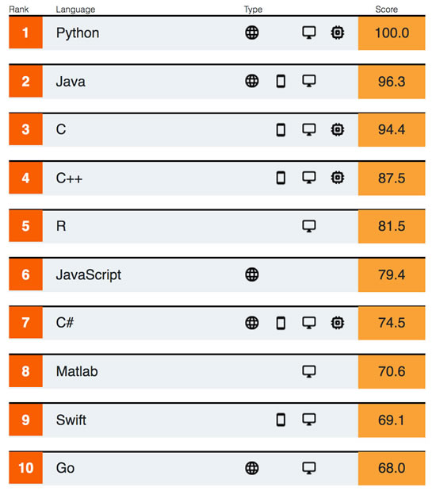
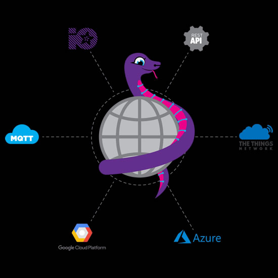

- [ ] update title
- [ ] Link "View this email in your browser."

View this email in your browser.

## Hanselminutes Technology Podcast – Learning CircuitPython with Scott Shawcroft

Hanselminutes Technology Podcast – Fresh Air and Fresh Perspectives for Developers – [Learning CircuitPython with Scott Shawcroft](https://www.hanselminutes.com/701/learning-circuitpython-with-scott-shawcroft):

>_"CircuitPython is a programming language designed to simplify experimenting and learning to code on low-cost microcontroller boards. The history of CircuitPython begins with MicroPython, a Python interpreter written from scratch for embedded systems by Damien George starting in 2013. Three years later, Adafruit hired Shawcroft to port MicroPython to the SAMD21 chip they use on many of their boards. The Scott talks about how to lower the barrier to entry and how to enable beginners to be productive with CircuitPython."_

[Listen in!](https://www.hanselminutes.com/701/learning-circuitpython-with-scott-shawcroft) And please [subscribe!](https://hanselminutes.com/subscribe) Hanselminutes Technology Podcast is on [iTunes,](https://itunes.apple.com/us/podcast/hanselminutes/id117488860) [Spotify](https://open.spotify.com/show/4SrTUZr1s5C4SJmUxDIUDc), [Google Play](https://play.google.com/music/listen?u=0#/ps/Ixvhlgjbehlg2ipt76p7yvppsfy), [Twitter](https://twitter.com/hanselminutes), or [download the MP3](https://dts.podtrac.com/redirect.mp3/cdn.simplecast.com/audio/248323/24832310-78fe-4898-91be-6db33696c4ba/07d9c36f-1b8d-4a13-b9e7-512c61daa4cc/hm701_tc.mp3). Share on [Twitter](https://twitter.com/intent/tweet?url=https://www.hanselminutes.com/701/learning-circuitpython-with-scott-shawcroft&text=Hanselminutes%20Technology%20Podcast%20-%20Fresh%20Air%20and%20Fresh%20Perspectives%20for%20Developers%20-%20Learning%20CircuitPython%20with%20Scott%20Shawcroft&via=shanselman) and [Facebook](https://facebook.com/sharer.php?u=https://www.hanselminutes.com/701/learning-circuitpython-with-scott-shawcroft). Also, see their [survey](https://www.podtrac.com/audience/start-survey.aspx?pubid=sGJprX9Qdv6w&ver=short)!

## 14,000 thank yous

Discord, and post on Adafruit.

## Call for Proposals for PyCon 2020 is open!

[Call for Proposals for PyCon 2020 is open](https://pycon.blogspot.com/2019/09/call-for-proposals-for-pycon-2020-is.html) -

>_"We need beginner, intermediate, and advanced proposals on all sorts of topics as well as beginner, intermediate, and advanced speakers to present talks. You don’t need to be a 20-year veteran who has spoken at dozens of conferences. On all fronts, we need all types of people. That’s what this community is comprised of, so that’s what this conference’s schedule should be made from."_

## The S in IoT stands for security

The running joke is that the ‘S’ in IoT stands for security…cause its never there. But safety and security is something you will need to think about at all steps of your design process. There’s going to be billions of IoT devices on-line around the world, many of which will be connected to the Internet, and almost all of them will be unmonitored. A 2015 survey by authentication service provider Auth0 found that 85% of IoT developers admitted to being pressured to get a product to market before adequate security could be implemented. And as an engineer, you’re probably used to that pressure to get a product to market, in which case, selling features often get more attention than security.

With more and more of these connected devices being rushed to market, they’ve become a lucrative target. The 2016 Mirai botnet attack used unsecured CCTV cameras that were connected to the Internet to launch a crippling denial of service attack. That one wasn’t even using the cameras to spy on people, it was just using the TCP/IP stack of the embedded linux device to send lots of junk traffic.

Having security as a priority for your engineering and marketing team will not just help you sleep well at night. As we’ve seen with the European GDPR regulations, privacy and security are being legislated. Having poor security will now get you fined and banned in the marketplace. It’s nearly impossible to add security after the fact, so if you want to avoid a devastating recall – listen up and take security seriously.

Whatch the full vide here - [YouTube](https://youtu.be/ISHqKL1okno).

## A mini PiTFT display with STEMMA QT connector

As displays have gotten smaller and higher res, we've seen some really cute mini TFTs. this one is only 1.1" but has 240x135 pixels, great for a little display. we wrote a kernel driver for it, and with the STEMMA QT connector on the bottom, its ez to connect sensors like this MSA301. Then run python scripts to print out the motion output. Fun! - [YouTube](https://youtu.be/DR8Q3fwvGZY).

## News from around the web!

CPX pinouts for the upcoming CircuitPython book in Japan - [Twitter](https://twitter.com/AoyamaProd/status/1172459088724185088).

Five Minutes With…Yunsup Lee, CTO, SiFive - [Embedded Insiders Podcast](https://www.embedded-computing.com/embedded-insiders/five-minutes-with-yungsup-lee-cto-sifive).

Hack Chat recap! - [hackaday.io](https://hackaday.io/event/166253-machine-learning-with-microcontrollers-hack-chat)

The [2020 Open Hardware Summit sponsorships are now open](http://2020.oshwa.org/sponsor/), [Adafruit is a sponsor](https://blog.adafruit.com/2019/09/13/2020-open-hardware-summit-sponsorships-now-open-oshwa-ohsummit20-ohsummit/).

#ICYDNCI What was the most popular, most clicked link, in [last week's newsletter](https://www.adafruitdaily.com/2019/09/10/the-top-programming-languages-2019-python-tops-the-charts-with-a-circuitpython-nod-python-adafruit-circuitpython-pythonhardware-circuitpython-micropython-thepsf-adafruit/)? [The Top Programming Languages 2019 – Python tops the charts with a CircuitPython nod!](https://spectrum.ieee.org/computing/software/the-top-programming-languages-2019).

## Made with Mu

Why Mu? Mu tries to make it as easy as possible to get started with programming but aims to help you graduate to "real" development tools soon after. Everything in Mu is the "real thing" but presented in as simple and obvious way possible. It's like the toddling stage in learning to walk: you're finding your feet and once you're confident, you should move on and explore! Put simply, Mu aims to foster autonomy. Try out Mu today! - [codewith.mu](https://codewith.mu/)

## Coming soon

## New Learn Guides!

[Create Custom APIs for PyPortal](https://learn.adafruit.com/using-dashblock-to-create-custom-apis-for-pyportal) from [Isaac Wellish](https://learn.adafruit.com/users/isaacwellish)

[CircuitPython Libraries on Linux and the NVIDIA Jetson Nano](https://learn.adafruit.com/circuitpython-libraries-on-linux-and-the-nvidia-jetson-nano) from [Melissa LeBlanc-Williams](https://learn.adafruit.com/users/MakerMelissa)

[Adafruit TLV493 Triple-Axis Magnetometer](https://learn.adafruit.com/adafruit-tlv493-triple-axis-magnetometer) from [Bryan Siepert](https://learn.adafruit.com/users/siddacious)

[AdaBox 013](https://learn.adafruit.com/adabox013) from [John Park](https://learn.adafruit.com/users/johnpark)

## Updated Guides - Now With More Python!

**You can use CircuitPython libraries on Raspberry Pi!** We're updating all of our CircuitPython guides to show how to wire up sensors to your Raspberry Pi, and load the necessary CircuitPython libraries to get going using them with Python. We'll be including the updates here so you can easily keep track of which sensors are ready to go. Check it out!

Keep checking back for more updated guides!

## CircuitPython Libraries!

CircuitPython support for hardware continues to grow. We are adding support for new sensors and breakouts all the time, as well as improving on the drivers we already have. As we add more libraries and update current ones, you can keep up with all the changes right here!

For the latest drivers, download the [Adafruit CircuitPython Library Bundle](https://circuitpython.org/libraries).

If you'd like to contribute, CircuitPython libraries are a great place to start. Have an idea for a new driver? File an issue on [CircuitPython](https://github.com/adafruit/circuitpython/issues)! Interested in helping with current libraries? Check out [this GitHub issue on CircuitPython](https://github.com/adafruit/circuitpython/issues/1246) for an overview of the State of the CircuitPython Libraries, updated each week. We've included open issues from the library issue lists, and details about repo-level issues that need to be addressed. We have a guide on [contributing to CircuitPython with Git and Github](https://learn.adafruit.com/contribute-to-circuitpython-with-git-and-github) if you need help getting started. You can also find us in the #circuitpython channel on the [Adafruit Discord](https://adafru.it/discord). Feel free to contact Kattni (@kattni) with any questions.

You can check out this [list of all the CircuitPython libraries and drivers available](https://github.com/adafruit/Adafruit_CircuitPython_Bundle/blob/master/circuitpython_library_list.md). 

The current number of CircuitPython libraries is **186**!

**New Libraries!**

Here's this week's new CircuitPython libraries:

 * [Adafruit_CircuitPython_IL91874](https://github.com/adafruit/Adafruit_CircuitPython_IL91874)
 * [Adafruit_CircuitPython_IL0398](https://github.com/adafruit/Adafruit_CircuitPython_IL0398)
 * [Adafruit_CircuitPython_PCT2075](https://github.com/adafruit/Adafruit_CircuitPython_PCT2075)

**Updated Libraries!**

Here's this week's updated CircuitPython libraries:

 * [Adafruit_CircuitPython_hashlib](https://github.com/adafruit/Adafruit_CircuitPython_hashlib)
 * [Adafruit_CircuitPython_Slideshow](https://github.com/adafruit/Adafruit_CircuitPython_Slideshow)
 * [Adafruit_CircuitPython_CursorControl](https://github.com/adafruit/Adafruit_CircuitPython_CursorControl)
 * [Adafruit_CircuitPython_HT16K33](https://github.com/adafruit/Adafruit_CircuitPython_HT16K33)
 * [Adafruit_CircuitPython_EPD](https://github.com/adafruit/Adafruit_CircuitPython_EPD)
 * [Adafruit_CircuitPython_RSA](https://github.com/adafruit/Adafruit_CircuitPython_RSA)
 * [Adafruit_CircuitPython_BNO055](https://github.com/adafruit/Adafruit_CircuitPython_BNO055)

**PyPI Download Stats!**

We've written a special library called Adafruit Blinka that makes it possible to use CircuitPython Libraries on [Raspberry Pi and other compatible single-board computers](https://learn.adafruit.com/circuitpython-on-raspberrypi-linux/). Adafruit Blinka and all the CircuitPython libraries have been deployed to PyPI for super simple installation on Linux! Here are the top 10 CircuitPython libraries downloaded from PyPI in the last week, including the total downloads for those libraries:

| Library                                     | Last Week   | Total |   
|:-------                                     |:--------:   |:-----:|   
| Adafruit-Blinka                             | 1396        | 46767 |   
| Adafruit_CircuitPython_BusDevice            | 863         | 21134 |   
| Adafruit_CircuitPython_MCP230xx             | 430         | 6462 |    
| Adafruit_CircuitPython_Register             | 208         | 7327 |    
| Adafruit_CircuitPython_ESP32SPI             | 203         | 1769 |    
| Adafruit_CircuitPython_Motor                | 165         | 5422 |    
| Adafruit_CircuitPython_NeoPixel             | 157         | 6350 |    
| Adafruit_CircuitPython_ADS1x15              | 156         | 2854 |    
| Adafruit_CircuitPython_PCA9685              | 150         | 4830 |    
| Adafruit_CircuitPython_ServoKit             | 131         | 3727 |    

## Upcoming events!

[October is Open Hardware Month @ Open Source Hardware Association](https://www.oshwa.org/2019/07/26/october-is-open-hardware-month-2/).

>_"October is Open Hardware Month! Check out the [Open Hardware Month website](http://ohm.oshwa.org/). Host an event, find a local event, or [certify](https://certification.oshwa.org/) your hardware to support Open Source Hardware. We are providing resources and asking you, the community, to host small, local events in the name of open source hardware. Tell us about your October event by f[illing out the form below](https://docs.google.com/forms/d/e/1FAIpQLSfjvJmcRXbpgjRACgY_BbaDzQZRa6wxEcP-xwaBpC0X6mvsPw/viewform). Your event will be featured on [OSHWA’s Open Hardware Month page](http://ohm.oshwa.org/) (provided you have followed OSHWA’s rules listed on the [“Do’s and Don’ts”](http://ohm.oshwa.org/dos-and-donts/) page)."_

[Read more](https://www.oshwa.org/2019/07/26/october-is-open-hardware-month-2/), [Tweet for speakers in 2020](https://twitter.com/ohsummit/status/1154881782677831680), and Open Hardware Month @ [http://ohm.oshwa.org/](http://ohm.oshwa.org/)

PyCon DE & PyData Berlin // October 9 - 13 2019. Main conference, 3 days of talks and workshops. More than 100 sessions dedicated to PyData (artificial intelligence, machine learning, ethics...) and Python topics (programming, DevOps, Web, Django...) - [de.pycon.org](https://de.pycon.org/).

micro:bit Live 2019 is coming to BBC MediaCityUK, Greater Manchester, England on October 4-5. This will be the very first annual gathering of the global micro:bit community of educators and partners - [micro:bit](https://microbit.org/en/2019-04-12-microbit-live/).

Hackaday Superconference is November 15th, 16th, and 17th in Pasadena, California, USA. The Hackaday Superconference is returning for another 3 full days of technical talks, badge hacking, and hands-on workshops: [Eventbrite](https://www.eventbrite.com/e/hackaday-superconference-2019-tickets-60129236164?aff=0626com
) & [hackaday.io](https://hackaday.io/superconference/)

## Latest releases

CircuitPython's stable release is [#.#.#](https://github.com/adafruit/circuitpython/releases/latest) and its unstable release is [#.#.#-##.#](https://github.com/adafruit/circuitpython/releases). New to CircuitPython? Start with our [Welcome to CircuitPython Guide](https://learn.adafruit.com/welcome-to-circuitpython).

[2019####](https://github.com/adafruit/Adafruit_CircuitPython_Bundle/releases/latest) is the latest CircuitPython library bundle.

[v#.#.#](https://micropython.org/download) is the latest MicroPython release. Documentation for it is [here](http://docs.micropython.org/en/latest/pyboard/).

[#.#.#](https://www.python.org/downloads/) is the latest Python release. The latest pre-release version is [#.#.#](https://www.python.org/download/pre-releases/).

[1381 Stars](https://github.com/adafruit/circuitpython/stargazers) Like CircuitPython? [Star it on GitHub!](https://github.com/adafruit/circuitpython)

## Call for help – CircuitPython messaging to other languages!

We [recently posted on the Adafruit blog](https://blog.adafruit.com/2018/08/15/help-bring-circuitpython-messaging-to-other-languages-circuitpython/) about bringing CircuitPython messaging to other languages, one of the exciting features of CircuitPython 4.x is translated control and error messages. Native language messages will help non-native English speakers understand what is happening in CircuitPython even though the Python keywords and APIs will still be in English. If you would like to help, [please post](https://github.com/adafruit/circuitpython/issues/1098) to the main issue on GitHub and join us on [Discord](https://adafru.it/discord).

We made this graphic with translated text, we could use your help with that to make sure we got the text right, please check out the text in the image – if there is anything we did not get correct, please let us know. Dan sent me this [handy site too](http://helloworldcollection.de/#Human).

## jobs.adafruit.com - Find a dream job, find great candidates!

[jobs.adafruit.com](https://jobs.adafruit.com/) has returned and folks are posting their skills (including CircuitPython) and companies are looking for talented makers to join their companies - from Digi-Key, to Hackaday, Microcenter, Raspberry Pi and more.

## 14,028 thanks!

The Adafruit Discord community, where we do all our CircuitPython development in the open, reached over 14,028 humans, thank you! Join today! [https://adafru.it/discord](https://adafru.it/discord)

## ICYMI - In case you missed it

The wonderful world of Python on hardware! This is our first video-newsletter-podcast that we’ve started! The news comes from the Python community, Discord, Adafruit communities and more. It’s part of the weekly newsletter, then we have a segment on ASK an ENGINEER and this is the video slice from that! The complete Python on Hardware weekly videocast [playlist is here](https://www.youtube.com/playlist?list=PLjF7R1fz_OOXRMjM7Sm0J2Xt6H81TdDev). 

This video podcast is on [iTunes](https://itunes.apple.com/us/podcast/python-on-hardware/id1451685192?mt=2), [YouTube](https://www.youtube.com/playlist?list=PLjF7R1fz_OOXRMjM7Sm0J2Xt6H81TdDev), [IGTV (Instagram TV](https://www.instagram.com/adafruit/channel/)), and [XML](https://itunes.apple.com/us/podcast/python-on-hardware/id1451685192?mt=2).

[Weekly community chat on Adafruit Discord server CircuitPython channel - Audio / Podcast edition](https://itunes.apple.com/us/podcast/circuitpython-weekly-meeting/id1451685016) - Audio from the Discord chat space for CircuitPython, meetings are usually Mondays at 2pm ET, this is the audio version on [iTunes](https://itunes.apple.com/us/podcast/circuitpython-weekly-meeting/id1451685016), Pocket Casts, [Spotify](https://adafru.it/spotify), and [XML feed](https://adafruit-podcasts.s3.amazonaws.com/circuitpython_weekly_meeting/audio-podcast.xml).

And lastly, we are working up a one-spot destination for all things podcast-able here - [podcasts.adafruit.com](https://podcasts.adafruit.com/)

## Codecademy "Learn Hardware Programming with CircuitPython"

Codecademy, an online interactive learning platform used by more than 45 million people, has teamed up with the leading manufacturer in STEAM electronics, Adafruit Industries, to create a coding course, "Learn Hardware Programming with CircuitPython". The course is now available in the [Codecademy catalog](https://www.codecademy.com/learn/learn-circuitpython?utm_source=adafruit&utm_medium=partners&utm_campaign=circuitplayground&utm_content=pythononhardwarenewsletter).

Python is a highly versatile, easy to learn programming language that a wide range of people, from visual effects artists in Hollywood to mission control at NASA, use to quickly solve problems. But you don’t need to be a rocket scientist to accomplish amazing things with it. This new course introduces programmers to Python by way of a microcontroller — CircuitPython — which is a Python-based programming language optimized for use on hardware.

CircuitPython’s hardware-ready design makes it easier than ever to program a variety of single-board computers, and this course gets you from no experience to working prototype faster than ever before. Codecademy’s interactive learning environment, combined with Adafruit's highly rated Circuit Playground Express, present aspiring hardware hackers with a never-before-seen opportunity to learn hardware programming seamlessly online.

Whether for those who are new to programming, or for those who want to expand their skill set to include physical computing, this course will have students getting familiar with Python and creating incredible projects along the way. By the end, students will have built their own bike lights, drum machine, and even a moisture detector that can tell when it's time to water a plant.

Visit Codecademy to access the [Learn Hardware Programming with CircuitPython](https://www.codecademy.com/learn/learn-circuitpython?utm_source=adafruit&utm_medium=partners&utm_campaign=circuitplayground&utm_content=pythononhardwarenewsletter) course and Adafruit to purchase a [Circuit Playground Express](https://www.adafruit.com/product/3333).

Codecademy has helped more than 45 million people around the world upgrade their careers with technology skills. The company’s online interactive learning platform is widely recognized for providing an accessible, flexible, and engaging experience for beginners and experienced programmers alike. Codecademy has raised a total of $43 million from investors including Union Square Ventures, Kleiner Perkins, Index Ventures, Thrive Capital, Naspers, Yuri Milner and Richard Branson, most recently raising its $30 million Series C in July 2016.

## Contribute!

The CircuitPython Weekly Newsletter is a CircuitPython community-run newsletter emailed every Tuesday. The complete [archives are here](https://www.adafruitdaily.com/category/circuitpython/). It highlights the latest CircuitPython related news from around the web including Python and MicroPython developments. To contribute, edit next week's draft [on GitHub](https://github.com/adafruit/circuitpython-weekly-newsletter/tree/gh-pages/_drafts) and [submit a pull request](https://help.github.com/articles/editing-files-in-your-repository/) with the changes. Join our [Discord](https://adafru.it/discord) or [post to the forum](https://forums.adafruit.com/viewforum.php?f=60) for any further questions.
