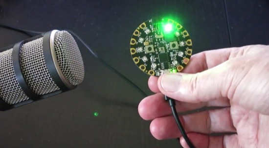
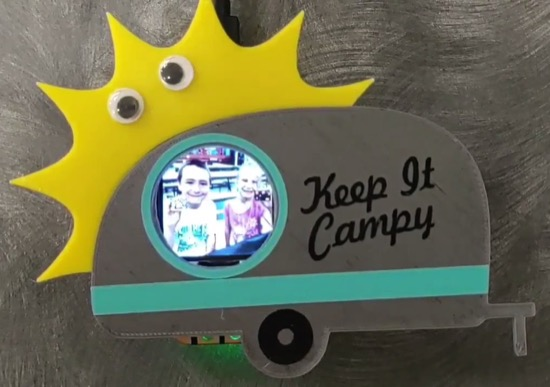
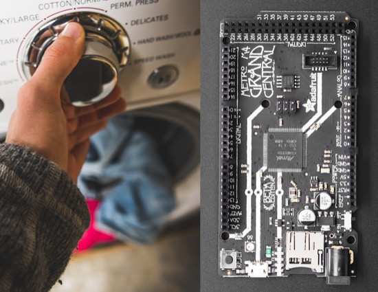
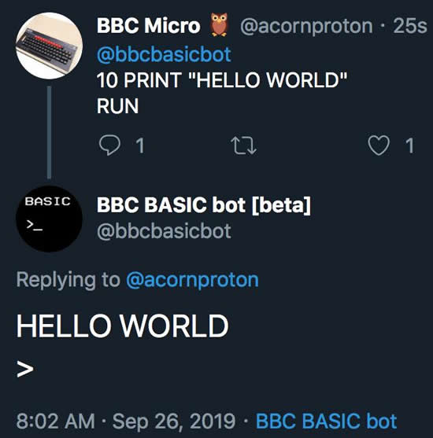
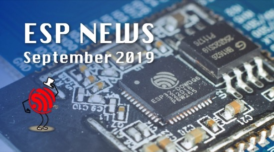
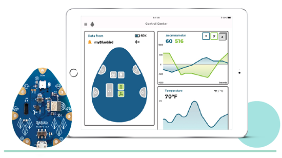

- [ ] Kattni updates
- [ ] update title
- [ ] Feature story
- [ ] Link "View this email in your browser."

View this email in your browser.

## CircuitPython slithers its way to Pimoroni

We are very excited to see all the CircuitPython and [Feather related products](https://github.com/pimoroni/physical_feather_pins), [projects, and code](https://github.com/pimoroni/pms5003-circuitpython) over at [Pimoroni](https://shop.pimoroni.com/)! - [GitHub](https://github.com/pimoroni?utf8=%E2%9C%93&q=circuitp&type=&language=).

## MicroPython trademark

Looks like there is a company in China that is trying to "own" the MicroPython trademark - [MicroPython forums](https://forum.micropython.org/viewtopic.php?f=2&t=6971&p=39702#p39702). We contacted the Python foundation and Damien, creator of MicroPython, and have offered our assistance to figure out the next steps on this issue.

## News from around the web!

More great art from the CircuitPython & Mu book in Japan - [Twitter](https://twitter.com/AoyamaProd/status/1178125439681753089).

Fun with Monster M4sk LCD eyes. Added custom textures and twitchier eye movement to bring  papier mâché coyote to life - [Twitter](https://twitter.com/somenice/status/1176617521606062080).

Nice fursuits with LCD eyes from Adafruit - [Twitter](https://twitter.com/GRNdragon0/status/1176626769597804546).

Tilting Arpeggios, a project with CircuitPython Circuit Playground Express - [YouTube](https://youtu.be/cDhqyT3ZN0g).

Operation game from Caitlin's Dad - [Twitter](https://twitter.com/caitlinsdad/status/1177359386487984128?s=11).

Sandy wanted a new badge for Buffalo Makers, so Sany made a fun faceplate for the CircuitPython powered Hallowing and loaded it up with  a slideshow of pictures of some Makercamp kids - [Twitter](https://twitter.com/KaleidoscopeSci/status/1177684203309326336).

Nina has one of the best badges for events! - [Twitter](https://twitter.com/nnja/status/1176973532170874881).

Anthony's PyBadge! - [Instagram](https://www.instagram.com/p/B2_19kHAOD5/?igshid=2jp3hd5tuo7d).

The cleanest build! It’s totally OK to wash the Adafruit Grand Central - [Adafruit](https://blog.adafruit.com/2019/09/25/the-cleanest-build-its-totally-ok-to-wash-the-adafruit-grand-central-adafruit/).

A virtual BBC Micro hooked up to Twitter - [@bbcbasicbot](https://twitter.com/bbcbasicbot).

ESP NEWS, Sept. 2019 - [Espressif](https://mailchi.mp/9e68a239892a/espressif-esp-news-september-2019?e=ed7e71c663).

This is the code, instruction, description, how to guides, wiki and project planning for the multimode sensor talk and workshop given at PyConDe 2019 - [GitHub](https://github.com/dpgeorge/multimode_sensor_platform).

DIY: IRL Streaming Backpack using Raspberry Pi, uses a Circuit Playground Express - [hackaday.io](https://hackaday.io/project/167778-diy-irl-streaming-backpack-using-raspberry-pi)

evo is a Python package for the evaluation of odometry and SLAM - [evo](https://michaelgrupp.github.io/evo/).

Bluebird a plug-and-play, bluetooth programmable device - [teknikio](https://www.teknikio.com/pages/bluebird).

12 Pythons for every programming need. Whether its speed, memory safety, portability, a micro footprint, data tools, or something else, one of these Python distros probably has it - [Inforworld](https://www.infoworld.com/article/3267976/anaconda-cpython-pypy-and-more-know-your-python-distributions.html).

A repository of templates for GitHub Actions CI configurations - [GitHub](https://github.com/cutenode/github-actions-ci-templates).

A patent lawsuit against GNOME - [LWN.net](https://lwn.net/Articles/800516/).

ipwndfu is an open-source jailbreaking tool for many iOS devices - [GitHub](https://github.com/axi0mX/ipwndfu).

Here’s How Amazon Alexa Will Recognize When You’re Frustrated - [OneZero](https://onezero.medium.com/heres-how-amazon-alexa-will-recognize-when-you-re-frustrated-a9e31751daf7), and [discussion](https://twitter.com/histoftech/status/1177658291024994305).

Alibaba unveils new AI chip aimed at speeding up e-commerce and cloud computing tasks - [South China Morning Post](https://www.scmp.com/tech/e-commerce/article/3030259/alibaba-unveils-new-ai-chip-aimed-speeding-e-commerce-and-cloud).

Facemoji Camera - [facemoji.co/formac](https://facemoji.co/formac/)

#ICYDNCI What was the most popular, most clicked link, in [last week's newsletter](https://www.adafruitdaily.com/2019/09/24/circuitpython-is-out-of-this-world-doc-holiday-stops-by-and-more-python-adafruit-circuitpython-pythonhardware-circuitpython-micropython-thepsf-adafruit/)? [Intro to Soldering by Max Holliday](https://sites.google.com/stanford.edu/soldering-internal/learning).

## Made with Mu

Why Mu? Mu tries to make it as easy as possible to get started with programming but aims to help you graduate to "real" development tools soon after. Everything in Mu is the "real thing" but presented in as simple and obvious way possible. It's like the toddling stage in learning to walk: you're finding your feet and once you're confident, you should move on and explore! Put simply, Mu aims to foster autonomy. Try out Mu today! - [codewith.mu](https://codewith.mu/)

## Coming soon

## New Learn Guides!

[title](url) from [name](url)

## Updated Guides - Now With More Python!

**You can use CircuitPython libraries on Raspberry Pi!** We're updating all of our CircuitPython guides to show how to wire up sensors to your Raspberry Pi, and load the necessary CircuitPython libraries to get going using them with Python. We'll be including the updates here so you can easily keep track of which sensors are ready to go. Check it out!

[title](url)

## CircuitPython Libraries!

CircuitPython support for hardware continues to grow. We are adding support for new sensors and breakouts all the time, as well as improving on the drivers we already have. As we add more libraries and update current ones, you can keep up with all the changes right here!

For the latest drivers, download the [Adafruit CircuitPython Library Bundle](https://circuitpython.org/libraries).

If you'd like to contribute, CircuitPython libraries are a great place to start. Have an idea for a new driver? File an issue on [CircuitPython](https://github.com/adafruit/circuitpython/issues)! Interested in helping with current libraries? Check out [this GitHub issue on CircuitPython](https://github.com/adafruit/circuitpython/issues/1246) for an overview of the State of the CircuitPython Libraries, updated each week. We've included open issues from the library issue lists, and details about repo-level issues that need to be addressed. We have a guide on [contributing to CircuitPython with Git and Github](https://learn.adafruit.com/contribute-to-circuitpython-with-git-and-github) if you need help getting started. You can also find us in the #circuitpython channel on the [Adafruit Discord](https://adafru.it/discord). Feel free to contact Kattni (@kattni) with any questions.

You can check out this [list of all the CircuitPython libraries and drivers available](https://github.com/adafruit/Adafruit_CircuitPython_Bundle/blob/master/circuitpython_library_list.md). 

The current number of CircuitPython libraries is **###**!

**New Libraries!**

Here's this week's new CircuitPython libraries:

* [library](url)

**Updated Libraries!**

Here's this week's updated CircuitPython libraries:

* [library](url)

**PyPI Download Stats!**

We've written a special library called Adafruit Blinka that makes it possible to use CircuitPython Libraries on [Raspberry Pi and other compatible single-board computers](https://learn.adafruit.com/circuitpython-on-raspberrypi-linux/). Adafruit Blinka and all the CircuitPython libraries have been deployed to PyPI for super simple installation on Linux! Here are the top 10 CircuitPython libraries downloaded from PyPI in the last week, including the total downloads for those libraries:

KATTNI TABLE HERE

## Upcoming events!

[October is Open Hardware Month @ Open Source Hardware Association](https://www.oshwa.org/2019/07/26/october-is-open-hardware-month-2/).

>_"October is Open Hardware Month! Check out the [Open Hardware Month website](http://ohm.oshwa.org/). Host an event, find a local event, or [certify](https://certification.oshwa.org/) your hardware to support Open Source Hardware. We are providing resources and asking you, the community, to host small, local events in the name of open source hardware. Tell us about your October event by f[illing out the form below](https://docs.google.com/forms/d/e/1FAIpQLSfjvJmcRXbpgjRACgY_BbaDzQZRa6wxEcP-xwaBpC0X6mvsPw/viewform). Your event will be featured on [OSHWA’s Open Hardware Month page](http://ohm.oshwa.org/) (provided you have followed OSHWA’s rules listed on the [“Do’s and Don’ts”](http://ohm.oshwa.org/dos-and-donts/) page)."_

[Read more](https://www.oshwa.org/2019/07/26/october-is-open-hardware-month-2/), [Tweet for speakers in 2020](https://twitter.com/ohsummit/status/1154881782677831680), and Open Hardware Month @ [http://ohm.oshwa.org/](http://ohm.oshwa.org/)

October 8th, 2019 is Ada Lovelace Day (ALD), an international celebration of the achievements of women in science, technology, engineering and maths (STEM). It aims to increase the profile of women in STEM and, in doing so, create new role models who will encourage more girls into STEM careers and support women already working in STEM - [findingada.com](https://findingada.com/).

PyCon DE & PyData Berlin // October 9 - 13 2019. Main conference, 3 days of talks and workshops. More than 100 sessions dedicated to PyData (artificial intelligence, machine learning, ethics...) and Python topics (programming, DevOps, Web, Django...) - [de.pycon.org](https://de.pycon.org/).

micro:bit Live 2019 is coming to BBC MediaCityUK, Greater Manchester, England on October 4-5. This will be the very first annual gathering of the global micro:bit community of educators and partners - [micro:bit](https://microbit.org/en/2019-04-12-microbit-live/).

Hackaday Superconference is November 15th, 16th, and 17th in Pasadena, California, USA. The Hackaday Superconference is returning for another 3 full days of technical talks, badge hacking, and hands-on workshops: [Eventbrite](https://www.eventbrite.com/e/hackaday-superconference-2019-tickets-60129236164?aff=0626com
) & [hackaday.io](https://hackaday.io/superconference/)

## Latest releases

CircuitPython's stable release is [#.#.#](https://github.com/adafruit/circuitpython/releases/latest) and its unstable release is [#.#.#-##.#](https://github.com/adafruit/circuitpython/releases). New to CircuitPython? Start with our [Welcome to CircuitPython Guide](https://learn.adafruit.com/welcome-to-circuitpython).

[2019####](https://github.com/adafruit/Adafruit_CircuitPython_Bundle/releases/latest) is the latest CircuitPython library bundle.

[v#.#.#](https://micropython.org/download) is the latest MicroPython release. Documentation for it is [here](http://docs.micropython.org/en/latest/pyboard/).

[#.#.#](https://www.python.org/downloads/) is the latest Python release. The latest pre-release version is [#.#.#](https://www.python.org/download/pre-releases/).

[### Stars](https://github.com/adafruit/circuitpython/stargazers) Like CircuitPython? [Star it on GitHub!](https://github.com/adafruit/circuitpython)

## Call for help – CircuitPython messaging to other languages!

We [recently posted on the Adafruit blog](https://blog.adafruit.com/2018/08/15/help-bring-circuitpython-messaging-to-other-languages-circuitpython/) about bringing CircuitPython messaging to other languages, one of the exciting features of CircuitPython 4.x is translated control and error messages. Native language messages will help non-native English speakers understand what is happening in CircuitPython even though the Python keywords and APIs will still be in English. If you would like to help, [please post](https://github.com/adafruit/circuitpython/issues/1098) to the main issue on GitHub and join us on [Discord](https://adafru.it/discord).

We made this graphic with translated text, we could use your help with that to make sure we got the text right, please check out the text in the image – if there is anything we did not get correct, please let us know. Dan sent me this [handy site too](http://helloworldcollection.de/#Human).

## jobs.adafruit.com - Find a dream job, find great candidates!

[jobs.adafruit.com](https://jobs.adafruit.com/) has returned and folks are posting their skills (including CircuitPython) and companies are looking for talented makers to join their companies - from Digi-Key, to Hackaday, Microcenter, Raspberry Pi and more.

## NUMBER thanks!

The Adafruit Discord community, where we do all our CircuitPython development in the open, reached over NUMBER humans, thank you! Join today! [https://adafru.it/discord](https://adafru.it/discord)

## ICYMI - In case you missed it

The wonderful world of Python on hardware! This is our first video-newsletter-podcast that we’ve started! The news comes from the Python community, Discord, Adafruit communities and more. It’s part of the weekly newsletter, then we have a segment on ASK an ENGINEER and this is the video slice from that! The complete Python on Hardware weekly videocast [playlist is here](https://www.youtube.com/playlist?list=PLjF7R1fz_OOXRMjM7Sm0J2Xt6H81TdDev). 

This video podcast is on [iTunes](https://itunes.apple.com/us/podcast/python-on-hardware/id1451685192?mt=2), [YouTube](https://www.youtube.com/playlist?list=PLjF7R1fz_OOXRMjM7Sm0J2Xt6H81TdDev), [IGTV (Instagram TV](https://www.instagram.com/adafruit/channel/)), and [XML](https://itunes.apple.com/us/podcast/python-on-hardware/id1451685192?mt=2).

[Weekly community chat on Adafruit Discord server CircuitPython channel - Audio / Podcast edition](https://itunes.apple.com/us/podcast/circuitpython-weekly-meeting/id1451685016) - Audio from the Discord chat space for CircuitPython, meetings are usually Mondays at 2pm ET, this is the audio version on [iTunes](https://itunes.apple.com/us/podcast/circuitpython-weekly-meeting/id1451685016), Pocket Casts, [Spotify](https://adafru.it/spotify), and [XML feed](https://adafruit-podcasts.s3.amazonaws.com/circuitpython_weekly_meeting/audio-podcast.xml).

And lastly, we are working up a one-spot destination for all things podcast-able here - [podcasts.adafruit.com](https://podcasts.adafruit.com/)

## Codecademy "Learn Hardware Programming with CircuitPython"

Codecademy, an online interactive learning platform used by more than 45 million people, has teamed up with the leading manufacturer in STEAM electronics, Adafruit Industries, to create a coding course, "Learn Hardware Programming with CircuitPython". The course is now available in the [Codecademy catalog](https://www.codecademy.com/learn/learn-circuitpython?utm_source=adafruit&utm_medium=partners&utm_campaign=circuitplayground&utm_content=pythononhardwarenewsletter).

Python is a highly versatile, easy to learn programming language that a wide range of people, from visual effects artists in Hollywood to mission control at NASA, use to quickly solve problems. But you don’t need to be a rocket scientist to accomplish amazing things with it. This new course introduces programmers to Python by way of a microcontroller — CircuitPython — which is a Python-based programming language optimized for use on hardware.

CircuitPython’s hardware-ready design makes it easier than ever to program a variety of single-board computers, and this course gets you from no experience to working prototype faster than ever before. Codecademy’s interactive learning environment, combined with Adafruit's highly rated Circuit Playground Express, present aspiring hardware hackers with a never-before-seen opportunity to learn hardware programming seamlessly online.

Whether for those who are new to programming, or for those who want to expand their skill set to include physical computing, this course will have students getting familiar with Python and creating incredible projects along the way. By the end, students will have built their own bike lights, drum machine, and even a moisture detector that can tell when it's time to water a plant.

Visit Codecademy to access the [Learn Hardware Programming with CircuitPython](https://www.codecademy.com/learn/learn-circuitpython?utm_source=adafruit&utm_medium=partners&utm_campaign=circuitplayground&utm_content=pythononhardwarenewsletter) course and Adafruit to purchase a [Circuit Playground Express](https://www.adafruit.com/product/3333).

Codecademy has helped more than 45 million people around the world upgrade their careers with technology skills. The company’s online interactive learning platform is widely recognized for providing an accessible, flexible, and engaging experience for beginners and experienced programmers alike. Codecademy has raised a total of $43 million from investors including Union Square Ventures, Kleiner Perkins, Index Ventures, Thrive Capital, Naspers, Yuri Milner and Richard Branson, most recently raising its $30 million Series C in July 2016.

## Contribute!

The CircuitPython Weekly Newsletter is a CircuitPython community-run newsletter emailed every Tuesday. The complete [archives are here](https://www.adafruitdaily.com/category/circuitpython/). It highlights the latest CircuitPython related news from around the web including Python and MicroPython developments. To contribute, edit next week's draft [on GitHub](https://github.com/adafruit/circuitpython-weekly-newsletter/tree/gh-pages/_drafts) and [submit a pull request](https://help.github.com/articles/editing-files-in-your-repository/) with the changes. Join our [Discord](https://adafru.it/discord) or [post to the forum](https://forums.adafruit.com/viewforum.php?f=60) for any further questions.
