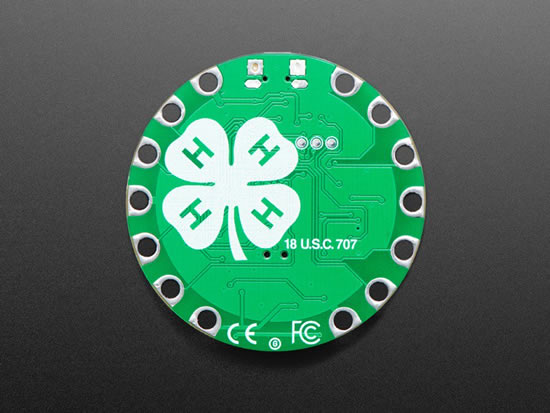

- [ ] Link "View this email in your browser."

View this email in your browser.

## MicroPython slithers its way to Feather!

MicroPython running on a Feather STM32.

## Supercon – Supercharge Your Hardware (Old and New) with CircuitPython

[Latest Dose Of Hardware Talks Headed To Supercon - Hackaday](https://hackaday.com/2019/10/11/latest-dose-of-hardware-talks-headed-to-supercon/).

> The tickets have sold out even as the list of incredible speakers grows. Today we bring you the third dose of talks you’ll see at the [Hackaday Superconference](https://www.eventbrite.com/e/2019-hackaday-superconference-tickets-60129236164?aff=1004com) in November — whether you were lucky enough to grab a ticket, or will be watching the livestream, these eight will be speaking on topics from algorithmically-augmented live music performance to the hardware that captures the real world for display in VR and from leveraging the power of lookup tables to harnessing our engineering talent in a way that truly enriches humanity. If you missed the two speaker announcements that have already come out, [go back](https://hackaday.com/2019/09/27/heres-your-first-look-at-the-talks-of-the-2019-hackaday-superconference/) and [take a look](https://hackaday.com/2019/10/04/more-supercon-talks-taking-the-hardware-world-by-storm/) at those as well as [the workshops](https://hackaday.com/2019/10/02/get-hands-on-at-supercon-workshop-tickets-now-available-2/) being held during Supercon.

AND, big news!

**Supercharge Your Hardware (Old and New) with CircuitPython - Scott Shawcroft**

>_"CircuitPython makes programming hardware easier than ever by bringing the popular Python language to modern, inexpensive 32-bit microcontrollers. This doesn’t need to be limited to modern hardware though. By pairing a modern microcontroller running CircuitPython and a vintage computer, such as a GameBoy or Yamaha piano keyboard, you can unlock the unique characteristics of these vintage devices. In this talk, you’ll learn the basics of how CircuitPython makes coding easy, how it works under the hood, and how to extend CircuitPython with C. As an example, we’ll supercharge a Nintendo’s GameBoy with CircuitPython. By the end of the talk, you’ll be able to supercharge your own hardware project with CircuitPython."_

Adafruit will have some team members at Supercon and some special hardware surprises thanks to Digi-Key!

## Quoth the Raven MOAR PYTHON

Laser-bird knows when it's sleeping, knows when you're awake animatronic raven, made with Circuitpython - [Instagram](https://www.instagram.com/p/B3VcE9UFZqd/?igshid=10sd4lcnwdqaq).

## AWS DeepRacer arrived – Runs on Python

[AWS DeepRacer](https://aws.amazon.com/deepracer/) is an autonomous 1/18th scale race car driven by reinforcement learning, 3D racing simulator, and global racing league. You can build your own RL model for AWS DeepRacer using the AWS DeepRacer 3D racing simulator. Building a model requires basic Python programming skills. [We picked one up](https://blog.adafruit.com/2019/10/11/aws-deepracer-arrived-runs-on-python-adafruit-awscloud-awsdeepracer-deepracer/) and will get Blinka on it shortly.

## Python powered Mini PiTFT – 135×240 Color TFT Add-on for Raspberry Pi

Mini PiTFT – 135×240 Color TFT Add-on for Raspberry Pi – If you’re looking for the most compact li’l color display for a Raspberry Pi (most likely a Pi Zero) project, this might be just the thing you need!

[The Mini PiTFT – 135×240 Color TFT Add-on for Raspberry Pi](https://www.adafruit.com/product/4393) is your little TFT pal, ready to snap onto any and all Raspberry Pi computers, to give you a little display. The Mini PiTFT comes with a full color 240×135 pixel IPS display with great visibility at all angles. The TFT uses only the SPI port so its very fast, and we leave plenty of pins remaining available for buttons, LEDs, sensors, etc. It’s also nice and compact so it will fit into any case.

This display is super small, only about 1.14″ diagonal, but since it is an IPS display, its very readable with high contrast and visibility. We had a little space on the top so we give you two tactile buttons on GPIO pins so you can create a simple user interface. On the bottom we have a Qwiic/STEMMA QT connector for I2C sensors and device so you can plug and play any of our STEMMA QT devices.

Using the display is very easy, we have a kernel driver and Python library for the ST7789 chipset. You can set it up as a console output so you can have text and user interface through the Raspberry Pi OS or you draw images, text, whatever you like, using the Python imaging library. Our tests showed ~15 FPS update rates so you can do animations or simple video.

Comes completely pre-assembled and tested so you don’t need to do anything but plug it in and install our Python code! Works with any Raspberry Pi computer - [Adafruit](https://www.adafruit.com/product/4393).

## News from around the web!

Professor John Gallaugher and 100 Circuit Playground Bluefruit Expresses for students - [Twitter](https://twitter.com/gallaugher/status/1181285150757474305). _"Time to mint some new Pythonistas"_

6th graders designing smart clothing with the Circuit Playground Express - [Twitter](https://twitter.com/k_sensenbrenner/status/1181740713509343232).

Turn your micro:bit into fireflies, using broadcast and bluetooth to [simulate](https://ncase.me/fireflies/) fireflies synchronizing their flashing - [Twitter](https://twitter.com/stevenpfloyd/status/1182820852951408640?s=11).

36 pages of reverse-engineered schematics for the original Game Boy chip (minus CPU) - [GitHub](https://github.com/furrtek/DMG-CPU-Inside).

urllib3 just reached 1 BILLION downloads, it's the third package on [PyPI](https://pypi.org/) to do so, the other two being six and pip - [PeyPy](https://pepy.tech/project/urllib3) via [Twitter](https://twitter.com/sethmlarson/status/1182710786436882435). Using PeyPy we looked up [Blinka](https://pypi.org/project/Adafruit-Blinka/), [we're over 142,000 downloads](https://pepy.tech/project/adafruit-blinka)!

It was [National 4-H Week last week](https://blog.adafruit.com/2019/10/11/national-4-h-week-national4hweek-4h-4-h-circuit-playground-express-is-in-stock-and-on-sale-today-use-code-national4hweek-on-checkout-inspirekidstodo-4hyouthinaction-4h-4hgrowshere/) ...

>_“It is believed that the first official “Club Week” was proclaimed by Governor Christianson in Minnesota in 1926 when he established April 18-24 as “Club Week” to promote the work of the Boys and Girls Clubs in that state, as reported in the April-May, 1926 issue of National Boys and Girls Club News.”_

Check out the [Tweets](https://twitter.com/hashtag/National4HWeek?src=hashtag_click&f=live) and don't forget, there is a special [Python-powered 4-H edition of Circuit Playground Express](https://www.adafruit.com/product/4180)!

#ICYDNCI What was the most popular, most clicked link, in [last week's newsletter](https://www.adafruitdaily.com/2019/10/08/happy-ada-lovelace-day-thank-you-mitsuharu-aoyama-and-more-python-adafruit-circuitpython-pythonhardware-circuitpython-micropython-thepsf-adafruit/)? [Ada Lovelace Day](https://findingada.com/).

Speaking of [Ada Lovelace Day](https://blog.adafruit.com/tag/ald19/), Professor John and students made this great iOS app celebrating women in tech as part of their first exam - [Twitter](https://twitter.com/gallaugher/status/1181318585291026433). Looks like a Ladyada made it in there, thank you!

## Made with Mu

Why Mu? Mu tries to make it as easy as possible to get started with programming but aims to help you graduate to "real" development tools soon after. Everything in Mu is the "real thing" but presented in as simple and obvious way possible. It's like the toddling stage in learning to walk: you're finding your feet and once you're confident, you should move on and explore! Put simply, Mu aims to foster autonomy. Try out Mu today! - [codewith.mu](https://codewith.mu/)

## Coming soon

## New Learn Guides!

[Circuit Playground Bluetooth Cauldron](https://learn.adafruit.com/cpx-cauldron) from [Noe and Pedro](https://learn.adafruit.com/users/pixil3d)

## Updated Guides - Now With More Python!

**You can use CircuitPython libraries on Raspberry Pi!** We're updating all of our CircuitPython guides to show how to wire up sensors to your Raspberry Pi, and load the necessary CircuitPython libraries to get going using them with Python. We'll be including the updates here so you can easily keep track of which sensors are ready to go. Check it out!

[Adafruit 15x7 CharliePlex FeatherWing](https://learn.adafruit.com/adafruit-15x7-7x15-charlieplex-led-matrix-charliewing-featherwing)

[Adafruit CharliePlex LED Matrix Bonnet](https://learn.adafruit.com/adafruit-charlieplex-bonnet/)

[Adafruit BMP388 - Precision Barometric Pressure and Altimeter](https://learn.adafruit.com/adafruit-bmp388/python-circuitpython)

[MLX90393 Wide-Range 3-Axis Magnetometer](https://learn.adafruit.com/mlx90393-wide-range-3-axis-magnetometer)

[Adafruit NeoTrellis](https://learn.adafruit.com/adafruit-neotrellis)

[Adafruit PN532 RFID/NFC Breakout and Shield](https://learn.adafruit.com/adafruit-pn532-rfid-nfc)

[Adafruit seesaw](https://learn.adafruit.com/adafruit-seesaw-atsamd09-breakout)

[Adafruit 16-Channel PWM/Servo HAT & Bonnet for Raspberry Pi](https://learn.adafruit.com/adafruit-16-channel-pwm-servo-hat-for-raspberry-pi/overview)

[Monochrome OLED Breakouts](https://learn.adafruit.com/monochrome-oled-breakouts/python-wiring)

[Adafruit GPIO Expander Bonnet for Raspberry Pi](https://learn.adafruit.com/gpio-expander-bonnet/)

[Adafruit MAX31856 Universal Thermocouple Amplifier](https://learn.adafruit.com/adafruit-max31856-thermocouple-amplifier)

[Introducing Adafruit Trellis](https://learn.adafruit.com/adafruit-trellis-diy-open-source-led-keypad)

[TMP006 Infrared Sensor Breakout](https://learn.adafruit.com/infrared-thermopile-sensor-breakout)

[ADXL345 Digital Accelerometer](https://learn.adafruit.com/adxl345-digital-accelerometer)

## CircuitPython Libraries!

CircuitPython support for hardware continues to grow. We are adding support for new sensors and breakouts all the time, as well as improving on the drivers we already have. As we add more libraries and update current ones, you can keep up with all the changes right here!

For the latest drivers, download the [Adafruit CircuitPython Library Bundle](https://circuitpython.org/libraries).

If you'd like to contribute, CircuitPython libraries are a great place to start. Have an idea for a new driver? File an issue on [CircuitPython](https://github.com/adafruit/circuitpython/issues)! Interested in helping with current libraries? Check out [this GitHub issue on CircuitPython](https://github.com/adafruit/circuitpython/issues/1246) for an overview of the State of the CircuitPython Libraries, updated each week. We've included open issues from the library issue lists, and details about repo-level issues that need to be addressed. We have a guide on [contributing to CircuitPython with Git and Github](https://learn.adafruit.com/contribute-to-circuitpython-with-git-and-github) if you need help getting started. You can also find us in the #circuitpython channel on the [Adafruit Discord](https://adafru.it/discord). Feel free to contact Kattni (@kattni) with any questions.

You can check out this [list of all the CircuitPython libraries and drivers available](https://github.com/adafruit/Adafruit_CircuitPython_Bundle/blob/master/circuitpython_library_list.md). 

The current number of CircuitPython libraries is **187**!

**Updated Libraries!**

Here's this week's updated CircuitPython libraries:

 * [Adafruit_CircuitPython_AdafruitIO](https://github.com/adafruit/Adafruit_CircuitPython_AdafruitIO)
 * [Adafruit_CircuitPython_MiniMQTT](https://github.com/adafruit/Adafruit_CircuitPython_MiniMQTT)
 * [Adafruit_CircuitPython_MCP3xxx](https://github.com/adafruit/Adafruit_CircuitPython_MCP3xxx)
 * [Adafruit_CircuitPython_NeoPixel](https://github.com/adafruit/Adafruit_CircuitPython_NeoPixel)
 * [Adafruit_CircuitPython_ESP32SPI](https://github.com/adafruit/Adafruit_CircuitPython_ESP32SPI)
 * [Adafruit_CircuitPython_FancyLED](https://github.com/adafruit/Adafruit_CircuitPython_FancyLED)
 * [Adafruit_CircuitPython_RGB_Display](https://github.com/adafruit/Adafruit_CircuitPython_RGB_Display)

**PyPI Download Stats!**

We've written a special library called Adafruit Blinka that makes it possible to use CircuitPython Libraries on [Raspberry Pi and other compatible single-board computers](https://learn.adafruit.com/circuitpython-on-raspberrypi-linux/). Adafruit Blinka and all the CircuitPython libraries have been deployed to PyPI for super simple installation on Linux! Here are the top 10 CircuitPython libraries downloaded from PyPI in the last week, including the total downloads for those libraries:

| Library                                     | Last Week   | Total |   
|:-------                                     |:--------:   |:-----:|   
| Adafruit-Blinka                             | 1515        | 43559 |   
| Adafruit_CircuitPython_BusDevice            | 888         | 23418 |   
| Adafruit_CircuitPython_MCP230xx             | 503         | 8147 |    
| Adafruit_CircuitPython_NeoPixel             | 178         | 5671 |    
| Adafruit_CircuitPython_Register             | 174         | 6294 |    
| Adafruit_CircuitPython_PCA9685              | 122         | 4394 |    
| Adafruit_CircuitPython_Motor                | 116         | 4635 |    
| Adafruit_CircuitPython_ServoKit             | 113         | 3367 |    
| Adafruit_CircuitPython_RGB_Display          | 113         | 584 |     
| Adafruit_CircuitPython_MotorKit             | 109         | 2381 |    

## Upcoming events!

Hacktoberfest is open to everyone in the global community. Whether you’re a developer, student learning to code, event host, or company of any size, you can help drive growth of open source and make positive contributions to an ever-growing community. All backgrounds and skill levels are encouraged to complete the challenge - [https://hacktoberfest.digitalocean.com](hacktoberfest.digitalocean.com)

[October is Open Hardware Month @ Open Source Hardware Association](https://www.oshwa.org/2019/07/26/october-is-open-hardware-month-2/).

>_"October is Open Hardware Month! Check out the [Open Hardware Month website](http://ohm.oshwa.org/). Host an event, find a local event, or [certify](https://certification.oshwa.org/) your hardware to support Open Source Hardware. We are providing resources and asking you, the community, to host small, local events in the name of open source hardware. Tell us about your October event by f[illing out the form below](https://docs.google.com/forms/d/e/1FAIpQLSfjvJmcRXbpgjRACgY_BbaDzQZRa6wxEcP-xwaBpC0X6mvsPw/viewform). Your event will be featured on [OSHWA’s Open Hardware Month page](http://ohm.oshwa.org/) (provided you have followed OSHWA’s rules listed on the [“Do’s and Don’ts”](http://ohm.oshwa.org/dos-and-donts/) page)."_

[Read more](https://www.oshwa.org/2019/07/26/october-is-open-hardware-month-2/), [Tweet for speakers in 2020](https://twitter.com/ohsummit/status/1154881782677831680), and Open Hardware Month @ [http://ohm.oshwa.org/](http://ohm.oshwa.org/)

Hackaday Superconference is November 15th, 16th, and 17th in Pasadena, California, USA. The Hackaday Superconference is returning for another 3 full days of technical talks, badge hacking, and hands-on workshops: [Eventbrite](https://www.eventbrite.com/e/hackaday-superconference-2019-tickets-60129236164?aff=0626com
) & [hackaday.io](https://hackaday.io/superconference/)

## Latest releases

CircuitPython's stable release is [#.#.#](https://github.com/adafruit/circuitpython/releases/latest) and its unstable release is [#.#.#-##.#](https://github.com/adafruit/circuitpython/releases). New to CircuitPython? Start with our [Welcome to CircuitPython Guide](https://learn.adafruit.com/welcome-to-circuitpython).

[2019####](https://github.com/adafruit/Adafruit_CircuitPython_Bundle/releases/latest) is the latest CircuitPython library bundle.

[v#.#.#](https://micropython.org/download) is the latest MicroPython release. Documentation for it is [here](http://docs.micropython.org/en/latest/pyboard/).

[#.#.#](https://www.python.org/downloads/) is the latest Python release. The latest pre-release version is [#.#.#](https://www.python.org/download/pre-releases/).

[1.4k Stars](https://github.com/adafruit/circuitpython/stargazers) Like CircuitPython? [Star it on GitHub!](https://github.com/adafruit/circuitpython)

## Call for help – CircuitPython messaging to other languages!

We [posted on the Adafruit blog](https://blog.adafruit.com/2018/08/15/help-bring-circuitpython-messaging-to-other-languages-circuitpython/) about bringing CircuitPython messaging to other languages, one of the exciting features of CircuitPython 4.x is translated control and error messages. Native language messages will help non-native English speakers understand what is happening in CircuitPython even though the Python keywords and APIs will still be in English. If you would like to help, [please post](https://github.com/adafruit/circuitpython/issues/1098) to the main issue on GitHub and join us on [Discord](https://adafru.it/discord).

We made this graphic with translated text, we could use your help with that to make sure we got the text right, please check out the text in the image – if there is anything we did not get correct, please let us know. Dan sent me this [handy site too](http://helloworldcollection.de/#Human).

## jobs.adafruit.com - Find a dream job, find great candidates!

[jobs.adafruit.com](https://jobs.adafruit.com/) has returned and folks are posting their skills (including CircuitPython) and companies are looking for talented makers to join their companies - from Digi-Key, to Hackaday, Microcenter, Raspberry Pi and more.

## 14,450 thanks!

The Adafruit Discord community, where we do all our CircuitPython development in the open, reached over 14,450 humans, thank you! Join today! [https://adafru.it/discord](https://adafru.it/discord)

## ICYMI - In case you missed it

The wonderful world of Python on hardware! This is our first video-newsletter-podcast that we’ve started! The news comes from the Python community, Discord, Adafruit communities and more. It’s part of the weekly newsletter, then we have a segment on ASK an ENGINEER and this is the video slice from that! The complete Python on Hardware weekly videocast [playlist is here](https://www.youtube.com/playlist?list=PLjF7R1fz_OOXRMjM7Sm0J2Xt6H81TdDev). 

This video podcast is on [iTunes](https://itunes.apple.com/us/podcast/python-on-hardware/id1451685192?mt=2), [YouTube](https://www.youtube.com/playlist?list=PLjF7R1fz_OOXRMjM7Sm0J2Xt6H81TdDev), [IGTV (Instagram TV](https://www.instagram.com/adafruit/channel/)), and [XML](https://itunes.apple.com/us/podcast/python-on-hardware/id1451685192?mt=2).

[Weekly community chat on Adafruit Discord server CircuitPython channel - Audio / Podcast edition](https://itunes.apple.com/us/podcast/circuitpython-weekly-meeting/id1451685016) - Audio from the Discord chat space for CircuitPython, meetings are usually Mondays at 2pm ET, this is the audio version on [iTunes](https://itunes.apple.com/us/podcast/circuitpython-weekly-meeting/id1451685016), Pocket Casts, [Spotify](https://adafru.it/spotify), and [XML feed](https://adafruit-podcasts.s3.amazonaws.com/circuitpython_weekly_meeting/audio-podcast.xml).

And lastly, we are working up a one-spot destination for all things podcast-able here - [podcasts.adafruit.com](https://podcasts.adafruit.com/)

## Codecademy "Learn Hardware Programming with CircuitPython"

Codecademy, an online interactive learning platform used by more than 45 million people, has teamed up with the leading manufacturer in STEAM electronics, Adafruit Industries, to create a coding course, "Learn Hardware Programming with CircuitPython". The course is now available in the [Codecademy catalog](https://www.codecademy.com/learn/learn-circuitpython?utm_source=adafruit&utm_medium=partners&utm_campaign=circuitplayground&utm_content=pythononhardwarenewsletter).

Python is a highly versatile, easy to learn programming language that a wide range of people, from visual effects artists in Hollywood to mission control at NASA, use to quickly solve problems. But you don’t need to be a rocket scientist to accomplish amazing things with it. This new course introduces programmers to Python by way of a microcontroller — CircuitPython — which is a Python-based programming language optimized for use on hardware.

CircuitPython’s hardware-ready design makes it easier than ever to program a variety of single-board computers, and this course gets you from no experience to working prototype faster than ever before. Codecademy’s interactive learning environment, combined with Adafruit's highly rated Circuit Playground Express, present aspiring hardware hackers with a never-before-seen opportunity to learn hardware programming seamlessly online.

Whether for those who are new to programming, or for those who want to expand their skill set to include physical computing, this course will have students getting familiar with Python and creating incredible projects along the way. By the end, students will have built their own bike lights, drum machine, and even a moisture detector that can tell when it's time to water a plant.

Visit Codecademy to access the [Learn Hardware Programming with CircuitPython](https://www.codecademy.com/learn/learn-circuitpython?utm_source=adafruit&utm_medium=partners&utm_campaign=circuitplayground&utm_content=pythononhardwarenewsletter) course and Adafruit to purchase a [Circuit Playground Express](https://www.adafruit.com/product/3333).

Codecademy has helped more than 45 million people around the world upgrade their careers with technology skills. The company’s online interactive learning platform is widely recognized for providing an accessible, flexible, and engaging experience for beginners and experienced programmers alike. Codecademy has raised a total of $43 million from investors including Union Square Ventures, Kleiner Perkins, Index Ventures, Thrive Capital, Naspers, Yuri Milner and Richard Branson, most recently raising its $30 million Series C in July 2016.

## Contribute!

The CircuitPython Weekly Newsletter is a CircuitPython community-run newsletter emailed every Tuesday. The complete [archives are here](https://www.adafruitdaily.com/category/circuitpython/). It highlights the latest CircuitPython related news from around the web including Python and MicroPython developments. To contribute, edit next week's draft [on GitHub](https://github.com/adafruit/circuitpython-weekly-newsletter/tree/gh-pages/_drafts) and [submit a pull request](https://help.github.com/articles/editing-files-in-your-repository/) with the changes. Join our [Discord](https://adafru.it/discord) or [post to the forum](https://forums.adafruit.com/viewforum.php?f=60) for any further questions.
