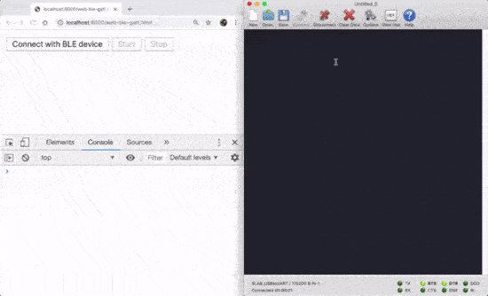
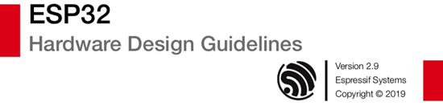
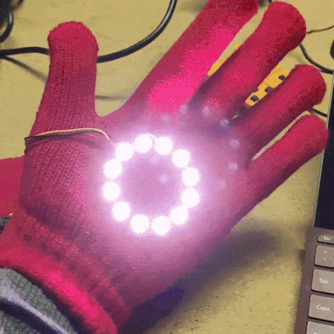
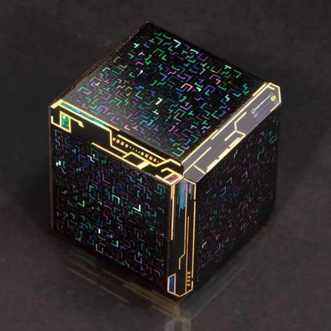

- [ ] Kattni updates
- [ ] update title
- [ ] Feature story
- [ ] Link "View this email in your browser."

View this email in your browser.

## CircuitPython Libraries contributing! New section on circuitpython.org

If you'd like to contribute to the CircuitPython project, the CircuitPython libraries are a great way to begin. This page is updated weekly with status information from the CircuitPython libraries, including open issues and repo-level issues.

If this is your first time contributing, or you'd like to see our recommended contribution workflow, [we have a guide on Contributing to CircuitPython with Git and Github](https://learn.adafruit.com/contribute-to-circuitpython-with-git-and-github). You can also find us in the #circuitpython channel on the [Adafruit Discord](https://adafru.it/discord).

Have an idea for a new driver or library? File an issue on the [CircuitPython repo](https://github.com/adafruit/circuitpython/issues)!

Visit the new section on [circuitpython.org](https://circuitpython.org/libraries/contributing)!

## CircuitPython powered Bibliocircuitry

The INLS 690, "The Makerspace Class," created Bibliocircuitry projects using CircuitPython, this one is from Laura March and contains voices of her parents inside the book - [Twitter](https://twitter.com/theartofmarch/status/1184580695374680065), and [YouTube](https://youtu.be/MRoQ3ZLnzFY).

## Make your own CircuitPython powered interactive conference poster

[Aakanksha Agrawal](https://twitter.com/rasponicc) and [Ayan Pahwa](https://twitter.com/iAyanPahwa/) from [ILUG-D](https://twitter.com/ilugdelhi) and [HHC-D](https://twitter.com/DelhiHHC), showcased an interactive hardware poster presentation at [PyCon India 2019 conference](https://in.pycon.org/2019/) powered by CircuitPython. 

Here's the [demo video](https://youtu.be/mmLI0HKfPQI), [step by step guide to build your own](https://www.codensolder.com/blog/circuitpython-poster) and a [blog](https://rasponic.github.io/jekyll/update/2019/10/07/First-poster-presentation-at-Pycon-2019.html) about their conference experience. Congrats to [the team](https://twitter.com/iAyanPahwa/status/1183019501794684928) who put this one together.

## Feather floats with the Maker Buoy

The Maker Buoy is a low cost, solar powered, open source drifting buoy. They are now offering a populated Maker Buoy board for $45. Add-ons include: Rockblock modem, & GPS... which allows communicating over Iridium. Includes I2C header, watchdog timer, status LED, and flashing strobe circuitry - [makerbuoy.com](https://www.makerbuoy.com/products-1) & [Twitter](https://twitter.com/MakerBuoy/status/1183911654158979073). We also added this to the [awesome-feather list](https://github.com/adafruit/awesome-feather)!

## News from around the web!

Using Apple MacBook airs and pros along with Circuit Playgrounds to teach basic coding to get ready for 2 and 3rd grade robotics from Mike Pitcher, Director of Academic Technologies at The University of Texas at El Paso, and Apple Distinguished Educator 2017 - [Twitter](https://twitter.com/thshadow/status/1185234688971104256).

Digi-Key booth at Maker Faire Rome with Monster M4sk! - [Twitter](https://twitter.com/SandysDavid/status/1185225696353890306).

GeekMom's incredible outfit - [Twitter](https://twitter.com/GeekMomProjects/status/1183887072743976960).

Sayanne is using an Adafruit nRF52 BLE board and built some demos with a client-side app with Chrome browser's Web BLE support. You can read the changing GATT characteristics from BLE device to the browser! [Twitter](https://twitter.com/sayanee_/status/1185186102983872514), and [YouTube](https://youtu.be/TsXUcAKi790).

The Chroma Touch LED glove - [Instagram](https://www.instagram.com/p/B3qmWOSD_Z_/?igshid=24dflgzv2ofd).

Here is the last ESP32 hardware design guidelines posted on the Espressif site - [PDF](https://www.espressif.com/sites/default/files/documentation/esp32_hardware_design_guidelines_en.pdf).

Nyan cat earrings - [Instagram](https://www.instagram.com/p/B3sRuIKnVEU/?igshid=13mmm5l2xynn4).

There is a new Arduino IDE (alpha), called the Arduino Pro IDE, that has support for additional languages other than C++, is this one of the first moves towards supporting Python? - [Arduino blog](https://blog.arduino.cc/2019/10/18/arduino-pro-ide-alpha-preview-with-advanced-features/).

Leo's Iron Man gloves - [Instagram](https://www.instagram.com/p/B3tvjwqhxIA/?igshid=1ng8p16i9g5uy).

Anaconda turns your Sublime Text 3 into a full featured Python development IDE - [damnwidget.github.io/anaconda](http://damnwidget.github.io/anaconda/)

Dash is an API Documentation Browser and Code Snippet Manager. Dash stores snippets of code and instantly searches offline documentation sets for 200+ APIs, 100+ cheat sheets and more. You can even generate your own docsets or request docsets to be included - [Dash](https://kapeli.com/dash). Hmm, if there is interest maybe we'll see about adding CircuitPython?

Andrey Vlasovskikh - The Story of Features Coming in Python 3.8 and Beyond - [YouTube](https://youtu.be/xUXsIDtlv9s).

ET (Don't) Phone Home, internet access and privacy list of things devices contain, sorta like food ingredient labels by [Jacques Mattheij](https://jacquesmattheij.com/et-phone-home/) via [Twitter](https://twitter.com/jmattheij/status/1185585218087989248).

The Lines of Code That Changed Everything: Apollo 11, the JPEG, the first pop-up ad, and 33 other bits of software that have transformed our world - [slate.com](https://slate.com/technology/2019/10/consequential-computer-code-software-history.html)

Terumasa Ikeda's art looks like it came out of the Matrix - [terumasa-ikeda.com](https://www.terumasa-ikeda.com/) & [YouTube](https://www.youtube.com/watch?v=94nJqYKf6so).

#ICYDNCI What was the most popular, most clicked link, in [last week's newsletter](https://www.adafruitdaily.com/2019/10/15/supercharged-supercon-with-circuitpython-quoth-the-raven-moar-python-python-adafruit-circuitpython-pythonhardware-circuitpython-micropython-thepsf-adafruit/)? [Adafruit Feather STM32F405 Express](https://www.adafruit.com/product/4382).

## Coming soon

[Jerry tweeted](https://twitter.com/jerryhjones/status/1183934076400439296) about macOS Catalina's new feature that allows running iOS apps using Catalyst, the example was our Bluefruit app, so we of course had to try it! It was easy! We're going to test and do any fixes and have a version out soon, thanks Collin! - [Youtube](https://youtu.be/uwRm5PNhPX4).

## New Learn Guides!

[title](url) from [name](url)

## Updated Guides - Now With More Python!

**You can use CircuitPython libraries on Raspberry Pi!** We're updating all of our CircuitPython guides to show how to wire up sensors to your Raspberry Pi, and load the necessary CircuitPython libraries to get going using them with Python. We'll be including the updates here so you can easily keep track of which sensors are ready to go. Check it out!

[title](url)

## CircuitPython Libraries!

CircuitPython support for hardware continues to grow. We are adding support for new sensors and breakouts all the time, as well as improving on the drivers we already have. As we add more libraries and update current ones, you can keep up with all the changes right here!

For the latest drivers, download the [Adafruit CircuitPython Library Bundle](https://circuitpython.org/libraries).

If you'd like to contribute, CircuitPython libraries are a great place to start. Have an idea for a new driver? File an issue on [CircuitPython](https://github.com/adafruit/circuitpython/issues)! Interested in helping with current libraries? Check out [this GitHub issue on CircuitPython](https://github.com/adafruit/circuitpython/issues/1246) for an overview of the State of the CircuitPython Libraries, updated each week. We've included open issues from the library issue lists, and details about repo-level issues that need to be addressed. We have a guide on [contributing to CircuitPython with Git and Github](https://learn.adafruit.com/contribute-to-circuitpython-with-git-and-github) if you need help getting started. You can also find us in the #circuitpython channel on the [Adafruit Discord](https://adafru.it/discord). Feel free to contact Kattni (@kattni) with any questions.

You can check out this [list of all the CircuitPython libraries and drivers available](https://github.com/adafruit/Adafruit_CircuitPython_Bundle/blob/master/circuitpython_library_list.md). 

The current number of CircuitPython libraries is **###**!

**New Libraries!**

Here's this week's new CircuitPython libraries:

* [library](url)

**Updated Libraries!**

Here's this week's updated CircuitPython libraries:

* [library](url)

**PyPI Download Stats!**

We've written a special library called Adafruit Blinka that makes it possible to use CircuitPython Libraries on [Raspberry Pi and other compatible single-board computers](https://learn.adafruit.com/circuitpython-on-raspberrypi-linux/). Adafruit Blinka and all the CircuitPython libraries have been deployed to PyPI for super simple installation on Linux! Here are the top 10 CircuitPython libraries downloaded from PyPI in the last week, including the total downloads for those libraries:

KATTNI TABLE HERE

## Upcoming events!

Hacktoberfest is open to everyone in the global community. Whether you’re a developer, student learning to code, event host, or company of any size, you can help drive growth of open source and make positive contributions to an ever-growing community. All backgrounds and skill levels are encouraged to complete the challenge - [https://hacktoberfest.digitalocean.com](hacktoberfest.digitalocean.com)

[October is Open Hardware Month @ Open Source Hardware Association](https://www.oshwa.org/2019/07/26/october-is-open-hardware-month-2/).

>_"October is Open Hardware Month! Check out the [Open Hardware Month website](http://ohm.oshwa.org/). Host an event, find a local event, or [certify](https://certification.oshwa.org/) your hardware to support Open Source Hardware. We are providing resources and asking you, the community, to host small, local events in the name of open source hardware. Tell us about your October event by [filling out the form below](https://docs.google.com/forms/d/e/1FAIpQLSfjvJmcRXbpgjRACgY_BbaDzQZRa6wxEcP-xwaBpC0X6mvsPw/viewform). Your event will be featured on [OSHWA’s Open Hardware Month page](http://ohm.oshwa.org/) (provided you have followed OSHWA’s rules listed on the [“Do’s and Don’ts”](http://ohm.oshwa.org/dos-and-donts/) page)."_

[Read more](https://www.oshwa.org/2019/07/26/october-is-open-hardware-month-2/), [Tweet for speakers in 2020](https://twitter.com/ohsummit/status/1154881782677831680), and Open Hardware Month @ [http://ohm.oshwa.org/](http://ohm.oshwa.org/)

October 28–31, 2019. Be part of the ML revolution. Santa Clara, CA. TensorFlow is powering everything from data centers to edge devices, across industries from finance to advanced healthcare. And now, with TensorFlow 2.0 and the evolving ecosystem of tools and libraries, it’s doing it all so much easier - [TensorFlow World](https://conferences.oreilly.com/tensorflow/tf-ca).

Hackaday Superconference is November 15th, 16th, and 17th in Pasadena, California, USA. The Hackaday Superconference is returning for another 3 full days of technical talks, badge hacking, and hands-on workshops: [Eventbrite](https://www.eventbrite.com/e/hackaday-superconference-2019-tickets-60129236164?aff=0626com
) & [hackaday.io](https://hackaday.io/superconference/)

April 15-23, 2020, Pittsburgh, Pennsylvania - The PyCon 2020 conference, which will take place in Pittsburgh, is the largest annual gathering for the community using and developing the open-source Python programming language. It is produced and underwritten by the Python Software Foundation, the 501(c)(3) nonprofit organization dedicated to advancing and promoting Python. Through PyCon, the PSF advances its mission of growing the international community of Python programmers - [PyCon 2020](https://us.pycon.org/2020/).

## Latest releases

CircuitPython's stable release is [#.#.#](https://github.com/adafruit/circuitpython/releases/latest) and its unstable release is [#.#.#-##.#](https://github.com/adafruit/circuitpython/releases). New to CircuitPython? Start with our [Welcome to CircuitPython Guide](https://learn.adafruit.com/welcome-to-circuitpython).

[2019####](https://github.com/adafruit/Adafruit_CircuitPython_Bundle/releases/latest) is the latest CircuitPython library bundle.

[v#.#.#](https://micropython.org/download) is the latest MicroPython release. Documentation for it is [here](http://docs.micropython.org/en/latest/pyboard/).

[#.#.#](https://www.python.org/downloads/) is the latest Python release. The latest pre-release version is [#.#.#](https://www.python.org/download/pre-releases/).

[### Stars](https://github.com/adafruit/circuitpython/stargazers) Like CircuitPython? [Star it on GitHub!](https://github.com/adafruit/circuitpython)

## Call for help – CircuitPython messaging to other languages!

We [recently posted on the Adafruit blog](https://blog.adafruit.com/2018/08/15/help-bring-circuitpython-messaging-to-other-languages-circuitpython/) about bringing CircuitPython messaging to other languages, one of the exciting features of CircuitPython 4.x is translated control and error messages. Native language messages will help non-native English speakers understand what is happening in CircuitPython even though the Python keywords and APIs will still be in English. If you would like to help, [please post](https://github.com/adafruit/circuitpython/issues/1098) to the main issue on GitHub and join us on [Discord](https://adafru.it/discord).

We made this graphic with translated text, we could use your help with that to make sure we got the text right, please check out the text in the image – if there is anything we did not get correct, please let us know. Dan sent me this [handy site too](http://helloworldcollection.de/#Human).

## jobs.adafruit.com - Find a dream job, find great candidates!

[jobs.adafruit.com](https://jobs.adafruit.com/) has returned and folks are posting their skills (including CircuitPython) and companies are looking for talented makers to join their companies - from Digi-Key, to Hackaday, Microcenter, Raspberry Pi and more.

## 14,522 thanks!

The Adafruit Discord community, where we do all our CircuitPython development in the open, reached over 14,522 humans, thank you! Join today! [https://adafru.it/discord](https://adafru.it/discord)

## ICYMI - In case you missed it

The wonderful world of Python on hardware! This is our first video-newsletter-podcast that we’ve started! The news comes from the Python community, Discord, Adafruit communities and more. It’s part of the weekly newsletter, then we have a segment on ASK an ENGINEER and this is the video slice from that! The complete Python on Hardware weekly videocast [playlist is here](https://www.youtube.com/playlist?list=PLjF7R1fz_OOXRMjM7Sm0J2Xt6H81TdDev). 

This video podcast is on [iTunes](https://itunes.apple.com/us/podcast/python-on-hardware/id1451685192?mt=2), [YouTube](https://www.youtube.com/playlist?list=PLjF7R1fz_OOXRMjM7Sm0J2Xt6H81TdDev), [IGTV (Instagram TV](https://www.instagram.com/adafruit/channel/)), and [XML](https://itunes.apple.com/us/podcast/python-on-hardware/id1451685192?mt=2).

[Weekly community chat on Adafruit Discord server CircuitPython channel - Audio / Podcast edition](https://itunes.apple.com/us/podcast/circuitpython-weekly-meeting/id1451685016) - Audio from the Discord chat space for CircuitPython, meetings are usually Mondays at 2pm ET, this is the audio version on [iTunes](https://itunes.apple.com/us/podcast/circuitpython-weekly-meeting/id1451685016), Pocket Casts, [Spotify](https://adafru.it/spotify), and [XML feed](https://adafruit-podcasts.s3.amazonaws.com/circuitpython_weekly_meeting/audio-podcast.xml).

And lastly, we are working up a one-spot destination for all things podcast-able here - [podcasts.adafruit.com](https://podcasts.adafruit.com/)

## Codecademy "Learn Hardware Programming with CircuitPython"

Codecademy, an online interactive learning platform used by more than 45 million people, has teamed up with the leading manufacturer in STEAM electronics, Adafruit Industries, to create a coding course, "Learn Hardware Programming with CircuitPython". The course is now available in the [Codecademy catalog](https://www.codecademy.com/learn/learn-circuitpython?utm_source=adafruit&utm_medium=partners&utm_campaign=circuitplayground&utm_content=pythononhardwarenewsletter).

Python is a highly versatile, easy to learn programming language that a wide range of people, from visual effects artists in Hollywood to mission control at NASA, use to quickly solve problems. But you don’t need to be a rocket scientist to accomplish amazing things with it. This new course introduces programmers to Python by way of a microcontroller — CircuitPython — which is a Python-based programming language optimized for use on hardware.

CircuitPython’s hardware-ready design makes it easier than ever to program a variety of single-board computers, and this course gets you from no experience to working prototype faster than ever before. Codecademy’s interactive learning environment, combined with Adafruit's highly rated Circuit Playground Express, present aspiring hardware hackers with a never-before-seen opportunity to learn hardware programming seamlessly online.

Whether for those who are new to programming, or for those who want to expand their skill set to include physical computing, this course will have students getting familiar with Python and creating incredible projects along the way. By the end, students will have built their own bike lights, drum machine, and even a moisture detector that can tell when it's time to water a plant.

Visit Codecademy to access the [Learn Hardware Programming with CircuitPython](https://www.codecademy.com/learn/learn-circuitpython?utm_source=adafruit&utm_medium=partners&utm_campaign=circuitplayground&utm_content=pythononhardwarenewsletter) course and Adafruit to purchase a [Circuit Playground Express](https://www.adafruit.com/product/3333).

Codecademy has helped more than 45 million people around the world upgrade their careers with technology skills. The company’s online interactive learning platform is widely recognized for providing an accessible, flexible, and engaging experience for beginners and experienced programmers alike. Codecademy has raised a total of $43 million from investors including Union Square Ventures, Kleiner Perkins, Index Ventures, Thrive Capital, Naspers, Yuri Milner and Richard Branson, most recently raising its $30 million Series C in July 2016.

## Contribute!

The CircuitPython Weekly Newsletter is a CircuitPython community-run newsletter emailed every Tuesday. The complete [archives are here](https://www.adafruitdaily.com/category/circuitpython/). It highlights the latest CircuitPython related news from around the web including Python and MicroPython developments. To contribute, edit next week's draft [on GitHub](https://github.com/adafruit/circuitpython-weekly-newsletter/tree/gh-pages/_drafts) and [submit a pull request](https://help.github.com/articles/editing-files-in-your-repository/) with the changes. Join our [Discord](https://adafru.it/discord) or [post to the forum](https://forums.adafruit.com/viewforum.php?f=60) for any further questions.
