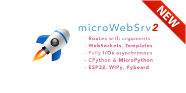
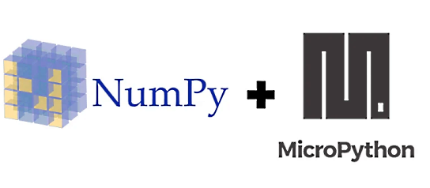
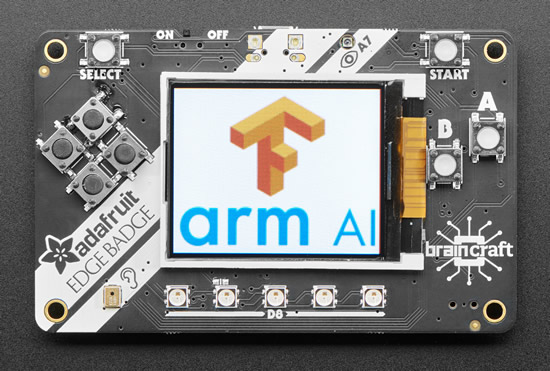

- [X] Kattni updates
- [ ] update title
- [ ] Link "View this email in your browser."

View this email in your browser.

## Python powered badges at Hackaday Supercon

Here are some of the details about the BrainCraft EDGE BADGE that is at [Supercon](https://hackaday.io/superconference/) this year brought to you by [Digi-Key](https://www.digikey.com/) and Adafruit! This is IN ADDITION to the [2019 Hackaday Superconference Badge](https://hackaday.io/project/167255-2019-hackaday-superconference-badge) - a FPGA Running RISC-V Core in a Game Boy form factor. Machine learning has come to the 'edge' - small microcontrollers that can run a very miniature version of TensorFlow Lite to do ML computations. But you don't need super complex hardware to start developing your own TensorFlow models! We've curated a simple kit to dip your toes into machine learning waters. This Supercon badge can also be a name badge that is programmed with CircuitPython, it shows up as USB drive, no IDE needed! Displays name, QR codes, and more! Supercon attendees receive:

*   Adafruit BrainCraft EDGE BADGE with SAMD51 Cortex M4F processor @ 120MHz, with display, speaker and buttons.
*   Lithium Ion Polymer Battery with Short Cable - 3.7V 350mAh, double sided tape, and lanyard!

The kit uses our BrainCraft EDGE BADGE as your edge processor. It's a compact board - it's credit card sized. It's powered by one of our favorite chip, the ATSAMD51, with 512KB of flash and 192KB of RAM. We add 2 MB of QSPI flash for file storage, handy for TensorFlow Lite files, images, fonts, sounds, or other assets. Comes with built in microphone input for micro speech recognition. Our Arduino library has some demos you can get started with to recognize various word pairs like "yes/no", "up/down" and "cat/dog" and other voice demos. Also includes gesture recognition, and more! TensorFlow Lite for microcontrollers is very cutting-edge so expect to see a lot of development happening in this area, with lots of code and process changes.

*   ATSAMD51J19 @ 120MHz with 3.3V logic/power - 512KB of FLASH + 192KB of RAM
*   2 MB of SPI Flash for storing images, sounds, animations, whatever!
*   1.8" 160x128 Color TFT Display connected to its own SPI port
*   8 x Game/Control Buttons with nice silicone button tops (these feel great)
*   5 x NeoPixels for badge dazzle, or game score-keeping
*   Triple-axis accelerometer (motion sensor)
*   Light sensor, reverse-mount so that it points out the front
*   Built in buzzer mini-speaker
*   Mono Class-D speaker driver for 4-8 ohm speakers, up to 2 Watts
*   LiPoly battery port with built in recharging capability
*   USB port for battery charging, programming and debugging
*   Two female header strips with Feather-compatible pinout so you can plug any FeatherWings in
*   JST ports for NeoPixels, sensor input, and I2C (you can fit I2C Grove connectors in here)
*   Built in microphone.
*   Reset button
*   On-Off switch

[Guides and more here!](https://learn.adafruit.com/tensorflow-lite-for-microcontrollers-kit-quickstart?view=all)

## Winterbloom Sol by Alethea Flowers

Winterbloom Sol is a modular synthesizer (Eurorack) module, and CircuitPython powered! It is a multi-purpose, scriptable USB MIDI to CV/gate converter. Its code can be modified while in use to change how it processes MIDI data into CV and gate outputs. Sol is not yet available for purchase, however, you may [contact the creator](https://circuitpython.org/board/winterbloom_sol/) for more details.

## Python #2 language on GitHub

Top languages over time from the State of Octoverse - [GitHub](https://octoverse.github.com/).

>_"for the first time, Python outranked Java as the second most popular language on GitHub by repository contributors."_

The following contributions to this week's newsletter are from [Matt](https://github.com/mattytrentini)! Thanks [Matt](https://twitter.com/matt_trentini)!

## New MicroPython Beginner Workshop 

MicroPython has a new [Beginner Workshop](https://micropython-workshop.readthedocs.io)! Based around the ESP32 and the readily-available Wemos shields (no breadboard, no wires!), this workshop aims to get beginners started using MicroPython on hardware *as soon as possible* and with a *low entry cost*. AUD$25 for the microcontroller, RGB LED shield, cable and small box.

MicroPython recently presented this workshop material for the first time to a dozen PyLadies in Melbourne and we all had a blast making LEDs flash, bending OLEDs to our will and blaring the Mario tune out of buzzers! The PyLadies were *fantastic* students and we're already looking forward to a second workshop.

If you'd like to run a workshop based on this material - or purchase beginner kits - please reach out to [Matt](https://twitter.com/matt_trentini) who'll help you get started. Pull requests are always welcome and if you're keen to [contribute to the material](https://github.com/mattytrentini/micropython_workshop) please do so!

Thanks to Deshipu for a hand getting started; the structure is based on Deshipu's (still excellent!) [MicroPython on ESP8266 Workshop](https://micropython-on-esp8266-workshop.readthedocs.io).

## MicroWebSrv2

[Jean-Christophe Bos](https://github.com/jczic) is at it again; he's updated his popular and powerful embedded web server - [MicroWebSrv2](https://github.com/jczic/MicroWebSrv2).

It features an asynchronous architecture, has SSL/TLS support, supports web routes, web sockets and a template system - it's certainly feature-packed! One of the best features? Great documentation! MicroWebSrv2 is one of the best ways to embed a web server in MicroPython.

## MicroPython uLab

[Zoltán Vörös](https://github.com/v923z) recently released his [ulab library](https://github.com/v923z/micropython-ulab) for MicroPython. As featured in the Hackaday article [Numpy comes to MicroPython](https://hackaday.com/2019/10/29/numpy-comes-to-micro-python/), ulab is a numpy-like module for MicroPython, accelerating many mathmatical operations on embedded devices. Zoltán started the library wanting fast FFT operations but it's now expanded to include optimised linear and matrix operations, minipulation of polynomials and statistical functions. As well as being a powerful library, it also features [thorough documentation](https://micropython-ulab.readthedocs.io).

Fast math operations in the embedded Python space have been a common request for some time, now we've got something to build upon! Read more in the [MicroPython forum](https://forum.micropython.org/viewtopic.php?f=3&t=7005).

## MicroPython Developer Documentation

During Zoltán's efforts creating uLab, Zoltán also submitted some *excellent* [MicroPython developer documentation](https://micropython-usermod.readthedocs.io). Focusing on creating your own C user modules for MicroPython, it covers topics such as how to pass parameters across the language boundaries, error handling and profiling. This should be bookmarked by anyone interested in extending MicroPython with C!

## Sponsoring Bunnie on GitHub

We are sponsoring bunnie on GitHub (we are also sponsoring [Arturo](https://github.com/arturo182)), they are now also doing matching - [Bunnie on GitHub](https://github.com/bunnie).

Bunnie is an open source hardware and an activist for digital rights and freedoms. Bunnie's work is primarily funded by the goodwill of the community, through donations, pledges and private contracts. Currently, Bunnie has two big community projects:

 * NeTV2, an open source video platform which is a basis of the lawsuit against the US government to challenge section 1201 of the DMCA.
 * Betrusted, an open source mobile communications device that aims to keep your private matters safe from advanced threats. It is designed for easy verification of correct construction and transparency.

Some of Bunnie's other current and past open source hardware projects include Chibitronics, Novena, Chumby, The Cubegarden, and the Safecast Geiger Counter Reference Design. Bunnie is also the author of The Hardware Hacker, Hacking the Xbox (now free to download), and The Essential Guide to Electronics in Shenzhen.

## News from around the web!

Giant board updates! - [Crowd Supply](https://www.crowdsupply.com/groboards/giant-board/updates/manufacturing-progress-and-usb-gadgets).

OpenTitan – Open sourcing transparent, trustworthy, and secure silicon - [Google](https://opensource.googleblog.com/2019/11/opentitan-open-sourcing-transparent.html).

#ICYDNCI What was the most popular, most clicked link, in [last week's newsletter](https://link)? [title](url).

## Coming soon

It's not out yet, but we did send PCBs off to fab...the PyPortal Titano has a 3.5" 320x480 TFT for 2x the pixels, USB C connector, and a CryptoAutho chip included. Its the same good PyPortal fun but BIGGER! THE BEEFIEST one yet!

WHO WATCHES THE WATCHMEN? We usually do on Sundays.

## New Learn Guides!

[Circuit Playground TFT Gizmo Snow Globe](https://learn.adafruit.com/circuit-playground-tft-gizmo-snow-globe) from [Carter Nelson](https://learn.adafruit.com/users/caternuson)

[Turtle Graphics in CircuitPython on TFT Gizmo](https://learn.adafruit.com/turtle-graphics-gizmo) from [John Park](https://learn.adafruit.com/users/johnpark)

[CircuitPython Animated Sprite Pendants](https://learn.adafruit.com/circuitpython-sprite-animation-pendant-mario-clouds-flying-toasters) from [Noe and Pedro](https://learn.adafruit.com/users/pixil3d)

## Updated Guides - Now With More Python!

**You can use CircuitPython libraries on Raspberry Pi!** We're updating all of our CircuitPython guides to show how to wire up sensors to your Raspberry Pi, and load the necessary CircuitPython libraries to get going using them with Python. We'll be including the updates here so you can easily keep track of which sensors are ready to go. Check it out!

[12mm LED Pixels](https://learn.adafruit.com/12mm-led-pixels)

[TTL Serial Camera](https://learn.adafruit.com/ttl-serial-camera)

## CircuitPython Libraries!

CircuitPython support for hardware continues to grow. We are adding support for new sensors and breakouts all the time, as well as improving on the drivers we already have. As we add more libraries and update current ones, you can keep up with all the changes right here!

For the latest drivers, download the [Adafruit CircuitPython Library Bundle](https://circuitpython.org/libraries).

If you'd like to contribute, CircuitPython libraries are a great place to start. Have an idea for a new driver? File an issue on [CircuitPython](https://github.com/adafruit/circuitpython/issues)! Interested in helping with current libraries? Check out the [CircuitPython.org Contributing page](https://circuitpython.org/contributing). We've included open pull requests and issues from the libraries, and details about repo-level issues that need to be addressed. We have a guide on [contributing to CircuitPython with Git and Github](https://learn.adafruit.com/contribute-to-circuitpython-with-git-and-github) if you need help getting started. You can also find us in the #circuitpython channel on the [Adafruit Discord](https://adafru.it/discord). Feel free to contact Kattni (@kattni) with any questions.

You can check out this [list of all the CircuitPython libraries and drivers available](https://github.com/adafruit/Adafruit_CircuitPython_Bundle/blob/master/circuitpython_library_list.md). 

The current number of CircuitPython libraries is **195**!

**New Libraries!**

Here's this week's new CircuitPython libraries:

 * [Adafruit_CircuitPython_DisplayIO_SSD1305](https://github.com/adafruit/Adafruit_CircuitPython_DisplayIO_SSD1305)

**Updated Libraries!**

Here's this week's updated CircuitPython libraries:

 * [Adafruit_CircuitPython_framebuf](https://github.com/adafruit/Adafruit_CircuitPython_framebuf)
 * [Adafruit_CircuitPython_WS2801](https://github.com/adafruit/Adafruit_CircuitPython_WS2801)
 * [Adafruit_CircuitPython_RGB_Display](https://github.com/adafruit/Adafruit_CircuitPython_RGB_Display)
 * [Adafruit_CircuitPython_SSD1305](https://github.com/adafruit/Adafruit_CircuitPython_SSD1305)

**PyPI Download Stats!**

We've written a special library called Adafruit Blinka that makes it possible to use CircuitPython Libraries on [Raspberry Pi and other compatible single-board computers](https://learn.adafruit.com/circuitpython-on-raspberrypi-linux/). Adafruit Blinka and all the CircuitPython libraries have been deployed to PyPI for super simple installation on Linux! Here are the top 10 CircuitPython libraries downloaded from PyPI in the last week, including the total downloads for those libraries:

| Library                                     | Last Week   | Total |   
|:-------                                     |:--------:   |:-----:|   
| Adafruit-Blinka                             | 1283        | 43174 |   
| Adafruit_CircuitPython_BusDevice            | 718         | 26118 |   
| Adafruit_CircuitPython_MCP230xx             | 249         | 9580 |    
| Adafruit_CircuitPython_NeoPixel             | 174         | 5195 |    
| Adafruit_CircuitPython_Register             | 149         | 5713 |    
| Adafruit_CircuitPython_LIS3DH               | 122         | 2697 |    
| Adafruit_CircuitPython_PCA9685              | 116         | 3870 |    
| Adafruit_CircuitPython_ServoKit             | 110         | 3098 |    
| Adafruit_CircuitPython_PN532                | 108         | 1426 |    
| Adafruit_CircuitPython_Motor                | 101         | 4124 |    

## Upcoming events!

Hackaday Superconference is November 15th, 16th, and 17th in Pasadena, California, USA. The Hackaday Superconference is returning for another 3 full days of technical talks, badge hacking, and hands-on workshops: [Eventbrite](https://www.eventbrite.com/e/hackaday-superconference-2019-tickets-60129236164?aff=0626com
) & [hackaday.io](https://hackaday.io/superconference/)

Arm AIoT Dev Summit, Mountain View, California, December 2 – 3, 2019. The Arm AIoT Dev Summit is a developer-focused conference that provides a platform for you to exchange knowledge, discuss real-world use cases and solutions, and get hands-on with expert-led, deep-dive training and workshops. 

Adafruit hardware will be there!

Along with like-minded developers, data scientists, and innovators, you will experience technologies enabling the Internet of Things (IoT), Artificial Intelligence (AI) and robotics. Get your hands on free hardware worth up to $500

April 15-23, 2020, Pittsburgh, Pennsylvania, USA - The PyCon 2020 conference, which will take place in Pittsburgh, is the largest annual gathering for the community using and developing the open-source Python programming language. It is produced and underwritten by the Python Software Foundation, the 501(c)(3) nonprofit organization dedicated to advancing and promoting Python. Through PyCon, the PSF advances its mission of growing the international community of Python programmers - [PyCon 2020](https://us.pycon.org/2020/).

## Latest releases

CircuitPython's stable release is [#.#.#](https://github.com/adafruit/circuitpython/releases/latest) and its unstable release is [#.#.#-##.#](https://github.com/adafruit/circuitpython/releases). New to CircuitPython? Start with our [Welcome to CircuitPython Guide](https://learn.adafruit.com/welcome-to-circuitpython).

[2019####](https://github.com/adafruit/Adafruit_CircuitPython_Bundle/releases/latest) is the latest CircuitPython library bundle.

[v#.#.#](https://micropython.org/download) is the latest MicroPython release. Documentation for it is [here](http://docs.micropython.org/en/latest/pyboard/).

[#.#.#](https://www.python.org/downloads/) is the latest Python release. The latest pre-release version is [#.#.#](https://www.python.org/download/pre-releases/).

[1456 Stars](https://github.com/adafruit/circuitpython/stargazers) Like CircuitPython? [Star it on GitHub!](https://github.com/adafruit/circuitpython)

## Call for help – CircuitPython messaging to other languages!

We [recently posted on the Adafruit blog](https://blog.adafruit.com/2018/08/15/help-bring-circuitpython-messaging-to-other-languages-circuitpython/) about bringing CircuitPython messaging to other languages, one of the exciting features of CircuitPython 4.x is translated control and error messages. Native language messages will help non-native English speakers understand what is happening in CircuitPython even though the Python keywords and APIs will still be in English. If you would like to help, [please post](https://github.com/adafruit/circuitpython/issues/1098) to the main issue on GitHub and join us on [Discord](https://adafru.it/discord).

We made this graphic with translated text, we could use your help with that to make sure we got the text right, please check out the text in the image – if there is anything we did not get correct, please let us know. Dan sent me this [handy site too](http://helloworldcollection.de/#Human).

## jobs.adafruit.com - Find a dream job, find great candidates!

[jobs.adafruit.com](https://jobs.adafruit.com/) has returned and folks are posting their skills (including CircuitPython) and companies are looking for talented makers to join their companies - from Digi-Key, to Hackaday, Microcenter, Raspberry Pi and more.

## NUMBER thanks!

The Adafruit Discord community, where we do all our CircuitPython development in the open, reached over NUMBER humans, thank you! Join today! [https://adafru.it/discord](https://adafru.it/discord)

Discord now offers “server boosts”. We have 30 on our server (level 3!), unlocking some good features for the community: +100 emojis for a total of 250, 384 Kbps audio, a vanity URL, 100 mb uploads for all members (and all the things we have now, like the server banner). Stop by and boost! [adafru.it/discord](https://adafru.it/discord).

## ICYMI - In case you missed it

The wonderful world of Python on hardware! This is our first video-newsletter-podcast that we’ve started! The news comes from the Python community, Discord, Adafruit communities and more. It’s part of the weekly newsletter, then we have a segment on ASK an ENGINEER and this is the video slice from that! The complete Python on Hardware weekly videocast [playlist is here](https://www.youtube.com/playlist?list=PLjF7R1fz_OOXRMjM7Sm0J2Xt6H81TdDev). 

This video podcast is on [iTunes](https://itunes.apple.com/us/podcast/python-on-hardware/id1451685192?mt=2), [YouTube](https://www.youtube.com/playlist?list=PLjF7R1fz_OOXRMjM7Sm0J2Xt6H81TdDev), [IGTV (Instagram TV](https://www.instagram.com/adafruit/channel/)), and [XML](https://itunes.apple.com/us/podcast/python-on-hardware/id1451685192?mt=2).

[Weekly community chat on Adafruit Discord server CircuitPython channel - Audio / Podcast edition](https://itunes.apple.com/us/podcast/circuitpython-weekly-meeting/id1451685016) - Audio from the Discord chat space for CircuitPython, meetings are usually Mondays at 2pm ET, this is the audio version on [iTunes](https://itunes.apple.com/us/podcast/circuitpython-weekly-meeting/id1451685016), Pocket Casts, [Spotify](https://adafru.it/spotify), and [XML feed](https://adafruit-podcasts.s3.amazonaws.com/circuitpython_weekly_meeting/audio-podcast.xml).

And lastly, we are working up a one-spot destination for all things podcast-able here - [podcasts.adafruit.com](https://podcasts.adafruit.com/)

## Codecademy "Learn Hardware Programming with CircuitPython"

Codecademy, an online interactive learning platform used by more than 45 million people, has teamed up with the leading manufacturer in STEAM electronics, Adafruit Industries, to create a coding course, "Learn Hardware Programming with CircuitPython". The course is now available in the [Codecademy catalog](https://www.codecademy.com/learn/learn-circuitpython?utm_source=adafruit&utm_medium=partners&utm_campaign=circuitplayground&utm_content=pythononhardwarenewsletter).

Python is a highly versatile, easy to learn programming language that a wide range of people, from visual effects artists in Hollywood to mission control at NASA, use to quickly solve problems. But you don’t need to be a rocket scientist to accomplish amazing things with it. This new course introduces programmers to Python by way of a microcontroller — CircuitPython — which is a Python-based programming language optimized for use on hardware.

CircuitPython’s hardware-ready design makes it easier than ever to program a variety of single-board computers, and this course gets you from no experience to working prototype faster than ever before. Codecademy’s interactive learning environment, combined with Adafruit's highly rated Circuit Playground Express, present aspiring hardware hackers with a never-before-seen opportunity to learn hardware programming seamlessly online.

Whether for those who are new to programming, or for those who want to expand their skill set to include physical computing, this course will have students getting familiar with Python and creating incredible projects along the way. By the end, students will have built their own bike lights, drum machine, and even a moisture detector that can tell when it's time to water a plant.

Visit Codecademy to access the [Learn Hardware Programming with CircuitPython](https://www.codecademy.com/learn/learn-circuitpython?utm_source=adafruit&utm_medium=partners&utm_campaign=circuitplayground&utm_content=pythononhardwarenewsletter) course and Adafruit to purchase a [Circuit Playground Express](https://www.adafruit.com/product/3333).

Codecademy has helped more than 45 million people around the world upgrade their careers with technology skills. The company’s online interactive learning platform is widely recognized for providing an accessible, flexible, and engaging experience for beginners and experienced programmers alike. Codecademy has raised a total of $43 million from investors including Union Square Ventures, Kleiner Perkins, Index Ventures, Thrive Capital, Naspers, Yuri Milner and Richard Branson, most recently raising its $30 million Series C in July 2016.

## Contribute!

The CircuitPython Weekly Newsletter is a CircuitPython community-run newsletter emailed every Tuesday. The complete [archives are here](https://www.adafruitdaily.com/category/circuitpython/). It highlights the latest CircuitPython related news from around the web including Python and MicroPython developments. To contribute, edit next week's draft [on GitHub](https://github.com/adafruit/circuitpython-weekly-newsletter/tree/gh-pages/_drafts) and [submit a pull request](https://help.github.com/articles/editing-files-in-your-repository/) with the changes. Join our [Discord](https://adafru.it/discord) or [post to the forum](https://forums.adafruit.com/viewforum.php?f=60) for any further questions.
