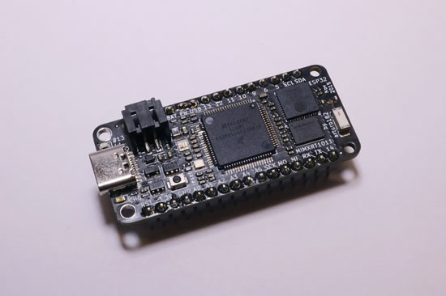
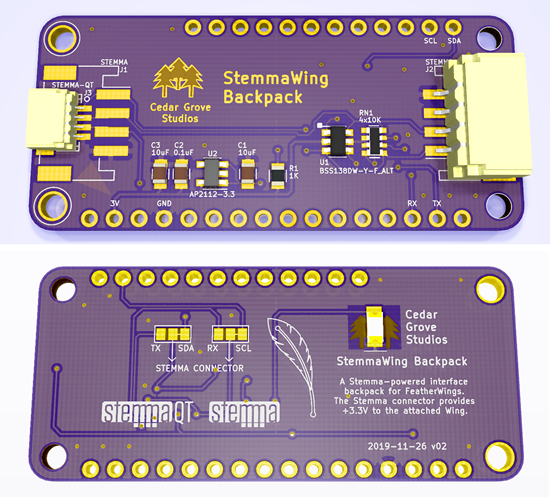
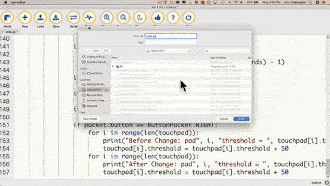
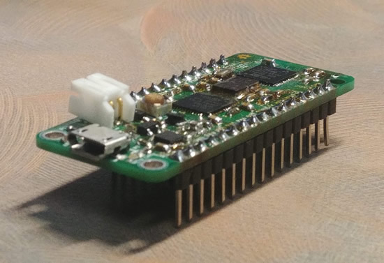
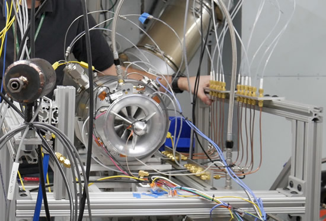
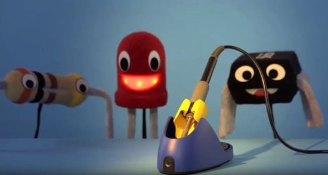

- [ ] Link "View this email in your browser."

[View this email]() in your browser.

## Native MP3 decoding/playback in CircuitPython

We’re testing out a new PR in CircuitPython by JEpler. This one adds native MP3 decoding – no playback chip required! Thanks to the patent expiration, we can now distribute MP3 decoding and its a great way to support compressed audio playback. We can even play 2 mp3’s at once. More than that isn’t possible yet due to RAM constraints. I’m testing an nRF52840 BLE feather with I2S. We’ll also try SAMD51 next. SAMD21 won’t be able to do it, due to the RAM requirements - [YouTube](https://youtu.be/4xh_mPaYG3s).

## Circuitpython snakes its way to Fomu thanks to TinyUSB

Want Python in your USB port? Try the beta of CircuitPython for Fomu! Full USB support thanks to the new eptri USB port, and the awesome TinyUSB library. Binaries and instructions are here - v0.1.1-fomu: Beta Release 2 - [GitHub](https://github.com/xobs/circuitpython/releases). AND xobs has a cool post about making a profiler for optimization too - [xobs.io](https://xobs.io/cobbled-together-profiler/)

TinyUSB, it now supports all NXP iMXRT cortex m7s including rt1010, rt1015, rt1020, rt1050, rt1060, rt1064 - [GitHub](https://github.com/hathach/tinyusb). Over 300+ stars and 70+ forks!

## NXP i.MX RT family takes flight with Feather and CircuitPython!

CircuitPython snakes its way to the  powerful NXP i.MX RT family of MCUs, 500+ MHz and up to 1 MB RAM. Arturo is working on 2 Feathers: RT1011 + ESP32, and RT1062 with more GPIOs broken out (including the LCD interface) and a SD card - [Twitter](https://twitter.com/arturo182/status/1199841134253682690).

## News from around the web!

AdafruitRadio Advertisement class for BLE in CircuitPython - [GitHub](https://github.com/adafruit/Adafruit_CircuitPython_BLE/pull/33).

Speaking of BLE and CircuitPython! Here are couple shots, and a video link, of the demo(s) Scott was working on getting notifications working from Slack, Twitter, and more! - [YouTube](https://youtu.be/-pBEdDONKyQ?t=359).

Wow! David is running [CheerLights](https://twitter.com/cheerlights) on a PyGamer + AirLift FeatherWing. CircuitPython allowed David to do IoT rapid prototyping with WiFi internet access. Changing the color from a simple tweet, and BLE communication - [Twitter](https://twitter.com/DavidGlaude/status/1200775886980681729), and code - [GitHub](https://gist.github.com/dglaude/cc9f7d596c7d976e9c331a9e00e43292).

[Here's a FeatherWing](https://github.com/CedarGroveStudios/Stemma_Host_FeatherWing) that attaches to a Feather MCU board and provides a Stemma or StemmaQT interface connection. [The other board](https://github.com/CedarGroveStudios/StemmaWing_Backpack) is a backpack that adds a standalone Stemma interface to a non-MCU FeatherWing (like I2C OLED and LED displays) - [hackaday.io](https://hackaday.io/project/168664-stemma-host-and-backpack-featherwings), thanks Cedar!

CircuitPython, and Raspberry Pi Lectures: [video 1](https://youtu.be/Mn9943WX73E), [video 2](https://youtu.be/uD2EEwJ7JhY), and [video 3](https://youtu.be/enIHE6ESoQ0) from maduino - [YouTube](https://www.youtube.com/channel/UCq7SPRGmLmjnFPHqYmgFcAg/featured).

Build a CircuitPython-Powered, Touch-Sensitive, Bluetooth Aware, App-Controllable, Talking, Christmas Cheer and Candy-Cane Dispensing "Buddy the Elf". A no-solder build powered by Circuit Playground Bluefruit - [YouTube](https://youtu.be/AHcwQRxTjOY), and [GitHub](https://github.com/gallaugher/buddy-the-elf).

CCCoven Badge runs CircuitPython, [Twitter](https://twitter.com/i8br/status/1200663646101286914), and [sign up here](https://docs.google.com/forms/d/e/1FAIpQLSdlM5hdLwOl44PzHhhqUF4JBGoofzeSIvbZWbsFioitaBuYeQ/viewform) to show interest in purchasing one!

FeatherSnow is an easy way to unlock your programming creativity with CircuitPython - [hackaday.io](https://hackaday.io/project/168684-feathersnow)

[Actinius'](https://www.actinius.com/environmental-sensor-featherwing) Environmental Sensor FeatherWing Measures Temperature, Humidity, Pressure, and Air Quality
Feather-compatible environmental sensor add-on also includes a Grove connector for use with any I2C-compatible microcontroller - [hackster.io](https://www.hackster.io/news/actinius-environmental-sensor-featherwing-measures-temperature-humidity-pressure-and-air-quality-5bc095f3242c)

The latest on the electronic bag that GeekMomProjects is working on, micro:bit powered, a production sample of the third Bright Bag style, the "Annie," named after groundbreaking NASA programmer and rocket scientist Annie Easley, [Instagram](https://www.instagram.com/p/B5frljila-g/), and [brightwearables.com](https://brightwearables.com/).

MINHF4, An STM32F4 Arduino Compatible Board. A feather-like STM32F4 - [hackaday.io](https://hackaday.io/project/163853-minhf4-an-stm32f4-arduino-compatible-board)

MicroPython ILI9341 driver is working, by Unexpected Maker, this might be for the MicroPython based reflow oven - [Twitter](https://twitter.com/unexpectedmaker/status/1200969547710287872).

Thread about C, Python, JS, C/C++, for MCUs - [Twitter](https://twitter.com/timonsku/status/1199156434761633794).

Super cute Bubble Punk by Mohit. Based on the Teensy LC, bubble punk measures temperature and humidity using an Adafruit SHT31-D breakout board, and displays them on a vintage seven segment bubble display - [Twitter](https://twitter.com/MohitBhoite/status/1199940573810978818).

The Art of Electronics: The x-Chapters expands on topics introduced in the third edition of The Art of Electronics, check out the [table of contents](https://x.artofelectronics.net/the-book/table-of-contents/), [sample chapters](https://x.artofelectronics.net/the-book/sample-chapter/), and [more](https://x.artofelectronics.net/).

AFRL tests in-house, rapidly developed small engine, called the the Responsive Open Source Engine (ROSE) - [Air Force Research Laboratory Aerospace Systems](https://www.wpafb.af.mil/News/Article-Display/Article/2011131/afrl-tests-in-house-rapidly-developed-small-engine/).

Ladyada teaches how to safely wield the legendary soldering iron – safely! - [YouTube](https://youtu.be/JCXGjD0Rpg8).

#ICYDNCI What was the most popular, most clicked link, in [last week's newsletter](https://www.adafruitdaily.com/2019/11/26/circuitpython-5-0-0-beta-0-released-python-hits-the-newsstands-and-more-python-adafruit-circuitpython-pythonhardware-circuitpython-micropython-thepsf-adafruit/)? [CircuitPython Downloads](https://circuitpython.org/downloads)!

## Coming soon

## Take Flight with Feather - Hackaday and Digi-Key

The Adafruit Feather is the latest platform for microcontroller development, and companies like Particle, Sparkfun, and Seeed Studios are producing Feather-compatible devices for development and prototyping. Now it’s your turn. Design a board to fit in the Feather ecosystem and we’ll manufacture it. The best project in the Take Flight With Feather contest will be sent off to pick and place machines and head straight to the Digi-Key warehouse!

To get started, take a look at the current [Feather ecosystem](https://learn.adafruit.com/adafruit-feather/community-feathers-wings) and get acquainted with the [GitHub repo filled with examples and tutorials](https://github.com/adafruit/awesome-feather).

There are over 38+ entries at this time!

Stop by [hackaday.io for more details](https://hackaday.io/contest/168107-take-flight-with-feather)!

## Tis' the season - ADADEALS, DigiWish, and more!

It's the holiday season, so there are tons of deals and more for folks who do electronics. We emailed a bunch of companies that are in the maker/engineering world and asked what sales they had to help get the word out, we called this [#ADADEALS](https://blog.adafruit.com/?s=%23adadeals) and have [over a dozen posts, check them out](https://blog.adafruit.com/?s=%23adadeals), some of the sales and deals are stil going on. Many of them have some type of python on hardware offering too.

Next up, DigiWish is happening. For DigiWish, all you need to do is pick something that is $100 or less in the Digi-Key store and then use the tag #DigiWish on [Twitter](https://twitter.com/search?q=digiwish&src=typed_query&f=live), [Facebook](https://www.facebook.com/search/top/?q=%23digiwish&epa=SEARCH_BOX), or Instagram. Digi-Key will let folks know each day if they won. Contest begins December 1, 2019 and ends December 24, 2019. Digi-Key has tons of [Python on hardware](https://www.digikey.com/python), go get it! More details here - [Digi-Key.com](https://www.digikey.com/en/resources/social/digi-wish)

Tuesday, Dec 3rd, is [#GivingTuesday](https://twitter.com/search?q=%23GivingTuesday&src=typed_query&f=live). We'll post up some organizations that help education, open-source, good causes, and more.

AND for Python folks, [#GivingTuesdayPSF](https://twitter.com/search?q=%23GivingTuesdayPSF&src=typed_query&f=live) is on December 3rd and runs for 24 hours local time. Visit the [Python Foundation](https://www.python.org/psf/) - [@ThePSF](https://twitter.com/ThePSF/) to see what they are doing this year how you can make a difference in the Python community.

None of this was sponsored by anyone, or any company, we just wanted to help get the word out about some good companies and good causes.

## New Learn Guides!

[Bluefruit Luminary Lanterns with Capacitive Touch](https://learn.adafruit.com/bluefruit-luminary-lanterns-with-capacitive-touch) from [Erin St. Blaine](https://learn.adafruit.com/users/firepixie)

[Snow Globe with Circuit Playground Bluefruit](https://learn.adafruit.com/snow-globe-bluefruit-cpb) from [John Park](https://learn.adafruit.com/users/johnpark)

## Updated Guides - Now With More Python!

**You can use CircuitPython libraries on Raspberry Pi!** We're updating all of our CircuitPython guides to show how to wire up sensors to your Raspberry Pi, and load the necessary CircuitPython libraries to get going using them with Python. We'll be including the updates here so you can easily keep track of which sensors are ready to go. Check it out!

Keep checking back for more updated guides!

## CircuitPython Libraries!

CircuitPython support for hardware continues to grow. We are adding support for new sensors and breakouts all the time, as well as improving on the drivers we already have. As we add more libraries and update current ones, you can keep up with all the changes right here!

For the latest drivers, download the [Adafruit CircuitPython Library Bundle](https://circuitpython.org/libraries).

If you'd like to contribute, CircuitPython libraries are a great place to start. Have an idea for a new driver? File an issue on [CircuitPython](https://github.com/adafruit/circuitpython/issues)! Interested in helping with current libraries? Check out the [CircuitPython.org Contributing page](https://circuitpython.org/contributing). We've included open pull requests and issues from the libraries, and details about repo-level issues that need to be addressed. We have a guide on [contributing to CircuitPython with Git and Github](https://learn.adafruit.com/contribute-to-circuitpython-with-git-and-github) if you need help getting started. You can also find us in the #circuitpython channel on the [Adafruit Discord](https://adafru.it/discord). Feel free to contact Kattni (@kattni) with any questions.

You can check out this [list of all the CircuitPython libraries and drivers available](https://github.com/adafruit/Adafruit_CircuitPython_Bundle/blob/master/circuitpython_library_list.md). 

The current number of CircuitPython libraries is **196**!

**Updated Libraries!**

Here's this week's updated CircuitPython libraries:

 * [Adafruit_CircuitPython_AVRprog](https://github.com/adafruit/Adafruit_CircuitPython_AVRprog)
 * [Adafruit_CircuitPython_AMG88xx](https://github.com/adafruit/Adafruit_CircuitPython_AMG88xx)
 * [Adafruit_CircuitPython_Waveform](https://github.com/adafruit/Adafruit_CircuitPython_Waveform)
 * [Adafruit_CircuitPython_SSD1608](https://github.com/adafruit/Adafruit_CircuitPython_SSD1608)
 * [Adafruit_CircuitPython_OneWire](https://github.com/adafruit/Adafruit_CircuitPython_OneWire)
 * [Adafruit_CircuitPython_Motor](https://github.com/adafruit/Adafruit_CircuitPython_Motor)
 * [Adafruit_CircuitPython_MAX7219](https://github.com/adafruit/Adafruit_CircuitPython_MAX7219)
 * [Adafruit_CircuitPython_INA219](https://github.com/adafruit/Adafruit_CircuitPython_INA219)
 * [Adafruit_CircuitPython_ILI9341](https://github.com/adafruit/Adafruit_CircuitPython_ILI9341)
 * [Adafruit_CircuitPython_FocalTouch](https://github.com/adafruit/Adafruit_CircuitPython_FocalTouch)
 * [Adafruit_CircuitPython_DS2413](https://github.com/adafruit/Adafruit_CircuitPython_DS2413)
 * [Adafruit_CircuitPython_BoardTest](https://github.com/adafruit/Adafruit_CircuitPython_BoardTest)
 * [Adafruit_CircuitPython_RTTTL](https://github.com/adafruit/Adafruit_CircuitPython_RTTTL)
 * [Adafruit_CircuitPython_SimpleIO](https://github.com/adafruit/Adafruit_CircuitPython_SimpleIO)
 * [Adafruit_CircuitPython_US100](https://github.com/adafruit/Adafruit_CircuitPython_US100)
 * [Adafruit_CircuitPython_VL53L0X](https://github.com/adafruit/Adafruit_CircuitPython_VL53L0X)
 * [Adafruit_CircuitPython_RGB_Display](https://github.com/adafruit/Adafruit_CircuitPython_RGB_Display)
 * [Adafruit_CircuitPython_BusDevice](https://github.com/adafruit/Adafruit_CircuitPython_BusDevice)
 * [Adafruit_CircuitPython_Display_Text](https://github.com/adafruit/Adafruit_CircuitPython_Display_Text)
 * [Adafruit_CircuitPython_RA8875](https://github.com/adafruit/Adafruit_CircuitPython_RA8875)
 * [Adafruit_CircuitPython_PYOA](https://github.com/adafruit/Adafruit_CircuitPython_PYOA)
 * [Adafruit_CircuitPython_74HC595](https://github.com/adafruit/Adafruit_CircuitPython_74HC595)

**PyPI Download Stats!**

We've written a special library called Adafruit Blinka that makes it possible to use CircuitPython Libraries on [Raspberry Pi and other compatible single-board computers](https://learn.adafruit.com/circuitpython-on-raspberrypi-linux/). Adafruit Blinka and all the CircuitPython libraries have been deployed to PyPI for super simple installation on Linux! Here are the top 10 CircuitPython libraries downloaded from PyPI in the last week, including the total downloads for those libraries:

| Library                                     | Last Week   | Total |   
|:-------                                     |:--------:   |:-----:|   
| Adafruit-Blinka                             | 1515        | 41235 |   
| Adafruit_CircuitPython_BusDevice            | 882         | 24894 |   
| Adafruit_CircuitPython_MCP230xx             | 303         | 9852 |    
| Adafruit_CircuitPython_Register             | 215         | 5211 |    
| Adafruit_CircuitPython_NeoPixel             | 195         | 4703 |    
| Adafruit_CircuitPython_Motor                | 168         | 3690 |    
| Adafruit_CircuitPython_ServoKit             | 135         | 2946 |    
| Adafruit_CircuitPython_PCA9685              | 127         | 3461 |    
| Adafruit_CircuitPython_RGB_Display          | 100         | 1179 |    
| Adafruit_CircuitPython_ESP32SPI             | 97          | 2390 |        

## Upcoming events!

TechAhoy Inc. is a nonprofit makerspace located in Queens, NY building tech literacy by educating, encouraging and empowering community members, some classes coming up!

>_"We are planning two family workshops that will be hosted over the weekend: 1. Code Together - learn to code with your kids using a Circuit Playground Express, an amazing board from Adafruit and 2. Light up the Night - learn how to add LEDs and EL wire to jackets, hats, and more. We are also offering the Code in Python class on Saturday December 7th at 3PM!"_

Scott is speaking at [PyCascades](https://2020.pycascades.com/) about Python's Next Decade and Us. It's February 8th and 9th, 2020.

>_"PyCascades is a two-day, single-track Python conference. We previously hosted PyCascades in Vancouver and Seattle. For our third iteration in 2020 we'll be in Portland, Oregon. PyCascades is organized by members of the Python communities in Vancouver, Seattle, and Portland. We aim to bring together Python users and developers from both the Pacific Northwest and around the world."_

April 15-23, 2020, Pittsburgh, Pennsylvania, USA - The PyCon 2020 conference, which will take place in Pittsburgh, is the largest annual gathering for the community using and developing the open-source Python programming language. It is produced and underwritten by the Python Software Foundation, the 501(c)(3) nonprofit organization dedicated to advancing and promoting Python. Through PyCon, the PSF advances its mission of growing the international community of Python programmers - [PyCon 2020](https://us.pycon.org/2020/).

## Latest releases

CircuitPython's stable release is [4.1.0](https://github.com/adafruit/circuitpython/releases/latest) and its unstable release is [5.0.0-beta.0](https://github.com/adafruit/circuitpython/releases). New to CircuitPython? Start with our [Welcome to CircuitPython Guide](https://learn.adafruit.com/welcome-to-circuitpython).

[2019####](https://github.com/adafruit/Adafruit_CircuitPython_Bundle/releases/latest) is the latest CircuitPython library bundle.

[v1.11](https://micropython.org/download) is the latest MicroPython release. Documentation for it is [here](http://docs.micropython.org/en/latest/pyboard/).

[3.8.0](https://www.python.org/downloads/) is the latest Python release.

[1484 Stars](https://github.com/adafruit/circuitpython/stargazers) Like CircuitPython? [Star it on GitHub!](https://github.com/adafruit/circuitpython)

## Call for help – CircuitPython messaging to other languages!

We [recently posted on the Adafruit blog](https://blog.adafruit.com/2018/08/15/help-bring-circuitpython-messaging-to-other-languages-circuitpython/) about bringing CircuitPython messaging to other languages, one of the exciting features of CircuitPython 4.x is translated control and error messages. Native language messages will help non-native English speakers understand what is happening in CircuitPython even though the Python keywords and APIs will still be in English. If you would like to help, [please post](https://github.com/adafruit/circuitpython/issues/1098) to the main issue on GitHub and join us on [Discord](https://adafru.it/discord).

We made this graphic with translated text, we could use your help with that to make sure we got the text right, please check out the text in the image – if there is anything we did not get correct, please let us know. Dan sent me this [handy site too](http://helloworldcollection.de/#Human).

## jobs.adafruit.com - Find a dream job, find great candidates!

[jobs.adafruit.com](https://jobs.adafruit.com/) has returned and folks are posting their skills (including CircuitPython) and companies are looking for talented makers to join their companies - from Digi-Key, to Hackaday, Microcenter, Raspberry Pi and more.

## NUMBER thanks!

The Adafruit Discord community, where we do all our CircuitPython development in the open, reached over NUMBER humans, thank you! Join today! [https://adafru.it/discord](https://adafru.it/discord)

## ICYMI - In case you missed it

The wonderful world of Python on hardware! This is our first video-newsletter-podcast that we’ve started! The news comes from the Python community, Discord, Adafruit communities and more. It’s part of the weekly newsletter, then we have a segment on ASK an ENGINEER and this is the video slice from that! The complete Python on Hardware weekly videocast [playlist is here](https://www.youtube.com/playlist?list=PLjF7R1fz_OOXRMjM7Sm0J2Xt6H81TdDev). 

This video podcast is on [iTunes](https://itunes.apple.com/us/podcast/python-on-hardware/id1451685192?mt=2), [YouTube](https://www.youtube.com/playlist?list=PLjF7R1fz_OOXRMjM7Sm0J2Xt6H81TdDev), [IGTV (Instagram TV](https://www.instagram.com/adafruit/channel/)), and [XML](https://itunes.apple.com/us/podcast/python-on-hardware/id1451685192?mt=2).

[Weekly community chat on Adafruit Discord server CircuitPython channel - Audio / Podcast edition](https://itunes.apple.com/us/podcast/circuitpython-weekly-meeting/id1451685016) - Audio from the Discord chat space for CircuitPython, meetings are usually Mondays at 2pm ET, this is the audio version on [iTunes](https://itunes.apple.com/us/podcast/circuitpython-weekly-meeting/id1451685016), Pocket Casts, [Spotify](https://adafru.it/spotify), and [XML feed](https://adafruit-podcasts.s3.amazonaws.com/circuitpython_weekly_meeting/audio-podcast.xml).

And lastly, we are working up a one-spot destination for all things podcast-able here - [podcasts.adafruit.com](https://podcasts.adafruit.com/)

## Codecademy "Learn Hardware Programming with CircuitPython"

Codecademy, an online interactive learning platform used by more than 45 million people, has teamed up with the leading manufacturer in STEAM electronics, Adafruit Industries, to create a coding course, "Learn Hardware Programming with CircuitPython". The course is now available in the [Codecademy catalog](https://www.codecademy.com/learn/learn-circuitpython?utm_source=adafruit&utm_medium=partners&utm_campaign=circuitplayground&utm_content=pythononhardwarenewsletter).

Python is a highly versatile, easy to learn programming language that a wide range of people, from visual effects artists in Hollywood to mission control at NASA, use to quickly solve problems. But you don’t need to be a rocket scientist to accomplish amazing things with it. This new course introduces programmers to Python by way of a microcontroller — CircuitPython — which is a Python-based programming language optimized for use on hardware.

CircuitPython’s hardware-ready design makes it easier than ever to program a variety of single-board computers, and this course gets you from no experience to working prototype faster than ever before. Codecademy’s interactive learning environment, combined with Adafruit's highly rated Circuit Playground Express, present aspiring hardware hackers with a never-before-seen opportunity to learn hardware programming seamlessly online.

Whether for those who are new to programming, or for those who want to expand their skill set to include physical computing, this course will have students getting familiar with Python and creating incredible projects along the way. By the end, students will have built their own bike lights, drum machine, and even a moisture detector that can tell when it's time to water a plant.

Visit Codecademy to access the [Learn Hardware Programming with CircuitPython](https://www.codecademy.com/learn/learn-circuitpython?utm_source=adafruit&utm_medium=partners&utm_campaign=circuitplayground&utm_content=pythononhardwarenewsletter) course and Adafruit to purchase a [Circuit Playground Express](https://www.adafruit.com/product/3333).

Codecademy has helped more than 45 million people around the world upgrade their careers with technology skills. The company’s online interactive learning platform is widely recognized for providing an accessible, flexible, and engaging experience for beginners and experienced programmers alike. Codecademy has raised a total of $43 million from investors including Union Square Ventures, Kleiner Perkins, Index Ventures, Thrive Capital, Naspers, Yuri Milner and Richard Branson, most recently raising its $30 million Series C in July 2016.

## Contribute!

The CircuitPython Weekly Newsletter is a CircuitPython community-run newsletter emailed every Tuesday. The complete [archives are here](https://www.adafruitdaily.com/category/circuitpython/). It highlights the latest CircuitPython related news from around the web including Python and MicroPython developments. To contribute, edit next week's draft [on GitHub](https://github.com/adafruit/circuitpython-weekly-newsletter/tree/gh-pages/_drafts) and [submit a pull request](https://help.github.com/articles/editing-files-in-your-repository/) with the changes. Join our [Discord](https://adafru.it/discord) or [post to the forum](https://forums.adafruit.com/viewforum.php?f=60) for any further questions.
