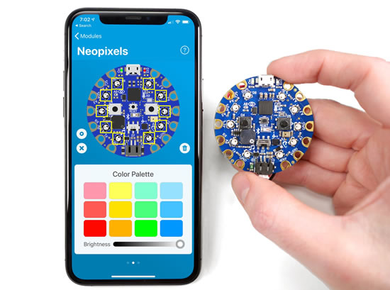
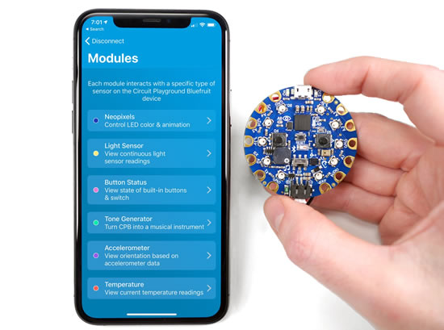
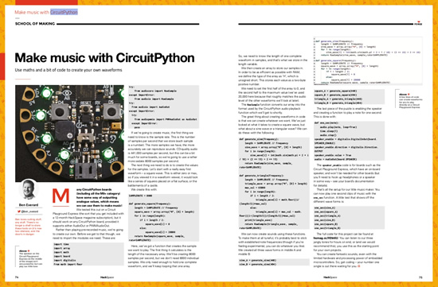
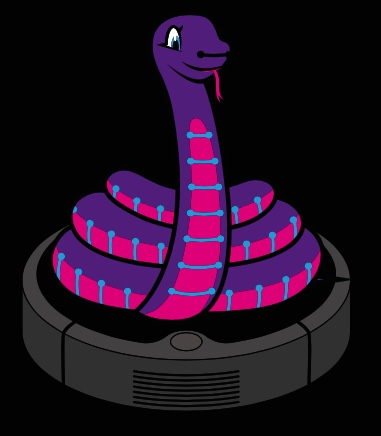
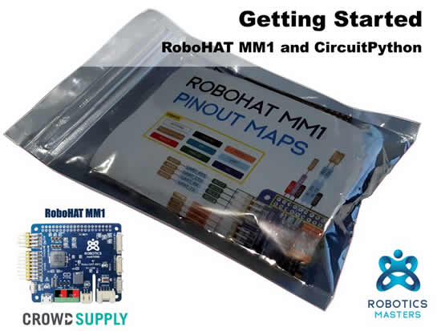
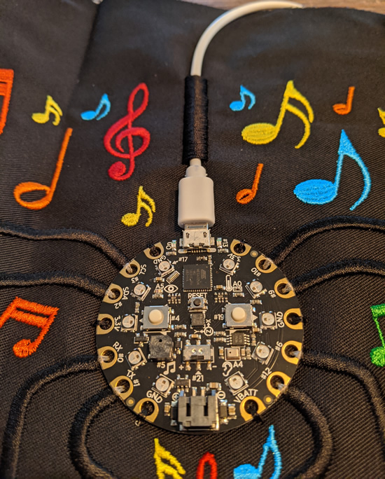
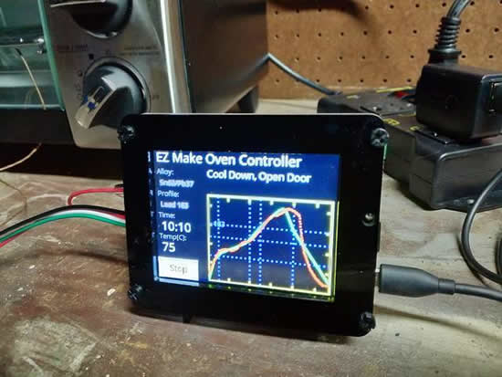
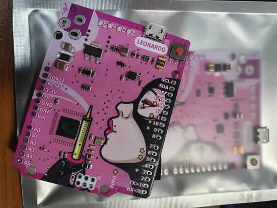
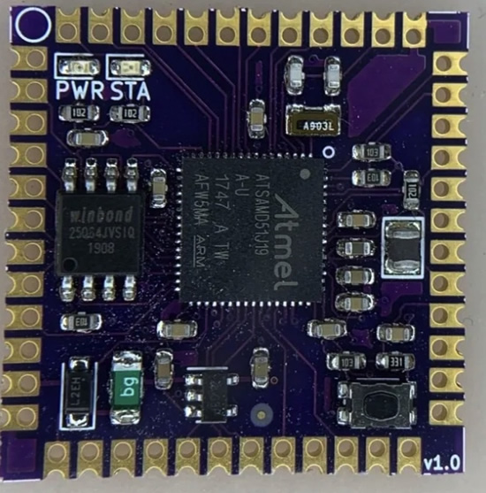
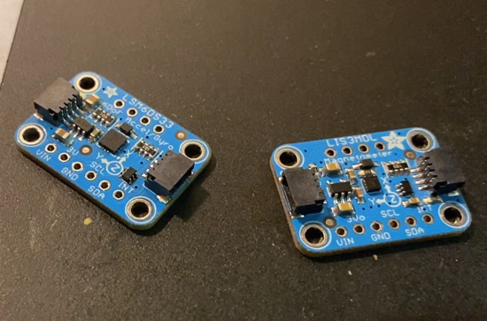

- [ ] Link "View this email in your browser."

[View this email]() in your browser.

## MicroPython 1.12 released!

PYBD boards, BLE and littlefs, dynamic native modules, samd, powerpc and more, nice update! - [GitHub](https://github.com/micropython/micropython/releases/tag/v1.12).

## 94 boards on Circuitpython.org !

There are over 94+ boards on circuitpython.org. Less than half of the boards are from Adafruit, there are 40 Adafruit-made boards and 54+ from everyone else! This means there an entire ecosystem of boards out there from makers and companies around the world, all that run the open-source CircuitPython! - [circuitpython.org/downloads](https://circuitpython.org/downloads). 100 boards here we come!

Speaking of [circuitpython.org](https://circuitpython.org), we'll have an update to the pages soon, this is super-seckret preview!

## CircuitPython 4.1.2 released!

4.1.2 is a minor stable release. Most notably, it updates the adafruit_circuitplayground frozen library for Circuit Playground Express. It shouldn’t break any code compatible with previous 4.x releases. If you don’t have a Circuit Playground Express or a PyRuler, or a board with frozen libraries, there is no strong reason to update to 4.1.2 - [GitHub](https://github.com/adafruit/circuitpython/releases/tag/4.1.2).

## CircuitPython 5.0.0 Beta 2 related

This is release 5.0.0 beta.2. It improves our internal filesystem definitions and may overwrite your existing files so make sure to back them up before updating! Beta releases are largely feature-complete, but are meant for testing. Use the latest stable 4.x release when first starting with CircuitPython - [GitHub](https://github.com/adafruit/circuitpython/releases).

## Bluefruit Playground released!

Circuit Playground Bluefruit is the most fun you can have with a circuit board – and Bluefruit Playground makes it even better. Connect Bluefruit Playground to a Circuit Playground Bluefruit board and you can:

 * Control LED color & animation
 * View continuous light sensor readings
 * View state of built-in buttons & switch
 * Turn CPB into a musical instrument
 * View orientation based on accelerometer data
 * View temperature readings

All without soldering or writing a single line of code! - [Apple App store](https://apps.apple.com/us/app/bluefruit-playground/id1489549571).

[Bluefruit Playground](https://apps.apple.com/us/app/bluefruit-playground/id1489549571?ls=1) is our new iOS app designed for use with [Circuit Playground Bluefruit](https://www.adafruit.com/product/4333) – and now it has [brand new learning guide](https://learn.adafruit.com/bluefruit-playground-app)! Head over to the [Bluefruit Playground app guide](https://learn.adafruit.com/bluefruit-playground-app) for details on [firmware](https://learn.adafruit.com/bluefruit-playground-app/firmware), [pairing](https://learn.adafruit.com/bluefruit-playground-app/pairing), all of the [interactive modules](https://learn.adafruit.com/bluefruit-playground-app/modules), and details on every [BLE service and characteristic](https://learn.adafruit.com/bluefruit-playground-app/ble-services) used by the app to talk to [Circuit Playground Bluefruit](https://www.adafruit.com/product/4333).

## Make music with CircuitPython - HackSpace Magazine

[Issue 26 – HackSpace magazine: 3D Printers](https://hackspace.raspberrypi.org/issues/26) - Make music with CircuitPython. Use maths and a bit of code to create your own waveforms. Pages 74 and 75.

Also in this issue: What’s the best 3D printer? HackSpace Magazone asked real users about their experiences with their own printers, and here are the results. Find your perfect 3D printer with their guide. What else?

 *   Create your own clothes with a sewing machine.
 *   Discover a USB power supply.
 *   Add OctoPrint to your 3D printer.
 *   Build a video baby monitor.

[Read more](https://hackspace.raspberrypi.org/issues/26), [download PDF](https://hackspace.raspberrypi.org/issues/26/pdf), [buy now,](https://store.rpipress.cc/collections/hackspace-magazine/products/hackspace-magazine-26) [subscribe](https://hackspace.raspberrypi.org/subscribe/new).

## Take Flight with Feather - Hackaday and Digi-Key

THIS IS IT! The last week or so to enter!

The Adafruit Feather is the latest platform for microcontroller development, and companies like Particle, Sparkfun, and Seeed Studios are producing Feather-compatible devices for development and prototyping. Now it’s your turn. Design a board to fit in the Feather ecosystem and we’ll manufacture it. The best project in the Take Flight With Feather contest will be sent off to pick and place machines and head straight to the Digi-Key warehouse!

To get started, take a look at the current [Feather ecosystem](https://learn.adafruit.com/adafruit-feather/community-feathers-wings) and get acquainted with the [GitHub repo filled with examples and tutorials](https://github.com/adafruit/awesome-feather).

There are over 60+ entries at this time!

Stop by [hackaday.io for more details](https://hackaday.io/contest/168107-take-flight-with-feather)!

## News from around the web!

Cool cardboard box handheld controller for the 100yarddash CircuitPython game for the Circuit Playground. Each row of LEDs represents 20 yards. Press left and right sides of the field to move player while avoiding defenders - [Twitter](https://twitter.com/iTapArcade/status/1208460771224641537).

Scott H made a great family tree ornament with ADABOX 14 - [Twitter](https://twitter.com/shanselman/status/1208550427005878272).

Corey made a Baby Yoda snow globe with the CircuitPython powered ADABOX 14 - [Twitter](https://twitter.com/CVRscience7/status/1208447649193459712).

[IoT Makers Israel](https://twitter.com/IoTMakersIL/status/1207413083091689472) had a CircuitPython Hands-On Workshop - [Meetup](https://www.meetup.com/IoT-Makers-Israel/events/267224629/).

And some photos - [Twitter](https://twitter.com/IoTMakersIL/status/1208837927108775938).

This is not a repeat, sorta, we have a new logo for the CircuitPython + Roomba projects :) CircuitRoomba is a CircuitPython library for interfacing with Roomba Open Interface devices - [GitHub](https://github.com/n0mn0m/circuitroomba).

CircuitPython Brushless Nerf Titan50 mod - [hackaday.io](https://hackaday.io/project/167826-brushless-nerf-titan50) & [YouTube](https://youtu.be/6FNXcu-ujs0).

Getting Started with RoboHAT MM1 CircuitPython - [hackster.io](https://www.hackster.io/wallarug/getting-started-with-robohat-mm1-circuitpython-d3ee77)

ZSK e-Textile embroidery machines incorporate sensors, flexible substrates and Circuit Playground – [YouTube](https://youtu.be/wIVCDS8fYmk).

>_"ZSK Laying machines for fibers and wires. The Technical Embroidery Systems of ZSK Stickmaschinen GmbH enables with the use of new and innovative techniques the laying and fixing of different media on textile and/or flexible carrier material. The laying with ZSK embroidery machines, meaning the fixing through embroidering is one of the most accurate and efficient production methods. Media like wires and any kind of fibers, tubes and optical fibers can be layed flexible and will be fixed secure and strongly through embroidery techniques like the ZigZag stitch. Materials with different conditions like Polyamid, Polyester, PPS or Aramid are available as a yarn. For products with special load requirements yarns with a steel core can be used if applicable."_

Thanks Shawn for the intro and for the photos - [Read more](http://www.technical-embroidery.com/).

The CircuitPython based EZ Make Oven was updated this week to support the PyPortal Titano - [learn.adafruit.com](https://learn.adafruit.com/ez-make-oven)

Beta testing the "Winterbloom Sol" Eurorack module - [Twitch](https://www.twitch.tv/videos/523678220).

EDGE Badge scope now has a light channel and an accelerometer channel. It is a scope in pure CircuitPython - [Twitter](https://twitter.com/tomacorp/status/1207214919382261760), and [Github](https://github.com/tomacorp/edgemicscope).

Interesting BatGirl, maybe? CircuitPython tagged board on [Instagram from roboticsunited](https://www.instagram.com/p/B6VK6kVnMSi/?igshid=nt57xjxc38te).

MicroPython based cat toy, [Twitter](https://twitter.com/kodykinzie/status/1207889232225697792?s=11) & [GitHub](https://github.com/skickar/MicroPythonCatToy).

The Essential Guide to Electronics in Shenzhen, Web Edition - [PDF](https://bunniefoo.com/bunnie/essential/essential-guide-shenzhen-web.pdf), and [more](https://www.bunniestudios.com/blog/?p=5689).

Broadcom Looks to Sell Unit That Could Fetch $10 Billion. Credit Suisse helping chip maker find a buyer for its RF wireless-chip unit - [WSJ](https://www.wsj.com/articles/broadcom-seeks-buyer-for-rf-wireless-chip-unit-11576693454?mod=searchresults&page=1&pos=1).

HomeKit Accessory Development Kit from Apple, on [GitHub](https://github.com/apple/HomeKitADK#raspberry-pi).

Best apps of the year for iOS/Mac, JSON explorer looks handy - [MacStories](https://www.macstories.net/stories/macstories-selects-2019-recognizing-the-best-apps-of-the-year/).

1997 Westwood Studios Blade Runner [released](https://www.gog.com/game/blade_runner).

#ICYDNCI What was the most popular, most clicked link, in [last week's newsletter](https://www.adafruitdaily.com/2019/12/17/1500-stars-30m-pis-learning-resources-and-more-hardware-python-adafruit-circuitpython-pythonhardware-circuitpython-micropython-thepsf-adafruit/)? [CircuitBrains Deluxe](https://kevinneubauer.com/portfolio/circuitbrains-deluxe/), and check out the [articles on OSH Park](https://blog.oshpark.com/2019/12/16/circuitbrains-tiny-module-runs-circuitpython/), [hackster.io](https://www.hackster.io/news/give-your-board-some-brains-with-the-circuitbrains-module-from-kevin-neubauer-5f3a6e034af6), and [hackaday](https://hackaday.com/2019/12/21/diy-circuitpython-brain-snakes-into-small-spaces/).

## Coming soon

All DoF's all nite long! We're working on a trifecta of STEMMA QT boards - the 3 axis magnetometer LIS3MDL, 6-DoF accel+gyro LSM6DS33 and one board that has both for 9 DoF! These could be good for orientation data calculations, that's what we'll be working on next ... - [YouTube](https://youtu.be/Ls95ZkvfVV8).

## New Learn Guides!

[Circuit Playground Bluefruit NeoPixel Animation and Color Remote Control](https://learn.adafruit.com/circuit-playground-bluefruit-neopixel-animation-and-color-remote-control) from [Kattni](https://learn.adafruit.com/users/kattni)

[CircuitPython Motorized Camera Slider](https://learn.adafruit.com/circuitpython-motorized-camera-slider) from [Noe and  Pedro](https://learn.adafruit.com/users/pixil3d)

[CircuitPython Libraries with the Binho Nova Multi-Protocol USB Host Adapter](https://learn.adafruit.com/circuitpython-with-binho-nova-multi-protocol-usb-host-adapter) from [Francis G](https://learn.adafruit.com/users/francisg)

## Updated Guides - Now With More Python!

**You can use CircuitPython libraries on Raspberry Pi!** We're updating all of our CircuitPython guides to show how to wire up sensors to your Raspberry Pi, and load the necessary CircuitPython libraries to get going using them with Python. We'll be including the updates here so you can easily keep track of which sensors are ready to go. Check it out!

Keep checking back for more updated guides!

## CircuitPython Libraries!

CircuitPython support for hardware continues to grow. We are adding support for new sensors and breakouts all the time, as well as improving on the drivers we already have. As we add more libraries and update current ones, you can keep up with all the changes right here!

For the latest drivers, download the [Adafruit CircuitPython Library Bundle](https://circuitpython.org/libraries).

If you'd like to contribute, CircuitPython libraries are a great place to start. Have an idea for a new driver? File an issue on [CircuitPython](https://github.com/adafruit/circuitpython/issues)! Interested in helping with current libraries? Check out the [CircuitPython.org Contributing page](https://circuitpython.org/contributing). We've included open pull requests and issues from the libraries, and details about repo-level issues that need to be addressed. We have a guide on [contributing to CircuitPython with Git and Github](https://learn.adafruit.com/contribute-to-circuitpython-with-git-and-github) if you need help getting started. You can also find us in the #circuitpython channel on the [Adafruit Discord](https://adafru.it/discord). Feel free to contact Kattni (@kattni) with any questions.

You can check out this [list of all the CircuitPython libraries and drivers available](https://github.com/adafruit/Adafruit_CircuitPython_Bundle/blob/master/circuitpython_library_list.md). 

The current number of CircuitPython libraries is **205**!

**New Libraries!**

Here's this week's new CircuitPython libraries:

 * [Adafruit_CircuitPython_BLE_Apple_Notification_Center](https://github.com/adafruit/Adafruit_CircuitPython_BLE_Apple_Notification_Center)
 * [Adafruit_CircuitPython_BLE_Magic_Light](https://github.com/adafruit/Adafruit_CircuitPython_BLE_Magic_Light)
 * [Adafruit_CircuitPython_Display_Notification](https://github.com/adafruit/Adafruit_CircuitPython_Display_Notification)

**Updated Libraries!**

Here's this week's updated CircuitPython libraries:

 * [Adafruit_CircuitPython_NeoPixel_SPI](https://github.com/adafruit/Adafruit_CircuitPython_NeoPixel_SPI)
 * [Adafruit_CircuitPython_Crickit](https://github.com/adafruit/Adafruit_CircuitPython_Crickit)
 * [Adafruit_CircuitPython_PyBadger](https://github.com/adafruit/Adafruit_CircuitPython_PyBadger)
 * [Adafruit_CircuitPython_CircuitPlayground](https://github.com/adafruit/Adafruit_CircuitPython_CircuitPlayground)
 * [Adafruit_CircuitPython_RFM69](https://github.com/adafruit/Adafruit_CircuitPython_RFM69)
 * [Adafruit_CircuitPython_RFM9x](https://github.com/adafruit/Adafruit_CircuitPython_RFM9x)
 * [Adafruit_CircuitPython_BusDevice](https://github.com/adafruit/Adafruit_CircuitPython_BusDevice)
 * [Adafruit_CircuitPython_MCP4728](https://github.com/adafruit/Adafruit_CircuitPython_MCP4728)

**PyPI Download Stats!**

We've written a special library called Adafruit Blinka that makes it possible to use CircuitPython Libraries on [Raspberry Pi and other compatible single-board computers](https://learn.adafruit.com/circuitpython-on-raspberrypi-linux/). Adafruit Blinka and all the CircuitPython libraries have been deployed to PyPI for super simple installation on Linux! Here are the top 10 CircuitPython libraries downloaded from PyPI in the last week, including the total downloads for those libraries:

| Library                                                | Last Week   | Total |   
|:-------                                                |:--------:   |:-----:|   
| Adafruit-Blinka                                        | 1775        | 39125 |   
| Adafruit_CircuitPython_BusDevice                       | 856         | 23256 |   
| Adafruit_CircuitPython_NeoPixel                        | 514         | 4856 |    
| Adafruit_CircuitPython_MCP230xx                        | 214         | 9425 |    
| Adafruit_CircuitPython_Register                        | 163         | 4802 |    
| Adafruit_CircuitPython_Motor                           | 100         | 3315 |    
| Adafruit_CircuitPython_ServoKit                        | 96          | 2890 |    
| Adafruit_CircuitPython_ESP32SPI                        | 96          | 2363 |    
| Adafruit_CircuitPython_seesaw                          | 87          | 2511 |    
| Adafruit_CircuitPython_Crickit                         | 87          | 903 |     

## Upcoming events!

April 15-23, 2020, Pittsburgh, Pennsylvania, USA - The PyCon 2020 conference, which will take place in Pittsburgh, is the largest annual gathering for the community using and developing the open-source Python programming language. It is produced and underwritten by the Python Software Foundation, the 501(c)(3) nonprofit organization dedicated to advancing and promoting Python. Through PyCon, the PSF advances its mission of growing the international community of Python programmers - [PyCon 2020](https://us.pycon.org/2020/).

## Latest releases

CircuitPython's stable release is [#.#.#](https://github.com/adafruit/circuitpython/releases/latest) and its unstable release is [#.#.#-##.#](https://github.com/adafruit/circuitpython/releases). New to CircuitPython? Start with our [Welcome to CircuitPython Guide](https://learn.adafruit.com/welcome-to-circuitpython).

[2019####](https://github.com/adafruit/Adafruit_CircuitPython_Bundle/releases/latest) is the latest CircuitPython library bundle.

[v#.#.#](https://micropython.org/download) is the latest MicroPython release. Documentation for it is [here](http://docs.micropython.org/en/latest/pyboard/).

[#.#.#](https://www.python.org/downloads/) is the latest Python release. The latest pre-release version is [#.#.#](https://www.python.org/download/pre-releases/).

[1534 Stars](https://github.com/adafruit/circuitpython/stargazers) Like CircuitPython? [Star it on GitHub!](https://github.com/adafruit/circuitpython)

## Call for help – CircuitPython messaging to other languages!

We [recently posted on the Adafruit blog](https://blog.adafruit.com/2018/08/15/help-bring-circuitpython-messaging-to-other-languages-circuitpython/) about bringing CircuitPython messaging to other languages, one of the exciting features of CircuitPython 4.x is translated control and error messages. Native language messages will help non-native English speakers understand what is happening in CircuitPython even though the Python keywords and APIs will still be in English. If you would like to help, [please post](https://github.com/adafruit/circuitpython/issues/1098) to the main issue on GitHub and join us on [Discord](https://adafru.it/discord).

We made this graphic with translated text, we could use your help with that to make sure we got the text right, please check out the text in the image – if there is anything we did not get correct, please let us know. Dan sent me this [handy site too](http://helloworldcollection.de/#Human).

## jobs.adafruit.com - Find a dream job, find great candidates!

[jobs.adafruit.com](https://jobs.adafruit.com/) has returned and folks are posting their skills (including CircuitPython) and companies are looking for talented makers to join their companies - from Digi-Key, to Hackaday, Microcenter, Raspberry Pi and more.

## NUMBER thanks!

The Adafruit Discord community, where we do all our CircuitPython development in the open, reached over NUMBER humans, thank you! Join today! [https://adafru.it/discord](https://adafru.it/discord)

Discord now offers "server boosts". We have 12 on our server (level 2) and if we get to 50 boosts we get to level 3 and some other good features for the community: +100 emojis for a total of 250, 384 Kbps audio, vanity URL, 100 mb uploads for all members (and all the things we have now, like the server banner). Stop by and boost! [https://adafru.it/discord](https://adafru.it/discord).

## ICYMI - In case you missed it

The wonderful world of Python on hardware! This is our first video-newsletter-podcast that we’ve started! The news comes from the Python community, Discord, Adafruit communities and more. It’s part of the weekly newsletter, then we have a segment on ASK an ENGINEER and this is the video slice from that! The complete Python on Hardware weekly videocast [playlist is here](https://www.youtube.com/playlist?list=PLjF7R1fz_OOXRMjM7Sm0J2Xt6H81TdDev). 

This video podcast is on [iTunes](https://itunes.apple.com/us/podcast/python-on-hardware/id1451685192?mt=2), [YouTube](https://www.youtube.com/playlist?list=PLjF7R1fz_OOXRMjM7Sm0J2Xt6H81TdDev), [IGTV (Instagram TV](https://www.instagram.com/adafruit/channel/)), and [XML](https://itunes.apple.com/us/podcast/python-on-hardware/id1451685192?mt=2).

[Weekly community chat on Adafruit Discord server CircuitPython channel - Audio / Podcast edition](https://itunes.apple.com/us/podcast/circuitpython-weekly-meeting/id1451685016) - Audio from the Discord chat space for CircuitPython, meetings are usually Mondays at 2pm ET, this is the audio version on [iTunes](https://itunes.apple.com/us/podcast/circuitpython-weekly-meeting/id1451685016), Pocket Casts, [Spotify](https://adafru.it/spotify), and [XML feed](https://adafruit-podcasts.s3.amazonaws.com/circuitpython_weekly_meeting/audio-podcast.xml).

And lastly, we are working up a one-spot destination for all things podcast-able here - [podcasts.adafruit.com](https://podcasts.adafruit.com/)

## Codecademy "Learn Hardware Programming with CircuitPython"

Codecademy, an online interactive learning platform used by more than 45 million people, has teamed up with the leading manufacturer in STEAM electronics, Adafruit Industries, to create a coding course, "Learn Hardware Programming with CircuitPython". The course is now available in the [Codecademy catalog](https://www.codecademy.com/learn/learn-circuitpython?utm_source=adafruit&utm_medium=partners&utm_campaign=circuitplayground&utm_content=pythononhardwarenewsletter).

Python is a highly versatile, easy to learn programming language that a wide range of people, from visual effects artists in Hollywood to mission control at NASA, use to quickly solve problems. But you don’t need to be a rocket scientist to accomplish amazing things with it. This new course introduces programmers to Python by way of a microcontroller — CircuitPython — which is a Python-based programming language optimized for use on hardware.

CircuitPython’s hardware-ready design makes it easier than ever to program a variety of single-board computers, and this course gets you from no experience to working prototype faster than ever before. Codecademy’s interactive learning environment, combined with Adafruit's highly rated Circuit Playground Express, present aspiring hardware hackers with a never-before-seen opportunity to learn hardware programming seamlessly online.

Whether for those who are new to programming, or for those who want to expand their skill set to include physical computing, this course will have students getting familiar with Python and creating incredible projects along the way. By the end, students will have built their own bike lights, drum machine, and even a moisture detector that can tell when it's time to water a plant.

Visit Codecademy to access the [Learn Hardware Programming with CircuitPython](https://www.codecademy.com/learn/learn-circuitpython?utm_source=adafruit&utm_medium=partners&utm_campaign=circuitplayground&utm_content=pythononhardwarenewsletter) course and Adafruit to purchase a [Circuit Playground Express](https://www.adafruit.com/product/3333).

Codecademy has helped more than 45 million people around the world upgrade their careers with technology skills. The company’s online interactive learning platform is widely recognized for providing an accessible, flexible, and engaging experience for beginners and experienced programmers alike. Codecademy has raised a total of $43 million from investors including Union Square Ventures, Kleiner Perkins, Index Ventures, Thrive Capital, Naspers, Yuri Milner and Richard Branson, most recently raising its $30 million Series C in July 2016.

## Contribute!

The CircuitPython Weekly Newsletter is a CircuitPython community-run newsletter emailed every Tuesday. The complete [archives are here](https://www.adafruitdaily.com/category/circuitpython/). It highlights the latest CircuitPython related news from around the web including Python and MicroPython developments. To contribute, edit next week's draft [on GitHub](https://github.com/adafruit/circuitpython-weekly-newsletter/tree/gh-pages/_drafts) and [submit a pull request](https://help.github.com/articles/editing-files-in-your-repository/) with the changes. Join our [Discord](https://adafru.it/discord) or [post to the forum](https://forums.adafruit.com/viewforum.php?f=60) for any further questions.
