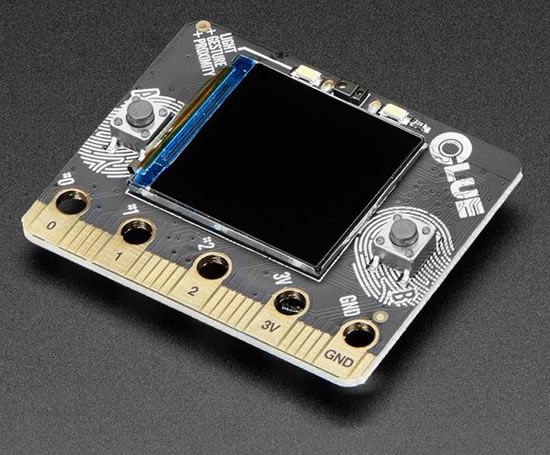
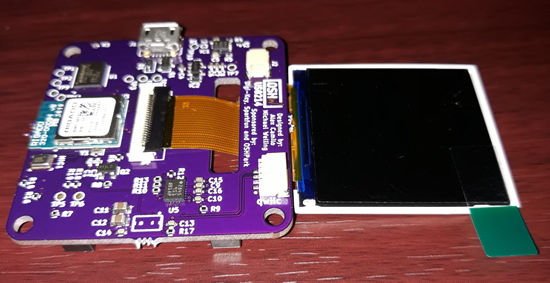
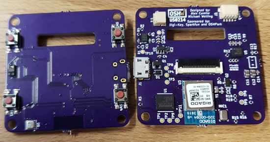
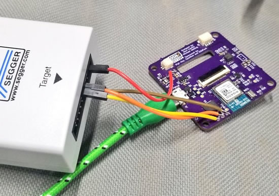
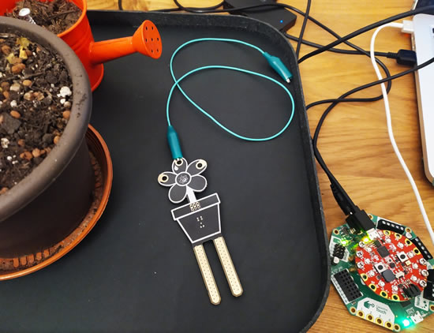
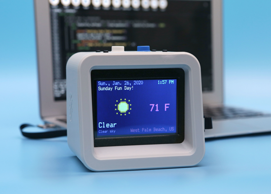

- [ ] update title
- [ ] Link "View this email in your browser."

[View this email]() in your browser.

Hi everyone! It's the latest Python for Microcontrollers newsletter brought you by the community! We're on [Discord](https://discord.gg/HYqvREz), [Twitter](https://twitter.com/search?q=circuitpython&src=typed_query&f=live), and for past newsletters - [view them all here](https://www.adafruitdaily.com/category/circuitpython/). If you're reading this on the web, [subscribe here](https://www.adafruitdaily.com/). Let's get started!

## CircuitPython and Feather power wheelchair as an Xbox controller

Freedom Wing Adapter – Adapter allows power wheelchairs to control Xbox - [YouTube](https://youtu.be/FgKNWc-EpHQ):

>_"Introducing The Freedom Wing Adapter! In partnership with AT Makers, together we’ve created the first of its kind adapter to enable a player using a power wheelchair to control an Xbox. And we’re going to release it to the world for free. The AbleGamers Charity creates opportunities that enable play, in order to combat social isolation, foster inclusive communities, and improve the quality of life for people with disabilities."_

CircuitPython, the Adafruit Feather open-format can do a lot, and now they can do a lot more now – Thanks to Bill, Steve, and everyone who worked on this.

 * [ATMakers.org](http://atmakers.org/)
 * [ablegamers.org](https://ablegamers.org/)
 * [AbleGamers](https://www.facebook.com/ablegamers) - Facebook.
 * [AbleGamers](https://twitter.com/ablegamers) - Twitter.
 * [AbleGamers](https://www.twitch.tv/ablegamers) - Twitch.
 * [You Can Now Use Your Power Wheelchair as an Xbox Controller](https://www.hackster.io/news/you-can-now-use-your-power-wheelchair-as-an-xbox-controller-0aa52acd82eb) - hackster.io
 * [Freedom Wings in production](https://twitter.com/at_makers/status/1223362473677508608) - Twitter.
 
## Get a CLUE!

The micro:bit shaped, CircuitPython-powered, sensor-packed CLUE is shipping! We wanted to build some projects that have a small screen and a lot of sensors. To make it compatible with existing projects, we made it the same shape and size as the BBC micro:bit and with the same edge-connector on the bottom with 5 big pads so it will fit into your existing robot kit or 'bit add-on. This is the alpha release of the hardware. This is the alpha release of the hardware, everything works, but we may change around the sensors or pinouts as we add projects and support for the CLUE! 

While the CLUE looks a bit like a 'bit it has totally redesigned-from-scratch technology:

 * Nordic nRF52840 Bluetooth LE processor - 1 MB of Flash, 256KB RAM, 64 MHz Cortex M4 processor
 * 1.3″ 240×240 Color IPS TFT display for high resolution text and graphics
 * Power it from any 3-6V battery source (internal regulator and protection diodes)
 * Two A / B user buttons and one reset button
 * Tons of sensors!
 * ST Micro series 9-DoF motion - LSM6DS33 Accel/Gyro + LIS3MDL magnetometer
 * APDS9960 Proximity, Light, Color, and Gesture Sensor
 * PDM Microphone sound sensor
 * SHT Humidity
 * BMP280 temperature and barometric pressure/altitude
 * RGB NeoPixel indicator LED
 * 2 MB internal flash storage for datalogging, images, fonts or CircuitPython code
 * Buzzer/speaker for playing tones and beeps
 * Two bright white LEDs in front for illumination / color sensing.
 * Qwiic / STEMMA QT connector for adding more sensors, motor controllers, or displays over I2C. You can plug in GROVE I2C sensors by using an adapter cable.
 * Programmable with CircuitPython

The CLUE is designed for projects that use a ton of sensors - and they're all built in! So you can start exploring your world, measuring, logging and learning. You can transmit data over Bluetooth to a computer or mobile device for data plotting and logging, or save it to the built in storage - [adafruit.com/clue](https://www.adafruit.com/clue) & [MAKE coverage](https://makezine.com/2020/01/31/adafruit-clue-a-microbit-form-factor-smorgasbord/).

## circuitpython.org site video!

[circuitpython.org](http://circuitpython.org) has an updated look and more features as we kick off 2020\. The site is even better at showing what's possible with CircuitPython! [The home page](http://circuitpython.org) has descriptive text on why CircuitPython is easy to use, features, goals for the project, and more. [Downloads](https://circuitpython.org/downloads) features over 106+ boards and now has a counter of how many boards that are supported, [same for Blinka](https://circuitpython.org/blinka), the boards and a counter, over 38+. [Libraries](https://circuitpython.org/libraries), the CircuitPython library bundle contains all current libraries available for CircuitPython, over 209+ [Handy links for how to contribute](https://circuitpython.org/contributing), the latest news ([RSS feed too!](https://blog.adafruit.com/category/circuitpython/feed/)), the a[wesome-circuitpython](https://circuitpython.org/awesome) resource, the [newsletter](https://www.adafruitdaily.com/category/circuitpython) with all past ones we sent out, [help](https://forums.adafruit.com/viewforum.php?f=60), a link to our [Discord server](https://adafru.it/discord), and [how to get started](https://learn.adafruit.com/welcome-to-circuitpython).

[Check it out](https://circuitpython.org/)!

## Open Hardware Summit wearable badge updates

A few [tweets](https://twitter.com/pdp7/status/1223051492770435072), and [updates](https://twitter.com/QwertyEmbedded/status/1223339569996693504), and in [progress photos](https://twitter.com/pdp7/status/1223051090297573382) of the Open Hardware Summit wearable badge.

## News from around the web!

MariaJose Molina-Contreras has a talk at PyCon about how CircuitPython can help your plants, and how to build an indoor garden with microcontrollers and IoT - [Twitter](https://twitter.com/MJ_BIO/status/1222055833787412480).

[Nina Zakharenko's](https://twitter.com/nnja/status/1222614091677630464) Twitch stream on working on a CircuitPython PyPortal "ExpoVert" badge. In the stream: Putting together a rough prototype & code. The goal is to display a social battery. Green means let's chat, red means: too tired to talk - [Twitch](https://www.twitch.tv/videos/544944172).

List of electronics and Python Discord servers we put together - [Adafruit](https://blog.adafruit.com/2020/01/30/discord-servers-for-electronics-making-python-and-more-discordapp/).

Coronavirus and electronics production - [freetronics](https://www.freetronics.com.au/blogs/news/coronavirus-and-electronics-production).

#ICYDNCI What was the most popular, most clicked link, in [last week's newsletter](https://www.adafruitdaily.com/2020/01/28/new-mu-open-book-open-hardware-and-more-python-adafruit-circuitpython-circuitpython-micropython-thepsf-adafruit/)? [HackSpace magazine — Issue 27](https://hackspace.raspberrypi.org/issues/27).

## Coming soon

Preview of the upcoming SPECTRO, along with some experiments with the ["Black LED Acrylic"](https://www.tapplastics.com/product/plastics/cut_to_size_plastic/black_led_sheet/668) from TAP plastics.

## New Learn Guides!

[PyPortal Titano Weather Station](https://learn.adafruit.com/pyportal-titano-weather-station) from [Noe and Pedro](https://learn.adafruit.com/users/pixil3d)

[Now Playing: Bluetooth Apple Media Service Display](https://learn.adafruit.com/now-playing-bluetooth-apple-media-service-display) from [John Park](https://learn.adafruit.com/users/johnpark)

[Cleveland Museum of Art PyPortal Frame](https://learn.adafruit.com/cleveland-museum-of-art-pyportal-frame) from [Dan Cogliano](https://learn.adafruit.com/users/cogliano)

[PyGamer Thermal Camera with AMG8833](https://learn.adafruit.com/pygamer-thermal-camera-amg8833) from [Jan Goolsbey](https://learn.adafruit.com/users/HarpDude)

[Adafruit MLX90640 IR Thermal Camera](https://learn.adafruit.com/adafruit-mlx90640-ir-thermal-camera) from [Kattni](https://learn.adafruit.com/users/kattni)

## Updated Guides - Now With More Python!

**You can use CircuitPython libraries on Raspberry Pi!** We're updating all of our CircuitPython guides to show how to wire up sensors to your Raspberry Pi, and load the necessary CircuitPython libraries to get going using them with Python. We'll be including the updates here so you can easily keep track of which sensors are ready to go. Check it out!

Keep checking back for more updated guides!

## CircuitPython Libraries!

CircuitPython support for hardware continues to grow. We are adding support for new sensors and breakouts all the time, as well as improving on the drivers we already have. As we add more libraries and update current ones, you can keep up with all the changes right here!

For the latest drivers, download the [Adafruit CircuitPython Library Bundle](https://circuitpython.org/libraries).

If you'd like to contribute, CircuitPython libraries are a great place to start. Have an idea for a new driver? File an issue on [CircuitPython](https://github.com/adafruit/circuitpython/issues)! Interested in helping with current libraries? Check out the [CircuitPython.org Contributing page](https://circuitpython.org/contributing). We've included open pull requests and issues from the libraries, and details about repo-level issues that need to be addressed. We have a guide on [contributing to CircuitPython with Git and Github](https://learn.adafruit.com/contribute-to-circuitpython-with-git-and-github) if you need help getting started. You can also find us in the #circuitpython channel on the [Adafruit Discord](https://adafru.it/discord). Feel free to contact Kattni (@kattni) with any questions.

You can check out this [list of all the CircuitPython libraries and drivers available](https://github.com/adafruit/Adafruit_CircuitPython_Bundle/blob/master/circuitpython_library_list.md). 

The current number of CircuitPython libraries is **209**!

**New Libraries!**

Here's this week's new CircuitPython libraries:

 * [Adafruit_CircuitPython_Display_BLE_Status](https://github.com/adafruit/Adafruit_CircuitPython_Display_BLE_Status)
 * [Adafruit_CircuitPython_CPython](https://github.com/adafruit/Adafruit_CircuitPython_CPython)
 * [Adafruit_CircuitPython_Debug_I2C](https://github.com/adafruit/Adafruit_CircuitPython_Debug_I2C)
 * [Adafruit_CircuitPython_GFX](https://github.com/adafruit/Adafruit_CircuitPython_GFX)
 * [Adafruit_CircuitPython_WSGI](https://github.com/adafruit/Adafruit_CircuitPython_WSGI)
 * [Adafruit_CircuitPython_DPS310](https://github.com/adafruit/Adafruit_CircuitPython_DPS310)

**Updated Libraries!**

Here's this week's updated CircuitPython libraries:

 * [Adafruit_CircuitPython_BLE_Magic_Light](https://github.com/adafruit/Adafruit_CircuitPython_BLE_Magic_Light)
 * [Adafruit_CircuitPython_ProgressBar](https://github.com/adafruit/Adafruit_CircuitPython_ProgressBar)
 * [Adafruit_CircuitPython_LIS3MDL](https://github.com/adafruit/Adafruit_CircuitPython_LIS3MDL)
 * [Adafruit_CircuitPython_BNO055](https://github.com/adafruit/Adafruit_CircuitPython_BNO055)
 * [Adafruit_CircuitPython_BLE_Apple_Notification_Center](https://github.com/adafruit/Adafruit_CircuitPython_BLE_Apple_Notification_Center)
 * [Adafruit_CircuitPython_NeoPixel_SPI](https://github.com/adafruit/Adafruit_CircuitPython_NeoPixel_SPI)
 * [Adafruit_CircuitPython_TestRepo](https://github.com/adafruit/Adafruit_CircuitPython_TestRepo)
 * [Adafruit_CircuitPython_DS3231](https://github.com/adafruit/Adafruit_CircuitPython_DS3231)
 * [Adafruit_CircuitPython_MAX31855](https://github.com/adafruit/Adafruit_CircuitPython_MAX31855)
 * [Adafruit_CircuitPython_Fingerprint](https://github.com/adafruit/Adafruit_CircuitPython_Fingerprint)
 * [Adafruit_CircuitPython_Register](https://github.com/adafruit/Adafruit_CircuitPython_Register)
 * [Adafruit_CircuitPython_Requests](https://github.com/adafruit/Adafruit_CircuitPython_Requests)
 * [Adafruit_CircuitPython_BME680](https://github.com/adafruit/Adafruit_CircuitPython_BME680)
 * [Adafruit_CircuitPython_BLE](https://github.com/adafruit/Adafruit_CircuitPython_BLE)
 * [Adafruit_CircuitPython_HT16K33](https://github.com/adafruit/Adafruit_CircuitPython_HT16K33)
 * [Adafruit_CircuitPython_PyPortal](https://github.com/adafruit/Adafruit_CircuitPython_PyPortal)
 * [Adafruit_CircuitPython_Display_Text](https://github.com/adafruit/Adafruit_CircuitPython_Display_Text)

**PyPI Download Stats!**

We've written a special library called Adafruit Blinka that makes it possible to use CircuitPython Libraries on [Raspberry Pi and other compatible single-board computers](https://learn.adafruit.com/circuitpython-on-raspberrypi-linux/). Adafruit Blinka and all the CircuitPython libraries have been deployed to PyPI for super simple installation on Linux! Here are the top 10 CircuitPython libraries downloaded from PyPI in the last week, including the total downloads for those libraries:

| Library                                                | Last Week   | Total |   
|:-------                                                |:--------:   |:-----:|   
| Adafruit-Blinka                                        | 1961        | 48552 |   
| Adafruit_CircuitPython_BusDevice                       | 1240        | 25542 |   
| Adafruit_CircuitPython_NeoPixel                        | 513         | 6434 |    
| Adafruit_CircuitPython_Register                        | 330         | 5646 |    
| Adafruit_CircuitPython_MCP230xx                        | 290         | 8731 |    
| Adafruit_CircuitPython_PCA9685                         | 129         | 3206 |    
| Adafruit_CircuitPython_Motor                           | 119         | 3335 |    
| Adafruit_CircuitPython_ServoKit                        | 112         | 3010 |    
| Adafruit_CircuitPython_HT16K33                         | 100         | 1070 |    
| Adafruit_CircuitPython_SSD1306                         | 90          | 2106 |    

## Upcoming events!

[HackWimbledon in London: Make Mine 2020 - An Open Hack #148:](https://www.meetup.com/HackWimbledon/events/268351251/) 

>_"Making, creating and illuminating is what HackWimbledon is about and thats what we do at Open Hack sessions. Open Hacks have no theme except what you want to bring along. For example, this open hack, the curator's going to be doing more things with CircuitPython, Python, LEDs and Raspberry Pis and you can sit in and learn about that. There may also be Robot hacking going on. Or you can sit down with your laptop and one of our Circuit Playgrounds and learn at your own pace. Come and learn and make with your own projects or learn what other people are building."_

Saturday, February 8, 2020, 12:00 PM to 5:00 PM - [Meetup](https://www.meetup.com/HackWimbledon/events/268351251/).

Scott is speaking at [PyCascades](https://2020.pycascades.com/) about Python's Next Decade and Us. It's February 8th and 9th, 2020.

>_"PyCascades is a two-day, single-track Python conference. We previously hosted PyCascades in Vancouver and Seattle. For our third iteration in 2020 we'll be in Portland, Oregon USA. PyCascades is organized by members of the Python communities in Vancouver, Seattle, and Portland. We aim to bring together Python users and developers from both the Pacific Northwest and around the world."_

Boston meetup for CircuitPython on February 12th, signups open! [Lucian Copeland](https://twitter.com/hierophect) is hosting a [CircuitPython meetup](https://www.eventbrite.com/e/circuitpython-meetup-tickets-92395985881) on February 12th at 5-7pm at the [Artisan's Asylum makerspace](https://twitter.com/artisansasylum) in Somerville, MA (greater Boston, USA). Attendees of any level of experience are welcome, from first time hobbyists to CircuitPython core contributors. Visitors who bring their physical projects are also encouraged to transition to the Artisan's Asylum Circuit Hacking night from 6:30-8pm for advice on PCBs and physical components. [CircuitPython](https://circuitpython.org/) is a programming language designed to simplify experimenting and learning to program on low-cost microcontroller boards. It makes getting started easier than ever with no upfront desktop downloads needed. Once you get your board set up, open any text editor, and get started editing code. It's that simple. Artisan's Asylum is a 501(c)3 non-profit community fabrication center, the second largest makerspace in the US at just shy of 40,000 square feet and over 300 active members. [See the Eventbright page for exact location and signups](https://www.eventbrite.com/e/circuitpython-meetup-tickets-92395985881).

[The 2020 Open Hardware Summit](https://2020.oshwa.org/) is March 13th 2020, NYU School of Law, New York. [The "badge"](https://hackaday.com/2020/01/21/circuitpython-slithers-into-100th-board-the-ohs-2020-badge/) for the event is CircuitPython powered!

>_"The Open Hardware Summit is the annual conference organized by the Open Source Hardware Association a 501(c)(3) not for profit charity. It is the world’s first comprehensive conference on open hardware; a venue and community in which we discuss and draw attention to the rapidly growing Open Source Hardware movement. Speakers include world renowned leaders from industry, academia, the arts and maker community. Talks cover a wide range of subjects from electronics, mechanics to related fields such as digital fabrication, fashion technology, self-quantification devices, and IP law. As a microcosm of the Open Source Hardware community, the Summit provides an annual friendly forum for the community."_

Additionally, there is a [2020 Open Hardware Summit topic on Discord](https://discord.gg/8RVyqnk) to join before, during, and after! - [Discord](https://discord.gg/8RVyqnk).

April 15-23, 2020, Pittsburgh, Pennsylvania, USA - The PyCon 2020 conference, which will take place in Pittsburgh, is the largest annual gathering for the community using and developing the open-source Python programming language. It is produced and underwritten by the Python Software Foundation, the 501(c)(3) nonprofit organization dedicated to advancing and promoting Python. Through PyCon, the PSF advances its mission of growing the international community of Python programmers - [PyCon 2020](https://us.pycon.org/2020/).

## Latest releases

CircuitPython's stable release is [#.#.#](https://github.com/adafruit/circuitpython/releases/latest) and its unstable release is [#.#.#-##.#](https://github.com/adafruit/circuitpython/releases). New to CircuitPython? Start with our [Welcome to CircuitPython Guide](https://learn.adafruit.com/welcome-to-circuitpython).

[2019####](https://github.com/adafruit/Adafruit_CircuitPython_Bundle/releases/latest) is the latest CircuitPython library bundle.

[v#.#.#](https://micropython.org/download) is the latest MicroPython release. Documentation for it is [here](http://docs.micropython.org/en/latest/pyboard/).

[#.#.#](https://www.python.org/downloads/) is the latest Python release. The latest pre-release version is [#.#.#](https://www.python.org/download/pre-releases/).

[1583 Stars](https://github.com/adafruit/circuitpython/stargazers) Like CircuitPython? [Star it on GitHub!](https://github.com/adafruit/circuitpython)

## Call for help – CircuitPython messaging to other languages!

We [recently posted on the Adafruit blog](https://blog.adafruit.com/2018/08/15/help-bring-circuitpython-messaging-to-other-languages-circuitpython/) about bringing CircuitPython messaging to other languages, one of the exciting features of CircuitPython 4.x is translated control and error messages. Native language messages will help non-native English speakers understand what is happening in CircuitPython even though the Python keywords and APIs will still be in English. If you would like to help, [please post](https://github.com/adafruit/circuitpython/issues/1098) to the main issue on GitHub and join us on [Discord](https://adafru.it/discord).

We made this graphic with translated text, we could use your help with that to make sure we got the text right, please check out the text in the image – if there is anything we did not get correct, please let us know. Dan sent me this [handy site too](http://helloworldcollection.de/#Human).

## jobs.adafruit.com - Find a dream job, find great candidates!

[jobs.adafruit.com](https://jobs.adafruit.com/) has returned and folks are posting their skills (including CircuitPython) and companies are looking for talented makers to join their companies - from Digi-Key, to Hackaday, Microcenter, Raspberry Pi and more.

## NUMBER thanks!

The Adafruit Discord community, where we do all our CircuitPython development in the open, reached over NUMBER humans, thank you! Join today! [https://adafru.it/discord](https://adafru.it/discord)

## ICYMI - In case you missed it

The wonderful world of Python on hardware! This is our first video-newsletter-podcast that we’ve started! The news comes from the Python community, Discord, Adafruit communities and more. It’s part of the weekly newsletter, then we have a segment on ASK an ENGINEER and this is the video slice from that! The complete Python on Hardware weekly videocast [playlist is here](https://www.youtube.com/playlist?list=PLjF7R1fz_OOXRMjM7Sm0J2Xt6H81TdDev). 

This video podcast is on [iTunes](https://itunes.apple.com/us/podcast/python-on-hardware/id1451685192?mt=2), [YouTube](https://www.youtube.com/playlist?list=PLjF7R1fz_OOXRMjM7Sm0J2Xt6H81TdDev), [IGTV (Instagram TV](https://www.instagram.com/adafruit/channel/)), and [XML](https://itunes.apple.com/us/podcast/python-on-hardware/id1451685192?mt=2).

[Weekly community chat on Adafruit Discord server CircuitPython channel - Audio / Podcast edition](https://itunes.apple.com/us/podcast/circuitpython-weekly-meeting/id1451685016) - Audio from the Discord chat space for CircuitPython, meetings are usually Mondays at 2pm ET, this is the audio version on [iTunes](https://itunes.apple.com/us/podcast/circuitpython-weekly-meeting/id1451685016), Pocket Casts, [Spotify](https://adafru.it/spotify), and [XML feed](https://adafruit-podcasts.s3.amazonaws.com/circuitpython_weekly_meeting/audio-podcast.xml).

And lastly, we are working up a one-spot destination for all things podcast-able here - [podcasts.adafruit.com](https://podcasts.adafruit.com/)

## Codecademy "Learn Hardware Programming with CircuitPython"

Codecademy, an online interactive learning platform used by more than 45 million people, has teamed up with the leading manufacturer in STEAM electronics, Adafruit Industries, to create a coding course, "Learn Hardware Programming with CircuitPython". The course is now available in the [Codecademy catalog](https://www.codecademy.com/learn/learn-circuitpython?utm_source=adafruit&utm_medium=partners&utm_campaign=circuitplayground&utm_content=pythononhardwarenewsletter).

Python is a highly versatile, easy to learn programming language that a wide range of people, from visual effects artists in Hollywood to mission control at NASA, use to quickly solve problems. But you don’t need to be a rocket scientist to accomplish amazing things with it. This new course introduces programmers to Python by way of a microcontroller — CircuitPython — which is a Python-based programming language optimized for use on hardware.

CircuitPython’s hardware-ready design makes it easier than ever to program a variety of single-board computers, and this course gets you from no experience to working prototype faster than ever before. Codecademy’s interactive learning environment, combined with Adafruit's highly rated Circuit Playground Express, present aspiring hardware hackers with a never-before-seen opportunity to learn hardware programming seamlessly online.

Whether for those who are new to programming, or for those who want to expand their skill set to include physical computing, this course will have students getting familiar with Python and creating incredible projects along the way. By the end, students will have built their own bike lights, drum machine, and even a moisture detector that can tell when it's time to water a plant.

Visit Codecademy to access the [Learn Hardware Programming with CircuitPython](https://www.codecademy.com/learn/learn-circuitpython?utm_source=adafruit&utm_medium=partners&utm_campaign=circuitplayground&utm_content=pythononhardwarenewsletter) course and Adafruit to purchase a [Circuit Playground Express](https://www.adafruit.com/product/3333).

Codecademy has helped more than 45 million people around the world upgrade their careers with technology skills. The company’s online interactive learning platform is widely recognized for providing an accessible, flexible, and engaging experience for beginners and experienced programmers alike. Codecademy has raised a total of $43 million from investors including Union Square Ventures, Kleiner Perkins, Index Ventures, Thrive Capital, Naspers, Yuri Milner and Richard Branson, most recently raising its $30 million Series C in July 2016.

## Contribute!

The CircuitPython Weekly Newsletter is a CircuitPython community-run newsletter emailed every Tuesday. The complete [archives are here](https://www.adafruitdaily.com/category/circuitpython/). It highlights the latest CircuitPython related news from around the web including Python and MicroPython developments. To contribute, edit next week's draft [on GitHub](https://github.com/adafruit/circuitpython-weekly-newsletter/tree/gh-pages/_drafts) and [submit a pull request](https://help.github.com/articles/editing-files-in-your-repository/) with the changes. Join our [Discord](https://adafru.it/discord) or [post to the forum](https://forums.adafruit.com/viewforum.php?f=60) for any further questions.
