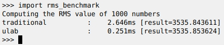
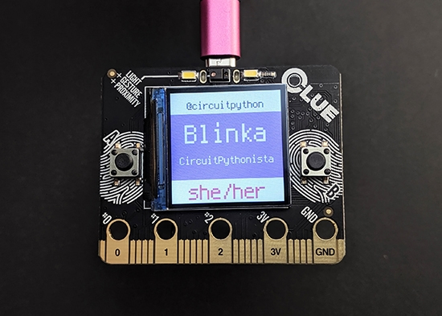
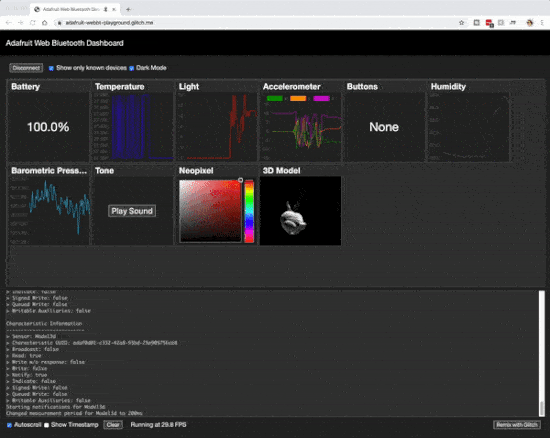

- [X] Kattni updates
- [ ] change date
- [ ] update title
- [ ] Feature story
- [ ] Update  for images
- [ ] All images 550w max only
- [ ] Link "View this email in your browser."

Template last updated on 02-24-2020 by Anne

[View this email]() in your browser.

Hi everyone! It's the latest Python for Microcontrollers newsletter, brought you by the community! We're on [Discord](https://discord.gg/HYqvREz), [Twitter](https://twitter.com/search?q=circuitpython&src=typed_query&f=live), and for past newsletters - [view them all here](https://www.adafruitdaily.com/category/circuitpython/). If you're reading this on the web, [subscribe here](https://www.adafruitdaily.com/). Let's get started!

## News from around the web!

#ICYDNCI What was the most popular, most clicked link, in [last week's newsletter](https://link)? [title](url).

## Made with Mu

Why Mu? Mu tries to make it as easy as possible to get started with programming but aims to help you graduate to "real" development tools soon after. Everything in Mu is the "real thing" but presented in as simple and obvious way possible. It's like the toddling stage in learning to walk: you're finding your feet and once you're confident, you should move on and explore! Put simply, Mu aims to foster autonomy. Try out Mu today! - [codewith.mu](https://codewith.mu/)

## Coming soon

## New Learn Guides!

[CLUE Custom CircuitPython Badge](https://learn.adafruit.com/clue-custom-circuit-python-badge) from [Kattni](https://learn.adafruit.com/users/kattni)

[Adafruit ICM20649 Wide-Range 6-DoF IMU Accelerometer and Gyro](https://learn.adafruit.com/adafruit-icm20649-wide-range-6-dof-imu-accelerometer-and-gyro) from [Bryan Siepert](https://learn.adafruit.com/users/siddacious)

[CLUE Dice Roller](https://learn.adafruit.com/clue-dice-roller) from [Dave Astels](https://learn.adafruit.com/users/dastels)

[CircuitPython BLE Morse Code Chat](https://learn.adafruit.com/circuitpython-ble-wireless-morse-code-chat) from [Carter Nelson](https://learn.adafruit.com/users/caternuson)

## CircuitPython Libraries!

CircuitPython support for hardware continues to grow. We are adding support for new sensors and breakouts all the time, as well as improving on the drivers we already have. As we add more libraries and update current ones, you can keep up with all the changes right here!

For the latest drivers, download the [Adafruit CircuitPython Library Bundle](https://circuitpython.org/libraries).

If you'd like to contribute, CircuitPython libraries are a great place to start. Have an idea for a new driver? File an issue on [CircuitPython](https://github.com/adafruit/circuitpython/issues)! Interested in helping with current libraries? Check out the [CircuitPython.org Contributing page](https://circuitpython.org/contributing). We've included open pull requests and issues from the libraries, and details about repo-level issues that need to be addressed. We have a guide on [contributing to CircuitPython with Git and Github](https://learn.adafruit.com/contribute-to-circuitpython-with-git-and-github) if you need help getting started. You can also find us in the #circuitpython channel on the [Adafruit Discord](https://adafru.it/discord). Feel free to contact Kattni (@kattni) with any questions.

You can check out this [list of all the CircuitPython libraries and drivers available](https://github.com/adafruit/Adafruit_CircuitPython_Bundle/blob/master/circuitpython_library_list.md). 

The current number of CircuitPython libraries is **215**!

**Updated Libraries!**

Here's this week's updated CircuitPython libraries:

 * [Adafruit_CircuitPython_TrellisM4](https://github.com/adafruit/Adafruit_CircuitPython_TrellisM4)
 * [Adafruit_CircuitPython_BluefruitSPI](https://github.com/adafruit/Adafruit_CircuitPython_BluefruitSPI)
 * [Adafruit_CircuitPython_ESP32SPI](https://github.com/adafruit/Adafruit_CircuitPython_ESP32SPI)
 * [Adafruit_CircuitPython_MIDI](https://github.com/adafruit/Adafruit_CircuitPython_MIDI)
 * [Adafruit_CircuitPython_binascii](https://github.com/adafruit/Adafruit_CircuitPython_binascii)
 * [Adafruit_CircuitPython_HT16K33](https://github.com/adafruit/Adafruit_CircuitPython_HT16K33)
 * [Adafruit_CircuitPython_ATECC](https://github.com/adafruit/Adafruit_CircuitPython_ATECC)
 * [Adafruit_CircuitPython_PyBadger](https://github.com/adafruit/Adafruit_CircuitPython_PyBadger)
 * [Adafruit_CircuitPython_BLE](https://github.com/adafruit/Adafruit_CircuitPython_BLE)
 * [Adafruit_CircuitPython_IRRemote](https://github.com/adafruit/Adafruit_CircuitPython_IRRemote)
 * [Adafruit_CircuitPython_Requests](https://github.com/adafruit/Adafruit_CircuitPython_Requests)
 * [Adafruit_CircuitPython_Wiznet5k](https://github.com/adafruit/Adafruit_CircuitPython_Wiznet5k)

**PyPI Download Stats!**

We've written a special library called Adafruit Blinka that makes it possible to use CircuitPython Libraries on [Raspberry Pi and other compatible single-board computers](https://learn.adafruit.com/circuitpython-on-raspberrypi-linux/). Adafruit Blinka and all the CircuitPython libraries have been deployed to PyPI for super simple installation on Linux! Here are the top 10 CircuitPython libraries downloaded from PyPI in the last week, including the total downloads for those libraries:

| Library                                                | Last Week   | Total |   
|:-------                                                |:--------:   |:-----:|   
| Adafruit-Blinka                                        | 2026        | 52587 |   
| Adafruit_CircuitPython_BusDevice                       | 1125        | 26657 |   
| Adafruit_CircuitPython_NeoPixel                        | 496         | 8302 |    
| Adafruit_CircuitPython_MCP230xx                        | 329         | 8510 |    
| Adafruit_CircuitPython_Register                        | 243         | 6215 |    
| Adafruit_CircuitPython_PCA9685                         | 148         | 3367 |    
| Adafruit_CircuitPython_ServoKit                        | 141         | 3153 |    
| Adafruit_CircuitPython_Motor                           | 127         | 3501 |    
| Adafruit_CircuitPython_PN532                           | 127         | 1878 |    
| Adafruit_CircuitPython_PyBadger                        | 85          | 282 |     

## What’s the team up to this week?

What is the team up to this week? Let’s check in!

**Bryan**

This week I've been working on the libraries for the ICM-20948 9-DoF IMU from Invensense. 9-DoFs on one chip is pretty nice, so I'm hard at work getting this chip supported in Arduino and CircuitPython.

One interesting thing about this chip is that the magnetometer is a separate sensor with its own I2C address. It gets more interesting: similar to the LSM6DSOX and ICM330DH, this sensor has an external/master slave bus that it can use to communicate with and get data from other sensors. Normally this would be an interesting but ultimately situational feature, however in the case if the ICM-20948 this magnetometer is _on the external bus_. This means that getting all 9 DoFs requires setting up registers in the ICM20948 to configure the magnetometer and then map its output to another register! It was a bit tricky to figure out but there is a good reference library written by the folks at SparkFun that I was able to use to figure out the S33KR3T C0D3 to get the magnetometer configured properly.

Next up I'll be working on the tester code which will require me to add a few more bells and whistles to the Arduino library to test all the pins without needing to have a convoluted testing setup. Once the hardware is fully verified, I'll move onto the CircuitPython library which should be fairly straightforward now that I've figured things out while writing the Arduino library.

**Dan**

CircuitPython 5.0.0 stable is released! 5.0.0-rc.0 came out a week ago. The build process was failing to upload all the board builds to GitHub reliably; the GitHub release pages are not really designed for the over 1700 release assets we now have per build. For rc.0 I upload the missing builds manually  I then arranged for circuitpython.org to point to our Amazon S3 downloads site, which handles the bulk uploads much more easily . I released 5.0.0-rc.1 over the weekend to test the new downloads, and included a few i.MX fixes as well. The 5.0.0-rc.1 release seemed fine, so I made the 5.0.0 stable release on Monday. This is a huge milestone! Thanks to everyone who has worked on or tested 5.0.0 since we started working on it last July.

This week I'm going to be reverse engineering the radio traffic of a couple of BLE-enabled BBQ thermometers to see if we can figure out how to communicate with them. I also have several issues with the UF2 bootloader to look at and debug.

**Jeff**

Subsequent to the 5.0.0 release, the pull request to add ulab to CircuitPython was incorporated.  This paves the way for an upcoming release, probably 5.1.0, to include it for most SAMD51 and nRF52840 based boards that support CircuitPython.  You can get it right now by using the "absolute newest" downloads from CircuitPython.org, and the ulab docs are also live on readthedocs.

This will be a boon for many types of number crunching routines in Python.  For example, converting the "normalized_rms" function from an existing guide took just a few minutes, and performs about 10x faster.  Drop us a note on Discord if you know of a library or guide that could be improved by the use of ulab.

**Kattni**

This week I published a guide for the [CLUE Custom Badge](https://learn.adafruit.com/clue-custom-circuit-python-badge)!

The new custom badge feature of the Adafruit CircuitPython Pybadger library makes it super simple to display lines of text over a color-block or image background. The guide includes an example of creating a custom badge for CLUE that shows your twitter handle, name, job title, and pronoun. As well, it covers everything you can customise about the badge and how to do it. If you're looking to create a super customisable badge for your next event using your Adafruit CLUE, this guide has you covered!

This project is also part of [PyCon 2020](https://us.pycon.org/2020/) preparation. [Adafruit and Digi-Key are pairing up to sponsor PyCon](https://blog.adafruit.com/2020/02/06/get-a-clue-at-pycon-us-from-digi-key-and-adafruit-digikey-adafruit-pycon2020-pycon-circuitpython/) and provide a CLUE to every attendee. Now it will be easy to create a custom badge to show off during the conference on your new CLUE.

**Lucian**

This past week I wrapped up my work on PulseOut and my Zephyr learn guide, and moved on to working on PulseIn (the IR pulse detection module for Circuitpython) and researching/preliminary work on the H7 and F7 processors offered by ST. I'm especially excited about these new MCUs given their use on boards like OpenMV - machine vision is something I enjoy tinkering with on my personal projects, and the opportunity to open up Circuitpython to these kinds of modules is very exciting. 

It'll also be fun to see Circuitpython on some of the most powerful chips offered in the Cortex M4/M7 market. I'll be quick to retry all the projects that have been sluggish for me in the past, and see how they perform on a system running at 400MHz!

**Melissa**

This past week I finished up the Web Bluetooth dashboard and added a few more services such as being able to change the color of the Neopixels, being able to manipulate a 3D Model on screen and playing a tone from the board. In addition, the Feather Bluefruit Sense came out and it worked great with the dashboard. I also added some more polish to application such as throttling the Frames per Second so it worked smoother.

After finishing that up, I wrote up a guide on using the dashboard. You can check the guide out at: https://learn.adafruit.com/using-connection-based-web-bluetooth-in-chrome. Next I'll be working on a version of the dashboard that works by monitoring BLE advertisements.

**Scott**

I was in Colorado at the end of the week. Thursday I visited SparkFun and met up with Great Scott Gadget folks to chat about CircuitPython. Thanks to everyone for taking the time to chat!

When I got back I had some email catch up to do and then helped a bit with releasing CircuitPython 5.0.0! Please update and let us know how it goes!

I've also been helping with the BroadcastNet demos that JohnPark has been doing.

The rest of this week I'm heads down on optimizing CircuitPython's power consumption so that BroadcastNet sensors and conference badges last longer on their battery charges. The main goal is to make `time.sleep()` actually go into a low power state. I think I can reduce the power consumption during sleep by a factor of 10 so that should be handy.

## Upcoming events!

[The 2020 Open Hardware Summit](https://2020.oshwa.org/) is March 13th 2020, NYU School of Law, New York USA. [The "badge"](https://hackaday.com/2020/01/21/circuitpython-slithers-into-100th-board-the-ohs-2020-badge/) for the event is CircuitPython powered!

>_"The Open Hardware Summit is the annual conference organized by the Open Source Hardware Association a 501(c)(3) not for profit charity. It is the world’s first comprehensive conference on open hardware; a venue and community in which we discuss and draw attention to the rapidly growing Open Source Hardware movement. Speakers include world renowned leaders from industry, academia, the arts and maker community. Talks cover a wide range of subjects from electronics, mechanics to related fields such as digital fabrication, fashion technology, self-quantification devices, and IP law. As a microcosm of the Open Source Hardware community, the Summit provides an annual friendly forum for the community."_

Additionally, there is a [2020 Open Hardware Summit topic on Discord](https://discord.gg/8RVyqnk) to join before, during, and after! - [Discord](https://discord.gg/8RVyqnk).

April 15-23, 2020, Pittsburgh, Pennsylvania, USA - The PyCon 2020 conference, which will take place in Pittsburgh, is the largest annual gathering for the community using and developing the open-source Python programming language. It is produced and underwritten by the Python Software Foundation, the 501(c)(3) nonprofit organization dedicated to advancing and promoting Python. Through PyCon, the PSF advances its mission of growing the international community of Python programmers - [PyCon 2020](https://us.pycon.org/2020/).

## Latest releases

CircuitPython's stable release is [#.#.#](https://github.com/adafruit/circuitpython/releases/latest) and its unstable release is [#.#.#-##.#](https://github.com/adafruit/circuitpython/releases). New to CircuitPython? Start with our [Welcome to CircuitPython Guide](https://learn.adafruit.com/welcome-to-circuitpython).

[2019####](https://github.com/adafruit/Adafruit_CircuitPython_Bundle/releases/latest) is the latest CircuitPython library bundle.

[v#.#.#](https://micropython.org/download) is the latest MicroPython release. Documentation for it is [here](http://docs.micropython.org/en/latest/pyboard/).

[#.#.#](https://www.python.org/downloads/) is the latest Python release. The latest pre-release version is [#.#.#](https://www.python.org/download/pre-releases/).

[1618 Stars](https://github.com/adafruit/circuitpython/stargazers) Like CircuitPython? [Star it on GitHub!](https://github.com/adafruit/circuitpython)

## Call for help – CircuitPython messaging to other languages!

We [recently posted on the Adafruit blog](https://blog.adafruit.com/2018/08/15/help-bring-circuitpython-messaging-to-other-languages-circuitpython/) about bringing CircuitPython messaging to other languages, one of the exciting features of CircuitPython 4 and later versions is translated control and error messages. Native language messages will help non-native English speakers understand what is happening in CircuitPython even though the Python keywords and APIs will still be in English. If you would like to help, [please post](https://github.com/adafruit/circuitpython/issues/1098) to the main issue on GitHub and join us on [Discord](https://adafru.it/discord).

We made this graphic with translated text, we could use your help with that to make sure we got the text right, please check out the text in the image – if there is anything we did not get correct, please let us know. Dan sent me this [handy site too](http://helloworldcollection.de/#Human).

## jobs.adafruit.com - Find a dream job, find great candidates!

[jobs.adafruit.com](https://jobs.adafruit.com/) has returned and folks are posting their skills (including CircuitPython) and companies are looking for talented makers to join their companies - from Digi-Key, to Hackaday, Microcenter, Raspberry Pi and more.

## NUMBER thanks!

The Adafruit Discord community, where we do all our CircuitPython development in the open, reached over NUMBER humans, thank you! Join today! [https://adafru.it/discord](https://adafru.it/discord)

## ICYMI - In case you missed it

The wonderful world of Python on hardware! This is our first video-newsletter-podcast that we’ve started! The news comes from the Python community, Discord, Adafruit communities and more. It’s part of the weekly newsletter, then we have a segment on ASK an ENGINEER and this is the video slice from that! The complete Python on Hardware weekly videocast [playlist is here](https://www.youtube.com/playlist?list=PLjF7R1fz_OOXRMjM7Sm0J2Xt6H81TdDev). 

This video podcast is on [iTunes](https://itunes.apple.com/us/podcast/python-on-hardware/id1451685192?mt=2), [YouTube](https://www.youtube.com/playlist?list=PLjF7R1fz_OOXRMjM7Sm0J2Xt6H81TdDev), [IGTV (Instagram TV](https://www.instagram.com/adafruit/channel/)), and [XML](https://itunes.apple.com/us/podcast/python-on-hardware/id1451685192?mt=2).

[Weekly community chat on Adafruit Discord server CircuitPython channel - Audio / Podcast edition](https://itunes.apple.com/us/podcast/circuitpython-weekly-meeting/id1451685016) - Audio from the Discord chat space for CircuitPython, meetings are usually Mondays at 2pm ET, this is the audio version on [iTunes](https://itunes.apple.com/us/podcast/circuitpython-weekly-meeting/id1451685016), Pocket Casts, [Spotify](https://adafru.it/spotify), and [XML feed](https://adafruit-podcasts.s3.amazonaws.com/circuitpython_weekly_meeting/audio-podcast.xml).

And lastly, we are working up a one-spot destination for all things podcast-able here - [podcasts.adafruit.com](https://podcasts.adafruit.com/)

## Codecademy "Learn Hardware Programming with CircuitPython"

Codecademy, an online interactive learning platform used by more than 45 million people, has teamed up with the leading manufacturer in STEAM electronics, Adafruit Industries, to create a coding course, "Learn Hardware Programming with CircuitPython". The course is now available in the [Codecademy catalog](https://www.codecademy.com/learn/learn-circuitpython?utm_source=adafruit&utm_medium=partners&utm_campaign=circuitplayground&utm_content=pythononhardwarenewsletter).

Python is a highly versatile, easy to learn programming language that a wide range of people, from visual effects artists in Hollywood to mission control at NASA, use to quickly solve problems. But you don’t need to be a rocket scientist to accomplish amazing things with it. This new course introduces programmers to Python by way of a microcontroller — CircuitPython — which is a Python-based programming language optimized for use on hardware.

CircuitPython’s hardware-ready design makes it easier than ever to program a variety of single-board computers, and this course gets you from no experience to working prototype faster than ever before. Codecademy’s interactive learning environment, combined with Adafruit's highly rated Circuit Playground Express, present aspiring hardware hackers with a never-before-seen opportunity to learn hardware programming seamlessly online.

Whether for those who are new to programming, or for those who want to expand their skill set to include physical computing, this course will have students getting familiar with Python and creating incredible projects along the way. By the end, students will have built their own bike lights, drum machine, and even a moisture detector that can tell when it's time to water a plant.

Visit Codecademy to access the [Learn Hardware Programming with CircuitPython](https://www.codecademy.com/learn/learn-circuitpython?utm_source=adafruit&utm_medium=partners&utm_campaign=circuitplayground&utm_content=pythononhardwarenewsletter) course and Adafruit to purchase a [Circuit Playground Express](https://www.adafruit.com/product/3333).

Codecademy has helped more than 45 million people around the world upgrade their careers with technology skills. The company’s online interactive learning platform is widely recognized for providing an accessible, flexible, and engaging experience for beginners and experienced programmers alike. Codecademy has raised a total of $43 million from investors including Union Square Ventures, Kleiner Perkins, Index Ventures, Thrive Capital, Naspers, Yuri Milner and Richard Branson, most recently raising its $30 million Series C in July 2016.

## Contribute!

The CircuitPython Weekly Newsletter is a CircuitPython community-run newsletter emailed every Tuesday. The complete [archives are here](https://www.adafruitdaily.com/category/circuitpython/). It highlights the latest CircuitPython related news from around the web including Python and MicroPython developments. To contribute, edit next week's draft [on GitHub](https://github.com/adafruit/circuitpython-weekly-newsletter/tree/gh-pages/_drafts) and [submit a pull request](https://help.github.com/articles/editing-files-in-your-repository/) with the changes. Join our [Discord](https://adafru.it/discord) or [post to the forum](https://forums.adafruit.com/viewforum.php?f=60) for any further questions.
