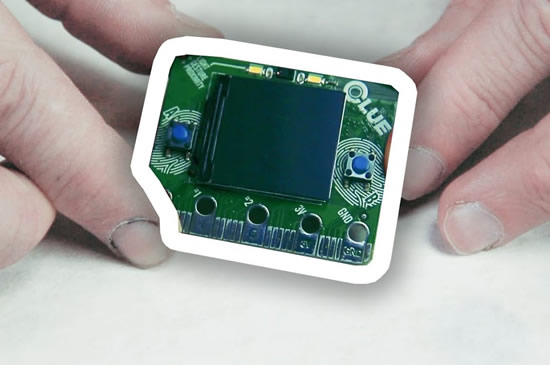
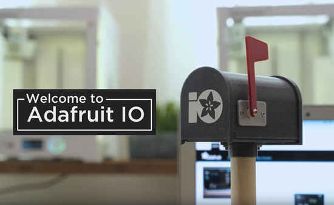
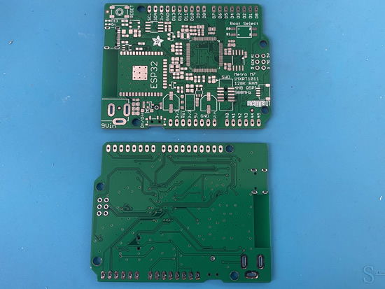
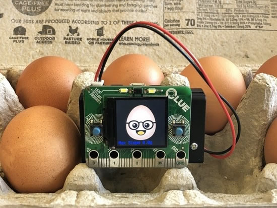

[View this email]() in your browser.

Hi everyone! It's the latest Python for Microcontrollers newsletter, brought you by the Python on hardware community! This community was born online and built for making connections together. Join us and build something together. We're on [Discord](https://discord.gg/HYqvREz), [Twitter](https://twitter.com/search?q=circuitpython&src=typed_query&f=live), and for past newsletters - [view them all here](https://www.adafruitdaily.com/category/circuitpython/). If you're reading this on the web, [subscribe here](https://www.adafruitdaily.com/). 

## The biggest worldwide online Show and Tell begins Wednesday March 18th, 2020 at 7pm ET

We (Adafruit) are extended our weekly show and tell we've done for about a decade to full hour starting this Wednesday, March 18th, 2020 at 7pm ET to 8pm ET. All are welcome, show your CircuitPython project, your work from home desk set up, your cat, the things your kids made over the last week while home from school. There is no better time to come together, we'll see you there! The [video on YouTube](https://youtu.be/VmVkX_7PkLs) will be here, and stop by [Discord to get the link to join LIVE](https://discord.gg/adafruit)!

## micro:mag issue 7, CLUE 10 of 10!

It's here! [Introducing Issue 7](https://twitter.com/micro_mag/status/1238812935272779776) of the unofficial [micro:bit magazine](https://micromag.cc/). Explore 5 awesome micro:bit features, make an audio game in scratch + much more! [Free download](http://go.micromag.cc/issue7), [buy in print](http://go.micromag.cc/issue7print): comes with a REE A3 pinout reference poster!

And what else? The CircuitPython powered [CLUE](https://www.adafruit.com/clue) gets a 10 out of 10! Page 39!

## hackster.io gets a CLUE!

[Hackster](https://twitter.com/Hacksterio/status/1237157159869218817) got a [CLUE](https://www.adafruit.com/clue)! They take a look at the sensor packed CircuitPython powered board! [Hackster.io](https://www.hackster.io/videos/587), and [video](https://youtu.be/E7NJklkyCBA).

## MAKE Magazine's quick look at CLUE

[MAKE](https://twitter.com/make/status/1238487802997768192) Magazine has a quick look at the CLUE - [Make](https://makezine.com/2020/03/13/quick-look-the-adafruit-clue/), and [video](https://youtu.be/9HFPsR_yDKM).

## CircuitPython is fast for prototypers

This tweet says it - [Twitter](https://twitter.com/infosnek/status/1239334447423426561).

## What Is Adafruit IO?

Build IOT projects with Adafruit IO! Control your projects over the internet and create a dashboard to visually see your sensor data - [adafruit.io](https://adafruit.io) and [video](https://youtu.be/bYhRhDvTP5c).

Aaand! Check out the IoT Design Week with Microchip’s “Wizard of Make” Bob Martin and Adafruit - [YouTube](https://youtu.be/fu37Uf-CXNE).

## News from around the web!

The Open Hardware Summit went virtual! And here is the final version of the PCB with CircuitPython branding! - [Twitter](https://twitter.com/pdp7/status/1237900791274442754).

A PyPortal dice roller for the game of Risk - [GitHub](https://github.com/AnonEngineering/pyportal_risk_dice).

Lamba Labs is Celebrating International Women's Day on Zoom Mar 21, 2020 10:00 AM Beirut - [Instagram](https://www.instagram.com/p/B9xDWzfp4vt/?igshid=yjfoozln6j9g) and [more info](https://tinyurl.com/r4pkkjb).

Interested in programming microcontrollers with Python? Share your thoughts with the [Microsoft Garage Interns](https://twitter.com/MSFTGarage/status/1237415978536861696). Take the short survey here - [Microsoft](https://aka.ms/AA7ms0e).

39 lines of CircuitPython is powering this aquarium automation system - [Twitter](https://twitter.com/vacant3rdman/status/1237023330323988481).

Arturo's CircuitPython port for NXP i.MX RT10xx series is runner up place in the Hackster.io NXP Crossover Code Challenge: [Hackster.io](https://www.hackster.io/contests/nxpcrossover) & [Twitter](https://twitter.com/arturo182/status/1238208045295026213).

This lil robot ([CuteBot](https://www.elecfreaks.com/estore/elecfreaks-micro-bit-smart-cutebot-without-micro-bit.html)) is from ElecFreaks - its a micro:bit compatible rover with an adorable design: two motors, lots of LEDs, a sonar, IR input, and battery pack ([video](https://youtu.be/9VSLTWHBkGE)). We tried it out with the CLUE, and coded up a Bluetooth LE example. we are controlling it from [Bluefruit Connect, our BLE app](https://apps.apple.com/us/app/bluefruit-connect/id830125974)!

Here's a great case that seems to fit the CLUE (or micro:bit) practically perfect! The case is translucent, the screen and the two white LED from the color sensor are visible - [Twitter](https://twitter.com/DavidGlaude/status/1237124317030334472).

Pimoroni Scroll pHAT HD + CLUE running CircuitPython + PiSupply BIT:2:Pi - [Twitter](https://twitter.com/DavidGlaude/status/1239219159239741444).

Kitronik has CLUE powering their HaloHD - [Twitter](https://twitter.com/DKitronik/status/1230516121746407424).

New contender for fastest PewPew device: PewPew Lite on the Giant Board, almost unmodified Pew library running on Blinka on CPython on Linux - [Twitter](https://twitter.com/isziaui/status/1236261673960423424).

Here is the CircuitPython powered CircuitBrains Basic test and flashing jig v1 - [Twitter](https://twitter.com/kevinneubauer/status/1237819651142356992).

Students are enhancing their study of the human nervous system by building and coding simulators using Circuit Playground boards as brains, and cap touch and other sensors to simulate the 5 senses - [Twitter](https://twitter.com/PineCrestSTEM/status/1237372159573590016).

[Free teaching resources](https://twitter.com/gallaugher/status/1237369046066135041) for CircuitPython - [Google Docs](https://docs.google.com/document/d/1IFW0hVlbdIL8TCOloOHHzwv5pYj0YG106IjXT6b7Qq8/edit).

A Snake game using the accelerometer for the PyBadge adapted from the SCaLE 18x's Go Hardware Hack Session featuring TinyGo - [Twitter](https://twitter.com/ToddZebert/status/1237779802540478465), and [GitHub](https://github.com/zat-lab/tinygo-accelesnake).

Water Your Plant Using a Raspberry Pi and Python - [alanconstantino.com](https://blog.alanconstantino.com/articles/water-your-plant-using-a-raspberry-pi-and-python.html)

Nordic [posted up](https://twitter.com/NordicTweets/status/1237395852827791360) a round up of their videos from Mobile Web Congress 2020, lots of a great Bluetooth demos and more - [YouTube](https://www.youtube.com/watch?v=PkdDcc7lt7w&list=PLx_tBuQ_KSqF2aBctupibHBn3FC1QHWOx).

[March 12, 2020](https://twitter.com/eMbeddedHome/status/1238642825119576065): added USB device support (tinyusb stack), clarified that 2MB PSRAM is supported, not 4MB - [ESP32.com](https://esp32.com/viewtopic.php?f=10&t=14532)

Create Boing!, Python tribute to Pong - [raspberrypi.org](https://www.raspberrypi.org/blog/create-boing-our-python-tribute-to-pong/)

Nice Neopixel earrings - [Instagram](https://www.instagram.com/p/B9lwEWMHS0M/?igshid=llof7n58rmkp).

Psychic ePaper: Changeable, updatable Doctor Who psychic paper! - [hackaday.io](https://hackaday.io/project/170043-psychic-epaper)

Python in GitHub Actions - [hynek.me](https://hynek.me/articles/python-github-actions/)

[Pyxen](https://pyxen.com/) ia a Python game maker for iOS - [App Store](https://apps.apple.com/app/pyxen/id1438777777).

The Open Source Hardware Journey by Christina Cyr - [LinkedIn](https://www.linkedin.com/pulse/open-source-hardware-journey-christina-cyr-%E3%82%B7%E3%82%A2%E3%83%BC-/).

nRF52 SDK(v16) based OS for use with Particle Xenon and other nRF52840 boards - [GitHub](https://github.com/pyrinas-iot/pyrinas-os).

We need more OpenHardware in public institutions - [ohwr.org](https://ohwr.org/project/ohr-meta/wikis/uploads/48cd380ec7a7ea92a81fe6e90b0754db/Open_Source_in_Public_Institutions.pdf)

Photos of the CircuitPython-powered OH Summit wrist badge that was made - [Twitter](https://twitter.com/pdp7/status/1237847408094007296), and [SparkFun](https://www.sparkfun.com/news/3258).

How to use Jupyter Notebooks in 2020 - [Lj Miranda](https://ljvmiranda921.github.io/notebook/2020/03/06/jupyter-notebooks-in-2020/).

Version 2.0 of the CERN Open Hardware Licence has been released, introducing three variants meant to cater to different collaborative models - [cern.com](https://home.cern/news/news/knowledge-sharing/cern-updates-its-open-hardware-licence)

EYE on NPI Maxim’s Himalaya uSLIC Step-Down Power Module - [Adafruit](https://blog.adafruit.com/2020/03/13/eye-on-npi-maxims-himalaya-uslic-step-down-power-module-eyeonnpi-maximintegrated-digikey/), and [Digi-Key](https://www.digikey.com/en/product-highlight/m/maxim-integrated/himalaya-uslic-step-down-power-module).

Girls Who Hack and Secure Open Vote – Bianca Lewis: [Security Weekly](https://securityweekly.com/shows/girls-who-hack-and-secure-open-vote-bianca-lewis-psw-643/), and [video](https://youtu.be/yOi6vuViKWE).

[AnneMarie Thomas](https://twitter.com/amptMN/status/1237421387658268673) awarded the LEGO Prize 2020 - [Twitter](https://twitter.com/LEGOfoundation/status/1237418838377062402) & [video](https://vimeo.com/396684088).

PyDev of the Week: [Jessica Garson](https://twitter.com/jessicagarson). Jessica is a developer advocate at Twitter. She also teaches Python at New York University - [Mouse vs Python](https://www.blog.pythonlibrary.org/2020/03/16/pydev-of-the-week-jessica-garson/).

The book from Jodorowsky's Dune was scanned and posted - [Google Photos](https://photos.google.com/share/AF1QipNGBuasYa_WETf7sF6Q9W3SN-X7oiB3jrh5QDMMNQPQl9xgS3cua--BhRr-BImP1w?key=QmE1WTR0Z0FtZVFIalpsYVZ3LXFXMS1DUmNiUnR3).

CircuitPython Weekly for March 16th, 2020 [on YouTube](https://youtu.be/qFL8alNFczc) and [diode.zone](https://diode.zone/videos/watch/2e726960-228c-4703-ad85-1eedec3665e7)

A PyPortal dice roller for the game of Risk.      [GitHub](https://github.com/AnonEngineering/pyportal_risk_dice).

#ICYDNCI What was the most popular, most clicked link, in [last week's newsletter](https://www.adafruitdaily.com/2020/03/10/circuitpython-empowering-makers-to-make-businesses-and-more-python-adafruit-circuitpython-circuitpython-micropython-thepsf-adafruit/)? [Serpente - A Tiny CircuitPython Prototyping Board](https://www.tindie.com/products/arturo182/serpente-a-tiny-circuitpython-prototyping-board/?pt=ac_prod_search).

## Coming soon

Got our shipment of prototype PCBs today, including our Metro M7 – based on the NXP iMX RT1011 chip – its quite a beast! We routed this a few weekends ago, and we’ll put it together this week to try it out! - [Adafruit](https://blog.adafruit.com/2020/03/09/oooh-metro-m7-arrived-on-prototype-pcb-delivery-day-nxp-espressifsystem-circuitpython/).

## New Learn Guides!

[Digital Egg Drop Experiment with CLUE](https://learn.adafruit.com/egg-drop-clue) from [John Park](https://learn.adafruit.com/users/johnpark)

[ulab: Crunch Numbers fast in CircuitPython](https://learn.adafruit.com/ulab-crunch-numbers-fast-with-circuitpython) from [Jeff Epler](https://learn.adafruit.com/users/jepler)

[Bluetooth LE Sensor Nodes to Raspberry Pi WiFi Bridge](https://learn.adafruit.com/bluetooth-le-broadcastnet-sensor-node-raspberry-pi-wifi-bridge) from [John Park](https://learn.adafruit.com/users/johnpark)

[Ethernet for CircuitPython with Wiznet5K](https://learn.adafruit.com/ethernet-for-circuitpython) from [Brent Rubell](https://learn.adafruit.com/users/brubell)

[¡Bienvenido a CircuitPython!](https://learn.adafruit.com/bienvenido-a-circuitpython-2) from [Álvaro Figueroa Cabezas and Kattni](https://learn.adafruit.com/users/kattni)

[A colorful CLUE slideshow purse with Bright Wearables](https://learn.adafruit.com/a-colorful-clue-slideshow-purse) from [Anne Barela](https://learn.adafruit.com/users/AnneBarela)

[Adafruit Feather nRF52840 Sense](https://learn.adafruit.com/adafruit-feather-sense) from [Kattni](https://learn.adafruit.com/users/kattni)

## CircuitPython Libraries!

CircuitPython support for hardware continues to grow. We are adding support for new sensors and breakouts all the time, as well as improving on the drivers we already have. As we add more libraries and update current ones, you can keep up with all the changes right here!

For the latest drivers, download the [Adafruit CircuitPython Library Bundle](https://circuitpython.org/libraries).

If you'd like to contribute, CircuitPython libraries are a great place to start. Have an idea for a new driver? File an issue on [CircuitPython](https://github.com/adafruit/circuitpython/issues)! Interested in helping with current libraries? Check out the [CircuitPython.org Contributing page](https://circuitpython.org/contributing). We've included open pull requests and issues from the libraries, and details about repo-level issues that need to be addressed. We have a guide on [contributing to CircuitPython with Git and Github](https://learn.adafruit.com/contribute-to-circuitpython-with-git-and-github) if you need help getting started. You can also find us in the #circuitpython channel on the [Adafruit Discord](https://adafru.it/discord). Feel free to contact Kattni (@kattni) with any questions.

You can check out this [list of all the CircuitPython libraries and drivers available](https://github.com/adafruit/Adafruit_CircuitPython_Bundle/blob/master/circuitpython_library_list.md). 

The current number of CircuitPython libraries is **220**!

**New Libraries!**

Here's this week's new CircuitPython libraries:

 * [Adafruit_CircuitPython_RockBlock](https://github.com/adafruit/Adafruit_CircuitPython_RockBlock)

**Updated Libraries!**

Here's this week's updated CircuitPython libraries:

 * [Adafruit_CircuitPython_BLE_BroadcastNet](https://github.com/adafruit/Adafruit_CircuitPython_BLE_BroadcastNet)
 * [Adafruit_CircuitPython_Pypixelbuf](https://github.com/adafruit/Adafruit_CircuitPython_Pypixelbuf)
 * [Adafruit_CircuitPython_Debouncer](https://github.com/adafruit/Adafruit_CircuitPython_Debouncer)
 * [Adafruit_CircuitPython_turtle](https://github.com/adafruit/Adafruit_CircuitPython_turtle)
 * [Adafruit_CircuitPython_SHT31D](https://github.com/adafruit/Adafruit_CircuitPython_SHT31D)
 * [Adafruit_CircuitPython_Thermal_Printer](https://github.com/adafruit/Adafruit_CircuitPython_Thermal_Printer)
 * [Adafruit_CircuitPython_SSD1675](https://github.com/adafruit/Adafruit_CircuitPython_SSD1675)
 * [Adafruit_CircuitPython_HT16K33](https://github.com/adafruit/Adafruit_CircuitPython_HT16K33)
 * [Adafruit_CircuitPython_CLUE](https://github.com/adafruit/Adafruit_CircuitPython_CLUE)
 * [Adafruit_CircuitPython_IL91874](https://github.com/adafruit/Adafruit_CircuitPython_IL91874)
 * [Adafruit_CircuitPython_Wiznet5k](https://github.com/adafruit/Adafruit_CircuitPython_Wiznet5k)

**PyPI Download Stats!**

We've written a special library called Adafruit Blinka that makes it possible to use CircuitPython Libraries on [Raspberry Pi and other compatible single-board computers](https://learn.adafruit.com/circuitpython-on-raspberrypi-linux/). Adafruit Blinka and all the CircuitPython libraries have been deployed to PyPI for super simple installation on Linux! Here are the top 10 CircuitPython libraries downloaded from PyPI in the last week, including the total downloads for those libraries:

| Library                                                | Last Week   | Total |   
|:-------                                                |:--------:   |:-----:|   
| Adafruit-Blinka                                        | 2026        | 52587 |   
| Adafruit_CircuitPython_BusDevice                       | 1125        | 26657 |   
| Adafruit_CircuitPython_NeoPixel                        | 496         | 8302 |    
| Adafruit_CircuitPython_MCP230xx                        | 329         | 8510 |    
| Adafruit_CircuitPython_Register                        | 243         | 6215 |    
| Adafruit_CircuitPython_PCA9685                         | 148         | 3367 |    
| Adafruit_CircuitPython_ServoKit                        | 141         | 3153 |    
| Adafruit_CircuitPython_Motor                           | 127         | 3501 |    
| Adafruit_CircuitPython_PN532                           | 127         | 1878 |    
| Adafruit_CircuitPython_PyBadger                        | 85          | 282 |     

## What’s the team up to this week?

What is the team up to this week? Let’s check in!

**Bryan**

As expected this past week has seen me working on libraries for the ICM20948 9-DoF IMU from InvenSense. The sensor is close enough to the ICM20649 that I was able to refactor those libraries to add support for the accelerometer and gyro, however the magnetometer is another story.

As mentioned last week, the ICM20948 takes an interesting approach to adding a 3-axis magnetometer to the common pairing of an accelerometer and gyro. Like some other 6-DoF accel+gyro combos it has support for gathering data from other sensors on its own external I2C bus. In the case of the ICM20948 however has its magnetometer in the same package but separate from the accel+gryo sitting on the external I2C bus.

The setup of the magnetometer has been assisted by the aforementioned SparkFun library, however its still fairly complex and has been less than straightforward to finish implementing. I hope to wrap it up today and then move on to more new sensors next week.

**Dan**

Last week's CircuitPython 5.0.0 release went smoothly. I removed old 5.0.0 alpha and beta release artifacts from the GitHub releases since they are available on Amazon S3; this speeds up loading the GitHub release pages substantially.

This week, I've been spending a lot of time trying to debug spurious writes to the SAMD51 internal flash. There isn't an obvious cause. I have a user's program that, when power cycled, causes the issue, and have been trimming it down to find the minimum example. This has been difficult: removing seemingly innocuous things causes the problem to go away.

**Jeff**

My first guide has been published! [ulab: Crunch Numbers fast in CircuitPython](https://learn.adafruit.com/ulab-crunch-numbers-fast-with-circuitpython/overview).  It has four examples including a way to use light sensor together with a Finite Impulse Response (FIR) filter to measure your pulse on an [Adafruit CLUE](https://www.adafruit.com/clue).

ulab (pronounced "micro lab") lets you perform number crunching tasks in CircuitPython more quickly, often around 10x as fast. This can be very handy when dealing with sensor data, as we'll see below.

Right now, you need to get the "absolute newest" version of CircuitPython to have ulab enabled.  It'll be in the stable version no sooner than when 5.1.0 is released.

**Kattni**

This week I've been working on the [Adafruit Feather nRF52840 Sense guide](https://learn.adafruit.com/adafruit-feather-sense/) for the [Feather Sense](https://www.adafruit.com/product/4516). This latest edition to the Feather family is a Feather nRF52840 packed with a bunch of sensors. The guide has everything you need to know about the Feather Sense including an overview, detailed pinouts, and info on using it with both Arduino and CircuitPython, and resources for more details on the board and each of the sensors. I also included a CircuitPython example that prints data from all the sensors to get you started with your CircuitPython Feather Sense project. Check it out!

We've also been working to update [Pylint](https://www.pylint.org/) and implement using [Black](https://github.com/psf/black) on all of our libraries. The updates are moving quickly and smoothly. Thanks to Dylan for all his hard work on this project. We'll be releasing the updates for each library as we go. This will not cause any changes to how you use the code, and it will bring all of the code up to current standards and make it more readable.

**Lucian**

This past week I worked on PulseIn, completing the PulseIO trio (PWMOut, PulseOut, and PulseIn). It turned out to be a straightforward implementation given how simple the EXTI system is on STM32, and matches the existing implementations on the SAMD51 and NRF52 closely in terms of performance. However, I'll need to refactor out some of the external interrupt system for use by modules like RotaryIO and the upcoming power improvements which rely on it to wake from sleep. 

Coming up next I'm working on implementing the STM32H743. There's some structural changes that need to be implemented for the F7 and H7 lines - even the port directory is `stm32f4` - so I'm working on mapping out everything that might end up breaking so I can be proactive about addressing it. I'm hoping to have some early builds in the works for the Nucleo F743 this coming week. 

**Melissa**

This past week, I started working on implementing Web Bluetooth using advertisements, but things didn't go as expected. I wrote a very basic sniffer to see the It seems the implementation for the advertisements portion of Web Bluetooth is not quite as complete as the connection-based portion and it was inconsistent between platforms. We are going to wait for further development to be completed before resuming that.

Since I wasn't able to work on the advertisements, I switched over to working on GitHub issues and Pull Requests. I was able to merge in several PRs that had been waiting on me. I spent a little time focusing on some issues that were still affecting the Raspberry Pi since Buster had been released and busted things that had not been resolved. A user had posted a possible solution to get the TFT rotation on capacitive touch displays working and I was able to take it further and fixed that portion of it at least.

The next project I'll be working on is writing up a guide for adding a Single Board Computer to PlatformDetect so that users can more easily add their favorite boards themselves.

**Scott**

I've spent the last week switching CircuitPython's time keeping to the real time counter (RTC) within the nRF and just begun SAMD work. Previously we used the Systick timer that runs when the CPU does. When we sleep, we turn the CPU off to save power. So, by moving to the RTC we can still keep time while asleep.

This work has been a bit tricky because some of our native C modules use the internal clock as a reference and the RTC has less precision than SysTick. The main example of this is PulseIn which uses the internal time to know when a pulse edge arrives. Other native modules, such as AudioOut, do processing in the background in order to keep data flowing and we need to make sure and wake up every so often if we need to do that.

As I work on this I've been testing lifetime of a 105mAh battery powered CircuitPlayground Bluefruit. It broadcasts its internal temperature and battery voltage every 60 seconds. In the chart above you can see the log of battery voltage over time. The left section is with stock 5.0.0 and the right is with the latest version of [my lower_power branch](https://github.com/tannewt/circuitpython/tree/lower_power). It is still going so stay tuned to see how long it ends up running.

Overall, the work is promising. It'll lay a foundation for further low power optimization in CircuitPython and make it better for battery powered sensors and conference badges.

## Latest releases

CircuitPython's stable release is [5.0.0](https://github.com/adafruit/circuitpython/releases/latest). New to CircuitPython? Start with our [Welcome to CircuitPython Guide](https://learn.adafruit.com/welcome-to-circuitpython).

[20200316](https://github.com/adafruit/Adafruit_CircuitPython_Bundle/releases/latest) is the latest CircuitPython library bundle.

[v1.12](https://micropython.org/download) is the latest MicroPython release. Documentation for it is [here](http://docs.micropython.org/en/latest/pyboard/).

[3.8.2](https://www.python.org/downloads/) is the latest Python release. The latest pre-release version is [3.9.0a4](https://www.python.org/download/pre-releases/).

[1636 Stars](https://github.com/adafruit/circuitpython/stargazers) Like CircuitPython? [Star it on GitHub!](https://github.com/adafruit/circuitpython)

## Call for help – CircuitPython messaging to other languages!

We [posted on the Adafruit blog](https://blog.adafruit.com/2018/08/15/help-bring-circuitpython-messaging-to-other-languages-circuitpython/) about bringing CircuitPython messaging to other languages, one of the exciting features of CircuitPython 4 and later versions is translated control and error messages. Native language messages will help non-native English speakers understand what is happening in CircuitPython even though the Python keywords and APIs will still be in English. If you would like to help, [please post](https://github.com/adafruit/circuitpython/issues/1098) to the main issue on GitHub and join us on [Discord](https://adafru.it/discord).

We made this graphic with translated text, we could use your help with that to make sure we got the text right, please check out the text in the image – if there is anything we did not get correct, please let us know. Dan sent me this [handy site too](http://helloworldcollection.de/#Human).

## 17,000 thanks!

The Adafruit Discord community, where we do all our CircuitPython development in the open, reached over 17,000 humans, thank you! Join today! [https://adafru.it/discord](https://adafru.it/discord)

## ICYMI - In case you missed it

The wonderful world of Python on hardware! This is our first video-newsletter-podcast that we’ve started! The news comes from the Python community, Discord, Adafruit communities and more. It’s part of the weekly newsletter, then we have a segment on ASK an ENGINEER and this is the video slice from that! The complete Python on Hardware weekly videocast [playlist is here](https://www.youtube.com/playlist?list=PLjF7R1fz_OOXRMjM7Sm0J2Xt6H81TdDev). 

This video podcast is on [iTunes](https://itunes.apple.com/us/podcast/python-on-hardware/id1451685192?mt=2), [YouTube](https://www.youtube.com/playlist?list=PLjF7R1fz_OOXRMjM7Sm0J2Xt6H81TdDev), [IGTV (Instagram TV](https://www.instagram.com/adafruit/channel/)), and [XML](https://itunes.apple.com/us/podcast/python-on-hardware/id1451685192?mt=2).

[Weekly community chat on Adafruit Discord server CircuitPython channel - Audio / Podcast edition](https://itunes.apple.com/us/podcast/circuitpython-weekly-meeting/id1451685016) - Audio from the Discord chat space for CircuitPython, meetings are usually Mondays at 2pm ET, this is the audio version on [iTunes](https://itunes.apple.com/us/podcast/circuitpython-weekly-meeting/id1451685016), Pocket Casts, [Spotify](https://adafru.it/spotify), and [XML feed](https://adafruit-podcasts.s3.amazonaws.com/circuitpython_weekly_meeting/audio-podcast.xml).

And lastly, we are working up a one-spot destination for all things podcast-able here - [podcasts.adafruit.com](https://podcasts.adafruit.com/)

## Codecademy "Learn Hardware Programming with CircuitPython"

Codecademy, an online interactive learning platform used by more than 45 million people, has teamed up with the leading manufacturer in STEAM electronics, Adafruit Industries, to create a coding course, "Learn Hardware Programming with CircuitPython". The course is now available in the [Codecademy catalog](https://www.codecademy.com/learn/learn-circuitpython?utm_source=adafruit&utm_medium=partners&utm_campaign=circuitplayground&utm_content=pythononhardwarenewsletter).

Python is a highly versatile, easy to learn programming language that a wide range of people, from visual effects artists in Hollywood to mission control at NASA, use to quickly solve problems. But you don’t need to be a rocket scientist to accomplish amazing things with it. This new course introduces programmers to Python by way of a microcontroller — CircuitPython — which is a Python-based programming language optimized for use on hardware.

CircuitPython’s hardware-ready design makes it easier than ever to program a variety of single-board computers, and this course gets you from no experience to working prototype faster than ever before. Codecademy’s interactive learning environment, combined with Adafruit's highly rated Circuit Playground Express, present aspiring hardware hackers with a never-before-seen opportunity to learn hardware programming seamlessly online.

Whether for those who are new to programming, or for those who want to expand their skill set to include physical computing, this course will have students getting familiar with Python and creating incredible projects along the way. By the end, students will have built their own bike lights, drum machine, and even a moisture detector that can tell when it's time to water a plant.

Visit Codecademy to access the [Learn Hardware Programming with CircuitPython](https://www.codecademy.com/learn/learn-circuitpython?utm_source=adafruit&utm_medium=partners&utm_campaign=circuitplayground&utm_content=pythononhardwarenewsletter) course and Adafruit to purchase a [Circuit Playground Express](https://www.adafruit.com/product/3333).

Codecademy has helped more than 45 million people around the world upgrade their careers with technology skills. The company’s online interactive learning platform is widely recognized for providing an accessible, flexible, and engaging experience for beginners and experienced programmers alike. Codecademy has raised a total of $43 million from investors including Union Square Ventures, Kleiner Perkins, Index Ventures, Thrive Capital, Naspers, Yuri Milner and Richard Branson, most recently raising its $30 million Series C in July 2016.

## Contribute!

The CircuitPython Weekly Newsletter is a CircuitPython community-run newsletter emailed every Tuesday. The complete [archives are here](https://www.adafruitdaily.com/category/circuitpython/). It highlights the latest CircuitPython related news from around the web including Python and MicroPython developments. To contribute, edit next week's draft [on GitHub](https://github.com/adafruit/circuitpython-weekly-newsletter/tree/gh-pages/_drafts) and [submit a pull request](https://help.github.com/articles/editing-files-in-your-repository/) with the changes. Join our [Discord](https://adafru.it/discord) or [post to the forum](https://forums.adafruit.com/viewforum.php?f=60) for any further questions.
