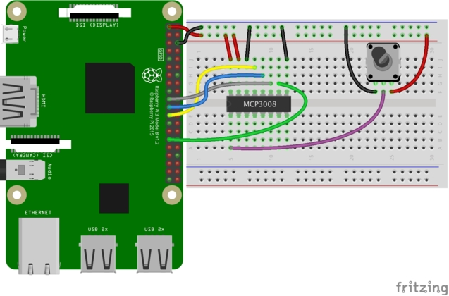
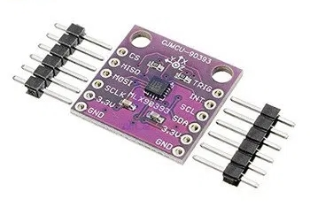
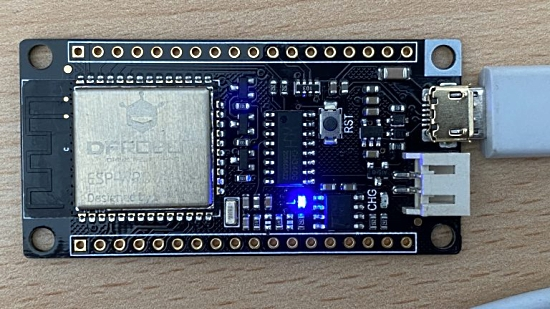
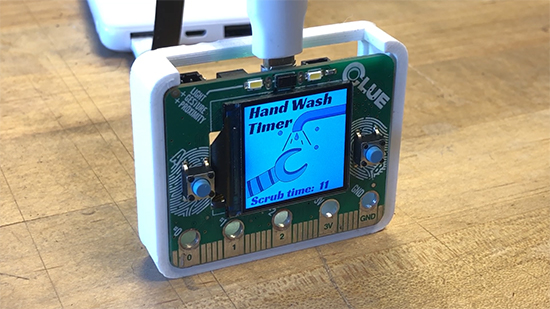

- [X] Kattni updates
- [ ] change date
- [ ] update title
- [ ] Feature story
- [ ] Update  for images
- [ ] All images 550w max only
- [ ] Link "View this email in your browser."

Template last updated on 03-31-2020 by Anne (assets in folders as YYYYMMDD per agreement with Kattni, hardware section)

View this email in your browser.

Hi everyone! It's the latest Python for Microcontrollers newsletter, brought you by the community! We're on [Discord](https://discord.gg/HYqvREz), [Twitter](https://twitter.com/search?q=circuitpython&src=typed_query&f=live), and for past newsletters - [view them all here](https://www.adafruitdaily.com/category/circuitpython/). If you're reading this on the web, [subscribe here](https://www.adafruitdaily.com/). Let's get started!

## Headline Article

CircuitPython 5.1.0 stable was released this week by the CircuitPython development team. This is the latest minor revision of CircuitPython and the first 5.1.x stable release. It is identical to 5.1.0-rc.0.

**New features and improvements since 5.0.0**
- ulab, a numpy-like fast vector module: Perform mathematical operations 10-50x as fast as raw CircuitPython. It is enabled on almost all boards except those with samd21 microcontrollers - [Guide](https://learn.adafruit.com/ulab-crunch-numbers-fast-with-circuitpython/overview)
- Support for “f-strings”, a more convenient way to build strings dynamically. It is enabled on almost all boards except those with samd21 microcontrollers.
- And many more including two new board definitions.

Read more - [Blog](https://blog.adafruit.com/2020/04/02/circuitpython-5-1-0-released-circuitpython-python-ulab-adafruit-circuitpython/) and [Downloads](https://circuitpython.org/downloads)

## Adafruit Update

Adafruit Industries continues to run with 100% of employees being paid and continuing to work. Most are working remotely, with some working in the Manhattan, New York factory as an essential service and business under NYC Executive Order 202.6 Capabilities. Adafruit was deemed an essential service to manufacture and distribute some PPE (Personal Protection Equipment) such as face shields, and manufacture electronics for essential life-saving/preserving equipment and development which is needed in New York and beyond -[Blog](https://blog.adafruit.com/2020/03/22/covid/).

The CircuitPython team released CircuitPython 5.1.0 stable and work on 5.2.x is underway. Would you like to join us? On Discord, head to https://adafru.it/discord to discuss things. And check out [Awesome CircuitPython](https://github.com/adafruit/awesome-circuitpython/blob/master/README.md) for a wide range of information.

*Ed: Are you working on projects with CircuitPython or have good CircuitPython/MicroPython/Python news? Tag your material on Twitter with hashtag #CircuitPython. I'll scan and include items for the next newsletter. Thanks!*

## News from around the web!

Making a Temperature Logger with the Adafruit Feather STM32F405 Express - [Twitter](https://twitter.com/digikey/status/1246025914040881152) and [Maker.io](https://www.digikey.com/en/maker/projects/making-a-temperature-logger-with-the-adafruit-feather-stm32f405-express/11ea860d54074a19bb75cb6425e6d0b0).

How to read data from analog sensors using an MCP3008 with Raspberry Pi - [The Amplituhedron](https://www.theamplituhedron.com/articles/How-to-read-data-from-analog-sensors-using-an-MCP3008-with-Raspberry-Pi/).

Connecting a MLX90393 magnetometer to an Adafruit Feather M0 running Circuitpython - [Learn Micropython](http://www.learnmicropython.com/code/adafruit-feather-m0-and-mlx90393-magnetometer-circuitpython-example.php).

The Learn Micropython website has other interesting projects - [Learn Micropython](http://www.learnmicropython.com/)

Are you interested in using CircuitPython with Azure IoT? If so, please take 20 seconds to fill out a form to help convince Microsoft to back this idea - [Twitter](https://twitter.com/jimbobbennett/status/1246169915104493568)

Migen, LiteX and how Python is useful for chip design - [Twitter](https://twitter.com/pdp7/status/1245292691623227397) and [Slides](https://github.com/pdp7/talks/raw/master/fossn20.pdf).

Using Python for creating hardware to record FOSS conferences - [YouTube](https://www.youtube.com/watch?v=MkVX_mh5dOU).

Using LiteX (based on Migen) lets you do FPGA design in Python - [GitHub](https://github.com/enjoy-digital/litex) and [Twitter](https://twitter.com/pdp7/status/1245502131592933376)

A NeoPixel dodecahedron with custom milled PCBs, running CircuitPython - [Twitter](https://twitter.com/sophywong/status/1245825236932554753).

A Godzilla Monster Light Up Hand Washing Sign - [Instructables](https://www.instructables.com/id/Godzilla-Monster-Light-Up-Hand-Washing-Sign/).

ALICE, a Kinect controlled FPV mini-mech, powered by CircuitPython on an Adafruit Feather - [Twitter](https://twitter.com/scottmonaghan/status/1245935357914308608).

Thermal printers for makers and programmers - includes a section on CircuitPython compatibility - [Twitter](https://rk.edu.pl/en/thermal-printers-makers-and-programmers/)

Using MicroPython on the FireBeetle ESP32 board - [Creatronix](https://creatronix.de/using-micropython-on-firebeetle-esp32/).

#ICYDNCI What was the most popular, most clicked link, in [last week's newsletter](https://link)? [title](url).

## Made with Mu

Why Mu? Mu tries to make it as easy as possible to get started with programming but aims to help you graduate to "real" development tools soon after. Everything in Mu is the "real thing" but presented in as simple and obvious way possible. It's like the toddling stage in learning to walk: you're finding your feet and once you're confident, you should move on and explore! Put simply, Mu aims to foster autonomy. Try out Mu today! - [codewith.mu](https://codewith.mu/)

## Coming soon

## New Boards Supported by CircuitPython

The number of microcontrollers and Single Board  Computers (SBC) grows every week. This section outlines which boards have been added to [CircuitPython.org](https://circuitpython.org/).

This week we had X new boards added!

- [SeeedStudio XIAO](https://twitter.com/seeedstudio/status/1244810108250378240)

Looking for adding a new board to CircuitPython? It's highly encouraged! Adafruit has guides to help you do so:

- [How to Add a New Board to CircuitPython](https://learn.adafruit.com/how-to-add-a-new-board-to-circuitpython/overview)
- [How to add a New Board to the circuitpython.org website](https://learn.adafruit.com/how-to-add-a-new-board-to-the-circuitpython-org-website)
- [Adding a Single Board Computer to PlatformDetect for Blinka](https://learn.adafruit.com/adding-a-single-board-computer-to-platformdetect-for-blinka)
- [Adding a Single Board Computer to Blinka](https://learn.adafruit.com/adding-a-single-board-computer-to-blinka)

## New Learn Guides!

[Adding a Single Board Computer to Blinka](https://learn.adafruit.com/adding-a-single-board-computer-to-blinka) from [Melissa LeBlanc Williams](https://learn.adafruit.com/users/MakerMelissa)

[CLUE Sensor Plotter in CircuitPython](https://learn.adafruit.com/clue-sensor-plotter-circuitpython) from [Kevin Walters](https://learn.adafruit.com/users/kevinjwalters)

[No-Touch Hand Wash Timer for Circuit Playground Express and CLUE](https://learn.adafruit.com/no-touch-hand-wash-timer-for-cpx-and-clue) from [John Park](https://learn.adafruit.com/users/johnpark)

## Updated Guides - Now With More Python!

**You can use CircuitPython libraries on Raspberry Pi!** We're updating all of our CircuitPython guides to show how to wire up sensors to your Raspberry Pi, and load the necessary CircuitPython libraries to get going using them with Python. We'll be including the updates here so you can easily keep track of which sensors are ready to go. Check it out!

Keep an eye out for more updated guides!

## CircuitPython Libraries!

CircuitPython support for hardware continues to grow. We are adding support for new sensors and breakouts all the time, as well as improving on the drivers we already have. As we add more libraries and update current ones, you can keep up with all the changes right here!

For the latest drivers, download the [Adafruit CircuitPython Library Bundle](https://circuitpython.org/libraries).

If you'd like to contribute, CircuitPython libraries are a great place to start. Have an idea for a new driver? File an issue on [CircuitPython](https://github.com/adafruit/circuitpython/issues)! Interested in helping with current libraries? Check out the [CircuitPython.org Contributing page](https://circuitpython.org/contributing). We've included open pull requests and issues from the libraries, and details about repo-level issues that need to be addressed. We have a guide on [contributing to CircuitPython with Git and Github](https://learn.adafruit.com/contribute-to-circuitpython-with-git-and-github) if you need help getting started. You can also find us in the #circuitpython channel on the [Adafruit Discord](https://adafru.it/discord). Feel free to contact Kattni (@kattni) with any questions.

You can check out this [list of all the CircuitPython libraries and drivers available](https://github.com/adafruit/Adafruit_CircuitPython_Bundle/blob/master/circuitpython_library_list.md). 

The current number of CircuitPython libraries is **224**!

**New Libraries!**

Here's this week's new CircuitPython libraries:

 * [Adafruit_CircuitPython_BLE_MIDI](https://github.com/adafruit/Adafruit_CircuitPython_BLE_MIDI)
 * [Adafruit_CircuitPython_BLE_iBBQ](https://github.com/adafruit/Adafruit_CircuitPython_BLE_iBBQ)

**Updated Libraries!**

Here's this week's updated CircuitPython libraries:

 * [Adafruit_CircuitPython_CLUE](https://github.com/adafruit/Adafruit_CircuitPython_CLUE)
 * [Adafruit_CircuitPython_LPS2X](https://github.com/adafruit/Adafruit_CircuitPython_LPS2X)
 * [Adafruit_CircuitPython_ATECC](https://github.com/adafruit/Adafruit_CircuitPython_ATECC)
 * [Adafruit_CircuitPython_MIDI](https://github.com/adafruit/Adafruit_CircuitPython_MIDI)
 * [Adafruit_CircuitPython_HTS221](https://github.com/adafruit/Adafruit_CircuitPython_HTS221)
 * [Adafruit_CircuitPython_DPS310](https://github.com/adafruit/Adafruit_CircuitPython_DPS310)
 * [Adafruit_CircuitPython_LIS3MDL](https://github.com/adafruit/Adafruit_CircuitPython_LIS3MDL)
 * [Adafruit_CircuitPython_LIS2MDL](https://github.com/adafruit/Adafruit_CircuitPython_LIS2MDL)
 * [Adafruit_CircuitPython_Logging](https://github.com/adafruit/Adafruit_CircuitPython_Logging)
 * [Adafruit_CircuitPython_LED_Animation](https://github.com/adafruit/Adafruit_CircuitPython_LED_Animation)

**PyPI Download Stats!**

We've written a special library called Adafruit Blinka that makes it possible to use CircuitPython Libraries on [Raspberry Pi and other compatible single-board computers](https://learn.adafruit.com/circuitpython-on-raspberrypi-linux/). Adafruit Blinka and all the CircuitPython libraries have been deployed to PyPI for super simple installation on Linux! Here are the top 10 CircuitPython libraries downloaded from PyPI in the last week, including the total downloads for those libraries:

Keep checking back for download stats coming soon!

## What’s the team up to this week?

What is the team up to this week? Let’s check in!

**Bryan**

**Dan**

**Jeff**

**Kattni**

**Lucian**

**Melissa**

**Scott**

## Upcoming events!

The PyCon US 2020 team announces planned talks, tutorials, posters, and much more online. 

To participate, Go to the [PyCon US 2020 Remote page](https://us.pycon.org/2020/remote/) to subscribe to receive 5-8 email notifications over the next 6 weeks for published online content. Also you may subscribe to the [PyCon 2020 YouTube Channel](https://www.youtube.com/channel/UCMjMBMGt0WJQLeluw6qNJuA). Expected content:

- Recorded talks and tutorials
- Online Summit and Hatchery programs
- Poster presenters sharing their creations
- Startup Row company presentations
- Sponsor workshop videos and job postings

The organizers appreciate the community’s patience as they work through the logistics of gathering and uploading the recordings.  The goal is to begin providing content about April 15, 2020, right when PyCon was scheduled to begin.

**Send Your Events In**

As for other events, with the COVID pandemic, most in-person events are postponed or cancelled. If you know of virtual events or events that may occur in the next 3-4 months, please let us know on Discord or on Twitter with hashtag #CircuitPython.

## Latest releases

CircuitPython's stable release is [#.#.#](https://github.com/adafruit/circuitpython/releases/latest) and its unstable release is [#.#.#-##.#](https://github.com/adafruit/circuitpython/releases). New to CircuitPython? Start with our [Welcome to CircuitPython Guide](https://learn.adafruit.com/welcome-to-circuitpython).

[2019####](https://github.com/adafruit/Adafruit_CircuitPython_Bundle/releases/latest) is the latest CircuitPython library bundle.

[v#.#.#](https://micropython.org/download) is the latest MicroPython release. Documentation for it is [here](http://docs.micropython.org/en/latest/pyboard/).

[#.#.#](https://www.python.org/downloads/) is the latest Python release. The latest pre-release version is [#.#.#](https://www.python.org/download/pre-releases/).

[1653 Stars](https://github.com/adafruit/circuitpython/stargazers) Like CircuitPython? [Star it on GitHub!](https://github.com/adafruit/circuitpython)

## Call for help – CircuitPython messaging to other languages!

We [recently posted on the Adafruit blog](https://blog.adafruit.com/2018/08/15/help-bring-circuitpython-messaging-to-other-languages-circuitpython/) about bringing CircuitPython messaging to other languages, one of the exciting features of CircuitPython 4 and later versions is translated control and error messages. Native language messages will help non-native English speakers understand what is happening in CircuitPython even though the Python keywords and APIs will still be in English. If you would like to help, [please post](https://github.com/adafruit/circuitpython/issues/1098) to the main issue on GitHub and join us on [Discord](https://adafru.it/discord).

We made this graphic with translated text, we could use your help with that to make sure we got the text right, please check out the text in the image – if there is anything we did not get correct, please let us know. Dan sent me this [handy site too](http://helloworldcollection.de/#Human).

## jobs.adafruit.com - Find a dream job, find great candidates!

[jobs.adafruit.com](https://jobs.adafruit.com/) has returned and folks are posting their skills (including CircuitPython) and companies are looking for talented makers to join their companies - from Digi-Key, to Hackaday, Microcenter, Raspberry Pi and more.

## NUMBER thanks!

The Adafruit Discord community, where we do all our CircuitPython development in the open, reached over NUMBER humans, thank you! Join today! [https://adafru.it/discord](https://adafru.it/discord)

## ICYMI - In case you missed it

The wonderful world of Python on hardware! This is our first video-newsletter-podcast that we’ve started! The news comes from the Python community, Discord, Adafruit communities and more. It’s part of the weekly newsletter, then we have a segment on ASK an ENGINEER and this is the video slice from that! The complete Python on Hardware weekly videocast [playlist is here](https://www.youtube.com/playlist?list=PLjF7R1fz_OOXRMjM7Sm0J2Xt6H81TdDev). 

This video podcast is on [iTunes](https://itunes.apple.com/us/podcast/python-on-hardware/id1451685192?mt=2), [YouTube](https://www.youtube.com/playlist?list=PLjF7R1fz_OOXRMjM7Sm0J2Xt6H81TdDev), [IGTV (Instagram TV](https://www.instagram.com/adafruit/channel/)), and [XML](https://itunes.apple.com/us/podcast/python-on-hardware/id1451685192?mt=2).

[Weekly community chat on Adafruit Discord server CircuitPython channel - Audio / Podcast edition](https://itunes.apple.com/us/podcast/circuitpython-weekly-meeting/id1451685016) - Audio from the Discord chat space for CircuitPython, meetings are usually Mondays at 2pm ET, this is the audio version on [iTunes](https://itunes.apple.com/us/podcast/circuitpython-weekly-meeting/id1451685016), Pocket Casts, [Spotify](https://adafru.it/spotify), and [XML feed](https://adafruit-podcasts.s3.amazonaws.com/circuitpython_weekly_meeting/audio-podcast.xml).

And lastly, we are working up a one-spot destination for all things podcast-able here - [podcasts.adafruit.com](https://podcasts.adafruit.com/)

## Codecademy "Learn Hardware Programming with CircuitPython"

Codecademy, an online interactive learning platform used by more than 45 million people, has teamed up with the leading manufacturer in STEAM electronics, Adafruit Industries, to create a coding course, "Learn Hardware Programming with CircuitPython". The course is now available in the [Codecademy catalog](https://www.codecademy.com/learn/learn-circuitpython?utm_source=adafruit&utm_medium=partners&utm_campaign=circuitplayground&utm_content=pythononhardwarenewsletter).

Python is a highly versatile, easy to learn programming language that a wide range of people, from visual effects artists in Hollywood to mission control at NASA, use to quickly solve problems. But you don’t need to be a rocket scientist to accomplish amazing things with it. This new course introduces programmers to Python by way of a microcontroller — CircuitPython — which is a Python-based programming language optimized for use on hardware.

CircuitPython’s hardware-ready design makes it easier than ever to program a variety of single-board computers, and this course gets you from no experience to working prototype faster than ever before. Codecademy’s interactive learning environment, combined with Adafruit's highly rated Circuit Playground Express, present aspiring hardware hackers with a never-before-seen opportunity to learn hardware programming seamlessly online.

Whether for those who are new to programming, or for those who want to expand their skill set to include physical computing, this course will have students getting familiar with Python and creating incredible projects along the way. By the end, students will have built their own bike lights, drum machine, and even a moisture detector that can tell when it's time to water a plant.

Visit Codecademy to access the [Learn Hardware Programming with CircuitPython](https://www.codecademy.com/learn/learn-circuitpython?utm_source=adafruit&utm_medium=partners&utm_campaign=circuitplayground&utm_content=pythononhardwarenewsletter) course and Adafruit to purchase a [Circuit Playground Express](https://www.adafruit.com/product/3333).

Codecademy has helped more than 45 million people around the world upgrade their careers with technology skills. The company’s online interactive learning platform is widely recognized for providing an accessible, flexible, and engaging experience for beginners and experienced programmers alike. Codecademy has raised a total of $43 million from investors including Union Square Ventures, Kleiner Perkins, Index Ventures, Thrive Capital, Naspers, Yuri Milner and Richard Branson, most recently raising its $30 million Series C in July 2016.

## Contribute!

The CircuitPython Weekly Newsletter is a CircuitPython community-run newsletter emailed every Tuesday. The complete [archives are here](https://www.adafruitdaily.com/category/circuitpython/). It highlights the latest CircuitPython related news from around the web including Python and MicroPython developments. To contribute, edit next week's draft [on GitHub](https://github.com/adafruit/circuitpython-weekly-newsletter/tree/gh-pages/_drafts) and [submit a pull request](https://help.github.com/articles/editing-files-in-your-repository/) with the changes. Join our [Discord](https://adafru.it/discord) or [post to the forum](https://forums.adafruit.com/viewforum.php?f=60) for any further questions.
