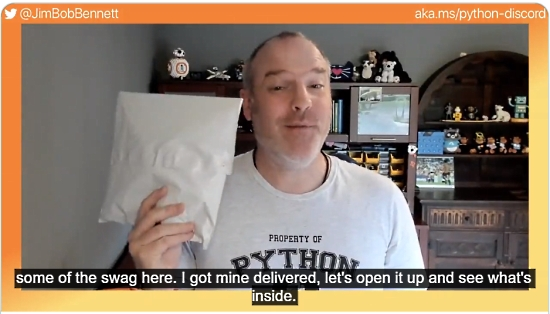
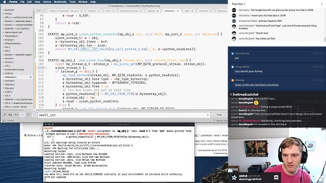
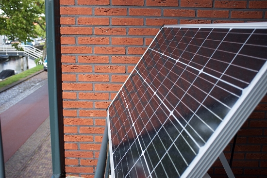
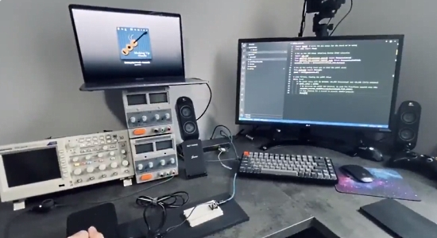
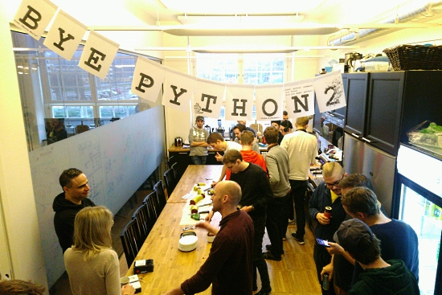
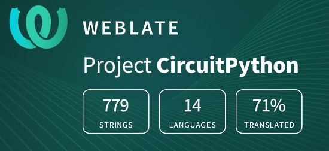

- [X] Kattni updates
- [ ] change date
- [ ] update title
- [ ] Feature story
- [ ] Update  for images
- [ ] Update ICYDNCI
- [ ] All images 550w max only
- [ ] Link "View this email in your browser."

Template last updated on 07-06-2020 by Anne - minor tweaks

View this email in your browser.

Hi everyone! It's the latest Python for Microcontrollers newsletter, brought you by the community! We're on [Discord](https://discord.gg/HYqvREz), [Twitter](https://twitter.com/search?q=circuitpython&src=typed_query&f=live), and for past newsletters - [view them all here](https://www.adafruitdaily.com/category/circuitpython/). If you're reading this on the web, [subscribe here](https://www.adafruitdaily.com/). Let's get started!

## Summer of Making

GitHub is working with Hack Club students sponsor the Summer of Making. $50k in hardware will be given to teenage makers around the world. If you’re a teenager, tell them what you want to build this summer to get some electronics to support you! Need inspiration? Check out what hackers like [@LambdAurora](https://scrapbook.hackclub.com/aurora42lambda) and [Prithul](https://scrapbook.hackclub.com/prithul0218) are building - [More Information](https://airtable.com/shrVFne5G0478Gik4).

## A Wireless and USB-C Keyboard Powered by CircuitPython

Makerdiary has developed a mechanical keyboard using the nRF52840 microcontroller to provide connectivity through USB-C and BLE 5.0 Bluetooth. And the keyboard runs using CircuitPython so it's fully customizable (just drop a new file onto the flash drive the board presents) - [Makerdiary](https://makerdiary.com/pages/m60-mechanical-keyboard) and [GitHub](https://github.com/makerdiary/python-keyboard).

## The Adafruit Discord Server surpasses 22,000 members

The Adafruit Discord community, where we do all our CircuitPython development in the open, reached over 22,000 humans in the last week! Thank you!  Adafruit believes Discord offers a unique way for CircuitPython folks to connect. Join today at [https://adafru.it/discord](https://adafru.it/discord).

## ...and the Microsoft Python Discord Server is Offering Swag

Microsoft has a Discord server for talking Python with Microsoft tools and technologies, such as the Python VS Code for VSC. They are offering some cloud labs there where you can get swag!

Go to http://aka.ms/python-discord and check out all the happenings and the code labs for the swag - [Twitter](https://twitter.com/jimbobbennett/status/1280849115673477121).

## Nominations Open for Python Software Foundation Community Service Awards

The Python Software Foundation is accepting nominations for their second quarter Community Service Awards. Information and previous winners can be [found here](https://python.org/community/awards/psf-awards/). Proposals should be made confidentially to the Board by sending email to psf@python.org. - [Twitter](https://twitter.com/ThePSF/status/1280635964189216769)

## CircuitPython Deep Dive Stream with Scott Shawcroft

This week, Scott streams his work on .

You can see the latest video and past videos on the Adafruit YouTube channel under the Deep Dive playlist - [YouTube](https://www.youtube.com/playlist?list=PLjF7R1fz_OOXBHlu9msoXq2jQN4JpCk8A).

## Adafruit Update

**Adafruit is shipping**

Adafruit has steadily ramped production back up and is providing a wide array of products.

If you have been waiting to order, read [Adafruit's announcement and FAQ](https://www.adafruit.com/opensafely) and then [Shop Adafruit](https://www.adafruit.com/).

## News from around the web!

An update to CircuitPython being ported to the Orange Crab FPGA board. '14216 bytes used, 117426296 bytes free in RAM' - [Twitter](https://twitter.com/GregDavill/status/1281813903098273792) and [GitHub](https://github.com/gregdavill/circuitpython/tree/orangecrab).

A blog now running on solar power. It uses a Raspberry Pi 3B+ with sensing provided by an [Adafruit INA260 sensor](https://www.adafruit.com/product/4226) read via the [CircuitPython Blinka](https://circuitpython.org/) layer - [Louwrentius](https://louwrentius.com/this-blog-is-now-running-on-solar-power.html). 

A foot pedal to start/stop audio for transcription. A sewing machine pedal and one resistor are connected to a Seeeduino XIAO board running Adafruit CircuitPython 5.3.0 (12 lines of code!). The pedal acts as a variable resistor to measure voltage using an analog pin - [Twitter](https://twitter.com/TylerCrumpton/status/1282394586904764423) and [GitHub](https://gist.github.com/tylercrumpton/c2ae1746c7dc0a5f02aad2121c7933d3).

Python Tea is back with the incredible Lorena Mesa [@loooorenanicole](https://twitter.com/loooorenanicole). They're discussing the PyLadies overhaul, PSF election reform, and PSF advocacy - [Twitch](https://www.twitch.tv/videos/675985027) and [Twitter](https://twitter.com/nnja/status/1281385415870566400).

Five Python Features You (Probably) Didn’t Know - [Towards Data Science](https://towardsdatascience.com/five-python-features-you-probably-didnt-know-d48faa0b892e) and [Twitter](https://twitter.com/PythonHub/status/1280883133294895104).

A good-bye party held for Python 2: was it just cake all along? - [Tim Gremalm](http://tim.gremalm.se/bye-python2/).

8 World-Class Software Companies That Use Python - [Real Python](https://realpython.com/world-class-companies-using-python/).

Texthero is a python toolkit to work with text-based dataset quickly and effortlessly. Texthero is very simple to learn and designed to be used on top of Pandas - [GitHub](https://github.com/jbesomi/texthero).

BlurDetection2 - Blur Detection with OpenCV in Python - [GitHub](https://github.com/WillBrennan/BlurDetection2)

**#ICYDNCI What was the most popular, most clicked link, in [last week's newsletter](https://link)? [title](url).**

## Made with Mu

Why Mu? Mu tries to make it as easy as possible to get started with programming but aims to help you graduate to "real" development tools soon after. Everything in Mu is the "real thing" but presented in as simple and obvious way possible. It's like the toddling stage in learning to walk: you're finding your feet and once you're confident, you should move on and explore! Put simply, Mu aims to foster autonomy. Try out Mu today! - [codewith.mu](https://codewith.mu/)

## Coming soon

## New Boards Supported by CircuitPython

The number of supported microcontrollers and Single Board Computers (SBC) grows every week. This section outlines which boards have been included in CircuitPython or added to [CircuitPython.org](https://circuitpython.org/).

This week we had X new boards added!

- [Board name](url)

Looking for adding a new board to CircuitPython? It's highly encouraged! Adafruit has four guides to help you do so:

- [How to Add a New Board to CircuitPython](https://learn.adafruit.com/how-to-add-a-new-board-to-circuitpython/overview)
- [How to add a New Board to the circuitpython.org website](https://learn.adafruit.com/how-to-add-a-new-board-to-the-circuitpython-org-website)
- [Adding a Single Board Computer to PlatformDetect for Blinka](https://learn.adafruit.com/adding-a-single-board-computer-to-platformdetect-for-blinka)
- [Adding a Single Board Computer to Blinka](https://learn.adafruit.com/adding-a-single-board-computer-to-blinka)

## New Learn Guides!

[PyPortal Roku Remote](https://learn.adafruit.com/pyportal-roku-remote) from [Dylan Herrada](https://learn.adafruit.com/users/dherrada)

[PyPortal US Election Calendar](https://learn.adafruit.com/pyportal-electioncal-us) from [Àlvaro Figueroa](https://learn.adafruit.com/users/fede2)

[LED Matrix Hourglass](https://learn.adafruit.com/led-matrix-hourglass) from [Noe and Pedro](https://learn.adafruit.com/users/pixil3d)

[Lucio Blaster 2020 - CircuitPython for Advanced Prop Making](https://learn.adafruit.com/lucio-blaster-2020-circuitpython-advanced-prop-making) from [John Park](https://learn.adafruit.com/users/johnpark)

[LED Bullwhip with Motion & Sound Reactivity](https://learn.adafruit.com/led-bullwhip) from [Erin St. Blaine](https://learn.adafruit.com/users/firepixie)

[Running PyPortal Code on Blinka with Displayio](https://learn.adafruit.com/running-pyportal-code-on-blinka-with-displayio) from [Melissa LeBlanc-Williams](https://learn.adafruit.com/users/MakerMelissa)

[Adafruit DS1841 I2C Logarithmic Resistor](https://learn.adafruit.com/adafruit-ds1841-i2c-logarithmic-resistor) from [Bryan Siepert](https://learn.adafruit.com/users/siddacious)

## CircuitPython Libraries!

CircuitPython support for hardware continues to grow. We are adding support for new sensors and breakouts all the time, as well as improving on the drivers we already have. As we add more libraries and update current ones, you can keep up with all the changes right here!

For the latest libraries, download the [Adafruit CircuitPython Library Bundle](https://circuitpython.org/libraries). For the latest community contributed libraries, download the [CircuitPython Community Bundle](https://github.com/adafruit/CircuitPython_Community_Bundle/releases).

If you'd like to contribute, CircuitPython libraries are a great place to start. Have an idea for a new driver? File an issue on [CircuitPython](https://github.com/adafruit/circuitpython/issues)! Have you written a library you'd like to make available? Submit it to the [CircuitPython Community Bundle](https://github.com/adafruit/CircuitPython_Community_Bundle). Interested in helping with current libraries? Check out the [CircuitPython.org Contributing page](https://circuitpython.org/contributing). We've included open pull requests and issues from the libraries, and details about repo-level issues that need to be addressed. We have a guide on [contributing to CircuitPython with Git and Github](https://learn.adafruit.com/contribute-to-circuitpython-with-git-and-github) if you need help getting started. You can also find us in the #circuitpython channel on the [Adafruit Discord](https://adafru.it/discord).

You can check out this [list of all the Adafruit CircuitPython libraries and drivers available](https://github.com/adafruit/Adafruit_CircuitPython_Bundle/blob/master/circuitpython_library_list.md). 

The current number of CircuitPython libraries is **262**!

**Updated Libraries!**

We updated nearly all our libraries this week! Most of it was a simple change to the README. For a list of this week's updated libraries, check out the [CircuitPython Library Report](https://adafruit-circuit-python.s3.amazonaws.com/adabot/bin/reports/circuitpython_library_report_20200710.txt).

**PyPI Download Stats!**

We've written a special library called Adafruit Blinka that makes it possible to use CircuitPython Libraries on [Raspberry Pi and other compatible single-board computers](https://learn.adafruit.com/circuitpython-on-raspberrypi-linux/). Adafruit Blinka and all the CircuitPython libraries have been deployed to PyPI for super simple installation on Linux! Here are the top 10 CircuitPython libraries downloaded from PyPI in the last week, including the total downloads for those libraries:

Keep checking back for updated download stats coming soon!

## What’s the team up to this week?

What is the team up to this week? Let’s check in!

**Bryan**

**Dan**

**Jeff**

**Kattni**

**Lucian**

**Melissa**

**Scott**

## Upcoming events!

EuroPython 2020 this year will be an online conference from July 23-26. The schedule is now available - [Website](https://ep2020.europython.eu/schedule/).

Attending the conference days will require a ticket, participating in the sprint days will be free - [EuroPython](https://blog.europython.eu/post/614102095419850752/europython-2020-online-conference-from-july-23-26).

PyConline AU will be an online event, held September 4–6, 2020 -  [pycon.org.au](https://2020.pycon.org.au/).

PyCon India 2020: the premier conference in India on using and developing the Python programming language. Held online October 3-5, 2020. A [call for proposals](https://in.pycon.org/cfp/2020/proposals/) is now open through August 14, 2020. - [Website](https://in.pycon.org/2020/) and [Twitter](https://twitter.com/pyconindia)

**Send Your Events In**

As for other events, with the COVID pandemic, most in-person events are postponed or cancelled. If you know of virtual events or events that may occur in the future, please let us know on Discord or on Twitter with hashtag #CircuitPython.

## Latest releases

CircuitPython's stable release is [#.#.#](https://github.com/adafruit/circuitpython/releases/latest) and its unstable release is [#.#.#-##.#](https://github.com/adafruit/circuitpython/releases). New to CircuitPython? Start with our [Welcome to CircuitPython Guide](https://learn.adafruit.com/welcome-to-circuitpython).

[2019####](https://github.com/adafruit/Adafruit_CircuitPython_Bundle/releases/latest) is the latest CircuitPython library bundle.

[v#.#.#](https://micropython.org/download) is the latest MicroPython release. Documentation for it is [here](http://docs.micropython.org/en/latest/pyboard/).

[#.#.#](https://www.python.org/downloads/) is the latest Python release. The latest pre-release version is [#.#.#](https://www.python.org/download/pre-releases/).

[1767 Stars](https://github.com/adafruit/circuitpython/stargazers) Like CircuitPython? [Star it on GitHub!](https://github.com/adafruit/circuitpython)

## Call for help -- Translating CircuitPython is now easier than ever!

One important feature of CircuitPython is translated control and error messages.

With the help of fellow open source project [Weblate](https://weblate.org/), we're making it even easier to add or improve translations.

Sign in with an existing account such as Github, Google or Facebook and start contributing through a simple web interface. No forks or pull requests needed!

As always, if you run into trouble join us on [Discord](https://adafru.it/discord), we're here to help.

## jobs.adafruit.com - Find a dream job, find great candidates!

[jobs.adafruit.com](https://jobs.adafruit.com/) has returned and folks are posting their skills (including CircuitPython) and companies are looking for talented makers to join their companies - from Digi-Key, to Hackaday, Microcenter, Raspberry Pi and more.

## ICYMI - In case you missed it

The wonderful world of Python on hardware! This is our first video-newsletter-podcast that we’ve started! The news comes from the Python community, Discord, Adafruit communities and more. It’s part of the weekly newsletter, then we have a segment on ASK an ENGINEER and this is the video slice from that! The complete Python on Hardware weekly videocast [playlist is here](https://www.youtube.com/playlist?list=PLjF7R1fz_OOXRMjM7Sm0J2Xt6H81TdDev). 

This video podcast is on [iTunes](https://itunes.apple.com/us/podcast/python-on-hardware/id1451685192?mt=2), [YouTube](http://adafru.it/pohepisodes), [IGTV (Instagram TV](https://www.instagram.com/adafruit/channel/)), and [XML](https://itunes.apple.com/us/podcast/python-on-hardware/id1451685192?mt=2).

[Weekly community chat on Adafruit Discord server CircuitPython channel - Audio / Podcast edition](https://itunes.apple.com/us/podcast/circuitpython-weekly-meeting/id1451685016) - Audio from the Discord chat space for CircuitPython, meetings are usually Mondays at 2pm ET, this is the audio version on [iTunes](https://itunes.apple.com/us/podcast/circuitpython-weekly-meeting/id1451685016), Pocket Casts, [Spotify](https://adafru.it/spotify), and [XML feed](https://adafruit-podcasts.s3.amazonaws.com/circuitpython_weekly_meeting/audio-podcast.xml).

And lastly, we are working up a one-spot destination for all things podcast-able here - [podcasts.adafruit.com](https://podcasts.adafruit.com/)

## Codecademy "Learn Hardware Programming with CircuitPython"

Codecademy, an online interactive learning platform used by more than 45 million people, has teamed up with the leading manufacturer in STEAM electronics, Adafruit Industries, to create a coding course, "Learn Hardware Programming with CircuitPython". The course is now available in the [Codecademy catalog](https://www.codecademy.com/learn/learn-circuitpython?utm_source=adafruit&utm_medium=partners&utm_campaign=circuitplayground&utm_content=pythononhardwarenewsletter).

Python is a highly versatile, easy to learn programming language that a wide range of people, from visual effects artists in Hollywood to mission control at NASA, use to quickly solve problems. But you don’t need to be a rocket scientist to accomplish amazing things with it. This new course introduces programmers to Python by way of a microcontroller — CircuitPython — which is a Python-based programming language optimized for use on hardware.

CircuitPython’s hardware-ready design makes it easier than ever to program a variety of single-board computers, and this course gets you from no experience to working prototype faster than ever before. Codecademy’s interactive learning environment, combined with Adafruit's highly rated Circuit Playground Express, present aspiring hardware hackers with a never-before-seen opportunity to learn hardware programming seamlessly online.

Whether for those who are new to programming, or for those who want to expand their skill set to include physical computing, this course will have students getting familiar with Python and creating incredible projects along the way. By the end, students will have built their own bike lights, drum machine, and even a moisture detector that can tell when it's time to water a plant.

Visit Codecademy to access the [Learn Hardware Programming with CircuitPython](https://www.codecademy.com/learn/learn-circuitpython?utm_source=adafruit&utm_medium=partners&utm_campaign=circuitplayground&utm_content=pythononhardwarenewsletter) course and Adafruit to purchase a [Circuit Playground Express](https://www.adafruit.com/product/3333).

Codecademy has helped more than 45 million people around the world upgrade their careers with technology skills. The company’s online interactive learning platform is widely recognized for providing an accessible, flexible, and engaging experience for beginners and experienced programmers alike. Codecademy has raised a total of $43 million from investors including Union Square Ventures, Kleiner Perkins, Index Ventures, Thrive Capital, Naspers, Yuri Milner and Richard Branson, most recently raising its $30 million Series C in July 2016.

## Contribute!

The CircuitPython Weekly Newsletter is a CircuitPython community-run newsletter emailed every Tuesday. The complete [archives are here](https://www.adafruitdaily.com/category/circuitpython/). It highlights the latest CircuitPython related news from around the web including Python and MicroPython developments. To contribute, edit next week's draft [on GitHub](https://github.com/adafruit/circuitpython-weekly-newsletter/tree/gh-pages/_drafts) and [submit a pull request](https://help.github.com/articles/editing-files-in-your-repository/) with the changes. Join our [Discord](https://adafru.it/discord) or [post to the forum](https://forums.adafruit.com/viewforum.php?f=60) for any further questions.
