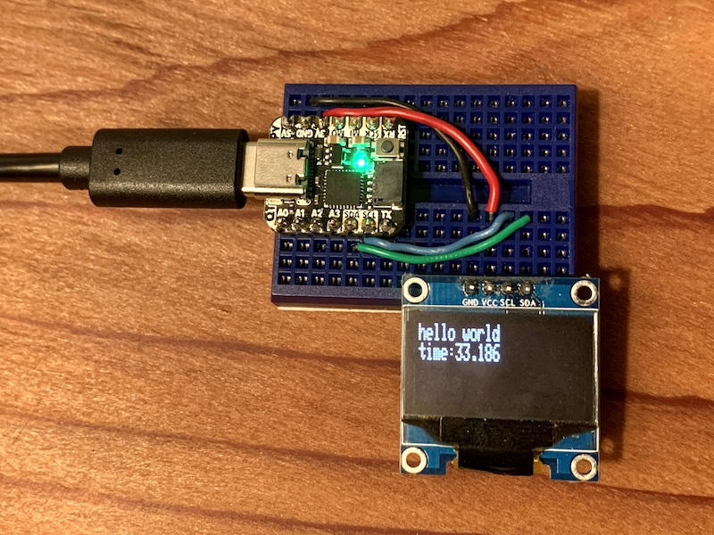
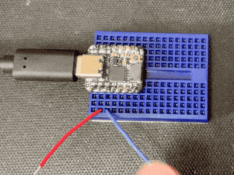
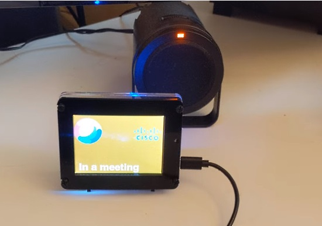
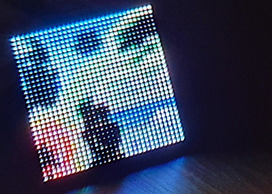
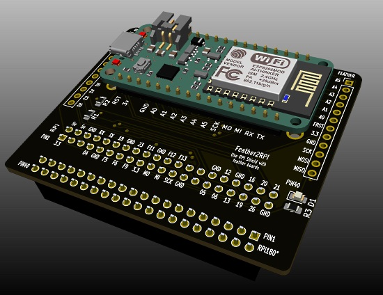
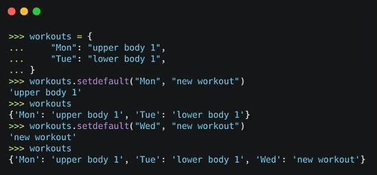

View this email in your browser.

Hi everyone! It's the latest Python for Microcontrollers newsletter, brought you by the community! We're on [Discord](https://discord.gg/HYqvREz), [Twitter](https://twitter.com/search?q=circuitpython&src=typed_query&f=live), and for past newsletters - [view them all here](https://www.adafruitdaily.com/category/circuitpython/). If you're reading this on the web, [subscribe here](https://www.adafruitdaily.com/). Let's get started!

## Visual Studio Code now supports Raspberry Pi and ARM Chromebooks

Microsoft Visual Studio Code (VSC) is one of the most popular pieces of programming software on the planet, in part because it's available on any plaform a developer might want to use it on. At least, mostly. One missing piece was ARM support for Linux devices, but with the latest update, 1.50, that's been rectified.

This news has two huge applications in Making and education. The first is the Raspberry Pi, running an ARM CPU and Linux and now Visual Studio Code. The Raspberry Pi 4 is a potent machine, with up to 8GB of RAM, but Visual Studio Code also makes it extremely easy to leverage remote machines for more intensive workloads.

The other big application is ARM Chromebooks. It's been possible to install Visual Studio Code on Chromebooks with Linux support for some time, but ARM-powered devices have been lacking. Now it's officially a thing: downloading the ARM installer from the Visual Studio Code downloads page - [Windows Central](https://www.windowscentral.com/microsoft-visual-studio-code-now-supports-raspberry-pi-and-arm-chromebooks), [Twitter](https://twitter.com/code/status/1315371339012739072) and [Download](https://code.visualstudio.com/#alt-downloads).

## QT Py CircuitPython Tricks

QT Py Tricks is a collection of projects for using the Adafruit QT Py mini-board running CircuitPython 6. The code will also work on a Trinket M0 and othert CircuitPython-compatible boards with an adjustment to board pin assignments.

## Today is Ada Lovelace Day

The world celebrates Ada Lovelace Day on the 2nd Tuesday of October (today!).

Instead of lamenting all the in person gatherings and halloween hoedowns that aren’t happening this year; get into all the virtual activities coming your way!

Today Adafruit is spending the day highlighting a number of women who are pioneers of their fields and inspiring women of all ages to make their voices heard.

[Finding Ada](https://findingada.com/get-involved/) has some ways you can get involved and spread the word:

- Send a Tweet
- Update Facebook
- Add a link to FindingAda.com on LinkedIn
- Write about Ada Lovelace Day on your blog
- Email your friends and/or relevant mailing lists
- Post an item on LinkedIn or Facebook Groups

You can [read more](https://findingada.com/about/our-mission/), [find events](https://findingada.com/events/), and [get involved](https://findingada.com/get-involved/)!

## Adafruit Update

Adafruit carries all the technology to make Halloween fantastic! See projects tagged #ElectronicHalloween all month for Halloween related projects using Adafruit gear  - [Twitter](https://twitter.com/hashtag/ElectronicHalloween?src=hashtag_click) and [Adafruit Blog](https://blog.adafruit.com/category/halloween/).

**Adafruit is stocked and shipping orders!**

Now is the best time to get orders in for your favorite products, including items for students. Science is fun and educational when using Adafruit parts and free, easy to follow tutorials in the [Adafruit Learning System](https://learn.adafruit.com/).

**[Shop Adafruit now](https://www.adafruit.com/)**

## CircuitPython Deep Dive Stream with Scott Shawcroft

[This week](https://youtu.be/oSFgB2xhJCk), Scott streams his work on the Metro iMX RT 1011 and some CircuitPython issue triage.

You can see the latest video and past videos on the Adafruit YouTube channel under the Deep Dive playlist - [YouTube](https://www.youtube.com/playlist?list=PLjF7R1fz_OOXBHlu9msoXq2jQN4JpCk8A).

## SparkFun Customer Survey 2020

[SparkFun](https://www.sparkfun.com/) has released their customer satisfaction survey for this year. They are looking for a range of feedback. They are offering a chance to win a $500 SparkFun credit voucher. The survey will close at 11:45 a.m. on Tuesday, October 20th - [SparkFun](https://www.sparkfun.com/news/3408) and [Twitter](https://twitter.com/sparkfun/status/1313511127704363009).

## News from around the web!

CircuitPython_DiscordBot is a very simple Discord API for CircuitPython - [GitHub](https://github.com/2231puppy/CircuitPython_DiscordBot).

CircuitPython BlinkaBot is a fun programmable chatbot where you interface with it using the Bluefruit Connect app (Android & iOS) and communicate with a [Circuit Playground Bluefruit]() microcontroller - [GitHub](https://github.com/mytechnotalent/CircuitPython_BlinkaBot) and [Twitter](https://twitter.com/mytechnotalent/status/1314302311527706625).

Display your Cisco Webex meeting status to all, with a status screen powered by an [Adafruit Pyportal](https://www.adafruit.com/product/4116) and Cisco Webex APIs - [YouTube](https://youtu.be/NFT_pG8XaUs).

Teacher Aaron Reuland puts together the Adafruit soil sensor/ water pump from the last [Adabox](https://www.adafruit.com/adabox/): "totally awesome and started dreaming up cheap and easy ways of bringing these concepts to my students." - [Twitter](https://twitter.com/MrReuland/status/1315725533750099969) and signups for the next Adabox, Adabox016, close in two days - Halloween themed - [Adafruit](https://www.adafruit.com/adabox/).

Buttons, the [Adafruit Qt Py](https://www.adafruit.com/product/4600), shift registers, and some CircuitPython code and you've got a counter - [Twitter](https://twitter.com/oakdevtech/status/1314989491040464907?s=03).

Python 3.9.0 is now available, and you can already test 3.10.0a1 - [Python Insider](https://pythoninsider.blogspot.com/2020/10/python-390-is-now-available-and-you-can.html).

A wireless LED album art display - using a 32x32 LED panel, [Raspberry Pi Zero WH](https://www.adafruit.com/product/3708), [Adafruit RGB Matrix Bonnet](https://www.adafruit.com/product/3211) and Python scripts - [Hackaday](https://hackaday.com/2020/10/11/lo-fi-art-on-a-32x32-matrix/) and [GitHub](https://github.com/fspoettel/thirtytwopixels).

Accelerating Driver Development with CircuitPython - Bryan Siepert - [YouTube](https://www.youtube.com/watch?v=DdB3QS4_QQU).

Using MicroPython on a MacBook to program the ESP32-DevKitC ESP-WROOM-32 - [note.com](https://note.com/khe00716/n/nf67e02f70203) (Japanese).

Evo M51 CircuitPython Library Update: UART, SPI and I2C - you can now use I2C, SPI, and UART with Evo M51 to connect all kinds of devices - [YouTube](https://www.youtube.com/watch?v=sVEDgJmJhoI).

Matt Trentini writes: All of these boards run MicroPython - how many do you recognise? - [Twitter](https://twitter.com/matt_trentini/status/1314066482024706048).

A Feather to Raspberry Pi HAT converter - use HATs, Bonnets, etc. with a Feather processor board - [Twitter](https://twitter.com/sulfuroid/status/1313603045683539969).

An FPGA Tomu Workshop including running MicroPython on a RISC-V binary - [fomu.im](https://workshop.fomu.im/en/latest/).

Python Tip: dicts have a useful method called setdefault that can retrieve or set a value in one statement - [Twitter](https://twitter.com/pybites/status/1313365102343663621).

10 key takeaways from the first-ever [Arm DevSummit](https://devsummit.arm.com/) - [hackster.io](https://www.hackster.io/news/10-key-takeaways-from-arm-s-first-ever-devsummit-474ebe849872).

PyDev of the Week: Sean Tibor on [Mouse vs Python](https://www.blog.pythonlibrary.org/2020/10/12/pydev-of-the-week-sean-tibor/)

#ICYDNCI What was the most popular, most clicked link, in [last week's newsletter](https://www.adafruitdaily.com/2020/10/06/python-on-microcontrollers-newsletter-new-circuitpython-beta-releases-and-more-python-adafruit-circuitpython-electrichalloween-micropython-thepsf/)? [Unexpected Maker FeatherS2 - ESP32-S2](https://unexpectedmaker.com/shop/feathers2-esp32-s2).

## Coming soon

The Metro M7 iMX RT1011 is an all-in-one Metro design and is Arduino UNO shaped so it works with shields. It features an iMX RT1011 500 MHz processor with 128K of RAM and QSPI memory. Even though it doesn’t have a ton of RAM, it’s got a nice speediness to it which we really dig. Currently testing out CircuitPython 6 with the AirLift WiFi co-processor to get data from the interwebs and display it on an OLED. The OLED plugs right into the stemma QT connector so it's really easy to get sensors and displays attached!

Out soon, more info - [Blog](https://blog.adafruit.com/2020/10/07/metro-m7-imx-rt1011-with-circuitpython/) and [YouTube](https://youtu.be/Wbq78z9BaiM).

Here's a CLUE about a design Adafruit will be working on soon. This little module contains an ESP32-S2 chip with 4 MB of built in FLASH memory, with native USB and WiFi support it could make for a great little WiFi sensor driver - [Twitter](https://twitter.com/adafruit/status/1315421015502204930).

## New Boards Supported by CircuitPython

The number of supported microcontrollers and Single Board Computers (SBC) keeps growing!

This week, no new boards were added to [CircuitPython.org](https://circuitpython.org/), but more are in development.

Looking for adding a new board to CircuitPython? It's highly encouraged! Adafruit has four guides to help you do so:

- [How to Add a New Board to CircuitPython](https://learn.adafruit.com/how-to-add-a-new-board-to-circuitpython/overview)
- [How to add a New Board to the circuitpython.org website](https://learn.adafruit.com/how-to-add-a-new-board-to-the-circuitpython-org-website)
- [Adding a Single Board Computer to PlatformDetect for Blinka](https://learn.adafruit.com/adding-a-single-board-computer-to-platformdetect-for-blinka)
- [Adding a Single Board Computer to Blinka](https://learn.adafruit.com/adding-a-single-board-computer-to-blinka)

## New Learn Guides!

[IoT Twitter Listener Party Parrot](https://learn.adafruit.com/iot-twitter-listener-party-parrot) from [Liz Clark](https://learn.adafruit.com/users/BlitzCityDIY)

[Adafruit BrainCraft HAT - Easy Machine Learning for Raspberry Pi](https://learn.adafruit.com/adafruit-braincraft-hat-easy-machine-learning-for-raspberry-pi) from [Melissa LeBlanc-Williams](https://learn.adafruit.com/users/MakerMelissa)

[LED Matrix Display for Bitmap Pixel Art](https://learn.adafruit.com/pixel-art-matrix-display) from [John Park](https://learn.adafruit.com/users/johnpark)

## CircuitPython Libraries!

CircuitPython support for hardware continues to grow. We are adding support for new sensors and breakouts all the time, as well as improving on the drivers we already have. As we add more libraries and update current ones, you can keep up with all the changes right here!

For the latest libraries, download the [Adafruit CircuitPython Library Bundle](https://circuitpython.org/libraries). For the latest community contributed libraries, download the [CircuitPython Community Bundle](https://github.com/adafruit/CircuitPython_Community_Bundle/releases).

If you'd like to contribute, CircuitPython libraries are a great place to start. Have an idea for a new driver? File an issue on [CircuitPython](https://github.com/adafruit/circuitpython/issues)! Have you written a library you'd like to make available? Submit it to the [CircuitPython Community Bundle](https://github.com/adafruit/CircuitPython_Community_Bundle). Interested in helping with current libraries? Check out the [CircuitPython.org Contributing page](https://circuitpython.org/contributing). We've included open pull requests and issues from the libraries, and details about repo-level issues that need to be addressed. We have a guide on [contributing to CircuitPython with Git and Github](https://learn.adafruit.com/contribute-to-circuitpython-with-git-and-github) if you need help getting started. You can also find us in the #circuitpython channel on the [Adafruit Discord](https://adafru.it/discord).

You can check out this [list of all the Adafruit CircuitPython libraries and drivers available](https://github.com/adafruit/Adafruit_CircuitPython_Bundle/blob/master/circuitpython_library_list.md). 

The current number of CircuitPython libraries is **275**!

**New Libraries!**

Here's this week's new CircuitPython libraries:

 * [Adafruit_CircuitPython_DisplayIO_SH1107](https://github.com/adafruit/Adafruit_CircuitPython_DisplayIO_SH1107)
 * [Adafruit_CircuitPython_TLA202x](https://github.com/adafruit/Adafruit_CircuitPython_TLA202x)

**Updated Libraries!**

Here's this week's updated CircuitPython libraries:

 * [Adafruit_CircuitPython_MS8607](https://github.com/adafruit/Adafruit_CircuitPython_MS8607)
 * [Adafruit_CircuitPython_MotorKit](https://github.com/adafruit/Adafruit_CircuitPython_MotorKit)
 * [Adafruit_CircuitPython_SharpMemoryDisplay](https://github.com/adafruit/Adafruit_CircuitPython_SharpMemoryDisplay)
 * [Adafruit_CircuitPython_LIS3DH](https://github.com/adafruit/Adafruit_CircuitPython_LIS3DH)
 * [Adafruit_CircuitPython_PyPortal](https://github.com/adafruit/Adafruit_CircuitPython_PyPortal)
 * [Adafruit_CircuitPython_MatrixPortal](https://github.com/adafruit/Adafruit_CircuitPython_MatrixPortal)
 * [Adafruit_Blinka](https://github.com/adafruit/Adafruit_Blinka)

## What’s the team up to this week?

What is the team up to this week? Let’s check in!

**Bryan**

Over the last week, I worked on filling out the MCP2515 CircuitPython library and have it ready for release after a few tweaks get the OK from Jeff. I was also able to do some more testing of the prototype CAN FeatherWing and was able to successfully snoop on traffic between an ODB dongle and my car! There is still work to be done to allow for decoding the higher level protocols being used, but it’s a start!

I also wrote a CircuitPython library for the TLA2024 4-channel 12-bit ADC from TI. This is an adorable little chip that packs a good amount of capability in a small package. In addition to single-ended measurements of each of the four channels, it supports differential measurement between several different combinations of inputs. And it’s relatively inexpensive! Simple to use, capable, small and inexpensive, this little helper can add digital measurement of analog signals in existing and new projects with minimal hassle or expense.

**Jeff**

We now have a second canio implementation merged into the core, this time for the STM32F405 feather and other boards featuring the STM32F405 microcontroller.  To use it, you also need an external CAN transceiver chip such as the NXP TJA1051 as well as other device(s) that also talk a CAN protocol.

Aside from my work on CAN bus, I've also been fixing bugs in CircuitPython and moving us closer to a stable release of version 6.  In particular, another Pull Request I made this week was to fix the crashes users experienced with RGBMatrix in 6.0.0.alpha.1.  This was quickly followed by the alpha.2 release.

**Kattni**

This week I updated of the the LED matrix guides to feature the new Matrix Portal. Search the Learn system for Matrix Portal to find a number of projects to get you started. I also added a CircuitPython page to the 128x64 OLED FeatherWing guide as we now have SH1107 support in CircuitPython.

I soldered up a QT Py Haxpress - the first time I've ever soldered a chip or really anything that tiny. Bonus points: it works!

I am working on testing the LED Animation library with the Haxpress, which has been successful so far, running individual animations separately. I tested using the LED Animation library with the base QT Py and, unfortunately, the library doesn't fit, so it's not an option.
 
I'm writing up a QT Py and NeoPixels guide to get you started with using LEDs on your tiny new board. It will cover wiring, example code for using NeoPixels with your base QT Py, and a section on using the LED Animation library with the QT Py Haxpress. Keep an eye out for that!

**Lucian**

This past week I added the AnalogIO functions to the ESP32-S2 port, the Analog to Digital converter (ADC) and Digital to Analog converter (DAC) respectively. The ADC was definitely the trickier of the two - most ADCs on embedded boards are not especially accurate, and the ESP32-S2 in particular has some serious issues when using raw data directly. Un-modified, the ADC's range of voltage readings has several non-linear regions, and has difficulty hitting the extreme ends of the range, 0 and 3.3V (known as "rail to rail" readings).

To get around this, Espressif's IoT Development Framework (known as the ESP-IDF) contains software to automatically compensate and correct issues in the ADC. However, this particular module wasn't available in the version of the ESP-IDF we were using, which necessitated a complicated update involving a lot of header file changes and binary searching of commits to find an IDF version that wouldn't break USB. Luckily it all seems more or less dealt with now and we should have Analog capability on the ESP32 by the end of the week.

Meanwhile, much as it was on the STM32, the DAC additions were so simple they didn't even require notes, much less debugging. Something about DACs... their implementation always seems as proportionally easy as the ADCs are annoying.

And finally, for the STM32, we've started to mark the F4 series as stable in releases, alongside the SAMD and nRF series of SoCs. STM32 support has been maturing for over a year now, so the guide for the Feather F405 has also been updated to reflect the new modules we support and incorporate user feedback. This month, I'll be revisiting some of the final modules that remain unsupported on ST, such as TouchIO and RotaryIO, to see if we can't get those wrapped up as well.

**Melissa**

This past week, I worked on finishing up the [BrainCraft HAT guide](https://learn.adafruit.com/adafruit-braincraft-hat-easy-machine-learning-for-raspberry-pi.). It was started by Ladyada, so I went through and tested the parts she wrote and added more to the guide. 

I also worked on updating the MatrixPortal library to support more hardware such as the RGB Matrix FeatherWings. Even though there aren't enough pins to use the Airlift FeatherWing, you can still use the automatic initialization of the Matrix and I've heard with some creative wiring, you can also get the Airlift breakout to work with it.

**Scott**

This week I've focused on getting the iMX RT 1011 Metro debugged and working. The Metro ESP32-S2 is going as well. It's exciting to prep new platforms for CircuitPython and see Adafruit release hardware for it.

One side project I did was a [SPI Flash command analyzer for Saleae Logic 2](https://github.com/adafruit/Logic2-SPIFlash).

Next week, I'll be trying to squash the remaining bugs for 6.0.0's stable release and collaborating on deep sleep support.

## Upcoming events!

Hacktoberfest® is a celebration of Open Source Softare, created by DigitalOcean. It's open to everyone around the globe. Whether you’re a developer, student learning to code, event host, or company of any size, you can help drive growth of open source and make positive contributions to an ever-growing community. All backgrounds and skill levels are encouraged to complete the challenge. You can win a t-shirt or plant a tree.

Pull requests can be made in any GitHub-hosted repositories/projects. You can sign up anytime between October 1 and October 31. More - [Hacktoberfest](https://hacktoberfest.digitalocean.com/).

The Hackaday Remoticon will take place everywhere November 6th – 8th, 2020. It’s a weekend packed with workshops about hardware creation, held virtually for all to enjoy - [Hackaday](https://hackaday.com/2020/08/04/hackaday-remoticon-our-2020-conference-is-packed-with-workshops-and-were-calling-for-proposals/).

PyCon Sweden 2020 will be held 12-13 of November 2020 online - [PyCon Sweden](http://www.pycon.se/).

**Send Your Events In**

As for other events, with the COVID pandemic, most in-person events are postponed or cancelled. If you know of virtual events or events that may occur in the future, please let us know on Discord or on Twitter with hashtag #CircuitPython.

## Latest releases

CircuitPython's stable release is [5.3.1](https://github.com/adafruit/circuitpython/releases/latest) and its unstable release is [6.0.0-beta.2](https://github.com/adafruit/circuitpython/releases). New to CircuitPython? Start with our [Welcome to CircuitPython Guide](https://learn.adafruit.com/welcome-to-circuitpython).

[20201010](https://github.com/adafruit/Adafruit_CircuitPython_Bundle/releases/latest) is the latest CircuitPython library bundle.

[v1.13](https://micropython.org/download) is the latest MicroPython release. Documentation for it is [here](http://docs.micropython.org/en/latest/pyboard/).

[3.9.0](https://www.python.org/downloads/) is the latest Python release. The latest pre-release version is [3.10.0a1](https://www.python.org/download/pre-releases/).

[1865 Stars](https://github.com/adafruit/circuitpython/stargazers) Like CircuitPython? [Star it on GitHub!](https://github.com/adafruit/circuitpython)

## Call for help -- Translating CircuitPython is now easier than ever!

One important feature of CircuitPython is translated control and error messages.

With the help of fellow open source project [Weblate](https://weblate.org/), we're making it even easier to add or improve translations.

Sign in with an existing account such as Github, Google or Facebook and start contributing through a simple web interface. No forks or pull requests needed!

As always, if you run into trouble join us on [Discord](https://adafru.it/discord), we're here to help.

## jobs.adafruit.com - Find a dream job, find great candidates!

[jobs.adafruit.com](https://jobs.adafruit.com/) is for folks posting their skills (including CircuitPython) and companies looking for talented makers. The job highlight of the week:

**Museum Tech Supervisor - MICRO**

MICRO in New York is looking for a Museum Tech Supervisor who will own and manage some of the most exciting challenges in new museum design. They will be responsible for building and engineering MICRO’s growing fleet of six-foot tall museums.

Do you have a background in highly detailed fabrication? Have you worked in museum exhibitry, model making, or prop building? If you’re a hyper-organized, self-motivated doer who loves to tinker and solve problems and wants to work with beautiful museums, the Museum Tech Supervisor position at MICRO is your dream job - [Adafruit Jobs Board](https://jobs.adafruit.com/job/museum-tech-supervisor/).

## 25,198 thanks!

The Adafruit Discord community, where we do all our CircuitPython development in the open, reached over 25,198 humans, thank you!  Adafruit believes Discord offers a unique way for CircuitPython folks to connect. Join today at [https://adafru.it/discord](https://adafru.it/discord).

## ICYMI - In case you missed it

The wonderful world of Python on hardware! This is our Python video-newsletter-podcast! The news comes from the Python community, Discord, Adafruit communities and more and is reviewed on ASK an ENGINEER Wednesdays. The complete Python on Hardware weekly videocast [playlist is here](https://www.youtube.com/playlist?list=PLjF7R1fz_OOXRMjM7Sm0J2Xt6H81TdDev). 

This video podcast is on [iTunes](https://itunes.apple.com/us/podcast/python-on-hardware/id1451685192?mt=2), [YouTube](http://adafru.it/pohepisodes), [IGTV (Instagram TV](https://www.instagram.com/adafruit/channel/)), and [XML](https://itunes.apple.com/us/podcast/python-on-hardware/id1451685192?mt=2).

[Weekly community chat on Adafruit Discord server CircuitPython channel - Audio / Podcast edition](https://itunes.apple.com/us/podcast/circuitpython-weekly-meeting/id1451685016) - Audio from the Discord chat space for CircuitPython, meetings are usually Mondays at 2pm ET, this is the audio version on [iTunes](https://itunes.apple.com/us/podcast/circuitpython-weekly-meeting/id1451685016), Pocket Casts, [Spotify](https://adafru.it/spotify), and [XML feed](https://adafruit-podcasts.s3.amazonaws.com/circuitpython_weekly_meeting/audio-podcast.xml).

## Contribute!

The CircuitPython Weekly Newsletter is a CircuitPython community-run newsletter emailed every Tuesday. The complete [archives are here](https://www.adafruitdaily.com/category/circuitpython/). It highlights the latest CircuitPython related news from around the web including Python and MicroPython developments. To contribute, edit next week's draft [on GitHub](https://github.com/adafruit/circuitpython-weekly-newsletter/tree/gh-pages/_drafts) and [submit a pull request](https://help.github.com/articles/editing-files-in-your-repository/) with the changes. You may also tag your information on Twitter with #CircuitPython. 

Join our [Discord](https://adafru.it/discord) or [post to the forum](https://forums.adafruit.com/viewforum.php?f=60) for any further questions.
