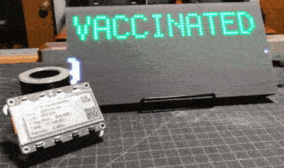
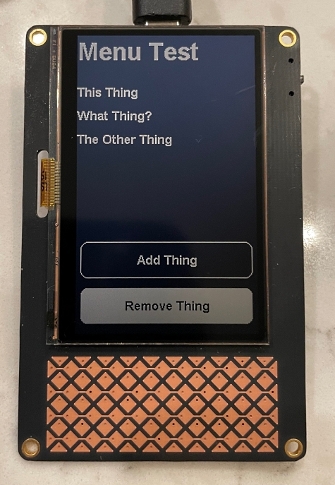
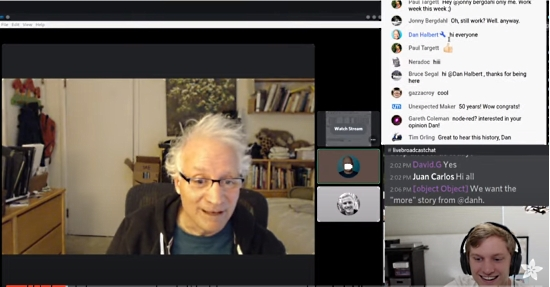
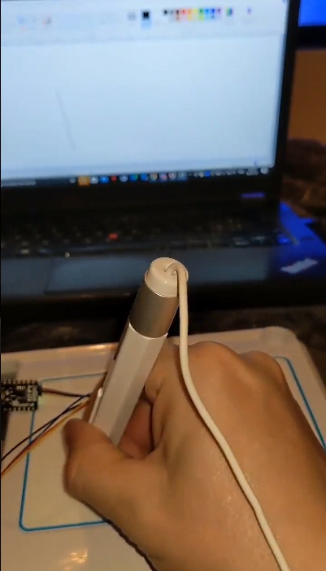
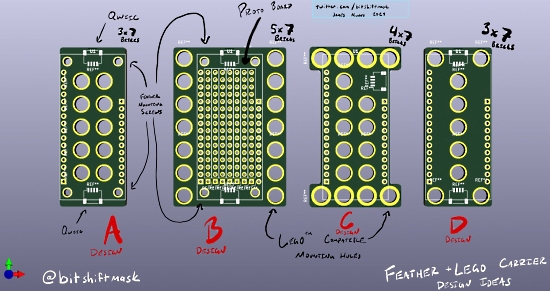
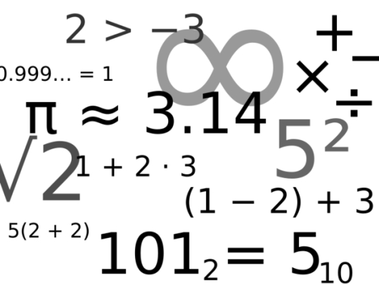
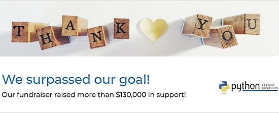
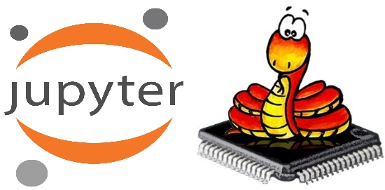
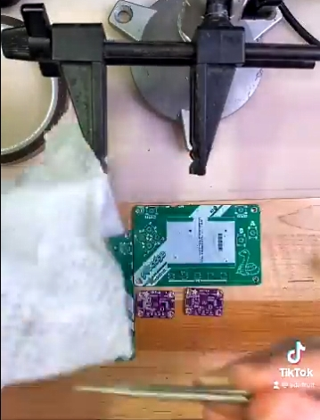
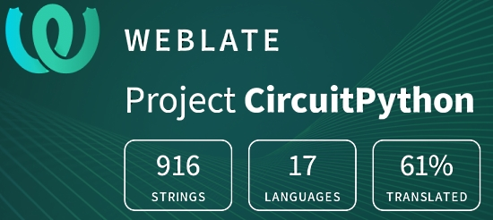

- [X] Kattni updates
- [ ] change date
- [ ] update title
- [ ] Feature story
- [ ] Update  for images
- [ ] Update ICYDNCI
- [ ] All images 550w max only
- [ ] Link "View this email in your browser."

View this email in your browser.

Inauguration Week! Here's the latest Python for Microcontrollers newsletter, brought you by the community! We're on [Discord](https://discord.gg/HYqvREz), [Twitter](https://twitter.com/search?q=circuitpython&src=typed_query&f=live), and for past newsletters - [view them all here](https://www.adafruitdaily.com/category/circuitpython/). If you're reading this on the web, [subscribe here](https://www.adafruitdaily.com/). There is a great deal in this issue, let's begin.

## Tracking COVID Vaccination Progress with CircuitPython

John Furcean builds two COVID-19 vaccination displays, coded using [CircuitPython](https://circuitpython.org/):

> I built a scrolling COVID-19 Vaccination display for both the [Adafruit MatrixPortal M4](https://learn.adafruit.com/adafruit-matrixportal-m4) and the [Adafruit MagTag](https://learn.adafruit.com/adafruit-magtag) using CircuitPython, and data from [Our World](https://covidtracking.com/) [in Data](https://ourworldindata.org/covid-vaccinations).

Our World in Data has aggregated massive data sets related to COVID-19. The vaccination data subset is available in a [GitHub repository](https://github.com/owid/covid-19-data/tree/master/public/data/vaccinations) in csv format. They post:

> Our complete COVID-19 dataset is a collection of the COVID-19 data maintained by [Our World in Data](https://ourworldindata.org/coronavirus). It is updated daily and includes data on confirmed cases, deaths, hospitalizations, and testing, as well as other variables of potential interest.

More - [furcean.com](https://furcean.com/2021/01/15/covid-19-vaccination-displays-using-circuitpython/)

## The PyCorder

Joey Castillo comes up with another beautiful large format project running CircuitPython. It features a unique capacitive touch matrix at the bottom:

> Folks: meet the PyCorder! My take on a touchpad-based Sharp Memory Display gadget, in gorgeous Oshpark After Dark. More in the coming days, but I'm feeling super stoked tonight because I finally got it up and running (and made a simple input task for circuitpyui).

More - [Twitter](https://twitter.com/josecastillo/status/1349909509376917505?s=21)

An interesting cable connection for some accessories like the [Adafruit Airlift breakout](https://www.adafruit.com/product/4201) to provide WiFi, here showing a list of upcoming SpaceX launches - [Twitter](https://twitter.com/josecastillo/status/1351180796489584641).

## 2021 Open Hardware Summit Call for Proposals

The Open Hardware Summit (OHS) invites talk proposals for the eleventh annual summit! This year’s summit is virtual and will be held online on Friday 2021-04-09, 9:00 AM – 5:30 PM EDT.

> The Open Hardware Summit is for presenting, discussing, and learning about open hardware of all kinds. The summit examines open hardware applications, practices, and theory, ranging from environmental sensors to 3D printable medical devices to open hardware processors and beyond. We are interested in open hardware on its own as well as in relation to topics such as software, design, business, law, and education. Past talks have featured topics such as advances in space propulsion, humanitarian projects, right to repair legislation, open hardware in education, and open hardware marketing. For our eleventh edition we are especially looking for speakers who can offer insights around the role of open hardware in the COVID-19 pandemic, open hardware medical devices, and related topics.

Submissions are due by Thursday 2021-02-11 at 11 PM EDT - [oshwa.org](https://2021.oshwa.org/submit-proposal/)

## CircuitPython 6.1.0-rc.1 released

CircuitPython 6.1.0-rc.1 is the second release candidate of CircuitPython 6.1.0. If no significant issues are found within a few days, we’ll release this version as stable. See more - [Adafruit Blog](https://blog.adafruit.com/2021/01/14/circuitpython-6-1-0-rc-1-released-adafruit-circuitpython/).

FIXES AND ENHANCEMENTS
* Update ulab to version 1.6.1.
* Use double-quotes in initial code.py program. 
* Add len(alarm.sleep_memory) and bool(alarm.sleep_memory).
* Add native support for msgpack.

## What if the Python REPL was like BASIC?

Scott experiments editing Python code like BASIC was edited. The idea is imagining this as the default mode on a Raspberry Pi 400. It's a mix of modern and retro - [GitHub](https://github.com/tannewt/basicpython).

This is in contrast to [QuickPYTHON](https://timothycrosley.com/project-9-qpython) which runs on old PCs.

## CircuitPython Deep Dive Stream with Scott Shawcroft

[This week](https://www.youtube.com/watch?v=M0s_LK0K1Sk&feature=youtu.be), Scott welcomes guest Dan Halbert.

You can see the latest video and past videos on the Adafruit YouTube channel under the Deep Dive playlist - [YouTube](https://www.youtube.com/playlist?list=PLjF7R1fz_OOXBHlu9msoXq2jQN4JpCk8A).

## CircuitPython 2021 Entries Continue to Come In

More CircuitPython 2021 comments are coming in every day! Here are some from the past week:

Community wrapup - [Adafruit Blog](https://blog.adafruit.com/2021/01/14/one-circuitpython2021-email-and-icymi/).

Here are some posts from the CircuitPython team:

* Scott Shawcroft, the lead CircuitPython developer - [Adafruit Blog](https://blog.adafruit.com/2021/01/15/tannewts-focus-for-circuitpython2021/).
* Dan Halbert - [Adafruit Blog](https://blog.adafruit.com/2021/01/13/dan-halbert-thoughts-for-circuitpython2021/).
* Melissa - [Adafruit Blog](https://blog.adafruit.com/2021/01/13/melissas-ideas-for-circuitpython2021-makermelissa/).

Contribute your own thoughts to the CircuitPython team - see the [kickoff post](https://blog.adafruit.com/2021/01/01/where-should-circuitpython-go-in-2021-circuitpython2021-circuitpython/) for more information.

## News from around the web!

A modular CircuitPython number pad - [Reddit CircuitPython Subreddit](https://www.reddit.com/r/circuitpython/comments/kxz4i4/i_made_a_modular_circuitpython_number_pad/).

> I made this macropad/numpad that can have any Feather-compatible board or Arduino Pro Micro as a controller. This means that you can choose if this is a wired or wireless board if you want to (there's another, slimmer battery connector on the bottom of the board). This is compatible with the 32u4 bluetooth feather if you want QMK, or you can use any Feather that runs CircuitPython.

Working on CircuitPython support for the uDraw Wii Game Tablet (uDraw for the Wii is I2C, for PS3 and XBox it's USB) - [Twitter](https://twitter.com/DavidGlaude/status/1350250736525959169).

Are you new to programming and to Python? Check out the Beginner's Guide to Python to help you get started quickly - [python.org](https://wiki.python.org/moin/BeginnersGuide) via [Twitter](https://twitter.com/ThePSF/status/1348180284286652416).

Designs for Feather format board carriers that mate with Lego blocks for quick hardware prototypes - [Twitter](https://twitter.com/bitshiftmask/status/1349794189517709319).

A battery powered California Covid vaccination tracker based on Adafruit's MagTag CircuitPython board and Ladyada's COVID Tracking project (adapted to use a state-level data source) - [Twitter](https://twitter.com/kfury/status/1350712963649269763).

Making a 30 year old SpaceOrb 360 work with retrogaming and modern gaming with Adafruit CircuitPython - [Twitter](https://twitter.com/shanselman/status/1350653474325753856).

Two new versions of ulab, a numpy-like number crunching library, have been released. These versions implements a numpy-compatible interface, and adds a couple of new functions, as well as a number of fixes for bugs while writing the manual. The change in the interface was a recurring request from the community and is meant to simplify porting of numpy code from a PC. Since CircuitPython is still using the old interface, the fixes have been backported and released as v.1.7.1. The CircuitPython-compatible version is going to stay alive on the [legacy branch](https://github.com/v923z/micropython-ulab/tree/legacy), and will receive regular updates and bug fixes until CircuitPython decides to adopt the numpy-compatible interface - [GitHub](https://github.com/v923z/micropython-ulab/tree/legacy).

The Python Software Foundation thanks the community for being an important part of their Q4 2020 fundraiser, “Rebuilding the PSF”. As of January 13, they confirm they raised more than $130,000! - [Mailchimp](https://mailchi.mp/python.org/our-psf-fundraiser-was-a-success-because-of-you).

Ever had to program a bazillion CircuitPython boards? CircuitPython Loader is a simple script that waits for a CIRCUITPY drive to appear, erases all files from it, then copies the contents of the ./CIRCUITPY folder. Requires Python 3.8+. Currently only tested and functional on macOS 10.15 Catalina - [GitHub](https://github.com/alexwhittemore/CircuitPython-Loader/) via [Twitter](https://twitter.com/alexwhittemore/status/1348834174837391362).

A simple tulle skirt with added Adafruit NeoPixels, controlled by a [Circuit Playground Express](https://www.adafruit.com/product/3333) and CircuitPython - [Twitter](https://twitter.com/sophywong/status/1350563317249503232).

Adafruit Feather M0 and GUVA-S12SD UV Sensor in MicroPython - [learnmicropython](http://www.learnmicropython.com/circuitpython/adafruit-feather-m0-and-guva-s12sd-uv-sensor-circuitpython-example.php) via [Twitter](https://twitter.com/micromikemck/status/1350435669492043777).

A microkernel for Jupyter so you can remotely run notebooks on your ESP with xPython - [GitHub](https://github.com/goatchurchprime/jupyter_micropython_kernel) via [Twitter](https://twitter.com/embedded_iot/status/1349359917958918148).

Ultimate Setup Blueprint/Boilerplate for Your Next Python Project - [GitHub](https://github.com/MartinHeinz/python-project-blueprint) and [toward data science](https://towardsdatascience.com/ultimate-setup-for-your-next-python-project-179bda8a7c2c).

Questionary is a Python library for effortlessly building pretty command line interfaces - [GitHub](https://github.com/tmbo/questionary) via [bigl.es](https://bigl.es/tuesday-tooling-questionary/).

The fastest way to turn HTML into text in Python - [peterbe.com](https://www.peterbe.com/plog/selectolax-or-pyquery) via [Twitter](https://twitter.com/PythonHub/status/1348740250907144196).

Convert workout data from Peloton into a TCX file that can be uploaded to Garmin - [GitHub](https://github.com/philosowaffle/peloton-to-garmin).

tpy, a pet Python forked from tinypy - [GitHub](https://github.com/rainwoodman/tinypy).

Video of a vintage NEC Spinwriter 3515 hammering out a novel with the help of some Python scripting - [Twitter](https://twitter.com/paulrickards/status/1297184899892469760).

pyHanko - A PDF signing toolkit for Python - [GitHub](https://github.com/MatthiasValvekens/pyHanko) via [Twitter](https://twitter.com/PythonWeekly/status/1349446252128301061).

How much memory does a Python object take in memory? - [towards data science](https://towardsdatascience.com/the-strange-size-of-python-objects-in-memory-ce87bdfbb97f).

PyDev of the Week:  Claudia Regio on [Mouse vs Python](https://www.blog.pythonlibrary.org/2021/01/18/pydev-of-the-week-claudia-regio/)

In honor of Martin Luther King Jr. Day, the Circuitpython Weekly Meeting was moved to Tuesday January 19, 2021 and the video URL was not available at press time. It will be added to the [CircuitPython Weekly Meetying playlist on YouTube](https://www.youtube.com/playlist?list=PLjF7R1fz_OOUvw7tMv45xjWp0ht8yNgg0) soon.

#ICYDNCI What was the most popular, most clicked link, in [last week's newsletter](https://www.adafruitdaily.com/2021/01/12/python-on-microcontrollers-newsletter-circuitpython-6-1-0-rc0-blinka-explained-and-more-python-adafruit-circuitpython-micropython-thepsf/)? [Wave - Realtime Web Apps and Dashboards for Python](https://github.com/h2oai/wave).

## Coming soon

An I2C volume knob + class AB amplifier for one channel of differential audio. Seems handy! You can buy the Maxim DS4420 from Digi-Key. Let's design a breakout board for it in EagleCAD - [Twitter](https://twitter.com/adafruit/status/1349927433613561858).

SHT40 Prototype Timelapse Assembly - [Twitter](https://twitter.com/adafruit/status/1350934109296668678).

LEEK! PCM1840 Quad Input Microphone I2S ADC with Hardware Pin Configuration - [Adafruit Blog](https://blog.adafruit.com/2021/01/17/leek-pcm1840-quad-input-microphone-i2s-adc-with-hardware-pin-configuration/).

## New Boards Supported by CircuitPython

The number of supported microcontrollers and Single Board Computers (SBC) grows every week. This section outlines which boards have been included in CircuitPython or added to [CircuitPython.org](https://circuitpython.org/).

This week, no new boards were added, but several are in development.

Looking to add a new board to CircuitPython? It's highly encouraged! Adafruit has four guides to help you do so:

- [How to Add a New Board to CircuitPython](https://learn.adafruit.com/how-to-add-a-new-board-to-circuitpython/overview)
- [How to add a New Board to the circuitpython.org website](https://learn.adafruit.com/how-to-add-a-new-board-to-the-circuitpython-org-website)
- [Adding a Single Board Computer to PlatformDetect for Blinka](https://learn.adafruit.com/adding-a-single-board-computer-to-platformdetect-for-blinka)
- [Adding a Single Board Computer to Blinka](https://learn.adafruit.com/adding-a-single-board-computer-to-blinka)

## New Learn Guides!

[PyPortal Google Calendar Event Display](https://learn.adafruit.com/pyportal-google-calendar-event-display) from [Brent Rubell](https://learn.adafruit.com/users/brubell)

[Adafruit Wii Nunchuck Breakout Adapter](https://learn.adafruit.com/adafruit-wii-nunchuck-breakout-adapter) from [Kattni](https://learn.adafruit.com/users/kattni)

[MagTag Dishwasher Status](https://learn.adafruit.com/magtag-dishwasher-status) from [Carter Nelson](https://learn.adafruit.com/users/caternuson)

## CircuitPython Libraries!

CircuitPython support for hardware continues to grow. We are adding support for new sensors and breakouts all the time, as well as improving on the drivers we already have. As we add more libraries and update current ones, you can keep up with all the changes right here!

For the latest libraries, download the [Adafruit CircuitPython Library Bundle](https://circuitpython.org/libraries). For the latest community contributed libraries, download the [CircuitPython Community Bundle](https://github.com/adafruit/CircuitPython_Community_Bundle/releases).

If you'd like to contribute, CircuitPython libraries are a great place to start. Have an idea for a new driver? File an issue on [CircuitPython](https://github.com/adafruit/circuitpython/issues)! Have you written a library you'd like to make available? Submit it to the [CircuitPython Community Bundle](https://github.com/adafruit/CircuitPython_Community_Bundle). Interested in helping with current libraries? Check out the [CircuitPython.org Contributing page](https://circuitpython.org/contributing). We've included open pull requests and issues from the libraries, and details about repo-level issues that need to be addressed. We have a guide on [contributing to CircuitPython with Git and Github](https://learn.adafruit.com/contribute-to-circuitpython-with-git-and-github) if you need help getting started. You can also find us in the #circuitpython channel on the [Adafruit Discord](https://adafru.it/discord).

You can check out this [list of all the Adafruit CircuitPython libraries and drivers available](https://github.com/adafruit/Adafruit_CircuitPython_Bundle/blob/master/circuitpython_library_list.md). 

The current number of CircuitPython libraries is **291**!

**New Libraries!**

Here's this week's new CircuitPython libraries:

 * [Adafruit_CircuitPython_OAuth2](https://github.com/adafruit/Adafruit_CircuitPython_OAuth2)

**Updated Libraries!**

Here's this week's updated CircuitPython libraries:
 * [Adafruit_CircuitPython_LC709203F](https://github.com/adafruit/Adafruit_CircuitPython_LC709203F)
 * [Adafruit_CircuitPython_TMP117](https://github.com/adafruit/Adafruit_CircuitPython_TMP117)
 * [Adafruit_CircuitPython_AS7341](https://github.com/adafruit/Adafruit_CircuitPython_AS7341)
 * [Adafruit_CircuitPython_NeoPixel](https://github.com/adafruit/Adafruit_CircuitPython_NeoPixel)
 * [Adafruit_CircuitPython_BLE_BroadcastNet](https://github.com/adafruit/Adafruit_CircuitPython_BLE_BroadcastNet)
 * [Adafruit_CircuitPython_BusDevice](https://github.com/adafruit/Adafruit_CircuitPython_BusDevice)
 * [Adafruit_CircuitPython_ADS1x15](https://github.com/adafruit/Adafruit_CircuitPython_ADS1x15)
 * [Adafruit_CircuitPython_Display_Text](https://github.com/adafruit/Adafruit_CircuitPython_Display_Text)
 * [Adafruit_CircuitPython_PortalBase](https://github.com/adafruit/Adafruit_CircuitPython_PortalBase)
 * [Adafruit_CircuitPython_PyPortal](https://github.com/adafruit/Adafruit_CircuitPython_PyPortal)
 * [Adafruit_CircuitPython_RockBlock](https://github.com/adafruit/Adafruit_CircuitPython_RockBlock)
 * [CircuitPython_Community_Bundle](https://github.com/adafruit/CircuitPython_Community_Bundle)

## What’s the team up to this week?

What is the team up to this week? Let’s check in!

**Dan**

In the past week I fixed many bugs in preparation for 6.1.0-rc.1, including two bugs related to time.sleep(), an AnalogOut bug on SAMD51, a SAMD PWMOut bug, and some fixes for BLE timing values. I have some other fixes in the works but will probably hold them for a 6.1.1 release so we can get 6.1.0 final out the door.

I've also been experimenting with very inexpensive Bluetooth thermometer/hygrometers from Xiaomi. I can connect to them and get data, and it's also possible to install unofficial custom firmware that adds many features.

**Jeff**

After many delays, the main branch now supports I2S audio output on the ESP32-S2. In this quick demo from Show & Tell, you can press one of the 4 buttons on this e-ink display to play the associated wave file.

**Kattni**

This week I did some general guide work, including fixing up a couple of guides that had minor issues. One needed a different schematic and fab print, and another needed an extra Fritzing diagram.

I worked with Dylan on getting the majority of libraries updated to using the latest Black. There were a couple of updates to the templates we use for creating libraries that needed to be applied to all libraries before they were added to the templates, so Dylan did that in the same process. This ended up involving manually adding new license formatting to all of the existing libraries, and therefore PRs for all of them. We're still working through this project, but so far we're over halfway through.

**Lucian**

This week I've been ironing out the issues with the server bindings of the Socket layer, specifically by the receive, accept and connect functions non-blocking (so they don't make Circuitpython hang as they run). I've been implementing new timeout features across the API and adding the corresponding error codes, as well as making sure that functions like recv_into and send can be used across various different kinds of sockets.

I've also been part of an ongoing investigation into why the ESP32-S2 has different AnalogOut behavior from the ESP32. I'd gotten some pointers from Espressif late last year, but as more people have encountered the problem it's become clear that things are still confusing. I'm hoping to get more info from them on the specific differences between the two chip lines, and the intent behind the calibration differences I've seen in the IDF code.

**Melissa**

This past week I worked with Jeff to get a workaround in place for an issue that came up with a recent kernel release for the Raspberry Pi which resulted in a garbled screen. The workaround will basically roll back the kernel to an older version before the issue came up.

I also finished a big project of getting the PyPortal refactored to use PortalBase and kept full backwards compatibility with the previous library. This is a project that I had started before the holiday break and I had to come up with some workarounds that I was getting stuck on. I ended up refactoring PortalBase slightly to make it easier, but in a way that I didn't need to go back and update the MagTag and MatrixPortal libraries.

The other thing I did was I ported all of the WebSerial and WebBluetooth work from glitch over to GitHub pages. The repositories were all set up already, so this mostly involved enabling GitHub pages on each repo and updating the paths, though I did run into one issue where the CSS was missing. Copying it from glitch and uploading it to GitHub fixed that issue.

**Scott**

This week I've been keeping up with all of the pull request reviews and support for CircuitPython. So, lots of odds and ends.

I did my first stream of the year where we went and looked back at past CircuitPython annual plans. See [the stream here](https://www.youtube.com/watch?v=Lh7umSOoMqo). I'll be drafting my own post this week!

## Upcoming events!

Australia’s grassroots Free and Open Source technologies conference linux.conf.au is scheduled for January 23-25 2021 online/worldwide. Limor "Ladyada" Fried, electrical engineer and founder of Adafruit, will be one of their keynote speakers. In her keynote, Limor will discuss how Python is snaking its way into hardware, Linux single board computers and more. 

The schedule and tickets are available at [lca2021.linux.org.au](https://lca2021.linux.org.au/) - [Announcement](https://lca2021.linux.org.au/news/keynote-limor-fried/).

A free virtual "Girls Into Coding " event via Zoom on Sunday, 31 January 2021 - Choose 1 of 5 exciting workshops. There will also be lightning talks to inspire & encourage girls aged 10 -14 to get involved in tech - [Eventbrite](https://www.eventbrite.co.uk/e/virtual-girls-into-coding-8-join-us-get-involved-tickets-135837302027).

FOSDEM is a free and non-commercial event organised by the community for the community. Typically hosted in Brussels, Belgium, FOSDEM 2021 is taking place online February 6-7, 2021. This year, there will be a Python Developer Room. Details - [Adafruit Blog](https://blog.adafruit.com/2020/12/08/fosdem-2021-python-developer-room-python/).

PyCascades is a regional PyCon in the Pacific Northwest, celebrating the west coast Python developer and user community. Held online February 19th — 21st, 2021 - [PyCascades](https://2021.pycascades.com/).

The 2021 Open Hardware summit will be held online, Friday April 9, 2021. The summit will be livestreamed, but ticket holders will have access to additional interactive portions of the summit like meet-and-greets, workshops, and sponsor booths. Find details, including ticket and sponsorship information at [2021.oshwa.org](https://2021.oshwa.org/) - [OSHWA](https://www.oshwa.org/2020/11/16/announcing-the-2021-open-hardware-summit/).

PyCon US, the annual official annual Python gathering, has been announced to be held online May 12-15, 2021. Sprints will be held May 16-18, 2021. More information and signups at [https://us.pycon.org/2021/](https://us.pycon.org/2021/)

**Send Your Events In**

As for other events, with the COVID pandemic, most in-person events are postponed or cancelled. If you know of virtual events or events that may occur in the future, please let us know on Discord or on Twitter with hashtag #CircuitPython.

## Latest releases

CircuitPython's stable release is [6.0.1](https://github.com/adafruit/circuitpython/releases/latest) and its unstable release is [6.1.0-rc.1](https://github.com/adafruit/circuitpython/releases). New to CircuitPython? Start with our [Welcome to CircuitPython Guide](https://learn.adafruit.com/welcome-to-circuitpython).

[20210118](https://github.com/adafruit/Adafruit_CircuitPython_Bundle/releases/latest) is the latest CircuitPython library bundle.

[v1.13](https://micropython.org/download) is the latest MicroPython release. Documentation for it is [here](http://docs.micropython.org/en/latest/pyboard/).

[3.9.1](https://www.python.org/downloads/) is the latest Python release. The latest pre-release version is [3.10.0a4](https://www.python.org/download/pre-releases/).

[1990 Stars](https://github.com/adafruit/circuitpython/stargazers) Like CircuitPython? [Star it on GitHub!](https://github.com/adafruit/circuitpython)

## Call for help -- Translating CircuitPython is now easier than ever!

One important feature of CircuitPython is translated control and error messages.

With the help of fellow open source project [Weblate](https://weblate.org/), we're making it even easier to add or improve translations.

Sign in with an existing account such as Github, Google or Facebook and start contributing through a simple web interface. No forks or pull requests needed!

As always, if you run into trouble join us on [Discord](https://adafru.it/discord), we're here to help.

## jobs.adafruit.com - Find a dream job, find great candidates!

[jobs.adafruit.com](https://jobs.adafruit.com/) has returned and folks are posting their skills (including CircuitPython) and companies are looking for talented makers to join their companies - from Digi-Key, to Hackaday, Microcenter, Raspberry Pi and more.

**Job of the Week**

Executive Director Open Source Initiative (OSI) - [Adafruit Jobs Board](https://jobs.adafruit.com/job/executive-director/).

> The Executive Director will work with the board to build a bridge to a stronger future for OSI and the open source ecosystem. The candidate will set strategic direction and move the Open Source Initiative towards our vision, working with the staff and community to achieve measurable program outcomes. This role is ideal for the experienced executive director who can take organizations to the next level. The candidate can set strategy and translate it into programmatic results, achieved through organizational leadership and operational excellence. Additionally, they have a strong understanding of open source culture and norms as well as the Open Source Initiative’s mission and programs.  Plus, the candidate excels at managing ambiguity and drives for clarity and impact.

## 26,703 thanks!

The Adafruit Discord community, where we do all our CircuitPython development in the open, reached over 26,703 humans, thank you!  Adafruit believes Discord offers a unique way for CircuitPython folks to connect. Join today at [https://adafru.it/discord](https://adafru.it/discord).

## ICYMI - In case you missed it

The wonderful world of Python on hardware! This is our Python video-newsletter-podcast! The news comes from the Python community, Discord, Adafruit communities and more and is reviewed on ASK an ENGINEER Wednesdays. The complete Python on Hardware weekly videocast [playlist is here](https://www.youtube.com/playlist?list=PLjF7R1fz_OOXRMjM7Sm0J2Xt6H81TdDev). 

This video podcast is on [iTunes](https://itunes.apple.com/us/podcast/python-on-hardware/id1451685192?mt=2), [YouTube](http://adafru.it/pohepisodes), [IGTV (Instagram TV](https://www.instagram.com/adafruit/channel/)), and [XML](https://itunes.apple.com/us/podcast/python-on-hardware/id1451685192?mt=2).

[Weekly community chat on Adafruit Discord server CircuitPython channel - Audio / Podcast edition](https://itunes.apple.com/us/podcast/circuitpython-weekly-meeting/id1451685016) - Audio from the Discord chat space for CircuitPython, meetings are usually Mondays at 2pm ET, this is the audio version on [iTunes](https://itunes.apple.com/us/podcast/circuitpython-weekly-meeting/id1451685016), Pocket Casts, [Spotify](https://adafru.it/spotify), and [XML feed](https://adafruit-podcasts.s3.amazonaws.com/circuitpython_weekly_meeting/audio-podcast.xml).

And lastly, we are working up a one-spot destination for all things podcast-able here - [podcasts.adafruit.com](https://podcasts.adafruit.com/)

## Codecademy "Learn Hardware Programming with CircuitPython"

Codecademy, an online interactive learning platform used by more than 45 million people, has teamed up with the leading manufacturer in STEAM electronics, Adafruit Industries, to create a coding course, "Learn Hardware Programming with CircuitPython". The course is now available in the [Codecademy catalog](https://www.codecademy.com/learn/learn-circuitpython?utm_source=adafruit&utm_medium=partners&utm_campaign=circuitplayground&utm_content=pythononhardwarenewsletter).

Python is a highly versatile, easy to learn programming language that a wide range of people, from visual effects artists in Hollywood to mission control at NASA, use to quickly solve problems. But you don’t need to be a rocket scientist to accomplish amazing things with it. This new course introduces programmers to Python by way of a microcontroller — CircuitPython — which is a Python-based programming language optimized for use on hardware.

CircuitPython’s hardware-ready design makes it easier than ever to program a variety of single-board computers, and this course gets you from no experience to working prototype faster than ever before. Codecademy’s interactive learning environment, combined with Adafruit's highly rated Circuit Playground Express, present aspiring hardware hackers with a never-before-seen opportunity to learn hardware programming seamlessly online.

Whether for those who are new to programming, or for those who want to expand their skill set to include physical computing, this course will have students getting familiar with Python and creating incredible projects along the way. By the end, students will have built their own bike lights, drum machine, and even a moisture detector that can tell when it's time to water a plant.

Visit Codecademy to access the [Learn Hardware Programming with CircuitPython](https://www.codecademy.com/learn/learn-circuitpython?utm_source=adafruit&utm_medium=partners&utm_campaign=circuitplayground&utm_content=pythononhardwarenewsletter) course and Adafruit to purchase a [Circuit Playground Express](https://www.adafruit.com/product/3333).

Codecademy has helped more than 45 million people around the world upgrade their careers with technology skills. The company’s online interactive learning platform is widely recognized for providing an accessible, flexible, and engaging experience for beginners and experienced programmers alike. Codecademy has raised a total of $43 million from investors including Union Square Ventures, Kleiner Perkins, Index Ventures, Thrive Capital, Naspers, Yuri Milner and Richard Branson, most recently raising its $30 million Series C in July 2016.

## Contribute!

The CircuitPython Weekly Newsletter is a CircuitPython community-run newsletter emailed every Tuesday. The complete [archives are here](https://www.adafruitdaily.com/category/circuitpython/). It highlights the latest CircuitPython related news from around the web including Python and MicroPython developments. To contribute, edit next week's draft [on GitHub](https://github.com/adafruit/circuitpython-weekly-newsletter/tree/gh-pages/_drafts) and [submit a pull request](https://help.github.com/articles/editing-files-in-your-repository/) with the changes. You may also tag your information on Twitter with #CircuitPython. 

Join our [Discord](https://adafru.it/discord) or [post to the forum](https://forums.adafruit.com/viewforum.php?f=60) for any further questions.
