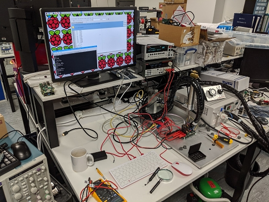
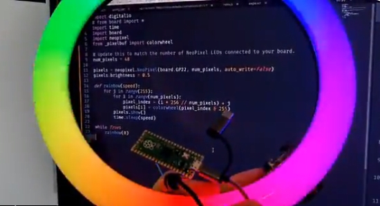
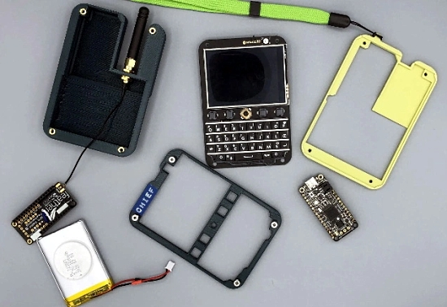
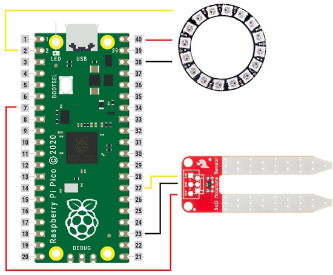
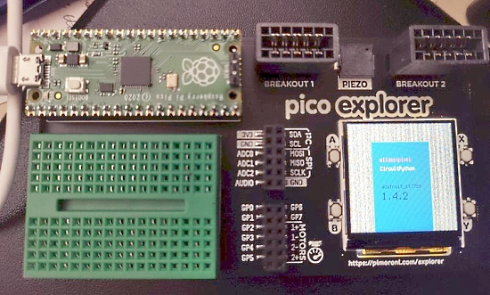
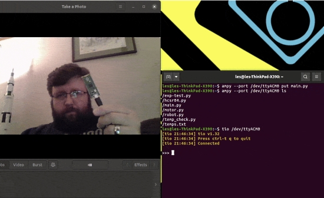
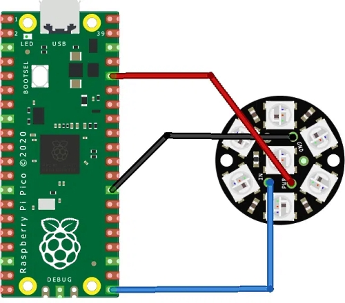
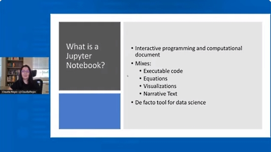
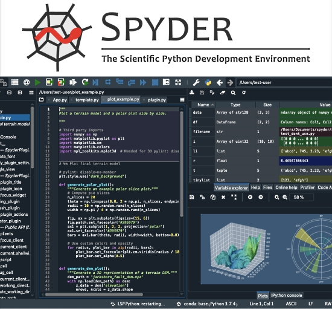

- [X] Kattni updates
- [ ] change date
- [ ] update title
- [ ] Feature story
- [ ] Update  for images
- [ ] Update ICYDNCI
- [ ] All images 550w max only
- [ ] Link "View this email in your browser."

News Sources

- [python.org](https://www.python.org/)
- [Python Insider - dev team blog](https://pythoninsider.blogspot.com/)

View this email in your browser.

Hi everyone! Here's the latest Python for Microcontrollers newsletter, brought you by the community! We're on [Discord](https://discord.gg/HYqvREz), [Twitter](https://twitter.com/search?q=circuitpython&src=typed_query&f=live), and for past newsletters - [view them all here](https://www.adafruitdaily.com/category/circuitpython/). If you're reading this on the web, [subscribe here](https://www.adafruitdaily.com/). Let's get started!

## Discussions on the Raspberry Pi Pico Board and RP2040 Chip from the Designers

Raspberry Pi RP2040: Our Microcontroller for the Masses - Raspberry Pi COO James Adams talks us through the company’s first custom Arm chip, designed in-house with Arm Flexible Access and now at the heart of the Raspberry Pi Pico - [arm](https://www.arm.com/blogs/blueprint/raspberry-pi-rp2040)

Software Engineer Liam Fraser discusses the journey to Raspberry Silicon and the design process for the RP2040 chip - [Raspberry Pi Blog](https://www.raspberrypi.org/blog/the-journey-to-raspberry-silicon/).

Innovation Coffee - Raspberry Pi Pico Special by Arm Software Developers - [YouTube](https://www.youtube.com/watch?v=vAkpm6rE6pk)

> A conversation with the Raspberry Pi CPO, Gordon Hollingworth, and Hardware Engineer, Luke Wren. Gordon, Raspberry Pi employee number 1, shares some interesting anecdotes of his time at Raspberry Pi, and Luke walks through the hardware development for the new Raspberry Pi Pico!

The Amp Hour Podcast - Embedded Hardware with the Raspberry Pi Team - [theamphour](https://theamphour.com/529-embedded-hardware-with-the-raspberry-pi-team/).

## The January 2021 Melbourne MicroPython Meetup Featuring Damien George

The January 2021 Melbourne MicroPython Meetup has posted their January videos - Matt Trentini provides a news update and the key speaker is Damien George talking about the MicroPython port for the Raspberry Pi Pico - [Melbourne MicroPython Meetup](https://melbournemicropythonmeetup.github.io/January-2021-Meetup/)

## Display a Raspberry Pi Pico overlay in Adafruit AR

Display a Raspberry Pi Pico overlay in Adafruit AR - [Adafruit Blog](https://blog.adafruit.com/2021/02/05/display-raspberry-pi-pico-overlay-in-adafruit-ar-update-ios-raspberrypi-ar/)

> A new feature in the Adafruit iOS AR app. If you have a Raspberry Pi Pico, you can now scan the board with Adafruit AR’s board scanner to display a pinout and power pin overlay. Adafruit AR is using image tracking to locate the Raspberry Pi Pico board, then it displays an pinout diagram overlay. Now you are able to see your pinouts even if your Raspberry Pi Pico board is on a breadboard!

## Feature Article

text - [site](url)

## CircuitPython Deep Dive Stream with Scott Shawcroft

[This week](link), Scott streams his work on .

You can see the latest video and past videos on the Adafruit YouTube channel under the Deep Dive playlist - [YouTube](https://www.youtube.com/playlist?list=PLjF7R1fz_OOXBHlu9msoXq2jQN4JpCk8A).

## News from around the web!

Hands on with the Raspberry Pi Pico and CircuitPython - [tinyletter](https://tinyletter.com/jamesbowman/letters/hands-on-with-the-raspberry-pi-pico).

> CircuitPython performance is pretty good, but a little below the speed of the Adafruit M4, which is a similarly-clocked Cortex M4.  The Cortex M0 has no floating-point, so has to do software floating-point.

Use Adafruit’s CircuitPython on the Raspberry Pi Pico: details, pros and cons - [Recantha.co.uk](https://www.recantha.co.uk/blog/?p=20803).

Hacking Alibaba RGB "beauty" ring lights: SK6812 + White Rings, using a redesigned controller with a Raspberry Pi Pico and CircuitPython - [Twitter Thread](https://twitter.com/timonsku/status/1357681117395103746).

A LoRa messenger in a BlackBerry form factor with a Feather and CircuitPython - [hackaday](https://hackaday.com/2021/02/05/lora-messenger-does-its-best-blackberry-impression/) and [MSG](https://msglab.co/room/lo-ra-msg).

A Raspberry Pi Pico Soil Moisture Indicator with CircuitPython - [Andy Warburton](https://andywarburton.co.uk/raspberry-pi-pico-soil-moisture-sensor/).

Use the screen on the Pimoroni Pico Explorer with CircuitPython - [Twitter](https://twitter.com/recantha/status/1358405436781821952) and [GitHub](https://gist.github.com/wildestpixel/a5c2b046d9d5c3002fa5a87608831ac2).

Using Tio and Ampy with a Raspberry Pi Pico - [bigl.es](https://bigl.es/tuesday-tooling-pico-mix/).

A Raspberry Pi Pico Emulates a Nintendo NES Console - [Toms Hardware](https://www.tomshardware.com/news/raspberry-pi-pico-emulates-nintendo) via [Twitter](https://twitter.com/biglesp/status/1356653653533351943).

Musical note generation using the PIO state machine on the Raspberry Pi Pico using MicroPython. - [Twitter](https://twitter.com/Wee_Grumphie/status/1358710898622402561).

Live-coding Raspberry Pi Pico Emulator - [hackaday.io](https://hackaday.io/project/177082-raspberry-pi-pico-emulator) and [YouTube](https://www.youtube.com/watch?v=BClDzCPWSME&feature=youtu.be).

Also the first disassembler for Raspberry Pi Pico - [GitHub](https://github.com/pyTony/rp2040).

Blinky! A Raspberry Pi Pico with a Pimoroni RGB keypad programmed in MicroPython - [Twitter](https://twitter.com/biglesp/status/1358767606120017920).

Blonk a NeoPixel Jewel in MicroPython on a Raspberry Pi Pico - [pibits.net](http://www.pibits.net/code/raspberry-pi-pico-and-neopixel-example-in-micropython.php).

Happy Chinese New Year, Dune style, with CircuitPython and dragons - [Twitter](https://twitter.com/caitlinsdad/status/1358509396519776261).

text - [site](url).

text - [site](url).

Guido van Rossum posts on Twitter that (Jupyter) Notebooks in VS Code have been revamped - [YouTube](https://www.youtube.com/watch?v=g5EykzAsCC0) via [Twitter](https://twitter.com/gvanrossum/status/1357188737277460481).

Spyder - the free and open source scientific Python development environment - [Spyder](https://www.spyder-ide.org/).

BitmapFonts - an enormous collection of bitmapped characters for use in spritemap fonts - [GitHub](https://github.com/ianhan/BitmapFonts).

Mini Zork: A functional adventure game in lisp - [GitHub](https://github.com/naver/lispe/wiki/8.-Mini-Zork:-A-functional-adventure).

**#ICYDNCI What was the most popular, most clicked link, in [last week's newsletter](https://link)? [title](url).**

## Coming soon

text - [site](url).

## New Boards Supported by CircuitPython

The number of supported microcontrollers and Single Board Computers (SBC) grows every week. This section outlines which boards have been included in CircuitPython or added to [CircuitPython.org](https://circuitpython.org/).

This week we had X new boards added!

- [Board name](url)

Looking to add a new board to CircuitPython? It's highly encouraged! Adafruit has four guides to help you do so:

- [How to Add a New Board to CircuitPython](https://learn.adafruit.com/how-to-add-a-new-board-to-circuitpython/overview)
- [How to add a New Board to the circuitpython.org website](https://learn.adafruit.com/how-to-add-a-new-board-to-the-circuitpython-org-website)
- [Adding a Single Board Computer to PlatformDetect for Blinka](https://learn.adafruit.com/adding-a-single-board-computer-to-platformdetect-for-blinka)
- [Adding a Single Board Computer to Blinka](https://learn.adafruit.com/adding-a-single-board-computer-to-blinka)

## New Learn Guides!

[Infinity Mirror Collar](https://learn.adafruit.com/infinity-mirror-collar) from [Debra Ansell](https://learn.adafruit.com/users/GeekMomProjects)

[RGB Matrix Portal Room CO2 Monitor](https://learn.adafruit.com/matrix-portal-room-co2-monitor) from [Carter Nelson](https://learn.adafruit.com/users/caternuson)

[Temperature and Humidity Sensing in Home Assistant with CircuitPython](https://learn.adafruit.com/temperature-and-humidity-sensing-in-home-assistant-with-circuitpython) from [Melissa LeBlanc-Williams](https://learn.adafruit.com/users/MakerMelissa)

[No-Solder Visualizer Capacitive Touch Controller](https://learn.adafruit.com/no-solder-visualizer-capacitive-touch-controller) from [John Park](https://learn.adafruit.com/users/johnpark)

[Adafruit SPI Flash SD Card](https://learn.adafruit.com/adafruit-spi-flash-sd-card) from [Kattni](https://learn.adafruit.com/users/kattni)

## CircuitPython Libraries!

CircuitPython support for hardware continues to grow. We are adding support for new sensors and breakouts all the time, as well as improving on the drivers we already have. As we add more libraries and update current ones, you can keep up with all the changes right here!

For the latest libraries, download the [Adafruit CircuitPython Library Bundle](https://circuitpython.org/libraries). For the latest community contributed libraries, download the [CircuitPython Community Bundle](https://github.com/adafruit/CircuitPython_Community_Bundle/releases).

If you'd like to contribute, CircuitPython libraries are a great place to start. Have an idea for a new driver? File an issue on [CircuitPython](https://github.com/adafruit/circuitpython/issues)! Have you written a library you'd like to make available? Submit it to the [CircuitPython Community Bundle](https://github.com/adafruit/CircuitPython_Community_Bundle). Interested in helping with current libraries? Check out the [CircuitPython.org Contributing page](https://circuitpython.org/contributing). We've included open pull requests and issues from the libraries, and details about repo-level issues that need to be addressed. We have a guide on [contributing to CircuitPython with Git and Github](https://learn.adafruit.com/contribute-to-circuitpython-with-git-and-github) if you need help getting started. You can also find us in the #circuitpython channel on the [Adafruit Discord](https://adafru.it/discord).

You can check out this [list of all the Adafruit CircuitPython libraries and drivers available](https://github.com/adafruit/Adafruit_CircuitPython_Bundle/blob/master/circuitpython_library_list.md). 

The current number of CircuitPython libraries is **297**!

**New Libraries!**

Here's this week's new CircuitPython libraries:

 * [Adafruit_CircuitPython_datetime](https://github.com/adafruit/Adafruit_CircuitPython_datetime)
 * [Adafruit_CircuitPython_SimpleMath](https://github.com/adafruit/Adafruit_CircuitPython_SimpleMath)

**Updated Libraries!**

Here's this week's updated CircuitPython libraries:

 * [Adafruit_CircuitPython_LSM303DLH_Mag](https://github.com/adafruit/Adafruit_CircuitPython_LSM303DLH_Mag)
 * [Adafruit_CircuitPython_SimpleIO](https://github.com/adafruit/Adafruit_CircuitPython_SimpleIO)
 * [Adafruit_CircuitPython_Requests](https://github.com/adafruit/Adafruit_CircuitPython_Requests)
 * [Adafruit_CircuitPython_Wiznet5k](https://github.com/adafruit/Adafruit_CircuitPython_Wiznet5k)
 * [Adafruit_CircuitPython_SCD30](https://github.com/adafruit/Adafruit_CircuitPython_SCD30)
 * [Adafruit_CircuitPython_Slideshow](https://github.com/adafruit/Adafruit_CircuitPython_Slideshow)
 * [Adafruit_CircuitPython_seesaw](https://github.com/adafruit/Adafruit_CircuitPython_seesaw)
 * [Adafruit_CircuitPython_MPR121](https://github.com/adafruit/Adafruit_CircuitPython_MPR121)
 * [Adafruit_CircuitPython_Motor](https://github.com/adafruit/Adafruit_CircuitPython_Motor)
 * [Adafruit_CircuitPython_IRRemote](https://github.com/adafruit/Adafruit_CircuitPython_IRRemote)
 * [Adafruit_CircuitPython_AVRprog](https://github.com/adafruit/Adafruit_CircuitPython_AVRprog)
 * [Adafruit_CircuitPython_AdafruitIO](https://github.com/adafruit/Adafruit_CircuitPython_AdafruitIO)
 * [Adafruit_CircuitPython_RFM9x](https://github.com/adafruit/Adafruit_CircuitPython_RFM9x)
 * [Adafruit_CircuitPython_CharLCD](https://github.com/adafruit/Adafruit_CircuitPython_CharLCD)
 * [Adafruit_CircuitPython_CircuitPlayground](https://github.com/adafruit/Adafruit_CircuitPython_CircuitPlayground)
 * [Adafruit_CircuitPython_Nunchuk](https://github.com/adafruit/Adafruit_CircuitPython_Nunchuk)
 * [Adafruit_CircuitPython_Display_Button](https://github.com/adafruit/Adafruit_CircuitPython_Display_Button)
 * [Adafruit_CircuitPython_BitbangIO](https://github.com/adafruit/Adafruit_CircuitPython_BitbangIO)
 * [Adafruit_CircuitPython_MatrixPortal](https://github.com/adafruit/Adafruit_CircuitPython_MatrixPortal)
 * [Adafruit_CircuitPython_PIOASM](https://github.com/adafruit/Adafruit_CircuitPython_PIOASM)
 * [Adafruit_CircuitPython_Display_Text](https://github.com/adafruit/Adafruit_CircuitPython_Display_Text)
 * [Adafruit_Blinka](https://github.com/adafruit/Adafruit_Blinka)
 * [Adafruit_Blinka_bleio](https://github.com/adafruit/Adafruit_Blinka_bleio)
 * [CircuitPython_Community_Bundle](https://github.com/adafruit/CircuitPython_Community_Bundle)

## What’s the team up to this week?

What is the team up to this week? Let’s check in!

**Bryan**

text

**Dan**

text

**Jeff**

text

**Kattni**

text

**Lucian**

text

**Melissa**

text

**Scott**

text

## Upcoming events!

PyCascades is a regional PyCon in the Pacific Northwest, celebrating the west coast Python developer and user community. Held online February 19th — 21st, 2021 - [PyCascades](https://2021.pycascades.com/).

The 2021 Open Hardware summit will be held online, Friday April 9, 2021. The summit will be livestreamed, but ticket holders will have access to additional interactive portions of the summit like meet-and-greets, workshops, and sponsor booths. Find details, including ticket and sponsorship information at [2021.oshwa.org](https://2021.oshwa.org/) - [OSHWA](https://www.oshwa.org/2020/11/16/announcing-the-2021-open-hardware-summit/).

The online GeoPython conference is focused on Python and Geo, its toolkits and applications. April 22-23, 2021 - [https://2021.geopython.net/](https://2021.geopython.net/).

PyCon US, the annual official annual Python gathering, has been announced to be held online May 12-15, 2021. Sprints will be held May 16-18, 2021. More information and signups at [https://us.pycon.org/2021/](https://us.pycon.org/2021/)

**Send Your Events In**

As for other events, with the COVID pandemic, most in-person events are postponed or cancelled. If you know of virtual events or events that may occur in the future, please let us know on Discord or on Twitter with hashtag #CircuitPython.

## Latest releases

CircuitPython's stable release is [#.#.#](https://github.com/adafruit/circuitpython/releases/latest) and its unstable release is [#.#.#-##.#](https://github.com/adafruit/circuitpython/releases). New to CircuitPython? Start with our [Welcome to CircuitPython Guide](https://learn.adafruit.com/welcome-to-circuitpython).

[2021####](https://github.com/adafruit/Adafruit_CircuitPython_Bundle/releases/latest) is the latest CircuitPython library bundle.

[v#.#.#](https://micropython.org/download) is the latest MicroPython release. Documentation for it is [here](http://docs.micropython.org/en/latest/pyboard/).

[#.#.#](https://www.python.org/downloads/) is the latest Python release. The latest pre-release version is [#.#.#](https://www.python.org/download/pre-releases/).

[2270 Stars](https://github.com/adafruit/circuitpython/stargazers) Like CircuitPython? [Star it on GitHub!](https://github.com/adafruit/circuitpython)

## Call for help -- Translating CircuitPython is now easier than ever!

One important feature of CircuitPython is translated control and error messages.

With the help of fellow open source project [Weblate](https://weblate.org/), we're making it even easier to add or improve translations.

Sign in with an existing account such as Github, Google or Facebook and start contributing through a simple web interface. No forks or pull requests needed!

As always, if you run into trouble join us on [Discord](https://adafru.it/discord), we're here to help.

## jobs.adafruit.com - Find a dream job, find great candidates!

[jobs.adafruit.com](https://jobs.adafruit.com/) has returned and folks are posting their skills (including CircuitPython) and companies are looking for talented makers to join their companies - from Digi-Key, to Hackaday, Microcenter, Raspberry Pi and more.

**Job of the Week**

text - [Adafruit Jobs Board](https://jobs.adafruit.com/).

## NUMBER thanks!

The Adafruit Discord community, where we do all our CircuitPython development in the open, reached over NUMBER humans, thank you!  Adafruit believes Discord offers a unique way for CircuitPython folks to connect. Join today at [https://adafru.it/discord](https://adafru.it/discord).

## ICYMI - In case you missed it

The wonderful world of Python on hardware! This is our Python video-newsletter-podcast! The news comes from the Python community, Discord, Adafruit communities and more and is reviewed on ASK an ENGINEER Wednesdays. The complete Python on Hardware weekly videocast [playlist is here](https://www.youtube.com/playlist?list=PLjF7R1fz_OOXRMjM7Sm0J2Xt6H81TdDev). 

This video podcast is on [iTunes](https://itunes.apple.com/us/podcast/python-on-hardware/id1451685192?mt=2), [YouTube](http://adafru.it/pohepisodes), [IGTV (Instagram TV](https://www.instagram.com/adafruit/channel/)), and [XML](https://itunes.apple.com/us/podcast/python-on-hardware/id1451685192?mt=2).

[Weekly community chat on Adafruit Discord server CircuitPython channel - Audio / Podcast edition](https://itunes.apple.com/us/podcast/circuitpython-weekly-meeting/id1451685016) - Audio from the Discord chat space for CircuitPython, meetings are usually Mondays at 2pm ET, this is the audio version on [iTunes](https://itunes.apple.com/us/podcast/circuitpython-weekly-meeting/id1451685016), Pocket Casts, [Spotify](https://adafru.it/spotify), and [XML feed](https://adafruit-podcasts.s3.amazonaws.com/circuitpython_weekly_meeting/audio-podcast.xml).

And lastly, we are working up a one-spot destination for all things podcast-able here - [podcasts.adafruit.com](https://podcasts.adafruit.com/)

## Codecademy "Learn Hardware Programming with CircuitPython"

Codecademy, an online interactive learning platform used by more than 45 million people, has teamed up with the leading manufacturer in STEAM electronics, Adafruit Industries, to create a coding course, "Learn Hardware Programming with CircuitPython". The course is now available in the [Codecademy catalog](https://www.codecademy.com/learn/learn-circuitpython?utm_source=adafruit&utm_medium=partners&utm_campaign=circuitplayground&utm_content=pythononhardwarenewsletter).

Python is a highly versatile, easy to learn programming language that a wide range of people, from visual effects artists in Hollywood to mission control at NASA, use to quickly solve problems. But you don’t need to be a rocket scientist to accomplish amazing things with it. This new course introduces programmers to Python by way of a microcontroller — CircuitPython — which is a Python-based programming language optimized for use on hardware.

CircuitPython’s hardware-ready design makes it easier than ever to program a variety of single-board computers, and this course gets you from no experience to working prototype faster than ever before. Codecademy’s interactive learning environment, combined with Adafruit's highly rated Circuit Playground Express, present aspiring hardware hackers with a never-before-seen opportunity to learn hardware programming seamlessly online.

Whether for those who are new to programming, or for those who want to expand their skill set to include physical computing, this course will have students getting familiar with Python and creating incredible projects along the way. By the end, students will have built their own bike lights, drum machine, and even a moisture detector that can tell when it's time to water a plant.

Visit Codecademy to access the [Learn Hardware Programming with CircuitPython](https://www.codecademy.com/learn/learn-circuitpython?utm_source=adafruit&utm_medium=partners&utm_campaign=circuitplayground&utm_content=pythononhardwarenewsletter) course and Adafruit to purchase a [Circuit Playground Express](https://www.adafruit.com/product/3333).

Codecademy has helped more than 45 million people around the world upgrade their careers with technology skills. The company’s online interactive learning platform is widely recognized for providing an accessible, flexible, and engaging experience for beginners and experienced programmers alike. Codecademy has raised a total of $43 million from investors including Union Square Ventures, Kleiner Perkins, Index Ventures, Thrive Capital, Naspers, Yuri Milner and Richard Branson, most recently raising its $30 million Series C in July 2016.

## Contribute!

The CircuitPython Weekly Newsletter is a CircuitPython community-run newsletter emailed every Tuesday. The complete [archives are here](https://www.adafruitdaily.com/category/circuitpython/). It highlights the latest CircuitPython related news from around the web including Python and MicroPython developments. To contribute, edit next week's draft [on GitHub](https://github.com/adafruit/circuitpython-weekly-newsletter/tree/gh-pages/_drafts) and [submit a pull request](https://help.github.com/articles/editing-files-in-your-repository/) with the changes. You may also tag your information on Twitter with #CircuitPython. 

Join our [Discord](https://adafru.it/discord) or [post to the forum](https://forums.adafruit.com/viewforum.php?f=60) for any further questions.
