- [X] Kattni updates
- [ ] change date
- [ ] update title
- [ ] Feature story
- [ ] Update  for images
- [ ] Update ICYDNCI
- [ ] All images 550w max only
- [ ] Link "View this email in your browser."

View this email in your browser.

Welcome to the latest Python on Microcontrollers newsletter, brought you by the community! This issue marks some milestones in both Python and CircuitPython. And the plethora of projects, many with the Raspberry Pi Pico, continues.

We're on [Discord](https://discord.gg/HYqvREz), [Twitter](https://twitter.com/search?q=circuitpython&src=typed_query&f=live), and for past newsletters - [view them all here](https://www.adafruitdaily.com/category/circuitpython/). If you're reading this on the web, [subscribe here](https://www.adafruitdaily.com/). 

## CircuitPython Reaches 300 Libraries

[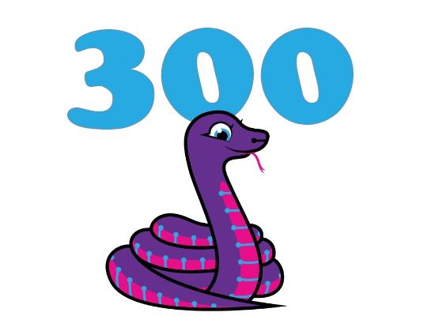](url)

We reached 300 libraries for CircuitPython this week. This includes developed libraries and community contributed libraries. Thank you to the community for all the contributions to both new and existing libraries - [Adafruit Blog](url)

## Python Turns 30 Years Old

[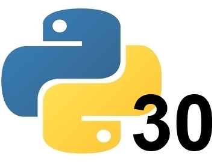](https://www.theregister.com/2021/02/20/happy_birthday_python_youre_30/)

On February 20th, Python turned 30 years old! - [The Register](https://www.theregister.com/2021/02/20/happy_birthday_python_youre_30/) and [VentureBeat](https://venturebeat.com/2021/02/19/python-pioneer-assesses-the-30-year-old-programming-language/).

The father of Python, Guido van Rossum, lays out the dates - [Twitter](https://twitter.com/gvanrossum/status/40485917399592960).

In other Python Software Foundation News, Python releases [3.9.2rc1](https://www.python.org/downloads/release/python-392rc1/) and [3.8.8rc1](https://www.python.org/downloads/release/python-388rc1/) are now available for testing.

## CircuitPython2021 round up

A round-up of all the CircuitPython 2021 responses received from the community - [Adafruit Blog](https://blog.adafruit.com/2021/02/16/circuitpython2021-round-up/)

## PyCascades Concludes

PyCascades, the regional PyCon in the Pacific Northwest, concluded Sunday - [PyCascades](https://2021.pycascades.com/).

Videos of the talks have started going up and will continue to this week - [YouTube](https://www.youtube.com/c/PyCascades).

## CircuitPython Deep Dive Stream with Scott Shawcroft

[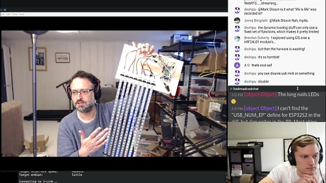](https://youtu.be/a9P3U622x6M)

[This week](https://youtu.be/a9P3U622x6M), Jeff joins Scott to chat RP2040 PIO and CircuitPython audio.

You can see the latest video and past videos on the Adafruit YouTube channel under the Deep Dive playlist - [YouTube](https://www.youtube.com/playlist?list=PLjF7R1fz_OOXBHlu9msoXq2jQN4JpCk8A).

## A New E-mail for Newsletter Submissions

A new email address has been created to send in newsworthy information to the editorial team. If you have news, an event, a project, and/or other information, send in an email to the address below. You can still put in a Pull Request on the next newsletter [GitHub repo](https://github.com/adafruit/circuitpython-weekly-newsletter/tree/gh-pages/_drafts).

## News from around the web!

Cat is outside reminder with CircuitPython and an [Adafruit MagTag](https://www.adafruit.com/product/4800) eInk display - [Twitter](https://twitter.com/AriasPalomo/status/1361669063848710146).

[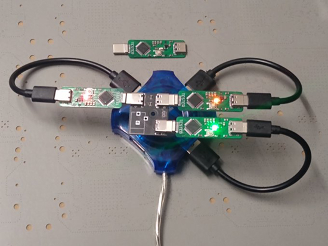](https://twitter.com/burtyb/status/1362321502624956416)

Putting CircuitPython on custom SAMD21 powered "USB-C Plug" testers - [Twitter](https://twitter.com/burtyb/status/1362321502624956416).

Using CircuitPython code on the Raspberry Pi Pico to pull a prank - [Twitter](https://twitter.com/mirkin23/status/1362027440521048074).

A CircuitPython class to drive the leds and read the buttons on a Pimoroni RGB Keyboard and the Raspberry Pi Pico - [Twitter](https://twitter.com/Codepope/status/1361678044646277121) and [GitHub](https://gist.github.com/codepope/a96f60f8a494ffba885c18fb00146dd6).

Making a touch controlled piano with CircuitPython and Scratch - [Google Docs](https://docs.google.com/presentation/d/e/2PACX-1vR6tV6hCx5HcGsltV0YrDIwP1oSciHhdDAZ-lyFkfz3qhXPqN4qbQrmDQF5ltQnnvsGcLeEBWj9-TP5/pub?start=false&loop=false&delayms=3000&slide=id.p).

[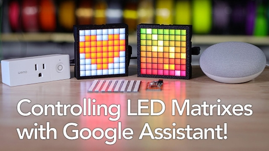](https://youtu.be/x-1XPSzNRHs)

Send messages to an LED Matrix using CircuitPython - [YouTube](https://youtu.be/x-1XPSzNRHs).

Using the Low Cost Raspberry Pi Pico RP2040 Microcontroller with CircuitPython - [YouTube](https://www.youtube.com/watch?v=q5xzLED44sI).

[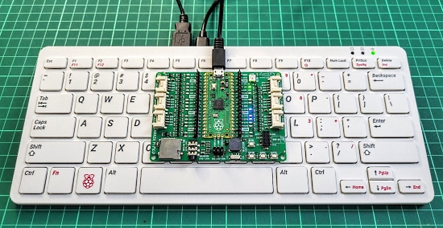](https://youtu.be/yAreETI4JwI)

A Keyboard Emulator Using a Raspberry Pi Pico and CircuitPython - YouTube: [English](https://youtu.be/yAreETI4JwI) and [Malay](https://www.youtube.com/watch?v=rh2jceNKsIc&feature=youtu.be).

A Gamestop stock price display using CircuitPython and an [Adafruit Matrix Portal](https://www.adafruit.com/product/4745) - [Reddit](https://www.reddit.com/r/wallstreetbets/comments/laxh1q/made_a_led_gme_ticker_with_live_updates/) and [GitHub](https://github.com/hifarrer/Gamestonk_Matrix).

MagTag Air Quality Display - [Reddit](https://www.reddit.com/r/circuitpython/comments/lp7uag/mag_tag_air_quality_display/) and [GitHub](https://github.com/brad2021hk/magtag_aqi).

[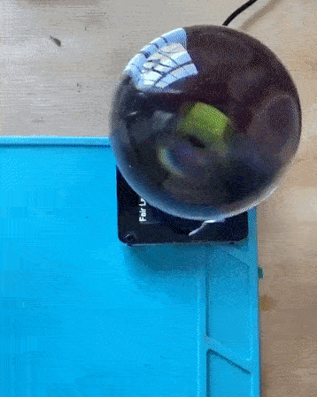](https://twitter.com/NickRuffilo/status/1363528288816279554)

Making a crystal ball that predicts the weather using an [Adafruit PyPortal](https://www.adafruit.com/product/4116) and CircuitPython - [Twitter](https://twitter.com/NickRuffilo/status/1363528288816279554).

[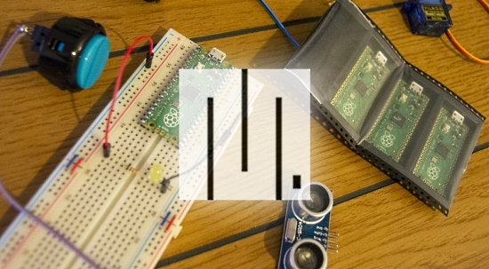](https://howchoo.com/pico/set-up-and-use-micropython-raspberry-pi-pico)

How to Set Up and Use MicroPython on the Raspberry Pi Pico - [howchoo](https://howchoo.com/pico/set-up-and-use-micropython-raspberry-pi-pico).

NeoPixel fireflies jar with Raspberry Pi Pico and MicroPython - [Raspberry Pi Blog](https://www.raspberrypi.org/blog/neopixel-fireflies-jar-with-raspberry-pi-hackspace-39/).

A Raspberry Pi Pico Alarm Clock with MicroPython - [hackster.io](https://www.hackster.io/teig/light-alarm-clock-with-raspberry-pi-pico-02fd6f) via the [Adafruit Blog](https://blog.adafruit.com/2021/02/19/raspberry-pi-pico-alarm-clock-piday-raspberrypi-raspberry_pi/).

The dinkyOSC interface experiments on the a Raspberry Pi Pico in MicroPython. Made with some 2 state slider/pot objects (incremental or absolute representation of the gpio input) and a highlight/select element to groups of obs  - [Twitter](https://twitter.com/digitalMakerCIC/status/1362750814364852226).

Make your Pico flash an LED in under 5 minutes with Pico-Go, added linting and auto-completion to your Raspberry Pi Pico MicroPython project! - [Pico-Go](http://pico-go.net/docs/start/quick/) via [Twitter](https://twitter.com/cpwooduk/status/1362076279944728580).

Python Development in Visual Studio Code video - [Real Python](https://realpython.com/lessons/introduction-visual-studio-code/) via [Twitter](https://twitter.com/realpython/status/1363564317426253826).

How To Write Doctests in Python. Documentation and testing are core components of every productive software development process. A programmer can be well served by first writing documentation and then tests, before finally writing code. - [Digital Ocean](https://www.digitalocean.com/community/tutorials/how-to-write-doctests-in-python).

Python Concurrency: The Tricky Bits. An exploration of threads, processes, and coroutines in Python, with interesting examples that illuminate the differences between each - [Hamel.dev](https://python.hamel.dev/concurrency/).

Python Programming And Numerical Methods: A Guide For Engineers And Scientists. This book introduces programming to students from a wide range of backgrounds and gives them programming and mathematical tools that will be useful throughout their careers - [Berkeley.edu](https://pythonnumericalmethods.berkeley.edu/notebooks/Index.html).

Building a sonar sensor array with Arduino and Python - [towards data science](https://towardsdatascience.com/building-a-sonar-sensor-array-with-arduino-and-python-c5b4cf30b945).

F´: A Flight-Proven, Multi-Platform, Open-Source Flight Software Framework. It is tailored but not limited to small-scale spaceflight systems such as CubeSats, SmallSats, and instruments - [GitHub](https://github.com/nasa/fprime).

Get HID Report Descriptors with “win-hid-dump” and “mac-hid-dump” - [todbot blog](https://todbot.com/blog/2021/01/29/get-hid-report-descriptors-with-win-hid-dump-mac-hid-dump/).

PyAnchor - check the HTTP response on all links on a page - [pypi](https://pypi.org/project/pyanchor/).

CircuitPython Weekly Meeting for February 16th, 2021 [notes](https://github.com/adafruit/adafruit-circuitpython-weekly-meeting/blob/master/2021/2021-02-16.md) and [on YouTube](https://youtu.be/I4uqbDT59Us)

CircuitPython Weekly Meeting for February 22th, 2021 [notes](https://github.com/adafruit/adafruit-circuitpython-weekly-meeting/blob/master/2021/2021-02-22.md) and [on YouTube](https://youtu.be/hCJOsrK7mYw)

PyDev of the week: Mariano Anaya on [Mouse vs Python](https://www.blog.pythonlibrary.org/2021/02/22/pydev-of-the-week-mariano-anaya/)

#ICYDNCI What was the most popular, most clicked link, in [last week's newsletter](https://www.adafruitdaily.com/2021/02/16/python-on-microcontrollers-newsletter-making-keyboards-and-midi-gear-easily-with-python-python-adafruit-circuitpython-micropython-thepsf/)? [100 Page Python](https://learnbyexample.github.io/100_page_python_intro/preface.html).

## Coming soon

[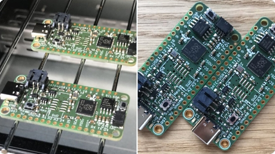](https://twitter.com/guido_burger/status/1362764467772284928)

More user made Feather RP2040 boards seen - fans of the Adafruit Feather board format continue to build boards based on the specifications Adafruit has released on [GitHub](https://github.com/adafruit/Adafruit-Feather-RP2040-PCB) under Creative Commons Share-alike license. Here is another pair, made by Guido Burger. - [Twitter](https://twitter.com/guido_burger/status/1362764467772284928).

You can sign up for notification when Adafruit has them in stock - [Adafruit](https://www.adafruit.com/feather2040).

## New Boards Supported by CircuitPython

The number of supported microcontrollers and Single Board Computers (SBC) grows every week. This section outlines which boards have been included in CircuitPython or added to [CircuitPython.org](https://circuitpython.org/).

This week, there were 3 new boards added!

- [M4-Shim](https://circuitpython.org/board/silicognition-m4-shim/)
- [TTGO T8 ESP32-S2 ST7789](https://circuitpython.org/board/lilygo_ttgo_t8_s2_st7789/)
- [DynaLoRa-USB](https://circuitpython.org/board/dynalora_usb/)

Looking to add a new board to CircuitPython? It's highly encouraged! Adafruit has four guides to help you do so:

- [How to Add a New Board to CircuitPython](https://learn.adafruit.com/how-to-add-a-new-board-to-circuitpython/overview)
- [How to add a New Board to the circuitpython.org website](https://learn.adafruit.com/how-to-add-a-new-board-to-the-circuitpython-org-website)
- [Adding a Single Board Computer to PlatformDetect for Blinka](https://learn.adafruit.com/adding-a-single-board-computer-to-platformdetect-for-blinka)
- [Adding a Single Board Computer to Blinka](https://learn.adafruit.com/adding-a-single-board-computer-to-blinka)

## New Learn Guides!

[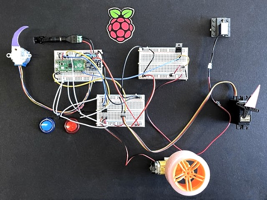](https://learn.adafruit.com/guides/latest)

[DC, Servo, Stepper Motors and Solenoids with the Pico](https://learn.adafruit.com/use-dc-stepper-servo-motor-solenoid-rp2040-pico) from [John Park](https://learn.adafruit.com/users/johnpark)

[Adafruit 1.54" eInk Display Breakouts](https://learn.adafruit.com/adafruit-1-54-eink-display-breakouts) from [Melissa LeBlanc-Williams](https://learn.adafruit.com/users/MakerMelissa)

[Microsoft Azure Cost Monitor](https://learn.adafruit.com/AzureCostMonitor) from [Jen Fox](https://learn.adafruit.com/users/jenfoxbot)

## CircuitPython Libraries!

CircuitPython support for hardware continues to grow. We are adding support for new sensors and breakouts all the time, as well as improving on the drivers we already have. As we add more libraries and update current ones, you can keep up with all the changes right here!

For the latest libraries, download the [Adafruit CircuitPython Library Bundle](https://circuitpython.org/libraries). For the latest community contributed libraries, download the [CircuitPython Community Bundle](https://github.com/adafruit/CircuitPython_Community_Bundle/releases).

If you'd like to contribute, CircuitPython libraries are a great place to start. Have an idea for a new driver? File an issue on [CircuitPython](https://github.com/adafruit/circuitpython/issues)! Have you written a library you'd like to make available? Submit it to the [CircuitPython Community Bundle](https://github.com/adafruit/CircuitPython_Community_Bundle). Interested in helping with current libraries? Check out the [CircuitPython.org Contributing page](https://circuitpython.org/contributing). We've included open pull requests and issues from the libraries, and details about repo-level issues that need to be addressed. We have a guide on [contributing to CircuitPython with Git and Github](https://learn.adafruit.com/contribute-to-circuitpython-with-git-and-github) if you need help getting started. You can also find us in the #circuitpython channel on the [Adafruit Discord](https://adafru.it/discord).

You can check out this [list of all the Adafruit CircuitPython libraries and drivers available](https://github.com/adafruit/Adafruit_CircuitPython_Bundle/blob/master/circuitpython_library_list.md). 

The current number of CircuitPython libraries is **300**!

**New Libraries!**

Here's this week's new CircuitPython libraries:

 * [Adafruit_CircuitPython_BLE_LYWSD03MMC](https://github.com/adafruit/Adafruit_CircuitPython_BLE_LYWSD03MMC)

**Updated Libraries!**

Here's this week's updated CircuitPython libraries:

* This week the list was too long to include!

## What’s the team up to this week?

Here's what the CircuitPython team has been up to this past week:

**Dan**

I finished the secondary USB serial implementation for CircuitPython and will be submitting a PR shortly. Its API tries to be an approximate subset of the `pyserial` API.

Another CircuitPython 6.2.0 beta will be in the works soon.

**Jeff**

I turned the corner on PIO and have implemented something useful---the ability to control 8 strands of NeoPixels in parallel using the PIO peripheral, 3 GPI pins, and a '595 "shift register".  Advantages of this feature include transmitting data to the neopixels in less time, and more freedom in how you wire multiple NeoPixel strips -- in serial, or now in parallel. Once incorporated in CircuitPython, it will work similarly to Pixelbuf and can automatically be used by the Animation library.

**Kattni**

This week I was able to get a bit of miscellaneous done including blogging some guide releases, fixing some guide page layouts, and updating some old code for the latest CircuitPython release. I added two concepts to the Welcome to CircuitPython guide - the CIRCUITPY filesystem use and what happens when your code is done running. I'm now working on finalising the [Getting Started with Raspberry Pi Pico and CircuitPython guide](https://learn.adafruit.com/getting-started-with-raspberry-pi-pico-circuitpython) with two more pages: Potentiometer and PWM LED, and Data Logger. Those pages should be live soon. Next up - updating the MLX90393 guide for the STEMMA QT revision. Keep an eye out for those over the next week!

**Lucian**

This past week I worked on some of the persistent I2C errors that have been affecting the ESP32-S2 port, which cause either mysterious crashes or conflicts with WiFi, depending on how the peripheral is reset. I also got started on putting together control tests and other infrastructure for the low power modes on the STM32 port, along with a number of miscellaneous minor bugfixes and PR adjustments.

**Melissa**

This past week I worked on several miscellaneous GitHub issues including fixing some of the Raspberry Pi installer scripts and attempting to get the ST7789 display driver working. While the driver did compile on the newer headers, it was still experiencing some drawing issues.

Next I wrote up a guide on the 1.54" E-Ink display. I was working on a mega guide a while ago, but it really makes sense to split the displays up into several guides. You can check out the [E-Ink display guide](https://learn.adafruit.com/adafruit-1-54-eink-display-breakouts).

**Scott**

This week I'm wrapping with PIO improvements that I've made for I2S audio playback support. I've gotten it working and will PR it by the end of this week. (I'm hoping to do PDM microphone input as well.)

Next week I hope to get UART going on the RP2040 and `rotaryio`. Folks have been eagerly awaiting both so I hope I can knock them out.

## Upcoming events!

The 2021 Open Hardware summit will be held online, Friday April 9, 2021. The summit will be livestreamed, but ticket holders will have access to additional interactive portions of the summit like meet-and-greets, workshops, and sponsor booths. Find details, including ticket and sponsorship information at [2021.oshwa.org](https://2021.oshwa.org/) - [OSHWA](https://www.oshwa.org/2020/11/16/announcing-the-2021-open-hardware-summit/).

The online GeoPython conference is focused on Python and Geo, its toolkits and applications. April 22-23, 2021 - [https://2021.geopython.net/](https://2021.geopython.net/).

PyCon US, the annual official annual Python gathering, has been announced to be held online May 12-15, 2021. Sprints will be held May 16-18, 2021. More information and signups at [https://us.pycon.org/2021/](https://us.pycon.org/2021/)

EuroPython, the largest conference for the Python programming language in Europe, has been announced to be held online July 26 - August 1, 2021. More information at [https://ep2021.europython.eu/](https://ep2021.europython.eu/)

**Send Your Events In**

As for other events, with the COVID pandemic, most in-person events are postponed or cancelled. If you know of virtual events or events that may occur in the future, please let us know on Discord or on Twitter with hashtag #CircuitPython.

## Latest releases

CircuitPython's stable release is [6.1.0](https://github.com/adafruit/circuitpython/releases/latest) and its unstable release is [6.2.0-beta.2](https://github.com/adafruit/circuitpython/releases). New to CircuitPython? Start with our [Welcome to CircuitPython Guide](https://learn.adafruit.com/welcome-to-circuitpython).

[20210222](https://github.com/adafruit/Adafruit_CircuitPython_Bundle/releases/latest) is the latest CircuitPython library bundle.

[v1.14](https://micropython.org/download) is the latest MicroPython release. Documentation for it is [here](http://docs.micropython.org/en/latest/pyboard/).

[3.9.2](https://www.python.org/downloads/) is the latest Python release. The latest pre-release version is [3.10.0a5](https://www.python.org/download/pre-releases/).

[2,311 Stars](https://github.com/adafruit/circuitpython/stargazers) Like CircuitPython? [Star it on GitHub!](https://github.com/adafruit/circuitpython)

## Call for help -- Translating CircuitPython is now easier than ever!

[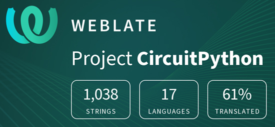](https://hosted.weblate.org/engage/circuitpython/)

One important feature of CircuitPython is translated control and error messages.

With the help of fellow open source project [Weblate](https://weblate.org/), we're making it even easier to add or improve translations.

Sign in with an existing account such as Github, Google or Facebook and start contributing through a simple web interface. No forks or pull requests needed!

As always, if you run into trouble join us on [Discord](https://adafru.it/discord), we're here to help.

## jobs.adafruit.com - Find a dream job, find great candidates!

[jobs.adafruit.com](https://jobs.adafruit.com/) has returned and folks are posting their skills (including CircuitPython) and companies are looking for talented makers to join their companies - from Digi-Key, to Hackaday, Microcenter, Raspberry Pi and more.

**Job of the Week**

text - [Adafruit Jobs Board](https://jobs.adafruit.com/).

## 27,582 thanks!

The Adafruit Discord community, where we do all our CircuitPython development in the open, reached over 27,582 humans, thank you!  Adafruit believes Discord offers a unique way for CircuitPython folks to connect. Join today at [https://adafru.it/discord](https://adafru.it/discord).

## ICYMI - In case you missed it

The wonderful world of Python on hardware! This is our Python video-newsletter-podcast! The news comes from the Python community, Discord, Adafruit communities and more and is reviewed on ASK an ENGINEER Wednesdays. The complete Python on Hardware weekly videocast [playlist is here](https://www.youtube.com/playlist?list=PLjF7R1fz_OOXRMjM7Sm0J2Xt6H81TdDev). 

This video podcast is on [iTunes](https://itunes.apple.com/us/podcast/python-on-hardware/id1451685192?mt=2), [YouTube](http://adafru.it/pohepisodes), [IGTV (Instagram TV](https://www.instagram.com/adafruit/channel/)), and [XML](https://itunes.apple.com/us/podcast/python-on-hardware/id1451685192?mt=2).

[Weekly community chat on Adafruit Discord server CircuitPython channel - Audio / Podcast edition](https://itunes.apple.com/us/podcast/circuitpython-weekly-meeting/id1451685016) - Audio from the Discord chat space for CircuitPython, meetings are usually Mondays at 2pm ET, this is the audio version on [iTunes](https://itunes.apple.com/us/podcast/circuitpython-weekly-meeting/id1451685016), Pocket Casts, [Spotify](https://adafru.it/spotify), and [XML feed](https://adafruit-podcasts.s3.amazonaws.com/circuitpython_weekly_meeting/audio-podcast.xml).

And lastly, we are working up a one-spot destination for all things podcast-able here - [podcasts.adafruit.com](https://podcasts.adafruit.com/)

## Codecademy "Learn Hardware Programming with CircuitPython"

Codecademy, an online interactive learning platform used by more than 45 million people, has teamed up with the leading manufacturer in STEAM electronics, Adafruit Industries, to create a coding course, "Learn Hardware Programming with CircuitPython". The course is now available in the [Codecademy catalog](https://www.codecademy.com/learn/learn-circuitpython?utm_source=adafruit&utm_medium=partners&utm_campaign=circuitplayground&utm_content=pythononhardwarenewsletter).

Python is a highly versatile, easy to learn programming language that a wide range of people, from visual effects artists in Hollywood to mission control at NASA, use to quickly solve problems. But you don’t need to be a rocket scientist to accomplish amazing things with it. This new course introduces programmers to Python by way of a microcontroller — CircuitPython — which is a Python-based programming language optimized for use on hardware.

CircuitPython’s hardware-ready design makes it easier than ever to program a variety of single-board computers, and this course gets you from no experience to working prototype faster than ever before. Codecademy’s interactive learning environment, combined with Adafruit's highly rated Circuit Playground Express, present aspiring hardware hackers with a never-before-seen opportunity to learn hardware programming seamlessly online.

Whether for those who are new to programming, or for those who want to expand their skill set to include physical computing, this course will have students getting familiar with Python and creating incredible projects along the way. By the end, students will have built their own bike lights, drum machine, and even a moisture detector that can tell when it's time to water a plant.

Visit Codecademy to access the [Learn Hardware Programming with CircuitPython](https://www.codecademy.com/learn/learn-circuitpython?utm_source=adafruit&utm_medium=partners&utm_campaign=circuitplayground&utm_content=pythononhardwarenewsletter) course and Adafruit to purchase a [Circuit Playground Express](https://www.adafruit.com/product/3333).

Codecademy has helped more than 45 million people around the world upgrade their careers with technology skills. The company’s online interactive learning platform is widely recognized for providing an accessible, flexible, and engaging experience for beginners and experienced programmers alike. Codecademy has raised a total of $43 million from investors including Union Square Ventures, Kleiner Perkins, Index Ventures, Thrive Capital, Naspers, Yuri Milner and Richard Branson, most recently raising its $30 million Series C in July 2016.

## Contribute!

The CircuitPython Weekly Newsletter is a CircuitPython community-run newsletter emailed every Tuesday. The complete [archives are here](https://www.adafruitdaily.com/category/circuitpython/). It highlights the latest CircuitPython related news from around the web including Python and MicroPython developments. To contribute, edit next week's draft [on GitHub](https://github.com/adafruit/circuitpython-weekly-newsletter/tree/gh-pages/_drafts) and [submit a pull request](https://help.github.com/articles/editing-files-in-your-repository/) with the changes. You may also tag your information on Twitter with #CircuitPython. 

Join our [Discord](https://adafru.it/discord) or [post to the forum](https://forums.adafruit.com/viewforum.php?f=60) for any further questions.
