- [X] Kattni updates
- [X] change date
- [ ] update title
- [ ] Feature story
- [ ] Update  for images
- [ ] Update ICYDNCI
- [ ] All images 550w max only
- [ ] Link "View this email in your browser."

View this email in your browser.

Welcome to the latest Python on Microcontrollers newsletter, brought you by the community! We're on [Discord](https://discord.gg/HYqvREz), [Twitter](https://twitter.com/search?q=circuitpython&src=typed_query&f=live), and for past newsletters - [view them all here](https://www.adafruitdaily.com/category/circuitpython/). If you're reading this on the web, [subscribe here](https://www.adafruitdaily.com/). Let's get started!

## Piper Make Brings Block Programming to CircuitPython

[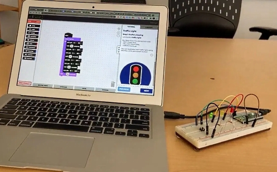](https://make.playpiper.com/)

[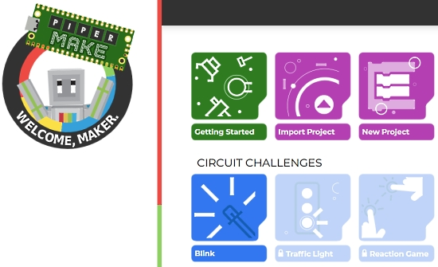](https://make.playpiper.com/)

Piper Learning released a new product, Piper Make, which is a browser-based coding platform for the Raspberry Pi Pico. It has a block-programming interface based on Google Blockly. The underlying code is CircuitPython! 

You can sccess the interface, which is similar to MakeCode, at [https://make.playpiper.com/](https://make.playpiper.com/).

Under the hood, there is a CircuitPython helper library Piper has created - [GitHub](https://github.com/buildwithpiper/PiperBlocklyLibrary).

More details - [Tom's Hardware](https://www.tomshardware.com/news/raspberry-pi-pico-piper-make), [Make](https://makezine.com/2021/03/13/play-the-piper-for-pi-day/) and [YouTube](https://youtu.be/tkpEeSqQsxs).

## The Adafruit Discord Server Surpasses 28,000 Members

The Adafruit Discord community, where we do all our CircuitPython development in the open, reached over 28,000 humans, thank you! Adafruit believes Discord offers a unique way for CircuitPython folks to connect. Join today at [https://adafru.it/discord](https://adafru.it/discord).

## Software Releases

Here are some software releases of note for this weeke:

New version of CircuitPython Bundle Manager released including dependency detection  - [GitHub](https://github.com/UnsignedArduino/CircuitPython-Bundle-Manager/releases/tag/v1.1.0).

[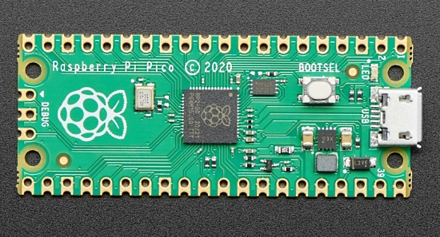](https://github.com/raspberrypi/pico-examples/tree/master/pio)

The Raspberry Pi team is posting examples of using PIO to make common interfaces on the Raspberry Pi Pico - [GitHub](https://github.com/raspberrypi/pico-examples/tree/master/pio)

The Mu Editor team is testing 1.1.0-beta.2 - First Public Beta - [GitHub](https://github.com/mu-editor/mu/releases).

## CircuitPython Deep Dive Stream with Scott Shawcroft

[This week](https://youtu.be/q2SjPZUsgP8), Scott streams his work on Flash and Clocks.

You can see the latest video and past videos on the Adafruit YouTube channel under the Deep Dive playlist - [YouTube](https://www.youtube.com/playlist?list=PLjF7R1fz_OOXBHlu9msoXq2jQN4JpCk8A).

## News from around the web!

Demonstrating a round LCD as a gauge, controlled by a potentiometer knob - [GitHub](https://github.com/todbot/CircuitPython_GC9A01_demos).

[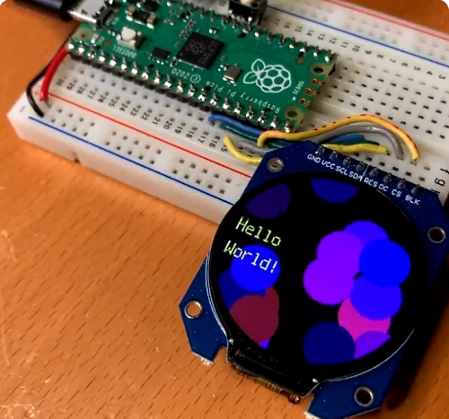](https://twitter.com/todbot/status/1371184508771299332)

A round LCD on a Raspberry Pi Pico with a circular spinning Hello World while pinkpurple circle clouds float by - [Twitter](https://twitter.com/todbot/status/1371184508771299332).

Keybow 2040 CircuitPython is a CircuitPython library for the RP2040-powered Keybow 2040 from Pimoroni, a 16-key mini mechanical keyboard with RGB backlit keys - [GitHub](https://github.com/sandyjmacdonald/keybow2040-circuitpython).

[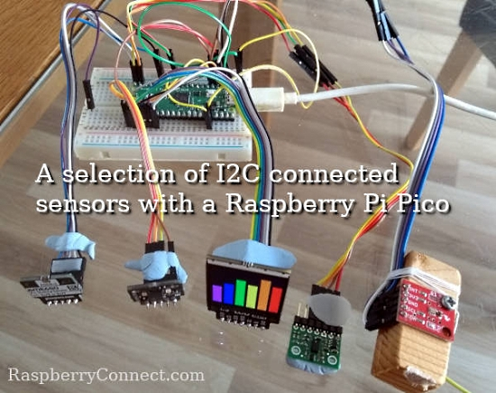](https://www.raspberryconnect.com/projects/41-tutorials-and-guides-1/190-trying-raspberry-pi-pico-with-i2c-devices-with-python)

Trying Raspberry Pi Pico with I2C devices using CircuitPython - [Raspberry Connect](https://www.raspberryconnect.com/projects/41-tutorials-and-guides-1/190-trying-raspberry-pi-pico-with-i2c-devices-with-python).

Humble Bundle books - Learn You More Code with No Starch Press, $487 of books, pay $1 or more, DRM-free - [Humble Bundle](https://www.humblebundle.com/books/learn-you-more-code-no-starch-press-books).

[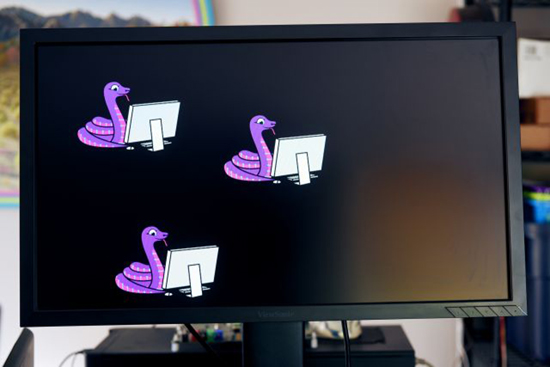](https://tinyletter.com/jamesbowman/letters/show-and-tell-eve-for-circuitpython)

CircuitPython for Gameduino (and other EVE GPU-based hardware) has reached another development milestone - [tinyletter.com](https://tinyletter.com/jamesbowman/letters/show-and-tell-eve-for-circuitpython).

Programming Electroncis - Controlling an LED using CircuitPython using Adafruit Metro M4 - [YouTube](https://www.youtube.com/watch?v=xsom3-TPwfs).

A Feather RP2040 HeadMouse assistive technology device from ATMakers - [YouTube](https://www.youtube.com/watch?v=6dau3qSTxW8).

A CircuitPython MIDI Controller using a Pimoroni keypad and the Raspberry Pi Pico - [Twitter](https://twitter.com/Mac63123455/status/1370129738849783811).

[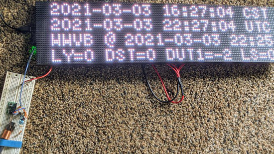](https://twitter.com/jeffepler/status/1368215491077144577)

WWVB clock project progress, all the way from radio signal to LED display - [Twitter](https://twitter.com/jeffepler/status/1368215491077144577).

A new TG-Gui widget using CircuitPython and displayio on TG-Watch - [Twitter](https://twitter.com/TG_Techie/status/1367952773388591105).

Robots running MicroPython - [Instagram](https://www.instagram.com/p/CMUUByELVlM/).

[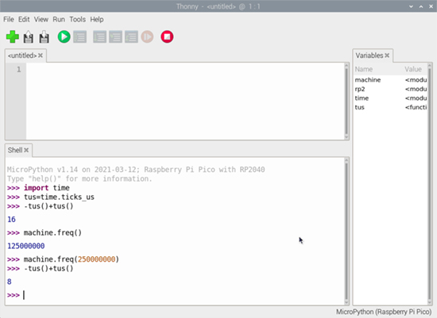](https://twitter.com/HermannSW/status/1370337213653917698)

First time using MicroPython with Thonny and the syntax-highlighted REPL -[RaspberryPi.org](https://www.raspberrypi.org/forums/viewtopic.php?f=146&t=306736) via [Twitter](https://twitter.com/HermannSW/status/1370337213653917698).

3D-printed LED triangle running MicroPython on a WeMos D1 Mini - [Twitter](https://twitter.com/frenchguych/status/1369813163726798848).

MicroPython bitmap tool explained as a video - [YouTube](https://www.youtube.com/watch?v=a7MzPA0T_MM&t=1s) via [Twitter](https://twitter.com/LuckyResistor/status/1369949184909004804).

[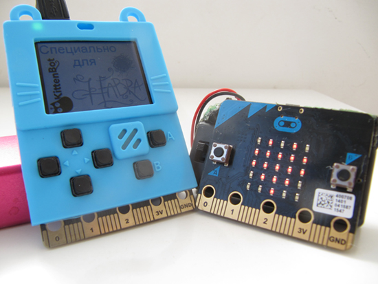](https://habr.com/ru/company/ruvds/blog/545732/)

CircuitPython and MicroPython for the MeowBit (Russian) - [Habr.com](https://habr.com/ru/company/ruvds/blog/545732/).

MIDI arpeggiator CircuitPython code for the Pimoroni Keybow 2040 - [Twitter](https://twitter.com/sandyjmacdonald/status/1370084001621417987).

CircuitPython MIDI code controlling a Yamaha MODX8 - [Twitter](https://twitter.com/Gadgetoid/status/1369980674845900800).

[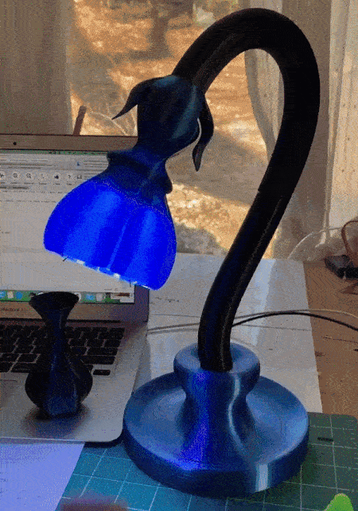](url)

3D-printed lamp running CircuitPython on a QT Py using capacitive touch - [Twitter](https://twitter.com/MrReuland/status/1369770377833021442).

The differences between MakeCode Python and MicroPython APIs - [microbit.org](https://support.microbit.org/support/solutions/articles/19000111744-makecode-python-and-micropython).

Weather station redo with Raspberry Pi Pico and LoRa radio running MicroPython - [Twitter](https://twitter.com/circuit_k/status/1370271463316594690).

Tiny 3D-printed bots running MicroPython on the Pimoroni Tiny2040 - [Twitter](https://twitter.com/kevsmac/status/1370310409001918465).

A Jupyter kernel to interact with a MicroPython ESP8266 or ESP32 over its serial REPL - [GitHub](https://github.com/goatchurchprime/jupyter_micropython_kernel) via [Twitter](https://twitter.com/embedded_iot/status/1370168516377251840).

Comparative: Arduino IDE vs. MicroPython for the ESP32 - [330ohms.com](https://blog.330ohms.com/2020/07/17/comparativa-arduino-v-s-micropython-para-el-esp32/) via [Twitter](https://twitter.com/Arduino_Python/status/1370051258950823940).

Picosoft Turns the Raspberry Pi Pico Into an Interactive MicroPython Computer, the ORANGE-Python - [Hackster.io](https://www.hackster.io/news/picosoft-turns-the-raspberry-pi-pico-into-an-interactive-micropython-computer-the-orange-python-fbb6757a6196) via [Twitter](https://twitter.com/ghalfacree/status/1370021716886315023).

[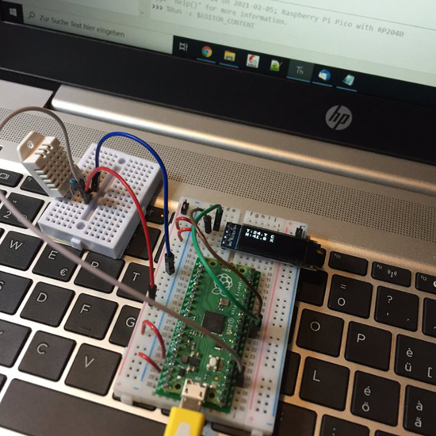](https://twitter.com/arduinopraxis/status/1369340403795828739)

Sending the environment with MicroPython, the Raspberry Pi Pico and a DHT22 - [Twitter](https://twitter.com/arduinopraxis/status/1369340403795828739).

Using MicroPython on Raspberry Pi Pico to make a retro video game clone - [YouTube](https://www.youtube.com/watch?v=O5S1LC5TFiM).

[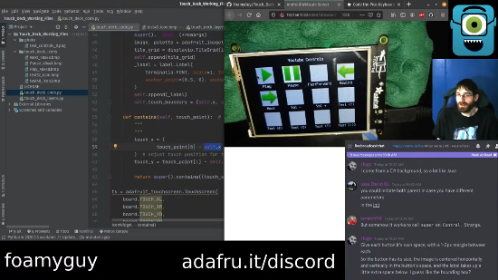](https://www.youtube.com/watch?v=y_AF83FRk-M)

3/13/21 Stream from CircuitPythonista FoamyGuy (Tim) covers work on a Touch Deck project. - [YouTube](https://www.youtube.com/watch?v=y_AF83FRk-M).

Using the BerryIMUv3 on a Raspberry Pi Pico with MicroPython - [ozzmaker.com](https://ozzmaker.com/using-the-berryimuv3-on-a-raspberry-pi-pico-with-micropython/).

Creating Mandelbrot images on a Raspberry Pi Pico with MicroPython - [YouTube](https://www.youtube.com/watch?v=xloVxoMGJ0Y).

A Python package that generates hardware pinout diagrams as SVG images - [GitHub](https://github.com/j0ono0/pinout) via [Twitter](https://twitter.com/john_newall/status/1369874084058734593).

Real Python Podcast Episode 51: Navigating Options for Deploying Your Python Application - [Real Python](https://realpython.com/podcasts/rpp/51/).

A guide to Python IDEs and Code Editors - [Real Python](https://realpython.com/python-ides-code-editors-guide/) via [Twitter](https://twitter.com/realpython/status/1370404422673645579).

Bresenham's Circle Drawing Algorithm - [funloop.org](https://funloop.org/post/2021-03-15-bresenham-circle-drawing-algorithm.html).

PyDev of the Week: Žan Anderle from [Mouse vs Python](https://www.blog.pythonlibrary.org/2021/03/15/pydev-of-the-week-zan-anderle/)

CircuitPython Weekly Meeting for March 15th, 2021 [on YouTube](https://youtu.be/lDNS_5vp6yA) and [notes](https://github.com/adafruit/adafruit-circuitpython-weekly-meeting/blob/master/2021/2021-03-15.md)

#ICYDNCI What was the most popular, most clicked link, in [last week's newsletter](https://www.adafruitdaily.com/2021/03/09/python-on-microcontrollers-newsletter-circuitpython-6-2-0-beta-3-released-and-more-python-adafruit-circuitpython-micropython-thepsf/)? [The Adafruit Feather RP2040 Board](https://www.adafruit.com/product/4884).

## Board Reviews

[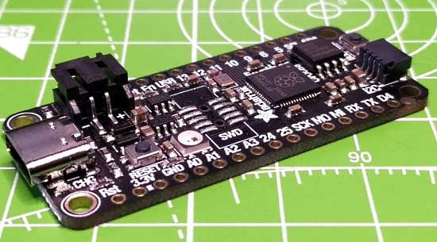](https://www.tomshardware.com/reviews/adafruit-feather-rp2040)

Tom's Hardware - Adafruit Feather RP2040 Review: A More-Refined Raspberry Pi Pico - [Tom's Hardware](https://www.tomshardware.com/reviews/adafruit-feather-rp2040).

@geekinchief - [Twitter](https://twitter.com/geekinchief/status/1370509096567377922):

> The Adafruit Feather RP2040 is the best RP2040 board you can get, offering 8MB of storage, strong battery support, 4 ADCs and a huge ecosystem of add-on boards. Get it . . . if you can find one in stock.

[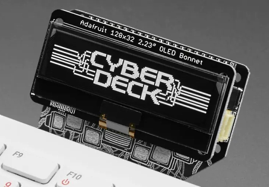](https://www.hackster.io/news/adafruit-s-cyberdeck-bonnet-brings-add-on-hardware-to-your-raspberry-pi-400-at-a-jaunty-angle-10f9c44ab87c)

Adafruit's Cyberdeck Bonnet Brings Add-On Hardware to Your Raspberry Pi 400 — at a Jaunty Angle. Supporting all small-form factor Bonnet, micro-HAT, and pHAT accessories, the add-on board also includes STEMMA ports - [hackster.io](https://www.hackster.io/news/adafruit-s-cyberdeck-bonnet-brings-add-on-hardware-to-your-raspberry-pi-400-at-a-jaunty-angle-10f9c44ab87c).

## New Boards Supported by CircuitPython

The number of supported microcontrollers and Single Board Computers (SBC) grows every week. This section outlines which boards have been included in CircuitPython or added to [CircuitPython.org](https://circuitpython.org/).

This week, there were no new boards added but several are in development.

Looking to add a new board to CircuitPython? It's highly encouraged! Adafruit has four guides to help you do so:

- [How to Add a New Board to CircuitPython](https://learn.adafruit.com/how-to-add-a-new-board-to-circuitpython/overview)
- [How to add a New Board to the circuitpython.org website](https://learn.adafruit.com/how-to-add-a-new-board-to-the-circuitpython-org-website)
- [Adding a Single Board Computer to PlatformDetect for Blinka](https://learn.adafruit.com/adding-a-single-board-computer-to-platformdetect-for-blinka)
- [Adding a Single Board Computer to Blinka](https://learn.adafruit.com/adding-a-single-board-computer-to-blinka)

## New Learn Guides!

[Shadow Box Internet Clock with NeoPixel Visualization](https://learn.adafruit.com/shadow-box-internet-clock-with-neopixel-visualization) from [Erin St. Blaine](https://learn.adafruit.com/users/firepixie)

[Quickstart IoT - Raspberry Pi Pico RP2040 with WiFi](https://learn.adafruit.com/quickstart-rp2040-pico-with-wifi-and-circuitpython) from [Brent Rubell](https://learn.adafruit.com/users/brubell)

[Introducing Adafruit Feather RP2040](https://learn.adafruit.com/adafruit-feather-rp2040-pico) from [Kattni](https://learn.adafruit.com/users/kattni)

[CircuitPython Display_Text Library](https://learn.adafruit.com/circuitpython-display_text-library) from [Tim C](https://learn.adafruit.com/users/Foamyguy)

[Raspberry Pi Pico and LED Arcade Button MIDI Controller](https://learn.adafruit.com/raspberry-pi-pico-led-arcade-button-midi-controller-fighter) from [Noe and Pedro](https://learn.adafruit.com/users/pixil3d)

[Retroreflective Green-screen Light Ring QT Py Controller](https://learn.adafruit.com/retroreflective-green-screen-light-ring-controller) from [John Park](https://learn.adafruit.com/users/johnpark)

## CircuitPython Libraries!

CircuitPython support for hardware continues to grow. We are adding support for new sensors and breakouts all the time, as well as improving on the drivers we already have. As we add more libraries and update current ones, you can keep up with all the changes right here!

For the latest libraries, download the [Adafruit CircuitPython Library Bundle](https://circuitpython.org/libraries). For the latest community contributed libraries, download the [CircuitPython Community Bundle](https://github.com/adafruit/CircuitPython_Community_Bundle/releases).

If you'd like to contribute, CircuitPython libraries are a great place to start. Have an idea for a new driver? File an issue on [CircuitPython](https://github.com/adafruit/circuitpython/issues)! Have you written a library you'd like to make available? Submit it to the [CircuitPython Community Bundle](https://github.com/adafruit/CircuitPython_Community_Bundle). Interested in helping with current libraries? Check out the [CircuitPython.org Contributing page](https://circuitpython.org/contributing). We've included open pull requests and issues from the libraries, and details about repo-level issues that need to be addressed. We have a guide on [contributing to CircuitPython with Git and Github](https://learn.adafruit.com/contribute-to-circuitpython-with-git-and-github) if you need help getting started. You can also find us in the #circuitpython channel on the [Adafruit Discord](https://adafru.it/discord).

You can check out this [list of all the Adafruit CircuitPython libraries and drivers available](https://github.com/adafruit/Adafruit_CircuitPython_Bundle/blob/master/circuitpython_library_list.md). 

The current number of CircuitPython libraries is **305**!

**New Libraries!**

Here's this week's new CircuitPython libraries:

 * [Adafruit_CircuitPython_DisplayIO_Layout](https://github.com/adafruit/Adafruit_CircuitPython_DisplayIO_Layout)

**Updated Libraries!**

Here's this week's updated CircuitPython libraries:

 * [Adafruit_CircuitPython_Fingerprint](https://github.com/adafruit/Adafruit_CircuitPython_Fingerprint)
 * [Adafruit_CircuitPython_PIOASM](https://github.com/adafruit/Adafruit_CircuitPython_PIOASM)
 * [Adafruit_CircuitPython_Bitmap_Font](https://github.com/adafruit/Adafruit_CircuitPython_Bitmap_Font)
 * [Adafruit_CircuitPython_MatrixPortal](https://github.com/adafruit/Adafruit_CircuitPython_MatrixPortal)
 * [Adafruit_CircuitPython_PortalBase](https://github.com/adafruit/Adafruit_CircuitPython_PortalBase)
 * [Adafruit_CircuitPython_AirLift](https://github.com/adafruit/Adafruit_CircuitPython_AirLift)
 * [Adafruit_CircuitPython_Pixel_Framebuf](https://github.com/adafruit/Adafruit_CircuitPython_Pixel_Framebuf)
 * [Adafruit_CircuitPython_MONSTERM4SK](https://github.com/adafruit/Adafruit_CircuitPython_MONSTERM4SK)
 * [Adafruit_CircuitPython_IS31FL3731](https://github.com/adafruit/Adafruit_CircuitPython_IS31FL3731)
 * [Adafruit_CircuitPython_GPS](https://github.com/adafruit/Adafruit_CircuitPython_GPS)
 * [Adafruit_CircuitPython_HT16K33](https://github.com/adafruit/Adafruit_CircuitPython_HT16K33)
 * [Adafruit_CircuitPython_Display_Text](https://github.com/adafruit/Adafruit_CircuitPython_Display_Text)
 * [Adafruit_Blinka](https://github.com/adafruit/Adafruit_Blinka)
 * [Adafruit_Python_PlatformDetect](https://github.com/adafruit/Adafruit_Python_PlatformDetect)
 * [CircuitPython_Community_Bundle](https://github.com/adafruit/CircuitPython_Community_Bundle)

## What’s the team up to this week?

What is the team up to this week? Let’s check in!

**Dan**

After systematically commenting out code and then re-enabling it bit by bit, I was able to figure out an apparent solution to the problematic interaction between wifi and I2C on the ESP32-S2. It's still not clear to me exactly why this solution works, and I'm awaiting some feedback from the ESP32-S2 developers, but testing seems to confirm the fix.

We got some good feedback on the default addition of the second USB serial channel in CircuitPython. It does cause some confusion because now there are two serial devices, and in some cases it's not obvious which one is the REPL. Because of this, we are going to turn the feature off by default for 6.2.0 but still make it available for custom builds. In 7.0.0 we will make it possible to enable and disable it in `boot.py`, and then advertise it more widely. The problem of detecting which serial port is which still exists, and I am working on a small Python library which will run on host computers and allow the ports to be distinguished.

**Jeff**

[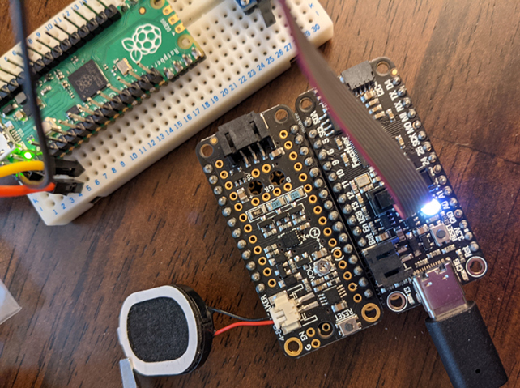](https://circuitpython.org/)

It's Feather RP2040 time. I have been doing various things in this port, such as enabling MP3 playback (only works for very low bitrate MP3s, try mono and 32kbit/s; you can it up to about 20 minutes of audio on the Feather's built-in flash at this compression ratio though!), fixing problems with how CircuitPython initialized the built in real-time clock, and documented how to install the debugging header on the Adafruit Feather RP2040 on the Learn system.

**Kattni**

This week I updated [the AMG8833 thermal camera guide](https://learn.adafruit.com/adafruit-amg8833-8x8-thermal-camera-sensor) for the STEMMA QT revision of the board. The guide now includes updated images, pinouts and wiring diagrams. You can pick one up in the [Adafruit shop](https://www.adafruit.com/product/3538) and check out the guide to get started.

I also published the [Feather RP2040 guide](https://learn.adafruit.com/adafruit-feather-rp2040-pico), which includes everything you need to get started using your new [Feather](https://www.adafruit.com/product/4884). The Pinouts page is especially detailed to keep up with the pins on the RP2040 having so many different functions. They are listed by pin name, with details about each pin, and by function (e.g. I2C, SPI, etc), so you can easily figure out what you're looking for by pin name or by function.

We continued the Pylint update by finishing up the PRs on the libraries skipped by the initial patch. We found that Pylint was failing significantly on libraries with `tests` directories. So, we set up a separate pre-commit hook to handle running Pylint on test files, similar to how we run it on example code. There's still a bit left to do on this project, but we're nearing the end.

Finally, thanks to Dylan for updating our Adabot script to only report a library as needing a release when the code, documentation, or packaging changes. This will reduce unnecessary work for everyone when using the Adabot check to keep up with releases, as changes to the CI (continuous integration) do not require a release.

**Lucian**

This past week I've been digging into low power performance on the STM32, extracting the RTC module out from the port functions so that it can be used to wake from low power modes. Since entering the lowest possible power state of "Standby" for deep sleep disrupts both USB and external debuggers like the JLink, I've been using a logic analyzer to visualize the timing of the interrupts as they occur, so I can better debug problems with staying in deep sleep mode. 

I've also been considering requests for altering the clock settings of Circuitpython on boot, so that projects can use overclocking or underclocking to do things like boosting performance or lowering electrical noise. This has some complications about how it would affect peripherals across different ports, but could be a powerful feature.

**Melissa**

This past week I started with looking into a guide I had written for running Google Assistant as we were getting reports of it not running. It turns out that I didn't specify that users should be running the lite version and the ones having issues were running the desktop version. I updated the guide with this information.

I worked on some memory issues that users were experiencing with the MatrixPortal due to some libraries getting new features and some areas that could have used some optimization. After updating it, I had some scripts that were crashing run in a much more stable manner.

I worked on updating the RPLIDAR driver to work with some of the newer units shipping with updated firmware. Unfortunately, this was proving to be extra challenging because they Slamtec did not provide the newer firmware on their website for updating older units. So it relied on following available documentation, making sure it didn't break the older firmware, and having users with newer firmware test it for me.

I also started working on a guide for the 2.13" eInk displays. This included writing a new driver for the SSD1680 chip which the updated feather from last year also uses. Be sure to watch new guides and keep an eye out for it.

**Scott**

This week I've been focused on improving flash chip support in CircuitPython for the RP2040 specifically. I've rewritten the flash init code from assembly into C to make it easier to maintain. I also hacked a Feather RP2040 to use a [SOIC socket](https://www.adafruit.com/product/4726) to allow me to swap different flash chips without needing to solder them down. I also soldered in wires so I can capture the SPI traffic to analyze it. This is *very very* helpful when debugging flash init code and other bugs.

My hope is to get a PR out by this time next week to optimize for different flash chips with the RP2040.

## Upcoming events!

The 2021 Open Hardware summit will be held online, Friday April 9, 2021. The summit will be livestreamed, but ticket holders will have access to additional interactive portions of the summit like meet-and-greets, workshops, and sponsor booths. Find details, including ticket and sponsorship information at [2021.oshwa.org](https://2021.oshwa.org/) - [OSHWA](https://www.oshwa.org/2020/11/16/announcing-the-2021-open-hardware-summit/).

The online GeoPython conference is focused on Python and Geo, its toolkits and applications. April 22-23, 2021 - [https://2021.geopython.net/](https://2021.geopython.net/).

PyCon US, the annual official annual Python gathering, has been announced to be held online May 12-15, 2021. Sprints will be held May 16-18, 2021. More information and signups at [https://us.pycon.org/2021/](https://us.pycon.org/2021/)

EuroPython, the largest conference for the Python programming language in Europe, has been announced to be held online July 26 - August 1, 2021. More information at [https://ep2021.europython.eu/](https://ep2021.europython.eu/)

Call for proposals for PyOhio 2021 runs from March 15 - April 19, 2021 with the free event on July 31, 2021- [PyOhio.org](https://www.pyohio.org/2021/) via [Twitter](https://twitter.com/PyOhio/status/1370184124460367881).

**Send Your Events In**

As for other events, with the COVID pandemic, most in-person events are postponed or cancelled. If you know of virtual events or events that may occur in the future, please let us know on Discord or on Twitter with hashtag #CircuitPython.

## Latest releases

CircuitPython's stable release is [6.1.0](https://github.com/adafruit/circuitpython/releases/latest) and its unstable release is [6.2.0-beta.3](https://github.com/adafruit/circuitpython/releases). New to CircuitPython? Start with our [Welcome to CircuitPython Guide](https://learn.adafruit.com/welcome-to-circuitpython).

[20210314](https://github.com/adafruit/Adafruit_CircuitPython_Bundle/releases/latest) is the latest CircuitPython library bundle.

[v1.14](https://micropython.org/download) is the latest MicroPython release. Documentation for it is [here](http://docs.micropython.org/en/latest/pyboard/).

[3.9.2](https://www.python.org/downloads/) is the latest Python release. The latest pre-release version is [3.10.0a6](https://www.python.org/download/pre-releases/).

[2,339 Stars](https://github.com/adafruit/circuitpython/stargazers) Like CircuitPython? [Star it on GitHub!](https://github.com/adafruit/circuitpython)

## Call for help -- Translating CircuitPython is now easier than ever!

One important feature of CircuitPython is translated control and error messages.

With the help of fellow open source project [Weblate](https://weblate.org/), we're making it even easier to add or improve translations.

Sign in with an existing account such as Github, Google or Facebook and start contributing through a simple web interface. No forks or pull requests needed!

As always, if you run into trouble join us on [Discord](https://adafru.it/discord), we're here to help.

## jobs.adafruit.com - Find a dream job, find great candidates!

[jobs.adafruit.com](https://jobs.adafruit.com/) has returned and folks are posting their skills (including CircuitPython) and companies are looking for talented makers to join their companies - from Digi-Key, to Hackaday, Microcenter, Raspberry Pi and more.

## ICYMI - In case you missed it

The wonderful world of Python on hardware! This is our Python video-newsletter-podcast! The news comes from the Python community, Discord, Adafruit communities and more and is reviewed on ASK an ENGINEER Wednesdays. The complete Python on Hardware weekly videocast [playlist is here](https://www.youtube.com/playlist?list=PLjF7R1fz_OOXRMjM7Sm0J2Xt6H81TdDev). 

This video podcast is on [iTunes](https://itunes.apple.com/us/podcast/python-on-hardware/id1451685192?mt=2), [YouTube](http://adafru.it/pohepisodes), [IGTV (Instagram TV](https://www.instagram.com/adafruit/channel/)), and [XML](https://itunes.apple.com/us/podcast/python-on-hardware/id1451685192?mt=2).

[Weekly community chat on Adafruit Discord server CircuitPython channel - Audio / Podcast edition](https://itunes.apple.com/us/podcast/circuitpython-weekly-meeting/id1451685016) - Audio from the Discord chat space for CircuitPython, meetings are usually Mondays at 2pm ET, this is the audio version on [iTunes](https://itunes.apple.com/us/podcast/circuitpython-weekly-meeting/id1451685016), Pocket Casts, [Spotify](https://adafru.it/spotify), and [XML feed](https://adafruit-podcasts.s3.amazonaws.com/circuitpython_weekly_meeting/audio-podcast.xml).

And lastly, we are working up a one-spot destination for all things podcast-able here - [podcasts.adafruit.com](https://podcasts.adafruit.com/)

## Contribute!

The CircuitPython Weekly Newsletter is a CircuitPython community-run newsletter emailed every Tuesday. The complete [archives are here](https://www.adafruitdaily.com/category/circuitpython/). It highlights the latest CircuitPython related news from around the web including Python and MicroPython developments. To contribute, edit next week's draft [on GitHub](https://github.com/adafruit/circuitpython-weekly-newsletter/tree/gh-pages/_drafts) and [submit a pull request](https://help.github.com/articles/editing-files-in-your-repository/) with the changes. You may also tag your information on Twitter with #CircuitPython. 

Join our [Discord](https://adafru.it/discord) or [post to the forum](https://forums.adafruit.com/viewforum.php?f=60) for any further questions.
