- [ ] Kattni updates
- [ ] change date
- [ ] update title
- [ ] Feature story
- [ ] Update  for images
- [ ] Update ICYDNCI
- [ ] All images 550w max only
- [ ] Link "View this email in your browser."

View this email in your browser.

Presented for your reading enjoyment: the latest chonky goodness that is the Python on Microcontrollers newsletter, brought you by the community! We're on [Discord](https://discord.gg/HYqvREz), [Twitter](https://twitter.com/search?q=circuitpython&src=typed_query&f=live), and for past newsletters - [view them all here](https://www.adafruitdaily.com/category/circuitpython/). If you're reading this on the web, [subscribe here](https://www.adafruitdaily.com/). 

## Python snakes its way to the new Texas Instruments TI-84 Plus CE Python Graphing Calculator running a CircuitPython fork!

[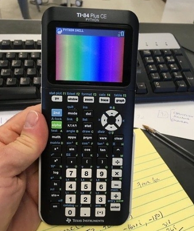](https://blog.adafruit.com/2021/05/20/python-snakes-its-way-to-the-ti-84-plus-ce-python-graphing-calculator-by-texas-instruments-runs-circuitpython-ticalculators/)

The new TI-84 Plus CE Python Graphing Calculator by Texas Instruments runs a private CircuitPython fork! 

[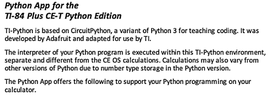](https://education.ti.com/download/en/ed-tech/D278A0ACF2D448BC8FC2D94EF50DD8FD/5B7841F423E840ED8EA545DC372276DD/TI-84_Plus_CE-T_EN.pdf)

[THIS LINK](https://education.ti.com/en/products/calculators/graphing-calculators/ti-84-plus-ce-python) goes to the USA site and it says you can sign up for alerts (but not purchase yet?) and [THIS LINK](https://education.ti.com/en-gb/products/calculators/graphing-calculators/ti-84-plus-ce-t-python) goes to the UK site and it’s available for purchase. 

Read more and follow developments as they are known - [Adafruit Blog](https://blog.adafruit.com/2021/05/20/python-snakes-its-way-to-the-ti-84-plus-ce-python-graphing-calculator-by-texas-instruments-runs-circuitpython-ticalculators/)

hackster.io News discusses the TI-84 Plus CE Python calculator, CircuitPython, and available modules - [hackster.io](https://www.hackster.io/news/texas-instruments-is-releasing-a-new-graphing-calculator-with-circuitpython-c065a8e5714a).

## More Coverage of Using CircuitPython Drivers on MicroPython on the Raspberry Pi Pico

More coverage of the headline in [the last newsletter](https://www.adafruitdaily.com/2021/05/18/python-on-microcontrollers-newsletter-faster-python-circuitpython-merges-and-more-python-adafruit-circuitpython-micropython-thepsf/) on using CircuitPython drivers on MicroPython on the Raspberry Pi Pico:

[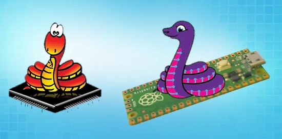](https://www.tomshardware.com/uk/news/circuitpython-libraries-come-to-micropython-on-pico)

CircuitPython Libraries Slither Into MicroPython on the Raspberry Pi Pico - [Tom's Hardware](https://www.tomshardware.com/uk/news/circuitpython-libraries-come-to-micropython-on-pico).

[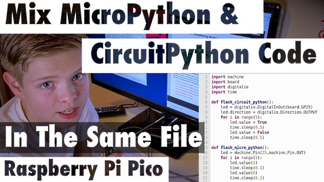](https://www.youtube.com/watch?v=l254lxm78I4)

Mix Both MicroPython & CircuitPython Code In The Same File On a Raspberry Pi Pico with Blinka - [YouTube](https://www.youtube.com/watch?v=l254lxm78I4) and [Twitter](https://twitter.com/GurgleApps/status/1395723911631867908).

Pimoroni has baked in CircuitPython Blinka and PlatformDetect libraries into their MicroPython helper library - [GitHub](https://github.com/pimoroni/pimoroni-pico/releases/tag/v0.2.1) and [Twitter Thread](https://twitter.com/Gadgetoid/status/1395379204188000261).

## Disable CircuitPython USB devices in boot.py

With the upcoming CircuitPython version 7.x, you'll be able to selectively disable the many USB devices it creates (e.g. CIRCUITPY drive & USB serial).

Read more in the new guide [Customizing USB Devices in CircuitPython](https://learn.adafruit.com/customizing-usb-devices-in-circuitpython) and via the [Adafruit Blog](https://blog.adafruit.com/2021/05/20/customizing-usb-devices-in-circuitpython-adafruit-circuitpython-keyboard/).

Example code by Tod Kurt - [Twitter](https://twitter.com/todbot/status/1394484233482035200) and [GitHub](https://gist.github.com/todbot/707e4e3d393313cf31cdab56bf9d4255).

## Adafruit Squeezes the Power of the RP2040 Into a USB key

On the [Desk of Ladyada](https://www.youtube.com/playlist?list=PLjF7R1fz_OOXUtaFu7-_D1UCugC8OecKv), Limor discusses development of the Adafruit Trinkey RP2040 with QT connector - [YouTube](https://www.youtube.com/watch?v=PIhUpL8eyQI).

> We've wanted to have something that plugs into a USB A port and provides a QT port for a while. But since we want it to support any and all QT boards, we need more RAM and storage than the SAMD21 can provide. We probably cannot buy any SAMD51's for like a year - but RP2040 is a good option! Lots of RAM and we stuck an 8MB flash on there. The idea is you can attach a QT sensor or whatever on top with some nylon standoffs, maybe it will even auto-detect which sensors are plugged in! We made the boot button a user-button too, thanks to a li'l diode friend.

Tom's Hardware reviews the Adafruit QT 2040 Trinkey - [Tom's Hardware](https://www.tomshardware.com/news/adafruit-rp2040-trinkey-prototype)

## Arduino Nano RP2040 Connect Now Runs CircuitPython

[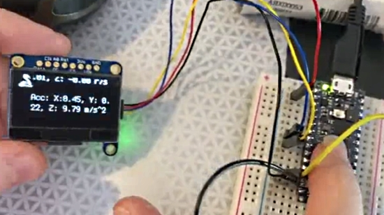](https://youtu.be/ppFYk1YdDjo)

Liz ([@BlitzCityDIY](https://twitter.com/BlitzCityDIY)) [submitted a PR](https://twitter.com/BlitzCityDIY/status/1396516841246298113) to add support for the [Arduino Nano RP2040 Connect](https://www.tomshardware.com/news/first-pi-silicon-arduino-nano-rp2040-connect-spotted) to CircuitPython! So far so good, the digital pins all toggle right and see the built in LSM6DSOX chip on the I2C port. There is a driver for this IMU so the video has quick demo: an external OLED wired up on the same I2C bus, reading acceleration/gyro data and displaying it - [YouTube](https://youtu.be/ppFYk1YdDjo)

## The Python Software Foundation News

### Second Quarter 2021 Fundraiser

PyLadies Brazil co-founder, Débora Azevedo, can capture her feelings about our Python community in one word: Belonging - [Python.org](https://mailchi.mp/python.org/you-made-it-possible?e=9b20e3624a).

Débora stumbled upon her love for programming accidentally. “I pursued a computer networking course because I didn’t want to code,” she said. “But when I learned Python, I had this empowered feeling that I could really build something.”

Thanks to community support, the PSF has provided more than 651 PyCon scholarships and travel grants to community members, like Débora, and $2,804,281 in grants to Python projects across 91 countries, over the past twenty years.

You made this possible. You built this incredible community and sustained it for more than twenty years. You helped us come this far.

To continue this growth, The Python Software Foundation needs your help raising $80,000 by June 12th. Giving: [Python Software Foundation](https://psfmember.org/civicrm/contribute/transact?reset=1&id=33)

### The 2021 Python Language Summit: Lightning Talks, Round 1

The first day of the 2021 Python Language Summit finished with a series of lightning talks from Petr Viktorin, Lorena Mesa, Scott Shawcroft, and Jeff Allen.

CircuitPython is a much smaller version of Python that runs on microcontrollers. Scott Shawcroft compared what's included in CircuitPython and CPython to give a sense of what is central to users' experience of Python. Read more - [PSF Blog](https://pyfound.blogspot.com/2021/05/the-2021-python-language-summit_22.html).

## CircuitPython Deep Dive Stream with Scott Shawcroft

[This week](https://youtu.be/QCnK75ZFbIs), Scott streams his work on BLE workflow.

You can see the latest video and past videos on the Adafruit YouTube channel under the Deep Dive playlist - [YouTube](https://www.youtube.com/playlist?list=PLjF7R1fz_OOXBHlu9msoXq2jQN4JpCk8A).

## News from around the web!

[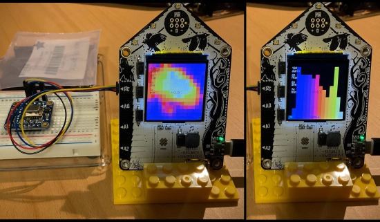](https://twitter.com/CedarGroveMakr/status/1394536663917809673)

Testing the AMG8833 thermal camera CircuitPython code on the Adafruit FunHouse. Interested to see if the ESP32-S2 speed and memory capacity will allow upscaling the 8x8 sensor array beyond the current 2x bilinear interpolation whilst maintaining a reasonable frame rate - [Twitter](https://twitter.com/CedarGroveMakr/status/1394536663917809673).

[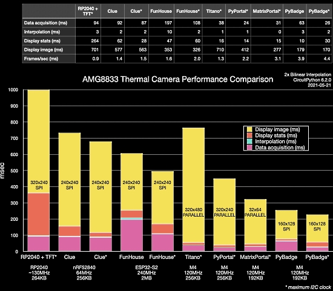](https://twitter.com/CedarGroveMakr/status/1395942200287006722)

[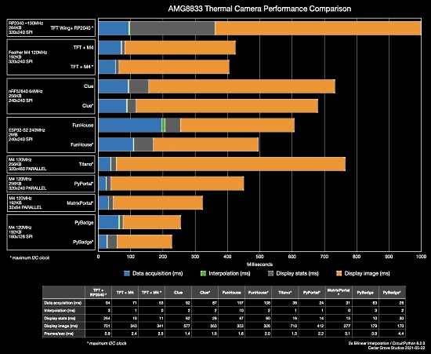](https://twitter.com/CedarGroveMakr/status/1396237349504253952)

[@CedarGrove](https://twitter.com/CedarGroveMakr) also looks at the display speed on a range of Adafruit microcontroller boards with displays, both with standard and maximum I2C clocks. The Adafruit PyBadge comes out on top! - [Twitter](https://twitter.com/CedarGroveMakr/status/1395942200287006722).

KMK is a feature-rich and beginner-friendly firmware for computer keyboards written and configured in CircuitPython - [GitHub](https://github.com/KMKfw/kmk_firmware).

[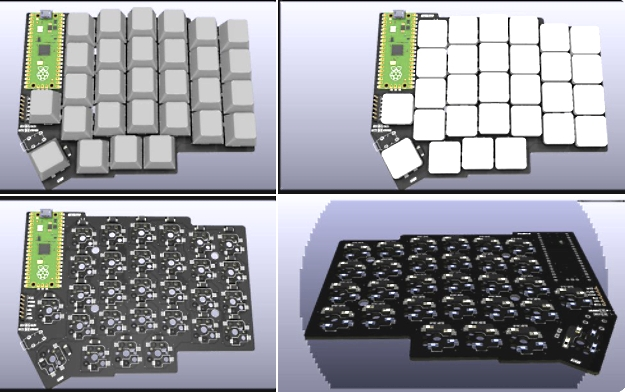](https://twitter.com/protobits/status/1393276414158331910)

The Goji Keeb is a keyboard based on a Raspberry Pi Pico and Lily58 Pro design. The PCB is reversible and supports Cherry MX / Kailh Switch Choc switches and sockets. It is designed to support a Pimoroni Display Pack as optional addon. It uses the KMK firmware above - [Twitter](https://twitter.com/protobits/status/1393276414158331910).

Thea at Winterbloom: The tools and tech I use to run a one-woman hardware company - [Thea's Blog](https://blog.thea.codes/winterblooms-tech-stack/).

The Make: Boards Guide Reviews the Adafruit Funhouse - [Makezine](https://makezine.com/products/boards/adafruit-funhouse/).

The May 14th Microsoft Reactor Q&A with Guido van Rossum, Inventor of Python - [YouTube](https://www.youtube.com/watch?v=aYbNh3NS7jA).

Derek Banas's jam-packed CircuitPython tutorial video featuring 15 real world projects using the [Circuit Playground Express](https://www.adafruit.com/product/3333), [Circuit Playground Bluefruit](https://www.adafruit.com/product/4333), [Adafruit Crickit](https://www.adafruit.com/product/3093), [Gizmo Display](https://www.adafruit.com/product/4367), ultrasonic sensors, IR remotes, servos, motors, NeoPixels and numerous sensors - [YouTube](https://www.youtube.com/watch?v=opes_7Uf49U).

A CircuitPython program running on an [Adafruit CLUE](https://www.adafruit.com/product/4500) with four passive components replicating the "octopus circuit" from the component tester (found on oscilloscopes) to identify passive components - [YouTube](https://www.youtube.com/watch?v=HZroEl_Y6d4).

[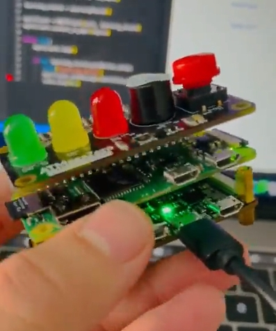](https://twitter.com/4hackrr/status/1394676102430445571)

Sharing the same shield using a Raspberry Pi Zero and the new ATMegaZero ESP32-S2,  communicating via MQTT - [Twitter](https://twitter.com/4hackrr/status/1394676102430445571).

[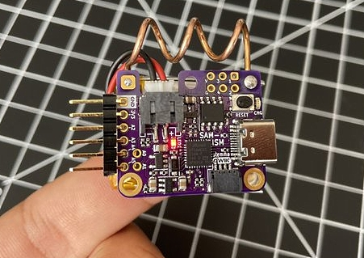](https://twitter.com/jordiprlando/status/1394682920057458688)

SAM-ISM: Born of a desire for a tiny dev board with integrated packet radio, SAM-ISM carries a RFM69 module on its back and a 915MHz antenna on its side. And it runs CircuitPython - [Twitter](https://twitter.com/jordiprlando/status/1394682920057458688).

CircuitPython BLE Midi On Windows - [ElectroMaker](https://www.electromaker.io/project/view/circuit-python-ble-midi-on-windows).

[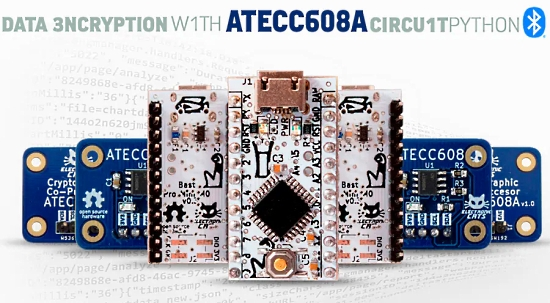](https://www.hackster.io/sabas1080/data-encryption-with-atecc608a-and-circuitpython-bf2e79)

Data Encryption with ATECC608A and CircuitPython - [hackster.io](https://www.hackster.io/sabas1080/data-encryption-with-atecc608a-and-circuitpython-bf2e79).

Elecia White [gave a talk](https://www.embeddedonlineconference.com/session/Buried_Treasure_and_Map_Files) at the Embedded Online Conference 2021 about how to use memory map files. The talk includes looking at the memory map for CircuitPython on a SAMD21 processor - [embedded.fm](https://embedded.fm/blog/mapfiles).

> CircuitPython is my “go to” for teaching people how to program. I have had so many friends that want to learn how to program, and they always want to learn something “useful” like React first, because that’s what people are using at work. But, you have to crawl before you can walk, and the simplicity of a computer without an OS or complicated libraries is a great place to start. Make a light blink. If button is pressed, turn a light on. And before you know it, you can press buttons and have music play, or send a tweet to Twitter, etc... I like the [Circuit Playground (Express)](https://learn.adafruit.com/adafruit-circuit-playground-express) for getting started: It has a lot you can do without attaching external devices - [Adafruit Blog](https://blog.adafruit.com/2021/05/21/circuitpython-the-go-to-for-teaching-people-how-to-program-circuitpython-hackernews/) and [Hacker News](https://news.ycombinator.com/item?id=27205907).

[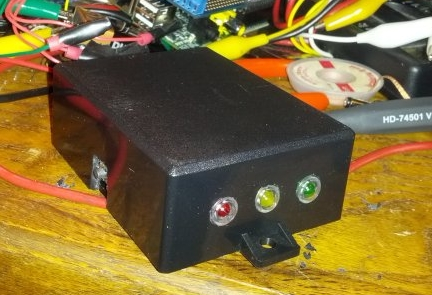](https://twitter.com/bink/status/1396484364217634816)

A Dog Food Timer - [Twitter](https://twitter.com/bink/status/1396484364217634816).

> The code for this project was ported from Arduino to CircuitPython. I wasn't happy with the button logic until I found that the CircuitPlayground module will return all debounced-as-pressed buttons as a set. This gives me exactly one function call per button click.

[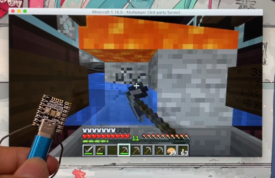](https://akkiesoft.hatenablog.jp/entry/20210523/1621778666)

Create a macro keyboard for Minecraft with RP2040 and CircuitPython - [Akii Diary](https://akkiesoft.hatenablog.jp/entry/20210523/1621778666), [Twitter](https://twitter.com/Akkiesoft/status/1396468556313763846) and [YouTube](https://www.youtube.com/watch?v=P5iPPrDTLQ8) (Japanese).

[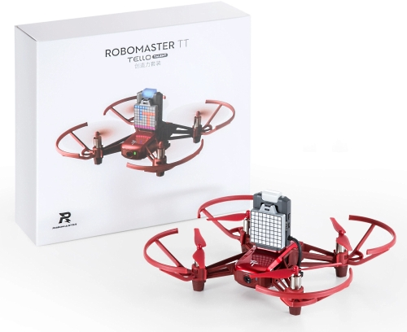](https://dronedj.com/2021/05/18/dji-releases-new-smarter-robomaster-tello-talent-drone/)

DJI releases a new, smarter, Robomaster Tello Talent drone. The $239 drone has an ESP32 microcontroller board to provide Arduino and MicroPython open-source coding platforms - [DroneDJ](https://dronedj.com/2021/05/18/dji-releases-new-smarter-robomaster-tello-talent-drone/).

Build a Mute/Unmute Button for your Video Calls with a Raspberry Pi Pico and MicroPython - [Twilio Blog](https://www.twilio.com/blog/mute-unmute-button-video-calls-raspberry-pi-pico-micropython).

Embedded Python: Build a Game on the BBC micro:bit - [Real Python](https://realpython.com/embedded-python/)

minipip: a tool for installing distribution packages for MicroPython and CircuitPython - [GitHub](https://github.com/aivarannamaa/minipip) and [Adafruit Forums](https://forums.adafruit.com/viewtopic.php?f=60&t=179378).

updizombie: Controlling 0/1-series AVRs live via Python. Imagine running python code on a microcontroller without actually running the code on the microcontroller. No compiling, no memory limits, just UART - [GitHub](https://github.com/chris-heo/updizombie) and [YouTube](https://www.youtube.com/watch?v=_P3E_l8vl1U).

[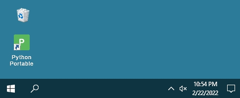](https://www.portabledevapps.net/python-portable.php)

Python Portable is a portable version of Python / Spyder for Windows. Modules installed include Matplotlib, Pandas, Numpy, Sympy, Scipy, Cython, QtPy, Qtconsole and more. All files reside in a single folder, nothing is written to system files/registry, delete by deleting the install folder - [portabledevapps](https://www.portabledevapps.net/python-portable.php).

Build a Bulk File Rename Tool With Python and PyQt - [Real Python](https://realpython.com/bulk-file-rename-tool-python/).

Handling exceptions in Python like a pro - [Latrova](https://blog.guilatrova.dev/handling-exceptions-in-python-like-a-pro/).

[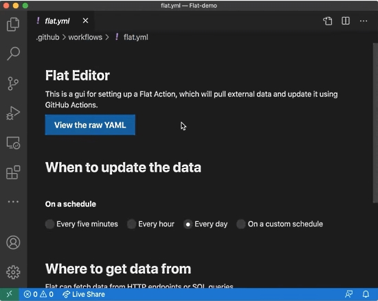](https://octo.github.com/projects/flat-data)

Flat Data - Flat explores how to make it easy to work with data in git and GitHub. It builds on the “git scraping” approach pioneered by Simon Willison to offer a simple pattern for bringing working datasets into your repositories and versioning them, because developing against local datasets is faster and easier than working with data over the wire - [GitHub](https://octo.github.com/projects/flat-data).

Floppinux - An Embedded Linux on a Single Floppy - [bits.p1x.in](https://bits.p1x.in/floppinux-an-embedded-linux-on-a-single-floppy/).

How Open Source is Fueling Space Exploration - [CXO Today](https://www.cxotoday.com/hardware-software-development/how-open-source-is-fueling-space-exploration/).

> Carol Willing, a core contributor to Python. “That’s one of the beauties of open source; someone else can take your good work and make it even more powerful and meaningful.”

[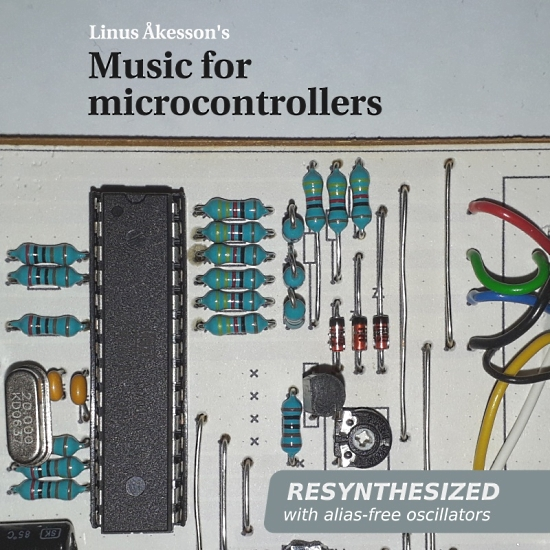](http://www.linusakesson.net/music/for-microcontrollers/index.php)

Linus Åkesson's Music For Microcontrollers from 2007–2010 has been resynthesized in high fidelity. Enjoy crisp alias-free renditions of these songs on your favourite streaming music platform, or grab the mp3 files! - [linusakesson.net](http://www.linusakesson.net/music/for-microcontrollers/index.php).

PyDev of the Week: Cooper Lees from [Mouse vs Python](https://www.blog.pythonlibrary.org/2021/05/24/pydev-of-the-week-cooper-lees/)

CircuitPython Weekly Meeting for May 24th, 2021 [on YouTube](https://youtu.be/DHSYtjtEkL4) and [notes](https://github.com/adafruit/adafruit-circuitpython-weekly-meeting/blob/master/2021/2021-05-24.md)

#ICYDNCI What was the most popular, most clicked link, in [last week's newsletter](https://www.adafruitdaily.com/2021/05/18/python-on-microcontrollers-newsletter-faster-python-circuitpython-merges-and-more-python-adafruit-circuitpython-micropython-thepsf/)? [New book out: Programming Microcontrollers with Python](https://blog.adafruit.com/2021/05/14/new-book-out-programming-microcontrollers-with-python-book-circuitpython-armstrongsubero/).

## Coming soon

[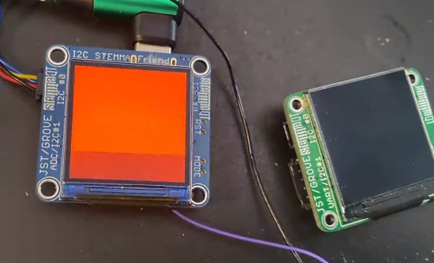](https://youtu.be/5mzlP_6rZ7w)

Ladyada respind the STEMMA Friend design from a SAMD21 to an RP2040 to take advantage of the more-powerful chip, to make it CircuitPython-friendlier and faster at doing stuff like I2C sniffing. While porting over the Arduino code (which pretty much works just fine, she noticed the display was a little sluggish due to SPI data being sent over one byte at a time with a delay. So she added a bulk-transfer SPI function to the Philhower RP2040 core to take advantage of the pico-sdk's buffered writes - it's now 10x faster! - [YouTube](https://youtu.be/5mzlP_6rZ7w).

## New Boards Supported by CircuitPython

The number of supported microcontrollers and Single Board Computers (SBC) grows every week. This section outlines which boards have been included in CircuitPython or added to [CircuitPython.org](https://circuitpython.org/).

This week, there were 2 new boards added!

- [Rock Pi 4C](https://circuitpython.org/blinka/rock_pi_4c/)
- [Rock Pi E](https://circuitpython.org/blinka/rock_pi_e/)

Looking to add a new board to CircuitPython? It's highly encouraged! Adafruit has four guides to help you do so:

- [How to Add a New Board to CircuitPython](https://learn.adafruit.com/how-to-add-a-new-board-to-circuitpython/overview)
- [How to add a New Board to the circuitpython.org website](https://learn.adafruit.com/how-to-add-a-new-board-to-the-circuitpython-org-website)
- [Adding a Single Board Computer to PlatformDetect for Blinka](https://learn.adafruit.com/adding-a-single-board-computer-to-platformdetect-for-blinka)
- [Adding a Single Board Computer to Blinka](https://learn.adafruit.com/adding-a-single-board-computer-to-blinka)

## New Learn Guides!

[CircuitPython Libraries on MicroPython using the Raspberry Pi Pico](https://learn.adafruit.com/circuitpython-libraries-on-micropython-using-the-raspberry-pi-pico) from [Melissa LeBlanc-Williams](https://learn.adafruit.com/users/MakerMelissa)

[Pet Bowl Water Level Sensing](https://learn.adafruit.com/pet-bowl-water-level-sensing-with-the-funhouse-and-home-assistant) from [Melissa LeBlanc-Williams](https://learn.adafruit.com/users/MakerMelissa)

[Raspberry Pi Low-Light Long-Exposure Photography](https://learn.adafruit.com/raspberry-pi-hq-camera-low-light-long-exposure-photography) from [Phil Moyer](https://learn.adafruit.com/users/hukuzatuna)

[Adabox 018](https://learn.adafruit.com/adabox018) from [John Park](https://learn.adafruit.com/users/johnpark)

[Customizing USB Devices in CircuitPython](https://learn.adafruit.com/customizing-usb-devices-in-circuitpython) from [Dan Halbert](https://learn.adafruit.com/users/danhalbert)

## CircuitPython Project Bundle

When you get to the CircuitPython code section of an [Adafruit Learn Guide](https://learn.adafruit.com/), sometimes things can get a bit complicated. You not only have the code you need to upload to your device, but you likely also need to add some libraries that the code requires to run. This involved downloading all the libraries, digging through to find the ones you need, and copying them to your device. That was only the beginning on some projects, as those that include images and/or sound files required further downloading and copying of files. But, not anymore!

Now, with Project Bundles, you can download all the necessary code, libraries and, if needed, asset files with one click! We automatically check which libraries are required for the project and bundle them up for you. No more digging through a huge list of libraries to find the ones you need, or fiddling with looking for other files or dependencies. Download the Project Bundle, copy the contents to your device, and your code will simply work. We wanted to make this the easiest way to get a project working, regardless of whether you're a beginner or an expert. We'll also be adding this feature to popular IDEs as an add-on. Try it out with any Circuit Python guide on the Adafruit Learning System. Just look for the ‘Download Project Bundle’ button on the code page. 

**To download and use a Project Bundle:**

In the Learning System - above any embedded code in a guide in the Adafruit Learn System, you’ll find a Download Project Bundle button.

Click the button to download the Project Bundle zip.

Open the Project Bundle zip to find the example code, all necessary libraries, and, if available, any images, sounds, etc.

Simply copy all the files over to your CIRCUITPY drive, and you’re ready to go!

If you run into any problems or bugs, or would like to submit feedback, please file an issue on the [Adafruit Learning System Guides GitHub repo](https://github.com/adafruit/Adafruit_Learning_System_Guides/issues).

## CircuitPython Libraries!

CircuitPython support for hardware continues to grow. We are adding support for new sensors and breakouts all the time, as well as improving on the drivers we already have. As we add more libraries and update current ones, you can keep up with all the changes right here!

For the latest libraries, download the [Adafruit CircuitPython Library Bundle](https://circuitpython.org/libraries). For the latest community contributed libraries, download the [CircuitPython Community Bundle](https://github.com/adafruit/CircuitPython_Community_Bundle/releases).

If you'd like to contribute, CircuitPython libraries are a great place to start. Have an idea for a new driver? File an issue on [CircuitPython](https://github.com/adafruit/circuitpython/issues)! Have you written a library you'd like to make available? Submit it to the [CircuitPython Community Bundle](https://github.com/adafruit/CircuitPython_Community_Bundle). Interested in helping with current libraries? Check out the [CircuitPython.org Contributing page](https://circuitpython.org/contributing). We've included open pull requests and issues from the libraries, and details about repo-level issues that need to be addressed. We have a guide on [contributing to CircuitPython with Git and Github](https://learn.adafruit.com/contribute-to-circuitpython-with-git-and-github) if you need help getting started. You can also find us in the #circuitpython channel on the [Adafruit Discord](https://adafru.it/discord).

You can check out this [list of all the Adafruit CircuitPython libraries and drivers available](https://github.com/adafruit/Adafruit_CircuitPython_Bundle/blob/master/circuitpython_library_list.md). 

The current number of CircuitPython libraries is **314**!

**Updated Libraries!**

Here's this week's updated CircuitPython libraries:

 * [Adafruit_CircuitPython_SHT4x](https://github.com/adafruit/Adafruit_CircuitPython_SHT4x)
 * [Adafruit_CircuitPython_seesaw](https://github.com/adafruit/Adafruit_CircuitPython_seesaw)
 * [Adafruit_CircuitPython_ProgressBar](https://github.com/adafruit/Adafruit_CircuitPython_ProgressBar)
 * [Adafruit_CircuitPython_SSD1306](https://github.com/adafruit/Adafruit_CircuitPython_SSD1306)
 * [Adafruit_CircuitPython_HTU31D](https://github.com/adafruit/Adafruit_CircuitPython_HTU31D)
 * [Adafruit_CircuitPython_CharLCD](https://github.com/adafruit/Adafruit_CircuitPython_CharLCD)
 * [Adafruit_CircuitPython_HTU21D](https://github.com/adafruit/Adafruit_CircuitPython_HTU21D)
 * [Adafruit_CircuitPython_MONSTERM4SK](https://github.com/adafruit/Adafruit_CircuitPython_MONSTERM4SK)
 * [Adafruit_CircuitPython_FakeRequests](https://github.com/adafruit/Adafruit_CircuitPython_FakeRequests)
 * [Adafruit_CircuitPython_FunHouse](https://github.com/adafruit/Adafruit_CircuitPython_FunHouse)
 * [Adafruit_CircuitPython_Pypixelbuf](https://github.com/adafruit/Adafruit_CircuitPython_Pypixelbuf)
 * [Adafruit_CircuitPython_NeoPixel](https://github.com/adafruit/Adafruit_CircuitPython_NeoPixel)
 * [Adafruit_CircuitPython_BME280](https://github.com/adafruit/Adafruit_CircuitPython_BME280)
 * [Adafruit_Blinka](https://github.com/adafruit/Adafruit_Blinka)
 * [CircuitPython_Community_Bundle](https://github.com/adafruit/CircuitPython_Community_Bundle)

## What’s the team up to this week?

What is the team up to this week? Let’s check in!

**Dan**

We have seen some RP2040 boards not be able to start CircuitPython from a power-cycle. Scott and I brainstormed on this, looking at Saleae traces of communication with the flash chip. This problem appears to be due to the crystal oscillator taking longer to start than expected, and I have a fix for that.

MacOS on the M1 does not return information about USB devices in the same way that MacOS on older Macs does. This caused the Mu beta not to be able to detect CircuitPython boards on M1 Macs. Neradoc came up with a fix for this, and I tested it on an M1 Mac and submitted a change to Mu to incorporate the fix.

I just finished a guide about [Customized USB Devices in CircuitPython](https://learn.adafruit.com/customized-usb-devices-in-circuitpython), which documents how to use the dynamic USB descriptor capability I added recently.

**Kattni**

Last week I attended PyCon - talks will be available on YouTube soon, if they're not already. I also hosted CircuitPython Development Sprints. Things were entirely virtual this year which made my usual way of doing things a bit more difficult. A couple of folks who already hard CircuitPython-compatible hardware joined me and had a great time, so it in the end it was worth it. I enjoyed diving into code which I haven't had a chance to do in a long time.

Earlier last week, I started the guide for the NeoKey Trinkey (which should be published by now). Later in the week, I started the guide for the Rotary Trinkey as well.

I helped Dylan get an Adabot patch going to add a feature to library PRs wherein GitHub displays a message linking to the Pylint/Black guide if your PR fails Pylint or Black. As well, we're adding a template to PRs with links to that guide, and the CircuitPython Design Guide to hopefully help folks before they submit the PR.

**Lucian**

This past week I merged in a number of the new structural changes for Alarm that have been in the works for a while, as well as getting the new STM32 Alarm module added into main. As the work on sleep finally wraps up, I've been taking power profiles of the various ports using the Monsoon and Nordic PPK2 power monitors.

Measuring the low-power performance of chips on dev boards that aren't specifically specialized for long battery life is an imperfect process - there are many parasitic components on the average dev board that can draw current over time, and without specific power saving hardware in place, there's no way to prevent them from shortening a device's battery life even when the MCU core is totally turned off. But I was encouraged to find that even on baseline Feather boards, all ports can hit hundreds of hours of battery life for an average Lipo using Deep Sleep, and power-optimized boards with a couple of AAA batteries can extend over a year, which is desirable for projects like environmental sensors and other isolated data logging devices.

I'm also reviewing and testing other upcoming power centric features, such as the changes to Status LED that Scott has been working on (which will reduce the draw from LED use after executing, while sleeping, and while using the REPL), and the upcoming Alarm module for the RP2040. 

**Melissa**

This past week, I finished up my Pet Water Bowl sensor guide for the FunHouse. This one was a little tricky because if there's constant current running through the board, the traces will start to oxidize which affects the readings. I got around this by using a GPIO pin on a second port on the FunHouse to send power to the Water Sensor and was able to control when it was on. You can [check out the guide](https://learn.adafruit.com/pet-bowl-water-level-sensing-with-the-funhouse-and-home-assistant).

I also wrote another guide. This one is about running Blinka and CircuitPython libraries over MicroPython on the Raspberry Pi Pico. It goes over setting everything up using the Thonny editor. Due to the limited space, I cover how to copy everything manually, but am hoping to streamline the process even more. The guide ended up being more popular than I expected. You can [see the guide here](https://learn.adafruit.com/circuitpython-libraries-on-micropython-using-the-raspberry-pi-pico).

**Scott**

This last week I've been wrapping up the status LED changes. It's very close to done and I fixed safe mode on the RP2040 along the way. Next, I'm dusting off the cobwebs from my previous attempt at BLE workflow. Antonio did an awesome test app last week that works with the prototype implementation so I'm excited to hook it up to the real thing. The protocol is [documented here](https://github.com/adafruit/Adafruit_CircuitPython_BLE_File_Transfer).

## Upcoming events!

EuroPython, the largest conference for the Python programming language in Europe, has been announced to be held online July 26 - August 1, 2021. More information at [https://ep2021.europython.eu/](https://ep2021.europython.eu/)

Call for proposals for PyOhio 2021 runs from March 15 - May 2, 2021 with the free event on July 31, 2021- [PyOhio.org](https://www.pyohio.org/2021/) via [Twitter](https://twitter.com/PyOhio/status/1370184124460367881).

Call for proposals for PyConline AU 2021 runs until June 10th, 2021 with the event held 10-12 September, 2021 - [pyconlineau](https://2021.pycon.org.au/)

**Send Your Events In**

As for other events, with the COVID pandemic, most in-person events are postponed or cancelled. If you know of virtual events or events that may occur in the future, please let us know on Discord or on Twitter with hashtag #CircuitPython.

## Latest releases

CircuitPython's stable release is [6.2.0](https://github.com/adafruit/circuitpython/releases/latest). New to CircuitPython? Start with our [Welcome to CircuitPython Guide](https://learn.adafruit.com/welcome-to-circuitpython).

[20210522](https://github.com/adafruit/Adafruit_CircuitPython_Bundle/releases/latest) is the latest CircuitPython library bundle.

[v1.15](https://micropython.org/download) is the latest MicroPython release. Documentation for it is [here](http://docs.micropython.org/en/latest/pyboard/).

[3.9.5](https://www.python.org/downloads/) is the latest Python release. The latest pre-release version is [3.10.0b1](https://www.python.org/download/pre-releases/).

[2,445 Stars](https://github.com/adafruit/circuitpython/stargazers) Like CircuitPython? [Star it on GitHub!](https://github.com/adafruit/circuitpython)

## Call for help -- Translating CircuitPython is now easier than ever!

One important feature of CircuitPython is translated control and error messages.

With the help of fellow open source project [Weblate](https://weblate.org/), we're making it even easier to add or improve translations.

Sign in with an existing account such as GitHub, Google or Facebook and start contributing through a simple web interface. No forks or pull requests needed!

As always, if you run into trouble join us on [Discord](https://adafru.it/discord), we're here to help.

## jobs.adafruit.com - Find a dream job, find great candidates!

[jobs.adafruit.com](https://jobs.adafruit.com/) has returned and folks are posting their skills (including CircuitPython) and companies are looking for talented makers to join their companies - from Digi-Key, to Hackaday, Micro Center, Raspberry Pi and more.

**Job of the Week**

Full-Time Lecturer position in Embedded Systems Design, University of Massachusetts Dartmouth - [Adafruit Jobs Board](https://jobs.adafruit.com/job/full-time-lecturer-position-in-embedded-systems-design/).

## 29,271 thanks!

The Adafruit Discord community, where we do all our CircuitPython development in the open, reached over 29,271 humans, thank you!  Adafruit believes Discord offers a unique way for CircuitPython folks to connect. Join today at [https://adafru.it/discord](https://adafru.it/discord).

## ICYMI - In case you missed it

The wonderful world of Python on hardware! This is our Python video-newsletter-podcast! The news comes from the Python community, Discord, Adafruit communities and more and is reviewed on ASK an ENGINEER Wednesdays. The complete Python on Hardware weekly videocast [playlist is here](https://www.youtube.com/playlist?list=PLjF7R1fz_OOXRMjM7Sm0J2Xt6H81TdDev). 

This video podcast is on [iTunes](https://itunes.apple.com/us/podcast/python-on-hardware/id1451685192?mt=2), [YouTube](http://adafru.it/pohepisodes), [IGTV (Instagram TV](https://www.instagram.com/adafruit/channel/)), and [XML](https://itunes.apple.com/us/podcast/python-on-hardware/id1451685192?mt=2).

[Weekly community chat on Adafruit Discord server CircuitPython channel - Audio / Podcast edition](https://itunes.apple.com/us/podcast/circuitpython-weekly-meeting/id1451685016) - Audio from the Discord chat space for CircuitPython, meetings are usually Mondays at 2pm ET, this is the audio version on [iTunes](https://itunes.apple.com/us/podcast/circuitpython-weekly-meeting/id1451685016), Pocket Casts, [Spotify](https://adafru.it/spotify), and [XML feed](https://adafruit-podcasts.s3.amazonaws.com/circuitpython_weekly_meeting/audio-podcast.xml).

And lastly, we are working up a one-spot destination for all things podcast-able here - [podcasts.adafruit.com](https://podcasts.adafruit.com/)

## Contribute!

The CircuitPython Weekly Newsletter is a CircuitPython community-run newsletter emailed every Tuesday. The complete [archives are here](https://www.adafruitdaily.com/category/circuitpython/). It highlights the latest CircuitPython related news from around the web including Python and MicroPython developments. To contribute, edit next week's draft [on GitHub](https://github.com/adafruit/circuitpython-weekly-newsletter/tree/gh-pages/_drafts) and [submit a pull request](https://help.github.com/articles/editing-files-in-your-repository/) with the changes. You may also tag your information on Twitter with #CircuitPython. 

Join our [Discord](https://adafru.it/discord) or [post to the forum](https://forums.adafruit.com/viewforum.php?f=60) for any further questions.
