- [X] Kattni updates
- [ ] change date
- [ ] update title
- [ ] Feature story
- [ ] Update  for images
- [ ] Update ICYDNCI
- [ ] All images 550w max only
- [ ] Link "View this email in your browser."Cancel changes

View this email in your browser.

Welcome to the latest Python on Microcontrollers newsletter, brought you by the community! We're on [Discord](https://discord.gg/HYqvREz), [Twitter](https://twitter.com/search?q=circuitpython&src=typed_query&f=live), and for past newsletters - [view them all here](https://www.adafruitdaily.com/category/circuitpython/). If you're reading this on the web, [subscribe here](https://www.adafruitdaily.com/). Let's get started!

## Python on hardware in Gartner Embedded Software and Systems report! Now in the “Slope of Enlightenment”

Research firm Gartner has noted that Python on hardware has passed all the hype and now is becoming mainstream in hardware development.

> “Position and Adoption Speed Justification: Python is a high-level programming language, suited to fast development and easy maintenance. MicroPython brought these advantages to an embedded environment and led to the creation of CircuitPython (which extends support to Adafruit’s popular range of embedded platforms) …” 
“Python was originally heralded as an ideal language for educational applications, being selected as the default development environment for the Raspberry Pi Foundation. MicroPython provides a subset of the Python language but replicates the structure and syntax so that developers can take their skills and their applications into low-end hardware. Support for MicroPython has been steadily increasing with the processing power available in embedded systems. We also see more API libraries and peripheral support being added.”
“User Advice: Adopt MicroPython to accelerate development and reduce development costs if time to market is critical. As an interpreted language, Python requires more processing power than low-level languages, so it requires boards with 32-bit microcontrollers. This limitation has become less important as IoT increasingly adopts 32-bit microcontrollers for most applications.”

Garter noticing Python on hardware is a big deal, and this is a report from last year, there is A LOT more that has happened and is happening now. From Python on calculators to 200+ boards Adafruit has that supports Python on hardware. It’s also worth noting that MicroPython moved to a better position in Garter’s report year over year (2019 to 2020 too). Gartner also did a good job summarizing why Python on hardware can accelerate development and reduce development costs.

More - [Adafruit Blog](https://blog.adafruit.com/2021/05/27/python-on-hardware-in-gartner-embedded-software-and-systems-report-now-in-the-slope-of-enlightenment/) and [Arduino Pro](https://www.arduino.cc/pro/why-pro#hype-cycle).

The Gartner report for Embedded Software and Systems is a free report – to get the report, you need to provide name, company, role, email, and agree that you’ve read the privacy policy and then you are taken to a link (it’s not a download of a report).

## CircuitPython 6.3.0 Release Candidate 0 Now Out!

[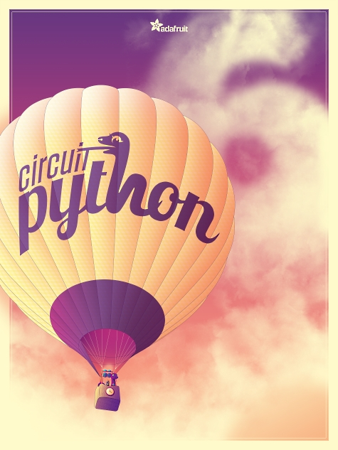](https://blog.adafruit.com/2021/05/25/circuitpython-6-3-0-release-candidate-0-released/)

CircuitPython 6.3.0 Release Candidate 0 (6.3.0-rc.0) is the first release candidate for the stable release of CircuitPython 6.3.0. Notable changes since 6.2.0 include many new boards, many corrections to existing boards, the addition of a consistent board.LED to most boards, and a timing fix for the certain samples of RP2040 boards.

[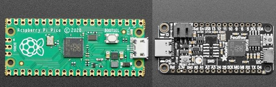](https://blog.adafruit.com/2021/05/25/circuitpython-6-3-0-release-candidate-0-released/)

Read more in the [Release Notes on GitHub](https://github.com/adafruit/circuitpython/releases) and on the [Adafruit Blog](https://blog.adafruit.com/2021/05/25/circuitpython-6-3-0-release-candidate-0-released/).

## CircuitPython snakes its way to the Arduino Nano RP2040 Connect

[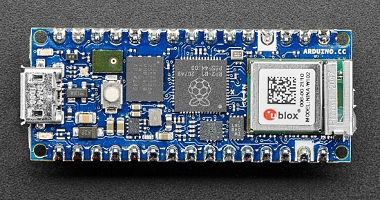](https://blog.adafruit.com/2021/05/27/circuitpython-snakes-its-way-to-the-arduino-nano-rp2040-connect-arduino-circuitpython/)

CircuitPython now runs on the new Arduino Nano RP2040 Connect - [Adafruit Blog](https://blog.adafruit.com/2021/05/27/circuitpython-snakes-its-way-to-the-arduino-nano-rp2040-connect-arduino-circuitpython/).

Get the software now on [CircuitPython.Org](https://circuitpython.org/board/arduino_nano_rp2040_connect/).

## Python back at second position on the TIOBE Programming Popularity Index

Last November, Python briefly swapped positions with Java for the second position in the TIOBE index. This month Python strikes again. The difference is only 0.13%, but it is reasonable to assume that Python will keep its second position for a longer time now. It might be even heading for the first place of the TIOBE index in the next half year, because C is (just like Java) losing popularity - [TIOBE](https://www.tiobe.com/tiobe-index/).

## Machine Learning on the Edge with Adafruit & Microsoft Lobe

[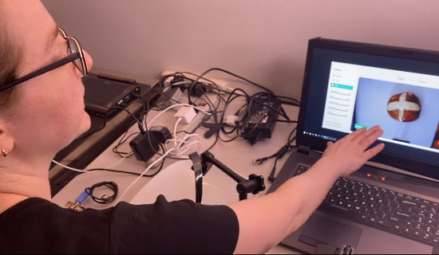](**https://www.tiobe.com/tiobe-index/**https://blog.adafruit.com/2021/05/29/bakery-machine-learning-on-the-edge-with-adafruit-microsoft-lobe/)

Machine learning is a transformative tool that’s redefining how we build software — but up until now, it was only accessible to a small group of experts. Adafruit thinks machine learning should be accessible to everyone, that’s why they partnered with Microsoft and their Lobe platform for an easy to use machine learning kit using the Adafruit Braincraft hardware for Raspberry Pi, to bring people's machine learning ideas to life – [video](https://youtu.be/O6KdTTdioTY).

Ladyada appeared in the Microsoft Build keynote with Kevin Scott, CTO of Microsoft - [YouTube](https://youtu.be/ML0s-T55VPA) and  more info on the [Adafruit Blog](https://blog.adafruit.com/2021/05/29/bakery-machine-learning-on-the-edge-with-adafruit-microsoft-lobe/)

## CircuitPython Deep Dive Stream with Scott Shawcroft

[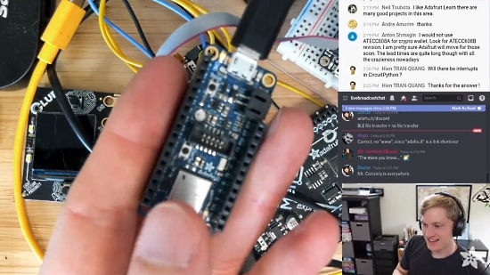](https://youtu.be/xBLlKkfjUaY)

[This week](https://youtu.be/xBLlKkfjUaY), Scott streams his work on BLE debugging.

You can see the latest video and past videos on the Adafruit YouTube channel under the Deep Dive playlist - [YouTube](https://www.youtube.com/playlist?list=PLjF7R1fz_OOXBHlu9msoXq2jQN4JpCk8A).

## News from around the web!

Catch John Park's CircuitPython Parsec videos every Monday, and catch back episodes - [YouTube Playlist](https://www.youtube.com/watch?v=1VyQ86nlFf4&list=PLjF7R1fz_OOWFqZfqW9jlvQSIUmwn9lWr).

Automating indoor air quality with Adafruit FunHouse CO2 Monitoring and CircuitPython - [Digi-Key](https://www.digikey.com/en/maker/projects/automating-indoor-air-quality-with-adafruit-funhouse-co2-monitoring/12393002f0644983823011ca1d72ddc1) and [Twitter](https://twitter.com/nlarson1981/status/1397554364122865679).

"How I monitor my greenhouse with CircuitPython and open source tools" - Keep track of your greenhouse's temperature, humidity, and ambient light using a microcontroller, sensors, CircuitPython and MQTT - [OpenSource](https://opensource.com/article/21/5/monitor-greenhouse-open-source).

Easy rainbow gradients in CircuitPython with the built-in adafruit_pypixelbuf.colorwheel() function. Here's it being demonstrated on an Adafruit Trinket M0, NeoPixel strip, and Perfect Circuit sticker diffuser - [Twitter](https://twitter.com/todbot/status/1397992493833097218).

[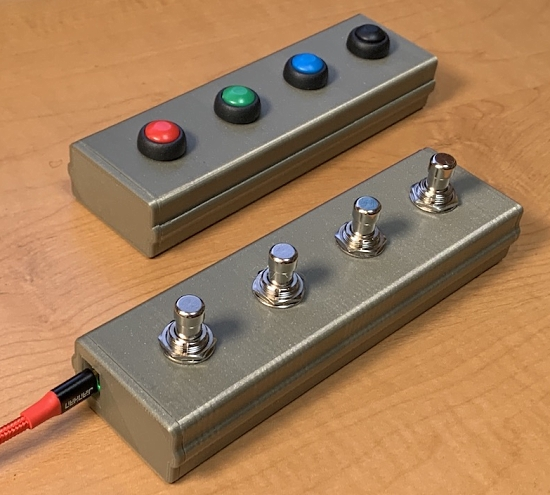](https://github.com/todbot/MIDIPedalBox)

MIDIPedalBox is a USB MIDI Pedal, powered by CircuitPython and an Adafruit Trinket M0 - [GitHub](https://github.com/todbot/MIDIPedalBox).

A rotating musical lithophane with 3D printing and CircuitPython  - [Twitter](https://twitter.com/MarkKomus/status/1309476596793909248).

IoT on Raspberry Pi Pico using CircuitPython and Adafruit IO - [Cytron.io](https://tutorial.cytron.io/2021/05/26/iot-on-raspberry-pi-pico-using-circuitpython-and-adafruit-io/), [YouTube](https://youtu.be/izhgg8RwOqE) and [Twitter](https://twitter.com/cytrontech/status/1397764498220621824).

> Using touch+hid libraries with the Adafruit Neo Trinkey to get keyboard typing was a breeze to setup. Thank you so much for the case and the guide @videopixil @ecken and @kattni! - [Twitter](https://twitter.com/flaviofdev/status/1399202303131926532) and [GitHub](https://github.com/flavio-fernandes/static-hid).

Using a Break Beam Sensor with Python and Raspberry Pi - [simonprickett.dev](https://simonprickett.dev/using-a-break-beam-sensor-with-python-and-raspberry-pi/), [YouTube](https://youtu.be/GdG2f0BwgtQ), and [Twitter](https://twitter.com/simon_prickett/status/1398337831144243200).

Tiny MIDI controller with Raspberry Pi Pico and CircuitPython - [4dcu.be](http://blog.4dcu.be/diy/2021/05/20/MIDIpad.html).

LEGO has released MicroPython documentation for the LEGO MINDSTORMS Inventor Hub. MicroPython can run on the Hub - [LEGO GitHub](https://lego.github.io/MINDSTORMS-Robot-Inventor-hub-API/).

Build A Simple Raspberry Pi Pico Robot with MicroPython - [Tom's Hardware](https://www.tomshardware.com/how-to/raspberry-pi-pico-robot).

Adding Digital I/O To Your CircuitPython Compatible Board: Part 1 – The 74HC595 - [Woolsey Workshop](https://www.woolseyworkshop.com/2021/05/29/adding-digital-io-to-your-circuitpython-compatible-board-part-1-the-74hc595/).

A new Audio Shield by Atmegazero, based on the MAX98357 I2S chip. Works great with CircuitPython 6.2 - [Twitter](https://twitter.com/4hackrr/status/1399085668647772164).

[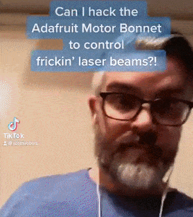](https://twitter.com/scottmonaghan/status/1399241568494686209)

Hacking the Adafruit Motor Bonnet extra PWM pins to control LASER BEAMS with CircuitPython - [Twitter](https://twitter.com/scottmonaghan/status/1399241568494686209).

[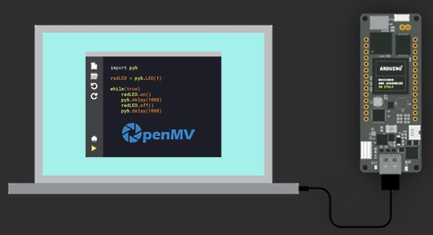](https://www.arduino.cc/pro/tutorials/portenta-h7/por-openmv-gs)

Getting Started with OpenMV and MicroPython on Arduino Portenta H7 - [Arduino](https://www.arduino.cc/pro/tutorials/portenta-h7/por-openmv-gs) and [Twitter](https://twitter.com/arduino/status/1394323145448902663).

[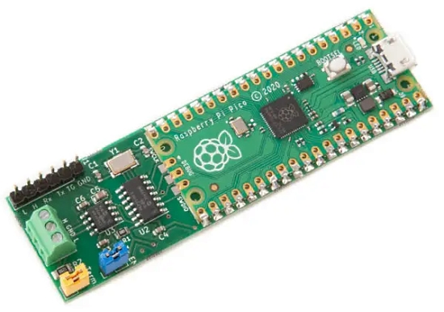](https://www.cnx-software.com/2021/05/26/canpico-open-source-board-adds-can-bus-to-raspberry-pi-pico/)

CANPico is an open-source board which adds CAN Bus to Raspberry Pi Pico. There is also an open-source MicroPython SDK as well as a pre-built firmware image, making it possible to easily control or monitor the CAN bus using Python - [CNX Software](https://www.cnx-software.com/2021/05/26/canpico-open-source-board-adds-can-bus-to-raspberry-pi-pico/).

[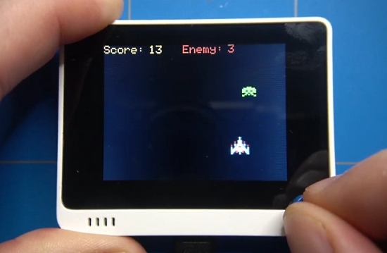](https://github.com/marekl123/invasion-ardupy-game/)

Invasion - ArduPy Game is a small retro like game created in ArduPy / MicroPython for the Wio Terminal - [GitHub](https://github.com/marekl123/invasion-ardupy-game/), [Hackaday](https://hackaday.com/2021/05/25/simple-micropython-game-is-a-30-minute-game-dev-course/) and [YouTube](https://www.youtube.com/watch?v=IhXfFNgJ7S8).

[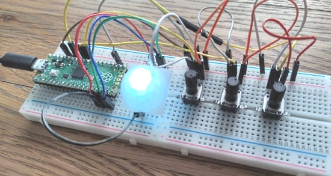](https://www.makeuseof.com/create-mood-lighting-with-block-based-coding-on-raspberry-pi-pico/)

Create Mood Lighting with Block-Based Coding on Raspberry Pi Pico with BIPES, a block-based coding environment for MicroPython devices - [Make Use Of](https://www.makeuseof.com/create-mood-lighting-with-block-based-coding-on-raspberry-pi-pico/).

[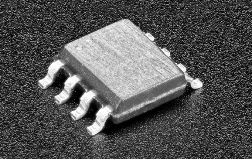](https://github.com/MarksBench/mb_PSRAM_64Mb_SPI)

mb_PSRAM_64Mb_SPI.py - a very simple MicroPython module/driver for Espressif/Generic 64Mbit SPI PSRAM ([Adafruit prdoduct ID: 4677](https://www.adafruit.com/product/4677) or similar). Works with RP2040, should work with other MicroPython boards that have SPI - [GitHub](https://github.com/MarksBench/mb_PSRAM_64Mb_SPI) and [MicroPython Forum](https://forum.micropython.org/viewtopic.php?t=10577&p=58382#p58382).

[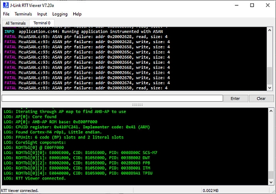](https://mcuoneclipse.com/2021/05/31/finding-memory-bugs-with-google-address-sanitizer-asan-on-microcontrollers/)

Finding memory bugs with Google Address Sanitizer (ASAN) on microcontrollers - [MCU on Eclipse](https://mcuoneclipse.com/2021/05/31/finding-memory-bugs-with-google-address-sanitizer-asan-on-microcontrollers/) and [GitHub](https://github.com/google/sanitizers/wiki/AddressSanitizer).

The final keynote from PyCon US 2021 was from the Python Steering Council answering questions gathered from the community about current happenings and future goals. Above is a visual recap of the address - [Twitter](https://twitter.com/pycon/status/1397670156332044293).

[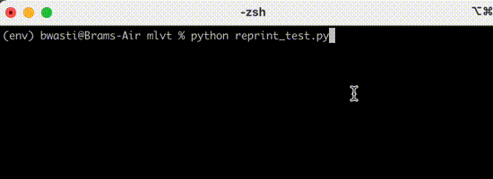](https://github.com/bwasti/mlvt)

Machine Learning Visualization Tools: a single Python file with some tools for visualizing machine learning in the terminal - [GitHub](https://github.com/bwasti/mlvt).

NeoPill: a STM32 Blue Pill-based NeoPixel emulator - [Hackaday](https://hackaday.com/2021/05/26/neopill-is-the-neopixel-emulator-youve-always-wanted/), [Hackaday.io](https://hackaday.io/project/179916-neopill) and [GitHub](https://github.com/relwin/NeoPill).

Working with files in Python - [Real Python](https://realpython.com/working-with-files-in-python/).

pyFLAC: Real-time lossless audio compression in Python - [Sonos](https://tech-blog.sonos.com/posts/pyflac-real-time-lossless-audio-compression-in-python/).

Making a modern Python Package with Poetry - [Ari Codes](https://aricodes.net/posts/python-package-from-scratch/) and [GitHub](https://github.com/python-poetry/poetry).

Find Similar Images in Python with DeepImagesearch DeepLearning based Library - [Twitter](https://twitter.com/1littlecoder/status/1397158082384338947) and [YouTube](https://www.youtube.com/watch?v=ubUmf7fOfyo).

Why Python hasn't taken off on mobile, or in the browser - according to its creator. Python creator Guido van Rossum reveals the strengths and weaknesses of one of the world's most popular programming languages - [ZDnet](https://www.zdnet.com/article/python-programming-why-it-hasnt-taken-off-in-the-browser-or-mobile-according-to-its-creator/).

Introduction to Git and GitHub for Python Developers - [Real Python](https://realpython.com/python-git-github-intro/) and [Twitter](https://twitter.com/realpython/status/1397930704713830407).

PyDev of the Week: Jaime Buelta on [Mouse vs Python](https://www.blog.pythonlibrary.org/2021/05/31/pydev-of-the-week-jaime-buelta/)

The CircuitPython weekly meeting was postponed due to Memorial Day. Look for two meeting links in next week's newsletter.

#ICYDNCI What was the most popular, most clicked link, in [last week's newsletter](https://www.adafruitdaily.com/2021/05/25/python-on-microcontrollers-newsletter-circuitpython-snakes-onto-the-ti-84-plus-ce-and-more-python-adafruit-circuitpython-micropython-thepsf/)? [Python snakes its way to the TI-84 Plus CE Python Graphing Calculator](https://blog.adafruit.com/2021/05/20/python-snakes-its-way-to-the-ti-84-plus-ce-python-graphing-calculator-by-texas-instruments-runs-circuitpython-ticalculators/).

## Coming soon

As CircuitPython emerges in its seventh iteration, join Blinka and the MicroPython mascot in this fun poster coming soon to the Adafruit shop  - [Adafruit](https://www.adafruit.com/product/5067).

The upcoming RP2040 Stamp on a RP2040 Carrier with a Funduino JoyStick Shield, sporting the NOKla 5110 display, getting some classic Snake action using CircuitPython - [Twitter](https://twitter.com/arturo182/status/1397716053489299457).

## New Boards Supported by CircuitPython

The number of supported microcontrollers and Single Board Computers (SBC) grows every week. This section outlines which boards have been included in CircuitPython or added to [CircuitPython.org](https://circuitpython.org/).

This week, there were six new boards added!

- [Nano RP2040 Connect](https://circuitpython.org/board/arduino_nano_rp2040_connect/)
- [MicroMod RP2040 Processor](https://circuitpython.org/board/sparkfun_micromod_rp2040/)
- [Hunter Cat NFC](https://circuitpython.org/board/huntercat_nfc/)
- [VINA-D51 (PCB 7)](https://circuitpython.org/board/bdmicro_vina_d51_pcb7/)
- [QT2040 Trinkey](https://circuitpython.org/board/adafruit_qt2040_trinkey/)
- [Pyboard](https://circuitpython.org/blinka/pyboard_v11/)

Looking to add a new board to CircuitPython? It's highly encouraged! Adafruit has four guides to help you do so:

- [How to Add a New Board to CircuitPython](https://learn.adafruit.com/how-to-add-a-new-board-to-circuitpython/overview)
- [How to add a New Board to the circuitpython.org website](https://learn.adafruit.com/how-to-add-a-new-board-to-the-circuitpython-org-website)
- [Adding a Single Board Computer to PlatformDetect for Blinka](https://learn.adafruit.com/adding-a-single-board-computer-to-platformdetect-for-blinka)
- [Adding a Single Board Computer to Blinka](https://learn.adafruit.com/adding-a-single-board-computer-to-blinka)

## New Learn Guides!

[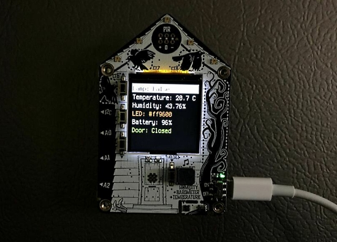](https://learn.adafruit.com/guides/latest)

[Adafruit IO IOT Hub with the Adafruit FunHouse](https://learn.adafruit.com/adafruit-io-hub-with-the-adafruit-funhouse) from [Dylan Herrada](https://learn.adafruit.com/users/dherrada)

[Adafruit NeoKey Trinkey](https://learn.adafruit.com/adafruit-neokey-trinkey) from [Kattni](https://learn.adafruit.com/users/kattni)

## Updated Learn Guides!

[Adafruit I2C QT Rotary Encoder](https://learn.adafruit.com/adafruit-i2c-qt-rotary-encoder) from [Kattni](https://learn.adafruit.com/users/kattni)

## CircuitPython Project Bundle

When you get to the CircuitPython code section of an [Adafruit Learn Guide](https://learn.adafruit.com/), sometimes things can get a bit complicated. You not only have the code you need to upload to your device, but you likely also need to add some libraries that the code requires to run. This involved downloading all the libraries, digging through to find the ones you need, and copying them to your device. That was only the beginning on some projects, as those that include images and/or sound files required further downloading and copying of files. But, not anymore!

Now, with Project Bundles, you can download all the necessary code, libraries and, if needed, asset files with one click! We automatically check which libraries are required for the project and bundle them up for you. No more digging through a huge list of libraries to find the ones you need, or fiddling with looking for other files or dependencies. Download the Project Bundle, copy the contents to your device, and your code will simply work. We wanted to make this the easiest way to get a project working, regardless of whether you're a beginner or an expert. We'll also be adding this feature to popular IDEs as an add-on. Try it out with any Circuit Python guide on the Adafruit Learning System. Just look for the ‘Download Project Bundle’ button on the code page. 

**To download and use a Project Bundle:**

In the Learning System - above any embedded code in a guide in the Adafruit Learn System, you’ll find a Download Project Bundle button.

Click the button to download the Project Bundle zip.

Open the Project Bundle zip to find the example code, all necessary libraries, and, if available, any images, sounds, etc.

Simply copy all the files over to your CIRCUITPY drive, and you’re ready to go!

If you run into any problems or bugs, or would like to submit feedback, please file an issue on the [Adafruit Learning System Guides GitHub repo](https://github.com/adafruit/Adafruit_Learning_System_Guides/issues).

## CircuitPython Libraries!

CircuitPython support for hardware continues to grow. We are adding support for new sensors and breakouts all the time, as well as improving on the drivers we already have. As we add more libraries and update current ones, you can keep up with all the changes right here!

For the latest libraries, download the [Adafruit CircuitPython Library Bundle](https://circuitpython.org/libraries). For the latest community contributed libraries, download the [CircuitPython Community Bundle](https://github.com/adafruit/CircuitPython_Community_Bundle/releases).

If you'd like to contribute, CircuitPython libraries are a great place to start. Have an idea for a new driver? File an issue on [CircuitPython](https://github.com/adafruit/circuitpython/issues)! Have you written a library you'd like to make available? Submit it to the [CircuitPython Community Bundle](https://github.com/adafruit/CircuitPython_Community_Bundle). Interested in helping with current libraries? Check out the [CircuitPython.org Contributing page](https://circuitpython.org/contributing). We've included open pull requests and issues from the libraries, and details about repo-level issues that need to be addressed. We have a guide on [contributing to CircuitPython with Git and Github](https://learn.adafruit.com/contribute-to-circuitpython-with-git-and-github) if you need help getting started. You can also find us in the #circuitpython channel on the [Adafruit Discord](https://adafru.it/discord).

You can check out this [list of all the Adafruit CircuitPython libraries and drivers available](https://github.com/adafruit/Adafruit_CircuitPython_Bundle/blob/master/circuitpython_library_list.md). 

The current number of CircuitPython libraries is **317**!

**New Libraries!**

Here's this week's new CircuitPython libraries:

 * [Adafruit_CircuitPython_Dash_Display](https://github.com/adafruit/Adafruit_CircuitPython_Dash_Display)

**Updated Libraries!**

Here's this week's updated CircuitPython libraries:

 * [Adafruit_CircuitPython_OV7670](https://github.com/adafruit/Adafruit_CircuitPython_OV7670)
 * [Adafruit_CircuitPython_IL0398](https://github.com/adafruit/Adafruit_CircuitPython_IL0398)
 * [Adafruit_CircuitPython_IL91874](https://github.com/adafruit/Adafruit_CircuitPython_IL91874)
 * [Adafruit_CircuitPython_AMG88xx](https://github.com/adafruit/Adafruit_CircuitPython_AMG88xx)
 * [Adafruit_CircuitPython_SSD1608](https://github.com/adafruit/Adafruit_CircuitPython_SSD1608)
 * [Adafruit_CircuitPython_IL0373](https://github.com/adafruit/Adafruit_CircuitPython_IL0373)
 * [Adafruit_CircuitPython_SSD1680](https://github.com/adafruit/Adafruit_CircuitPython_SSD1680)
 * [Adafruit_CircuitPython_SSD1675](https://github.com/adafruit/Adafruit_CircuitPython_SSD1675)
 * [Adafruit_CircuitPython_SSD1681](https://github.com/adafruit/Adafruit_CircuitPython_SSD1681)
 * [Adafruit_CircuitPython_DotStar](https://github.com/adafruit/Adafruit_CircuitPython_DotStar)
 * [Adafruit_CircuitPython_MCP230xx](https://github.com/adafruit/Adafruit_CircuitPython_MCP230xx)
 * [Adafruit_CircuitPython_TinyLoRa](https://github.com/adafruit/Adafruit_CircuitPython_TinyLoRa)
 * [Adafruit_CircuitPython_BME280](https://github.com/adafruit/Adafruit_CircuitPython_BME280)
 * [Adafruit_CircuitPython_RPLIDAR](https://github.com/adafruit/Adafruit_CircuitPython_RPLIDAR)
 * [Adafruit_CircuitPython_MCP9808](https://github.com/adafruit/Adafruit_CircuitPython_MCP9808)
 * [Adafruit_CircuitPython_FunHouse](https://github.com/adafruit/Adafruit_CircuitPython_FunHouse)
 * [Adafruit_CircuitPython_seesaw](https://github.com/adafruit/Adafruit_CircuitPython_seesaw)
 * [Adafruit_CircuitPython_PortalBase](https://github.com/adafruit/Adafruit_CircuitPython_PortalBase)
 * [Adafruit_Blinka](https://github.com/adafruit/Adafruit_Blinka)
 * [Adafruit_Blinka_Displayio](https://github.com/adafruit/Adafruit_Blinka_Displayio)
 * [Adafruit_Python_PlatformDetect](https://github.com/adafruit/Adafruit_Python_PlatformDetect)
 * [CircuitPython_Community_Bundle](https://github.com/adafruit/CircuitPython_Community_Bundle)

## What’s the team up to this week?

What is the team up to this week? Let’s check in!

**Dan**

This week I released CircuitPython 6.3.0-rc.0, Release Candidate 0. If there are no serious bugs revealed, this release will become 6.3.0 final, which we would release early next week after the US holiday on Monday. We try to avoid doing stable releases late in the week or over a weekend or holiday so that we can be available for support. Once 6.3.0 final is released, we will start doing 7.0.0 alpha releases.

I have started to work on a native (C code) matrix keypad module, which you'll be able to use for many kinds of keyboard scanning, including just a few buttons, macro keypads, typing keyboards, or even some kinds of music keyboards.

**Jeff**

After taking a week off, I'm back and finishing up adding the rgbmatrix module to our esp32s2 boards. In CircuitPython 7, you'll be able to do a LED matrix+WiFi project without needing an AirLift module.

**Kattni**

This week I published the NeoKey Trinkey guide. It has everything you need to get started with your NeoKey Trinkey, including pinouts, examples and resource downloads. I also added a CircuitPython page to the Rotary QT guide.

The SAMD21 boards are up for PrettyPins, so the Neo Trinkey and the NeoKey Trinkey are done, and as time permits, I'll continue on down that list.

Next up is the Rotary Trinkey guide. Keep an eye out for that coming soon!

**Lucian**

This week I got bogged down with bugs in the PinAlarm module for the upcoming RP2040 sleep module, which have been causing erratic failures on the pullups, unexpected wakeups, and constant restarting after the code.py file has been saved. I've been working through it by building some reliable control tests and diving further into the GPIO, power and watchdog register documentation, though it wasn't helped by getting knocked out some vaccination travel and side effects. I'm hoping to still get through all of it this week, and finally put down sleep for a little while!

**Melissa**

This past week, I was mostly catching up on GitHub issues that had been accumulating due to all the guide writing I was doing. One of the items I was testing out was the new Beaglebone StarFive with Blinka. At this point there's still a lot of work to do to get it going. I also went through the boards on [CircuitPython.org](https://circuitpython.org) and updated the images as well as added a few missing boards.

**Scott**

This week I've been working on the CircuitPython side of the BLE file transfer service. This service is a core piece of the "BLE workflow" that will enable folks to program a CircuitPython wirelessly over Bluetooth Low Energy (BLE). BLE is commonly used by phones and tablets to communicate to other devices.

I've gotten advertising and connecting working. Now I'm working on implementing the protocol pieces. I've written code for each command in the protocol and my next step is to test each one. I'm also finding issues in the Glider app when doing this too and will fix them as well.

## Upcoming events!

EuroPython, the largest conference for the Python programming language in Europe, will be held online July 26 - August 1, 2021. More information at [https://ep2021.europython.eu/](https://ep2021.europython.eu/)

PyOhio 2021 is a free event on July 31, 2021 - [PyOhio.org](https://www.pyohio.org/2021/) via [Twitter](https://twitter.com/PyOhio/status/1370184124460367881).

Call for proposals for PyConline AU 2021 runs until June 10th, 2021 with the event held 10-12 September, 2021 - [pyconlineau](https://2021.pycon.org.au/)

**Send Your Events In**

As for other events, with the COVID pandemic, most in-person events are postponed or cancelled. If you know of virtual events or events that may occur in the future, please let us know on Discord or on Twitter with hashtag #CircuitPython.

## Latest releases

CircuitPython's stable release is [6.2.0](https://github.com/adafruit/circuitpython/releases/latest) and its unstable release is [6.3.0-rc.0](https://github.com/adafruit/circuitpython/releases). New to CircuitPython? Start with our [Welcome to CircuitPython Guide](https://learn.adafruit.com/welcome-to-circuitpython).

[20210531](https://github.com/adafruit/Adafruit_CircuitPython_Bundle/releases/latest) is the latest CircuitPython library bundle.

[v1.15](https://micropython.org/download) is the latest MicroPython release. Documentation for it is [here](http://docs.micropython.org/en/latest/pyboard/).

[3.9.5](https://www.python.org/downloads/) is the latest Python release. The latest pre-release version is [3.10.0.b1](https://www.python.org/download/pre-releases/).

[2,455 Stars](https://github.com/adafruit/circuitpython/stargazers) Like CircuitPython? [Star it on GitHub!](https://github.com/adafruit/circuitpython)

## Call for help -- Translating CircuitPython is now easier than ever!

[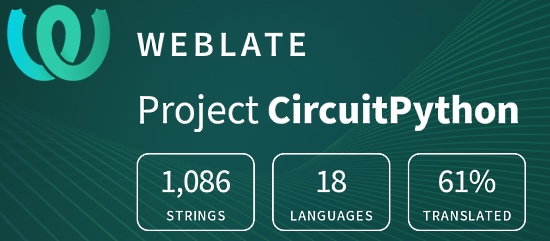](https://hosted.weblate.org/engage/circuitpython/)

One important feature of CircuitPython is translated control and error messages.

With the help of fellow open source project [Weblate](https://weblate.org/), we're making it even easier to add or improve translations.

Sign in with an existing account such as GitHub, Google or Facebook and start contributing through a simple web interface. No forks or pull requests needed!

As always, if you run into trouble join us on [Discord](https://adafru.it/discord), we're here to help.

## jobs.adafruit.com - Find a dream job, find great candidates!

[jobs.adafruit.com](https://jobs.adafruit.com/) has returned and folks are posting their skills (including CircuitPython) and companies are looking for talented makers to join their companies - from Digi-Key, to Hackaday, Micro Center, Raspberry Pi and more.

**Job of the Week**

Manufacturing assistant, full time - Evil Mad Scientist - [Adafruit Jobs Board](https://jobs.adafruit.com/job/manufacturing-assistant-full-time/).

> Perform light duty mechanical manufacturing and assembly tasks as needed. Operate hand tools and handheld power tools in support of those tasks. Listen to and precisely follow protocols for assembly.

## 29,374 thanks!

The Adafruit Discord community, where we do all our CircuitPython development in the open, reached over 29,374 humans, thank you!  Adafruit believes Discord offers a unique way for CircuitPython folks to connect. Join today at [https://adafru.it/discord](https://adafru.it/discord).

## ICYMI - In case you missed it

The wonderful world of Python on hardware! This is our Python video-newsletter-podcast! The news comes from the Python community, Discord, Adafruit communities and more and is reviewed on ASK an ENGINEER Wednesdays. The complete Python on Hardware weekly videocast [playlist is here](https://www.youtube.com/playlist?list=PLjF7R1fz_OOXRMjM7Sm0J2Xt6H81TdDev). 

This video podcast is on [iTunes](https://itunes.apple.com/us/podcast/python-on-hardware/id1451685192?mt=2), [YouTube](http://adafru.it/pohepisodes), [IGTV (Instagram TV](https://www.instagram.com/adafruit/channel/)), and [XML](https://itunes.apple.com/us/podcast/python-on-hardware/id1451685192?mt=2).

[Weekly community chat on Adafruit Discord server CircuitPython channel - Audio / Podcast edition](https://itunes.apple.com/us/podcast/circuitpython-weekly-meeting/id1451685016) - Audio from the Discord chat space for CircuitPython, meetings are usually Mondays at 2pm ET, this is the audio version on [iTunes](https://itunes.apple.com/us/podcast/circuitpython-weekly-meeting/id1451685016), Pocket Casts, [Spotify](https://adafru.it/spotify), and [XML feed](https://adafruit-podcasts.s3.amazonaws.com/circuitpython_weekly_meeting/audio-podcast.xml).

And lastly, we are working up a one-spot destination for all things podcast-able here - [podcasts.adafruit.com](https://podcasts.adafruit.com/)

## Codecademy "Learn Hardware Programming with CircuitPython"

Codecademy, an online interactive learning platform used by more than 45 million people, has teamed up with the leading manufacturer in STEAM electronics, Adafruit Industries, to create a coding course, "Learn Hardware Programming with CircuitPython". The course is now available in the [Codecademy catalog](https://www.codecademy.com/learn/learn-circuitpython?utm_source=adafruit&utm_medium=partners&utm_campaign=circuitplayground&utm_content=pythononhardwarenewsletter).

Python is a highly versatile, easy to learn programming language that a wide range of people, from visual effects artists in Hollywood to mission control at NASA, use to quickly solve problems. But you don’t need to be a rocket scientist to accomplish amazing things with it. This new course introduces programmers to Python by way of a microcontroller — CircuitPython — which is a Python-based programming language optimized for use on hardware.

CircuitPython’s hardware-ready design makes it easier than ever to program a variety of single-board computers, and this course gets you from no experience to working prototype faster than ever before. Codecademy’s interactive learning environment, combined with Adafruit's highly rated Circuit Playground Express, present aspiring hardware hackers with a never-before-seen opportunity to learn hardware programming seamlessly online.

Whether for those who are new to programming, or for those who want to expand their skill set to include physical computing, this course will have students getting familiar with Python and creating incredible projects along the way. By the end, students will have built their own bike lights, drum machine, and even a moisture detector that can tell when it's time to water a plant.

Visit Codecademy to access the [Learn Hardware Programming with CircuitPython](https://www.codecademy.com/learn/learn-circuitpython?utm_source=adafruit&utm_medium=partners&utm_campaign=circuitplayground&utm_content=pythononhardwarenewsletter) course and Adafruit to purchase a [Circuit Playground Express](https://www.adafruit.com/product/3333).

Codecademy has helped more than 45 million people around the world upgrade their careers with technology skills. The company’s online interactive learning platform is widely recognized for providing an accessible, flexible, and engaging experience for beginners and experienced programmers alike. Codecademy has raised a total of $43 million from investors including Union Square Ventures, Kleiner Perkins, Index Ventures, Thrive Capital, Naspers, Yuri Milner and Richard Branson, most recently raising its $30 million Series C in July 2016.

## Contribute!

The CircuitPython Weekly Newsletter is a CircuitPython community-run newsletter emailed every Tuesday. The complete [archives are here](https://www.adafruitdaily.com/category/circuitpython/). It highlights the latest CircuitPython related news from around the web including Python and MicroPython developments. To contribute, edit next week's draft [on GitHub](https://github.com/adafruit/circuitpython-weekly-newsletter/tree/gh-pages/_drafts) and [submit a pull request](https://help.github.com/articles/editing-files-in-your-repository/) with the changes. You may also tag your information on Twitter with #CircuitPython. 

Join our [Discord](https://adafru.it/discord) or [post to the forum](https://forums.adafruit.com/viewforum.php?f=60) for any further questions.
