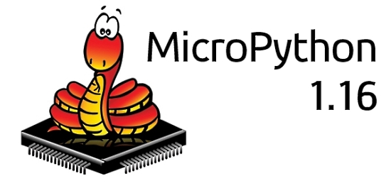
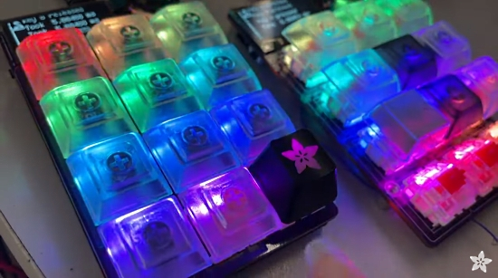
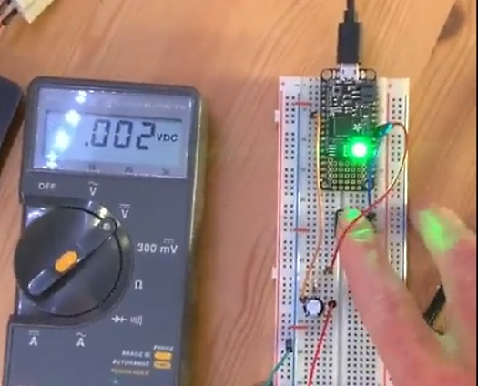
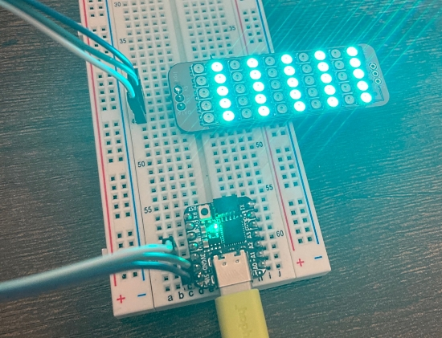
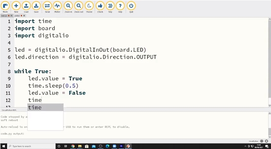
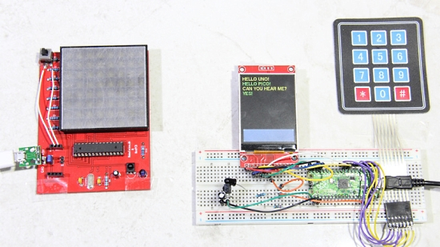
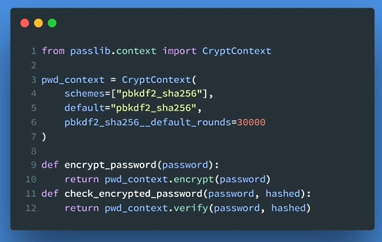

- [X] Kattni updates
- [ ] change date
- [ ] update title
- [ ] Feature story
- [ ] Update  for images
- [ ] Update ICYDNCI
- [ ] All images 550w max only
- [ ] Link "View this email in your browser."

View this email in your browser.

Welcome to the latest Python on Microcontrollers newsletter, brought you by the community! We're on [Discord](https://discord.gg/HYqvREz), [Twitter](https://twitter.com/search?q=circuitpython&src=typed_query&f=live), and for past newsletters - [view them all here](https://www.adafruitdaily.com/category/circuitpython/). If you're reading this on the web, [subscribe here](https://www.adafruitdaily.com/). Let's get started!

## MicroPython 1.16 Released

The 1.16 release of MicroPython is now out and includes a new command-line tool called “mpremote”, which is intended to be the main way to remotely control a MicroPython-based device from the command line. It features a serial terminal, filesystem access, support to mount a local directory on the remote device, and a macro language to define custom commands. This tool can be installed from PyPI via “pip3 install mpremote”, and it works on Linux, Windows and Mac. As part of this, improvements were made to pyboard.py including opening serial ports in exclusive mode to more easily manage multiple devices.

In the Python core, OSError exceptions now support the “.errno” attribute, and an option was added to compile MicroPython without error messages to further reduce code size where needed. The REPL was improved so that it does not tab-complete private methods (those starting with underscore, if no underscore has been typed yet), and it also now tab completes built-in module names after “import” is typed.

Several cores for specific processors have been updated and much more.

See the latest release notice on the MicroPython - [GitHub](https://github.com/micropython/micropython/releases/tag/v1.16).

## Python in Visual Studio Code – June 2021 Release

The June 2021 release of the Python Extension for Visual Studio Code is now available. This release includes support for VS Code’s Workspace Trust, Jump-To-Source code with the PyTorch Profiler and completions for dictionary keys with Pylance.

Python in Visual Studio Code – June 2021 Release - [Microsoft Devblogs](https://devblogs.microsoft.com/python/python-in-visual-studio-code-june-2021-release/).

## Python 3.10 beta 3 is out

Python 3.10 beta 3 is out - [Twitter](https://twitter.com/gvanrossum/status/1405691476684640258) and the [Python Mailing List](https://mail.python.org/archives/list/python-committers@python.org/message/VNUESN72NYKV5DKM6GJ3WUFUS6DWVUSN/).

## CircuitPython speedy keyswitch handling

CircuitPython speedy keyswitch handling - [YouTube](https://youtu.be/x73Clu0fZpE) and [Adafruit Blog](https://blog.adafruit.com/2021/06/20/circuitpython-speedy-keyswitch-handling/).

> Dan just [dropped a new PR](https://github.com/adafruit/circuitpython/pull/4891) with our event-based key switch vector/matrix handling all done in the CircuitPython core  which will make keyboard projects a lot easier and a TON faster. Matrix/vector scanning is now done in a background interrupt and can handle all the work for you and emit key press/release events. Here I've got it on our Macropad, which has 12 keys - one on each GPIO so it's a 'vector' keypad. The code is now twice as fast since we're no longer spending 4ms just for checking whether switches are pressed!

## CircuitPython Deep Dive Stream with Scott Shawcroft

Scott took a well deserved vacation this past week and will be back with a new Deep Dive Friday.

You can see past videos on the Adafruit YouTube channel under the Deep Dive playlist - [YouTube](https://www.youtube.com/playlist?list=PLjF7R1fz_OOXBHlu9msoXq2jQN4JpCk8A).

## News from around the web!

How I monitor my greenhouse with CircuitPython and open source tools - keep track of your greenhouse's temperature, humidity, and ambient light using a microcontroller, sensors, Python, and MQTT - [opensource.com](https://opensource.com/article/21/5/monitor-greenhouse-open-source?sc_cid=7016000000127ECAAY) and [Twitter](https://twitter.com/AlyndertheRed1/status/1406255202840322055).

Driving multiple independent SSD1306 I2C OLED displays from CircuitPython via FET hackery to give an "enable" pin for each display. This is on an Adafruit
 QTPy RP2040 - [Twitter](https://twitter.com/todbot/status/1405317720816570368).

Make: Boards Guide Review: Adafruit ItsyBitsy RP2040 - [Make](https://makezine.com/products/boards/adafruit-itsybitsy-rp2040/) and [Twitter](https://twitter.com/make/status/1405645574410412033).

An edge lit HACK sign powered by CircuitPython and Adafruit Circuit Playground Bluefruit board. Pick your color and animation via app - [Twitter](https://twitter.com/gallaugher/status/1406695382906724356).

Create an FPGA-based IoT application using Python and Adafruit IO - [rs-online](https://www.rs-online.com/designspark/iot-remote-monitoring-using-pynq-framework), [Diligent](https://projects.digilentinc.com/adam-taylor/remote-monitoring-with-pynq-and-the-iot-ec248a) and [Twitter](https://twitter.com/DigilentInc/status/1405648078007373828).

FIDI: a tiny board for fast prototyping with CircuitPython, featuring a ATSAMD21 microcontroller, terminal blocks and a qwiic (STEMMA QT) connector - [Tindie](https://www.tindie.com/products/omzlo/fidi-fast-prototyping-with-circuitpython/) and [Twitter](https://twitter.com/OmzloElec/status/1405424724042305541).

> I bought this shadow box pattern from Alex Fox on Etsy. Added a NeoPixel strip inside and a Circuit Playground Bluefruit running CircuitPython so she can set colors and brightness. Animations, too - [Twitter](https://twitter.com/gallaugher/status/1405676878418087941).

Update on the Python Software Foundation Executive Director - [PSF Blog](https://pyfound.blogspot.com/2021/06/update-on-python-software-foundation.html).

A giant KeyCrappie printed in Prusament Viva La Bronze with a transparent cap and an Adafruit QT Py inside running CircuitPython which powers a small NeoPixel ring to create a fun little nightlight - [Twitter](https://twitter.com/andy_warb/status/1406258304012148737).

A capacitor tester made with an Adafruit Feather microcontroller running CircuitPython and a multimeter - [Twitter](https://twitter.com/OwainM713/status/1405715557614190593).

Testing Oak Dev Tech PixelLeaf boards by running LED animations from CircuitPython - [Twitter Thread](https://twitter.com/oakdevtech/status/1405666877813059586).

Raspberry Pi Pico - Using CircuitPython And The Mu Editor for Beginners - [YouTube](https://www.youtube.com/watch?v=4NZjXwP4m6o).

MicroPython Resources - a curated list of awesome MicroPython libraries, frameworks, software and resources - [Soledad](http://www.programminglinks.website/micropython-resources/) and [Twitter](https://twitter.com/micromikemck/status/1406747769956675584).

What is Embedded Python? Discusses Python on hardware including CircuitPython and MicroPython. It then goes through building a game on a BBC micro:bit - [Real Python](https://realpython.com/embedded-python/) and [Twitter](https://twitter.com/realpython/status/1404853719829712901).

Teaching Python on the Raspberry Pi 400 at the public library - [Adafruit Blog](https://blog.adafruit.com/2021/06/18/teaching-python-on-the-raspberry-pi-400-at-the-public-library-python-opensourceway/) and [Opensorce.com](https://opensource.com/article/21/6/teach-python-raspberry-pi).

Making a Secure Communication Terminal (SCT) with MicroPython and RasPi Pico - [homofaciens.de](https://homofaciens.de/technics-physical-computing-Secure-Communication-Terminal_en.htm).

How to Make an Instagram Bot With Python and InstaPy - [Real Python](https://realpython.com/instagram-bot-python-instapy/) and [Twitter](https://twitter.com/realpython/status/1405623797613580299).

Deepnote- a new kind of data science notebook. Jupyter-compatible with real-time collaboration and running in the cloud - [Deepnote](https://deepnote.com/home).

A Deepnote example - Time to sunburn - [Deepnote](https://deepnote.com/@daniel-zvara-036a/Time-to-sunburn-73Bmeo76QwO33IxA3GYGcQ).

Second year calculus done entirely in PYTHON: No pencil or paper is required - [YouTube](https://www.youtube.com/watch?v=Teb28OFMVFc) and [Twitter](https://twitter.com/PythonLibHunt/status/1404515750820286464).

Nuitka is a Python compiler written in Python. It's fully compatible with Python 2.6, 2.7, 3.3, 3.4, 3.5, 3.6, 3.7, 3.8, and 3.9. You feed it your Python app, it does a lot of clever things, and spits out an executable or extension module - [GitHub](https://github.com/Nuitka/Nuitka).

FX - a command-line tool and terminal JSON viewer - [GitHub](https://github.com/antonmedv/fx).

Encrypt and decrypt a string using Python using the passlib library - [Twitter](https://twitter.com/YogeshNile/status/1405660527129366529).

Comparison of Python HTTP clients - the best Python HTTP clients for 2021 - [ScrapingBee](https://www.scrapingbee.com/blog/best-python-http-clients/) and [Twitter](https://twitter.com/PythonLibHunt/status/1405965420616589315).

Fennel, a programming language that brings together the speed, simplicity, and reach of Lua with the flexibility of a lisp syntax and macro system - [Adafruit Blog](https://blog.adafruit.com/2021/06/17/fennel-a-lisp-syntax-for-lua-programming/) and [Fennel Website](https://fennel-lang.org/).

When and how to evaluate Python annotations - [lwn.net](https://lwn.net/Articles/858576/).

How to troubleshoot memory problems in Python - [Innovation Labs](https://innovation.alteryx.com/how-to-troubleshoot-memory-problems-in-python/).

PyDev of the Week: James Murphy on [Mouse vs Python](https://www.blog.pythonlibrary.org/category/pydevoftheweek/)

CircuitPython Weekly Meeting for July 6th, 2020 ([notes](https://github.com/adafruit/adafruit-circuitpython-weekly-meeting/blob/main/2021/2021-06-21.md)) [on YouTube](https://youtu.be/lCk7J3y9goc)

#ICYDNCI What was the most popular, most clicked link, in [last week's newsletter](https://www.adafruitdaily.com/2021/06/15/python-on-microcontrollers-newsletter-circuitpython-tops-toms-hardware-best-rp2040-boards-2021-and-more-python-adafruit-circuitpython-micropython-thepsf/)? [Tom's Hardware Best RP2040 Boards 2021](https://www.tomshardware.com/best-picks/best-rp2040-boards).

## New Boards Supported by CircuitPython

The number of supported microcontrollers and Single Board Computers (SBC) grows every week. This section outlines which boards have been included in CircuitPython or added to [CircuitPython.org](https://circuitpython.org/).

This week, there were no new boards added, but several are in development.

Looking to add a new board to CircuitPython? It's highly encouraged! Adafruit has four guides to help you do so:

- [How to Add a New Board to CircuitPython](https://learn.adafruit.com/how-to-add-a-new-board-to-circuitpython/overview)
- [How to add a New Board to the circuitpython.org website](https://learn.adafruit.com/how-to-add-a-new-board-to-the-circuitpython-org-website)
- [Adding a Single Board Computer to PlatformDetect for Blinka](https://learn.adafruit.com/adding-a-single-board-computer-to-platformdetect-for-blinka)
- [Adding a Single Board Computer to Blinka](https://learn.adafruit.com/adding-a-single-board-computer-to-blinka)

## New Learn Guides!

[Adafruit Slider Trinkey](https://learn.adafruit.com/adafruit-slider-trinkey) from [Kattni](https://learn.adafruit.com/users/kattni)

## CircuitPython Project Bundle

When you get to the CircuitPython code section of an [Adafruit Learn Guide](https://learn.adafruit.com/), sometimes things can get a bit complicated. You not only have the code you need to upload to your device, but you likely also need to add some libraries that the code requires to run. This involved downloading all the libraries, digging through to find the ones you need, and copying them to your device. That was only the beginning on some projects, as those that include images and/or sound files required further downloading and copying of files. But, not anymore!

Now, with Project Bundles, you can download all the necessary code, libraries and, if needed, asset files with one click! We automatically check which libraries are required for the project and bundle them up for you. No more digging through a huge list of libraries to find the ones you need, or fiddling with looking for other files or dependencies. Download the Project Bundle, copy the contents to your device, and your code will simply work. We wanted to make this the easiest way to get a project working, regardless of whether you're a beginner or an expert. We'll also be adding this feature to popular IDEs as an add-on. Try it out with any Circuit Python guide on the Adafruit Learning System. Just look for the ‘Download Project Bundle’ button on the code page. 

**To download and use a Project Bundle:**

In the Learning System - above any embedded code in a guide in the Adafruit Learn System, you’ll find a Download Project Bundle button.

Click the button to download the Project Bundle zip.

Open the Project Bundle zip to find the example code, all necessary libraries, and, if available, any images, sounds, etc.

Simply copy all the files over to your CIRCUITPY drive, and you’re ready to go!

If you run into any problems or bugs, or would like to submit feedback, please file an issue on the [Adafruit Learning System Guides GitHub repo](https://github.com/adafruit/Adafruit_Learning_System_Guides/issues).

## CircuitPython Libraries!

CircuitPython support for hardware continues to grow. We are adding support for new sensors and breakouts all the time, as well as improving on the drivers we already have. As we add more libraries and update current ones, you can keep up with all the changes right here!

For the latest libraries, download the [Adafruit CircuitPython Library Bundle](https://circuitpython.org/libraries). For the latest community contributed libraries, download the [CircuitPython Community Bundle](https://github.com/adafruit/CircuitPython_Community_Bundle/releases).

If you'd like to contribute, CircuitPython libraries are a great place to start. Have an idea for a new driver? File an issue on [CircuitPython](https://github.com/adafruit/circuitpython/issues)! Have you written a library you'd like to make available? Submit it to the [CircuitPython Community Bundle](https://github.com/adafruit/CircuitPython_Community_Bundle). Interested in helping with current libraries? Check out the [CircuitPython.org Contributing page](https://circuitpython.org/contributing). We've included open pull requests and issues from the libraries, and details about repo-level issues that need to be addressed. We have a guide on [contributing to CircuitPython with Git and Github](https://learn.adafruit.com/contribute-to-circuitpython-with-git-and-github) if you need help getting started. You can also find us in the #circuitpython channel on the [Adafruit Discord](https://adafru.it/discord).

You can check out this [list of all the Adafruit CircuitPython libraries and drivers available](https://github.com/adafruit/Adafruit_CircuitPython_Bundle/blob/master/circuitpython_library_list.md). 

The current number of CircuitPython libraries is **319**!

**Updated Libraries!**

Here's this week's updated CircuitPython libraries:

 * [Adafruit_CircuitPython_SSD1325](https://github.com/adafruit/Adafruit_CircuitPython_SSD1325)
 * [Adafruit_CircuitPython_Colorsys](https://github.com/adafruit/Adafruit_CircuitPython_Colorsys)
 * [Adafruit_CircuitPython_ICM20X](https://github.com/adafruit/Adafruit_CircuitPython_ICM20X)
 * [Adafruit_CircuitPython_IRRemote](https://github.com/adafruit/Adafruit_CircuitPython_IRRemote)
 * [Adafruit_CircuitPython_L3GD20](https://github.com/adafruit/Adafruit_CircuitPython_L3GD20)
 * [Adafruit_CircuitPython_SHTC3](https://github.com/adafruit/Adafruit_CircuitPython_SHTC3)
 * [Adafruit_CircuitPython_Simple_Text_Display](https://github.com/adafruit/Adafruit_CircuitPython_Simple_Text_Display)
 * [Adafruit_CircuitPython_HTU31D](https://github.com/adafruit/Adafruit_CircuitPython_HTU31D)
 * [Adafruit_CircuitPython_FunHouse](https://github.com/adafruit/Adafruit_CircuitPython_FunHouse)
 * [Adafruit_CircuitPython_SI4713](https://github.com/adafruit/Adafruit_CircuitPython_SI4713)
 * [Adafruit_CircuitPython_SGP40](https://github.com/adafruit/Adafruit_CircuitPython_SGP40)
 * [Adafruit_CircuitPython_Wiznet5k](https://github.com/adafruit/Adafruit_CircuitPython_Wiznet5k)
 * [Adafruit_CircuitPython_ESP32SPI](https://github.com/adafruit/Adafruit_CircuitPython_ESP32SPI)
 * [Adafruit_CircuitPython_SSD1306](https://github.com/adafruit/Adafruit_CircuitPython_SSD1306)
 * [Adafruit_CircuitPython_BLE](https://github.com/adafruit/Adafruit_CircuitPython_BLE)
 * [Adafruit_CircuitPython_MCP9808](https://github.com/adafruit/Adafruit_CircuitPython_MCP9808)
 * [Adafruit_CircuitPython_BME280](https://github.com/adafruit/Adafruit_CircuitPython_BME280)
 * [Adafruit_CircuitPython_seesaw](https://github.com/adafruit/Adafruit_CircuitPython_seesaw)
 * [Adafruit_CircuitPython_ImageLoad](https://github.com/adafruit/Adafruit_CircuitPython_ImageLoad)
 * [Adafruit_Python_PlatformDetect](https://github.com/adafruit/Adafruit_Python_PlatformDetect)
 * [Adafruit_Python_PureIO](https://github.com/adafruit/Adafruit_Python_PureIO)
 * [Adafruit_Python_Extended_Bus](https://github.com/adafruit/Adafruit_Python_Extended_Bus)
 * [CircuitPython_Community_Bundle](https://github.com/adafruit/CircuitPython_Community_Bundle)

## What’s the team up to this week?

What is the team up to this week? Let’s check in!

**Dan**

I've mostly finished the new CircuitPython `keypad` module, which scans keys or buttons in the background and reports the results. Currently it supports key-per-pin, matrix keypads, and keys attached to a shift register.

I'll get back to working the CircuitPython 7.0.0 issue backlog in the coming weeks.

**Jeff**

Camera work continues! I have started implementing the CircuitPython module for configuring OV2640 cameras. So far, it is able to set up the camera in 160x120 mode and capture the test pattern image as well as live images.

Next up, I need to fix the code so that other resolutions work as well. It should be possible to do somewhat higher resolution modes on RP2040 boards—There's enough memory for 320x240, but only with some tricks to optimize and reduce memory usage.  240x240 should be usable, depending how much additional code you need to load.

**Kattni**

This week I published the [Slider Trinkey guide](https://learn.adafruit.com/adafruit-slider-trinkey). It has everything you need to get started with your Slider Trinkey, including CircuitPython and Arduino examples. Check it out if you picked up a Slider Trinkey and want to get going with slide potentiometer fun.

We completed the move on all the CircuitPython libraries to the `main` default branch. This means that anyone who has previously contributed to a library needs to update their setup. So, to that end, I updated the Contribute to CircuitPython with Git and GitHub guide with a [Starting Over Fresh](https://learn.adafruit.com/contribute-to-circuitpython-with-git-and-github/starting-over-fresh) page that covers the easiest way to get your setup in line with the new `main` branch.

I started the QT2040 Trinkey guide as well, so keep an eye out for that coming soon.

**Melissa**

This past week, I found a great workaround to an issue that has been plaguing CircuitPython Libraries on the Raspberry Pi ever since it was supported. One of the things the linux operation system does is it will automatically de-assert the Chip Enable lines on the SPI bus. What we have previously recommended for people to do is to not use the CE0 and CE1 lines if it causes a conflict, which it does on certain chipsets. However on some boards such as the PiTFT, they are hardwired to use the CE0 and CE1 lines. The workaround that I figured out involves reassigning the Chip Enable lines in the device tree overlay to unused GPIO pins so that when the lines are de-asserted, they don't interfere with the SPI communications. I wrote a script to handle this automatically and updated the [SPI Sensors & Devices](https://learn.adafruit.com/circuitpython-on-raspberrypi-linux/spi-sensors-devices) page in the [CircuitPython on Linux and Raspberry Pi](https://learn.adafruit.com/circuitpython-on-raspberrypi-linux) guide.

## Upcoming events!

EuroPython, the largest conference for the Python programming language in Europe, will be held online July 26 - August 1, 2021. More information at [https://ep2021.europython.eu/](https://ep2021.europython.eu/)

PyOhio 2021 is a free event on July 31, 2021 - [PyOhio.org](https://www.pyohio.org/2021/) via [Twitter](https://twitter.com/PyOhio/status/1370184124460367881).

PyConline AU will be held 10-12 September, 2021 - [pyconlineau](https://2021.pycon.org.au/)

**Send Your Events In**

As for other events, with the COVID pandemic, most in-person events are postponed or cancelled. If you know of virtual events or events that may occur in the future, please let us know on Discord or on Twitter with hashtag #CircuitPython.

## Latest releases

CircuitPython's stable release is [6.3.0](https://github.com/adafruit/circuitpython/releases/latest) and its unstable release is [7.0.0-alpha.3](https://github.com/adafruit/circuitpython/releases). New to CircuitPython? Start with our [Welcome to CircuitPython Guide](https://learn.adafruit.com/welcome-to-circuitpython).

[20210619](https://github.com/adafruit/Adafruit_CircuitPython_Bundle/releases/latest) is the latest CircuitPython library bundle.

[v1.16](https://micropython.org/download) is the latest MicroPython release. Documentation for it is [here](http://docs.micropython.org/en/latest/pyboard/).

[3.9.5](https://www.python.org/downloads/) is the latest Python release. The latest pre-release version is [3.10.0b3](https://www.python.org/download/pre-releases/).

[2,476 Stars](https://github.com/adafruit/circuitpython/stargazers) Like CircuitPython? [Star it on GitHub!](https://github.com/adafruit/circuitpython)

## Call for help -- Translating CircuitPython is now easier than ever!

One important feature of CircuitPython is translated control and error messages.

With the help of fellow open source project [Weblate](https://weblate.org/), we're making it even easier to add or improve translations.

Sign in with an existing account such as GitHub, Google or Facebook and start contributing through a simple web interface. No forks or pull requests needed!

As always, if you run into trouble join us on [Discord](https://adafru.it/discord), we're here to help.

## jobs.adafruit.com - Find a dream job, find great candidates!

[jobs.adafruit.com](https://jobs.adafruit.com/) has returned and folks are posting their skills (including CircuitPython) and companies are looking for talented makers to join their companies - from Digi-Key, to Hackaday, Micro Center, Raspberry Pi and more.

**Job of the Week**

Sheet metal enclosure CAD work - Circuit Dojo - [Adafruit Jobs Board](https://jobs.adafruit.com/job/sheet-metal-enclosure-cad-work/).

## 29,623 thanks!

The Adafruit Discord community, where we do all our CircuitPython development in the open, reached over 29,623 humans, thank you!  Adafruit believes Discord offers a unique way for CircuitPython folks to connect. Join today at [https://adafru.it/discord](https://adafru.it/discord).

## ICYMI - In case you missed it

The wonderful world of Python on hardware! This is our Python video-newsletter-podcast! The news comes from the Python community, Discord, Adafruit communities and more and is reviewed on ASK an ENGINEER Wednesdays. The complete Python on Hardware weekly videocast [playlist is here](https://www.youtube.com/playlist?list=PLjF7R1fz_OOXRMjM7Sm0J2Xt6H81TdDev). 

This video podcast is on [iTunes](https://itunes.apple.com/us/podcast/python-on-hardware/id1451685192?mt=2), [YouTube](http://adafru.it/pohepisodes), [IGTV (Instagram TV](https://www.instagram.com/adafruit/channel/)), and [XML](https://itunes.apple.com/us/podcast/python-on-hardware/id1451685192?mt=2).

[Weekly community chat on Adafruit Discord server CircuitPython channel - Audio / Podcast edition](https://itunes.apple.com/us/podcast/circuitpython-weekly-meeting/id1451685016) - Audio from the Discord chat space for CircuitPython, meetings are usually Mondays at 2pm ET, this is the audio version on [iTunes](https://itunes.apple.com/us/podcast/circuitpython-weekly-meeting/id1451685016), Pocket Casts, [Spotify](https://adafru.it/spotify), and [XML feed](https://adafruit-podcasts.s3.amazonaws.com/circuitpython_weekly_meeting/audio-podcast.xml).

And lastly, we are working up a one-spot destination for all things podcast-able here - [podcasts.adafruit.com](https://podcasts.adafruit.com/)

## Contribute!

The CircuitPython Weekly Newsletter is a CircuitPython community-run newsletter emailed every Tuesday. The complete [archives are here](https://www.adafruitdaily.com/category/circuitpython/). It highlights the latest CircuitPython related news from around the web including Python and MicroPython developments. To contribute, edit next week's draft [on GitHub](https://github.com/adafruit/circuitpython-weekly-newsletter/tree/gh-pages/_drafts) and [submit a pull request](https://help.github.com/articles/editing-files-in-your-repository/) with the changes. You may also tag your information on Twitter with #CircuitPython. 

Join our [Discord](https://adafru.it/discord) or [post to the forum](https://forums.adafruit.com/viewforum.php?f=60) for any further questions.
