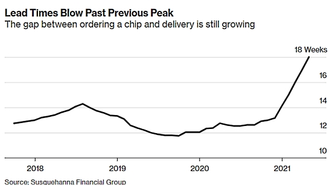
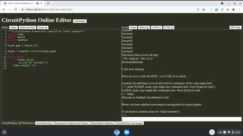
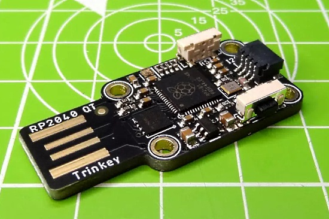
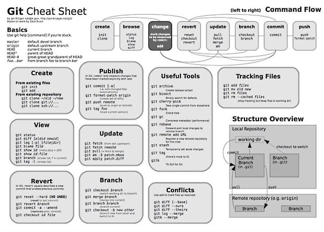
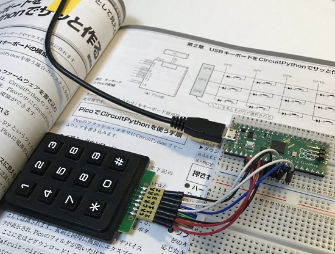
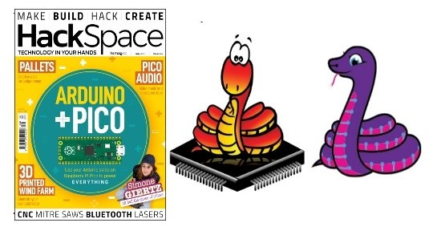
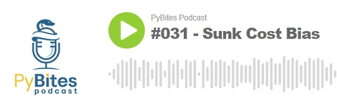
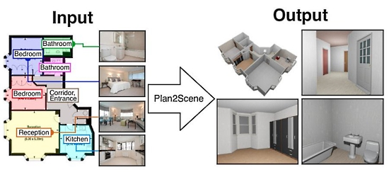
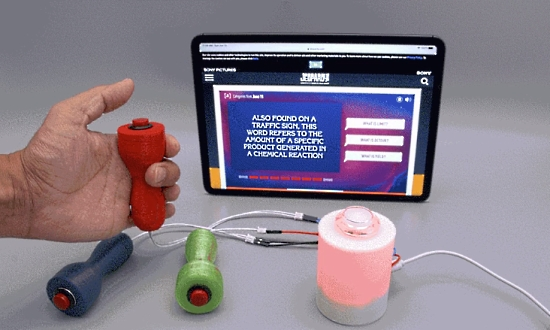

- [ ] Kattni updates
- [ ] change date
- [ ] update title
- [ ] Feature story
- [ ] Update  for images
- [ ] Update ICYDNCI
- [ ] All images 550w max only
- [ ] Link "View this email in your browser."

View this email in your browser.

Presenting the latest Python on Microcontrollers newsletter, brought you by the community! Come join the community on [Discord](https://discord.gg/HYqvREz), [Twitter](https://twitter.com/search?q=circuitpython&src=typed_query&f=live), and for past newsletters - [view them all here](https://www.adafruitdaily.com/category/circuitpython/). If you're reading this on the web, [subscribe here](https://www.adafruitdaily.com/). So much is happening - let's dive in:

## Texas Instruments Answers Questions on their New TI-84 Plus CE Python Graphing Calculator, and an Update: the Calculator uses an ATSAMD21 chip as a CircuitPython Coprocessor

In May of 2021, Adafruit saw that there was a fork of CircuitPython reported to be running on the new TI-84 Plus CE Python Graphing Calculator by Texas Instruments and they had to get one (and did!). Adafruit then reached out to the folks at TI Education / TI Calculators and asked if they could send over some questions to their team(s) and they said YES. See the questions and responses - [Adafruit Blog](https://blog.adafruit.com/2021/06/25/adafruit-interviews-texas-instruments-education-about-python-on-calculators-and-more-ticalculators-ticodes/)

Plus: the calculator is running a fork of CircuitPython on a ATMEL (Microchip) ATSAMD21E18 (the same chip as the Adafruit GEMMA M0, TRINKET M0, and many TRINKEYs) - [Adafruit Blog](https://blog.adafruit.com/2021/06/25/adafruit-interviews-texas-instruments-education-about-python-on-calculators-and-more-ticalculators-ticodes/).

## ADABOX 19 is shipping in July - JOIN NOW: https://adabox.com

The next [ADABOX from Adafruit](https://www.adafruit.com/adabox_get_started) ships in a few days! Curated Adafruit products, unique collectibles, and exclusive discounts. Delivered quarterly. [Subscribe now or give as a gift](https://www.adafruit.com/adabox_get_started)!

## keypad: support for vector and matrix key scanning in CircuitPython

Dan Halbert has completed initial work on a comprehensive keypad module for CircuitPython - [GitHub](https://github.com/adafruit/circuitpython/pull/4891) and [Adafruit Blog/YouTube](https://blog.adafruit.com/2021/06/20/circuitpython-speedy-keyswitch-handling/).

The `keypad` module provides three different ways to scan a set keys, provided by the classes `Keys` (one key per pin), `KeyMatrix` (row/column matrix), and `ShiftRegisterKeys` (external shift registers). Key scanning is done in the background and includes debouncing. Key transition events (pressed or released) are put on a queue, implemented by classes `Event` and `EventQueue`.

## Microcontroller Shortages Projected into 2022

Shortages of microcontrollers, used to run millions of devices worldwide, are acute and projected to last into next year. Chips from Microchip/Atmel, Nordic, ST and others are affected. Due to timing, the new Raspberry Pi RP2040 and ESP chips from Espressif Systems do not seem as impacted at the moment.

The shortages have led developers to scour the internet for dwindling supplies. For chips that are unobtainable, some products are being redesigned using more easily available microcontrollers, which can be a costly hardware and software process - [CNBC](https://www.cnbc.com/2021/05/12/the-global-chip-shortage-could-last-until-2023-.html), [EE News Europe](https://www.eenewseurope.com/news/all-one-embedded-software-stack-help-chip-shortage), [Seeking Alpha](https://seekingalpha.com/article/4435264-microchip-technology-benefiting-from-strong-microcontroller-demand-and-shortages-mchp), and [Bloomberg](https://www.bloomberg.com/news/articles/2021-06-22/wait-times-for-chips-stretch-further-deepening-shortage).

## Camera support coming to CircuitPython on ESP32-S2

Testing the ESP32-S2 Kaluga dev kit v1.3 with the [latest PR from Jeff](https://github.com/adafruit/circuitpython/pull/4880) to add native camera support to CircuitPython. In only a few lines of code it can initialize a display, read a buffer from the camera, then blit it out to the onboard 240x320 screen. There are now libraries for both OV7670 and the nicer/newer [OV2640](https://github.com/adafruit/Adafruit_CircuitPython_OV2640). Amazing work by the team to get this so smooth! - [Adafruit Blog](https://blog.adafruit.com/2021/06/22/camera-support-coming-to-circuitpython-on-esp32-s2/) and [YouTube](https://youtu.be/3qTod5rLvnw).

## An online editor for CircuitPython

YouTube user River Wang [posts](https://youtu.be/Z44PD-ZleAU) about a CircuitPython online IDE, which is web-based, requiring zero software setup. This would be ideal for any computer, but especially for machines where installing additional software is not possible such as at libraries, public spaces, and on school Chromebooks - [Adafruit Blog](https://blog.adafruit.com/2021/06/22/an-online-editor-for-circuitpython-circuitpython/), [GitHub](https://github.com/urfdvw/CircuitPython-online-IDE), [YouTube](https://youtu.be/Z44PD-ZleAU) and [try it out here](https://urfdvw.github.io/CircuitPython-online-IDE/).

## CircuitPython Deep Dive Stream with Scott Shawcroft

[This week](https://youtu.be/nhnJoOyk6e4), Scott streams his work on MacroPad + BLE Workflow.

You can see the latest video and past videos on the Adafruit YouTube channel under the Deep Dive playlist - [YouTube](https://www.youtube.com/playlist?list=PLjF7R1fz_OOXBHlu9msoXq2jQN4JpCk8A).

## News from around the web!

DarkfullDante's Flight Sim Switch Box is powered by a Raspberry Pi Pico running CircuitPython - [hackster.io](https://www.hackster.io/news/darkfulldante-s-flight-sim-switch-box-is-powered-by-a-raspberry-pi-pico-running-circuitpython-27056125070c), [Reddit](https://www.reddit.com/r/raspberry_pi/comments/o6zlbn/saw_people_posting_there_rp2040_keyboard_not_a/), [Imgur](https://imgur.com/a/OHStMbc) and [Twitter](https://twitter.com/Hacksterio/status/1408522128404721667).

Adafruit Trinkey QT2040 Review - [Tom's Hardware](https://www.tomshardware.com/reviews/adafruit-trinkey-qt2040-review).

The I2C page for the Adafruit Trinkey QT2040 guide has the image (above) which uses the terms controller and peripheral, the page also explains the nomenclature, and references the previous naming convention. This will appears on multiple pages on the Adafruit Learning System and Adafruit documention - [Adafruit Blog](https://blog.adafruit.com/2021/06/24/controller-and-peripheral/).

> I got a Adafruit MCP2221A breakout to play with, via The Pi Hut. USB C interface, Stemma QT / Qwiic and GPIO all accessible via CircuitPython from my laptop. Handy! - [Twitter](https://twitter.com/biglesp/status/1408162445676404740).

Using Adafruit Turtle graphics on an SSD1306 display with an Adafruit QT Py and a Seeed Xiao - [Twitter Thread](https://twitter.com/n602_NA/status/1407706870110822401).

An interactive mason jar light with an Adafruit Circuit Playground Bluefruit and CircuitPython - [YouTube](https://youtu.be/JGQhVfrfJ1Y) and [Twitter](https://twitter.com/gallaugher/status/1409308723164729348).

Using CircuitPython and an Adafruit CLUE to control an LPC812 creating a PSG sound source emulating a Sound Cortex - [Twitter Thread](https://twitter.com/AoyamaProd/status/1407668613767589888) (Japanese).

Using a Raspberry Pi and an Adafruit Thermal Printer - [jamesg.blog](https://jamesg.blog/2021/06/17/thermal-printer-part-1) and [Adafruit Blog](https://blog.adafruit.com/2021/06/25/using-a-thermal-printer-on-your-raspberry-pi-piday-raspberrypi-raspberry_pi/).

Make your bike smart with Raspberry Pi - [Raspberry Pi Blog](https://www.raspberrypi.org/blog/make-your-bike-smart-with-raspberry-pi/), [Instructables](https://www.instructables.com/Shareable-Smartbike/) and [GitHub](https://github.com/KeanuDavid1/SmartBike_Project1).

Raspberry Pi Zero self playing xylophone - [Raspberry Pi Blog](https://www.raspberrypi.org/blog/raspberry-pi-zero-makes-a-xylophone-play-itself/).

A one page, concise Git cheat sheet - [Twitter](https://twitter.com/MIT_CSAIL/status/1408100103198367746).

> Blinkenlights for flying drones at dusk are like $60 a set, and I have lots of NeoPixels and a 3D printer. Also an Adafruit QT Py and lipos aplenty. The 
CircuitPython code was like 5% of the total effort - [Twitter](https://twitter.com/alexwhittemore/status/1408938906905571335).

> Raspberry Pi Pico and CircuitPython connecting a keypad. There were surprisingly few examples of this, but I'm glad that the difference with MicroPython was easy to understand. The dial pad was made quickly with reference to the article. It is a promise of HID programming that it becomes a little troublesome if you insert a special key - [Twitter](https://twitter.com/tokuhira/status/1409153823126417411) (Japanese).

A hack to give an Adafruit Rotary Trinkey USB key touch-sensitive knob. Just need a metal knob and a bit of wire. Demo in CircuitPython - [Twitter](https://twitter.com/todbot/status/1409295315643944962).

An Adafruit Circuit Playground Express with some CircuitPython code inside to use it as a 3D mouse (using the motion sensor) - [Twitter](https://twitter.com/alx_nearphuture/status/1408832511556395013).

Raspberry Pico: The Complete SDK Overview (Native C/C++, Arduino, MicroPython, CircuitPython) - [Sebastian on Medium](https://admantium.medium.com/raspberry-pico-the-complete-sdk-overview-native-c-c-arduino-micropython-circuitpython-1ce3a70c2527).

Learn how to connect an I2C LCD display to a Raspberry Pi Pico with MicroPython - [Tom's Hardware](https://www.tomshardware.com/how-to/lcd-display-raspberry-pi-pico) and [Twitter](https://twitter.com/biglesp/status/1409243315581693957).

upagekite: a MicroPython/ESP32 PageKite web server - [GitHub](https://github.com/pagekite/upagekite) and [Tutorial](https://github.com/pagekite/upagekite-tutorial).

Installing Thonny for editing Python, including MicroPython for the Raspberry Pi Pico - [Real Python](https://realpython.com/lessons/install-thonny/) and [Twitter](https://twitter.com/realpython/status/1407760416961351691).

HackSpace Magazine Issue 44 takes a look at using CircuitPython libraries in MicroPython. Read more on pages 74-75: [download PDF](https://hackspace.raspberrypi.org/issues/44/pdf), [buy now](https://store.rpipress.cc/collections/hackspace-magazine/products/hackspace-magazine-44), [subscribe](https://hsmag.cc/adafruit) - [Adafruit Blog](https://blog.adafruit.com/2021/06/23/hackspace-magazine-issue-44-circuitpython-on-micropython-circuitpython-micropython-hackspacemag/).

> The CircuitPython compatibility layer – known as Blinka – has been around for a while and is best known for providing access to CircuitPython libraries for machines that run full-blown Python, such as Raspberry Pi computers. However, it originally started as a MicroPython compatibility layer, and it can still be used for this.

Python's growth is "absolutely explosive," says Anaconda CEO, and not slowing down - [TechRepublic](https://www.techrepublic.com/article/programming-languages-pythons-growth-is-absolutely-explosive-says-anaconda-ceo-and-not-slowing-down/) and [Twitter](https://twitter.com/anacondainc/status/1409523247264247809).

Print text color and text format on Term with Python - [Python Awesome](https://pythonawesome.com/print-text-color-and-text-format-on-term-with-python/) and [Twitter](https://twitter.com/Python_News/status/1408789818713296900).

A curated list of 70+ Python Projects for Beginners, Intermediate and Experienced Developers - [TheInsaneApp](https://www.theinsaneapp.com/2021/06/list-of-python-projects-with-source-code-and-tutorials.html) and [Twitter](https://twitter.com/SourabhSKatoch/status/1406292189290938372).

How to use Python Lambda functions - [Real Python](https://realpython.com/python-lambda/) and [Twitter](https://twitter.com/realpython/status/1408802347501985794).

Sunk cost bias - keeping to invest in a complicated (sub optimal) programming language(s) while there are better ones (e.g. Python!)- [PyBites Podcast](https://www.pybitespodcast.com/1501156/8736065).

[The Linux Foundation](https://linuxfoundation.org/) announced a new permissive license designed to help foster collaboration around open data for artificial intelligence (AI) and machine learning (ML) projects. With [CDLA-Permissive-2.0](https://cdla.dev/permissive-2-0/), the Linux Foundation is building on its previous efforts to encourage data-sharing through licensing arrangements that clearly define how the data — and any derivative datasets — can and can’t be used - [VentureBeat](https://venturebeat-com.cdn.ampproject.org/c/s/venturebeat.com/2021/06/23/linux-foundation-unveils-new-permissive-license-for-open-data-collaboration/amp/).

Plan2Scene: Converting Floorplans to 3D Scenes using Python - [Twitter](https://twitter.com/PythonWeekly/status/1407065945764474893), [GitHub](https://github.com/3dlg-hcvc/plan2scene) and [GitHub.io](https://3dlg-hcvc.github.io/plan2scene/).

pyunity: A Python Implementation of the Unity Engine - [GitHub](https://github.com/pyunity/pyunity) and [Twitter](https://twitter.com/pycoders/status/1408094068622643204).

Counterfeit PyPI packages with malware discovered - [Adafruit Blog](https://blog.adafruit.com/2021/06/25/counterfeit-pypi-packages-discovered-python-arstechnica/) and [Ars Technica](https://arstechnica.com/gadgets/2021/06/counterfeit-pypi-packages-with-5000-downloads-installed-cryptominers/).

Subclassing in Python Redux - [Hynek.me](https://hynek.me/articles/python-subclassing-redux/).

Why is Python recursion so expensive and what can we do about it? - [Stack Overflow](https://stackoverflow.com/questions/67988828/why-is-python-recursion-so-expensive-and-what-can-we-do-about-it) and [Twitter](https://twitter.com/pycoders/status/1408856089811095552).

CircuitPython Weekly meeting for June 28th, 2021 [on YouTube](https://youtu.be/ePFOqhkDVLM) and [notes](https://github.com/adafruit/adafruit-circuitpython-weekly-meeting/blob/main/2021/2021-06-28.md)

PyDev of the Week: Benjy Weinberger from [Mouse vs Python](https://www.blog.pythonlibrary.org/2021/06/28/pydev-of-the-week-benjy-weinberger/)

#ICYDNCI What was the most popular, most clicked link, in [last week's newsletter](https://www.adafruitdaily.com/2021/06/22/python-on-microcontrollers-newsletter-micropython-1-16-is-out-and-more-python-adafruit-circuitpython-micropython-thepsf/)? [MicroPython 1.16 Out](https://github.com/micropython/micropython/releases/tag/v1.16).

The Last Word: Exit vi/vim, etc. with this one simple trick - [Twitter](https://twitter.com/summer__heidi/status/1409355237287075845)

## New Boards Supported by CircuitPython

The number of supported microcontrollers and Single Board Computers (SBC) grows every week. This section outlines which boards have been included in CircuitPython or added to [CircuitPython.org](https://circuitpython.org/).

This week, there were no new boards added but several are being developed!

Looking to add a new board to CircuitPython? It's highly encouraged! Adafruit has four guides to help you do so:

- [How to Add a New Board to CircuitPython](https://learn.adafruit.com/how-to-add-a-new-board-to-circuitpython/overview)
- [How to add a New Board to the circuitpython.org website](https://learn.adafruit.com/how-to-add-a-new-board-to-the-circuitpython-org-website)
- [Adding a Single Board Computer to PlatformDetect for Blinka](https://learn.adafruit.com/adding-a-single-board-computer-to-platformdetect-for-blinka)
- [Adding a Single Board Computer to Blinka](https://learn.adafruit.com/adding-a-single-board-computer-to-blinka)

## New Learn Guides!

[DIY Quiz Show Controller System](https://learn.adafruit.com/quiz-show-controller-keyboard-bluetooth) from [Dylan Herrada](https://learn.adafruit.com/users/dherrada)

[Adafruit Trinkey QT2040](https://learn.adafruit.com/adafruit-trinkey-qt2040) from [Kattni](https://learn.adafruit.com/users/kattni)

## CircuitPython Project Bundle

When you get to the CircuitPython code section of an [Adafruit Learn Guide](https://learn.adafruit.com/), sometimes things can get a bit complicated. You not only have the code you need to upload to your device, but you likely also need to add some libraries that the code requires to run. This involved downloading all the libraries, digging through to find the ones you need, and copying them to your device. That was only the beginning on some projects, as those that include images and/or sound files required further downloading and copying of files. But, not anymore!

Now, with Project Bundles, you can download all the necessary code, libraries and, if needed, asset files with one click! We automatically check which libraries are required for the project and bundle them up for you. No more digging through a huge list of libraries to find the ones you need, or fiddling with looking for other files or dependencies. Download the Project Bundle, copy the contents to your device, and your code will simply work. We wanted to make this the easiest way to get a project working, regardless of whether you're a beginner or an expert. We'll also be adding this feature to popular IDEs as an add-on. Try it out with any Circuit Python guide on the Adafruit Learning System. Just look for the ‘Download Project Bundle’ button on the code page. 

**To download and use a Project Bundle:**

In the Learning System - above any embedded code in a guide in the Adafruit Learn System, you’ll find a Download Project Bundle button.

Click the button to download the Project Bundle zip.

Open the Project Bundle zip to find the example code, all necessary libraries, and, if available, any images, sounds, etc.

Simply copy all the files over to your CIRCUITPY drive, and you’re ready to go!

If you run into any problems or bugs, or would like to submit feedback, please file an issue on the [Adafruit Learning System Guides GitHub repo](https://github.com/adafruit/Adafruit_Learning_System_Guides/issues).

## CircuitPython Libraries!

CircuitPython support for hardware continues to grow. We are adding support for new sensors and breakouts all the time, as well as improving on the drivers we already have. As we add more libraries and update current ones, you can keep up with all the changes right here!

For the latest libraries, download the [Adafruit CircuitPython Library Bundle](https://circuitpython.org/libraries). For the latest community contributed libraries, download the [CircuitPython Community Bundle](https://github.com/adafruit/CircuitPython_Community_Bundle/releases).

If you'd like to contribute, CircuitPython libraries are a great place to start. Have an idea for a new driver? File an issue on [CircuitPython](https://github.com/adafruit/circuitpython/issues)! Have you written a library you'd like to make available? Submit it to the [CircuitPython Community Bundle](https://github.com/adafruit/CircuitPython_Community_Bundle). Interested in helping with current libraries? Check out the [CircuitPython.org Contributing page](https://circuitpython.org/contributing). We've included open pull requests and issues from the libraries, and details about repo-level issues that need to be addressed. We have a guide on [contributing to CircuitPython with Git and Github](https://learn.adafruit.com/contribute-to-circuitpython-with-git-and-github) if you need help getting started. You can also find us in the #circuitpython channel on the [Adafruit Discord](https://adafru.it/discord).

You can check out this [list of all the Adafruit CircuitPython libraries and drivers available](https://github.com/adafruit/Adafruit_CircuitPython_Bundle/blob/master/circuitpython_library_list.md). 

The current number of CircuitPython libraries is **321**!

**New Libraries!**

Here's this week's new CircuitPython libraries:

 * [Adafruit_CircuitPython_NeoKey](https://github.com/adafruit/Adafruit_CircuitPython_NeoKey)
 * [Adafruit_CircuitPython_OV2640](https://github.com/adafruit/Adafruit_CircuitPython_OV2640)

**Updated Libraries!**

Here's this week's updated CircuitPython libraries:

 * [Adafruit_CircuitPython_ImageLoad](https://github.com/adafruit/Adafruit_CircuitPython_ImageLoad)
 * [Adafruit_CircuitPython_OV7670](https://github.com/adafruit/Adafruit_CircuitPython_OV7670)
 * [Adafruit_CircuitPython_Display_Text](https://github.com/adafruit/Adafruit_CircuitPython_Display_Text)
 * [Adafruit_CircuitPython_EPD](https://github.com/adafruit/Adafruit_CircuitPython_EPD)
 * [Adafruit_CircuitPython_IS31FL3731](https://github.com/adafruit/Adafruit_CircuitPython_IS31FL3731)
 * [Adafruit_CircuitPython_ST7735R](https://github.com/adafruit/Adafruit_CircuitPython_ST7735R)
 * [Adafruit_CircuitPython_LC709203F](https://github.com/adafruit/Adafruit_CircuitPython_LC709203F)
 * [Adafruit_Python_PlatformDetect](https://github.com/adafruit/Adafruit_Python_PlatformDetect)
 * [CircuitPython_Community_Bundle](https://github.com/adafruit/CircuitPython_Community_Bundle)

## What’s the team up to this week?

What is the team up to this week? Let’s check in!

**Dan**

By the time you read this, the keypad module will have been merged into main in CircuitPython. I'll be writing a Learn Guide on how to use it, with examples including the new MacroPad product and reading the buttons from an SNES controller.

I'm back to fixing bugs for 7.0.0. First stop is to fix some audio problems on the RP2040.

**Jeff**

I merged MicroPython 1.16 into the main branch of CircuitPython. This gets us the newest bug-fixes to the core language & more.

**Kattni**

This week I published the [Adafruit Trinkey QT2040](https://learn.adafruit.com/adafruit-trinkey-qt2040) guide. It has everything you need to get started with your QT2040 Trinkey, including examples for CircuitPython, U2IF Python and Arduino, as well as pinouts and downloads resources. If you picked up one of these little boards and need some assistance or ideas, check out this guide!

Related, I updated the MCP9808 guide to include the STEMMA QT version of the breakout, with wiring diagrams and resource downloads now available.

I also helped write up a CircuitPython Community Code of Conduct for folks who are submitting libraries to the community bundle. Our `cookiecutter` was adding the Adafruit Community CoC, but this did not make sense as it includes things that do not apply to projects maintained by community members. Now, when you use `cookiecutter` and choose "Community" for the library type, you'll get a CoC that applies to your project. If you've already generated a library and submitted it to the bundle, consider checking out the version now included with `cookiecutter`, and updating your library with the new CoC.

**Lucian**

This past week I've been working on the updates to the "Set Next File" feature, which will allow users to do things like pick a file out of a menu and soft-reboot circuitpython into running that file. This concept got put down for a while, and I've been reworking it to fit the new state of Circuitpython's main branch with all the new additions to sleep, status LED, and run reasons. 

While catching it up has been relatively simple, the concept runs aground a bit when it comes to deep sleep - since a board in true deep sleep is almost in a reset state, losing all access to RAM, we have to figure out how to store the name of the next file to run if this feature is going to work. I didn't like the idea of having "sub-programs" simply return to the menu after using deep sleep, since that would mean they act differently just by virtue of being a sub-program; an imported example that uses sleep should act the same whether it's been called from a menu or not. This will take a bit of extra tooling work this week, but I think the result should be worth the effort.

**Melissa**

This past week I mostly worked on the WebSerial ESPTool a bit more. I ended up decoupling the core code from the user interface code to make it a bit more modular and easier to use with different user interfaces. This allows it to be more extensible and work in additional ways than it was originally intended. This was important because it planned to be used in an upcoming project.

**Scott**

I'm back from vacation and caught up. Now I'm dusting off the BLE workflow changes and getting them ready for review. Things are looking good so the PR should be out soon. Next, I'll be hooking up CircuitPython's serial connection to a BLE UART service so it too is accessible over BLE.

## Upcoming events!

EuroPython, the largest conference for the Python programming language in Europe, will be held online July 26 - August 1, 2021. More information at [https://ep2021.europython.eu/](https://ep2021.europython.eu/) and the [schedule is here](https://blog.europython.eu/europython-2021-schedule-published/).

PyOhio 2021 is a free event on July 31, 2021 - [PyOhio.org](https://www.pyohio.org/2021/) via [Twitter](https://twitter.com/PyOhio/status/1370184124460367881).

PyConline AU will be held 10-12 September, 2021 - [pyconlineau](https://2021.pycon.org.au/)

Kiwi PyCon XI, Ōtautahi Christchurch, 17th, 18th, & 19th of September 2021 CFP ends July 16th - [python.nz](https://python.nz/kiwipycon).

**Send Your Events In**

As for other events, with the COVID pandemic, most in-person events are postponed or cancelled. If you know of virtual events or events that may occur in the future, please let us know on Discord or on Twitter with hashtag #CircuitPython.

## Latest releases

CircuitPython's stable release is [6.3.0](https://github.com/adafruit/circuitpython/releases/latest) and its unstable release is [7.0.0-alpha.3](https://github.com/adafruit/circuitpython/releases). New to CircuitPython? Start with our [Welcome to CircuitPython Guide](https://learn.adafruit.com/welcome-to-circuitpython).

[20210625](https://github.com/adafruit/Adafruit_CircuitPython_Bundle/releases/latest) is the latest CircuitPython library bundle.

[v1.16](https://micropython.org/download) is the latest MicroPython release. Documentation for it is [here](http://docs.micropython.org/en/latest/pyboard/).

[3.9.6](https://www.python.org/downloads/) is the latest Python release. The latest pre-release version is [3.10.0b3](https://www.python.org/download/pre-releases/).

[2,485 Stars](https://github.com/adafruit/circuitpython/stargazers) Like CircuitPython? [Star it on GitHub!](https://github.com/adafruit/circuitpython)

## Call for help -- Translating CircuitPython is now easier than ever!

One important feature of CircuitPython is translated control and error messages.

With the help of fellow open source project [Weblate](https://weblate.org/), we're making it even easier to add or improve translations.

Sign in with an existing account such as GitHub, Google or Facebook and start contributing through a simple web interface. No forks or pull requests needed!

As always, if you run into trouble join us on [Discord](https://adafru.it/discord), we're here to help.

## jobs.adafruit.com - Find a dream job, find great candidates!

[jobs.adafruit.com](https://jobs.adafruit.com/) has returned and folks are posting their skills (including CircuitPython) and companies are looking for talented makers to join their companies - from Digi-Key, to Hackaday, Micro Center, Raspberry Pi and more.

**Job of the Week**

Experienced Electronics and LED technician needed for Patriotic Memorial Project in Omaha, NE (Full OR Part Time) - Art of Honor, LLC - [Adafruit Jobs Board](https://jobs.adafruit.com/job/experienced-electronics-and-led-technician-needed-for-patriotic-memorial-project-in-omaha-ne-full-or-part-time/).

## 29,727 thanks!

The Adafruit Discord community, where we do all our CircuitPython development in the open, reached over 29,727 humans, thank you!  Adafruit believes Discord offers a unique way for CircuitPython folks to connect. Join today at [https://adafru.it/discord](https://adafru.it/discord).

## ICYMI - In case you missed it

The wonderful world of Python on hardware! This is our Python video-newsletter-podcast! The news comes from the Python community, Discord, Adafruit communities and more and is reviewed on ASK an ENGINEER Wednesdays. The complete Python on Hardware weekly videocast [playlist is here](https://www.youtube.com/playlist?list=PLjF7R1fz_OOXRMjM7Sm0J2Xt6H81TdDev). 

This video podcast is on [iTunes](https://itunes.apple.com/us/podcast/python-on-hardware/id1451685192?mt=2), [YouTube](http://adafru.it/pohepisodes), [IGTV (Instagram TV](https://www.instagram.com/adafruit/channel/)), and [XML](https://itunes.apple.com/us/podcast/python-on-hardware/id1451685192?mt=2).

[Weekly community chat on Adafruit Discord server CircuitPython channel - Audio / Podcast edition](https://itunes.apple.com/us/podcast/circuitpython-weekly-meeting/id1451685016) - Audio from the Discord chat space for CircuitPython, meetings are usually Mondays at 2pm ET, this is the audio version on [iTunes](https://itunes.apple.com/us/podcast/circuitpython-weekly-meeting/id1451685016), Pocket Casts, [Spotify](https://adafru.it/spotify), and [XML feed](https://adafruit-podcasts.s3.amazonaws.com/circuitpython_weekly_meeting/audio-podcast.xml).

And lastly, we are working up a one-spot destination for all things podcast-able here - [podcasts.adafruit.com](https://podcasts.adafruit.com/)

## Codecademy "Learn Hardware Programming with CircuitPython"

Codecademy, an online interactive learning platform used by more than 45 million people, has teamed up with the leading manufacturer in STEAM electronics, Adafruit Industries, to create a coding course, "Learn Hardware Programming with CircuitPython". The course is now available in the [Codecademy catalog](https://www.codecademy.com/learn/learn-circuitpython?utm_source=adafruit&utm_medium=partners&utm_campaign=circuitplayground&utm_content=pythononhardwarenewsletter).

Python is a highly versatile, easy to learn programming language that a wide range of people, from visual effects artists in Hollywood to mission control at NASA, use to quickly solve problems. But you don’t need to be a rocket scientist to accomplish amazing things with it. This new course introduces programmers to Python by way of a microcontroller — CircuitPython — which is a Python-based programming language optimized for use on hardware.

CircuitPython’s hardware-ready design makes it easier than ever to program a variety of single-board computers, and this course gets you from no experience to working prototype faster than ever before. Codecademy’s interactive learning environment, combined with Adafruit's highly rated Circuit Playground Express, present aspiring hardware hackers with a never-before-seen opportunity to learn hardware programming seamlessly online.

Whether for those who are new to programming, or for those who want to expand their skill set to include physical computing, this course will have students getting familiar with Python and creating incredible projects along the way. By the end, students will have built their own bike lights, drum machine, and even a moisture detector that can tell when it's time to water a plant.

Visit Codecademy to access the [Learn Hardware Programming with CircuitPython](https://www.codecademy.com/learn/learn-circuitpython?utm_source=adafruit&utm_medium=partners&utm_campaign=circuitplayground&utm_content=pythononhardwarenewsletter) course and Adafruit to purchase a [Circuit Playground Express](https://www.adafruit.com/product/3333).

Codecademy has helped more than 45 million people around the world upgrade their careers with technology skills. The company’s online interactive learning platform is widely recognized for providing an accessible, flexible, and engaging experience for beginners and experienced programmers alike. Codecademy has raised a total of $43 million from investors including Union Square Ventures, Kleiner Perkins, Index Ventures, Thrive Capital, Naspers, Yuri Milner and Richard Branson, most recently raising its $30 million Series C in July 2016.

## Contribute!

The CircuitPython Weekly Newsletter is a CircuitPython community-run newsletter emailed every Tuesday. The complete [archives are here](https://www.adafruitdaily.com/category/circuitpython/). It highlights the latest CircuitPython related news from around the web including Python and MicroPython developments. To contribute, edit next week's draft [on GitHub](https://github.com/adafruit/circuitpython-weekly-newsletter/tree/gh-pages/_drafts) and [submit a pull request](https://help.github.com/articles/editing-files-in-your-repository/) with the changes. You may also tag your information on Twitter with #CircuitPython. 

Join our [Discord](https://adafru.it/discord) or [post to the forum](https://forums.adafruit.com/viewforum.php?f=60) for any further questions.
