View this email in your browser.

Welcome to the latest Python on Microcontrollers newsletter, brought you by the community! We're on [Discord](https://discord.gg/HYqvREz), [Twitter](https://twitter.com/search?q=circuitpython&src=typed_query&f=live), and for past newsletters - [view them all here](https://www.adafruitdaily.com/category/circuitpython/). If you're reading this on the web, [subscribe here](https://www.adafruitdaily.com/). Let's dive in:

## CircuitPython 7.0.0 Alpha 5 Released

CircuitPython 7.0.0-alpha.5, has been released. It is relatively stable, but contains a number of issues still to be addressed for 7.0.0. The Python API’s it presents may change.

Notable additions to 7.0.0 since 6.3.0 include:

* Support for the CircuitPython development workflow over BLE.
* Camera support on ESP32S2.
* The `keypad` key-scanning module.
* Run-time customization of USB devices.
* Merging in of MicroPython fixes and enhancements as of MicroPython 1.16.
* `_pixelbuf` is now `adafruit_pixelbuf`.
* `colorwheel()` routine moved to `rainbowio`.
* `supervisor.ticks_ms()` to allow easier time-keeping.
* Simplifications to the RGB status LED codes.
* A clocking fix for a few samples of RP2040 boards.

Read more – [Adafruit Blog](https://blog.adafruit.com/2021/07/21/circuitpython-7-0-0-alpha-5-released/) and [GitHub](https://github.com/adafruit/circuitpython/releases).

## The State of Open Source Hardware in 2021

The Open Source Hardware Association (OSHWA) has released their annual report *The State of Open Source Hardware in 2021*. This is an excellent report/site, etc. It’s a good resource to send someone who wants to know about open-source hardware and see who is making it - [OSHWA Blog](https://www.oshwa.org/2021/07/21/the-state-of-open-source-hardware-in-2021/), [OSHWA Report](https://stateofoshw.oshwa.org/) and [Adafruit Blog](https://blog.adafruit.com/2021/07/22/the-state-of-open-source-hardware-in-2021-stateofoshw-oshwa-org/).

## CircuitPython Day is August 6th, Set Your Calendars!

[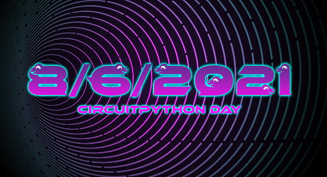](https://circuitpython.org/)

8-6-2021 is the Snakiest day of the year and it's also this year's CircuitPython Day! The day highlights all things CircuitPython and Python on Hardware.

Working with CircuitPython? Tag your projects #CircuitPythonDay2021 on social media and Adafruit will look to highlight them.

**Tentative Activities**

- 1 pm US Eastern Time: Jeff, Dan and Kattni Discuss CircuitPython
- 3 pm US Eastern Time: A CircuitPython Board Tour with Ladyada
- 5 PM US Eastern: Time: Scott’s Deep Dive, special edition

## EuroPython 2021

EuroPython 2021 is happening this week! Tickets are required for this online conference. More - [ep2021.europython.eu](https://ep2021.europython.eu/).

Preparing for the conference - [EuroPython](https://blog.europython.eu/europython-2021-preparing-for-the-conference/).

## The Adafruit IO CircuitPython Library Has Been Updated

The Adafruit_CircuitPython_AdafruitIO library has been updated to version 5.5.0. It allows groups to be subscribed to and unsubscribed from - [GitHub](https://github.com/adafruit/Adafruit_CircuitPython_AdafruitIO/releases/tag/5.5.0).

## CircuitPython Deep Dive Stream with Scott Shawcroft

[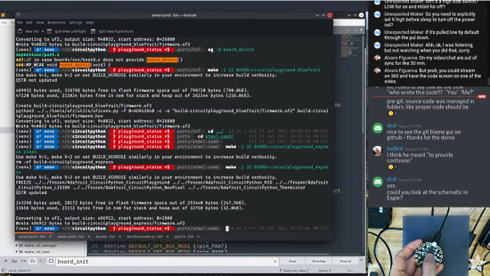](https://youtu.be/LkvRkUkPwPs)

[This week](https://youtu.be/LkvRkUkPwPs), Scott streams his CircuitPython 7.0.0 bug fest.

You can see the latest video and past videos on the Adafruit YouTube channel under the Deep Dive playlist - [YouTube](https://www.youtube.com/playlist?list=PLjF7R1fz_OOXBHlu9msoXq2jQN4JpCk8A).

## News from around the web!

[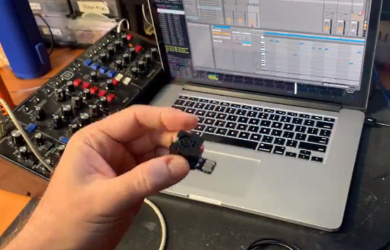](https://twitter.com/todbot/status/1417297915094077450)

> A USB-to-MIDI converter! It uses an Adafruit Rotary Trinkey with a USB jack hot glued in place of the encoder. This is a really bad idea. But at least the code's in CircuitPython - [Twitter Thread](https://twitter.com/todbot/status/1417297915094077450).

[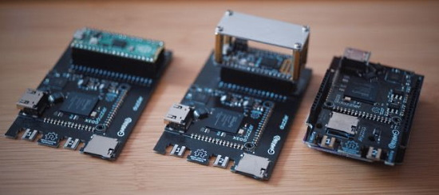](https://tinyletter.com/jamesbowman/letters/circuitpython-bandwidth-shootout)

A CircuitPython video copy bandwidth shootout between the Raspberry Pi Pico, Adafruit Metro M4 Express, Adafruit Feather M4 Express, and PJRC Teensy 4.0 - [James Bowman](https://tinyletter.com/jamesbowman/letters/circuitpython-bandwidth-shootout).

[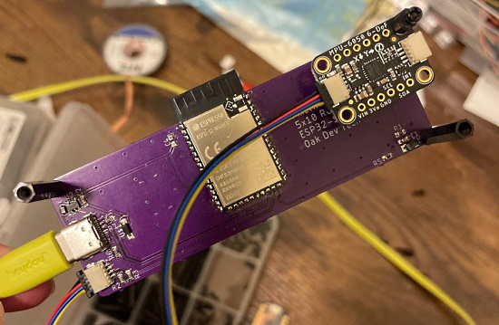](https://twitter.com/oakdevtech/status/1417680845180084229)

> The added Stemma/Qwiic connector on the PixelWing means you can have more plug and play fun! We’re making a fun project using the Adafruit MPU 6050 and CircuitPython to show how you can use MPU data to alter the matrix output - [Twitter](https://twitter.com/oakdevtech/status/1417680845180084229).

Moving objects on a screen by using a BlackBerry trackball module with an Adafruit CLUE usingh CircuitPython - [Twitter](https://twitter.com/AoyamaProd/status/1417840288056315910) (Japanese).

[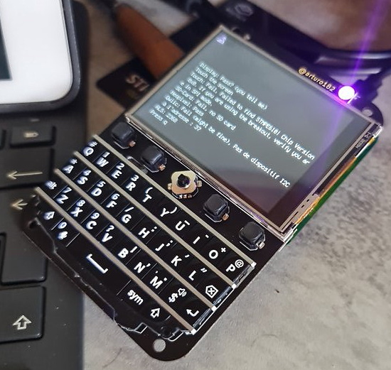](https://twitter.com/BeBoXoS/status/1417917589238521858)

Using the Keyboard FeatherWing with various boards and CircuitPython - [Twitter](https://twitter.com/BeBoXoS/status/1417917589238521858).

Restoring an old lantern. The inside is an Adafruit ItsyBitsy M4 powering 32 NeoPixels and running CircuitPython to change colors and run fun animations controlled by two buttons on the bottom - [Twitter](https://twitter.com/MarkKomus/status/1417874715864092674).

Latest Python Extension for VS Code release introduces faster way to set project roots - [SD Times](https://sdtimes.com/msft/latest-python-extension-for-vs-code-release-introduces-faster-way-to-set-project-roots/).

The [July 2021 Newsletter](https://mailchi.mp/python/psf-july-2021) is out. Also the Python Software Foundation New Fellow Members for Q2 2021 [was announced](http://feedproxy.google.com/~r/PythonSoftwareFoundationNews/~3/1_DITBV7SCk/python-software-foundation-fellow.html).

The Bluepad32 library in the CircuitPython Community Bundle allows use of your PlayStation (PS3, PS4, PS5), Nintendo (Wii, Wii U, Switch) and Xbox One S gamepads in your electronics project - [retro.moe](https://retro.moe/2021/07/25/bluepad32-support-for-arduino-and-circuitpython/).

A demo of the LILYGO board using CircuitPython - [Twitter](https://twitter.com/todbot/status/1417596861184020480).

Neopixels, QtPy (cameo CPX to proto code), 3D printing, and dabs of hot glue - not to mention a twist. - [Molecularist blog](https://www.molecularist.com/2021/07/last-challenge-project-tree-of-life-with-a-twist.html).

Digi XBee MicroPython PyCharm IDE Plugin - [Digi](https://www.digi.com/videos/digi-xbee-micropython-pycharm-ide-plugin-demo) and [Twitter](https://twitter.com/digidotcom/status/1419722595449020417).

Using MicroPython With Kitronik BBC micro:bit Products - [Kitronik Blog](https://kitronik.co.uk/blogs/resources/micropython-kitronik-bbc-microbit) and [Twitter](https://twitter.com/Kitronik/status/1419704107204493312).

[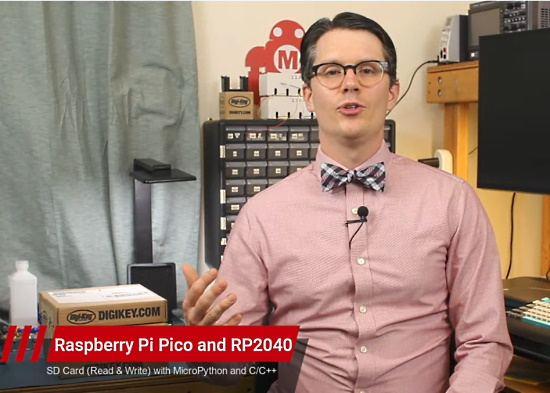](https://www.youtube.com/watch?v=u-vmsIr-s7w)

Raspberry Pi Pico (RP2040) SD Card (Read & Write) with MicroPython and C/C++ by Digi-Key Electronics - [YouTube](https://www.youtube.com/watch?v=u-vmsIr-s7w) and [Twitter](https://twitter.com/ArkadiuszRataj/status/1419653828840931333).

[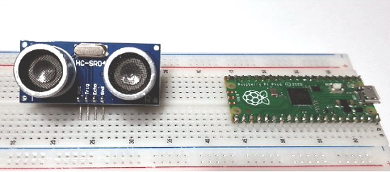](https://peppe8o.com/control-an-hc-sr04-ultrasonic-sensor-with-raspberry-pi-pico-and-micropython/)

Control an HC-SR04 Ultrasonic Sensor with a Raspberry Pi Pico and MicroPython - [peppe8o](https://peppe8o.com/control-an-hc-sr04-ultrasonic-sensor-with-raspberry-pi-pico-and-micropython/).

[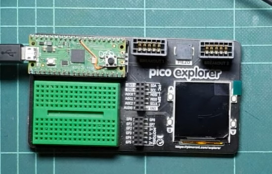](https://www.youtube.com/watch?v=ZgV_4lQDIc4&t=1s)

Drawing Triangles on the PiPico and Pimoroni Pico Explorer Board with MicroPython - [YouTube](https://www.youtube.com/watch?v=ZgV_4lQDIc4&t=1s).

[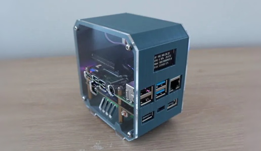](https://www.the-diy-life.com/mini-raspberry-pi-server-with-built-in-ups/)

A mini Raspberry Pi Server with a built-in UPS. The server stats are displayed on an OLED display using a Python script using CircuitPython libraries and the Blinka interface - [The DIY Life](https://www.the-diy-life.com/mini-raspberry-pi-server-with-built-in-ups/) and the [Adafruit Blog](https://blog.adafruit.com/2021/07/23/mini-raspberry-pi-server-with-a-built-in-ups-circuitpython-python-raspberrypi-piday-raspberry_pi/).

Use Python to Detect Music Onsets - [freeCodeCamp](https://www.freecodecamp.org/news/use-python-to-detect-music-onsets/).

Python import: Advanced Techniques and Tips - [Real Python](https://realpython.com/python-import/).

Python zip() Function – Explained with Code Examples - [freeCodeCamp](https://www.freecodecamp.org/news/the-zip-function-in-python-explained-with-examples/).

Bite-sized refactoring - [Pydon't](https://mathspp.com/blog/pydonts/bite-sized-refactoring).

[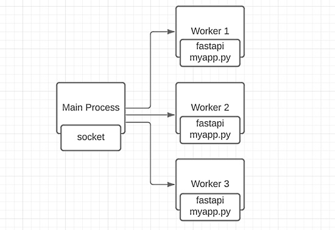](https://write.as/rafaelcaricio/why-not-just-use-async-python-for-this-api)

Why not just use async Python for this API? - [Modern Craft Studio](https://write.as/rafaelcaricio/why-not-just-use-async-python-for-this-api).

Freezing Your Python Code - [Hitchhiker's Guide to Python](https://docs.python-guide.org/shipping/freezing/).

Golang vs. Python: Which One to Choose? - [DZone](https://dzone.com/articles/golang-vs-python-which-one-to-choose) and [Twitter](https://twitter.com/Python_News/status/1417234388853665794).

[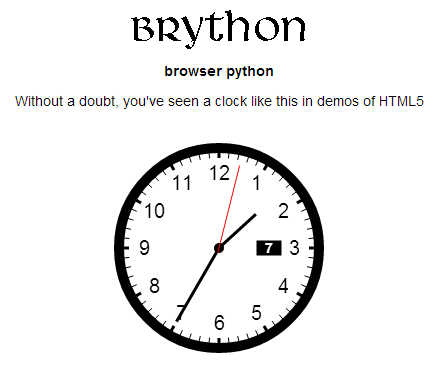](https://github.com/brython-dev/brython)

Brython (Browser Python) is an implementation of Python 3 running in the browser, with an interface to the DOM elements and events - [Main site](https://www.brython.info/) and [GitHub](https://github.com/brython-dev/brython).

[An Example Linux GPIO Device Driver in Rust](https://lwn.net/Articles/863459/).

freemocap is a work in progress motion capture system. Each recording must (for now) start with an unobstructed view of a Charuco board generated with Python commands - [GitHub](https://github.com/jonmatthis/freemocap).

Minimum Viable Governance: lightweight community structure to grow your FOSS projects - [GitHub Blog](https://github.blog/2021-07-22-minimum-viable-governance-lightweight-community-structure-foss-projects/).

Oh My Git! An open source game about learning Git - [Oh My Git](https://ohmygit.org/).

PyDev of the Week: Philipp Rudiger from [Mouse vs Python](https://www.blog.pythonlibrary.org/2021/07/26/pydev-of-the-week-philipp-rudiger/)

CircuitPython Weekly Meeting for July 26th, 2021 [on YouTube](https://youtu.be/xQRfkXs8E-8) and [notes doc](https://github.com/adafruit/adafruit-circuitpython-weekly-meeting/blob/main/2021/2021-07-26.md)

#ICYDNCI What was the most popular, most clicked link, in [last week's newsletter](https://www.adafruitdaily.com/2021/07/20/python-on-microcontrollers-newsletter-wippersnapper-beta-30k-discord-users-and-more-python-adafruit-circuitpython-micropython-thepsf/)? [New Book: Visual Studio Code for Python Programmers](https://blog.adafruit.com/2021/07/16/new-book-visual-studio-code-for-python-programmers-python-code-vogueandcode/).

## Coming soon

In this past Sunday's Desk of Ladyada, there are Stemma QT redesigns of the SCD40/SCD41 and IS31FL3741 chips and redesigning some recent boards like the Matrix Portal to use ESP32-S2 - [YouTube](https://www.youtube.com/watch?v=6SCGWb46x7E).

## New Boards Supported by CircuitPython

The number of supported microcontrollers and Single Board Computers (SBC) grows every week. This section outlines which boards have been included in CircuitPython or added to [CircuitPython.org](https://circuitpython.org/).

This week, there were no new boards added, but several are in development.

Looking to add a new board to CircuitPython? It's highly encouraged! Adafruit has four guides to help you do so:

- [How to Add a New Board to CircuitPython](https://learn.adafruit.com/how-to-add-a-new-board-to-circuitpython/overview)
- [How to add a New Board to the circuitpython.org website](https://learn.adafruit.com/how-to-add-a-new-board-to-the-circuitpython-org-website)
- [Adding a Single Board Computer to PlatformDetect for Blinka](https://learn.adafruit.com/adding-a-single-board-computer-to-platformdetect-for-blinka)
- [Adding a Single Board Computer to Blinka](https://learn.adafruit.com/adding-a-single-board-computer-to-blinka)

## New Learn Guides!

[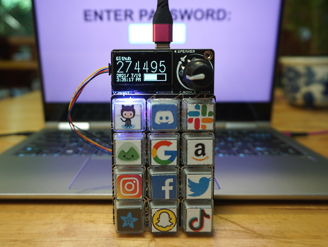](https://learn.adafruit.com/guides/latest)

[MacroPad 2FA TOTP Authentication Friend](https://learn.adafruit.com/macropad-2fa-totp-authentication-friend) from [Carter Nelson](https://learn.adafruit.com/users/caternuson)

[MacroPad Braille Keycaps](https://learn.adafruit.com/macropad-braille-keycaps) from [Noe and Pedro](https://learn.adafruit.com/users/pixil3d)

## CircuitPython Project Bundle

When you get to the CircuitPython code section of an [Adafruit Learn Guide](https://learn.adafruit.com/), sometimes things can get a bit complicated. You not only have the code you need to upload to your device, but you likely also need to add some libraries that the code requires to run. This involved downloading all the libraries, digging through to find the ones you need, and copying them to your device. That was only the beginning on some projects, as those that include images and/or sound files required further downloading and copying of files. But, not anymore!

Now, with Project Bundles, you can download all the necessary code, libraries and, if needed, asset files with one click! We automatically check which libraries are required for the project and bundle them up for you. No more digging through a huge list of libraries to find the ones you need, or fiddling with looking for other files or dependencies. Download the Project Bundle, copy the contents to your device, and your code will simply work. We wanted to make this the easiest way to get a project working, regardless of whether you're a beginner or an expert. We'll also be adding this feature to popular IDEs as an add-on. Try it out with any Circuit Python guide on the Adafruit Learning System. Just look for the ‘Download Project Bundle’ button on the code page. 

**To download and use a Project Bundle:**

In the Learning System - above any embedded code in a guide in the Adafruit Learn System, you’ll find a Download Project Bundle button.

Click the button to download the Project Bundle zip.

Open the Project Bundle zip to find the example code, all necessary libraries, and, if available, any images, sounds, etc.

Simply copy all the files over to your CIRCUITPY drive, and you’re ready to go!

If you run into any problems or bugs, or would like to submit feedback, please file an issue on the [Adafruit Learning System Guides GitHub repo](https://github.com/adafruit/Adafruit_Learning_System_Guides/issues).

## CircuitPython Libraries!

CircuitPython support for hardware continues to grow. We are adding support for new sensors and breakouts all the time, as well as improving on the drivers we already have. As we add more libraries and update current ones, you can keep up with all the changes right here!

For the latest libraries, download the [Adafruit CircuitPython Library Bundle](https://circuitpython.org/libraries). For the latest community contributed libraries, download the [CircuitPython Community Bundle](https://github.com/adafruit/CircuitPython_Community_Bundle/releases).

If you'd like to contribute, CircuitPython libraries are a great place to start. Have an idea for a new driver? File an issue on [CircuitPython](https://github.com/adafruit/circuitpython/issues)! Have you written a library you'd like to make available? Submit it to the [CircuitPython Community Bundle](https://github.com/adafruit/CircuitPython_Community_Bundle). Interested in helping with current libraries? Check out the [CircuitPython.org Contributing page](https://circuitpython.org/contributing). We've included open pull requests and issues from the libraries, and details about repo-level issues that need to be addressed. We have a guide on [contributing to CircuitPython with Git and Github](https://learn.adafruit.com/contribute-to-circuitpython-with-git-and-github) if you need help getting started. You can also find us in the #circuitpython channel on the [Adafruit Discord](https://adafru.it/discord).

You can check out this [list of all the Adafruit CircuitPython libraries and drivers available](https://github.com/adafruit/Adafruit_CircuitPython_Bundle/blob/master/circuitpython_library_list.md). 

The current number of CircuitPython libraries is **327**!

**New Libraries!**

Here's this week's new CircuitPython libraries:

 * [Adafruit_CircuitPython_Pixelbuf](https://github.com/adafruit/Adafruit_CircuitPython_Pixelbuf)

**Updated Libraries!**

Here's this week's updated CircuitPython libraries:

 * [Adafruit_CircuitPython_DisplayIO_SSD1306](https://github.com/adafruit/Adafruit_CircuitPython_DisplayIO_SSD1306)
 * [Adafruit_CircuitPython_MiniMQTT](https://github.com/adafruit/Adafruit_CircuitPython_MiniMQTT)
 * [Adafruit_CircuitPython_DisplayIO_SSD1305](https://github.com/adafruit/Adafruit_CircuitPython_DisplayIO_SSD1305)
 * [Adafruit_CircuitPython_SSD1325](https://github.com/adafruit/Adafruit_CircuitPython_SSD1325)
 * [Adafruit_CircuitPython_SSD1327](https://github.com/adafruit/Adafruit_CircuitPython_SSD1327)
 * [Adafruit_CircuitPython_SSD1331](https://github.com/adafruit/Adafruit_CircuitPython_SSD1331)
 * [Adafruit_CircuitPython_SSD1351](https://github.com/adafruit/Adafruit_CircuitPython_SSD1351)
 * [Adafruit_CircuitPython_ST7735R](https://github.com/adafruit/Adafruit_CircuitPython_ST7735R)
 * [Adafruit_CircuitPython_ST7735](https://github.com/adafruit/Adafruit_CircuitPython_ST7735)
 * [Adafruit_CircuitPython_HX8357](https://github.com/adafruit/Adafruit_CircuitPython_HX8357)
 * [Adafruit_CircuitPython_ILI9341](https://github.com/adafruit/Adafruit_CircuitPython_ILI9341)
 * [Adafruit_CircuitPython_MONSTERM4SK](https://github.com/adafruit/Adafruit_CircuitPython_MONSTERM4SK)
 * [Adafruit_CircuitPython_turtle](https://github.com/adafruit/Adafruit_CircuitPython_turtle)
 * [Adafruit_CircuitPython_DisplayIO_SH1107](https://github.com/adafruit/Adafruit_CircuitPython_DisplayIO_SH1107)
 * [Adafruit_CircuitPython_DisplayIO_Layout](https://github.com/adafruit/Adafruit_CircuitPython_DisplayIO_Layout)
 * [Adafruit_CircuitPython_Pypixelbuf](https://github.com/adafruit/Adafruit_CircuitPython_Pypixelbuf)
 * [Adafruit_CircuitPython_MIDI](https://github.com/adafruit/Adafruit_CircuitPython_MIDI)
 * [Adafruit_CircuitPython_SSD1681](https://github.com/adafruit/Adafruit_CircuitPython_SSD1681)
 * [Adafruit_CircuitPython_SSD1680](https://github.com/adafruit/Adafruit_CircuitPython_SSD1680)
 * [Adafruit_CircuitPython_IL0373](https://github.com/adafruit/Adafruit_CircuitPython_IL0373)
 * [Adafruit_CircuitPython_Gizmo](https://github.com/adafruit/Adafruit_CircuitPython_Gizmo)
 * [Adafruit_CircuitPython_SSD1608](https://github.com/adafruit/Adafruit_CircuitPython_SSD1608)
 * [Adafruit_CircuitPython_IL0398](https://github.com/adafruit/Adafruit_CircuitPython_IL0398)
 * [Adafruit_CircuitPython_SSD1675](https://github.com/adafruit/Adafruit_CircuitPython_SSD1675)
 * [Adafruit_CircuitPython_ST7789](https://github.com/adafruit/Adafruit_CircuitPython_ST7789)
 * [Adafruit_CircuitPython_Display_Text](https://github.com/adafruit/Adafruit_CircuitPython_Display_Text)
 * [Adafruit_CircuitPython_RFM9x](https://github.com/adafruit/Adafruit_CircuitPython_RFM9x)
 * [Adafruit_CircuitPython_AdafruitIO](https://github.com/adafruit/Adafruit_CircuitPython_AdafruitIO)
 * [Adafruit_CircuitPython_DotStar](https://github.com/adafruit/Adafruit_CircuitPython_DotStar)
 * [Adafruit_CircuitPython_NeoPixel](https://github.com/adafruit/Adafruit_CircuitPython_NeoPixel)
 * [Adafruit_CircuitPython_EPD](https://github.com/adafruit/Adafruit_CircuitPython_EPD)
 * [Adafruit_CircuitPython_MagTag](https://github.com/adafruit/Adafruit_CircuitPython_MagTag)
 * [Adafruit_CircuitPython_Requests](https://github.com/adafruit/Adafruit_CircuitPython_Requests)
 * [Adafruit_CircuitPython_PortalBase](https://github.com/adafruit/Adafruit_CircuitPython_PortalBase)
 * [Adafruit_CircuitPython_CircuitPlayground](https://github.com/adafruit/Adafruit_CircuitPython_CircuitPlayground)
 * [Adafruit_CircuitPython_OV2640](https://github.com/adafruit/Adafruit_CircuitPython_OV2640)
 * [Adafruit_CircuitPython_PYOA](https://github.com/adafruit/Adafruit_CircuitPython_PYOA)
 * [Adafruit_CircuitPython_Slideshow](https://github.com/adafruit/Adafruit_CircuitPython_Slideshow)
 * [Adafruit_CircuitPython_MacroPad](https://github.com/adafruit/Adafruit_CircuitPython_MacroPad)
 * [Adafruit_CircuitPython_PyBadger](https://github.com/adafruit/Adafruit_CircuitPython_PyBadger)
 * [Adafruit_Blinka](https://github.com/adafruit/Adafruit_Blinka)
 * [Adafruit_Python_PlatformDetect](https://github.com/adafruit/Adafruit_Python_PlatformDetect)

## What’s the team up to this week?

What is the team up to this week? Let’s check in!

**Dan**

I released CircuitPython 7.0.0-alpha.5 on Wednesday, July 21. The CircuitPython core team went through all the 7.0.0 issues, trimmed the list a bit, and are now resolving the issues. Of course new issues also appear to fix, but we're making good progress.

**Jeff**

Using the new NeoKey 5x6 Ortho Snap-Apart and a Feather S2, I verified that the new keypad module works on the ESP32-S2 series of microcontrollers.

I also added a JPEG capture mode to the OV2640 camera library for CircuitPython. The whole JPEG has to be temporarily stored in RAM before it is written to an SD card, so the ESP32-S2 with generous PSRAM is a good choice and can capture 2-megapixel JPEG images.

**Kattni**

I published the [Adafruit TCA4307 guide](https://learn.adafruit.com/adafruit-tca4307). The TCA4307 is a hot-swap I2C buffer. I2C isn't hot-swappable by itself, but STEMMA QT connectors make it really convenient to do, and that's where the TCA4307 comes in. This was a quick guide, as there's no code to go with it. It includes an Overview, Pinouts, example wiring diagram, and Downloads resources.

I also wrote up an example for Noe and Pedro for their [MacroPad Braille Keycaps](https://learn.adafruit.com/macropad-braille-keycaps) guide that plays a tone for each key for an added level of accessibility. 

We did the Hackaday Hackchat on Wednesday. We discussed DIY keyboards and CircuitPython keyboard support. We answered a lot of questions and gave away a fun Hackaday custom keycap to a few folks towards the end.

The highlight of my week, though, was levelling up my contributions to the CircuitPython core. I renamed `_pixelbuf` to `adafruit_pixelbuf` (and aliased it back for backwards compatibility) to match the new Python version of `adafruit_pixelbuf` which will eventually simplify the NeoPixel and DotStar libraries. I had help from Dan and Jeff. It's my biggest core contribution to date. I learned a lot and enjoyed dipping my toes into the core.

**Melissa**

[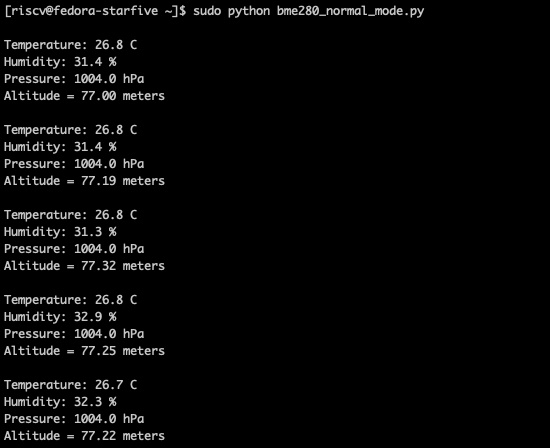](https://circuitpython.org/)

This past week, I worked on add Blinka Support to the BeagleV Starlight, which is a beta prototype not yet available to the general public. I was able to get GPIO and I2C functioning which covers a great deal of add-on boards. I didn't test UART, though it would likely work with PySerial. I also spent some time working on some GitHub issues which were focussed on CircuitPython 7.0 compatibility with some of the libraries.

**Scott**

At the end of last week Dan, Jeff, Kattni and I went through open 7.0.0 issues to categorize them and then also the open pull requests. We got the 7.0.0 milestone down to ~40 issues and divided them among us. Since then, I've been getting changes merged to fix the issues assigned to me. We're squashing the bugs to get us closer to the 7.0.0 stable release. It shouldn't be too far away now. Please file an issue if you are having issues with the latest alpha (version 5 at the moment.)

We also closed a number of pull requests and only had three left open. I think it's been over a year at least since we were that low. We tend to worry if we have more than 20 open so this is exciting!

All-in-all we're making good progress on 7.0.0. Once I'm through my bugs I'll be circling back to BLE workflow stuff. It still needs polish.

## Upcoming events!

EuroPython, the largest conference for the Python programming language in Europe, will be held online July 26 - August 1, 2021. More information at [https://ep2021.europython.eu/](https://ep2021.europython.eu/)

PyOhio 2021 is a free event on July 31, 2021 - [PyOhio.org](https://www.pyohio.org/2021/) via [Twitter](https://twitter.com/PyOhio/status/1370184124460367881).

PyConline AU will be held 10-12 September, 2021 - [pyconlineau](https://2021.pycon.org.au/)

Kiwi PyCon XI, Ōtautahi Christchurch, 17th, 18th, & 19th of September 2021 and CFP ends July 16th - [python.nz](https://python.nz/kiwipycon).

**Send Your Events In**

As for other events, with the COVID pandemic, most in-person events are postponed or cancelled. If you know of virtual events or events that may occur in the future, please let us know on Discord or on Twitter with hashtag #CircuitPython.

## Latest releases

CircuitPython's stable release is [6.3.1](https://github.com/adafruit/circuitpython/releases/latest) and its unstable release is [7.0.0-alpha.5](https://github.com/adafruit/circuitpython/releases). New to CircuitPython? Start with our [Welcome to CircuitPython Guide](https://learn.adafruit.com/welcome-to-circuitpython).

[20210726](https://github.com/adafruit/Adafruit_CircuitPython_Bundle/releases/latest) is the latest CircuitPython library bundle.

[v1.16](https://micropython.org/download) is the latest MicroPython release. Documentation for it is [here](http://docs.micropython.org/en/latest/pyboard/).

[3.9.6](https://www.python.org/downloads/) is the latest Python release. The latest pre-release version is [3.10.0b4](https://www.python.org/download/pre-releases/).

[2,522 Stars](https://github.com/adafruit/circuitpython/stargazers) Like CircuitPython? [Star it on GitHub!](https://github.com/adafruit/circuitpython)

## Call for help -- Translating CircuitPython is now easier than ever!

[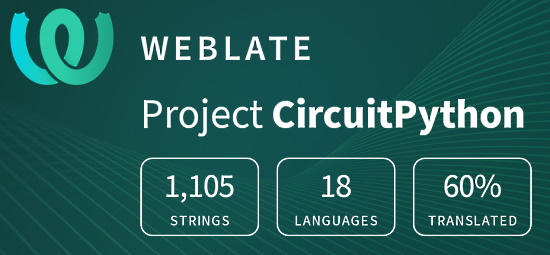](https://hosted.weblate.org/engage/circuitpython/)

One important feature of CircuitPython is translated control and error messages.

With the help of fellow open source project [Weblate](https://weblate.org/), we're making it even easier to add or improve translations.

Sign in with an existing account such as GitHub, Google or Facebook and start contributing through a simple web interface. No forks or pull requests needed!

As always, if you run into trouble join us on [Discord](https://adafru.it/discord), we're here to help.

## jobs.adafruit.com - Find a dream job, find great candidates!

[jobs.adafruit.com](https://jobs.adafruit.com/) has returned and folks are posting their skills (including CircuitPython) and companies are looking for talented makers to join their companies - from Digi-Key, to Hackaday, Micro Center, Raspberry Pi and more.

**Job of the Week**

Design/Build wearable necklace pendant that buzzes - [Adafruit Jobs Board](https://jobs.adafruit.com/job/design-build-wearable-necklace-pendant-that-buzzes/).

## 30,112 thanks!

The Adafruit Discord community, where we do all our CircuitPython development in the open, reached over 30,112 humans, thank you!  Adafruit believes Discord offers a unique way for CircuitPython folks to connect. Join today at [https://adafru.it/discord](https://adafru.it/discord).

## ICYMI - In case you missed it

The wonderful world of Python on hardware! This is our Python video-newsletter-podcast! The news comes from the Python community, Discord, Adafruit communities and more and is reviewed on ASK an ENGINEER Wednesdays. The complete Python on Hardware weekly videocast [playlist is here](https://www.youtube.com/playlist?list=PLjF7R1fz_OOXRMjM7Sm0J2Xt6H81TdDev). 

This video podcast is on [iTunes](https://itunes.apple.com/us/podcast/python-on-hardware/id1451685192?mt=2), [YouTube](http://adafru.it/pohepisodes), [IGTV (Instagram TV](https://www.instagram.com/adafruit/channel/)), and [XML](https://itunes.apple.com/us/podcast/python-on-hardware/id1451685192?mt=2).

[Weekly community chat on Adafruit Discord server CircuitPython channel - Audio / Podcast edition](https://itunes.apple.com/us/podcast/circuitpython-weekly-meeting/id1451685016) - Audio from the Discord chat space for CircuitPython, meetings are usually Mondays at 2pm ET, this is the audio version on [iTunes](https://itunes.apple.com/us/podcast/circuitpython-weekly-meeting/id1451685016), Pocket Casts, [Spotify](https://adafru.it/spotify), and [XML feed](https://adafruit-podcasts.s3.amazonaws.com/circuitpython_weekly_meeting/audio-podcast.xml).

And lastly, we are working up a one-spot destination for all things podcast-able here - [podcasts.adafruit.com](https://podcasts.adafruit.com/)

## Codecademy "Learn Hardware Programming with CircuitPython"

Codecademy, an online interactive learning platform used by more than 45 million people, has teamed up with the leading manufacturer in STEAM electronics, Adafruit Industries, to create a coding course, "Learn Hardware Programming with CircuitPython". The course is now available in the [Codecademy catalog](https://www.codecademy.com/learn/learn-circuitpython?utm_source=adafruit&utm_medium=partners&utm_campaign=circuitplayground&utm_content=pythononhardwarenewsletter).

Python is a highly versatile, easy to learn programming language that a wide range of people, from visual effects artists in Hollywood to mission control at NASA, use to quickly solve problems. But you don’t need to be a rocket scientist to accomplish amazing things with it. This new course introduces programmers to Python by way of a microcontroller — CircuitPython — which is a Python-based programming language optimized for use on hardware.

CircuitPython’s hardware-ready design makes it easier than ever to program a variety of single-board computers, and this course gets you from no experience to working prototype faster than ever before. Codecademy’s interactive learning environment, combined with Adafruit's highly rated Circuit Playground Express, present aspiring hardware hackers with a never-before-seen opportunity to learn hardware programming seamlessly online.

Whether for those who are new to programming, or for those who want to expand their skill set to include physical computing, this course will have students getting familiar with Python and creating incredible projects along the way. By the end, students will have built their own bike lights, drum machine, and even a moisture detector that can tell when it's time to water a plant.

Visit Codecademy to access the [Learn Hardware Programming with CircuitPython](https://www.codecademy.com/learn/learn-circuitpython?utm_source=adafruit&utm_medium=partners&utm_campaign=circuitplayground&utm_content=pythononhardwarenewsletter) course and Adafruit to purchase a [Circuit Playground Express](https://www.adafruit.com/product/3333).

Codecademy has helped more than 45 million people around the world upgrade their careers with technology skills. The company’s online interactive learning platform is widely recognized for providing an accessible, flexible, and engaging experience for beginners and experienced programmers alike. Codecademy has raised a total of $43 million from investors including Union Square Ventures, Kleiner Perkins, Index Ventures, Thrive Capital, Naspers, Yuri Milner and Richard Branson, most recently raising its $30 million Series C in July 2016.

## Contribute!

The CircuitPython Weekly Newsletter is a CircuitPython community-run newsletter emailed every Tuesday. The complete [archives are here](https://www.adafruitdaily.com/category/circuitpython/). It highlights the latest CircuitPython related news from around the web including Python and MicroPython developments. To contribute, edit next week's draft [on GitHub](https://github.com/adafruit/circuitpython-weekly-newsletter/tree/gh-pages/_drafts) and [submit a pull request](https://help.github.com/articles/editing-files-in-your-repository/) with the changes. You may also tag your information on Twitter with #CircuitPython. 

Join our [Discord](https://adafru.it/discord) or [post to the forum](https://forums.adafruit.com/viewforum.php?f=60) for any further questions.
