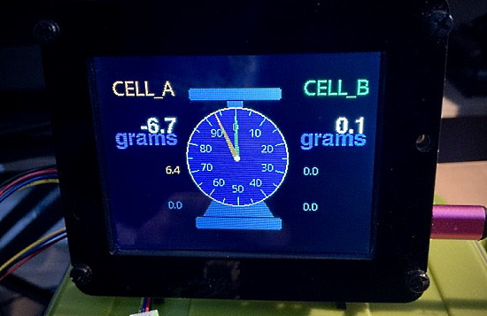
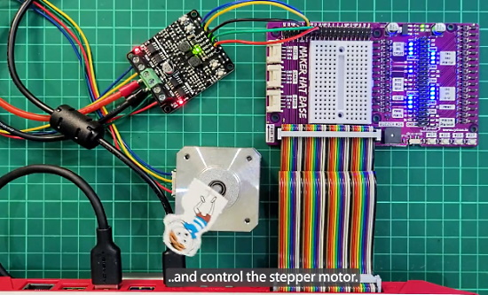
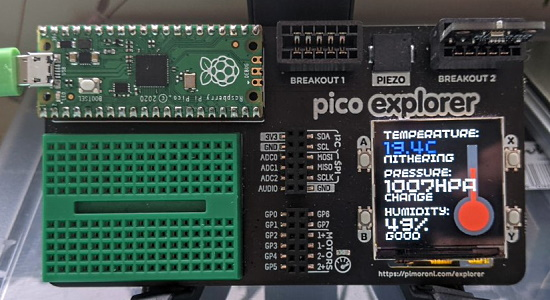
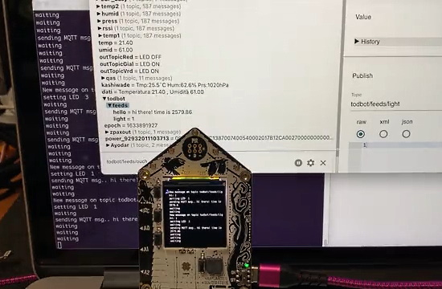
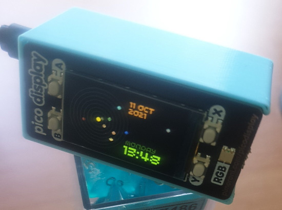
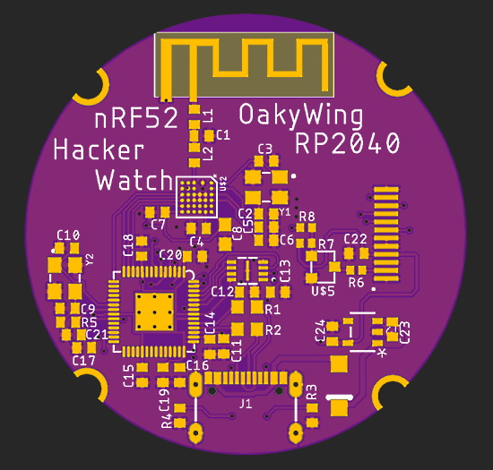
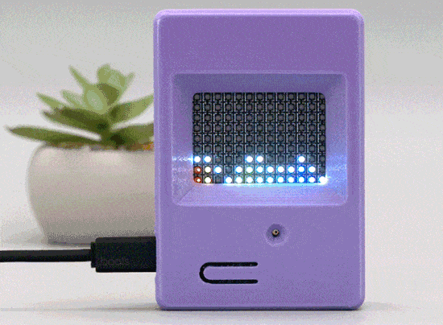

- [X] Kattni updates
- [ ] change date
- [ ] update title
- [ ] Feature story
- [ ] Update  for images
- [ ] Update ICYDNCI
- [ ] All images 550w max only
- [ ] Link "View this email in your browser."

View this email in your browser.

Presenting the latest Python on Microcontrollers newsletter, brought you by the community! We're on [Discord](https://discord.gg/HYqvREz), [Twitter](https://twitter.com/search?q=circuitpython&src=typed_query&f=live), and for past newsletters - [view them all here](https://www.adafruitdaily.com/category/circuitpython/). If you're reading this on the web, [subscribe here](https://www.adafruitdaily.com/). On to the show!

## Python Becomes the #1 Programming Language via TIOBE

For the first time in more than 20 years, the TIOBE programming language index a new leader of the pack: the Python programming language. The long-standing hegemony of Java and C is over. Python, which started as a simple scripting language, as an alternative to Perl, has become mature. Its ease of learning, its huge amount of libraries, and its widespread use in all kinds of domains, has made it the most popular programming language of today. Congratulations Guido van Rossum and the many contributors to the Python ecosystem! - [TIOBE](https://www.tiobe.com/tiobe-index/).

## Mu editor version 1.1.0-beta.6 is out with Multilanguage Support

Beta 6 of the Python editor Mu is now available, with a dozen changes including multilanguage support - [Adafruit Blog](https://blog.adafruit.com/2021/10/06/mu-editor-version-1-1-0-beta-6-is-out-with-multilanguage-support-mu-python/) and [madewith.mu](https://madewith.mu/mu/users/2021/10/06/beta6.html).

Download the software free at [codewith.mu](https://codewith.mu/).

## Over 3,000 Closed Pull Requests in CircuitPython Core!

There have now been over 3,000 closed (both merged and unmerged) Pull Requests in CircuitPython core, showing just how much active development has been happening!  From CircuitPython's humble beginnings to CircuitPython 7.0.0, this open source project keeps getting better and better - [GitHub](https://github.com/adafruit/circuitpython/pulls?q=is%3Apr+is%3Aclosed).

## The Stage Game Library for CircuitPython is Ported to the Pimoroni PicoSystem

With the help of Gadgetoid at Pimoroni, Deshipu has ported the CircuitPython Stage game library to Pimoroni PicoSystem, a Raspberry Pi Pico-based gaming device. Both Vacuum Invaders and Jumper Wire work fine  - [Twitter](https://twitter.com/deshipu/status/1446076574370045960).

Learn more about the Stage game library - [Adafruit Learning System](https://learn.adafruit.com/circuitpython-stage-game-library).

## Guido van Rossum Talks About Speeding Up Python

The Software at Scale Podcast 34 presents "Faster Python with Guido van Rossum". They discuss Guido’s new work on making CPython faster (PEP 659), Tiers of Python Interpreter Execution, and high impact, low hanging fruit performance improvements - [Software at Scale](https://www.softwareatscale.dev/p/software-at-scale-34-faster-python).

## A Limited-Edition CircuitPython 7 Poster Available

A limited-edition CircuitPython 7 Poster is now available from Adafruit. Unlike previous releases, the printer could only make a small number of posters and they are expected to go quickly - [Adafruit](https://www.adafruit.com/product/5067).

## Awesome Actions

Awesome Actions is a curated list of awesome things related to GitHub Actions. Actions are triggered by GitHub platform events directly in a repo and run on-demand workflows either on Linux, Windows or macOS virtual machines or inside a container in response. With GitHub Actions, you can automate your workflow from idea to production - [GitHub](https://github.com/sdras/awesome-actions).

## Halloween Hackfest

Join Hackaday, Digi-Key, and Adafruit for a Halloween-themed contest! They want to see your crazy, creepy, ghostly, spooky, and awesome projects. 

If costumes are your favorite part of Halloween, then why not dress up your outfit with some hacked upgrades? You could even design a ghoulish prop to add to your home’s Halloween decor or light up a Jack-o-lantern with LEDs. Whether it’s technical, artistic, or just plain terrifying, Hackaday wants to see your projects!

Check out the Halloween Show & Tell with Hackaday, Friday, October 29th at 1pm PT, to show off your awesome projects entered in the contest. Don't forget to also share your projects on social media and use the #HalloweenHackfest!

Hackaday and Digi-Key have partnered on this Halloween-themed contest to offer three winners an online shopping spree to the Digi-Key warehouse! - [Hackaday](https://hackaday.com/2021/08/10/new-contest-halloween-hackfest/) and [hackaday.io](https://hackaday.io/contest/180664-halloween-hackfest).

## Hacktoberfest Begins October 1st

Hosted by DigitalOcean for the 8th year in a row, Hacktoberfest encourages participation in giving back to the open source community by completing pull requests, participating in events, and donating to open source projects. 

Anyone around the globe who desires to help drive the growth of open source and make positive contributions to an ever-growing community. All backgrounds and skill levels are encouraged to participate. The first 55,000 participants can earn a T-shirt. Learn more - [DigitalOcean](https://hacktoberfest.digitalocean.com/).

For CircuitPython, issues will soon be tagged for Hacktoberfest. [Good First Issues](https://circuitpython.org/contributing/open-issues?label=good-first-issue) and [open issues](https://circuitpython.org/contributing/open-issues) will both be featured. It is anticipated that the number of CircuitPython issues to work on will be higher this year.

# October is also Open Hardware Month 

October is Open Hardware Month! The Open Source Hardware Association (OSHWA) is providing resources and asking the community to host small, local events in the name of open source hardware. See more - [OSHWA](https://ohm.oshwa.org/).

## CircuitPython Deep Dive Stream with Scott Shawcroft

[This week](https://youtu.be/GAumhgKYue0), Scott covers progress on the Cortex A work for Raspberry Pi. He's been working on expanding the system view description (SVD) files and learning all about the Generic Interrupt Controller (GIC400 / GICv2). He'll also answer any questions folks have.

You can see the latest video and past videos on the Adafruit YouTube channel under the Deep Dive playlist - [YouTube](https://www.youtube.com/playlist?list=PLjF7R1fz_OOXBHlu9msoXq2jQN4JpCk8A).

## CircuitPython Parsec

John Park’s CircuitPython Parsec: 

* CPU Temperature - [Adafruit Blog](https://blog.adafruit.com/2021/10/08/john-parks-circuitpython-parsec-cpu-temperature-adafruit-johnedgarpark-adafruit-circuitpython/)

Catch all the episodes in the [YouTube playlist](https://www.youtube.com/playlist?list=PLjF7R1fz_OOWFqZfqW9jlvQSIUmwn9lWr).

## News from around the web!

CircuitPython School - Choosing a Board for CircuitPython: A Few Important Considerations - [YouTube](https://www.youtube.com/watch?v=2dEBAN_bd9o) via [Twitter](https://twitter.com/gallaugher/status/1445052490379104264).

Other new episodes:

* CircuitPython School Lesson 18 - random numbers, non-repeating randoms, & sparkly holiday ornament - [YouTube](https://www.youtube.com/watch?v=BppYPSu7vnw) via [Twitter](https://twitter.com/gallaugher/status/1445556090612060169).
* CircuitPython School Lesson 19 - Typing and keyboard control using the HID library - [YouTube](https://www.youtube.com/watch?v=0_gRfkuidmg) via [Twitter](https://twitter.com/gallaugher/status/1446076599045083140).

> Pushing my coding skills to the limit while working on a parametric dial indicator method for this dual scale project. CircuitPython displayio works well - responsive enough for most projects.Planning to use the method for analog clocks, meters, and other dials (volume, etc.) - [Twitter](https://twitter.com/CedarGroveMakr/status/1445847807282188288).

Make an Adobe Lightroom Macro Pad with Raspberry Pi Pico and CircuitPython - [Adafruit Blog](https://blog.adafruit.com/2021/10/08/make-an-adobe-lightroom-macro-pad-with-circuitpython-piday-raspberrypi-raspberry_pi/) and [GitHub](https://github.com/camerahacks/lightroom-macro-pad).

Updated the Circuit Playground Bluefruit code to work with CircuitPython 7  - [Twitter](https://twitter.com/gallaugher/status/1446201692521910276).

> The head’s phrases can be controlled simply by pressing buttons on the Adafruit Bluefruit Connect app. It’s fun to set up in the common area outside my office snd have it beckon passers by. A really easy and fun build.

A demonstration of PyBasic running autonomous on FeatherS2 and a Keyboard FeatherWing from Arturo182 fully working BASIC, programming on the go - [YouTube](https://youtu.be/TuuMez6DYIw) via [Twitter](https://twitter.com/BeBoXoS/status/1446942891427962886).

PicoLight is a minimalist adjustable light for low-light photography, based on the Raspberry Pi Pico and CircuitPython - [GitHub](https://github.com/Zalmotek/PicoLight) and [Hackster](https://www.hackster.io/alexandracovor/picolight-minimalist-light-for-product-shots-e19caa).

Yifan Zhou’s “Make Art” project for the Boston College Physical Computing course. Uses Adafruit Circuit Playground Bluefruit boards and CircuitPython - [Twitter](https://twitter.com/gallaugher/status/1446271976771833857).

LEDArcade is a graphics library for Adafruit LED matrices - [This Old Coder](https://datagod.hashnode.dev/ledarcade-upping-your-led-game) and [GitHub](https://github.com/datagod/LEDarcade).

Maker HAT Base allows easy access to the Raspberry Pi 400 GPIO pins with Python and CircuitPython Blinka - [Cyton](https://tutorial.cytron.io/2021/10/05/maker-hat-base-allows-you-to-easily-access-the-raspberry-pi-400-gpio-pins/) via [Twitter](https://twitter.com/cytrontech/status/1445599700489412616).

Making a tiny weather station with the Pimoroni Pico Explorer and MicroPython  - [Twitter](https://twitter.com/pimoroni/status/1446093079350419464).

Making a Halloween Book with CircuitPython and Adafruit FX Soundboard, PyPortal, NeoKey, Mini Boost, Powerboost 1000, and Raspberry Pi Pico - [Twitter](https://twitter.com/Gavin02639495/status/1446528264600698880).

A CH559 (USB to Serial) CircuitPython Library - [GitHub](https://github.com/dupontgu/ch559-circuitpython) and [Twitter](https://twitter.com/gvy_dvpont/status/1447230860105814017).

> I've been doing some MQTT in CircuitPython these last few weeks and I wanted to record (for myself really) how I was testing and using it. So here's a gist and a quick video of a simple example   - [GitHub](https://gist.github.com/todbot/a8f396bba06805ecbbe42a7d9069af60) via [Twitter](https://twitter.com/todbot/status/1447276304009629697).

Connect a Joystick to an ESP32 board to running MicroPython. This talks to JavaScript applications via MQTT (by using a mosquitto message broker installed to a Raspberry Pi) - [LinkedIn](https://www.linkedin.com/feed/update/urn:li:ugcPost:6852443407277690880/) (Italian) and [Twitter](https://twitter.com/biondifabio/status/1446679566228066308).

PyCon South Africa talk "Building a self watering plant using MicroPython on a WiFi enabled ESP8266" - [Twitter](https://twitter.com/AneleMakhaba/status/1446487300356120592).

Connecting a Miffy bunny to the Internet of Things with MicroPython, ESP8266 and MQTT - [Adafruit Blog](https://blog.adafruit.com/2021/10/08/connecting-a-miffy-bunny-to-the-internet-of-things-with-micropython-esp8266-and-mqtt-micropython-mqtt-esp8266-iot/).

> MicroPython is seriously awesome, here's a build I did of someone's Raspberry Pi Pico Clock - [Twitter](https://twitter.com/Derme302/status/1447409025037996035) and [GitHub](https://github.com/dr-mod/pico-solar-system).

  <a href="https://www.freepik.com/vectors/kids">Kids vector created by macrovector - www.freepik.com</a>

Is 40 the New 60? Older age discrimination in programming - [Never Work in Theory](https://neverworkintheory.org/2021/10/03/is-40-the-new-60.html).

PyBasic is a simple interactive BASIC interpreter written in Python - [GitHub](https://github.com/richpl/PyBasic), [Hackaday](https://hackaday.com/2021/10/08/python-provides-classic-basic/).

Ladyada from Adafruit ports PyBasic to an Adafruit PyPortal running CircuitPython - [YouTube](https://www.youtube.com/watch?v=d4x1OEPUvUI).

Bython is Python with braces. Bython is a Python preprosessor which translates curly brackets into indentation. "Because Python is awesome, but whitespace is awful" - [GitHub](https://github.com/mathialo/bython).

Cool New Features in Python 3.10 - [Real Python](https://realpython.com/courses/cool-new-features-python-310/) via [Twitter](https://twitter.com/realpython/status/1446158667397615621).

Awesome QR Code is a curated list of awesome QR code libraries, software and resources - [GitHub](https://github.com/make-github-pseudonymous-again/awesome-qr-code#readme).

The Peregrine programming language - A Python-like language that's as fast as C - [Dev](https://dev.to/ethanolchik/the-swallow-programming-language-a-python-like-language-that-s-as-fast-as-c-43j7) and [Update](https://dev.to/ethanolchik/peregrine-rewrite-the-python-like-language-that-s-as-fast-as-c-1bfp).

HotWaterCam uses code to delineate surface water extent extraction using TIR and optical cameras. It uses a Raspberry Pi Zero and Python, including Adafruit Blinka to perform a number of functions via CircuitPython - [GitHub](https://github.com/mandeeps/SU-WaterCam).

House brain is a Python / Django home automation project based on a Raspberry Pi which will initially be responsible for managing home heating. The Raspberry is connected to temperature probes, to radiator controls and to EDF remote information. The user interface is a Django Celery application, in charge of periodic tasks (reading of temperatures and remote information, monitoring of the power used) - [GitHub](https://github.com/manuo1/HouseBrain).

PyDev of the Week: Pedro Pregueiro from [Mouse vs Python](https://www.blog.pythonlibrary.org/2021/10/11/pydev-of-the-week-pedro-pregueiro/)

The CircuitPython Discord chat usually held Mondays was postponed until Tuesday at 2PM US Eastern Time due to a US holiday (Columbus/Indigenous Peoples Day).

#ICYDNCI What was the most popular, most clicked link, in [last week's newsletter](https://www.adafruitdaily.com/2021/10/05/python-on-microcontrollers-newsletter-blues-wireless-swan-october-events-and-much-more-python-adafruit-circuitpython-micropython-thepsf/)? [The Indie Python Free Book Extravaganza](https://leanpub.com/b/theindiepythonextravaganza/c/pytober).

## Coming soon

The OakyWing Hacker Watch - featuring an RP2040, nRF52811, CircuitPython support and buttons. This will require 6-layer service from Oshpark to get the right drill/annular ring sizes for the nRF52 - [Twitter Thread](https://twitter.com/oakdevtech/status/1446973819160121347).

## New Boards Supported by CircuitPython

The number of supported microcontrollers and Single Board Computers (SBC) grows every week. This section outlines which boards have been included in CircuitPython or added to [CircuitPython.org](https://circuitpython.org/).

This week, there one new board added:

- [Swan R5](https://circuitpython.org/board/swan_r5/)

Looking to add a new board to CircuitPython? It's highly encouraged! Adafruit has four guides to help you do so:

- [How to Add a New Board to CircuitPython](https://learn.adafruit.com/how-to-add-a-new-board-to-circuitpython/overview)
- [How to add a New Board to the circuitpython.org website](https://learn.adafruit.com/how-to-add-a-new-board-to-the-circuitpython-org-website)
- [Adding a Single Board Computer to PlatformDetect for Blinka](https://learn.adafruit.com/adding-a-single-board-computer-to-platformdetect-for-blinka)
- [Adding a Single Board Computer to Blinka](https://learn.adafruit.com/adding-a-single-board-computer-to-blinka)

## New Learn Guides!

[Mini LED Matrix Audio Visualizer](https://learn.adafruit.com/mini-led-matrix-audio-visualizer) from [Liz Clark](https://learn.adafruit.com/users/BlitzCityDIY)

[ANO Directional Navigation and Scroll Wheel Rotary Encoder and Breakout](https://learn.adafruit.com/ano-rotary-encoder) from [Kattni](https://learn.adafruit.com/users/kattni)

## CircuitPython Project Bundle

When you get to the CircuitPython code section of an [Adafruit Learn Guide](https://learn.adafruit.com/), sometimes things can get a bit complicated. You not only have the code you need to upload to your device, but you likely also need to add some libraries that the code requires to run. This involved downloading all the libraries, digging through to find the ones you need, and copying them to your device. That was only the beginning on some projects, as those that include images and/or sound files required further downloading and copying of files. But, not anymore!

Now, with Project Bundles, you can download all the necessary code, libraries and, if needed, asset files with one click! We automatically check which libraries are required for the project and bundle them up for you. No more digging through a huge list of libraries to find the ones you need, or fiddling with looking for other files or dependencies. Download the Project Bundle, copy the contents to your device, and your code will simply work. We wanted to make this the easiest way to get a project working, regardless of whether you're a beginner or an expert. We'll also be adding this feature to popular IDEs as an add-on. Try it out with any Circuit Python guide on the Adafruit Learning System. Just look for the ‘Download Project Bundle’ button on the code page. 

**To download and use a Project Bundle:**

In the Learning System - above any embedded code in a guide in the Adafruit Learn System, you’ll find a Download Project Bundle button.

Click the button to download the Project Bundle zip.

Open the Project Bundle zip to find the example code, all necessary libraries, and, if available, any images, sounds, etc.

Simply copy all the files over to your CIRCUITPY drive, and you’re ready to go!

If you run into any problems or bugs, or would like to submit feedback, please file an issue on the [Adafruit Learning System Guides GitHub repo](https://github.com/adafruit/Adafruit_Learning_System_Guides/issues).

## CircuitPython Libraries!

CircuitPython support for hardware continues to grow. We are adding support for new sensors and breakouts all the time, as well as improving on the drivers we already have. As we add more libraries and update current ones, you can keep up with all the changes right here!

For the latest libraries, download the [Adafruit CircuitPython Library Bundle](https://circuitpython.org/libraries). For the latest community contributed libraries, download the [CircuitPython Community Bundle](https://github.com/adafruit/CircuitPython_Community_Bundle/releases).

If you'd like to contribute, CircuitPython libraries are a great place to start. Have an idea for a new driver? File an issue on [CircuitPython](https://github.com/adafruit/circuitpython/issues)! Have you written a library you'd like to make available? Submit it to the [CircuitPython Community Bundle](https://github.com/adafruit/CircuitPython_Community_Bundle). Interested in helping with current libraries? Check out the [CircuitPython.org Contributing page](https://circuitpython.org/contributing). We've included open pull requests and issues from the libraries, and details about repo-level issues that need to be addressed. We have a guide on [contributing to CircuitPython with Git and Github](https://learn.adafruit.com/contribute-to-circuitpython-with-git-and-github) if you need help getting started. You can also find us in the #circuitpython channel on the [Adafruit Discord](https://adafru.it/discord).

You can check out this [list of all the Adafruit CircuitPython libraries and drivers available](https://github.com/adafruit/Adafruit_CircuitPython_Bundle/blob/master/circuitpython_library_list.md). 

The current number of CircuitPython libraries is **336**!

**Updated Libraries!**

Here's this week's updated CircuitPython libraries:

 * [Adafruit_CircuitPython_Radial_Controller](https://github.com/adafruit/Adafruit_CircuitPython_Radial_Controller)
 * [Adafruit_CircuitPython_MAX7219](https://github.com/adafruit/Adafruit_CircuitPython_MAX7219)
 * [Adafruit_CircuitPython_SGP40](https://github.com/adafruit/Adafruit_CircuitPython_SGP40)
 * [Adafruit_CircuitPython_GPS](https://github.com/adafruit/Adafruit_CircuitPython_GPS)
 * [Adafruit_CircuitPython_MIDI](https://github.com/adafruit/Adafruit_CircuitPython_MIDI)
 * [Adafruit_CircuitPython_PortalBase](https://github.com/adafruit/Adafruit_CircuitPython_PortalBase)
 * [Adafruit_CircuitPython_RGB_Display](https://github.com/adafruit/Adafruit_CircuitPython_RGB_Display)
 * [Adafruit_CircuitPython_ServoKit](https://github.com/adafruit/Adafruit_CircuitPython_ServoKit)
 * [Adafruit_CircuitPython_DHT](https://github.com/adafruit/Adafruit_CircuitPython_DHT)
 * [Adafruit_CircuitPython_RA8875](https://github.com/adafruit/Adafruit_CircuitPython_RA8875)
 * [Adafruit_CircuitPython_FakeRequests](https://github.com/adafruit/Adafruit_CircuitPython_FakeRequests)
 * [Adafruit_CircuitPython_ATECC](https://github.com/adafruit/Adafruit_CircuitPython_ATECC)
 * [Adafruit_CircuitPython_IS31FL3741](https://github.com/adafruit/Adafruit_CircuitPython_IS31FL3741)
 * [Adafruit_Blinka](https://github.com/adafruit/Adafruit_Blinka)

## What’s the team up to this week?

What is the team up to this week? Let’s check in!

**Dan**

I have been working on "boot keyboard" support for USB HID. BIOSes and similar pre-boot software in the past did not have the code space to support general USB HID keyboards and mice. Instead, the USB standard allows that software to request that the keyboard or mouse use a standardized description. I implemented this in CircuitPython, but it did not work quite right. Ha Thach helped me discover that the BIOSes want the rest of the USB description to be even simpler as well. I will try that out. This also gave me an idea about how to simplify the Adafruit Windows 7/8.1 driver package so it works more like Windows 10, and we don't have to keep adding new boards to it. we'll see whether it works.

I have been going through some issues we want to fix for the next 7.x release. Most have been simple. A number of built-in modules were not allowing keywords to be used for required arguments: I've fixed that.

**Jeff**

It's a new month, I guess that means it's time to implement a library for another camera module in CircuitPython. This time it's the OV5640, a module with a 5 megapixel sensor. I made a short video about it, which you can catch [on the Adafrut Blog](https://blog.adafruit.com/2021/10/06/coming-up-ov5640-camera-on-esp32-s2-with-circuitpython-esp32-circuitpython-adafruit/). As the video says, we'll add the library to the Bundle when it's mature.

**Kattni**

This week I published the [ANO Directional Navigation and Scroll Wheel Rotary Encoder and Breakout guide](https://learn.adafruit.com/ano-rotary-encoder). It has everything you need to get started with your ANO rotary encoder and accompanying breakout including an overview, pinouts, downloads resources and examples in both CircuitPython and Arduino.

Next up is a guide for the new EyeLights LED Glasses Driver and Panel. It's already chock full of all kinds of details and examples for these boards, and there's still more to come. Keep an eye out for that guide coming soon!

**Melissa**

This past week, I dove back into JavaScript and updated the JavaScript version of the Bluetooth File Transfer library to include the remaining functions the the CircuitPython version had. The next step is to make use of those new functions and supercharge the CircuitPython Code Editor at https://code.circuitpython.org/.

**Scott**

At the end of last week I setup the [broadcom-peripherals](https://github.com/adafruit/broadcom-peripherals) repository for storing the lowest level bits for treating the broadcom chips on Raspberry Pis as bare metal microcontrollers rather than complex application processors. This repository includes system view description (SVD) files describing the register layout of peripherals. These files can then be loaded into GDB for debugging and be used to generate C headers. The low level C functions are then built on top of the generated C headers.

After I got this going I generated info for the VideoCore Mailbox which is how the ARM cores communicate to the VideoCore GPU. Through this mailbox I ask the GPU to enable power to USB and then TinyUSB can start up the USB peripheral.

Next, I'm working on connecting up the peripheral interrupts. These are needed to tell TinyUSB that something has happened on the USB bus so TinyUSB can respond. (It also does many other signals.)

Lastly, I assembled my debug hat that makes it easier to debug the pi itself. The board has four LEDs that have the signals out on pins, UART pin out, "SWD" form of JTAG, regular JTAG and a Stemma QT connector. Check out the board at [OSH Park](https://oshpark.com/shared_projects/fBq76nP9).

## Upcoming events!

PyCon Sweden 2021 will be held on 21-22 October, online for free - [more](http://www.pycon.se/).

PyCon Chile is coming November 5, 6 and 7th online - one day of workshops and Sprints, two days of talks! - [more](https://pycon.cl/).

**Send Your Events In**

As for other events, with the COVID pandemic, most in-person events are postponed or cancelled. If you know of virtual events or events that may occur in the future, please let us know on Discord or on Twitter with hashtag #CircuitPython.

## Latest releases

CircuitPython's stable release is [7.0.0](https://github.com/adafruit/circuitpython/releases/latest). New to CircuitPython? Start with our [Welcome to CircuitPython Guide](https://learn.adafruit.com/welcome-to-circuitpython).

[20211011](https://github.com/adafruit/Adafruit_CircuitPython_Bundle/releases/latest) is the latest CircuitPython library bundle.

[v1.17](https://micropython.org/download) is the latest MicroPython release. Documentation for it is [here](http://docs.micropython.org/en/latest/pyboard/).

[3.10.0](https://www.python.org/downloads/) is the latest Python release. The latest pre-release version is [3.11.0a1](https://www.python.org/download/pre-releases/).

[2,612 Stars](https://github.com/adafruit/circuitpython/stargazers) Like CircuitPython? [Star it on GitHub!](https://github.com/adafruit/circuitpython)

## Call for help -- Translating CircuitPython is now easier than ever!

One important feature of CircuitPython is translated control and error messages.

With the help of fellow open source project [Weblate](https://weblate.org/), we're making it even easier to add or improve translations.

Sign in with an existing account such as GitHub, Google or Facebook and start contributing through a simple web interface. No forks or pull requests needed!

As always, if you run into trouble join us on [Discord](https://adafru.it/discord), we're here to help.

## jobs.adafruit.com - Find a dream job, find great candidates!

[jobs.adafruit.com](https://jobs.adafruit.com/) has returned and folks are posting their skills (including CircuitPython) and companies are looking for talented makers to join their companies - from Digi-Key, to Hackaday, Micro Center, Raspberry Pi and more.

**Job of the Week**

Senior Frontend Engineer (Flutter) Full-Time, 100% Remote - Laudable - [Adafruit Jobs Board](https://jobs.adafruit.com/job/senior-frontend-engineer-flutter-full-time-100-remote/).

## 31,271 thanks!

The Adafruit Discord community, where we do all our CircuitPython development in the open, reached over 31,271 humans, thank you!  Adafruit believes Discord offers a unique way for CircuitPython folks to connect. Join today at [https://adafru.it/discord](https://adafru.it/discord).

## ICYMI - In case you missed it

The wonderful world of Python on hardware! This is our Python video-newsletter-podcast! The news comes from the Python community, Discord, Adafruit communities and more and is reviewed on ASK an ENGINEER Wednesdays. The complete Python on Hardware weekly videocast [playlist is here](https://www.youtube.com/playlist?list=PLjF7R1fz_OOXRMjM7Sm0J2Xt6H81TdDev). 

This video podcast is on [iTunes](https://itunes.apple.com/us/podcast/python-on-hardware/id1451685192?mt=2), [YouTube](http://adafru.it/pohepisodes), [IGTV (Instagram TV](https://www.instagram.com/adafruit/channel/)), and [XML](https://itunes.apple.com/us/podcast/python-on-hardware/id1451685192?mt=2).

[Weekly community chat on Adafruit Discord server CircuitPython channel - Audio / Podcast edition](https://itunes.apple.com/us/podcast/circuitpython-weekly-meeting/id1451685016) - Audio from the Discord chat space for CircuitPython, meetings are usually Mondays at 2pm ET, this is the audio version on [iTunes](https://itunes.apple.com/us/podcast/circuitpython-weekly-meeting/id1451685016), Pocket Casts, [Spotify](https://adafru.it/spotify), and [XML feed](https://adafruit-podcasts.s3.amazonaws.com/circuitpython_weekly_meeting/audio-podcast.xml).

And lastly, we are working up a one-spot destination for all things podcast-able here - [podcasts.adafruit.com](https://podcasts.adafruit.com/)

## Contribute!

The CircuitPython Weekly Newsletter is a CircuitPython community-run newsletter emailed every Tuesday. The complete [archives are here](https://www.adafruitdaily.com/category/circuitpython/). It highlights the latest CircuitPython related news from around the web including Python and MicroPython developments. To contribute, edit next week's draft [on GitHub](https://github.com/adafruit/circuitpython-weekly-newsletter/tree/gh-pages/_drafts) and [submit a pull request](https://help.github.com/articles/editing-files-in-your-repository/) with the changes. You may also tag your information on Twitter with #CircuitPython. 

Join our [Discord](https://adafru.it/discord) or [post to the forum](https://forums.adafruit.com/viewforum.php?f=60) for any further questions.
