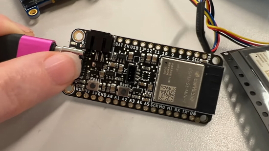

- [ ] Kattni updates
- [ ] change date
- [ ] update title
- [ ] Feature story
- [ ] Update []() for images
- [ ] Update ICYDNCI
- [ ] All images 550w max only
- [ ] Link "View this email in your browser."

News Sources

- [python.org](https://www.python.org/)
- [Python Insider - dev team blog](https://pythoninsider.blogspot.com/)
- [MicroPython Meetup Blog](https://melbournemicropythonmeetup.github.io/)

View this email in your browser.

We're giving thanks for the tech in the latest Python on Microcontrollers newsletter, brought you by the community! We're on [Discord](https://discord.gg/HYqvREz), [Twitter](https://twitter.com/search?q=circuitpython&src=typed_query&f=live), and for past newsletters - [view them all here](https://www.adafruitdaily.com/category/circuitpython/). If you're reading this on the web, [subscribe here](https://www.adafruitdaily.com/). Let's get started!

## Headline Article

[](url)

text - [site](url).

## ESP32-S3 mini modules make for an easy 'S3 Feather

[](https://www.youtube.com/watch?v=NVoeIhUUi78)

Adafruit picked up some ESP32-S3 Mini modules from Digi-Key and surprise! They are pin compatible with the S2 Mini modules. That means they were able to upgrade their ESP32-S2 Feather to use the newest dual-core+BLE chipset. All the pins have been tested, NeoPixel works and so does I2C… they are fabricating some of these and will have some for the Adafruit shop as soon as Adafruit can get a reel from Espressif - [Adafruit Blog](https://blog.adafruit.com/2021/11/15/esp32-s3-mini-modules-make-for-an-easy-s3-feather/) and [YouTube](https://www.youtube.com/watch?v=NVoeIhUUi78).

## Wirelessly Code your Bluetooth Device with CircuitPython

[](https://learn.adafruit.com/wirelessly-code-your-bluetooth-device-with-circuitpython/device-setup)

Did you know you can transfer files over BLE? This is the basis for being able to edit CircuitPython files directly on your device.

Adafruit has been working on a new web-based Code Editor for CircuitPython. This allows you to edit files directly on your Bluetooth devices using just the Chrome web browser without installing any additional software. The great thing about this code editor is it is written completely in JavaScript, so it only runs on your computer and none of your data is ever uploaded to a server - [Adafruit Learning System](https://learn.adafruit.com/wirelessly-code-your-bluetooth-device-with-circuitpython/device-setup) and [https://code.circuitpython.org/](https://code.circuitpython.org/).

## Meet the Maker: Anne Barela

[](https://blog.adafruit.com/2021/11/18/hackspace-magazine-issue-49-meet-the-maker-anne-barela-circuitpython-hackspacemag-raspberry_pi-anne_engineer/)

Adafruit engineer Anne Barela was interviewed for the latest issue of [HackSpace Magazine, Issue 49](https://hackspace.raspberrypi.com/issues/49).

> If you’ve ever programmed anything in CircuitPython and understood the instructions first time, you probably have Anne Barela to thank. She’s a consulting engineer at Adafruit, where she puts her vast array of experience into helping people make cool stuff that ‘just works’. She’s had her work go into space on the Shuttle, she helped make sure the world’s computers didn’t melt when the clocks reset to zero in the year 2000, and she’s a big fan of open source. We got a bit flustered when we spoke to her to be honest – where do you start with a career that’s included Caltech, Hewlett-Packard, NASA, Boeing, and the US Diplomatic Service? So, we started with something we can all understand: CircuitPython.

You can read about Anne, her varied professions, her making trajectory and what she’s doing now in the latest HackSpace Magazine - [Adafruit Blog](https://blog.adafruit.com/2021/11/18/hackspace-magazine-issue-49-meet-the-maker-anne-barela-circuitpython-hackspacemag-raspberry_pi-anne_engineer/).

## Feature

[](url)

text - [site](url).

## CircuitPython Deep Dive Stream with Scott Shawcroft

[](link)

[This week](link), Scott streams his work on .

You can see the latest video and past videos on the Adafruit YouTube channel under the Deep Dive playlist - [YouTube](https://www.youtube.com/playlist?list=PLjF7R1fz_OOXBHlu9msoXq2jQN4JpCk8A).

## CircuitPython Parsec

[](https://blog.adafruit.com/2021/08/17/john-parks-circuitpython-parsec-code-for-board-types-adafruit-johnedgarpark-adafruit-circuitpython/)

John Park’s CircuitPython Parsec: 

* episode - [Adafruit Blog](url)

Catch all the episodes in the [YouTube playlist](https://www.youtube.com/playlist?list=PLjF7R1fz_OOWFqZfqW9jlvQSIUmwn9lWr).

## News from around the web!

[](url)

text - [site](url).

[](url)

text - [site](url).

[](url)

text - [site](url).

[](url)

text - [site](url).

[](url)

text - [site](url).

[](url)

text - [site](url).

[](url)

text - [site](url).

[](url)

text - [site](url).

[](url)

text - [site](url).

[](url)

text - [site](url).

[](url)

text - [site](url).

[](url)

text - [site](url).

[](url)

text - [site](url).

[](url)

text - [site](url).

[](url)

text - [site](url).

[](url)

text - [site](url).

[](url)

text - [site](url).

[](url)

text - [site](url).

[](url)

text - [site](url).

[](url)

text - [site](url).

The SHA256 algorithm in Python without using any modules - [GitHub](https://github.com/kibnakamoto/sha256.py).

**#ICYDNCI What was the most popular, most clicked link, in [last week's newsletter](https://link)? [title](url).**

## Coming soon

[](url)

text - [site](url).

[](url)

text - [site](url).

## New Boards Supported by CircuitPython

The number of supported microcontrollers and Single Board Computers (SBC) grows every week. This section outlines which boards have been included in CircuitPython or added to [CircuitPython.org](https://circuitpython.org/).

This week, there were (#/no) new boards added!

- [Board name](url)

Looking to add a new board to CircuitPython? It's highly encouraged! Adafruit has four guides to help you do so:

- [How to Add a New Board to CircuitPython](https://learn.adafruit.com/how-to-add-a-new-board-to-circuitpython/overview)
- [How to add a New Board to the circuitpython.org website](https://learn.adafruit.com/how-to-add-a-new-board-to-the-circuitpython-org-website)
- [Adding a Single Board Computer to PlatformDetect for Blinka](https://learn.adafruit.com/adding-a-single-board-computer-to-platformdetect-for-blinka)
- [Adding a Single Board Computer to Blinka](https://learn.adafruit.com/adding-a-single-board-computer-to-blinka)

## New Learn Guides!

[](https://learn.adafruit.com/guides/latest)

[title](url) from [name](url)

[title](url) from [name](url)

[title](url) from [name](url)

## Updated Learn Guides!

[title](url) from [name](url)

## CircuitPython Project Bundle

[](https://learn.adafruit.com/)

When you get to the CircuitPython code section of an [Adafruit Learn Guide](https://learn.adafruit.com/), sometimes things can get a bit complicated. You not only have the code you need to upload to your device, but you likely also need to add some libraries that the code requires to run. This involved downloading all the libraries, digging through to find the ones you need, and copying them to your device. That was only the beginning on some projects, as those that include images and/or sound files required further downloading and copying of files. But, not anymore!

Now, with Project Bundles, you can download all the necessary code, libraries and, if needed, asset files with one click! We automatically check which libraries are required for the project and bundle them up for you. No more digging through a huge list of libraries to find the ones you need, or fiddling with looking for other files or dependencies. Download the Project Bundle, copy the contents to your device, and your code will simply work. We wanted to make this the easiest way to get a project working, regardless of whether you're a beginner or an expert. We'll also be adding this feature to popular IDEs as an add-on. Try it out with any Circuit Python guide on the Adafruit Learning System. Just look for the ‘Download Project Bundle’ button on the code page. 

**To download and use a Project Bundle:**

In the Learning System - above any embedded code in a guide in the Adafruit Learn System, you’ll find a Download Project Bundle button.

[](https://learn.adafruit.com/)

Click the button to download the Project Bundle zip.

[](https://learn.adafruit.com/)

Open the Project Bundle zip to find the example code, all necessary libraries, and, if available, any images, sounds, etc.

[](https://learn.adafruit.com/)

Simply copy all the files over to your CIRCUITPY drive, and you’re ready to go!

If you run into any problems or bugs, or would like to submit feedback, please file an issue on the [Adafruit Learning System Guides GitHub repo](https://github.com/adafruit/Adafruit_Learning_System_Guides/issues).

## CircuitPython Libraries!

[](https://circuitpython.org/libraries)

CircuitPython support for hardware continues to grow. We are adding support for new sensors and breakouts all the time, as well as improving on the drivers we already have. As we add more libraries and update current ones, you can keep up with all the changes right here!

For the latest libraries, download the [Adafruit CircuitPython Library Bundle](https://circuitpython.org/libraries). For the latest community contributed libraries, download the [CircuitPython Community Bundle](https://github.com/adafruit/CircuitPython_Community_Bundle/releases).

If you'd like to contribute, CircuitPython libraries are a great place to start. Have an idea for a new driver? File an issue on [CircuitPython](https://github.com/adafruit/circuitpython/issues)! Have you written a library you'd like to make available? Submit it to the [CircuitPython Community Bundle](https://github.com/adafruit/CircuitPython_Community_Bundle). Interested in helping with current libraries? Check out the [CircuitPython.org Contributing page](https://circuitpython.org/contributing). We've included open pull requests and issues from the libraries, and details about repo-level issues that need to be addressed. We have a guide on [contributing to CircuitPython with Git and Github](https://learn.adafruit.com/contribute-to-circuitpython-with-git-and-github) if you need help getting started. You can also find us in the #circuitpython channel on the [Adafruit Discord](https://adafru.it/discord).

You can check out this [list of all the Adafruit CircuitPython libraries and drivers available](https://github.com/adafruit/Adafruit_CircuitPython_Bundle/blob/master/circuitpython_library_list.md). 

The current number of CircuitPython libraries is **###**!

**New Libraries!**

Here's this week's new CircuitPython libraries:

* [library](url)

**Updated Libraries!**

Here's this week's updated CircuitPython libraries:

* [library](url)

## What’s the team up to this week?

What is the team up to this week? Let’s check in!

**Dan**

I made our latest beta release, CircuitPython 7.1.0-beta.0, on November 11. Try it out and let us know of any issues.

7.1.0-beta.0 contains support for asyncio. I've started writing a guide about using asyncio in CircuitPython: you can check out the [draft so far](https://learn.adafruit.com/cooperative-multitasking-in-circuitpython/overview?preview_token=di81p2zLknUEEkeM-57bPw). Here's an example of blinking two LEDs independently:

```py
import asyncio
import board
import digitalio

async def blink(pin, interval, count):
    with digitalio.DigitalInOut(pin) as led:
        led.switch_to_output(value=False)
        for i in range(count):
            led.value = True
            await asyncio.sleep(interval)       # Don't forget the "await"!
            led.value = False
            await asyncio.sleep(interval)       # Don't forget the "await"!

async def main():
    led1_task = asyncio.create_task(blink(board.D1, 0.25, 10))
    led2_task = asyncio.create_task(blink(board.D2, 0.1, 20))
    await asyncio.gather(led1_task, led2_task)  # Don't forget the "await"!
    print("done")

asyncio.run(main())
```

**Jeff**

[](https://circuitpython.org/)

text

**Kattni**

[](https://circuitpython.org/)

text

**Melissa**

[](https://circuitpython.org/)

text

**Scott**

[](https://circuitpython.org/)

text

## Upcoming events!

[](https://events.linuxfoundation.org/riscv-summit/register/)

RISC-V Summit brings the community together to show the power open collaboration can have on the processor industry. The audience spans across industries, organizations, workloads, and geographies to learn about the technology advancements in the RISC-V ecosystem and visibility of RISC-V successes. The event is December 6 – 8, in-person in San Francisco or virtually from anywhere in the world - [Linux Foundation](https://events.linuxfoundation.org/riscv-summit/register/) via [Twitter](https://twitter.com/risc_v/status/1449886188941238274).

[](https://us.pycon.org/2022/l)

PyCon US 2022 planning is underway. The team is planning to host the event in person with an online component. April 27, 2022 - May 5, 2022. Head over to the [PyCon US 2022 website](https://us.pycon.org/2022/) for details about the conference and more information about the sponsorship program - [PyCon Blog](https://pycon.blogspot.com/2021/10/pycon-us-2022-website-and-sponsorship.html).

**Send Your Events In**

As for other events, with the COVID pandemic, most in-person events are postponed or cancelled. If you know of virtual events or events that may occur in the future, please let us know on Discord or on Twitter with hashtag #CircuitPython.

## Latest releases

CircuitPython's stable release is [#.#.#](https://github.com/adafruit/circuitpython/releases/latest) and its unstable release is [#.#.#-##.#](https://github.com/adafruit/circuitpython/releases). New to CircuitPython? Start with our [Welcome to CircuitPython Guide](https://learn.adafruit.com/welcome-to-circuitpython).

[2021####](https://github.com/adafruit/Adafruit_CircuitPython_Bundle/releases/latest) is the latest CircuitPython library bundle.

[v#.#.#](https://micropython.org/download) is the latest MicroPython release. Documentation for it is [here](http://docs.micropython.org/en/latest/pyboard/).

[#.#.#](https://www.python.org/downloads/) is the latest Python release. The latest pre-release version is [#.#.#](https://www.python.org/download/pre-releases/).

[#### Stars](https://github.com/adafruit/circuitpython/stargazers) Like CircuitPython? [Star it on GitHub!](https://github.com/adafruit/circuitpython)

## Call for help -- Translating CircuitPython is now easier than ever!

[](https://hosted.weblate.org/engage/circuitpython/)

One important feature of CircuitPython is translated control and error messages.

With the help of fellow open source project [Weblate](https://weblate.org/), we're making it even easier to add or improve translations.

Sign in with an existing account such as GitHub, Google or Facebook and start contributing through a simple web interface. No forks or pull requests needed!

As always, if you run into trouble join us on [Discord](https://adafru.it/discord), we're here to help.

## jobs.adafruit.com - Find a dream job, find great candidates!

[](https://jobs.adafruit.com/)

[jobs.adafruit.com](https://jobs.adafruit.com/) has returned and folks are posting their skills (including CircuitPython) and companies are looking for talented makers to join their companies - from Digi-Key, to Hackaday, Micro Center, Raspberry Pi and more.

**Job of the Week**

text - [Adafruit Jobs Board](https://jobs.adafruit.com/).

## NUMBER thanks!

[](https://adafru.it/discord)

[](https://discord.gg/adafruit)

The Adafruit Discord community, where we do all our CircuitPython development in the open, reached over NUMBER humans, thank you!  Adafruit believes Discord offers a unique way for CircuitPython folks to connect. Join today at [https://adafru.it/discord](https://adafru.it/discord).

## ICYMI - In case you missed it

[](https://www.youtube.com/playlist?list=PLjF7R1fz_OOXRMjM7Sm0J2Xt6H81TdDev)

The wonderful world of Python on hardware! This is our Python video-newsletter-podcast! The news comes from the Python community, Discord, Adafruit communities and more and is reviewed on ASK an ENGINEER Wednesdays. The complete Python on Hardware weekly videocast [playlist is here](https://www.youtube.com/playlist?list=PLjF7R1fz_OOXRMjM7Sm0J2Xt6H81TdDev). 

This video podcast is on [iTunes](https://itunes.apple.com/us/podcast/python-on-hardware/id1451685192?mt=2), [YouTube](http://adafru.it/pohepisodes), [IGTV (Instagram TV](https://www.instagram.com/adafruit/channel/)), and [XML](https://itunes.apple.com/us/podcast/python-on-hardware/id1451685192?mt=2).

[Weekly community chat on Adafruit Discord server CircuitPython channel - Audio / Podcast edition](https://itunes.apple.com/us/podcast/circuitpython-weekly-meeting/id1451685016) - Audio from the Discord chat space for CircuitPython, meetings are usually Mondays at 2pm ET, this is the audio version on [iTunes](https://itunes.apple.com/us/podcast/circuitpython-weekly-meeting/id1451685016), Pocket Casts, [Spotify](https://adafru.it/spotify), and [XML feed](https://adafruit-podcasts.s3.amazonaws.com/circuitpython_weekly_meeting/audio-podcast.xml).

And lastly, we are working up a one-spot destination for all things podcast-able here - [podcasts.adafruit.com](https://podcasts.adafruit.com/)

## Contribute!

The CircuitPython Weekly Newsletter is a CircuitPython community-run newsletter emailed every Tuesday. The complete [archives are here](https://www.adafruitdaily.com/category/circuitpython/). It highlights the latest CircuitPython related news from around the web including Python and MicroPython developments. To contribute, edit next week's draft [on GitHub](https://github.com/adafruit/circuitpython-weekly-newsletter/tree/gh-pages/_drafts) and [submit a pull request](https://help.github.com/articles/editing-files-in-your-repository/) with the changes. You may also tag your information on Twitter with #CircuitPython. 

Join our [Discord](https://adafru.it/discord) or [post to the forum](https://forums.adafruit.com/viewforum.php?f=60) for any further questions.
