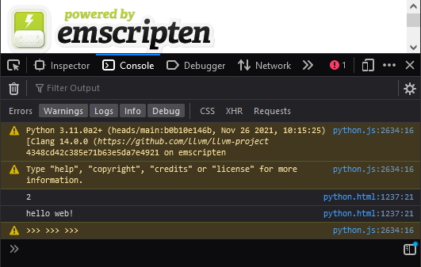
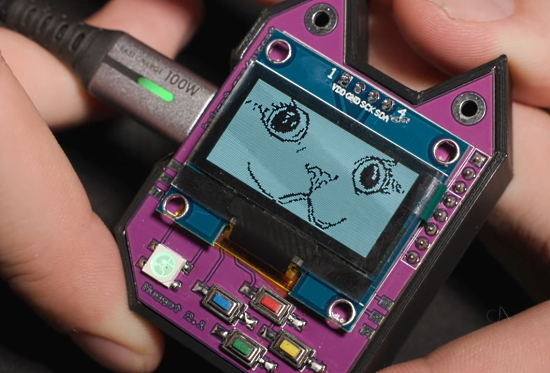
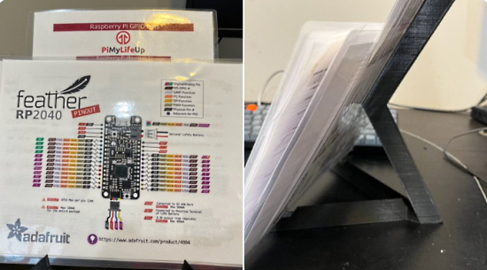
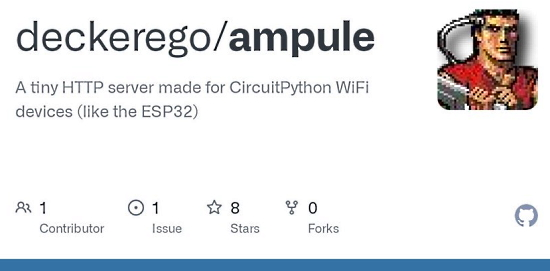
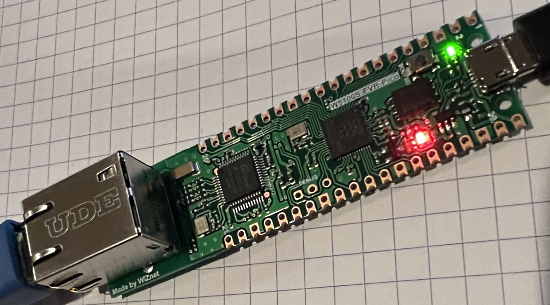
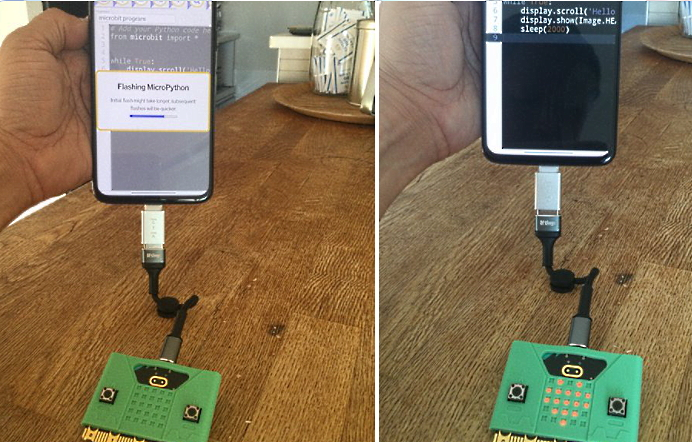
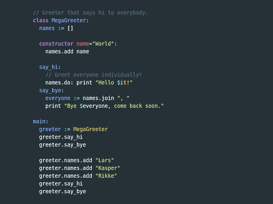
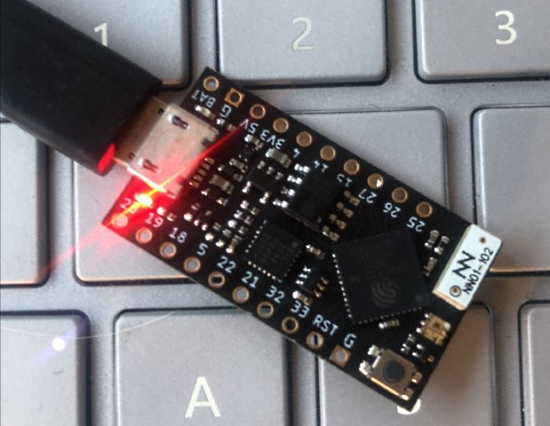
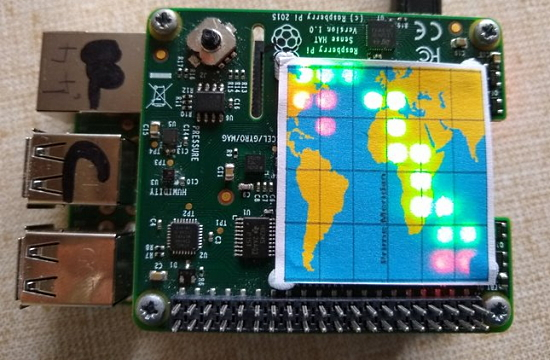
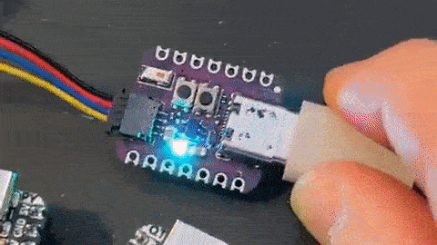

- [X] Kattni updates
- [ ] change date
- [ ] update title
- [ ] Feature story
- [ ] Update  for images
- [ ] Update ICYDNCI
- [ ] All images 550w max only
- [ ] Link "View this email in your browser."

View this email in your browser.

On this last day of November, wth have leaves and snow in Northern latitudes and sun in Southern ones, here is the latest Python on Microcontrollers newsletter, brought you by the community! We're on [Discord](https://discord.gg/HYqvREz), [Twitter](https://twitter.com/search?q=circuitpython&src=typed_query&f=live), and for past newsletters - [view them all here](https://www.adafruitdaily.com/category/circuitpython/). If you're reading this on the web, [subscribe here](https://www.adafruitdaily.com/). 

## Cooperative Multitasking Added to CircuitPython 7 Beta

Cooperative multitasking is now in CircuitPython, using the `asyncio` library and the `async` and `await` language keywords. The `asyncio` library is included with CPython, the host-computer version of Python. MicroPython also supplies a version of `asyncio`, and that version has been adapted for use in CircuitPython - [Adafruit Learning System](https://learn.adafruit.com/cooperative-multitasking-in-circuitpython/overview).

## Gom Jabbar from Dune with Raspberry Pi

Recreate the pivotal Gom Jabbar scene from Dune using a Raspberry Pi, ultrasonic sensor, a servo, and a bit of Python code! - [Instructables](https://www.instructables.com/Gom-Jabbar-From-Dune/), [GitHub](https://github.com/mjdargen/Gom-Jabbar) and [YouTube](https://www.youtube.com/watch?v=v0kx15oTRYM).

## A Native, Full-Featured Raspberry Pi Pico BASIC Interpretor

The PicoMite is a Raspberry Pi Pico running the free MMBasic interpreter. MMBasic is a Microsoft BASIC compatible implementation of the BASIC language with floating point, integer and string variables, arrays, long variable names, a built-in program editor and many other features.

MMBasic includes communications protocols such as I2C or SPI to get data from a variety of sensors. Data can be saved to an SD card and displayed on colour LCD displays. Measure voltages, detect digital inputs and drive output pins to turn on lights, relays, etc. All from inside this low cost microcontroller.

The PicoMite firmware is totally free to download and use - [Geoff's Projects](https://geoffg.net/picomite.html), [Hackaday](https://hackaday.com/2021/11/24/picomite-gives-your-pico-a-basic-with-all-the-features/), [GitHub Source](https://github.com/UKTailwind/PicoMite).

## CircuitPython Deep Dive Stream with Scott Shawcroft

Scott was not on this past Friday due to the US Thanksgiving weekend. Catch his latest broadcast this coming Friday at 2 PM Pacific Time, 5 PM Eastern US Time, 10 PM London and 11 PM CET.

You can see the latest video and past videos on the Adafruit YouTube channel under the Deep Dive playlist - [YouTube](https://www.youtube.com/playlist?list=PLjF7R1fz_OOXBHlu9msoXq2jQN4JpCk8A).

## Python Developers Survey Last Chance

A heads up that the **Python Developers Survey will be concluding in the coming week**. The more diverse the response base, the better, so please help share the link this week as well to regional communities. The survey takes about 10-15 minutes to fill out - [Survey](https://surveys.jetbrains.com/s3/python-developers-survey-2021).

### Give back to Python by pitching in to the PSF’s last fundraiser of 2021

PSF would love for you to be part of the big plans they have for 2022. You can join their end of 2021 fundraiser and **Giving Tuesday** in two ways:
* [Buy a discounted PyCharm license!](https://python.us19.list-manage.com/track/click?u=5697f493c3a48994f504d4deb&id=cf0985d287&e=9b20e3624a) JetBrains is supporting the PSF by providing a 30% discount on PyCharm and all proceeds will go to the PSF! You can take advantage of this discount by [using promo code SUPPORTPYTHON21](https://python.us19.list-manage.com/track/click?u=5697f493c3a48994f504d4deb&id=f0c7a13de6&e=9b20e3624a),
* [Donate directly to the PSF!](https://python.us19.list-manage.com/track/click?u=5697f493c3a48994f504d4deb&id=417d0cb845&e=9b20e3624a) Give back to Python, grow the global community of Pythonistas, and make [PyCon US 2022](https://python.us19.list-manage.com/track/click?u=5697f493c3a48994f504d4deb&id=6a77e4a357&e=9b20e3624a) the best yet–in person again, at long last!

## Awesome CircuitPython Updates

With help from Paul C, the community is revitalizing the Awesome CircuitPython repo. Community members are invited to review the Awesome CircuitPython page and suggest additions/changes like articles, podcasts, etc. via Pull Requests or noting in an Issue. - [Awesome CircuitPython](https://github.com/adafruit/awesome-circuitpython/).

## CPython (Stock Python) Compiled for the Browser

Running CPython in a browser using Web Assembly (WASM) - [Twitter Announcement](https://twitter.com/ethanhs/status/1464308141105967104?s=27) and [GitHub](https://github.com/ethanhs/python-wasm).

## News from around the web!

Parse Wi-Fi Packets with Monitor Mode in CircuitPython on ESP32-S2 - [YouTube](https://youtu.be/9fLhu_fJ4P8) via [Twitter](https://twitter.com/KodyKinzie/status/1464471989461008390).

Fire animation in CircuitPython by using two simplex noise functions to modulate hue and brightness - [Twitter Thread](https://twitter.com/itsaddis/status/1464265452973002756) and [GitHub](https://github.com/Factoid/SimplexNoise).

Use a 3D printed vinyl record stand as laminated pinout holders - [Twitter](https://twitter.com/prcutler/status/1464606163207610369).

ampule - a tiny HTTP server made for CircuitPython/MicroPython WiFi devices (like the ESP32-S2) - [GitHub](https://github.com/deckerego/ampule) and [Twitter](https://twitter.com/oakdevtech/status/1464243276941127684).

A Raspberry Pi Pico RP2040 in an Arduino form factor board with CircuitPython - [Twitter](https://twitter.com/iketsj/status/1462891140357652490) and [YouTube](https://youtu.be/tlM4RakeQ8c).

CircuitPython snakes it's way to W5100S Ethernet. Wiznet W5100S-EVB-Pico for Raspberry Pi RP2040 board running CircuitPython 7 - [Twitter](https://twitter.com/anecdat/status/1463595635924422663).

Adafruit Holiday Gift Guide: CircuitPython - [Adafruit Blog](https://blog.adafruit.com/2021/11/24/adafruit-holiday-gift-guide-circuitpython-2/).

The best kinds of projects are the ones that: 
1. You have the parts for 
2. Pop into your head out of the blue 
3. Serve no practical purpose whatsoever 

Not 100% finished yet. More to come. #CircuitPython #CircuitBrainsDeluxe - [Twitter](https://twitter.com/kevinneubauer/status/1462984996189310977).

CircuitPython School - Use the Mil Mascaras App to Control a Mosquitto MQTT Client on a Raspberry Pi - [YouTube](https://www.youtube.com/watch?v=sOclINDvRV0) via [Twitter](https://twitter.com/gallaugher/status/1463583829805912071).

Visualize activity time: Toggl tracks time with three big buttons using an Adafruit Metro M4 Express, an Adafruit Airlift and CircuitPython - [Make Into Shape](https://makeintoshape.com/toggl-track/).

Connecting a micro:bit to an Android phone with a USB-C adapter, using the MicroPython web editor on Chrome - [Twitter](https://twitter.com/alexkorenori/status/1464365366952423424).

An OLED display shield connected to Raspberry Pi Pico, with programming in MicroPython - [zihatec](https://www.hwhardsoft.de/english/projects/display-shield/) via [Twitter](https://twitter.com/HWHardsoft/status/1465400001421578246).

DC540 Kabbalah (Tree of Life) badge for DC29 last chance availability - MicroPython compatible - [Twitter](https://twitter.com/dc540_nova/status/1464682623675031559) and [Tindie](https://www.tindie.com/products/dc540_nova/dc540-kabbalah-tree-of-life-badge-for-dc29/).

Toit open-source language claims to be 30x faster than MicroPython on ESP32 - [CNX Software](https://www.cnx-software.com/2021/11/28/toit-open-source-language-claims-to-be-30x-faster-than-micropython-on-esp32/).

μSQLite library module for MicroPython now up and running for ESP32 on the Unexpected Maker TinyPICO - [GitHub](https://github.com/spatialdude/usqlite/wiki/esp32#tinypico) via [Twitter](https://twitter.com/SpatialDude/status/1464530406296883202).

The Raspberry Pi Secondary Memory Interface (SMI) - [Lean2](https://iosoft.blog/2020/07/16/raspberry-pi-smi/).

Calling Rust from Python using PyO3, speed up your Python using Rust - [Said van de Klundert](http://saidvandeklundert.net/learn/2021-11-18-calling-rust-from-python-using-pyo3/).

Apache Superset - a modern data exploration and visualization platform - [Apache](https://superset.apache.org/).

Minitel-ESP32: Minitel apps development using ESP32 and MicroPython - [hackaday.io](https://hackaday.io/project/180473/gallery#d3ea548ed03ea6af361657a926af2eb6) and [GitHub](https://github.com/iodeo/Minitel-ESP32).

A Raspberry Pi-based International Space Station (ISS) tracker - [Twitter Thread](https://twitter.com/JohnChinner/status/1272945084498092035).

VIT - VideoInTerminal. A quick piece of code to play videos in your terminal using Python - [GitHub](https://github.com/SheIITear/VIT) and [Python Awesome](https://pythonawesome.com/vit-videointerminal-a-quick-piece-of-code-to-play-videos-in-your-terminal-using-python/).

What Is Pip? A Guide for New Pythonistas  - [Real Python](https://realpython.com/what-is-pip/) via [Twitter](https://twitter.com/realpython/status/1282328871166148608).

Ditch These 7 Bad Habits in Python - [Jerry Ng](https://jerrynsh.com/ditch-these-7-habits-from-your-python/).

PyInvoke: Pythonic task management & command execution with Invoke - [Site](https://www.pyinvoke.org/), [GitHub](https://github.com/pyinvoke/invoke) and [Python Awesome](https://pythonawesome.com/pythonic-task-management-command-execution/).

Ribbit - a small and portable Scheme implementation with AOT and incremental compilers that fits in 4K. It supports closures, tail calls, first-class continuations and a REPL - [GitHub](https://github.com/udem-dlteam/ribbit).

PyDev of the Week: Pradyun Gedam from [Mouse vs Python](https://www.blog.pythonlibrary.org/2021/11/29/pydev-of-the-week-pradyun-gedam/)

CircuitPython weekly meeting for November 29th, 2021 [on YouTube](https://youtu.be/-siyWT-Ce84) and with [notes](https://github.com/adafruit/adafruit-circuitpython-weekly-meeting/blob/main/2021/2021-11-29.md)

#ICYDNCI What was the most popular, most clicked link, in [last week's newsletter](https://www.adafruitdaily.com/2021/11/23/python-on-microcontrollers-newsletter-micropython-samd-support-esp32-s3-feather-and-much-more-python-adafruit-circuitpython-micropython-thepsf/)? [CircuitPython Online IDE](https://github.com/urfdvw/CircuitPython-online-IDE).

## Coming soon

CircuitPython works with QT Py ESP32-S2 board - [Twitter](https://twitter.com/adafruit/status/1464376328283688960) and [Adafruit Blog](https://blog.adafruit.com/2021/11/26/circuitpython-works-with-qt-py-esp32-s2-board-plus-get-a-free-pink-rp2040-feather-in-our-feather-friday-sale/).

> This ESP32-S2 QT Py is so smol, I just wanna pinch its li'l cheeks! On the back is and ESP32-S2 with 4 MB Flash and 2MB PSRAM all stuffed inside the QFN chip.

A prototype design for a 1.47" IPS TFT! Adafruit saw this adorable mini TFT display [in a tweet](https://twitter.com/sulfuroid/status/1464259778465738754) and if there's something that gets them out of bed in the morning, it's a smol IPS display - [Twitter](https://twitter.com/adafruit/status/1464979842181607439).

## New Boards Supported by CircuitPython

The number of supported microcontrollers and Single Board Computers (SBC) grows every week. This section outlines which boards have been included in CircuitPython or added to [CircuitPython.org](https://circuitpython.org/).

This week there were no new boards added, but several are in development.

Looking to add a new board to CircuitPython? It's highly encouraged! Adafruit has four guides to help you do so:

- [How to Add a New Board to CircuitPython](https://learn.adafruit.com/how-to-add-a-new-board-to-circuitpython/overview)
- [How to add a New Board to the circuitpython.org website](https://learn.adafruit.com/how-to-add-a-new-board-to-the-circuitpython-org-website)
- [Adding a Single Board Computer to PlatformDetect for Blinka](https://learn.adafruit.com/adding-a-single-board-computer-to-platformdetect-for-blinka)
- [Adding a Single Board Computer to Blinka](https://learn.adafruit.com/adding-a-single-board-computer-to-blinka)

## New Learn Guides!

[NeoPixel Menorah](https://learn.adafruit.com/neopixel-menorah) from [Noe and Pedro](https://learn.adafruit.com/users/pixil3d)

[Adafruit Monochrome 1.12" 128x128 OLED Graphic Display](https://learn.adafruit.com/adafruit-monochrome-1-12-in-128x128-oled) from [Kattni](https://learn.adafruit.com/users/kattni)

[Cooperative Multitasking in CircuitPython](https://learn.adafruit.com/cooperative-multitasking-in-circuitpython) from [Dan Halbert](https://learn.adafruit.com/users/danhalbert)

[Adafruit ESP32-S2 Feather](https://learn.adafruit.com/adafruit-esp32-s2-feather) from [Kattni](https://learn.adafruit.com/users/kattni)

## CircuitPython Project Bundle

When you get to the CircuitPython code section of an [Adafruit Learn Guide](https://learn.adafruit.com/), sometimes things can get a bit complicated. You not only have the code you need to upload to your device, but you likely also need to add some libraries that the code requires to run. This involved downloading all the libraries, digging through to find the ones you need, and copying them to your device. That was only the beginning on some projects, as those that include images and/or sound files required further downloading and copying of files. But, not anymore!

Now, with Project Bundles, you can download all the necessary code, libraries and, if needed, asset files with one click! We automatically check which libraries are required for the project and bundle them up for you. No more digging through a huge list of libraries to find the ones you need, or fiddling with looking for other files or dependencies. Download the Project Bundle, copy the contents to your device, and your code will simply work. We wanted to make this the easiest way to get a project working, regardless of whether you're a beginner or an expert. We'll also be adding this feature to popular IDEs as an add-on. Try it out with any Circuit Python guide on the Adafruit Learning System. Just look for the ‘Download Project Bundle’ button on the code page. 

**To download and use a Project Bundle:**

In the Learning System - above any embedded code in a guide in the Adafruit Learn System, you’ll find a Download Project Bundle button.

Click the button to download the Project Bundle zip.

Open the Project Bundle zip to find the example code, all necessary libraries, and, if available, any images, sounds, etc.

Simply copy all the files over to your CIRCUITPY drive, and you’re ready to go!

If you run into any problems or bugs, or would like to submit feedback, please file an issue on the [Adafruit Learning System Guides GitHub repo](https://github.com/adafruit/Adafruit_Learning_System_Guides/issues).

## CircuitPython Libraries!

CircuitPython support for hardware continues to grow. We are adding support for new sensors and breakouts all the time, as well as improving on the drivers we already have. As we add more libraries and update current ones, you can keep up with all the changes right here!

For the latest libraries, download the [Adafruit CircuitPython Library Bundle](https://circuitpython.org/libraries). For the latest community contributed libraries, download the [CircuitPython Community Bundle](https://github.com/adafruit/CircuitPython_Community_Bundle/releases).

If you'd like to contribute, CircuitPython libraries are a great place to start. Have an idea for a new driver? File an issue on [CircuitPython](https://github.com/adafruit/circuitpython/issues)! Have you written a library you'd like to make available? Submit it to the [CircuitPython Community Bundle](https://github.com/adafruit/CircuitPython_Community_Bundle). Interested in helping with current libraries? Check out the [CircuitPython.org Contributing page](https://circuitpython.org/contributing). We've included open pull requests and issues from the libraries, and details about repo-level issues that need to be addressed. We have a guide on [contributing to CircuitPython with Git and Github](https://learn.adafruit.com/contribute-to-circuitpython-with-git-and-github) if you need help getting started. You can also find us in the #circuitpython channel on the [Adafruit Discord](https://adafru.it/discord).

You can check out this [list of all the Adafruit CircuitPython libraries and drivers available](https://github.com/adafruit/Adafruit_CircuitPython_Bundle/blob/master/circuitpython_library_list.md). 

The current number of CircuitPython libraries is **341**!

**Updated Libraries!**

Here's this week's updated CircuitPython libraries:

 * [Adafruit_CircuitPython_PCF8563](https://github.com/adafruit/Adafruit_CircuitPython_PCF8563)
 * [Adafruit_CircuitPython_Ticks](https://github.com/adafruit/Adafruit_CircuitPython_Ticks)
 * [Adafruit_CircuitPython_BLE](https://github.com/adafruit/Adafruit_CircuitPython_BLE)
 * [Adafruit_CircuitPython_DHT](https://github.com/adafruit/Adafruit_CircuitPython_DHT)
 * [Adafruit_CircuitPython_LIS3DH](https://github.com/adafruit/Adafruit_CircuitPython_LIS3DH)
 * [Adafruit_CircuitPython_LC709203F](https://github.com/adafruit/Adafruit_CircuitPython_LC709203F)
 * [Adafruit_CircuitPython_DisplayIO_Layout](https://github.com/adafruit/Adafruit_CircuitPython_DisplayIO_Layout)
 * [Adafruit_CircuitPython_Display_Shapes](https://github.com/adafruit/Adafruit_CircuitPython_Display_Shapes)
 * [CircuitPython_Community_Bundle](https://github.com/adafruit/CircuitPython_Community_Bundle)

## What’s the team up to this week?

What is the team up to this week? Let’s check in!

**Dan**

The *Cooperative Multitasking in CircuitPython* guide I wrote is now live. I have more sections to write, but the guide contains a number of simple examples which will help you get started using `asyncio`, `async`, and `await` in CircuitPython.

**Jeff**

After a week off, I'm back and working on bug fixing. I found and fixed a few bugs in the dither & blend functions I added a few weeks ago, and in the process of doing so I also made it possible to test and debug the bitmaptools routines directly on a host computer. Another bugs I fixed was a problem with writing `boot_out.txt` on a freshly erased CIRCUITPY drive.

**Kattni**

This week, I continued work on the Feather ESP32-S2 guide. At least part of it went live because folks were looking for the info it contains. I did a lot of testing and ended up doing my first Adafruit IO project for this one. Keep an eye out for that and the rest of the guide!

Next up is the guide for the KB2040.

**Melissa**

This past week was a little bit shorter for me. I started working on a new project for a Learn Guide that uses CircuitPython to control a laser using a Nunchuk controller. Keep an eye out for the upcoming guide.

**Scott**

Last week I polished the broadcom (Raspberry Pi) work to the point that I could propose to have the code in CircuitPython main. After a prompt review from Dan, it's been merged! While I was waiting, I also added basic I2C functionality. I've got more polish to do next week to support more I2C peripherals, UARTs and SPIs. I'll also need to add it to circuitpython.org/downloads as well. Overall, the support is still early and will have bugs. I'd call it alpha state. I hope that by getting more folks trying it, more folks will help bug hunt it.

## Upcoming events!

RISC-V Summit brings the community together to show the power open collaboration can have on the processor industry. The audience spans across industries, organizations, workloads, and geographies to learn about the technology advancements in the RISC-V ecosystem and visibility of RISC-V successes. The event is December 6 – 8, in-person in San Francisco or virtually from anywhere in the world - [Linux Foundation](https://events.linuxfoundation.org/riscv-summit/register/) via [Twitter](https://twitter.com/risc_v/status/1449886188941238274).

PyCascades is a regional PyCon in the Pacific Northwest, celebrating the west coast Python developer and user community. Our organizing team includes members of the Vancouver, Seattle, and Portland Python user groups. DATES ANNOUNCED! February 5th-6th, 2022 The conference will take place on Saturday and the first half of Sunday, with the post-conference sprints following that on Sunday afternoon. After three amazing in-person conferences and an engaging online conference, we are ready to do it again! - [PyCascades 2022](https://2022.pycascades.com/).

PyCon US 2022 planning is underway. The team is planning to host the event in person with an online component. April 27, 2022 - May 5, 2022. Head over to the [PyCon US 2022 website](https://us.pycon.org/2022/) for details about the conference and more information about the sponsorship program - [PyCon Blog](https://pycon.blogspot.com/2021/10/pycon-us-2022-website-and-sponsorship.html).

**Send Your Events In**

As for other events, with the COVID pandemic, most in-person events are postponed or cancelled. If you know of virtual events or events that may occur in the future, please let us know on Discord or on Twitter with hashtag #CircuitPython.

## Latest releases

CircuitPython's stable release is [7.0.0](https://github.com/adafruit/circuitpython/releases/latest) and its unstable release is [7.1.0-beta.0](https://github.com/adafruit/circuitpython/releases). New to CircuitPython? Start with our [Welcome to CircuitPython Guide](https://learn.adafruit.com/welcome-to-circuitpython).

[20211127](https://github.com/adafruit/Adafruit_CircuitPython_Bundle/releases/latest) is the latest CircuitPython library bundle.

[v1.17](https://micropython.org/download) is the latest MicroPython release. Documentation for it is [here](http://docs.micropython.org/en/latest/pyboard/).

[3.10.0](https://www.python.org/downloads/) is the latest Python release. The latest pre-release version is [3.11.0a2](https://www.python.org/download/pre-releases/).

[2,679 Stars](https://github.com/adafruit/circuitpython/stargazers) Like CircuitPython? [Star it on GitHub!](https://github.com/adafruit/circuitpython)

## Call for help -- Translating CircuitPython is now easier than ever!

One important feature of CircuitPython is translated control and error messages.

With the help of fellow open source project [Weblate](https://weblate.org/), we're making it even easier to add or improve translations.

Sign in with an existing account such as GitHub, Google or Facebook and start contributing through a simple web interface. No forks or pull requests needed!

As always, if you run into trouble join us on [Discord](https://adafru.it/discord), we're here to help.

## jobs.adafruit.com - Find a dream job, find great candidates!

[jobs.adafruit.com](https://jobs.adafruit.com/) has returned and folks are posting their skills (including CircuitPython) and companies are looking for talented makers to join their companies - from Digi-Key, to Hackaday, Micro Center, Raspberry Pi and more.

**Job of the Week**

Circuit Python programmer needed - Xander Creations LLC - [Adafruit Jobs Board](https://jobs.adafruit.com/job/circuit-python-programmer-needed/).

## 31,927 thanks!

The Adafruit Discord community, where we do all our CircuitPython development in the open, reached over 31,927 humans, thank you!  Adafruit believes Discord offers a unique way for CircuitPython folks to connect. Join today at [https://adafru.it/discord](https://adafru.it/discord).

## ICYMI - In case you missed it

The wonderful world of Python on hardware! This is our Python video-newsletter-podcast! The news comes from the Python community, Discord, Adafruit communities and more and is reviewed on ASK an ENGINEER Wednesdays. The complete Python on Hardware weekly videocast [playlist is here](https://www.youtube.com/playlist?list=PLjF7R1fz_OOXRMjM7Sm0J2Xt6H81TdDev). 

This video podcast is on [iTunes](https://itunes.apple.com/us/podcast/python-on-hardware/id1451685192?mt=2), [YouTube](http://adafru.it/pohepisodes), [IGTV (Instagram TV](https://www.instagram.com/adafruit/channel/)), and [XML](https://itunes.apple.com/us/podcast/python-on-hardware/id1451685192?mt=2).

[Weekly community chat on Adafruit Discord server CircuitPython channel - Audio / Podcast edition](https://itunes.apple.com/us/podcast/circuitpython-weekly-meeting/id1451685016) - Audio from the Discord chat space for CircuitPython, meetings are usually Mondays at 2pm ET, this is the audio version on [iTunes](https://itunes.apple.com/us/podcast/circuitpython-weekly-meeting/id1451685016), Pocket Casts, [Spotify](https://adafru.it/spotify), and [XML feed](https://adafruit-podcasts.s3.amazonaws.com/circuitpython_weekly_meeting/audio-podcast.xml).

And lastly, we are working up a one-spot destination for all things podcast-able here - [podcasts.adafruit.com](https://podcasts.adafruit.com/)

## Codecademy "Learn Hardware Programming with CircuitPython"

Codecademy, an online interactive learning platform used by more than 45 million people, has teamed up with the leading manufacturer in STEAM electronics, Adafruit Industries, to create a coding course, "Learn Hardware Programming with CircuitPython". The course is now available in the [Codecademy catalog](https://www.codecademy.com/learn/learn-circuitpython?utm_source=adafruit&utm_medium=partners&utm_campaign=circuitplayground&utm_content=pythononhardwarenewsletter).

Python is a highly versatile, easy to learn programming language that a wide range of people, from visual effects artists in Hollywood to mission control at NASA, use to quickly solve problems. But you don’t need to be a rocket scientist to accomplish amazing things with it. This new course introduces programmers to Python by way of a microcontroller — CircuitPython — which is a Python-based programming language optimized for use on hardware.

CircuitPython’s hardware-ready design makes it easier than ever to program a variety of single-board computers, and this course gets you from no experience to working prototype faster than ever before. Codecademy’s interactive learning environment, combined with Adafruit's highly rated Circuit Playground Express, present aspiring hardware hackers with a never-before-seen opportunity to learn hardware programming seamlessly online.

Whether for those who are new to programming, or for those who want to expand their skill set to include physical computing, this course will have students getting familiar with Python and creating incredible projects along the way. By the end, students will have built their own bike lights, drum machine, and even a moisture detector that can tell when it's time to water a plant.

Visit Codecademy to access the [Learn Hardware Programming with CircuitPython](https://www.codecademy.com/learn/learn-circuitpython?utm_source=adafruit&utm_medium=partners&utm_campaign=circuitplayground&utm_content=pythononhardwarenewsletter) course and Adafruit to purchase a [Circuit Playground Express](https://www.adafruit.com/product/3333).

Codecademy has helped more than 45 million people around the world upgrade their careers with technology skills. The company’s online interactive learning platform is widely recognized for providing an accessible, flexible, and engaging experience for beginners and experienced programmers alike. Codecademy has raised a total of $43 million from investors including Union Square Ventures, Kleiner Perkins, Index Ventures, Thrive Capital, Naspers, Yuri Milner and Richard Branson, most recently raising its $30 million Series C in July 2016.

## Contribute!

The CircuitPython Weekly Newsletter is a CircuitPython community-run newsletter emailed every Tuesday. The complete [archives are here](https://www.adafruitdaily.com/category/circuitpython/). It highlights the latest CircuitPython related news from around the web including Python and MicroPython developments. To contribute, edit next week's draft [on GitHub](https://github.com/adafruit/circuitpython-weekly-newsletter/tree/gh-pages/_drafts) and [submit a pull request](https://help.github.com/articles/editing-files-in-your-repository/) with the changes. You may also tag your information on Twitter with #CircuitPython. 

Join our [Discord](https://adafru.it/discord) or [post to the forum](https://forums.adafruit.com/viewforum.php?f=60) for any further questions.
