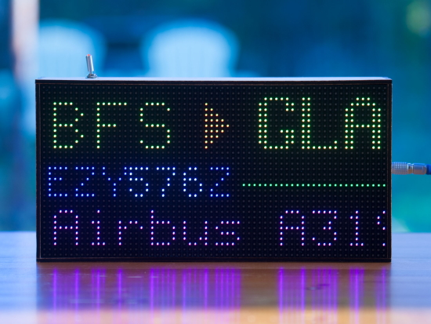
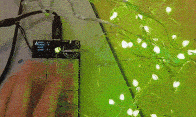
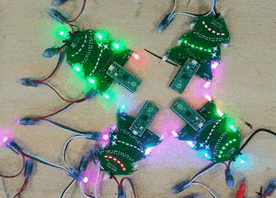
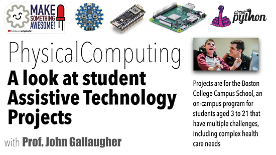
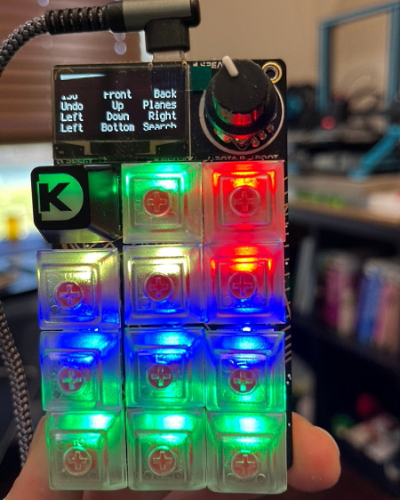
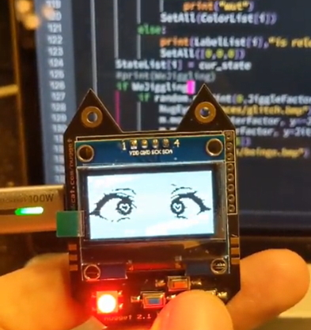
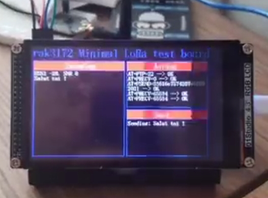
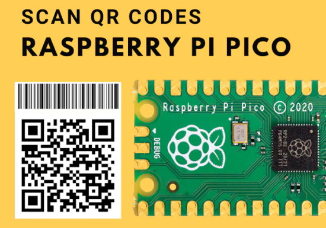
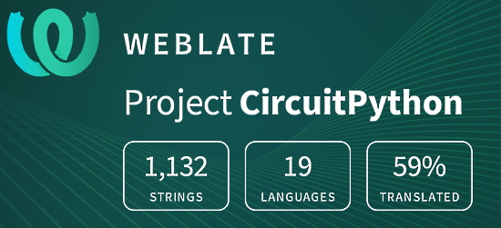

- [X] Kattni updates
- [ ] change date
- [ ] update title
- [ ] Feature story
- [ ] Update  for images
- [ ] Update ICYDNCI
- [ ] All images 550w max only
- [ ] Link "View this email in your browser."

News Sources

- [python.org](https://www.python.org/)
- [Python Insider - dev team blog](https://pythoninsider.blogspot.com/)
- [MicroPython Meetup Blog](https://melbournemicropythonmeetup.github.io/)

View this email in your browser.

Welcome to the latest Python on Microcontrollers newsletter, brought you by the community! We're on [Discord](https://discord.gg/HYqvREz), [Twitter](https://twitter.com/search?q=circuitpython&src=typed_query&f=live), and for past newsletters - [view them all here](https://www.adafruitdaily.com/category/circuitpython/). If you're reading this on the web, [subscribe here](https://www.adafruitdaily.com/). Let's get started!

## CircuitPython 7.1.0 Beta 1 is Available

CircuitPython 7.1.0-beta.1 is available, the second beta release for CircuitPython 7.1.0. It is relatively stable, but contains issues we may still address for 7.1.0 - [GitHub](https://github.com/adafruit/circuitpython/releases).

Notable additions to 7.1.0 since 7.0.0:
* `keypad.Events` now include timestamps.
* The Espressif port now provides I2CPeripheral, WiFi monitor mode, ESP32-C3 support, and ParallelImageCapture.
* bitmaptools: dithering and alphablend are new.
* Preliminary support for asyncio is included. Use the CircuitPython asyncio library.
* `gifio.GifWriter` is new.
* HID now provides boot device and feature report support.
* rotaryio now allows setting the divisor of counts per transition.
* The SAMD port now provides watchdog and alarm with sleep.
* The STM port now provides STM32L4R5 support.
* MicroPython 1.17 has been merged in.
* Russian translation.
* Preliminary support for `asyncio` is included. Use the [CircuitPython asyncio library](https://github.com/adafruit/Adafruit_CircuitPython_asyncio).

## 32,000 thanks!

The Adafruit Discord community, where we do all our CircuitPython development in the open, reached over 32,000 humans, thank you!  Adafruit believes Discord offers a unique way for CircuitPython folks to connect. Join today at [https://adafru.it/discord](https://adafru.it/discord) - [Adafruit Blog](https://blog.adafruit.com/2021/12/06/celebrating-over-32000-members-in-the-adafruit-discord-community-adafruit-discord/).

## RISC-V Summit This Week

RISC-V Summit brings the community together to show the power open collaboration can have on the processor industry. The audience spans across industries, organizations, workloads, and geographies to learn about the technology advancements in the RISC-V ecosystem and visibility of RISC-V successes. The event is **December 6 – 8**, in-person in San Francisco or virtually from anywhere in the world - [Linux Foundation](https://events.linuxfoundation.org/riscv-summit/register/) via [Twitter](https://twitter.com/risc_v/status/1449886188941238274).

## Matrix Display Projects

Some fun projects using matrix LEDs to spotlight this week:

A flight tracker with Raspberry Pi Zero, Adafruit Matrix bonnet and Python - [Colin Waddell](https://blog.colinwaddell.com/flight-tracker/), [GitHub](https://github.com/ColinWaddell/its-a-plane-python).

Celebrating Donkey Cong December with an Adafruit Matrix Portal and CircuitPython - [Twitter](https://twitter.com/mariocruz/status/1467633738381242374) and [GitHub](https://github.com/MarioCruz/DonkeyKongDecember) via [Twitter](https://twitter.com/CBotDev/status/1467859283438182401).

> Combining my interests - electronics (Adafruit LED glasses) and @Wpg_BlueBombers and @CFL football! Ready for the playoffs today no matter the weather. #ForTheW #CFL #GCPlayoffs #CircuitPython - [Twitter](https://twitter.com/MarkKomus/status/1467535829547503621).

> Progress on adding the eye light rims to native #circuitpython. Designed so they can be used with displayio or to drive individual strips of LEDs - [Twitter](https://twitter.com/MarkKomus/status/1467186585825333252).

## Tutorial - Getting CircuitPython on the Wio Terminal

Wio Terminal - Get CircuitPython Working - [GurgleApps](https://gurgleapps.com/learn/coding/get-circuitpython-on-wio-terminal) and [YouTube](https://youtu.be/xJNKmxzb8fY).

The same group also did a tutorial for MicroPython on Wio:

MicroPython & ArduPy On Wio Terminal - [GurgleApps](https://gurgleapps.com/learn/coding/how-to-use-micropython-and-ardupy-on-a-wio-teminal-by-seeed-studio) and [YouTube](https://youtu.be/Q0sv9TyYHHQ).

## CircuitPython Deep Dive Stream with Scott Shawcroft

[This week](https://www.youtube.com/watch?v=42I5RUkFwcQ), Scott streams his work on the Adafruit Learning System (behind the scenes).

You can see the latest video and past videos on the Adafruit YouTube channel under the Deep Dive playlist - [YouTube](https://www.youtube.com/playlist?list=PLjF7R1fz_OOXBHlu9msoXq2jQN4JpCk8A).

## CircuitPython Parsec

John Park’s CircuitPython Parsec: 

* episode - [Adafruit Blog](url)

Catch all the episodes in the [YouTube playlist](https://www.youtube.com/playlist?list=PLjF7R1fz_OOWFqZfqW9jlvQSIUmwn9lWr).

## News from around the web!

The HackSpace Magazine lab is testing out the CircuitPython NeoPixel animations library - [Twitter](https://twitter.com/HackSpaceMag/status/1466046480880386048).

A thermal camera working on an Adafruit PyPortal (with x4 bilinear x2 displayio). The trick is that the same code also work on the Adafruit CLUE and the MatrixPortal. It also work with the FeatherWing keyboard using FeatherS2 or Feather RP2040 - [Twitter](https://twitter.com/DavidGlaude/status/1391752583912493060) and [GitHub](https://gist.github.com/dglaude/cdd4ede9e43fe620637a2199e05ba8cb).

CircuitPython 程序！An entry level CircuitPython tutorial in Chinese 01: From zero to Hello World - [YouTube](https://youtu.be/kVDFoyLCqXU) via [Twitter](https://twitter.com/River___Wang/status/1466811803002880003).

CircuitPython with 4 networks (2 Ethernet, 2 WiFi) - [Twitter](https://twitter.com/anecdat/status/1466528521413529600) and [GitHub Code](https://gist.github.com/anecdata/8152eba03eefd0a587747e551c683543).

Tree PCBs with Raspberry Pi Pico, NeoPixels and CircuitPython - [Twitter](https://twitter.com/ben_everard/status/1466395126209597446) and [GitHub](https://github.com/benevpi/christmas_tree_pcb).

Assistive Technology projects that students built as part of the Fall 2021 Physical Computing course at Boston College - [YouTube](https://youtu.be/DxSeKv99EmU) via [Twitter](https://twitter.com/gallaugher/status/1466920718495633409).

PicoSplit is a 3D printed split keyboard by Andreas Känner featuring a custom firmware written in CircuitPython - [Keyboard Builder's Digest](https://kbd.news/PicoSplit-1119.html) via [Twitter](https://twitter.com/KbdNews/status/1465739098900029452).

Adafruit Holiday Gift Guide: CircuitPython - [Adafruit Blog](https://blog.adafruit.com/2021/11/24/adafruit-holiday-gift-guide-circuitpython-2/).

Testing out the Russian build of CircuitPython in the latest beta - [Discord](https://discord.com/channels/327254708534116352/327254708534116352/916986852454567946).

> I got my CircuitPython MacroPad working! I configured it to work with Onshape, a browser based CAD tool. I can use it to rotate the image, snap to a view and more. (And in the blurry background I had already started 3D printing a stand for it) - [Twitter](https://twitter.com/prcutler/status/1465364613193682944).

A CircuitPython sound reactive speaker stand - [Twitter](https://twitter.com/prcutler/status/1466154136689332226).

A CircuitPython mouse jiggler - [Twitter](https://twitter.com/KodyKinzie/status/1467062809615765506).

text - [site](url).

text - [site](url).

text - [site](url).

text - [site](url).

text - [site](url).

text - [site](url).

text - [site](url).

> (I have a) 01Studio Lab board, this one an STM32 clone: a TKM32F499 128-pin Cortex M4 best at 240 MHz, 8 MB RAM, 16 MB Flash and a big screen. It's running MicroPython, which is a Godsend - [Twitter](https://twitter.com/Kongduino/status/1467346437004349443).

text - [site](url).

A Raspberry Pi Pico video interface for Z80 Modular Computer - [GitHub](https://github.com/keyvin/docnotes/tree/master/z80).

Scan QR Codes with Raspberry Pi Pico - [hackster.io](https://www.hackster.io/kamaluddinkhan/scan-qr-codes-with-raspberry-pi-pico-50ff1f).

Setting Up Your Python CI Project (Video) - [Real Python](https://realpython.com/lessons/setting-your-python-ci-project/).

text - [site](url).

New undocumented APIs in Python 3.10: The future of trust stores in Python - [Seth Larson](https://sethmlarson.dev/blog/2021-11-27/experimental-python-3.10-apis-and-trust-stores) via [Reddit](https://www.reddit.com/r/Python/comments/r44ysk/new_undocumented_apis_in_python_310_the_future_of/).

**#ICYDNCI What was the most popular, most clicked link, in [last week's newsletter](https://link)? [title](url).**

## Coming soon

Feather M4 Adalogger prototype. This is kinda a respin of the Feather M4 Express with all the upgrades we want: USB C, 8 MB of QSPI flash, J20 instead of J19 (more flash/RAM), Stemma QT port, micro SD card on the back, and power-switchable I2C/SD/NeoPixel for low power usage - [Adafruit Blog](https://blog.adafruit.com/2021/11/29/wheee-feather-m4-adalogger-prototype-bring-up/).

text - [site](url).

## New Boards Supported by CircuitPython

The number of supported microcontrollers and Single Board Computers (SBC) grows every week. This section outlines which boards have been included in CircuitPython or added to [CircuitPython.org](https://circuitpython.org/).

This week, there were (#/no) new boards added!

- [Board name](url)

Looking to add a new board to CircuitPython? It's highly encouraged! Adafruit has four guides to help you do so:

- [How to Add a New Board to CircuitPython](https://learn.adafruit.com/how-to-add-a-new-board-to-circuitpython/overview)
- [How to add a New Board to the circuitpython.org website](https://learn.adafruit.com/how-to-add-a-new-board-to-the-circuitpython-org-website)
- [Adding a Single Board Computer to PlatformDetect for Blinka](https://learn.adafruit.com/adding-a-single-board-computer-to-platformdetect-for-blinka)
- [Adding a Single Board Computer to Blinka](https://learn.adafruit.com/adding-a-single-board-computer-to-blinka)

## New Learn Guides!

There are no new Learn guides this week, but more are on the way. Check back next week!

## CircuitPython Project Bundle

When you get to the CircuitPython code section of an [Adafruit Learn Guide](https://learn.adafruit.com/), sometimes things can get a bit complicated. You not only have the code you need to upload to your device, but you likely also need to add some libraries that the code requires to run. This involved downloading all the libraries, digging through to find the ones you need, and copying them to your device. That was only the beginning on some projects, as those that include images and/or sound files required further downloading and copying of files. But, not anymore!

Now, with Project Bundles, you can download all the necessary code, libraries and, if needed, asset files with one click! We automatically check which libraries are required for the project and bundle them up for you. No more digging through a huge list of libraries to find the ones you need, or fiddling with looking for other files or dependencies. Download the Project Bundle, copy the contents to your device, and your code will simply work. We wanted to make this the easiest way to get a project working, regardless of whether you're a beginner or an expert. We'll also be adding this feature to popular IDEs as an add-on. Try it out with any Circuit Python guide on the Adafruit Learning System. Just look for the ‘Download Project Bundle’ button on the code page. 

**To download and use a Project Bundle:**

In the Learning System - above any embedded code in a guide in the Adafruit Learn System, you’ll find a Download Project Bundle button.

Click the button to download the Project Bundle zip.

Open the Project Bundle zip to find the example code, all necessary libraries, and, if available, any images, sounds, etc.

Simply copy all the files over to your CIRCUITPY drive, and you’re ready to go!

If you run into any problems or bugs, or would like to submit feedback, please file an issue on the [Adafruit Learning System Guides GitHub repo](https://github.com/adafruit/Adafruit_Learning_System_Guides/issues).

## CircuitPython Libraries!

CircuitPython support for hardware continues to grow. We are adding support for new sensors and breakouts all the time, as well as improving on the drivers we already have. As we add more libraries and update current ones, you can keep up with all the changes right here!

For the latest libraries, download the [Adafruit CircuitPython Library Bundle](https://circuitpython.org/libraries). For the latest community contributed libraries, download the [CircuitPython Community Bundle](https://github.com/adafruit/CircuitPython_Community_Bundle/releases).

If you'd like to contribute, CircuitPython libraries are a great place to start. Have an idea for a new driver? File an issue on [CircuitPython](https://github.com/adafruit/circuitpython/issues)! Have you written a library you'd like to make available? Submit it to the [CircuitPython Community Bundle](https://github.com/adafruit/CircuitPython_Community_Bundle). Interested in helping with current libraries? Check out the [CircuitPython.org Contributing page](https://circuitpython.org/contributing). We've included open pull requests and issues from the libraries, and details about repo-level issues that need to be addressed. We have a guide on [contributing to CircuitPython with Git and Github](https://learn.adafruit.com/contribute-to-circuitpython-with-git-and-github) if you need help getting started. You can also find us in the #circuitpython channel on the [Adafruit Discord](https://adafru.it/discord).

You can check out this [list of all the Adafruit CircuitPython libraries and drivers available](https://github.com/adafruit/Adafruit_CircuitPython_Bundle/blob/master/circuitpython_library_list.md). 

The current number of CircuitPython libraries is **341**!

**Updated Libraries!**

Here's this week's updated CircuitPython libraries:

 * [Adafruit_CircuitPython_VL6180X](https://github.com/adafruit/Adafruit_CircuitPython_VL6180X)
 * [Adafruit_CircuitPython_DisplayIO_Layout](https://github.com/adafruit/Adafruit_CircuitPython_DisplayIO_Layout)
 * [Adafruit_CircuitPython_PortalBase](https://github.com/adafruit/Adafruit_CircuitPython_PortalBase)
 * [Adafruit_CircuitPython_AVRprog](https://github.com/adafruit/Adafruit_CircuitPython_AVRprog)
 * [Adafruit_CircuitPython_Display_Shapes](https://github.com/adafruit/Adafruit_CircuitPython_Display_Shapes)
 * [CircuitPython_Community_Bundle](https://github.com/adafruit/CircuitPython_Community_Bundle)

## What’s the team up to this week?

What is the team up to this week? Let’s check in!

**Dan**

I made the release for CircuitPython 7.0.0-beta.1 on 2021-11-29. This release has a number of fixes since beta.0, but we still have more bugs to fix, and I and the rest of the team are working on these. I'm also debugging some RP2040 I2C problems with our ATTiny-based seesaw boards.

**Jeff**

text

**Kattni**

text

**Melissa**

This past week I worked on a new guide for a laser controlled with a Nunchuk and CircuitPython. This included 3D modeling a few parts to make project easier to assemble. Keep an eye out for this guide.

**Scott**

Last week was short due to Thanksgiving here in the US. I did get the Raspberry Pi builds on circuitpython.org. You can see them [here](https://circuitpython.org/downloads?q=raspberry+pi). It includes limited I2C support. This week I'm working on supporting all I2C peripherals, proper pin in use checking and pin muxing. These will allow for SPI and UART support as well. I'll also be working on a Learn guide for CircuitPython on the Raspberry Pi.

## Upcoming events!

PyCascades is a regional PyCon in the Pacific Northwest, celebrating the west coast Python developer and user community. Our organizing team includes members of the Vancouver, Seattle, and Portland Python user groups. DATES ANNOUNCED! February 5th-6th, 2022 The conference will take place on Saturday and the first half of Sunday, with the post-conference sprints following that on Sunday afternoon. After three amazing in-person conferences and an engaging online conference, we are ready to do it again! - [PyCascades 2022](https://2022.pycascades.com/).

PyCon US 2022 planning is underway. The team is planning to host the event in person with an online component. April 27, 2022 - May 5, 2022. Head over to the [PyCon US 2022 website](https://us.pycon.org/2022/) for details about the conference and more information about the sponsorship program - [PyCon Blog](https://pycon.blogspot.com/2021/10/pycon-us-2022-website-and-sponsorship.html).

PyCon Italia is the Italian conference on Python. Organised by Python Italia, it is one of the more important Python conferences in Europe. With over 700 attendees, the next edition will be June 2-5, 2022 - [Ticket Regiatration](https://pycon.it/en/tickets) and [Call for Proposals](https://pycon.it/en/cfp) (**deadline January 9!**).

**Send Your Events In**

As for other events, with the COVID pandemic, most in-person events are postponed or cancelled. If you know of virtual events or events that may occur in the future, please let us know on Discord or on Twitter with hashtag #CircuitPython.

## Latest releases

CircuitPython's stable release is [#.#.#](https://github.com/adafruit/circuitpython/releases/latest) and its unstable release is [#.#.#-##.#](https://github.com/adafruit/circuitpython/releases). New to CircuitPython? Start with our [Welcome to CircuitPython Guide](https://learn.adafruit.com/welcome-to-circuitpython).

[2021####](https://github.com/adafruit/Adafruit_CircuitPython_Bundle/releases/latest) is the latest CircuitPython library bundle.

[v#.#.#](https://micropython.org/download) is the latest MicroPython release. Documentation for it is [here](http://docs.micropython.org/en/latest/pyboard/).

[#.#.#](https://www.python.org/downloads/) is the latest Python release. The latest pre-release version is [#.#.#](https://www.python.org/download/pre-releases/).

[#### Stars](https://github.com/adafruit/circuitpython/stargazers) Like CircuitPython? [Star it on GitHub!](https://github.com/adafruit/circuitpython)

## Call for help -- Translating CircuitPython is now easier than ever!

One important feature of CircuitPython is translated control and error messages.

With the help of fellow open source project [Weblate](https://weblate.org/), we're making it even easier to add or improve translations.

Sign in with an existing account such as GitHub, Google or Facebook and start contributing through a simple web interface. No forks or pull requests needed!

As always, if you run into trouble join us on [Discord](https://adafru.it/discord), we're here to help.

## jobs.adafruit.com - Find a dream job, find great candidates!

[jobs.adafruit.com](https://jobs.adafruit.com/) has returned and folks are posting their skills (including CircuitPython) and companies are looking for talented makers to join their companies - from Digi-Key, to Hackaday, Micro Center, Raspberry Pi and more.

**Job of the Week**

text - [Adafruit Jobs Board](https://jobs.adafruit.com/).

## ICYMI - In case you missed it

The wonderful world of Python on hardware! This is our Python video-newsletter-podcast! The news comes from the Python community, Discord, Adafruit communities and more and is reviewed on ASK an ENGINEER Wednesdays. The complete Python on Hardware weekly videocast [playlist is here](https://www.youtube.com/playlist?list=PLjF7R1fz_OOXRMjM7Sm0J2Xt6H81TdDev). 

This video podcast is on [iTunes](https://itunes.apple.com/us/podcast/python-on-hardware/id1451685192?mt=2), [YouTube](http://adafru.it/pohepisodes), [IGTV (Instagram TV](https://www.instagram.com/adafruit/channel/)), and [XML](https://itunes.apple.com/us/podcast/python-on-hardware/id1451685192?mt=2).

[Weekly community chat on Adafruit Discord server CircuitPython channel - Audio / Podcast edition](https://itunes.apple.com/us/podcast/circuitpython-weekly-meeting/id1451685016) - Audio from the Discord chat space for CircuitPython, meetings are usually Mondays at 2pm ET, this is the audio version on [iTunes](https://itunes.apple.com/us/podcast/circuitpython-weekly-meeting/id1451685016), Pocket Casts, [Spotify](https://adafru.it/spotify), and [XML feed](https://adafruit-podcasts.s3.amazonaws.com/circuitpython_weekly_meeting/audio-podcast.xml).

And lastly, we are working up a one-spot destination for all things podcast-able here - [podcasts.adafruit.com](https://podcasts.adafruit.com/)

## Contribute!

The CircuitPython Weekly Newsletter is a CircuitPython community-run newsletter emailed every Tuesday. The complete [archives are here](https://www.adafruitdaily.com/category/circuitpython/). It highlights the latest CircuitPython related news from around the web including Python and MicroPython developments. To contribute, edit next week's draft [on GitHub](https://github.com/adafruit/circuitpython-weekly-newsletter/tree/gh-pages/_drafts) and [submit a pull request](https://help.github.com/articles/editing-files-in-your-repository/) with the changes. You may also tag your information on Twitter with #CircuitPython. 

Join our [Discord](https://adafru.it/discord) or [post to the forum](https://forums.adafruit.com/viewforum.php?f=60) for any further questions.
