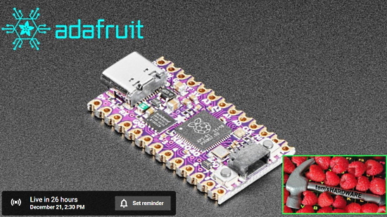
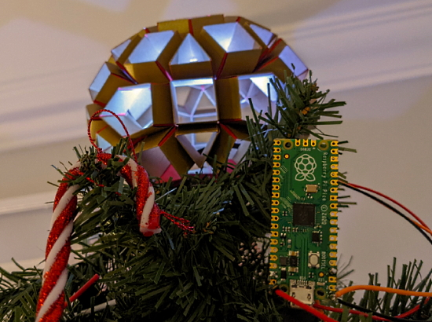
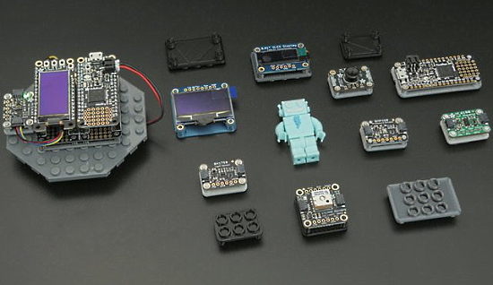
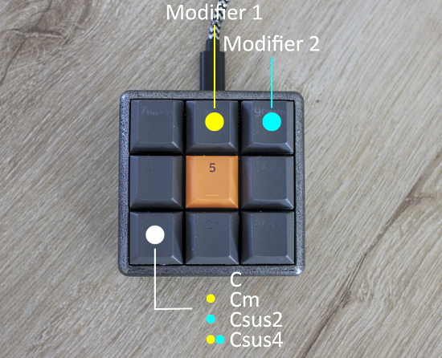
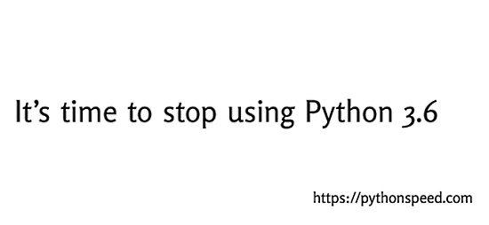
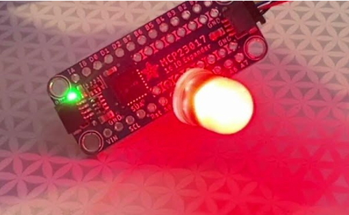
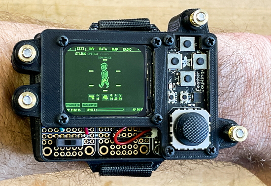

- [X] Kattni updates
- [ ] change date
- [ ] update title
- [ ] Feature story
- [ ] Update  for images
- [ ] Update ICYDNCI
- [ ] All images 550w max only
- [ ] Link "View this email in your browser."

News Sources

- [python.org](https://www.python.org/)
- [Python Insider - dev team blog](https://pythoninsider.blogspot.com/)
- [MicroPython Meetup Blog](https://melbournemicropythonmeetup.github.io/)
- [hackaday.io newest projects MicroPython](https://hackaday.io/projects?tag=micropython&sort=date) and [CircuitPython](https://hackaday.io/projects?tag=circuitpython&sort=date)
- [hackaday CircuitPython](https://hackaday.com/blog/?s=circuitpython) and [MicroPython](https://hackaday.com/blog/?s=micropython)
- [hackster.io CircuitPython](https://www.hackster.io/search?q=circuitpython&i=projects&sort_by=most_recent) and [MicroPython](https://www.hackster.io/search?q=micropython&i=projects&sort_by=most_recent)

View this email in your browser.

Welcome to the latest Python on Microcontrollers newsletter, brought you by the community! We're on [Discord](https://discord.gg/HYqvREz), [Twitter](https://twitter.com/search?q=circuitpython&src=typed_query&f=live), and for past newsletters - [view them all here](https://www.adafruitdaily.com/category/circuitpython/). If you're reading this on the web, [subscribe here](https://www.adafruitdaily.com/). Let's get started!

## Adafruit Appears on The Pi Cast, Talking About the KB2040 Board for Custom Keyboards

Tuesday December 21st, 2:30 pm, Tom's Hardware talks to the Adafruit CircuitPython team about Adafruit's new KB2040 board for custom keyboards. Capable of running Arduino and CircuitPython, it's in an Arduino Mini form factor but packs many more features - [YouTube](https://www.youtube.com/watch?v=jnxAq6czefY) and [Facebook](https://www.facebook.com/tomshardware/posts/10161651541109676).

## A Retro RPN Calculator Emulator Project

A retro RPN calculator emulator project using the Adafruit PyPortal Titano with CircuitPython. With the user interface mostly done, next is the calculator emulation - [Twitter](https://twitter.com/CedarGroveMakr/status/1471319969870663686) and [YouTube](https://youtu.be/tLINF1CIYqA).

## Topping your tree with a glowing Rhombicosidodecahedron

Making a rhombicosidodecahedron tree topper lit by 5 RGB LEDs poweres by a Raspberry Pi Pico and CircuitPython - [Age of Awareness](https://medium.com/age-of-awareness/its-not-christmas-until-your-tree-is-topped-with-a-glowing-rhombicosidodecahedron-ae7d29b050d2) and [YouTube](https://youtu.be/eFzJg5Q2xQw).

> A nice, subtle, classy light on top of our tree — I probably should have left it at that, however I was so taken by how easy the Pico was to set up that I grabbed a 5 metre rope of LEDs which I had reserved for another project and threw them into the tree too!

## The Idiot-Proof Guide to Upgrading Raspberry Pi from Buster to Bullseye

A Guide to Upgrading Raspberry Pi from Buster to Bullseye (*note: not recommended by the Raspberry Pi Foundation but this preserves your installed packages*) - [Blues Wireless](https://blues.io/blog/guide-upgrade-raspberry-pi-buster-bullseye/).

## Lego base plates for STEMMA boards!

Lego base plates for STEMMA boards! 3D Printed holders feature built-in standoffs for press fitting PCBs. STEMMA boards plug-and-play with various devices and accessories, without any soldering - [Twitter](https://twitter.com/adafruit/status/1471831898477453319), [YouTube](https://www.youtube.com/watch?v=7s8bPaKm-BY) and [Adafruit Learning System](https://learn.adafruit.com/stemma-lego-base-plates).

## CircuitPython Deep Dive Stream with Scott Shawcroft

Scott is off this week for some rest and relaxation - the posts will resume in 2 weeks.

You can see the latest video and past videos on the Adafruit YouTube channel under the Deep Dive playlist - [YouTube](https://www.youtube.com/playlist?list=PLjF7R1fz_OOXBHlu9msoXq2jQN4JpCk8A).

## CircuitPython Parsec

John Park’s CircuitPython Parsec: 

* Fake Ground Pins - [Adafruit Blog](https://blog.adafruit.com/2021/12/17/john-parks-circuitpython-parsec-fake-ground-pins-adafruit-johnedgarpark-adafruit-circuitpython/) and [YouTube](https://youtu.be/kQgPQmekjzg).

Catch all the episodes in the [YouTube playlist](https://www.youtube.com/playlist?list=PLjF7R1fz_OOWFqZfqW9jlvQSIUmwn9lWr).

## A Request for Help: Mu Translations please!

The Mu Python Editor is requesting assistance in translating messages into languages other than English. Coordination of translations is being done [via this discussion on GitHub](https://github.com/mu-editor/mu/discussions/1931).

Read more - [MadeWithMu](https://madewith.mu/mu/users/2021/12/13/translate.html).

## Next week - a guest editor!

For the December 28th newsletter, Editor Emeritus [Phil Torrone](https://twitter.com/ptorrone) will take over the publishing reins once more. Stay tuned for next week!

## News from around the web!

A MIDI musical note visualizer with NeoPixels and a Xiao mounted on PCB stock, programmed in CircuitPython - [Twitter](https://twitter.com/gvy_dvpont/status/1471944112282685441).

A better Raspberry Pi Pico MIDI controller - [4Dcu.be](http://blog.4dcu.be/diy/2021/12/16/MIDIpad_update.html).

> Working on this beauty right here. The TreeHouse Terminal V2 which fixes basically all the issues in the first rev. Working on building a CircuitPython build to test on it - [Twitter](https://twitter.com/oakdevtech/status/1472406935324409857).

New Video tutorial : Build IoT enabled holiday lights to decorate your Christmas tree, using a Raspberry Pi, balenaIO and adafruitIO - [Twitter](https://twitter.com/iAyanPahwa/status/1472562077264801792) and [YouTube](https://www.youtube.com/watch?v=x6-vYdkJntE).

Another watch design which can run CircuitPython - [Twitter](https://twitter.com/sulfuroid/status/1470406791351648261).

text - [site](url).

text - [site](url).

text - [site](url).

text - [site](url).

text - [site](url).

text - [site](url).

text - [site](url).

text - [site](url).

text - [site](url).

install MicroPython on your Sonoff Basic Smart Switch - [Cloud4RPi](https://cloud4rpi.io/esp8266-projects/sonoff-switch-micropython).

A MIDI music visualizer (like in Close Encounters) with Raspberry Pi Pico and MicroPython - [Adafruit Blog](https://blog.adafruit.com/2021/12/14/a-midi-music-visualizer-like-in-close-encounters-with-raspberry-pi-pico-and-micropython-raspberrypi-diyelectromusic/) and [YouTube](https://youtu.be/-Sd64LAgyfw).

text - [site](url).

Upgrading to new software versions is work, and work that doesn’t benefit your software’s users. Users care about features and bug fixes, not how up-to-date you are. But there is only so much time you can delay upgrading, and for mainline Python 3.6, the time to upgrade is right now. Python 3.6 is reaching its end of life as of December 2021.

No more bug fixes.

No more security fixes.

“It’s dead, Jim.” - [Python⇒Speed](https://pythonspeed.com/articles/stop-using-python-3.6/).

Between Blocks and Text: Strype - a novel editor for Python - a talk at micro:bit LIVE 2021 - [YouTube](https://www.youtube.com/watch?v=zCGDAjrCQXc&list=PLEo0hMrjdofs-XgVXg-Oib1mduB6biIIC&index=13).

text - [site](url).

Georgi Ker Awarded the PSF Community Service Award for Q4 2020 - [Python Software Foundation](https://pyfound.blogspot.com/2021/12/georgi-ker-awarded-psf-community.html).

#ICYDNCI What was the most popular, most clicked link, in [last week's newsletter](https://www.adafruitdaily.com/2021/12/14/python-on-microcontrollers-newsletter-pyleap-is-here-circuitpython-7-1-0-beta-3-and-much-more-python-adafruit-circuitpython-micropython-thepsf/)? [PyLeap](https://learn.adafruit.com/pyleap-app).

## Coming soon

Adafruit writes: "We’ve gotten a lot of requests for a MCP23017 breakout and we’ve always sorta been like 'ehh why not just use the DIP chip?' but with STEMMA QT we could see the use case for a plug and play version that comes with all the passives on board. So this breakout has 16 GPIO each with matching ground pads. Each GPIO can have a pullup, with 3 address pins, 2 IRQ pins, and it runs on 3 or 5V power and logic. We think this board is kind qt!" – [Video](https://youtu.be/iz9_u6cJOJU) and [Adafruit Blog Post](https://blog.adafruit.com/2021/12/14/stemma-qt-mcp23017-gpio-expander/).

Newt, a low-power, open source, 2.7-inch IoT display powered by an ESP32-S2 module and featuring SHARP's Memory-in-Pixel (MiP) screen technology - [CrowdSupply](https://www.crowdsupply.com/phambili/newt/updates/we-are-live).

## New Boards Supported by CircuitPython

The number of supported microcontrollers and Single Board Computers (SBC) grows every week. This section outlines which boards have been included in CircuitPython or added to [CircuitPython.org](https://circuitpython.org/).

This week, there were (#/no) new boards added!

- [Board name](url)

Looking to add a new board to CircuitPython? It's highly encouraged! Adafruit has four guides to help you do so:

- [How to Add a New Board to CircuitPython](https://learn.adafruit.com/how-to-add-a-new-board-to-circuitpython/overview)
- [How to add a New Board to the circuitpython.org website](https://learn.adafruit.com/how-to-add-a-new-board-to-the-circuitpython-org-website)
- [Adding a Single Board Computer to PlatformDetect for Blinka](https://learn.adafruit.com/adding-a-single-board-computer-to-platformdetect-for-blinka)
- [Adding a Single Board Computer to Blinka](https://learn.adafruit.com/adding-a-single-board-computer-to-blinka)

## New Learn Guides!

[Pip-Boy 2040 Wrist-Mounted Prop](https://learn.adafruit.com/pip-boy-2040) from [John Park](https://learn.adafruit.com/users/johnpark)

[MIDI Stomping Pads](https://learn.adafruit.com/midi-stomping-pads) from [Liz Clark](https://learn.adafruit.com/users/BlitzCityDIY)

[Adafruit NeoSlider](https://learn.adafruit.com/adafruit-neoslider) from [Kattni](https://learn.adafruit.com/users/kattni)

[Neocontroller Color Grading Input Box](https://learn.adafruit.com/neocontroller-color-grading-input-box) from [John Park](https://learn.adafruit.com/users/johnpark)

## CircuitPython Project Bundle

When you get to the CircuitPython code section of an [Adafruit Learn Guide](https://learn.adafruit.com/), sometimes things can get a bit complicated. You not only have the code you need to upload to your device, but you likely also need to add some libraries that the code requires to run. This involved downloading all the libraries, digging through to find the ones you need, and copying them to your device. That was only the beginning on some projects, as those that include images and/or sound files required further downloading and copying of files. But, not anymore!

Now, with Project Bundles, you can download all the necessary code, libraries and, if needed, asset files with one click! We automatically check which libraries are required for the project and bundle them up for you. No more digging through a huge list of libraries to find the ones you need, or fiddling with looking for other files or dependencies. Download the Project Bundle, copy the contents to your device, and your code will simply work. We wanted to make this the easiest way to get a project working, regardless of whether you're a beginner or an expert. We'll also be adding this feature to popular IDEs as an add-on. Try it out with any Circuit Python guide on the Adafruit Learning System. Just look for the ‘Download Project Bundle’ button on the code page. 

**To download and use a Project Bundle:**

In the Learning System - above any embedded code in a guide in the Adafruit Learn System, you’ll find a Download Project Bundle button.

Click the button to download the Project Bundle zip.

Open the Project Bundle zip to find the example code, all necessary libraries, and, if available, any images, sounds, etc.

Simply copy all the files over to your CIRCUITPY drive, and you’re ready to go!

If you run into any problems or bugs, or would like to submit feedback, please file an issue on the [Adafruit Learning System Guides GitHub repo](https://github.com/adafruit/Adafruit_Learning_System_Guides/issues).

## CircuitPython Libraries!

CircuitPython support for hardware continues to grow. We are adding support for new sensors and breakouts all the time, as well as improving on the drivers we already have. As we add more libraries and update current ones, you can keep up with all the changes right here!

For the latest libraries, download the [Adafruit CircuitPython Library Bundle](https://circuitpython.org/libraries). For the latest community contributed libraries, download the [CircuitPython Community Bundle](https://github.com/adafruit/CircuitPython_Community_Bundle/releases).

If you'd like to contribute, CircuitPython libraries are a great place to start. Have an idea for a new driver? File an issue on [CircuitPython](https://github.com/adafruit/circuitpython/issues)! Have you written a library you'd like to make available? Submit it to the [CircuitPython Community Bundle](https://github.com/adafruit/CircuitPython_Community_Bundle). Interested in helping with current libraries? Check out the [CircuitPython.org Contributing page](https://circuitpython.org/contributing). We've included open pull requests and issues from the libraries, and details about repo-level issues that need to be addressed. We have a guide on [contributing to CircuitPython with Git and Github](https://learn.adafruit.com/contribute-to-circuitpython-with-git-and-github) if you need help getting started. You can also find us in the #circuitpython channel on the [Adafruit Discord](https://adafru.it/discord).

You can check out this [list of all the Adafruit CircuitPython libraries and drivers available](https://github.com/adafruit/Adafruit_CircuitPython_Bundle/blob/master/circuitpython_library_list.md). 

The current number of CircuitPython libraries is **341**!

**Updated Libraries!**

Here's this week's updated CircuitPython libraries:

 * [Adafruit_CircuitPython_TinyLoRa](https://github.com/adafruit/Adafruit_CircuitPython_TinyLoRa)
 * [Adafruit_CircuitPython_Display_Shapes](https://github.com/adafruit/Adafruit_CircuitPython_Display_Shapes)
 * [Adafruit_CircuitPython_GPS](https://github.com/adafruit/Adafruit_CircuitPython_GPS)
 * [Adafruit_CircuitPython_seesaw](https://github.com/adafruit/Adafruit_CircuitPython_seesaw)
 * [Adafruit_CircuitPython_PyPortal](https://github.com/adafruit/Adafruit_CircuitPython_PyPortal)
 * [Adafruit_CircuitPython_RTTTL](https://github.com/adafruit/Adafruit_CircuitPython_RTTTL)
 * [Adafruit_CircuitPython_BLE](https://github.com/adafruit/Adafruit_CircuitPython_BLE)
 * [Adafruit_CircuitPython_PyBadger](https://github.com/adafruit/Adafruit_CircuitPython_PyBadger)
 * [Adafruit_CircuitPython_MAX7219](https://github.com/adafruit/Adafruit_CircuitPython_MAX7219)
 * [Adafruit_CircuitPython_DisplayIO_Layout](https://github.com/adafruit/Adafruit_CircuitPython_DisplayIO_Layout)
 * [Adafruit_CircuitPython_FRAM](https://github.com/adafruit/Adafruit_CircuitPython_FRAM)
 * [Adafruit_CircuitPython_asyncio](https://github.com/adafruit/Adafruit_CircuitPython_asyncio)
 * [Adafruit_Blinka](https://github.com/adafruit/Adafruit_Blinka)
 * [Adafruit_Blinka_Displayio](https://github.com/adafruit/Adafruit_Blinka_Displayio)
 * [Adafruit_Python_PlatformDetect](https://github.com/adafruit/Adafruit_Python_PlatformDetect)

## What’s the team up to this week?

What is the team up to this week? Let’s check in!

**Dan**

I released CircuitPython 7.1.0-beta.2 on Friday December 10. A significant regression was discovered over the weekend; I fixed it and released beta.3 on Monday.

I am now working mostly on fixing things we'd like to be fixed for 7.1.0 final. We will defer some more minor 7.x.x bug fixes to 7.2.0; the main branch is ahead of the 7.1.x branch in several ways, some slightly incompatible, and it would be nice to start making 7.2.0-alpha or beta releases.

**Melissa**

This past week, I worked some more on the [Blinka Displayio library](https://github.com/adafruit/Adafruit_Blinka_Displayio). I started by updating the library interface to the same as the CircuitPython 7.0.0 displayio interface including adding the typing. I realized there was much work done in a parallel effort by a community member, but as a complete rewrite, and so I've been slowly integrating the code from that project in as I go along so they end up at similar points without sacrificing any of the speed gains.

**Scott**

This week I finished up SPI support for the Broadcom port of CircuitPython and debugged the NeoPixel support. It is now working. There still are some pretty critical bugs in the port so I'll be looking at those. I also need to wrap with Zero support and the learn guide to go with it. I'll be in and out over the holidays and look forward to CircuitPython 2022 discussions in January. Start brainstorming now for what CircuitPython could be in 2022 and beyond.

## Upcoming events!

PyCascades is a regional PyCon in the Pacific Northwest, celebrating the west coast Python developer and user community. Our organizing team includes members of the Vancouver, Seattle, and Portland Python user groups. DATES ANNOUNCED! February 5th-6th, 2022 The conference will take place on Saturday and the first half of Sunday, with the post-conference sprints following that on Sunday afternoon. After three amazing in-person conferences and an engaging online conference, we are ready to do it again! - [PyCascades 2022](https://2022.pycascades.com/).

PyCon US 2022 planning is underway. The team is planning to host the event in person with an online component. April 27, 2022 - May 5, 2022. Head over to the [PyCon US 2022 website](https://us.pycon.org/2022/) for details about the conference and more information about the sponsorship program - [PyCon Blog](https://pycon.blogspot.com/2021/10/pycon-us-2022-website-and-sponsorship.html).

PyCon Italia is the Italian conference on Python. Organised by Python Italia, it is one of the more important Python conferences in Europe. With over 700 attendees, the next edition will be June 2-5, 2022 - [Ticket Registration](https://pycon.it/en/tickets).

**Send Your Events In**

As for other events, with the COVID pandemic, most in-person events are postponed or cancelled. If you know of virtual events or events that may occur in the future, please let us know on Discord or on Twitter with hashtag #CircuitPython.

## Latest releases

CircuitPython's stable release is [#.#.#](https://github.com/adafruit/circuitpython/releases/latest) and its unstable release is [#.#.#-##.#](https://github.com/adafruit/circuitpython/releases). New to CircuitPython? Start with our [Welcome to CircuitPython Guide](https://learn.adafruit.com/welcome-to-circuitpython).

[2021####](https://github.com/adafruit/Adafruit_CircuitPython_Bundle/releases/latest) is the latest CircuitPython library bundle.

[v#.#.#](https://micropython.org/download) is the latest MicroPython release. Documentation for it is [here](http://docs.micropython.org/en/latest/pyboard/).

[#.#.#](https://www.python.org/downloads/) is the latest Python release. The latest pre-release version is [#.#.#](https://www.python.org/download/pre-releases/).

[#### Stars](https://github.com/adafruit/circuitpython/stargazers) Like CircuitPython? [Star it on GitHub!](https://github.com/adafruit/circuitpython)

## Call for help -- Translating CircuitPython is now easier than ever!

One important feature of CircuitPython is translated control and error messages.

With the help of fellow open source project [Weblate](https://weblate.org/), we're making it even easier to add or improve translations.

Sign in with an existing account such as GitHub, Google or Facebook and start contributing through a simple web interface. No forks or pull requests needed!

As always, if you run into trouble join us on [Discord](https://adafru.it/discord), we're here to help.

## jobs.adafruit.com - Find a dream job, find great candidates!

[jobs.adafruit.com](https://jobs.adafruit.com/) has returned and folks are posting their skills (including CircuitPython) and companies are looking for talented makers to join their companies - from Digi-Key, to Hackaday, Micro Center, Raspberry Pi and more.

**Job of the Week**

Adafruit IO and Arduino Programming - EngineerAlly - [Adafruit Jobs Board](https://jobs.adafruit.com/job/adafruit-io-and-arduino-programming-2/).

## 32,243 thanks!

The Adafruit Discord community, where we do all our CircuitPython development in the open, reached over 32,243 humans, thank you!  Adafruit believes Discord offers a unique way for CircuitPython folks to connect. Join today at [https://adafru.it/discord](https://adafru.it/discord).

## ICYMI - In case you missed it

The wonderful world of Python on hardware! This is our Python video-newsletter-podcast! The news comes from the Python community, Discord, Adafruit communities and more and is reviewed on ASK an ENGINEER Wednesdays. The complete Python on Hardware weekly videocast [playlist is here](https://www.youtube.com/playlist?list=PLjF7R1fz_OOXRMjM7Sm0J2Xt6H81TdDev). 

This video podcast is on [iTunes](https://itunes.apple.com/us/podcast/python-on-hardware/id1451685192?mt=2), [YouTube](http://adafru.it/pohepisodes), [IGTV (Instagram TV](https://www.instagram.com/adafruit/channel/)), and [XML](https://itunes.apple.com/us/podcast/python-on-hardware/id1451685192?mt=2).

[Weekly community chat on Adafruit Discord server CircuitPython channel - Audio / Podcast edition](https://itunes.apple.com/us/podcast/circuitpython-weekly-meeting/id1451685016) - Audio from the Discord chat space for CircuitPython, meetings are usually Mondays at 2pm ET, this is the audio version on [iTunes](https://itunes.apple.com/us/podcast/circuitpython-weekly-meeting/id1451685016), Pocket Casts, [Spotify](https://adafru.it/spotify), and [XML feed](https://adafruit-podcasts.s3.amazonaws.com/circuitpython_weekly_meeting/audio-podcast.xml).

And lastly, we are working up a one-spot destination for all things podcast-able here - [podcasts.adafruit.com](https://podcasts.adafruit.com/)

## Contribute!

The CircuitPython Weekly Newsletter is a CircuitPython community-run newsletter emailed every Tuesday. The complete [archives are here](https://www.adafruitdaily.com/category/circuitpython/). It highlights the latest CircuitPython related news from around the web including Python and MicroPython developments. To contribute, edit next week's draft [on GitHub](https://github.com/adafruit/circuitpython-weekly-newsletter/tree/gh-pages/_drafts) and [submit a pull request](https://help.github.com/articles/editing-files-in-your-repository/) with the changes. You may also tag your information on Twitter with #CircuitPython. 

Join our [Discord](https://adafru.it/discord) or [post to the forum](https://forums.adafruit.com/viewforum.php?f=60) for any further questions.
