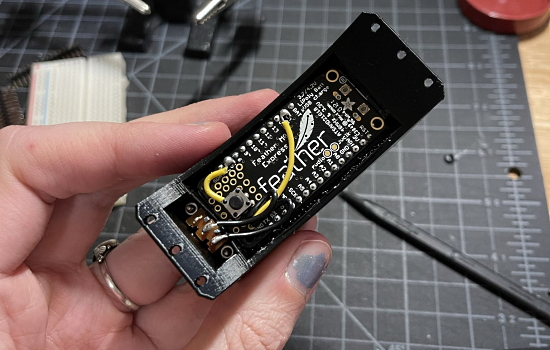
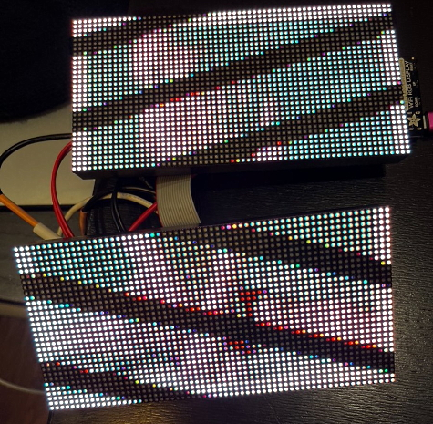
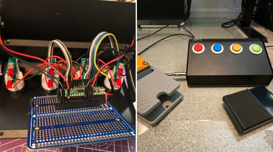
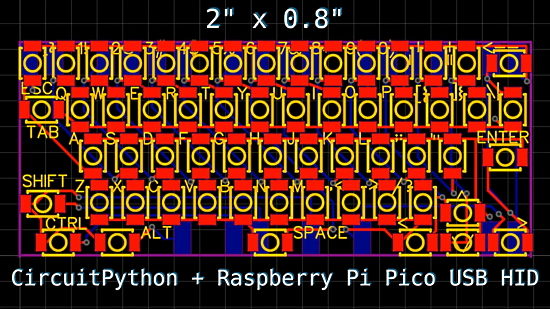
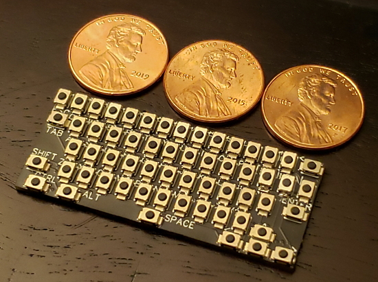
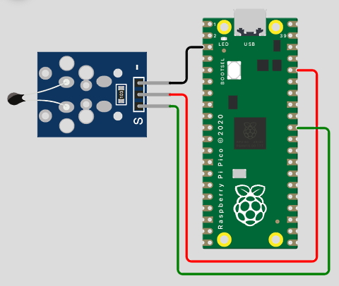
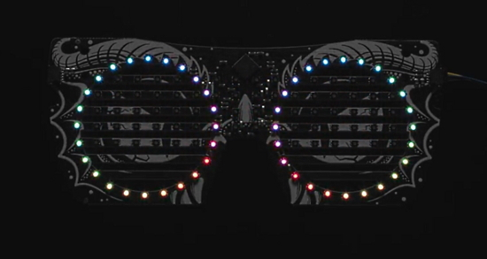
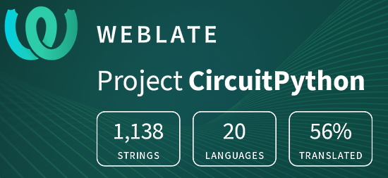

- [ ] Kattni updates
- [ ] change date
- [ ] update title
- [ ] Feature story
- [ ] Update  for images
- [ ] Update ICYDNCI
- [ ] All images 550w max only
- [ ] Link "View this email in your browser."

News Sources

- [python.org](https://www.python.org/)
- [Python Insider - dev team blog](https://pythoninsider.blogspot.com/)
- [MicroPython Meetup Blog](https://melbournemicropythonmeetup.github.io/)
- [hackaday.io newest projects MicroPython](https://hackaday.io/projects?tag=micropython&sort=date) and [CircuitPython](https://hackaday.io/projects?tag=circuitpython&sort=date)
- [hackaday CircuitPython](https://hackaday.com/blog/?s=circuitpython) and [MicroPython](https://hackaday.com/blog/?s=micropython)
- [hackster.io CircuitPython](https://www.hackster.io/search?q=circuitpython&i=projects&sort_by=most_recent) and [MicroPython](https://www.hackster.io/search?q=micropython&i=projects&sort_by=most_recent)

View this email in your browser.

Welcome to the latest Python on Microcontrollers newsletter! 

We're on [Discord](https://discord.gg/HYqvREz), [Twitter](https://twitter.com/search?q=circuitpython&src=typed_query&f=live), and for past newsletters - [view them all here](https://www.adafruitdaily.com/category/circuitpython/). If you're reading this on the web, [subscribe here](https://www.adafruitdaily.com/). Here's the news this week:

## The CircuitPython in 2022 Survey

text - [site](url).

## Feature

text - [site](url).

## Feature

text - [site](url).

## Project of the Week: An LED Choker

Twitter user rmna demonstrates a wonderful LED alphanumeric chocker - [Twitter](https://twitter.com/projectrmna/status/1478915895971827712).

> My new favorite project: a text display choker for status updates at the club. Uses an Adafruit alphanumeric display FeatherWing and a Feather M0. Proto grid hosts a button to switch patterns, and CircuitPython lets the owner edit the code to add new text!

## CircuitPython Deep Dive Stream with Scott Shawcroft

[This week](link), Scott streams his work on .

You can see the latest video and past videos on the Adafruit YouTube channel under the Deep Dive playlist - [YouTube](https://www.youtube.com/playlist?list=PLjF7R1fz_OOXBHlu9msoXq2jQN4JpCk8A).

## CircuitPython Parsec

John Park’s CircuitPython Parsec: 

* episode - [Adafruit Blog](url)

Catch all the episodes in the [YouTube playlist](https://www.youtube.com/playlist?list=PLjF7R1fz_OOWFqZfqW9jlvQSIUmwn9lWr).

## News from around the web!

> So last month I built this lil time/weather/Spotify display from an Adafruit Matrix Portal kit. Very impressed how easy it was (it’s Python!!). The only real difficulty: the Spotify API. They don’t have a “limited input device” API for displays - [Twitter](https://twitter.com/f0da/status/1479155289135869953).

Sending sensor data from a Raspberry Pi Pico and Adafruit Airlift to HiveMQ Cloud with CircuitPython - [HiveMQ](https://www.hivemq.com/blog/mqtt-raspberrypi-part03-sending-sensor-data-hivemqcloud-pico/) and [YouTube](https://www.youtube.com/watch?v=O3T_AlA7atE), via [Twitter](https://twitter.com/HiveMQ/status/1479128427013758981).

> I did it!  Using CircuitPython, I can download a bitmap of an album over WiFi from my web server and display it locally - and not run out of memory!  Now to hook up MQTT to push new album art. Say hello to Liz Phair. (Ignore the lines, LEDs don’t like having their picture taken) - [Twitter](https://twitter.com/prcutler/status/1478742453708541953).

A lively thread discussing Mu vs. an editor with more features like VSCode - [Twitter](https://twitter.com/gallaugher/status/1479102000604200960).

> My kickboard is (Raspberry Pi) Pico and CircuitPython powered! CircuitPython is a great and approachable spot to start, because of the fantastic community behind it - [Twitter](https://twitter.com/_nitz/status/1478560976840663046).

An internet clock using Maker Pi Pico and CircuitPython - [YouTube](https://www.youtube.com/watch?v=VGmlq1unmHc) and [Tutorial](https://tutorial.cytron.io/2022/01/04/internet-clock-using-maker-pi-pico-and-circuitpython/), via [Twitter](https://twitter.com/inquizzitech/status/1478976654798163968).

A very small CircuitPython Raspberry Pi Pico USB HID keyboard - [YouTube](https://www.youtube.com/watch?v=V2ivH2PEoiA&t=2s) and [Hackaday.io](https://hackaday.io/project/178204-the-smallest-keyboard), via [Reddit](https://www.reddit.com/r/circuitpython/comments/rx4mvb/usb_hid_pi_pico_qwerty_keyboard_backpack_wmatrix/).

text - [site](url).

text - [site](url).

text - [site](url).

text - [site](url).

text - [site](url).

text - [site](url).

text - [site](url).

text - [site](url).

text - [site](url).

text - [site](url).

Secrets of MicroPython: How to measure temperature - [Bhavesh Kakwani](https://bhave.sh/micropython-measure-temperature/).

text - [site](url).

text - [site](url).

text - [site](url).

**#ICYDNCI What was the most popular, most clicked link, in [last week's newsletter](https://link)? [title](url).**

## Coming soon

text - [site](url).

text - [site](url).

## New Boards Supported by CircuitPython

The number of supported microcontrollers and Single Board Computers (SBC) grows every week. This section outlines which boards have been included in CircuitPython or added to [CircuitPython.org](https://circuitpython.org/).

This week, there were (#/no) new boards added!

- [Board name](url)

Looking to add a new board to CircuitPython? It's highly encouraged! Adafruit has four guides to help you do so:

- [How to Add a New Board to CircuitPython](https://learn.adafruit.com/how-to-add-a-new-board-to-circuitpython/overview)
- [How to add a New Board to the circuitpython.org website](https://learn.adafruit.com/how-to-add-a-new-board-to-the-circuitpython-org-website)
- [Adding a Single Board Computer to PlatformDetect for Blinka](https://learn.adafruit.com/adding-a-single-board-computer-to-platformdetect-for-blinka)
- [Adding a Single Board Computer to Blinka](https://learn.adafruit.com/adding-a-single-board-computer-to-blinka)

## New Learn Guides!

[title](url) from [name](url)

[title](url) from [name](url)

[title](url) from [name](url)

## Updated Learn Guides!

[title](url) from [name](url)

## CircuitPython Libraries!

CircuitPython support for hardware continues to grow. We are adding support for new sensors and breakouts all the time, as well as improving on the drivers we already have. As we add more libraries and update current ones, you can keep up with all the changes right here!

For the latest libraries, download the [Adafruit CircuitPython Library Bundle](https://circuitpython.org/libraries). For the latest community contributed libraries, download the [CircuitPython Community Bundle](https://github.com/adafruit/CircuitPython_Community_Bundle/releases).

If you'd like to contribute, CircuitPython libraries are a great place to start. Have an idea for a new driver? File an issue on [CircuitPython](https://github.com/adafruit/circuitpython/issues)! Have you written a library you'd like to make available? Submit it to the [CircuitPython Community Bundle](https://github.com/adafruit/CircuitPython_Community_Bundle). Interested in helping with current libraries? Check out the [CircuitPython.org Contributing page](https://circuitpython.org/contributing). We've included open pull requests and issues from the libraries, and details about repo-level issues that need to be addressed. We have a guide on [contributing to CircuitPython with Git and Github](https://learn.adafruit.com/contribute-to-circuitpython-with-git-and-github) if you need help getting started. You can also find us in the #circuitpython channels on the [Adafruit Discord](https://adafru.it/discord).

You can check out this [list of all the Adafruit CircuitPython libraries and drivers available](https://github.com/adafruit/Adafruit_CircuitPython_Bundle/blob/master/circuitpython_library_list.md). 

The current number of CircuitPython libraries is **###**!

**New Libraries!**

Here's this week's new CircuitPython libraries:

* [library](url)

**Updated Libraries!**

Here's this week's updated CircuitPython libraries:

* [library](url)

## What’s the team up to this week?

What is the team up to this week? Let’s check in!

**Dan**

Last week I [added some features to countio](https://github.com/adafruit/circuitpython/pull/5803), allowing counting of both rising and falling edges, and also added pullup/pulldown support. This week I wrote a simple example demonstrating using asyncio to control and vary a NeoPixel animation. Now I am working on some further bugs we should fix for the next release of CircuitPython.

**Jeff**

I've been pulled into the floppy vortex of winter 2021/2022. With some work-in-progress code, I can grab raw flux timings in CircuitPython, then take them to a desktop computer and decode MFM data with a second Python program. The ultimate goal is to allow read access to old DOS floppies directly in CircuitPython with `mount("/floppy", floppy)`

**Melissa**

This past week was short for me, but I started splitting the Blinka Displayio shared functions into a Display Core module. The transition is started, but due to the relatively small number of people that are actually using the system and the availability of much better graphics systems, it makes sense to not put any more work into the library, so I am leaving it to the community or whomever wants to use it to advance it more. The library can be found at https://github.com/adafruit/Adafruit_Blinka_Displayio.

I also started on a second project to generate a LittleFS file system using pure JavaScript. There were other projects that had made a wrapper around the c code, but no actual ports, so this will be the first port, though really only a partial one since only a subset of the features will be required. This will replace the NVM Generator that I had made last year since it will work on both the ESP32 and the ESP8266.

**Scott**

I'm just starting up after taking another long weekend for the holidays. My main goal this week is to wrap up the Raspberry Pi work for the time being and spend some time on the ESP32-S3. I've got a pull request out that adds Pi Zero support and hopefully fixes the SD card support along with it. The last thing I want to do is merge in Piunora support because I've already started. I should be able to get all of those changes out this week.

On New Year's Day I also kicked off #CircuitPython2022. I'm excited to see where folks would like CircuitPython to go. I'm going to do a retrospective on #CircuitPython2021 for my first stream of the year and then follow up with #CircuitPython2022 the following stream. So, please let us know when you post something by emailing circuitpython2022@adafruit.com. Thanks!

## Upcoming events!

The next MicroPython Meetup in Melbourne will be on January 26th – [Meetup](https://www.meetup.com/MicroPython-Meetup/).  See the [blog](https://melbournemicropythonmeetup.github.io/) for past notes.

PyCascades is a regional PyCon in the Pacific Northwest, celebrating the west coast Python developer and user community. Our organizing team includes members of the Vancouver, Seattle, and Portland Python user groups. DATES ANNOUNCED! February 5th-6th, 2022 The conference will take place on Saturday and the first half of Sunday, with the post-conference sprints following that on Sunday afternoon. After three amazing in-person conferences and an engaging online conference, we are ready to do it again! - [PyCascades 2022](https://2022.pycascades.com/).

PyCon US 2022 planning is underway. The team is planning to host the event in person with an online component. April 27, 2022 - May 5, 2022. Head over to the [PyCon US 2022 website](https://us.pycon.org/2022/) for details about the conference and more information about the sponsorship program - [PyCon Blog](https://pycon.blogspot.com/2022/10/pycon-us-2022-website-and-sponsorship.html).

PyCon Italia is the Italian conference on Python. Organised by Python Italia, it is one of the more important Python conferences in Europe. With over 700 attendees, the next edition will be June 2-5, 2022 - [Ticket Registration](https://pycon.it/en/tickets).

**Send Your Events In**

As for other events, with the COVID pandemic, most in-person events are postponed or cancelled. If you know of virtual events or events that may occur in the future, please let us know on Twitter with hashtag #CircuitPython or email to cpnews(at)adafruit(dot)com.

## Latest releases

CircuitPython's stable release is [#.#.#](https://github.com/adafruit/circuitpython/releases/latest) and its unstable release is [#.#.#-##.#](https://github.com/adafruit/circuitpython/releases). New to CircuitPython? Start with our [Welcome to CircuitPython Guide](https://learn.adafruit.com/welcome-to-circuitpython).

[2022####](https://github.com/adafruit/Adafruit_CircuitPython_Bundle/releases/latest) is the latest CircuitPython library bundle.

[v#.#.#](https://micropython.org/download) is the latest MicroPython release. Documentation for it is [here](http://docs.micropython.org/en/latest/pyboard/).

[#.#.#](https://www.python.org/downloads/) is the latest Python release. The latest pre-release version is [#.#.#](https://www.python.org/download/pre-releases/).

[#### Stars](https://github.com/adafruit/circuitpython/stargazers) Like CircuitPython? [Star it on GitHub!](https://github.com/adafruit/circuitpython)

## Call for help -- Translating CircuitPython is now easier than ever!

One important feature of CircuitPython is translated control and error messages. With the help of fellow open source project [Weblate](https://weblate.org/), we're making it even easier to add or improve translations. 

Sign in with an existing account such as GitHub, Google or Facebook and start contributing through a simple web interface. No forks or pull requests needed! As always, if you run into trouble join us on [Discord](https://adafru.it/discord), we're here to help.

## jobs.adafruit.com - Find a dream job, find great candidates!

[jobs.adafruit.com](https://jobs.adafruit.com/) has returned and folks are posting their skills (including CircuitPython) and companies are looking for talented makers to join their companies - from Digi-Key, to Hackaday, Micro Center, Raspberry Pi and more.

## 32,563 thanks!

The Adafruit Discord community, where we do all our CircuitPython development in the open, reached over 32,563 humans - thank you!  Adafruit believes Discord offers a unique way for Python on hardware folks to connect. Join today at [https://adafru.it/discord](https://adafru.it/discord).

## ICYMI - In case you missed it

Python on hardware is the Adafruit Python video-newsletter-podcast! The news comes from the Python community, Discord, Adafruit communities and more and is broadcast on ASK an ENGINEER Wednesdays. The complete Python on Hardware weekly videocast [playlist is here](https://www.youtube.com/playlist?list=PLjF7R1fz_OOXRMjM7Sm0J2Xt6H81TdDev). The video podcast is on [iTunes](https://itunes.apple.com/us/podcast/python-on-hardware/id1451685192?mt=2), [YouTube](http://adafru.it/pohepisodes), [IGTV (Instagram TV](https://www.instagram.com/adafruit/channel/)), and [XML](https://itunes.apple.com/us/podcast/python-on-hardware/id1451685192?mt=2).

[The weekly community chat on Adafruit Discord server CircuitPython channel - Audio / Podcast edition](https://itunes.apple.com/us/podcast/circuitpython-weekly-meeting/id1451685016) - Audio from the Discord chat space for CircuitPython, meetings are usually Mondays at 2pm ET, this is the audio version on [iTunes](https://itunes.apple.com/us/podcast/circuitpython-weekly-meeting/id1451685016), Pocket Casts, [Spotify](https://adafru.it/spotify), and [XML feed](https://adafruit-podcasts.s3.amazonaws.com/circuitpython_weekly_meeting/audio-podcast.xml).

## Codecademy "Learn Hardware Programming with CircuitPython"

Codecademy, an online interactive learning platform used by more than 45 million people, has teamed up with Adafruit to create a coding course, “Learn Hardware Programming with CircuitPython”. The course is now available in the [Codecademy catalog](https://www.codecademy.com/learn/learn-circuitpython?utm_source=adafruit&utm_medium=partners&utm_campaign=circuitplayground&utm_content=pythononhardwarenewsletter).

## Contribute!

The CircuitPython Weekly Newsletter is a CircuitPython community-run newsletter emailed every Tuesday. The complete [archives are here](https://www.adafruitdaily.com/category/circuitpython/). It highlights the latest CircuitPython related news from around the web including Python and MicroPython developments. To contribute, edit next week's draft [on GitHub](https://github.com/adafruit/circuitpython-weekly-newsletter/tree/gh-pages/_drafts) and [submit a pull request](https://help.github.com/articles/editing-files-in-your-repository/) with the changes. You may also tag your information on Twitter with #CircuitPython. 

Join the Adafruit [Discord](https://adafru.it/discord) or [post to the forum](https://forums.adafruit.com/viewforum.php?f=60) if you have questions.
