- [X] Kattni updates
- [ ] change date
- [ ] update title
- [ ] Feature story
- [ ] Update  for images
- [ ] Update ICYDNCI
- [ ] All images 550w max only
- [ ] Link "View this email in your browser."

News Sources

- [python.org](https://www.python.org/)
- [Python Insider - dev team blog](https://pythoninsider.blogspot.com/)
- [MicroPython Meetup Blog](https://melbournemicropythonmeetup.github.io/)
- [hackaday.io newest projects MicroPython](https://hackaday.io/projects?tag=micropython&sort=date) and [CircuitPython](https://hackaday.io/projects?tag=circuitpython&sort=date)
- [hackaday CircuitPython](https://hackaday.com/blog/?s=circuitpython) and [MicroPython](https://hackaday.com/blog/?s=micropython)
- [hackster.io CircuitPython](https://www.hackster.io/search?q=circuitpython&i=projects&sort_by=most_recent) and [MicroPython](https://www.hackster.io/search?q=micropython&i=projects&sort_by=most_recent)

View this email in your browser.

Welcome to the latest Python on Microcontrollers newsletter! 

We're on [Discord](https://discord.gg/HYqvREz), [Twitter](https://twitter.com/search?q=circuitpython&src=typed_query&f=live), and for past newsletters - [view them all here](https://www.adafruitdaily.com/category/circuitpython/). If you're reading this on the web, [subscribe here](https://www.adafruitdaily.com/). Here's the news this week:

## Headline Article

text - [site](url).

## The Raspberry Pi Pico / RP2040 Turns One Year Old

ABout a year ago, Raspberry Pi released a new type of product - their first microcontroller: the RP2040 and a devevelopment board which uses it: the Raspberry Pi Pico. Usage by the electronics and hobbyist community has been quick due to great functionality at a great price point (and it has generally remained available during the silicon shortage).

Maker companies were quick to release RP2040 boards of their own, including Adafruit, SparkFun, Pimoroni and many more as well as smaller companies and individuals. Scaores of designs rely on this versitile chip to perform some remarkable tasks. With lots of RAM, Flash, dual cores, and user programmable PIO, this chip packs a punch.

Read an excellent article by Alasdair Allen which discusses MicroPython and CircuitPython - [RaspberryPi.com](https://www.raspberrypi.com/news/multilingual-blink-for-raspberry-pi-pico/).

## A Study in the Popularity of the CircuitPython GitHub Repository

An interesting look at the number of GitHub Stars awarded to the Adafruit [CircuitPython GitHub repo](https://github.com/adafruit/circuitpython). Marked increases on the dates that the Adafruit PyPortal (2019) and the Raspberry Pi Pico (2021) were released. CircuitPython enjoys increased usage in many segments of the embedded ecosphere - [Star-History](https://star-history.com/#adafruit/circuitpython&Date).

## The Pi Cast Celebrates 10 Years of Raspberry Pi: New Episodes With Ladyada, Eben Upton, and More

The Pi Cast Celebrates 10 Years of Raspberry Pi: New Episodes With Ladyada, Eben Upton, and others. Adafruit's Limor Fried will be on a livecast on February 15, 2022 - [More on Tom's Hardware](https://www.tomshardware.com/news/pi-cast-celebrates-10-years-of-raspberry-pi) and [YouTube](https://www.youtube.com/watch?v=aGV6zZmF8Bs).

## CircuitPython2022 Updates

Here is additional CircuitPython 2022 feedback received since last week:

There is still time to get your feedback to the CircuitPython team - see [this post](https://blog.adafruit.com/2022/01/01/circuitpython-in-2022-circuitpython2022-circuitpython/) for details.

## Yes, MicroPython Works on MS-DOS Too

Thinking that you'd like to program some Python for a retro MS-DOS board or machine? MicroPython has you covered - [Twitter](https://twitter.com/zoomosis/status/1343505245742088197).

> There's a version of MicroPython for DOS that supports Python 3.x syntax. Running here in MS-DOS 5.0

Apparently a floating point coprocessor (or separate emulation software) is needed also. Details - [MicroPython Wiki](https://github.com/micropython/micropython/wiki/Building-micropython-for-FreeDOS).

## CircuitPython Deep Dive Stream with Scott Shawcroft

[This week](https://youtu.be/BYNKy88PKYY), Scott discusses #CircuitPython2022 and ESP32-S3.

You can see the latest video and past videos on the Adafruit YouTube channel under the Deep Dive playlist - [YouTube](https://www.youtube.com/playlist?list=PLjF7R1fz_OOXBHlu9msoXq2jQN4JpCk8A).

## CircuitPython Parsec

John Park’s CircuitPython Parsec: User Input - [Adafruit Blog](https://blog.adafruit.com/2022/01/22/john-parks-circuitpython-parsec-user-input-adafruit-johnedgarpark-adafruit-circuitpython/) and [YouTube](https://youtu.be/yfJQWGUyGBQ).

Catch all the episodes in the [YouTube playlist](https://www.youtube.com/playlist?list=PLjF7R1fz_OOWFqZfqW9jlvQSIUmwn9lWr).

## The CircuitPython Show

The CircuitPython Show  is a new independent podcast, hosted by Paul Cutler, focused on the people doing awesome things with CircuitPython. Each episode features Paul in conversation with a guest for a twenty to thirty minute interview - [CircuitPythonShow](https://circuitpythonshow.com/), [Blog Post](https://paulcutler.org/posts/2022/01/introducing-the-circuitpython-show/) and [Twitter](https://twitter.com/circuitpyshow).

## CircuitPython in This Month's Issue of HackSpace Magazine

[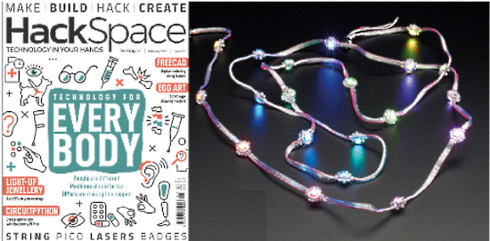](https://hackspace.raspberrypi.com/issues/51)

Three projects in this month's issue of HackSpace Magazine use CircuitPython. You can subscribe or read the free PDF vertsion - [HackSpace Magazine](https://hackspace.raspberrypi.com/issues/51).

* [LED animations with CircuitPython](https://blog.adafruit.com/2022/01/21/hackspace-magazine-issue-51-led-animations-with-circuitpython-neopixels-circuitpython-hackspacemag/)
* [Tracking workshop dust](https://blog.adafruit.com/2022/01/21/hackspace-magazine-issue-51-tracking-workshop-dust-metro-iot-circuitpython-hackspacemag/)
* [Make a talking Pomodoro timer with Pico](https://blog.adafruit.com/2022/01/21/hackspace-magazine-issue-51-make-a-talking-pomodoro-timer-with-pico-circuitpython-hackspacemag/)

## Project of the Week

[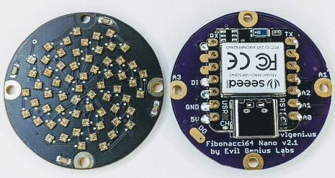](https://twitter.com/jasoncoon_/status/1483444389619896328)

[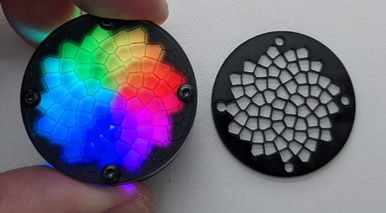](https://twitter.com/jasoncoon_/status/1483444389619896328)

[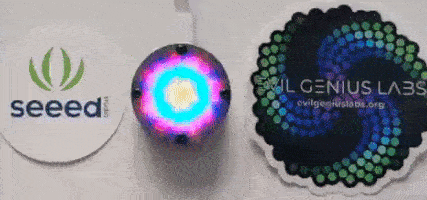](https://twitter.com/jasoncoon_/status/1483444389619896328)

[Jason Coon](https://twitter.com/jasoncoon_) uses both a Xiao BLE and an Adafruit QT Py SAMD21 with an [Evil Genius Labs](https://twitter.com/evilgeniuslab) Fibonacci64 Nano to make a compact and colorful pendant - [Twitter](https://twitter.com/jasoncoon_/status/1483444389619896328).

> "Success! The exact same CircuitPython Fibonacci64 Nano code works on the Seeedstudio Xiao BLE as did on the Adafruit QT Py SAMD21" - [GitHub](https://gist.github.com/jasoncoon/6884626781bac0f922c48d2a406a8a57).

## News from around the web!

[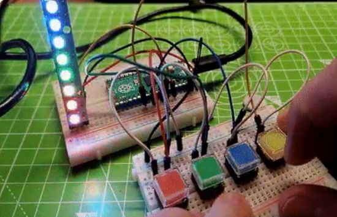](https://www.tomshardware.com/how-to/make-simon-game-with-raspberry-pi-pico)

Les Pounder demonstrates how to build a Simon Game with Raspberry Pi Pico  celebrating the Pico's anniversary - [Tom's Hardware](https://www.tomshardware.com/how-to/make-simon-game-with-raspberry-pi-pico) via [Twitter](https://twitter.com/biglesp/status/1485313189671755782).

A Glowy Coaster made with an Adafruit Trinket M0 and CircuitPython - [charlyn.codes](https://charlyn.codes/glowy-coaster/) and [Vimeo](https://vimeo.com/668484571) via [Twitter](https://twitter.com/chardane/status/1484432873029464064).

[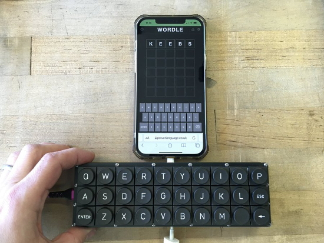](https://twitter.com/johnedgarpark/status/1484605984865587200)

Building a dedicated word game keyboard with CircuitPython - [Twitter](https://twitter.com/johnedgarpark/status/1484605984865587200).

nightscout_magtag uses an Adafruit Magtag to display the current time of Nightscout blood glucose data (and it also flashes the Magtag Neopixels with the latest Cheerlights colour to show you it's updated) - [GitHub](https://github.com/thebotmakes/nightscout_magtag) via [Twitter](https://twitter.com/thebotmakes/status/1483907793329471489).

[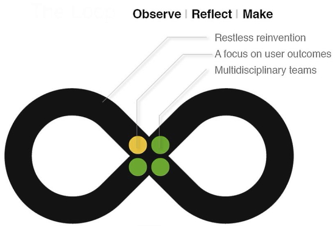](https://twitter.com/bradanlane/status/1483602995761745920)

Bradán Lane writes "On a Live stream recently I was (mildly) ridiculed for writing CircuitPython. Choosing CircuitPython was not for me but as a conscious feature to make customization easy for the target user. 'Design for the User'" - [Twitter](https://twitter.com/bradanlane/status/1483602995761745920).

From that same [Twitter Thread](https://twitter.com/TylerCrumpton/status/1483709371452428288) - the comments below:

text - [site](url).

A Circuitpython HID emulator device with smart home functions - [GitHub](https://github.com/winiar93/handy-clicker).

[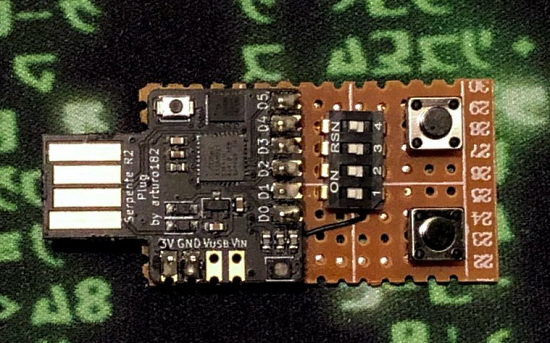](https://twitter.com/alx_nearphuture/status/1483564258398986247)

Adding inputs to a Serpente board to provide Rubber Ducky capabilities in CircuitPython - [Twitter](https://twitter.com/alx_nearphuture/status/1483564258398986247).

[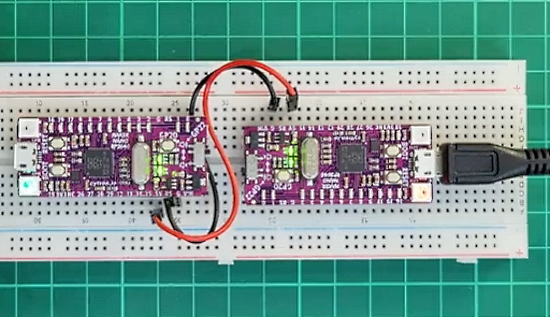](https://twitter.com/cytrontech/status/1483957945398628353)

Playing "[Bella Ciao](https://www.youtube.com/watch?v=jhgJV0Pg54Y)" on a Maker Nano RP2040 programmed in CircuitPython - [Twitter](https://twitter.com/cytrontech/status/1483957945398628353).

> Hacked an old keypad for prototyping a CircuitPython RPiPico idea. Still waiting on a few parts to finish the testing. The donor keypad has a strange matrix layout, so I not able to (easily) use all the buttons. Quick progress thanks to Adafruit Matrix_Keyboard library code - [Twitter](https://twitter.com/bradanlane/status/1483528135945728001).

text - [site](url).

text - [site](url).

text - [site](url).

text - [site](url).

text - [site](url).

text - [site](url).

[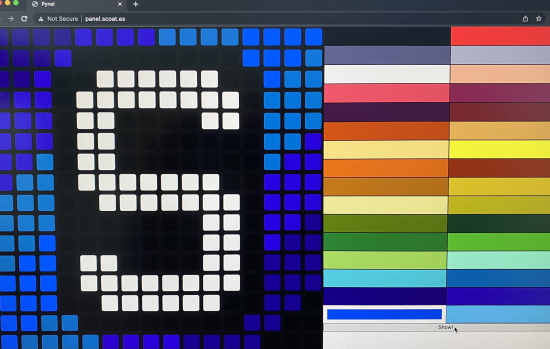](https://twitter.com/coates/status/1485336515936935948)

[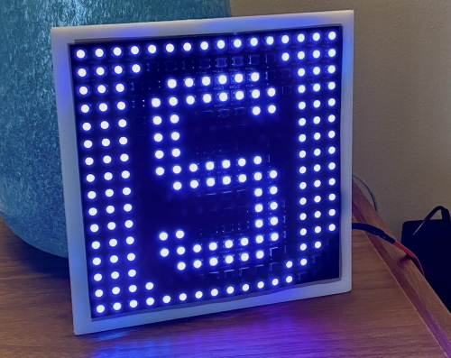](https://twitter.com/coates/status/1485336515936935948)

An ESP32 + MicroPython driven pixel panel with a Web UI, accessible from a Chromebook - [Twitter](https://twitter.com/coates/status/1485336515936935948).

[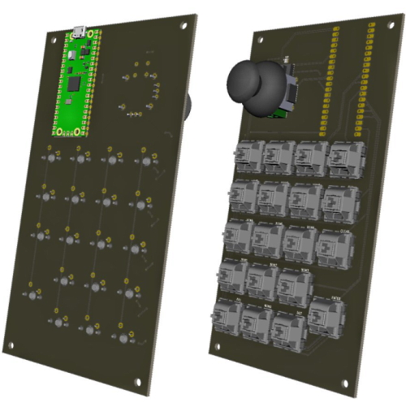](https://twitter.com/bradanlane/status/1484599607569100805)

> YAMP (yet another macro pad) - a Raspberry Pi Pico with MicroPython. I need it for my Neoden S1 - which has a "less than zippy touch screen". Th keypad provides a mouse, numerical keypad, and 4 extra keys - [Twitter](https://twitter.com/bradanlane/status/1484599607569100805).

A configurable hardware key pad to control Pycharm - Stream Deck + PyCharm - [YouTube](https://youtu.be/yaPer4f1QgM) via [Twitter](https://twitter.com/mkennedy/status/1483586341786963968).

Sending pictures to Grandma via a Raspberry Pi Zero, Python, and an Adafruit Thermal Printer - [Hackaday](https://hackaday.com/2022/01/21/sending-pics-to-grandma-no-smartphone-needed/) and [GitHub](https://github-com.translate.goog/palmerabollo/ludivina?_x_tr_sl=pt&_x_tr_tl=en&_x_tr_hl=en-GB&_x_tr_pto=wapp), via [Twitter](https://twitter.com/palmerabollo/status/1480599629272129541) (Spanish).

10 Python IDEs Every Programmer Should Know - [Muo](https://www.makeuseof.com/python-ides-every-programmer-should-know/).

4 functions for any customer analytics project in Python - [towards dev](https://towardsdev.com/4-functions-for-any-customer-analytics-project-in-python-1c4fbc54f895).

CircuitPython Weekly Meeting for January 18, 2022 ([notes](https://github.com/adafruit/adafruit-circuitpython-weekly-meeting/blob/main/2022/2022-01-18.md)) [on YouTube](https://youtu.be/iYYlf2TH9oo)

#ICYDNCI What was the most popular, most clicked link, in [last week's newsletter](https://www.adafruitdaily.com/2022/01/18/python-on-microcontrollers-newsletter-new-releases-of-micropython-and-circuitpython-and-more-python-circuitpython-micropython-thepsf/)? [PyFlow visual scripting framework](https://github.com/wonderworks-software/PyFlow).

## Coming soon

[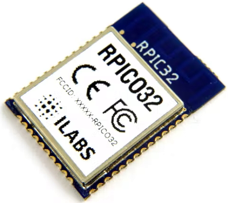](https://www.hackster.io/news/invector-labs-unveils-the-rpico32-module-and-carrier-pledges-arduino-and-circuitpython-support-719b8273cfc9)

Invector Labs Unveils the RPICO32 Module and Carrier, Pledges Arduino and CircuitPython Support - [hackster.io](https://www.hackster.io/news/invector-labs-unveils-the-rpico32-module-and-carrier-pledges-arduino-and-circuitpython-support-719b8273cfc9).

text - [site](url).

## New Boards Supported by CircuitPython

The number of supported microcontrollers and Single Board Computers (SBC) grows every week. This section outlines which boards have been included in CircuitPython or added to [CircuitPython.org](https://circuitpython.org/).

This week, there were (#/no) new boards added!

- [Board name](url)
- [Board name](url)
- [Board name](url)

*Note: For non-Adafruit boards, please use the support forums of the board manufacturer for assistance, as Adafruit does not have the hardware to assist in troubleshooting.*

Looking to add a new board to CircuitPython? It's highly encouraged! Adafruit has four guides to help you do so:

- [How to Add a New Board to CircuitPython](https://learn.adafruit.com/how-to-add-a-new-board-to-circuitpython/overview)
- [How to add a New Board to the circuitpython.org website](https://learn.adafruit.com/how-to-add-a-new-board-to-the-circuitpython-org-website)
- [Adding a Single Board Computer to PlatformDetect for Blinka](https://learn.adafruit.com/adding-a-single-board-computer-to-platformdetect-for-blinka)
- [Adding a Single Board Computer to Blinka](https://learn.adafruit.com/adding-a-single-board-computer-to-blinka)

## New Learn Guides!

[Adafruit ESP32-S2 TFT Feather](https://learn.adafruit.com/adafruit-esp32-s2-tft-feather) from [Kattni](https://learn.adafruit.com/users/kattni)

## CircuitPython Libraries!

CircuitPython support for hardware continues to grow. We are adding support for new sensors and breakouts all the time, as well as improving on the drivers we already have. As we add more libraries and update current ones, you can keep up with all the changes right here!

For the latest libraries, download the [Adafruit CircuitPython Library Bundle](https://circuitpython.org/libraries). For the latest community contributed libraries, download the [CircuitPython Community Bundle](https://github.com/adafruit/CircuitPython_Community_Bundle/releases).

If you'd like to contribute, CircuitPython libraries are a great place to start. Have an idea for a new driver? File an issue on [CircuitPython](https://github.com/adafruit/circuitpython/issues)! Have you written a library you'd like to make available? Submit it to the [CircuitPython Community Bundle](https://github.com/adafruit/CircuitPython_Community_Bundle). Interested in helping with current libraries? Check out the [CircuitPython.org Contributing page](https://circuitpython.org/contributing). We've included open pull requests and issues from the libraries, and details about repo-level issues that need to be addressed. We have a guide on [contributing to CircuitPython with Git and Github](https://learn.adafruit.com/contribute-to-circuitpython-with-git-and-github) if you need help getting started. You can also find us in the #circuitpython channels on the [Adafruit Discord](https://adafru.it/discord).

You can check out this [list of all the Adafruit CircuitPython libraries and drivers available](https://github.com/adafruit/Adafruit_CircuitPython_Bundle/blob/master/circuitpython_library_list.md). 

The current number of CircuitPython libraries is **344**!

**Updated Libraries!**

Here's this week's updated CircuitPython libraries:

 * [Adafruit_CircuitPython_asyncio](https://github.com/adafruit/Adafruit_CircuitPython_asyncio)
 * [Adafruit_CircuitPython_FunHouse](https://github.com/adafruit/Adafruit_CircuitPython_FunHouse)
 * [Adafruit_CircuitPython_BLE](https://github.com/adafruit/Adafruit_CircuitPython_BLE)
 * [Adafruit_CircuitPython_CursorControl](https://github.com/adafruit/Adafruit_CircuitPython_CursorControl)
 * [Adafruit_CircuitPython_MiniMQTT](https://github.com/adafruit/Adafruit_CircuitPython_MiniMQTT)
 * [Adafruit_CircuitPython_DRV2605](https://github.com/adafruit/Adafruit_CircuitPython_DRV2605)
 * [Adafruit_CircuitPython_FRAM](https://github.com/adafruit/Adafruit_CircuitPython_FRAM)
 * [Adafruit_CircuitPython_PIOASM](https://github.com/adafruit/Adafruit_CircuitPython_PIOASM)
 * [Adafruit_CircuitPython_ESP32SPI](https://github.com/adafruit/Adafruit_CircuitPython_ESP32SPI)
 * [Adafruit_CircuitPython_hashlib](https://github.com/adafruit/Adafruit_CircuitPython_hashlib)
 * [Adafruit_CircuitPython_HT16K33](https://github.com/adafruit/Adafruit_CircuitPython_HT16K33)
 * [Adafruit_CircuitPython_MAX31865](https://github.com/adafruit/Adafruit_CircuitPython_MAX31865)
 * [Adafruit_CircuitPython_Bitmap_Font](https://github.com/adafruit/Adafruit_CircuitPython_Bitmap_Font)
 * [Adafruit_CircuitPython_PyPortal](https://github.com/adafruit/Adafruit_CircuitPython_PyPortal)
 * [circuitpython](https://github.com/adafruit/circuitpython)
 * [Adafruit_Blinka](https://github.com/adafruit/Adafruit_Blinka)
 * [Adafruit_Python_PlatformDetect](https://github.com/adafruit/Adafruit_Python_PlatformDetect)

## What’s the team up to this week?

What is the team up to this week? Let’s check in!

**Dan**

text

**Jeff**

text

**Kattni**

text

**Melissa**

text

**Scott**

text

## Upcoming events!

The next MicroPython Meetup in Melbourne will be on January 26th – [Meetup](https://www.meetup.com/MicroPython-Meetup/).  See the [blog](https://melbournemicropythonmeetup.github.io/) for past notes.

PyCascades is a regional PyCon in the Pacific Northwest, celebrating the west coast Python developer and user community. Our organizing team includes members of the Vancouver, Seattle, and Portland Python user groups. DATES ANNOUNCED! February 5th-6th, 2022 The conference will take place on Saturday and the first half of Sunday, with the post-conference sprints following that on Sunday afternoon. After three amazing in-person conferences and an engaging online conference, we are ready to do it again! - [PyCascades 2022](https://2022.pycascades.com/).

PyCon US 2022 planning is underway. The team is planning to host the event in person with an online component. April 27, 2022 - May 5, 2022. Head over to the [PyCon US 2022 website](https://us.pycon.org/2022/) for details about the conference and more information about the sponsorship program - [PyCon Blog](https://pycon.blogspot.com/2022/10/pycon-us-2022-website-and-sponsorship.html).

PyCon Italia is the Italian conference on Python. Organised by Python Italia, it is one of the more important Python conferences in Europe. With over 700 attendees, the next edition will be June 2-5, 2022 - [Ticket Registration](https://pycon.it/en/tickets).

**Send Your Events In**

As for other events, with the COVID pandemic, most in-person events are postponed or cancelled. If you know of virtual events or events that may occur in the future, please let us know on Twitter with hashtag #CircuitPython or email to cpnews(at)adafruit(dot)com.

## Latest releases

CircuitPython's stable release is [#.#.#](https://github.com/adafruit/circuitpython/releases/latest) and its unstable release is [#.#.#-##.#](https://github.com/adafruit/circuitpython/releases). New to CircuitPython? Start with our [Welcome to CircuitPython Guide](https://learn.adafruit.com/welcome-to-circuitpython).

[2022####](https://github.com/adafruit/Adafruit_CircuitPython_Bundle/releases/latest) is the latest CircuitPython library bundle.

[v#.#.#](https://micropython.org/download) is the latest MicroPython release. Documentation for it is [here](http://docs.micropython.org/en/latest/pyboard/).

[#.#.#](https://www.python.org/downloads/) is the latest Python release. The latest pre-release version is [#.#.#](https://www.python.org/download/pre-releases/).

[#### Stars](https://github.com/adafruit/circuitpython/stargazers) Like CircuitPython? [Star it on GitHub!](https://github.com/adafruit/circuitpython)

## Call for help -- Translating CircuitPython is now easier than ever!

[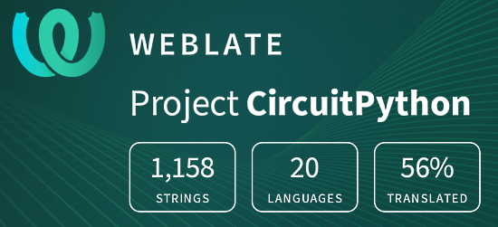](https://hosted.weblate.org/engage/circuitpython/)

One important feature of CircuitPython is translated control and error messages. With the help of fellow open source project [Weblate](https://weblate.org/), we're making it even easier to add or improve translations. 

Sign in with an existing account such as GitHub, Google or Facebook and start contributing through a simple web interface. No forks or pull requests needed! As always, if you run into trouble join us on [Discord](https://adafru.it/discord), we're here to help.

## jobs.adafruit.com - Find a dream job, find great candidates!

[jobs.adafruit.com](https://jobs.adafruit.com/) has returned and folks are posting their skills (including CircuitPython) and companies are looking for talented makers to join their companies - from Digi-Key, to Hackaday, Micro Center, Raspberry Pi and more.

**Job of the Week**

text - [Adafruit Jobs Board](https://jobs.adafruit.com/).

## NUMBER thanks!

The Adafruit Discord community, where we do all our CircuitPython development in the open, reached over NUMBER humans - thank you!  Adafruit believes Discord offers a unique way for Python on hardware folks to connect. Join today at [https://adafru.it/discord](https://adafru.it/discord).

## ICYMI - In case you missed it

Python on hardware is the Adafruit Python video-newsletter-podcast! The news comes from the Python community, Discord, Adafruit communities and more and is broadcast on ASK an ENGINEER Wednesdays. The complete Python on Hardware weekly videocast [playlist is here](https://www.youtube.com/playlist?list=PLjF7R1fz_OOXRMjM7Sm0J2Xt6H81TdDev). The video podcast is on [iTunes](https://itunes.apple.com/us/podcast/python-on-hardware/id1451685192?mt=2), [YouTube](http://adafru.it/pohepisodes), [IGTV (Instagram TV](https://www.instagram.com/adafruit/channel/)), and [XML](https://itunes.apple.com/us/podcast/python-on-hardware/id1451685192?mt=2).

[The weekly community chat on Adafruit Discord server CircuitPython channel - Audio / Podcast edition](https://itunes.apple.com/us/podcast/circuitpython-weekly-meeting/id1451685016) - Audio from the Discord chat space for CircuitPython, meetings are usually Mondays at 2pm ET, this is the audio version on [iTunes](https://itunes.apple.com/us/podcast/circuitpython-weekly-meeting/id1451685016), Pocket Casts, [Spotify](https://adafru.it/spotify), and [XML feed](https://adafruit-podcasts.s3.amazonaws.com/circuitpython_weekly_meeting/audio-podcast.xml).

## Codecademy "Learn Hardware Programming with CircuitPython"

Codecademy, an online interactive learning platform used by more than 45 million people, has teamed up with Adafruit to create a coding course, “Learn Hardware Programming with CircuitPython”. The course is now available in the [Codecademy catalog](https://www.codecademy.com/learn/learn-circuitpython?utm_source=adafruit&utm_medium=partners&utm_campaign=circuitplayground&utm_content=pythononhardwarenewsletter).

## Contribute!

The CircuitPython Weekly Newsletter is a CircuitPython community-run newsletter emailed every Tuesday. The complete [archives are here](https://www.adafruitdaily.com/category/circuitpython/). It highlights the latest CircuitPython related news from around the web including Python and MicroPython developments. To contribute, edit next week's draft [on GitHub](https://github.com/adafruit/circuitpython-weekly-newsletter/tree/gh-pages/_drafts) and [submit a pull request](https://help.github.com/articles/editing-files-in-your-repository/) with the changes. You may also tag your information on Twitter with #CircuitPython. 

Join the Adafruit [Discord](https://adafru.it/discord) or [post to the forum](https://forums.adafruit.com/viewforum.php?f=60) if you have questions.
