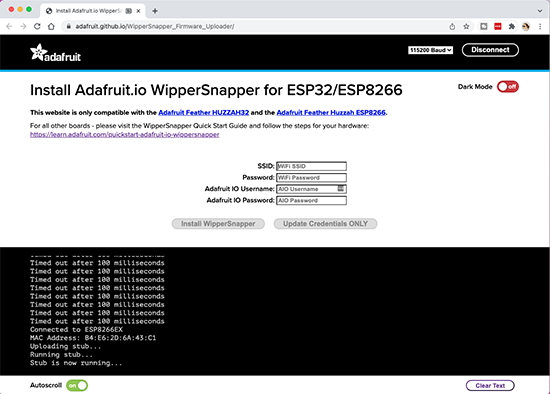

- [X] Kattni updates
- [ ] change date
- [ ] update title
- [ ] Feature story
- [ ] Update  for images
- [ ] Update ICYDNCI
- [ ] All images 550w max only
- [ ] Link "View this email in your browser."

News Sources

- [python.org](https://www.python.org/)
- [Python Insider - dev team blog](https://pythoninsider.blogspot.com/)
- [MicroPython Meetup Blog](https://melbournemicropythonmeetup.github.io/)
- [hackaday.io newest projects MicroPython](https://hackaday.io/projects?tag=micropython&sort=date) and [CircuitPython](https://hackaday.io/projects?tag=circuitpython&sort=date)
- [hackaday CircuitPython](https://hackaday.com/blog/?s=circuitpython) and [MicroPython](https://hackaday.com/blog/?s=micropython)
- [hackster.io CircuitPython](https://www.hackster.io/search?q=circuitpython&i=projects&sort_by=most_recent) and [MicroPython](https://www.hackster.io/search?q=micropython&i=projects&sort_by=most_recent)

View this email in your browser.

Welcome to the latest Python on Microcontrollers newsletter! 

We're on [Discord](https://discord.gg/HYqvREz), [Twitter](https://twitter.com/search?q=circuitpython&src=typed_query&f=live), and for past newsletters - [view them all here](https://www.adafruitdaily.com/category/circuitpython/). If you're reading this on the web, [subscribe here](https://www.adafruitdaily.com/). Here's the news this week:

## 500 Adafruit Projects Have Been Certified as Open Source by OSHWA

Adafruit is an Open Source Hardware and Software company. To that end, Adafruit has been working to submit many of their boards for certification by the Open Source Hardware Association. According to OSHWA:

> The certification program exists to make it easy for creators and users to identify hardware that follows the community definition of open source hardware maintained by OSHWA. Hardware projects that display the certification logo are licensed and documented in a way that makes it easy for users to use and build upon them.

On February 7th, Adafruit hit the milestone of 500 certified projects and was the first to reach this number. By registering their boards with OSHWA, Adafruit aims to ensure users that the products they sell are open-source, and easy to learn about.

Adafruit extends a special thank you to everyone who made this possible, but especially the wonderful folks over at OSHWA who set all this up and were incredibly helpful throughout this process. Additionally, they thank the community that keeps this all going and encourages them to publish, share, and more! - [Adafruit Blog](https://blog.adafruit.com/2022/02/07/500-adafruit-projects-have-been-certified-as-open-source-by-oshwa/).

## CircuitPython 7.2.0 Alpha 2 Released

CircuitPython 7.2.0-alpha.2 was released this week. It is the second published alpha release for CircuitPython 7.2.0. It is relatively stable, but there will be further additions and fixes before final release - [GitHub](https://github.com/adafruit/circuitpython/releases).

## Feature

text - [site](url).

## Sensor Watch on Crowd Supply is CircuitPython Compatible

text - [Crowdsupply](https://www.crowdsupply.com/oddly-specific-objects/sensor-watch).

## CircuitPython Deep Dive Stream with Scott Shawcroft

[This week](link), Scott streams his work on .

You can see the latest video and past videos on the Adafruit YouTube channel under the Deep Dive playlist - [YouTube](https://www.youtube.com/playlist?list=PLjF7R1fz_OOXBHlu9msoXq2jQN4JpCk8A).

## CircuitPython Parsec

John Park’s CircuitPython Parsec: 

* episode - [Adafruit Blog](url)

Catch all the episodes in the [YouTube playlist](https://www.youtube.com/playlist?list=PLjF7R1fz_OOWFqZfqW9jlvQSIUmwn9lWr).

## The CircuitPython Show

The CircuitPython Show is a new independent podcast, hosted by Paul Cutler, focused on the people doing awesome things with CircuitPython. Each episode features Paul in conversation with a guest for a twenty to thirty minute interview – [CircuitPythonShow](https://circuitpythonshow.com/), [Blog Post](https://paulcutler.org/posts/2022/01/introducing-the-circuitpython-show/) and [Twitter](https://twitter.com/circuitpyshow).

Listen to the Season 1 Trailer now - [CircuitPython Show](https://circuitpythonshow.com/episodes/0/trailer)

The first episode is scheduled to air on March 1st and will feature an interview with Kattni
Rembor as the first guest.

## Project of the Week

text - [site](url).

## News from around the web!

text - [site](url).

text - [site](url).

text - [site](url).

text - [site](url).

text - [site](url).

text - [site](url).

text - [site](url).

text - [site](url).

text - [site](url).

text - [site](url).

text - [site](url).

text - [site](url).

text - [site](url).

text - [site](url).

text - [site](url).

text - [site](url).

text - [site](url).

text - [site](url).

text - [site](url).

text - [site](url).

PyDev of the Week:

CircuitPython Weekly Meeting for 

**#ICYDNCI What was the most popular, most clicked link, in [last week's newsletter](https://link)? [title](url).**

## Coming soon

text - [site](url).

text - [site](url).

## New Boards Supported by CircuitPython

The number of supported microcontrollers and Single Board Computers (SBC) grows every week. This section outlines which boards have been included in CircuitPython or added to [CircuitPython.org](https://circuitpython.org/).

This week, there were (#/no) new boards added!

- [Board name](url)
- [Board name](url)
- [Board name](url)

*Note: For non-Adafruit boards, please use the support forums of the board manufacturer for assistance, as Adafruit does not have the hardware to assist in troubleshooting.*

Looking to add a new board to CircuitPython? It's highly encouraged! Adafruit has four guides to help you do so:

- [How to Add a New Board to CircuitPython](https://learn.adafruit.com/how-to-add-a-new-board-to-circuitpython/overview)
- [How to add a New Board to the circuitpython.org website](https://learn.adafruit.com/how-to-add-a-new-board-to-the-circuitpython-org-website)
- [Adding a Single Board Computer to PlatformDetect for Blinka](https://learn.adafruit.com/adding-a-single-board-computer-to-platformdetect-for-blinka)
- [Adding a Single Board Computer to Blinka](https://learn.adafruit.com/adding-a-single-board-computer-to-blinka)

## New Learn Guides!

[Rotary Phone Dial Keypad](https://learn.adafruit.com/rotary-phone-dial-keypad) from [John Park](https://learn.adafruit.com/users/johnpark)

[Three Button Foot Switch](https://learn.adafruit.com/three-button-foot-switch) from [Noe and Pedro](https://learn.adafruit.com/users/pixil3d)

[PB Gherkin 30% keyboard with KMK, CircuitPython, & KB2040](https://learn.adafruit.com/pb-gherkhin-30-keyboard-with-kmk-circuitpython-kb2040) from [Eva Herrada](https://learn.adafruit.com/users/eherrada)

## CircuitPython Libraries!

CircuitPython support for hardware continues to grow. We are adding support for new sensors and breakouts all the time, as well as improving on the drivers we already have. As we add more libraries and update current ones, you can keep up with all the changes right here!

For the latest libraries, download the [Adafruit CircuitPython Library Bundle](https://circuitpython.org/libraries). For the latest community contributed libraries, download the [CircuitPython Community Bundle](https://github.com/adafruit/CircuitPython_Community_Bundle/releases).

If you'd like to contribute, CircuitPython libraries are a great place to start. Have an idea for a new driver? File an issue on [CircuitPython](https://github.com/adafruit/circuitpython/issues)! Have you written a library you'd like to make available? Submit it to the [CircuitPython Community Bundle](https://github.com/adafruit/CircuitPython_Community_Bundle). Interested in helping with current libraries? Check out the [CircuitPython.org Contributing page](https://circuitpython.org/contributing). We've included open pull requests and issues from the libraries, and details about repo-level issues that need to be addressed. We have a guide on [contributing to CircuitPython with Git and Github](https://learn.adafruit.com/contribute-to-circuitpython-with-git-and-github) if you need help getting started. You can also find us in the #circuitpython channels on the [Adafruit Discord](https://adafru.it/discord).

You can check out this [list of all the Adafruit CircuitPython libraries and drivers available](https://github.com/adafruit/Adafruit_CircuitPython_Bundle/blob/master/circuitpython_library_list.md). 

The current number of CircuitPython libraries is **344**!

**New Libraries!**

Here's this week's new CircuitPython libraries:

 * [Adafruit_CircuitPython_HTTPServer](https://github.com/adafruit/Adafruit_CircuitPython_HTTPServer)

**Updated Libraries!**

This week's updated libraries are too many to list!

## What’s the team up to this week?

What is the team up to this week? Let’s check in!

**Dan**

I am continuing to look at asyncio support for HTTP clients (and potentially servers). I have looked at several async HTTP client libraries. Most have quite similar API's. I am leaning toward writing a simple one that does not mimic one of these exactly, but is still very similar.

For another small project, mentioned last week, I wrote a [simple HTTP server library](https://github.com/adafruit/Adafruit_CircuitPython_HTTPServer) that runs on CircuitPython and also on CPython.

I released CircuitPython 7.2.0-alpha.2, which has nearly two months of changes.

**Jeff**

I continued work on floppy disks, but now I'm truly getting close to wrapping things up. I'll take a little breather before bringing the latest changes into CircuitPython. What I spent the last week working on was using the RP2040's PIO peripheral to accurately capture & generate the flux waveforms that define how data is stored on floppies. Using CircuitPython it was very easy to test & refine the portion of the software that runs on the PIO mini-CPUs inside the RP2040; much harder, by contrast, was making it all work within the Arduino environment.

**Kattni**

This week I updated the 0.56" LED backpack [guide](https://learn.adafruit.com/adafruit-led-backpack/overview) with the new STEMMA QT rev, as well as the MCP4725 [guide](https://learn.adafruit.com/mcp4725-12-bit-dac-tutorial) for the same. I'm now working on the guide for the ADXL375, a new accelerometer we added to the shop recently. It needed a CircuitPython library which I wrote up and will use in the guide. Keep an eye out for that!

**Melissa**

This past week, I finally worked the last of the bugs out of the LittleFS port. This was packaged up as part of the WipperSnapper Firmware Uploader, which will generate a LittleFS image with a secrets.json file on it and flash the image right onto either an ESP32 or ESP8266. Currently WipperSnapper isn't live for the ESP8266, so other than flashing everything onto it, you can't currently do anything with it, but soon many Feather Huzzah ESP8266 boards will be able to easily be flashed with and configured without needing to write a single line of code.

**Tim**

I have been working on going through all of the open library PRs to review and test them or ping authors as needed. A cool one from this week was a new motion sensing feature for the VC0706 camera device. I had not ever used cameras with CircuitPython before so it was neat to get it set up and learn how to snap photos from it. The motion sensing could be useful as a primitave security camera type setup, only saving photos when motion is sensed in order to maximize the available storage space. 

This week I also wrapped up the code for the PyPortal Winamp player project and have started writing the guide pages for it. Part of that process was generalizing a ScrollingLabel widget that I initially coded for this project and getting it prepared to share in the Display Text library. The new version was recently published with this new displayio [ScrollingLabel](https://github.com/adafruit/Adafruit_CircuitPython_Display_Text/blob/main/adafruit_display_text/scrolling_label.py) widget. The Winamp player project will use it, but it can now also be used by anyone else for other projects as well.

**Scott**

This week I've been working to wrap up BLE GATT client support on the ESP32-S3. As I said last week, I've been somewhat stuck on this, so I'm going to wrap up my pending work and then dig into USB Host support in CircuitPython on the RP2040. [sekigon-gonnoc on GitHub](https://github.com/sekigon-gonnoc/Pico-PIO-USB) has figured out how to use PIO for USB Host which could make the RP2040 a neat USB bridge device. 

I've wanted to start learning USB host to add support to the broadcom port at some point too. This will be a chance to learn it in a simpler system.

## Upcoming events!

The next MicroPython Meetup in Melbourne will be on February 23rd – [Meetup](https://www.meetup.com/MicroPython-Meetup/). See [info](https://twitter.com/matt_trentini/status/1489038649878454273?t=qIcYlRq4vTqpssljyfI71Q&s=03) and the [slides](https://docs.google.com/presentation/d/e/2PACX-1vS8gSjPatIf8LgJD_t1_cglL5FO7jEWDTqy-Lbff3xBA7CskAVy_sM2FjfofILWtIF7atyg5Jx--0Sx/pub?slide=id.p) of the February 2nd meeting.

PyCon US 2022 planning is underway. The team is planning to host the event in person with an online component. April 27, 2022 - May 5, 2022. Head over to the [PyCon US 2022 website](https://us.pycon.org/2022/) for details about the conference and more information about the sponsorship program - [PyCon Blog](https://pycon.blogspot.com/2022/10/pycon-us-2022-website-and-sponsorship.html).

PyCon Italia is the Italian conference on Python. Organised by Python Italia, it is one of the more important Python conferences in Europe. With over 700 attendees, the next edition will be June 2-5, 2022 - [Ticket Registration](https://pycon.it/en/tickets).

SciPy 2022, the 21st annual Scientific Computing with Python conference, will be held in Austin, Texas, USA from July 11-17, 2022. The annual SciPy Conference brings together attendees from industry, academia, and government to showcase their latest projects, learn from skilled users and developers, and collaborate on code development. The full program will consist of 2 days tutorials (July 11-12), 3 days of talks (July 13-15) and 2 days of developer sprints (July 16-17) - [SciPy 2022](https://www.scipy2022.scipy.org/).

**Send Your Events In**

As for other events, with the COVID pandemic, most in-person events are postponed or cancelled. If you know of virtual events or events that may occur in the future, please let us know on Twitter with hashtag #CircuitPython or email to cpnews(at)adafruit(dot)com.

## Latest releases

CircuitPython's stable release is [#.#.#](https://github.com/adafruit/circuitpython/releases/latest) and its unstable release is [#.#.#-##.#](https://github.com/adafruit/circuitpython/releases). New to CircuitPython? Start with our [Welcome to CircuitPython Guide](https://learn.adafruit.com/welcome-to-circuitpython).

[2022####](https://github.com/adafruit/Adafruit_CircuitPython_Bundle/releases/latest) is the latest CircuitPython library bundle.

[v#.#.#](https://micropython.org/download) is the latest MicroPython release. Documentation for it is [here](http://docs.micropython.org/en/latest/pyboard/).

[#.#.#](https://www.python.org/downloads/) is the latest Python release. The latest pre-release version is [#.#.#](https://www.python.org/download/pre-releases/).

[#### Stars](https://github.com/adafruit/circuitpython/stargazers) Like CircuitPython? [Star it on GitHub!](https://github.com/adafruit/circuitpython)

## Call for help -- Translating CircuitPython is now easier than ever!

One important feature of CircuitPython is translated control and error messages. With the help of fellow open source project [Weblate](https://weblate.org/), we're making it even easier to add or improve translations. 

Sign in with an existing account such as GitHub, Google or Facebook and start contributing through a simple web interface. No forks or pull requests needed! As always, if you run into trouble join us on [Discord](https://adafru.it/discord), we're here to help.

## jobs.adafruit.com - Find a dream job, find great candidates!

[jobs.adafruit.com](https://jobs.adafruit.com/) has returned and folks are posting their skills (including CircuitPython) and companies are looking for talented makers to join their companies - from Digi-Key, to Hackaday, Micro Center, Raspberry Pi and more.

**Job of the Week**

text - [Adafruit Jobs Board](https://jobs.adafruit.com/).

## NUMBER thanks!

The Adafruit Discord community, where we do all our CircuitPython development in the open, reached over NUMBER humans - thank you!  Adafruit believes Discord offers a unique way for Python on hardware folks to connect. Join today at [https://adafru.it/discord](https://adafru.it/discord).

## ICYMI - In case you missed it

Python on hardware is the Adafruit Python video-newsletter-podcast! The news comes from the Python community, Discord, Adafruit communities and more and is broadcast on ASK an ENGINEER Wednesdays. The complete Python on Hardware weekly videocast [playlist is here](https://www.youtube.com/playlist?list=PLjF7R1fz_OOXRMjM7Sm0J2Xt6H81TdDev). The video podcast is on [iTunes](https://itunes.apple.com/us/podcast/python-on-hardware/id1451685192?mt=2), [YouTube](http://adafru.it/pohepisodes), [IGTV (Instagram TV](https://www.instagram.com/adafruit/channel/)), and [XML](https://itunes.apple.com/us/podcast/python-on-hardware/id1451685192?mt=2).

[The weekly community chat on Adafruit Discord server CircuitPython channel - Audio / Podcast edition](https://itunes.apple.com/us/podcast/circuitpython-weekly-meeting/id1451685016) - Audio from the Discord chat space for CircuitPython, meetings are usually Mondays at 2pm ET, this is the audio version on [iTunes](https://itunes.apple.com/us/podcast/circuitpython-weekly-meeting/id1451685016), Pocket Casts, [Spotify](https://adafru.it/spotify), and [XML feed](https://adafruit-podcasts.s3.amazonaws.com/circuitpython_weekly_meeting/audio-podcast.xml).

## Codecademy "Learn Hardware Programming with CircuitPython"

Codecademy, an online interactive learning platform used by more than 45 million people, has teamed up with Adafruit to create a coding course, “Learn Hardware Programming with CircuitPython”. The course is now available in the [Codecademy catalog](https://www.codecademy.com/learn/learn-circuitpython?utm_source=adafruit&utm_medium=partners&utm_campaign=circuitplayground&utm_content=pythononhardwarenewsletter).

## Contribute!

The CircuitPython Weekly Newsletter is a CircuitPython community-run newsletter emailed every Tuesday. The complete [archives are here](https://www.adafruitdaily.com/category/circuitpython/). It highlights the latest CircuitPython related news from around the web including Python and MicroPython developments. To contribute, edit next week's draft [on GitHub](https://github.com/adafruit/circuitpython-weekly-newsletter/tree/gh-pages/_drafts) and [submit a pull request](https://help.github.com/articles/editing-files-in-your-repository/) with the changes. You may also tag your information on Twitter with #CircuitPython. 

Join the Adafruit [Discord](https://adafru.it/discord) or [post to the forum](https://forums.adafruit.com/viewforum.php?f=60) if you have questions.

