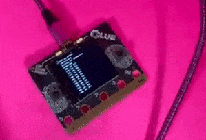
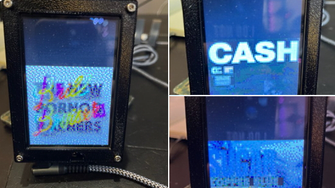
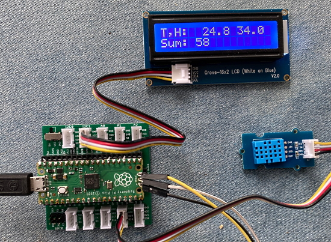
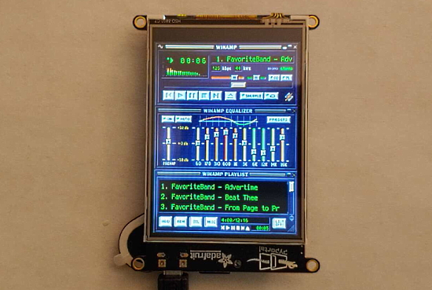

- [ ] Kattni updates
- [ ] change date
- [ ] update title
- [ ] Feature story
- [ ] Update  for images
- [ ] Update ICYDNCI
- [ ] All images 550w max only
- [ ] Link "View this email in your browser."

News Sources

- [python.org](https://www.python.org/)
- [Python Insider - dev team blog](https://pythoninsider.blogspot.com/)
- [MicroPython Meetup Blog](https://melbournemicropythonmeetup.github.io/)
- [hackaday.io newest projects MicroPython](https://hackaday.io/projects?tag=micropython&sort=date) and [CircuitPython](https://hackaday.io/projects?tag=circuitpython&sort=date)
- [hackaday CircuitPython](https://hackaday.com/blog/?s=circuitpython) and [MicroPython](https://hackaday.com/blog/?s=micropython)
- [hackster.io CircuitPython](https://www.hackster.io/search?q=circuitpython&i=projects&sort_by=most_recent) and [MicroPython](https://www.hackster.io/search?q=micropython&i=projects&sort_by=most_recent)

View this email in your browser. **Warning: Flashing Imagery**

Welcome to the latest Python on Microcontrollers newsletter! Lots of great news this week relating to Python - new software releases, new projects and more.

We're on [Discord](https://discord.gg/HYqvREz), [Twitter](https://twitter.com/search?q=circuitpython&src=typed_query&f=live), and for past newsletters - [view them all here](https://www.adafruitdaily.com/category/circuitpython/). If you're reading this on the web, [subscribe here](https://www.adafruitdaily.com/). Here's the news this week:

## The Mu Python Editor version 1.1.1 Stable released

Mu 1.1.1, the latest stable release of the Mu Python Editor is finally available after a lengthy contribution and beta period. So many upgrades and translations - [Adafruit Blog](https://blog.adafruit.com/2022/02/22/the-mu-python-editor-version-1-1-1-stable-released-mu-python-circuitpython-mu/), [Made With Mu Blog](https://madewith.mu/mu/users/2022/02/22/mu-1-1-1.html).

A special Making of Mu video is also available - [YouTube](https://youtu.be/nOMCS_8Bm-E).

## CircuitPython 7.2.0 Released!

CircuitPython 7.2.0, the latest minor revision of CircuitPython, is out as the new stable release.

**Notable additions to 7.2.0 since 7.1.1**
* Continuing work on Raspberry Pi Broadcom board support.
* Espressif ESP32-S3 and ESP32-C3 support, including BLE.
* RP2040 PIO sideset support.
* `board.STEMMA_I2C()` available on all boards with STEMMA connectors.
* `binascii.crc32()`.
* `vectorio.contains()`.
* Turkish translation.

Read more - [Release Notes](), [Documentation](https://circuitpython.readthedocs.io/en/7.2.x/README.html) and [Adafruit Blog](https://blog.adafruit.com/2022/02/24/circuitpython-7-2-0/).

## CPython Bug Reporting Moving to GitHub

As part of a multiyear process, mainline Python (CPython) has slowly been moving its development infrastructure to GitHub. Now the bug tracking component is being migrated, led by Python's developer-in-residence, Łukasz Langa. bugs.python.org will be retired from active service (but live as a read only history) if the migration is successful.

> Langa noted that Python and GitHub were able to learn from the experience of the LLVM project, which migrated from Bugzilla to GitHub Issues back in December. That migration took 21 days, so the hope is that experience will lead to a smoother (and quicker) transition for Python (estimated to be 4 to 7 days).

The intent of of moves is geared toward attracting new developers who are familiar with and comfortable using GitHub.

## Feature

text - [site](url).

## Feature

text - [site](url).

## CircuitPython Deep Dive Stream with Scott Shawcroft

[This week](https://youtu.be/GkAmhqe3m8A), Scott talks more about the new CircuitPython USB Host API.

You can see the latest video and past videos on the Adafruit YouTube channel under the Deep Dive playlist - [YouTube](https://www.youtube.com/playlist?list=PLjF7R1fz_OOXBHlu9msoXq2jQN4JpCk8A).

## CircuitPython Parsec

John Park’s CircuitPython Parsec: 

* episode - [Adafruit Blog](https://blog.adafruit.com/2022/02/25/john-parks-circuitpython-parsec-displayio-movement-adafruit-johnedgarpark-adafruit-circuitpython/) and [YouTube](https://youtu.be/0XEAvn9mHEQ).

Catch all the episodes in the [YouTube playlist](https://www.youtube.com/playlist?list=PLjF7R1fz_OOWFqZfqW9jlvQSIUmwn9lWr).

## The CircuitPython Show

The CircuitPython Show is a new independent podcast, hosted by Paul Cutler, focused on the people doing awesome things with CircuitPython. Each episode features Paul in conversation with a guest for a twenty to thirty minute interview – [CircuitPythonShow](https://circuitpythonshow.com/), [Blog Post](https://paulcutler.org/posts/2022/01/introducing-the-circuitpython-show/) and [Twitter](https://twitter.com/circuitpyshow).

See the playlist - [YouTube](https://www.youtube.com/channel/UCHirrB52sk_jVmm9if-ja1Q).

The first episode is scheduled to air on **March 1st** and will feature an interview with Kattni Rembor as the first guest. Other announced guests include Les Pounder (Tom's Hardware), Professor John Gallaugher (Bostom College), Tod Kurt (Maker), Rose Hooper (Maker), and Scott Shawcroft (CircuitPython Lead Developer) - [Twitter](https://twitter.com/circuitpyshow/status/1496159665914359808).

## Project of the Week

At the Saigon South International School (SSIS), two Sphero RVRs, two VEXRobotics games, two boards (a Raspberry Pi Pico and an Adafruit Metro M4 Express) running the same CircuitPython program. Sensing is done via an HCSR04 Ultrasonic Sensor attached to the front of each vehicle.

Each step of the vehicle's trip uses a different control algorithm from a library - [GitHub](https://github.com/emwdx/rvr_circuitpython) via [Twitter](https://twitter.com/emwdx/status/1496699685591203844).

## News from around the web!

Joey Castillo demonstrates reverse engineering LCD displays. He explains how to drive LCD segments in this manner, providing a CircuitPython example that demonstrates how it's done  - [Hackaday](https://hackaday.com/2022/02/24/remoticon-2021-joey-castillo-teaches-old-lcds-new-tricks/) and [YouTube](https://youtu.be/fhKYbJMW5_U).

Listen to oral history on an old rotary phone - [Raspberry Pi News](https://www.raspberrypi.com/news/listen-to-oral-history-on-an-old-rotary-phone/?mc_cid=2ee5ca4a16&mc_eid=d98a11b1f1).

> Chris took inspiration from Dan Aldred for the Python code. It was fairly simple to link each MP3 recording to a specific phone number once the code dealing with the rotary dial was in place. The rotary dial connects to the Raspberry Pi via the GPIO pins. There’s one pin to manage the “pick up” switch, one to detect the start of dialling, and one that pulses according to the number you’re dialling.

Introduction to Software Development and Coding Challenges for Blind and Low Vision Coders course, including HTML, ARIA, and Python, while using assistive technology (AT) - [American Printing House](https://aph.zoom.us/webinar/register/WN_R70Q9TGgQcyfAf4v85-KQQ) via [Twitter](https://twitter.com/APHfortheBlind/status/1496245167510204416).

NEUTRINO2周年 is a DJ controller that can play Sakanaction's Shin Takarajima endlessly using NEUTRINO and CircuitPython - [Twitter](https://twitter.com/AoyamaProd/status/1496080905081061379).

> Quick little BLE MIDI demo with the CLUE. Got some I-IV-V-I arpeggios going - [Twitter](https://twitter.com/BlitzCityDIY/status/1495890966045208580).

Displaying album art on an Adafruit PyPortal with CircuitPython - [Twitter](https://twitter.com/prcutler/status/1498017999365853198).

> No NE555s on-hand to make an AtariPunkConsole. Created a CircuitPython emulator class for output on one or more PWM-capable pins. Here are two instances producing annoying stereo notes with the traditional Osc Freq and One-Shot Pulse Width controls - [Twitter](https://twitter.com/CedarGroveMakr/status/1497797236763234307) and [YouTube](https://www.youtube.com/watch?v=9WQlkPeqx8w).

A CircuitPython library for an ST7567 display from AliExpress - [Twitter](https://twitter.com/mattk/status/1497979710822760456).

> i was so inspired by [@zackfreedman](https://twitter.com/zackfreedman)'s mirage that I made my own split keeb, custom firmware on CircuitPython and all. I made some customizations for ergonomics, and also made the board symmetric so the left and right half only needed one board design - [Twitter](https://twitter.com/sidneysandbank/status/1497345931242475523).

text - [site](url).

text - [site](url).

text - [site](url).

text - [site](url).

text - [site](url).

Five MicroPython IDEs for ESP32 and ESP8266 - [Raspberry ME](https://www.raspberryme.com/ide-micropython-pour-esp32-et-esp8266/) (French).

The Lilygo T5 4.7-inch E-Paper display supports MicroPython - [AliExpress](https://www.aliexpress.com/item/1005002006058892.html) via MicroPython Meeting Notes.

Adding Assembly Language to MicroPython - [Stephen Smith's Blog](https://smist08.wordpress.com/2022/02/18/adding-assembly-language-to-micropython/) and [MicroPython Docs](https://docs.micropython.org/en/v1.9.3/pyboard/pyboard/tutorial/assembler.html#) via MicroPython Meeting Notes.

text - [site](url).

Guide: Socket Programming in Python - [Real Python](https://realpython.com/python-sockets/) via [Twitter](https://twitter.com/realpython/status/1496141994116194319).

text - [site](url).

PyDev of the Week: Leonardo Giordani from [Mouse vs Python](https://www.blog.pythonlibrary.org/2022/02/21/pydev-of-the-week-leonardo-giordani/)

CircuitPython Weekly Meeting for February 22nd, 2022 [on YouTube](https://youtu.be/XYaNFL5JhNc) and [notes](https://github.com/adafruit/adafruit-circuitpython-weekly-meeting/blob/main/2022/2022-02-22.md) 

#ICYDNCI What was the most popular, most clicked link, in [last week's newsletter](https://www.adafruitdaily.com/2022/02/22/python-on-microcontrollers-newsletter-256-circuitpython-boards-winamp-on-pyportal-and-more-python-circuitpython-micropython-thepsf/)? [PyPortal Winamp MP3 Player](https://learn.adafruit.com/pyportal-winamp-mp3-player).

## Coming Soon

The Bolt Industries Pico 87 keyboard uses a Raspberry Pi Pico microcontroller which is compatible with KMK, a mechanical keyboard firmware that runs on CircuitPython - [Tom's Hardware](https://www.tomshardware.com/news/pico87-raspberry-pi-pico-powered-keyboard) via [Twitter](https://twitter.com/jafrugh/status/1496461309814222858).

Badger 2040 by Pimoroni is a hackable, programmable badge with E Ink display, powered by Raspberry Pi RP2040 is in preorder, program it with C/C++, MicroPython or CircuitPython - [Pimoroni](https://shop.pimoroni.com/products/badger-2040?variant=39752959852627).

## New Boards Supported by CircuitPython

The number of supported microcontrollers and Single Board Computers (SBC) grows every week. This section outlines which boards have been included in CircuitPython or added to [CircuitPython.org](https://circuitpython.org/).

This week, there were (#/no) new boards added!

- [Board name](url)
- [Board name](url)
- [Board name](url)

*Note: For non-Adafruit boards, please use the support forums of the board manufacturer for assistance, as Adafruit does not have the hardware to assist in troubleshooting.*

Looking to add a new board to CircuitPython? It's highly encouraged! Adafruit has four guides to help you do so:

- [How to Add a New Board to CircuitPython](https://learn.adafruit.com/how-to-add-a-new-board-to-circuitpython/overview)
- [How to add a New Board to the circuitpython.org website](https://learn.adafruit.com/how-to-add-a-new-board-to-the-circuitpython-org-website)
- [Adding a Single Board Computer to PlatformDetect for Blinka](https://learn.adafruit.com/adding-a-single-board-computer-to-platformdetect-for-blinka)
- [Adding a Single Board Computer to Blinka](https://learn.adafruit.com/adding-a-single-board-computer-to-blinka)

## New Learn Guides!

[title](url) from [name](url)

[title](url) from [name](url)

[title](url) from [name](url)

## Updated Learn Guides!

[title](url) from [name](url)

## CircuitPython Libraries!

CircuitPython support for hardware continues to grow. We are adding support for new sensors and breakouts all the time, as well as improving on the drivers we already have. As we add more libraries and update current ones, you can keep up with all the changes right here!

For the latest libraries, download the [Adafruit CircuitPython Library Bundle](https://circuitpython.org/libraries). For the latest community contributed libraries, download the [CircuitPython Community Bundle](https://github.com/adafruit/CircuitPython_Community_Bundle/releases).

If you'd like to contribute, CircuitPython libraries are a great place to start. Have an idea for a new driver? File an issue on [CircuitPython](https://github.com/adafruit/circuitpython/issues)! Have you written a library you'd like to make available? Submit it to the [CircuitPython Community Bundle](https://github.com/adafruit/CircuitPython_Community_Bundle). Interested in helping with current libraries? Check out the [CircuitPython.org Contributing page](https://circuitpython.org/contributing). We've included open pull requests and issues from the libraries, and details about repo-level issues that need to be addressed. We have a guide on [contributing to CircuitPython with Git and Github](https://learn.adafruit.com/contribute-to-circuitpython-with-git-and-github) if you need help getting started. You can also find us in the #circuitpython channels on the [Adafruit Discord](https://adafru.it/discord).

You can check out this [list of all the Adafruit CircuitPython libraries and drivers available](https://github.com/adafruit/Adafruit_CircuitPython_Bundle/blob/master/circuitpython_library_list.md). 

The current number of CircuitPython libraries is **###**!

**New Libraries!**

Here's this week's new CircuitPython libraries:

* [library](url)

**Updated Libraries!**

Here's this week's updated CircuitPython libraries:

* [library](url)

## What’s the team up to this week?

What is the team up to this week? Let’s check in!

**Dan**

Last week the CircuitPython team went over the open issues for 7.2.0 and 7.x.x, and did some triage. As of last Thursday, the team has fixed all the remaining 7.2.0 issues, and we are on track for a 7.2.0-rc.0 release.

I did some type annotation infrastructure work, moving `circuitpython_typing` out of `adafruit-blinka` and into its own library. A few type-annotated libraries then needed their dependencies updated. This was partly prelude for my continuing work on an asyncio-enabled HTTP requests library.

**Jeff**

In CircuitPython, I fixed some small issues that resulted from updating with MicroPython 1.18.

In floppy land, I've been working on a short guide that will show how to modify a standard 5.25" PC floppy drive so that (together with software like fluxengine or greaseweazle) it can read the flip side of floppies written on classic 8-bit computers.

**Kattni**

Over the last week, I finished updating the VEML7700 guide with the STEMMA QT revision. I added I2C and TFT examples to the TFT Feather guide. I updated the BNO055 guide to not mention Feather M0 as the library no longer works on M0 boards. I updated some Arduino graphics test code for the TFT Feather, and I put together an Arduino template for boards with a built-in TFT. I'm currently working on CircuitPython and Arduino templates for reading data from the LC709203 battery monitor found on ESP32-S2 boards, as well as a template explaining how to send and receive data from Adafruit IO. Finally, I'll be finishing up the Feather TFT guide; it still needs a number of CircuitPython Essentials pages added. Keep an eye out for the updates!

**Tim**

This week I have done some tweaking in the Winamp skin conversion script, and Winamp player circuitpython code in order to make better use of the larger screen on the PyPortal Titano. The other improvement I'm working on will be allowing it to search for MP3 files automatically on the SDCard if the user has not provided a playlist.json file with their songs in it. The other thing I've got in the works is trying to update the certificates that CircuitPython uses when HTTPS requests are made in order to update the James Webb Telescope project to use a newer more direct data source API.

**Scott**

This week has been a bit short due to the Monday holiday. Last week I did a couple quick bug fixes for the 7.2.0 release and then kept working on USB Host support in CircuitPython.

I'm starting on the iMX RT 1060 because it has two USB peripherals. I've created a TinyUSB demo that uses both and converts HID to CDC. It is in a pull request [here](https://github.com/hathach/tinyusb/pull/1340). This is a good step to get a feel for the TinyUSB API.

I also started brainstorming the CircuitPython API on [my stream last week](https://www.youtube.com/watch?v=iOgwQSAiydM). This week I'll continue brainstorming and start to implement it now that I have the TinyUSB example going.

## Upcoming events!

The next MicroPython Meetup in Melbourne will be on March 23rd – [Meetup](https://www.meetup.com/MicroPython-Meetup/). See the [slides](https://docs.google.com/presentation/d/e/2PACX-1vTKYsLoMCw6NuuwN9DhX0aIx-4npH03FDRp-_Pxs9mX2o9smjQfWyNpOKpV3EhSJPi6vI04YH-Jw6O-/pub?slide=id.p) of the February 23rd meeting.

PyCon US 2022 planning is underway. The event is in-person with an online component. April 27, 2022 - May 5, 2022 in Salt Lake City, Utah USA. Head over to the [PyCon US 2022 website](https://us.pycon.org/2022/) for details about the conference and the schedule (new) - [PyCon Blog](https://pycon.blogspot.com/2022/10/pycon-us-2022-website-and-sponsorship.html).

PyCon Italia is the Italian conference on Python. Organised by Python Italia, it is one of the more important Python conferences in Europe. With over 700 attendees, the next edition will be June 2-5, 2022 - [Ticket Registration](https://pycon.it/en/tickets).

SciPy 2022, the 21st annual Scientific Computing with Python conference, will be held in Austin, Texas, USA from July 11-17, 2022. The annual SciPy Conference brings together attendees from industry, academia, and government to showcase their latest projects, learn from skilled users and developers, and collaborate on code development. The full program will consist of 2 days tutorials (July 11-12), 3 days of talks (July 13-15) and 2 days of developer sprints (July 16-17) - [SciPy 2022](https://www.scipy2022.scipy.org/).

**Send Your Events In**

As for other events, with the COVID pandemic, most in-person events are postponed or cancelled. If you know of virtual events or events that may occur in the future, please let us know on Twitter with hashtag #CircuitPython or email to cpnews(at)adafruit(dot)com.

## Latest releases

CircuitPython's stable release is [#.#.#](https://github.com/adafruit/circuitpython/releases/latest) and its unstable release is [#.#.#-##.#](https://github.com/adafruit/circuitpython/releases). New to CircuitPython? Start with our [Welcome to CircuitPython Guide](https://learn.adafruit.com/welcome-to-circuitpython).

[2022####](https://github.com/adafruit/Adafruit_CircuitPython_Bundle/releases/latest) is the latest CircuitPython library bundle.

[v#.#.#](https://micropython.org/download) is the latest MicroPython release. Documentation for it is [here](http://docs.micropython.org/en/latest/pyboard/).

[#.#.#](https://www.python.org/downloads/) is the latest Python release. The latest pre-release version is [#.#.#](https://www.python.org/download/pre-releases/).

[#### Stars](https://github.com/adafruit/circuitpython/stargazers) Like CircuitPython? [Star it on GitHub!](https://github.com/adafruit/circuitpython)

## Help us translate CircuitPython into other languages!

One important feature of CircuitPython is translated control and error messages. With the help of fellow open source project [Weblate](https://weblate.org/), we're making it even easier to add or improve translations. 

Sign in with an existing account such as GitHub, Google or Facebook and start contributing through a simple web interface. No forks or pull requests needed! As always, if you run into trouble join us on [Discord](https://adafru.it/discord), we're here to help.

## jobs.adafruit.com - Find a dream job, find great candidates!

[jobs.adafruit.com](https://jobs.adafruit.com/) has returned and folks are posting their skills (including CircuitPython) and companies are looking for talented makers to join their companies - from Digi-Key, to Hackaday, Micro Center, Raspberry Pi and more.

## 33,380 thanks!

The Adafruit Discord community, where we do all our CircuitPython development in the open, reached over 33,380 humans - thank you!  Adafruit believes Discord offers a unique way for Python on hardware folks to connect. Join today at [https://adafru.it/discord](https://adafru.it/discord).

## ICYMI - In case you missed it

Python on hardware is the Adafruit Python video-newsletter-podcast! The news comes from the Python community, Discord, Adafruit communities and more and is broadcast on ASK an ENGINEER Wednesdays. The complete Python on Hardware weekly videocast [playlist is here](https://www.youtube.com/playlist?list=PLjF7R1fz_OOXRMjM7Sm0J2Xt6H81TdDev). The video podcast is on [iTunes](https://itunes.apple.com/us/podcast/python-on-hardware/id1451685192?mt=2), [YouTube](http://adafru.it/pohepisodes), [IGTV (Instagram TV](https://www.instagram.com/adafruit/channel/)), and [XML](https://itunes.apple.com/us/podcast/python-on-hardware/id1451685192?mt=2).

[The weekly community chat on Adafruit Discord server CircuitPython channel - Audio / Podcast edition](https://itunes.apple.com/us/podcast/circuitpython-weekly-meeting/id1451685016) - Audio from the Discord chat space for CircuitPython, meetings are usually Mondays at 2pm ET, this is the audio version on [iTunes](https://itunes.apple.com/us/podcast/circuitpython-weekly-meeting/id1451685016), Pocket Casts, [Spotify](https://adafru.it/spotify), and [XML feed](https://adafruit-podcasts.s3.amazonaws.com/circuitpython_weekly_meeting/audio-podcast.xml).

## Codecademy "Learn Hardware Programming with CircuitPython"

Codecademy, an online interactive learning platform used by more than 45 million people, has teamed up with Adafruit to create a coding course, “Learn Hardware Programming with CircuitPython”. The course is now available in the [Codecademy catalog](https://www.codecademy.com/learn/learn-circuitpython?utm_source=adafruit&utm_medium=partners&utm_campaign=circuitplayground&utm_content=pythononhardwarenewsletter).

## Contribute!

The CircuitPython Weekly Newsletter is a CircuitPython community-run newsletter emailed every Tuesday. The complete [archives are here](https://www.adafruitdaily.com/category/circuitpython/). It highlights the latest CircuitPython related news from around the web including Python and MicroPython developments. To contribute, edit next week's draft [on GitHub](https://github.com/adafruit/circuitpython-weekly-newsletter/tree/gh-pages/_drafts) and [submit a pull request](https://help.github.com/articles/editing-files-in-your-repository/) with the changes. You may also tag your information on Twitter with #CircuitPython. 

Join the Adafruit [Discord](https://adafru.it/discord) or [post to the forum](https://forums.adafruit.com/viewforum.php?f=60) if you have questions.
