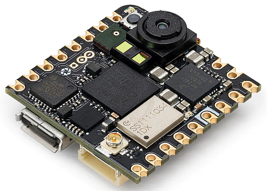
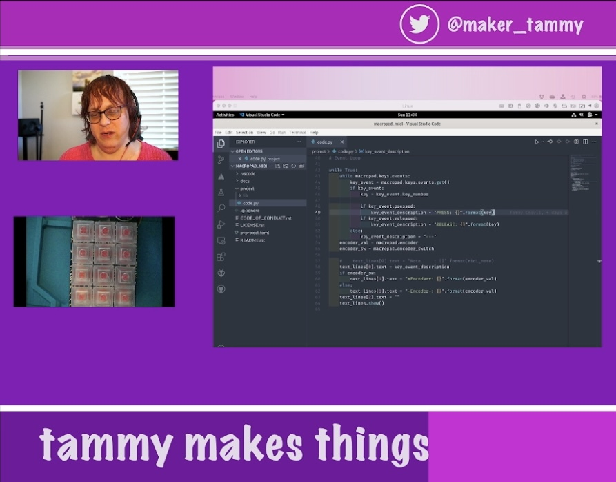
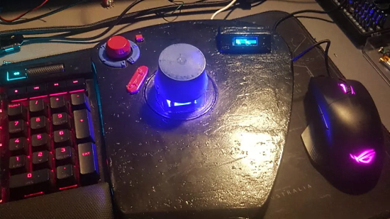
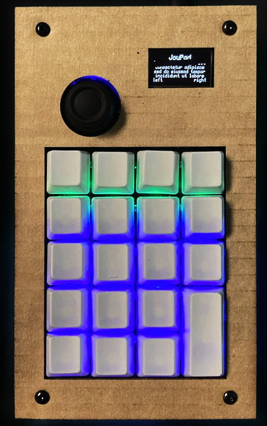
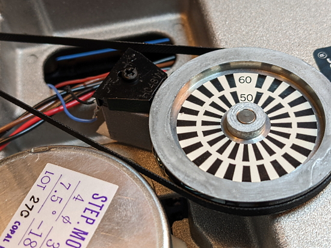

- [X] Kattni updates
- [ ] change date
- [ ] update title
- [ ] Feature story
- [ ] Update  for images
- [ ] Update ICYDNCI
- [ ] All images 550w max only
- [ ] Link "View this email in your browser."

News Sources

- [python.org](https://www.python.org/)
- [Python Insider - dev team blog](https://pythoninsider.blogspot.com/)
- [MicroPython Meetup Blog](https://melbournemicropythonmeetup.github.io/)
- [hackaday.io newest projects MicroPython](https://hackaday.io/projects?tag=micropython&sort=date) and [CircuitPython](https://hackaday.io/projects?tag=circuitpython&sort=date)
- [hackaday CircuitPython](https://hackaday.com/blog/?s=circuitpython) and [MicroPython](https://hackaday.com/blog/?s=micropython)
- [hackster.io CircuitPython](https://www.hackster.io/search?q=circuitpython&i=projects&sort_by=most_recent) and [MicroPython](https://www.hackster.io/search?q=micropython&i=projects&sort_by=most_recent)

View this email in your browser. **Warning: Flashing Imagery**

Welcome to the latest Python on Microcontrollers newsletter! 

We're on [Discord](https://discord.gg/HYqvREz), [Twitter](https://twitter.com/search?q=circuitpython&src=typed_query&f=live), and for past newsletters - [view them all here](https://www.adafruitdaily.com/category/circuitpython/). If you're reading this on the web, [subscribe here](https://www.adafruitdaily.com/). Here's the news this week:

## Headline Article

text - [site](url).

## Feature

text - [site](url).

## Feature

text - [site](url).

## New Arduino Nicla Vision 

The new Arduino Nicla Vision is a ready-to-use 2MP standalone camera that lets you analyze and process images on the edge for advanced machine vision and edge computing applications. It is listed as Python and Arduino compatible. It integrates with OpenMV, supports MicroPython and features WiFi and Bluetooth Low Energy connectivity - [Arduino Article](https://blog.arduino.cc/2022/03/08/meet-the-nicla-vision-love-at-first-sight/) and [Store](https://store-usa.arduino.cc/products/nicla-vision), via [Twitter](https://twitter.com/mbanzi/status/1501244685452558342).

## Anne Barela on the Python Bytes Stream

text - [site](url).

## This Week's Python Streams

### CircuitPython Deep Dive Stream

[This week](link), Scott streams his work on .

You can see the latest video and past videos on the Adafruit YouTube channel under the Deep Dive playlist - [YouTube](https://www.youtube.com/playlist?list=PLjF7R1fz_OOXBHlu9msoXq2jQN4JpCk8A).

### CircuitPython Parsec

John Park’s CircuitPython Parsec this week is on {subject} - [Adafruit Blog](url) and [YouTube]().

Catch all the episodes in the [YouTube playlist](https://www.youtube.com/playlist?list=PLjF7R1fz_OOWFqZfqW9jlvQSIUmwn9lWr).

### The CircuitPython Show

The CircuitPython Show is a new independent podcast, hosted by Paul Cutler, focusing on the people doing awesome things with CircuitPython. Each episode features Paul in conversation with a guest for a twenty to thirty minute interview – [CircuitPythonShow](https://circuitpythonshow.com/), [Blog Post](https://paulcutler.org/posts/2022/01/introducing-the-circuitpython-show/) and [Twitter](https://twitter.com/circuitpyshow).

The second episode aired on March 8th featuring an interview with Les Pounder. The third episode airs today March 15th with Professor John Gallaugher (above) – [Show List](https://twitter.com/circuitpyshow).

### TammyMakesThings is Streaming CircuitPython

Community member and CircuitPython contributor [Tammy Cravit](https://github.com/tammymakesthings) is streaming on Twitch. Her stream focuses on electronics, coding and making, with a focus on CircuitPython. The first few streams have been working on a [MacroPad](https://adafruit.com/product/5128)-based MIDI controller, and she's got lots of other project ideas in the works. An exact schedule for her streams is still being worked out, but she's targeting 2-3 streams per week. Check it out and follow now to be notified of future streams.

### Jeff and Melissa Speak at the Dublin Linux Developers Meetup

As promised last week, here is the video recorded of Adafruit folks Jeff and Melissa discussing CircuitPython, Python, and Linux a few days ago - [YouTube](https://www.youtube.com/watch?v=B7gYtZ1giOc).

## Project of the Week

text - [site](url).

## News from around the web!

A Raspberry Pi Pico-powered 3D mouse with CircuitPython - [Tom's Hardware](https://www.tomshardware.com/news/raspberry-pi-pico-3d-mouse) and [GitHub](https://github.com/faultyDaantje/Raspberry-pi-space-mouse).

A pseudo-“Linux” has been written in CircuitPython for the Raspberry Pi Pico - [Adafruit Blog](https://blog.adafruit.com/2022/03/10/linux-written-in-python-for-the-raspberry-pi-pico-circuitpython-linux-python-bill88t/) and [GitHub](https://github.com/bill88t/ljinux/tree/main/LjinuxRoot).

> Spent the day object-ifying the JoyPad. The end user's http://code.py will now be clean and simple! Create an instance of JoyPad() and then just process key events in the "while True:" loop. The code also detects missing libraries and provides links! - [Twitter](https://twitter.com/bradanlane/status/1501339037331869709).

ampule is a tiny HTTP server made for CircuitPython WiFi devices - [GitHub](https://github.com/deckerego/ampule).

text - [site](url).

text - [site](url).

text - [site](url).

text - [site](url).

pipkin is a tool for installing distribution packages for MicroPython and CircuitPython - [GitHub](https://github.com/aivarannamaa/pipkin).

text - [site](url).

text - [site](url).

text - [site](url).

text - [site](url).

text - [site](url).

text - [site](url).

MicroFlow: running TensorFlow models on Arduino microcontrollers - [Adafruit Blog](https://blog.adafruit.com/2022/03/10/running-tensorflow-models-on-arduino-microcontrollers-arduino-tensorflow/) and [GitHub](https://github.com/Bobingstern/MicroFlow).

The Apoca-pi Now is a luggable, rugged, EMP-proof Raspberry Pi Portable - [hackster.io](https://www.hackster.io/news/the-apoca-pi-now-is-a-luggable-rugged-emp-proof-raspberry-pi-portable-a7f51b294360) and [Reddit](https://www.reddit.com/r/cyberDeck/comments/t7o4z4/apocapi_now/), via [Twitter](https://twitter.com/Hacksterio/status/1501224131534426115).

text - [site](url).

Did you know that there are multiple implementations of the Python programming language? - [Twitter Thread](https://twitter.com/driscollis/status/1501258207108476928?t=8evYXdmbxeid95pBsaQu_A&s=03) and [python.org](https://www.python.org/download/alternatives/).

text - [site](url).

PyDev of the Week:

CircuitPython Weekly Meeting for 

**#ICYDNCI What was the most popular, most clicked link, in [last week's newsletter](https://link)? [title](url).**

## Coming Soon

Development of the Raspberry Pi Compute Module 4 Compute Module-based Compute Blade is coming along nicely with version 0.9 release candidates and then public betas - [Twitter](https://twitter.com/Merocle/status/1501609333192331270).

text - [site](url).

## New Boards Supported by CircuitPython

The number of supported microcontrollers and Single Board Computers (SBC) grows every week. This section outlines which boards have been included in CircuitPython or added to [CircuitPython.org](https://circuitpython.org/).

This week, there were (#/no) new boards added!

- [Board name](url)
- [Board name](url)
- [Board name](url)

*Note: For non-Adafruit boards, please use the support forums of the board manufacturer for assistance, as Adafruit does not have the hardware to assist in troubleshooting.*

Looking to add a new board to CircuitPython? It's highly encouraged! Adafruit has four guides to help you do so:

- [How to Add a New Board to CircuitPython](https://learn.adafruit.com/how-to-add-a-new-board-to-circuitpython/overview)
- [How to add a New Board to the circuitpython.org website](https://learn.adafruit.com/how-to-add-a-new-board-to-the-circuitpython-org-website)
- [Adding a Single Board Computer to PlatformDetect for Blinka](https://learn.adafruit.com/adding-a-single-board-computer-to-platformdetect-for-blinka)
- [Adding a Single Board Computer to Blinka](https://learn.adafruit.com/adding-a-single-board-computer-to-blinka)

## New Learn Guides!

[Personal and Portable ESP32-S2 Web Server](https://learn.adafruit.com/wordle-personal-esp32-s2-web-server) from [John Park](https://learn.adafruit.com/users/johnpark)

## CircuitPython Libraries!

CircuitPython support for hardware continues to grow. We are adding support for new sensors and breakouts all the time, as well as improving on the drivers we already have. As we add more libraries and update current ones, you can keep up with all the changes right here!

For the latest libraries, download the [Adafruit CircuitPython Library Bundle](https://circuitpython.org/libraries). For the latest community contributed libraries, download the [CircuitPython Community Bundle](https://github.com/adafruit/CircuitPython_Community_Bundle/releases).

If you'd like to contribute, CircuitPython libraries are a great place to start. Have an idea for a new driver? File an issue on [CircuitPython](https://github.com/adafruit/circuitpython/issues)! Have you written a library you'd like to make available? Submit it to the [CircuitPython Community Bundle](https://github.com/adafruit/CircuitPython_Community_Bundle). Interested in helping with current libraries? Check out the [CircuitPython.org Contributing page](https://circuitpython.org/contributing). We've included open pull requests and issues from the libraries, and details about repo-level issues that need to be addressed. We have a guide on [contributing to CircuitPython with Git and Github](https://learn.adafruit.com/contribute-to-circuitpython-with-git-and-github) if you need help getting started. You can also find us in the #circuitpython channels on the [Adafruit Discord](https://adafru.it/discord).

You can check out this [list of all the Adafruit CircuitPython libraries and drivers available](https://github.com/adafruit/Adafruit_CircuitPython_Bundle/blob/master/circuitpython_library_list.md). 

The current number of CircuitPython libraries is **347**!

**New Libraries!**

Here's this week's new CircuitPython libraries:

 * [Adafruit_CircuitPython_VL53L4CD](https://github.com/adafruit/Adafruit_CircuitPython_VL53L4CD)

**Updated Libraries!**

Here's this week's updated CircuitPython libraries:

 * [Adafruit_CircuitPython_IS31FL3741](https://github.com/adafruit/Adafruit_CircuitPython_IS31FL3741)
 * [Adafruit_CircuitPython_NeoTrellis](https://github.com/adafruit/Adafruit_CircuitPython_NeoTrellis)
 * [Adafruit_CircuitPython_Debouncer](https://github.com/adafruit/Adafruit_CircuitPython_Debouncer)
 * [Adafruit_CircuitPython_MCP9808](https://github.com/adafruit/Adafruit_CircuitPython_MCP9808)
 * [Adafruit_CircuitPython_PortalBase](https://github.com/adafruit/Adafruit_CircuitPython_PortalBase)
 * [Adafruit_CircuitPython_Typing](https://github.com/adafruit/Adafruit_CircuitPython_Typing)
 * [Adafruit_CircuitPython_SCD4X](https://github.com/adafruit/Adafruit_CircuitPython_SCD4X)
 * [Adafruit_CircuitPython_MIDI](https://github.com/adafruit/Adafruit_CircuitPython_MIDI)
 * [Adafruit_Blinka](https://github.com/adafruit/Adafruit_Blinka)
 * [Adafruit_Python_PlatformDetect](https://github.com/adafruit/Adafruit_Python_PlatformDetect)
 * [CircuitPython_Community_Bundle](https://github.com/adafruit/CircuitPython_Community_Bundle)

## What’s the team up to this week?

What is the team up to this week? Let’s check in!

**Dan**

After several days of debugging, I was able to fix a bug that prevent auto-reload from working on CircuitPython on the SAMD21.

I expect to release CircuitPython 7.2.1 this week. It will include the bug fix above and several others. Then we will move on to 7.3.0-beta.0.

**Jeff**

I've been working the bugs out of reading and writing Apple floppies using fluxengine host software & Adafruit_Floppy. I've also wired up & written software so that fluxengine can use an Apple "Disk ]\[" via Adafruit_Floppy. In this photo, you can see the optical sensor installed inside the Disk ]\[ to sense the rotation of the floppy drive. This fully reversible modification will be documented in an upcoming guide.

**Kattni**

This week I finally finished the TFT Feather ESP32-S2 guide. I ran into quite a few issues with code, the Learn System itself, and the physical board. It was a bugtastic week! I'm a huge fan of finding bugs, but that was getting old by the end. In the process, I also wrote a number of new templates which were included in the TFT Feather guide, and added to the non-TFT Feather ESP32-S3 guide.

After all of that, I was finally able to get started on the Feather ESP32 V2 guide. This board has no CircuitPython support, so the guide is significantly different than the ones I'm used to writing. And since it's a new board, with new features, I've had to update some of the Arduino templates and code to work properly. I've run into some issues with this guide as well, but it's still going much faster than the last one. Keep an eye out for that to be published soon!

**Melissa**

This past week I gave my talk, which was more of a demo for the Dublin Linux Developers group. I had a chance to work on Blinka a bit before that and added pre-commit support so that it will be much easier for people to submit pull requests. After that, I worked on the WebSerial ESPTool some more. I went and cleaned it up a bit and added ESP32-C3 support.

**Tim**

I had a few days of vacation this week and spent a bit less time with CircuitPython. I did some quick testing of a core auto-reload issue before leaving. I am back to full capacity now and will be working on some documentation around our recent efforts to add typing information to the CircuitPython repos. We also discovered that older libraries are having the wrong version number embedded within them when installed via pip. There was already a fix in the cookiecutter repo, I'll be looking into a way to update the existing repos with the fix.

**Scott**

This week I've continued working on USB Host support on the iMX RT (used in Teensy 4.x) I've sent out a draft PR but discovered when testing Teensy 4.1 that the non-debug build doesn't actually work. The debug prints must slow down the code to avoid a timing issue. The next step I took was to create a TinyUSB example that shows the problem outside of CircuitPython. I'll hand this off to Thach who has been helping me by making the needed changes to TinyUSB. We'll keep tag teaming USB host until it is in CircuitPython.

While I'm waiting for Thach, I'll be picking up the ESP32-S3 and fixing a few issues that have come up with it. In particular, there are a couple deep sleep issues that I'm going to take a look at. So, I'll be switching between USB Host and refining the ESP32-S3.

## Upcoming events!

The 4th annual Python Web Conf is the most in-depth Python conference for web developers. It will be hosted virtually on LoudSwarm by Six Feet Up, coming March 21-25th, 2022 - [Python Web Conf 2022](https://2022.pythonwebconf.com/).

The next MicroPython Meetup in Melbourne will be on March 23rd – [Meetup](https://www.meetup.com/MicroPython-Meetup/). See the [slides](https://docs.google.com/presentation/d/e/2PACX-1vTKYsLoMCw6NuuwN9DhX0aIx-4npH03FDRp-_Pxs9mX2o9smjQfWyNpOKpV3EhSJPi6vI04YH-Jw6O-/pub?slide=id.p) of the February 23rd meeting.

PyConDE and PyData 2022 will be held in Berlin, germany from April 11 - 13, 2022 at the Berlin Conference Center - [PyCon DE](https://2022.pycon.de/).

PyCon US 2022 planning is underway. The event is in-person with an online component. April 27, 2022 – May 5, 2022 in Salt Lake City, Utah USA. Head over to the [PyCon US 2022 website](https://us.pycon.org/2022/) for details about the conference and the schedule (new) – [PyCon Blog](https://pycon.blogspot.com/2022/10/pycon-us-2022-website-and-sponsorship.html).

PyCon Italia is the Italian conference on Python. Organised by Python Italia, it is one of the more important Python conferences in Europe. With over 700 attendees, the next edition will be June 2-5, 2022 - [Ticket Registration](https://pycon.it/en/tickets).

SciPy 2022, the 21st annual Scientific Computing with Python conference, will be held in Austin, Texas, USA from July 11-17, 2022. The annual SciPy Conference brings together attendees from industry, academia, and government to showcase their latest projects, learn from skilled users and developers, and collaborate on code development. The full program will consist of 2 days tutorials (July 11-12), 3 days of talks (July 13-15) and 2 days of developer sprints (July 16-17) - [SciPy 2022](https://www.scipy2022.scipy.org/).

**Send Your Events In**

As for other events, with the COVID pandemic, most in-person events are postponed or cancelled. If you know of virtual events or events that may occur in the future, please let us know on Twitter with hashtag #CircuitPython or email to cpnews(at)adafruit(dot)com.

## Latest releases

CircuitPython's stable release is [#.#.#](https://github.com/adafruit/circuitpython/releases/latest) and its unstable release is [#.#.#-##.#](https://github.com/adafruit/circuitpython/releases). New to CircuitPython? Start with our [Welcome to CircuitPython Guide](https://learn.adafruit.com/welcome-to-circuitpython).

[2022####](https://github.com/adafruit/Adafruit_CircuitPython_Bundle/releases/latest) is the latest CircuitPython library bundle.

[v#.#.#](https://micropython.org/download) is the latest MicroPython release. Documentation for it is [here](http://docs.micropython.org/en/latest/pyboard/).

[#.#.#](https://www.python.org/downloads/) is the latest Python release. The latest pre-release version is [#.#.#](https://www.python.org/download/pre-releases/).

[#### Stars](https://github.com/adafruit/circuitpython/stargazers) Like CircuitPython? [Star it on GitHub!](https://github.com/adafruit/circuitpython)

## Call for help -- Translating CircuitPython is now easier than ever!

One important feature of CircuitPython is translated control and error messages. With the help of fellow open source project [Weblate](https://weblate.org/), we're making it even easier to add or improve translations. 

Sign in with an existing account such as GitHub, Google or Facebook and start contributing through a simple web interface. No forks or pull requests needed! As always, if you run into trouble join us on [Discord](https://adafru.it/discord), we're here to help.

## jobs.adafruit.com - Find a dream job, find great candidates!

[jobs.adafruit.com](https://jobs.adafruit.com/) has returned and folks are posting their skills (including CircuitPython) and companies are looking for talented makers to join their companies - from Digi-Key, to Hackaday, Micro Center, Raspberry Pi and more.

**Job of the Week**

MatrixPortal Project - BOB PROPERTY LLC - [Adafruit Jobs Board](https://jobs.adafruit.com/job/matrixportal-project/).

## 33,532 thanks!

The Adafruit Discord community, where we do all our CircuitPython development in the open, reached over 33,532 humans - thank you!  Adafruit believes Discord offers a unique way for Python on hardware folks to connect. Join today at [https://adafru.it/discord](https://adafru.it/discord).

## ICYMI - In case you missed it

Python on hardware is the Adafruit Python video-newsletter-podcast! The news comes from the Python community, Discord, Adafruit communities and more and is broadcast on ASK an ENGINEER Wednesdays. The complete Python on Hardware weekly videocast [playlist is here](https://www.youtube.com/playlist?list=PLjF7R1fz_OOXRMjM7Sm0J2Xt6H81TdDev). The video podcast is on [iTunes](https://itunes.apple.com/us/podcast/python-on-hardware/id1451685192?mt=2), [YouTube](http://adafru.it/pohepisodes), [IGTV (Instagram TV](https://www.instagram.com/adafruit/channel/)), and [XML](https://itunes.apple.com/us/podcast/python-on-hardware/id1451685192?mt=2).

[The weekly community chat on Adafruit Discord server CircuitPython channel - Audio / Podcast edition](https://itunes.apple.com/us/podcast/circuitpython-weekly-meeting/id1451685016) - Audio from the Discord chat space for CircuitPython, meetings are usually Mondays at 2pm ET, this is the audio version on [iTunes](https://itunes.apple.com/us/podcast/circuitpython-weekly-meeting/id1451685016), Pocket Casts, [Spotify](https://adafru.it/spotify), and [XML feed](https://adafruit-podcasts.s3.amazonaws.com/circuitpython_weekly_meeting/audio-podcast.xml).

## Codecademy "Learn Hardware Programming with CircuitPython"

Codecademy, an online interactive learning platform used by more than 45 million people, has teamed up with Adafruit to create a coding course, “Learn Hardware Programming with CircuitPython”. The course is now available in the [Codecademy catalog](https://www.codecademy.com/learn/learn-circuitpython?utm_source=adafruit&utm_medium=partners&utm_campaign=circuitplayground&utm_content=pythononhardwarenewsletter).

## Contribute!

The CircuitPython Weekly Newsletter is a CircuitPython community-run newsletter emailed every Tuesday. The complete [archives are here](https://www.adafruitdaily.com/category/circuitpython/). It highlights the latest CircuitPython related news from around the web including Python and MicroPython developments. To contribute, edit next week's draft [on GitHub](https://github.com/adafruit/circuitpython-weekly-newsletter/tree/gh-pages/_drafts) and [submit a pull request](https://help.github.com/articles/editing-files-in-your-repository/) with the changes. You may also tag your information on Twitter with #CircuitPython. 

Join the Adafruit [Discord](https://adafru.it/discord) or [post to the forum](https://forums.adafruit.com/viewforum.php?f=60) if you have questions.
