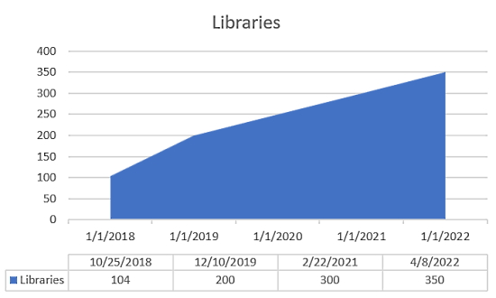
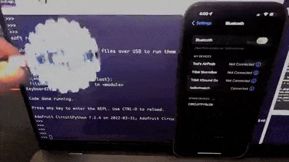
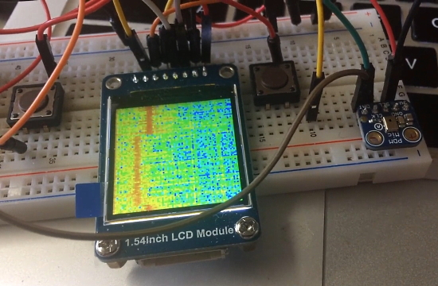
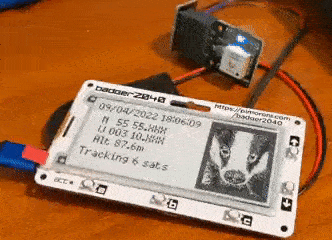
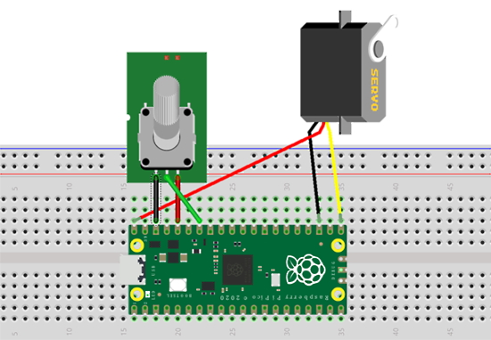
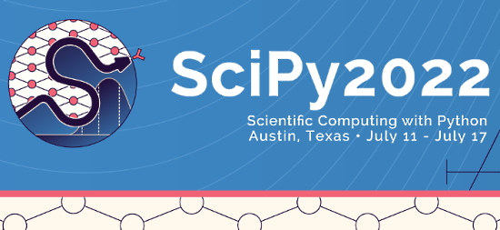
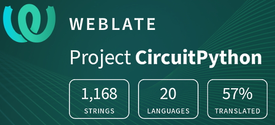

- [X] Kattni updates
- [ ] change date
- [ ] update title
- [ ] Feature story
- [ ] Update  for images
- [ ] Update ICYDNCI
- [ ] All images 550w max only
- [ ] Link "View this email in your browser."

News Sources

- [python.org](https://www.python.org/)
- [Python Insider - dev team blog](https://pythoninsider.blogspot.com/)
- [MicroPython Meetup Blog](https://melbournemicropythonmeetup.github.io/)
- [hackaday.io newest projects MicroPython](https://hackaday.io/projects?tag=micropython&sort=date) and [CircuitPython](https://hackaday.io/projects?tag=circuitpython&sort=date)
- [hackaday CircuitPython](https://hackaday.com/blog/?s=circuitpython) and [MicroPython](https://hackaday.com/blog/?s=micropython)
- [hackster.io CircuitPython](https://www.hackster.io/search?q=circuitpython&i=projects&sort_by=most_recent) and [MicroPython](https://www.hackster.io/search?q=micropython&i=projects&sort_by=most_recent)

View this email in your browser. **Warning: Flashing Imagery**

Welcome to the latest Python on Microcontrollers newsletter! 

We're on [Discord](https://discord.gg/HYqvREz), [Twitter](https://twitter.com/search?q=circuitpython&src=typed_query&f=live), and for past newsletters - [view them all here](https://www.adafruitdaily.com/category/circuitpython/). If you're reading this on the web, [subscribe here](https://www.adafruitdaily.com/). Here's the news this week:

## 350 CircuitPython Libraries Are Now Available

The CircuitPython community reached a big milestone together Thursday! There are now 350 CircuitPython Libraries!

The Adafruit CircuitPython Library Bundle and Community Library Bundle contain all the current libraries available for CircuitPython. CircuitPython libraries are separate files designed to work with CircuitPython code.

CircuitPython programs require a lot of information to run. CircuitPython is so simple to use because most of this information is processed in the background and stored in libraries. Some libraries are built into CircuitPython. Others are downloaded and stored on your CIRCUITPY drive in a folder called lib.

Growth is steady and healthy for the project - [Adafruit Blog](https://blog.adafruit.com/2022/04/08/350-circuitpython-libraries-circuitpython/).

The full list of all the CircuitPython libraries contained in the library bundle can be found on the [circuitpython.org libraries page](https://circuitpython.org/libraries).

## CircuitPython 7.3.0-beta.1 Released

A new version of CircuitPython came out last week – CircuitPython 7.3.0-beta.1.

Notable changes to 7.3.0 since 7.2.5:

* Experimental mDNS support.
* USB to Serial/JTAG support for REPL on appropriate boards.
* Initial experimental USB host support.
* Merge MicroPython 1.18 changes.
* Preliminary `zlib` module support. `gzip` module will be added later.
* PIO: `wrap` and `wrap_target` support.
* `keypad`: scan keystates immediately on creation.

More - [GitHub](https://github.com/adafruit/circuitpython/releases).

## Python 3.11 to be Twice as Fast as its Predecessors

The upcoming version of Python is set to be twice as fast as the previous versions. Python creator Guido Van Rossum stated at the last Python Language Summit that when version 3.11 is published in October 2022, he plans to quadruple Python’s speed. His overall goal over the next four years is to boost Python’s speed by a factor of five.

> Van Rossum’s presentation, which is available on [Github](https://github.com/faster-cpython/ideas/blob/main/FasterCPythonDark.pdf) details how he plans to do this, including an adaptive bytecode interpreter, frame stack optimization, and ‘zero overhead’ exception handling. If these changes double Python’s speed, Van Rossum believes that future changes may include a solid ABI (application binary interface) or machine code generation to boost Python’s performance even more.

More - [Medium](https://python.plainenglish.io/python-3-11-to-be-twice-as-fast-as-predecessors-156768bc3d4).

## PSF Welcomes New Executive Director Deb Nicholson

The Python Software Foundation (PSF), the non-profit home of the Python programming language community, welcomes Deb Nicholson as its new Executive Director. With 15 years of open source experience and over 25 years of non-profit experience, Deb is joining the organization just in time for the first in-person PyCon US since 2019 - [PSF Blog](https://pyfound.blogspot.com/2022/04/deb-nicholson-new-executive-director.html) via [Twitter](https://twitter.com/ThePSF/status/1512078490689961993).

## IEEE Spectrum Top Programming Languages Has Python #1

IEEE Spectrum ranks the popularity of dozens of programming languages. They currently have Python at #1! - [Adafruit Blog](https://blog.adafruit.com/2022/04/06/ieee-spectrum-top-programming-languages-programming-ieeeorg-ieeespectrum/) and [IEEE Spectrum](https://spectrum.ieee.org/top-programming-languages/).

## Feature

text - [site](url).

## This Week's Python Streams

Python on Hardware is all about building a cooperative ecosphere which allows contributions to be valued and to grow knowledge. Below are the streams within the last week focusing on the community.

### CircuitPython Deep Dive Stream

[This week](link), Tim streams work on porting {subject}.

You can see the latest video and past videos on the Adafruit YouTube channel under the Deep Dive playlist - [YouTube](https://www.youtube.com/playlist?list=PLjF7R1fz_OOXBHlu9msoXq2jQN4JpCk8A).

### CircuitPython Parsec

John Park’s CircuitPython Parsec this week is on touchscreen use - [Adafruit Blog](https://blog.adafruit.com/2022/04/08/john-parks-circuitpython-parsec-touchscreen-adafruit-johnedgarpark-adafruit-circuitpython/) and [YouTube](https://youtu.be/pk_uYJKh98c).

Catch all the episodes in the [YouTube playlist](https://www.youtube.com/playlist?list=PLjF7R1fz_OOWFqZfqW9jlvQSIUmwn9lWr).

### The CircuitPython Show

The CircuitPython Show is a new independent podcast, hosted by Paul Cutler, focusing on the people doing awesome things with CircuitPython. Each episode features Paul in conversation with a guest for a twenty to thirty minute interview – [CircuitPythonShow](https://circuitpythonshow.com/), [Blog Post](https://paulcutler.org/posts/2022/01/introducing-the-circuitpython-show/) and [Twitter](https://twitter.com/circuitpyshow).

The last episode featured an interview with Scott Shawcroft. There is no episode this week. The next episode will be Monday April 18th – [Show List](https://twitter.com/circuitpyshow).

### TammyMakesThings is Streaming CircuitPython

Community member and CircuitPython contributor [Tammy Cravit](https://github.com/tammymakesthings) is streaming on Twitch. Her stream focuses on electronics, coding and making, with a focus on CircuitPython. The first few streams have been working on a [MacroPad](https://adafruit.com/product/5128)-based MIDI controller, and she's got lots of other project ideas in the works. An exact schedule for her streams is still being worked out, but she's targeting 2-3 streams per week. Check it out and follow now to be notified of future streams - [Twitch](https://twitch.tv/tammymakesthings).

## Project of the Week: Screen Saver

A portable Severance Lumon terminal screensaver made with an Adafruit FunHouse running CircuitPython - [Twitter Thread](https://twitter.com/todbot/status/1511837244151132163) and [GitHub](https://gist.github.com/todbot/cf23871c9ef5266b08e863601e59e44a).

> The CircuitPython code is the standard ball-bouncing code but with a Lumon logo and some palette cycling to make the logo all rainbowy.

## News from around the web!

Remotely answer/decline/hang up calls on your iPhone with CircuitPython BLE & ANCS. Also displays (via serial) current notifications - [Twitter](https://twitter.com/todbot/status/1511483283493687296) and [GitHub](https://github.com/todbot/Adafruit_CircuitPython_BLE_Apple_Notification_Center/blob/add_actions/examples/ble_apple_notification_center_callhandler.py).

Making a waterfall spectrum analyzer for sound with a microphone, display and CircuitPython - [Twitter](https://twitter.com/digitalMakerCIC/status/1511729392682156032) and [YouTube](https://youtu.be/Bxq2NtjljI0).

Yet another toy keyboard USB MIDI controller with Raspberry Pi Pico and CircuitPython - [Simple DIY Electronic Music Projects](https://diyelectromusic.wordpress.com/2022/04/05/yet-another-toy-keyboard-usb-midi-controller/).

A 3D printed ring to hold a CR2450, XIAO controller and NeoPixel PCB, coded in CircuitPython - [Twitter](https://twitter.com/GeekMomProjects/status/1513374894750240769).

text - [site](url).

text - [site](url).

text - [site](url).

text - [site](url).

text - [site](url).

text - [site](url).

text - [site](url).

text - [site](url).

text - [site](url).

text - [site](url).

A GPS locator displaying on a Pimoroni Badger 2040 eInk display with MicroPython - [Twitter](https://twitter.com/mdb036/status/1512855991708270595) and [GitHub](https://github.com/MichaelBell/pico-uPython/tree/main/gps).

Create your own spooky micro:bit MicroPython talking numbers station - [Twitter](https://twitter.com/blogmywiki/status/1512345967311433731).

Raspberry Pi Pico Learning Kit: use a potentiometer to control a servo with MicroPython - [Osoyoo](https://osoyoo.com/2021/07/20/raspberry-pi-pico-learning-kit-lesson-5-use-potentiometer-to-control-servo/).

Pro tip: you can use WebREPL *within* Thonny IDE instead of having to run it in a separate window - [Tutorial](https://bhave.sh/micropython-webrepl-thonny/), [YouTube](https://youtu.be/zWJb6X_lOr8) and [Twitter](https://twitter.com/beyond_sol/status/1511419818372739074).

Top 13 Best Python Compilers For Python Developers (2022 Rankings) - [Software Testing Help](https://www.softwaretestinghelp.com/python-compiler/).

Code your own Zelda-like game on Raspberry Pi - [Adafruit Blog](https://blog.adafruit.com/2022/04/11/code-your-own-zelda-like-game-on-raspberry-pi-python-raspberrypi-raspberry_pi-wireframemag/) and [Raspberry Pi News](https://www.raspberrypi.com/news/code-your-own-top-down-zelda-like-wireframe-61/), via [Wireframe Magazine](https://wireframe.raspberrypi.com/issues).

text - [site](url).

text - [site](url).

Basic Linux commands cheat sheet - [Twitter](https://twitter.com/Pinkopanterata/status/1509913036408172549).

Pre-allocated lists in Python - [Redowan's Reflections](https://rednafi.github.io/reflections/pre-allocated-lists-in-python.html).

PyDev of the Week:

CircuitPython Weekly Meeting for 

#ICYDNCI What was the most popular, most clicked link, in [last week's newsletter](https://www.adafruitdaily.com/2022/04/05/python-on-microcontrollers-newsletter-raspberry-pi-shortages-new-circuitpython-version-and-more-python-circuitpython-micropython-thepsf/)? [Raspberry Pi Production and supply-chain update](https://www.raspberrypi.com/news/production-and-supply-chain-update/).

## Coming Soon

Adafruit found the [GUVB-C31](https://www.digikey.com/short/088zdvb8) and [GUVA-C32](https://www.digikey.com/short/wj29qtvr) tucked in the Digi-Key catalog. These are UV sensors with true UV diodes and tuned for different spectra. Adafruit is always getting requests for true UV sensors, and these could be useful particularly given the different responsivity. The GUVB is good for ~250 to 320nm, the GUVA is ~250 to 370nm and can output UV index as well it seems. They’ve never seen this chip used but they are whipping up a quick breakout and will try it to see how well they work - [Adafruit](https://blog.adafruit.com/2022/04/06/coming-soon-qt-uv-sensor-in-two-flavors/).

text - [site](url).

## New Boards Supported by CircuitPython

The number of supported microcontrollers and Single Board Computers (SBC) grows every week. This section outlines which boards have been included in CircuitPython or added to [CircuitPython.org](https://circuitpython.org/).

This week, there were (#/no) new boards added!

- [Board name](url)
- [Board name](url)
- [Board name](url)

*Note: For non-Adafruit boards, please use the support forums of the board manufacturer for assistance, as Adafruit does not have the hardware to assist in troubleshooting.*

Looking to add a new board to CircuitPython? It's highly encouraged! Adafruit has four guides to help you do so:

- [How to Add a New Board to CircuitPython](https://learn.adafruit.com/how-to-add-a-new-board-to-circuitpython/overview)
- [How to add a New Board to the circuitpython.org website](https://learn.adafruit.com/how-to-add-a-new-board-to-the-circuitpython-org-website)
- [Adding a Single Board Computer to PlatformDetect for Blinka](https://learn.adafruit.com/adding-a-single-board-computer-to-platformdetect-for-blinka)
- [Adding a Single Board Computer to Blinka](https://learn.adafruit.com/adding-a-single-board-computer-to-blinka)

## New Learn Guides!

[Todbot's CircuitPython Tricks](https://learn.adafruit.com/todbot-circuitpython-tricks) from [John Park](https://learn.adafruit.com/users/johnpark)

[Wireless ESP32-S2 Touch Screen Controller for Pure Data](https://learn.adafruit.com/wireless-esp32-s2-controller-for-pure-data) from [Liz Clark](https://learn.adafruit.com/users/BlitzCityDIY)

[Adafruit TSC2007 I2C Resistive Touch Screen Controller](https://learn.adafruit.com/adafruit-tsc2007-i2c-resistive-touch-screen-controller) from [Liz Clark](https://learn.adafruit.com/users/BlitzCityDIY)

[MIDI Foot Pedal](https://learn.adafruit.com/midi-foot-pedal) from [Noe and Pedro](https://learn.adafruit.com/users/pixil3d)

## CircuitPython Libraries!

CircuitPython support for hardware continues to grow. We are adding support for new sensors and breakouts all the time, as well as improving on the drivers we already have. As we add more libraries and update current ones, you can keep up with all the changes right here!

For the latest libraries, download the [Adafruit CircuitPython Library Bundle](https://circuitpython.org/libraries). For the latest community contributed libraries, download the [CircuitPython Community Bundle](https://github.com/adafruit/CircuitPython_Community_Bundle/releases).

If you'd like to contribute, CircuitPython libraries are a great place to start. Have an idea for a new driver? File an issue on [CircuitPython](https://github.com/adafruit/circuitpython/issues)! Have you written a library you'd like to make available? Submit it to the [CircuitPython Community Bundle](https://github.com/adafruit/CircuitPython_Community_Bundle). Interested in helping with current libraries? Check out the [CircuitPython.org Contributing page](https://circuitpython.org/contributing). We've included open pull requests and issues from the libraries, and details about repo-level issues that need to be addressed. We have a guide on [contributing to CircuitPython with Git and GitHub](https://learn.adafruit.com/contribute-to-circuitpython-with-git-and-github) if you need help getting started. You can also find us in the #circuitpython channels on the [Adafruit Discord](https://adafru.it/discord).

You can check out this [list of all the Adafruit CircuitPython libraries and drivers available](https://github.com/adafruit/Adafruit_CircuitPython_Bundle/blob/master/circuitpython_library_list.md). 

The current number of CircuitPython libraries is **350**!

**Updated Libraries!**

Here's this week's updated CircuitPython libraries:

There are too many updated libraries to list this week. Keep an eye out for more library fun next week!

## What’s the team up to this week?

What is the team up to this week? Let’s check in!

**Dan**

I released CircuitPython 7.2.5 to fix various high priority bugs, and also 7.3.0-beta.1 to catch up on two weeks' worth of additions and fixes to the `main` branch. 7.3.0-beta.1 also includes all the 7.2.x fixes.

One of the fixes for 7.2.5 was particularly head-scratching. I could make CircuitPython hang simply by touching an unconnected UART RX pin. This turned out to be a particular timeout UART interrupt enabled in the latest version of the RP2040 SDK, which we didn't know about and didn't handle.

I am continuing on the bug quest for 7.2.x and 7.3.0. The latest interesting thing is that stepper motors driven by an I2C-controlled motor controller are running much more slowly on ESP32-S2 that on other ports. I suspect an I2C problem.

**Jeff**

I contributed some more bug fixes for the recent 7.2.x releases, and also fixed some bugs that will go in 7.3.0 whenever that is released. It's good to be getting through the backlog of things that had accumulated for me to work on in CircuitPython.

**Kattni**

I've been working on a number of things over the last week. The asyncio template is completed, and ready to be included in its first guide. I created a new `.gitignore` for the libraries, and had it peer reviewed via a cookiecutter PR. (We will need to run a patch to deploy it to all the libraries.) I proofed Liz's first product guide (she did great!). I started testing PyLeap, found some issues, determined at least one of them is a CircuitPython-issue (not a PyLeap one), and submitted feedback on some of the new mockups that are destined for the next PyLeap version.

Coming up is the Feather ESP32-S3 guide, the QT Py BFF guide, and who knows!

**Melissa**

This past week I focused on archiving the WebSerial ESPTool, updating guides, and updating WipperSnapper Firmware Uploader. We are making use of a fork of the tool that NabuCasa is maintaining at https://nabucasa.github.io/esp-web-flasher/. Their fork has it available as an NPM module and WipperSnapper Firmware Uploader has now been updated to use the NPM module.

**Tim**

I created some preliminary material for use by folks at an upcoming python convention. A YouTube video showing the process of adding type hints to a CircuitPython library, as well as a Learn Guide page that explains type hints and how we use them in CircuitPython libraries. I also tinkered with some helper code to generate larger panels from small sprite sheets using `displayio.TileGrid`.

**Liz**

This week I worked on my first new product guide solo for the TSC2007, following Kattni's expert guidance. I also finished up a project guide, using a QT Py ESP32-S2 to control a Pure Data patch over WiFi with a socket connection (https://learn.adafruit.com/wireless-esp32-s2-controller-for-pure-data). This coming week I'll be working on another wireless project, this time using BLE for an HID device.

## Upcoming events!

The next MicroPython Meetup in Melbourne will be on April 27th – [Meetup](https://www.meetup.com/MicroPython-Meetup/). See the [slides](https://docs.google.com/presentation/d/e/2PACX-1vSYt41VJm6ptM-aFKbnTPhucX-NZ2kXP7B7kbEp6Le9lidSfB7SKoNflvlCgCsJ0AOURAS-tamDVENX/pub?slide=id.p) of the March 23rd meeting.

PyConDE and PyData 2022 will be held in Berlin, Germany from April 11 - 13, 2022 at the Berlin Conference Center - [PyCon DE](https://2022.pycon.de/).

PyCon US 2022 planning is underway. The event is in-person with an online component. April 27, 2022 – May 5, 2022 in Salt Lake City, Utah USA. Head over to the [PyCon US 2022 website](https://us.pycon.org/2022/) for details about the conference and the schedule (new) – [PyCon Blog](https://pycon.blogspot.com/2022/10/pycon-us-2022-website-and-sponsorship.html).

PyCon Italia is the Italian conference on Python. Organized by Python Italia, it is one of the more important Python conferences in Europe. With over 700 attendees, the next edition will be June 2-5, 2022 - [Ticket Registration](https://pycon.it/en/tickets).

SciPy 2022, the 21st annual Scientific Computing with Python conference, will be held in Austin, Texas, USA from July 11-17, 2022. The annual SciPy Conference brings together attendees from industry, academia, and government to showcase their latest projects, learn from skilled users and developers, and collaborate on code development. The full program will consist of 2 days tutorials (July 11-12), 3 days of talks (July 13-15) and 2 days of developer sprints (July 16-17) - [SciPy 2022](https://www.scipy2022.scipy.org/).

**Send Your Events In**

As for other events, with the COVID pandemic, most in-person events are postponed or cancelled. If you know of virtual events or events that may occur in the future, please let us know on Twitter with hashtag #CircuitPython or email to cpnews(at)adafruit(dot)com.

EuroPython 2022 will be held on 11th-17th July 2022 and it will be both in person and virtual. The in-person conference will be held at [The Convention Centre](https://www.theccd.ie/) Dublin (The CCD) in Dublin, Ireland - [EuroPython 2022](https://ep2022.europython.eu/).

## Latest releases

CircuitPython's stable release is [#.#.#](https://github.com/adafruit/circuitpython/releases/latest) and its unstable release is [#.#.#-##.#](https://github.com/adafruit/circuitpython/releases). New to CircuitPython? Start with our [Welcome to CircuitPython Guide](https://learn.adafruit.com/welcome-to-circuitpython).

[2022####](https://github.com/adafruit/Adafruit_CircuitPython_Bundle/releases/latest) is the latest CircuitPython library bundle.

[v#.#.#](https://micropython.org/download) is the latest MicroPython release. Documentation for it is [here](http://docs.micropython.org/en/latest/pyboard/).

[#.#.#](https://www.python.org/downloads/) is the latest Python release. The latest pre-release version is [#.#.#](https://www.python.org/download/pre-releases/).

[#,### Stars](https://github.com/adafruit/circuitpython/stargazers) Like CircuitPython? [Star it on GitHub!](https://github.com/adafruit/circuitpython)

## Call for help -- Translating CircuitPython is now easier than ever!

One important feature of CircuitPython is translated control and error messages. With the help of fellow open source project [Weblate](https://weblate.org/), we're making it even easier to add or improve translations. 

Sign in with an existing account such as GitHub, Google or Facebook and start contributing through a simple web interface. No forks or pull requests needed! As always, if you run into trouble join us on [Discord](https://adafru.it/discord), we're here to help.

## jobs.adafruit.com - Find a dream job, find great candidates!

[jobs.adafruit.com](https://jobs.adafruit.com/) has returned and folks are posting their skills (including CircuitPython) and companies are looking for talented makers to join their companies - from Digi-Key, to Hackaday, Micro Center, Raspberry Pi and more.

**Job of the Week**

text - [Adafruit Jobs Board](https://jobs.adafruit.com/).

## NUMBER thanks!

The Adafruit Discord community, where we do all our CircuitPython development in the open, reached over NUMBER humans - thank you!  Adafruit believes Discord offers a unique way for Python on hardware folks to connect. Join today at [https://adafru.it/discord](https://adafru.it/discord).

## ICYMI - In case you missed it

Python on hardware is the Adafruit Python video-newsletter-podcast! The news comes from the Python community, Discord, Adafruit communities and more and is broadcast on ASK an ENGINEER Wednesdays. The complete Python on Hardware weekly videocast [playlist is here](https://www.youtube.com/playlist?list=PLjF7R1fz_OOXRMjM7Sm0J2Xt6H81TdDev). The video podcast is on [iTunes](https://itunes.apple.com/us/podcast/python-on-hardware/id1451685192?mt=2), [YouTube](http://adafru.it/pohepisodes), [IGTV (Instagram TV](https://www.instagram.com/adafruit/channel/)), and [XML](https://itunes.apple.com/us/podcast/python-on-hardware/id1451685192?mt=2).

[The weekly community chat on Adafruit Discord server CircuitPython channel - Audio / Podcast edition](https://itunes.apple.com/us/podcast/circuitpython-weekly-meeting/id1451685016) - Audio from the Discord chat space for CircuitPython, meetings are usually Mondays at 2pm ET, this is the audio version on [iTunes](https://itunes.apple.com/us/podcast/circuitpython-weekly-meeting/id1451685016), Pocket Casts, [Spotify](https://adafru.it/spotify), and [XML feed](https://adafruit-podcasts.s3.amazonaws.com/circuitpython_weekly_meeting/audio-podcast.xml).

## Codecademy "Learn Hardware Programming with CircuitPython"

Codecademy, an online interactive learning platform used by more than 45 million people, has teamed up with Adafruit to create a coding course, “Learn Hardware Programming with CircuitPython”. The course is now available in the [Codecademy catalog](https://www.codecademy.com/learn/learn-circuitpython?utm_source=adafruit&utm_medium=partners&utm_campaign=circuitplayground&utm_content=pythononhardwarenewsletter).

## Contribute!

The CircuitPython Weekly Newsletter is a CircuitPython community-run newsletter emailed every Tuesday. The complete [archives are here](https://www.adafruitdaily.com/category/circuitpython/). It highlights the latest CircuitPython related news from around the web including Python and MicroPython developments. To contribute, edit next week's draft [on GitHub](https://github.com/adafruit/circuitpython-weekly-newsletter/tree/gh-pages/_drafts) and [submit a pull request](https://help.github.com/articles/editing-files-in-your-repository/) with the changes. You may also tag your information on Twitter with #CircuitPython. 

Join the Adafruit [Discord](https://adafru.it/discord) or [post to the forum](https://forums.adafruit.com/viewforum.php?f=60) if you have questions.
it</h2>

Python on hardware is the Adafruit Python video-newsletter-podcast! The news comes from the Python community, Discord, Adafruit communities and more and is broadcast on ASK an ENGINEER Wednesdays. The complete Python on Hardware weekly videocast <a href="https://www.youtube.com/playlist?list=PLjF7R1fz_OOXRMjM7Sm0J2Xt6H81TdDev">playlist is here</a>. The video podcast is on <a href="https://itunes.apple.com/us/podcast/python-on-hardware/id1451685192?mt=2">iTunes</a>, <a href="http://adafru.it/pohepisodes">YouTube</a>, <a href="https://www.instagram.com/adafruit/channel/">IGTV (Instagram TV</a>), and <a href="https://itunes.apple.com/us/podcast/python-on-hardware/id1451685192?mt=2">XML</a>.

<a href="https://itunes.apple.com/us/podcast/circuitpython-weekly-meeting/id1451685016">The weekly community chat on Adafruit Discord server CircuitPython channel &#8211; Audio / Podcast edition</a> &#8211; Audio from the Discord chat space for CircuitPython, meetings are usually Mondays at 2pm ET, this is the audio version on <a href="https://itunes.apple.com/us/podcast/circuitpython-weekly-meeting/id1451685016">iTunes</a>, Pocket Casts, <a href="https://adafru.it/spotify">Spotify</a>, and <a href="https://adafruit-podcasts.s3.amazonaws.com/circuitpython_weekly_meeting/audio-podcast.xml">XML feed</a>.

<h2 id="codecademy-learn-hardware-programming-with-circuitpython">Codecademy “Learn Hardware Programming with CircuitPython”</h2>

Codecademy, an online interactive learning platform used by more than 45 million people, has teamed up with Adafruit to create a coding course, “Learn Hardware Programming with CircuitPython”. The course is now available in the <a href="https://www.codecademy.com/learn/learn-circuitpython?utm_source=adafruit&amp;utm_medium=partners&amp;utm_campaign=circuitplayground&amp;utm_content=pythononhardwarenewsletter">Codecademy catalog</a>.

<h2 id="contribute">Contribute!</h2>

The CircuitPython Weekly Newsletter is a CircuitPython community-run newsletter emailed every Tuesday. The complete <a href="https://www.adafruitdaily.com/category/circuitpython/">archives are here</a>. It highlights the latest CircuitPython related news from around the web including Python and MicroPython developments. To contribute, edit next week’s draft <a href="https://github.com/adafruit/circuitpython-weekly-newsletter/tree/gh-pages/_drafts">on GitHub</a> and <a href="https://help.github.com/articles/editing-files-in-your-repository/">submit a pull request</a> with the changes. You may also tag your information on Twitter with #CircuitPython.

Join the Adafruit <a href="https://adafru.it/discord">Discord</a> or <a href="https://forums.adafruit.com/viewforum.php?f=60">post to the forum</a> if you have questions.

	
