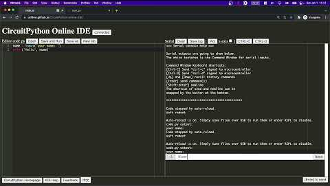
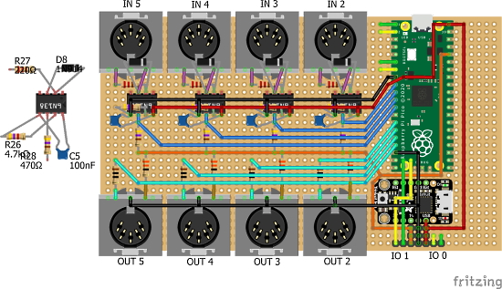
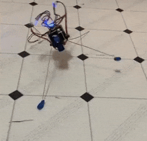
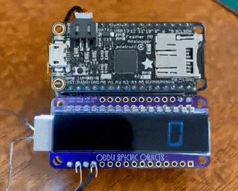
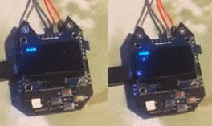
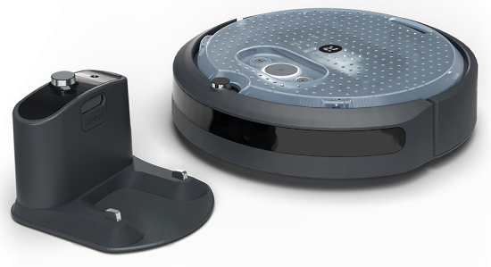

- [X] Kattni updates
- [ ] change date
- [ ] update title
- [ ] Feature story
- [ ] Update  for images
- [ ] Update ICYDNCI
- [ ] All images 550w max only
- [ ] Link "View this email in your browser."

News Sources

- [python.org](https://www.python.org/)
- [Python Insider - dev team blog](https://pythoninsider.blogspot.com/)
- [MicroPython Meetup Blog](https://melbournemicropythonmeetup.github.io/)
- [hackaday.io newest projects MicroPython](https://hackaday.io/projects?tag=micropython&sort=date) and [CircuitPython](https://hackaday.io/projects?tag=circuitpython&sort=date)
- [hackaday CircuitPython](https://hackaday.com/blog/?s=circuitpython) and [MicroPython](https://hackaday.com/blog/?s=micropython)
- [hackster.io CircuitPython](https://www.hackster.io/search?q=circuitpython&i=projects&sort_by=most_recent) and [MicroPython](https://www.hackster.io/search?q=micropython&i=projects&sort_by=most_recent)

View this email in your browser. **Warning: Flashing Imagery**

Welcome to the latest Python on Microcontrollers newsletter! 

We're on [Discord](https://discord.gg/HYqvREz), [Twitter](https://twitter.com/search?q=circuitpython&src=typed_query&f=live), and for past newsletters - [view them all here](https://www.adafruitdaily.com/category/circuitpython/). If you're reading this on the web, [subscribe here](https://www.adafruitdaily.com/). Here's the news this week:

## PyCon US 2022 This Week

PyCon US 2022 is this week. The event is in-person with an online component from April 27, 2022 – May 5, 2022 in Salt Lake City, Utah USA. Head over to the [PyCon US 2022 website](https://us.pycon.org/2022/) for details about the conference and the schedule – [PyCon Blog](https://pycon.blogspot.com/2022/10/pycon-us-2022-website-and-sponsorship.html).

Kattni, Melissa and Jeff from Adafruit will be attending April 28th through May 3rd. Kattni and Melissa will be attending the Education Summit on April 28th. Kattni will be giving a talk at the Summit called Simplicity and Fun: Learning with CircuitPython. The team will also be hosting a Welcome to CircuitPython mini-sprint.

They will be hosting Open Spaces every day (time TBD), which will be an introduction to CircuitPython using the Circuit Playground Bluefruit (CPB). The Bluefruit boards will be provided, along with a few other accessories, to enable folks to explore CircuitPython. A quick-start will be available, as well as a series of other examples to delve into. All three team members will be available to help.

Kattni and Melissa will be hosting development Sprints May 2nd and 3rd - [Adafruit Blog](https://blog.adafruit.com/2022/04/18/looking-forward-to-pycon-2022-python-pyconus-pycon/) and the [Open Spaces GitHub](https://github.com/kattni/PyCon2022).

## Try out the micro:bit Python Editor (Beta)

The Micro:bit Educational Foundation is excited to announce that our new Python Editor has entered its Beta phase, meaning that we’re getting ready to to release it to the community - [microbit.org mailing](https://mailchi.mp/microbit.org/python-editor-beta) and [micro:bit support](https://support.microbit.org/support/solutions/articles/19000135210-python-editor-guide).

> The new editor has been built from the ground-up with classroom use in mind. It aims to make text-based coding more accessible to students who may find it hard to engage with the subject by removing known barriers to learning. It's also designed to make computer science appeal to more diverse cohorts and hence expand their horizons.

## Tom's Hardware Pimoroni Servo 2040 Review

Tom's Hardware reviews the new Pimoroni Servo 2040 board - [Tom's Hardware](https://www.tomshardware.com/reviews/pimoroni-servo-2040-review-control-up-to-18-servos-with-rp2040).

> We tested the Pimoroni Servo 2040 using MicroPython and CircuitPython. Pimoroni has created a new version of its MicroPython release which provides support for Servo 2040, and it seems that roboticist and developer Chris Parrott has poured a lot of love into the software that supports this project. The MicroPython modules for Servo 2040 are well documented and robust. We are seeing great hardware and software backed by great documentation. &nbsp; For our MicroPython test, we elected to use the Pimoroni’s version which also supports CircuitPython libraries. We wanted to test a few Stemma QT devices with MicroPython and this seemed like a great fit. We ran through Pimoroni’s examples, testing single and multiple servos. Everything went extremely smoothly.

## CircuitPython Online IDE for Classes

The CircuitPython Online IDE for Classes project provides nearly the same online IDE as the [CircuitPython Online IDE](https://github.com/urfdvw/CircuitPython-online-IDE). However, in this project, teaching functions are provided:

* Students sign in the IDE by a unique 'nicknames'
* Instructors can monitor the students' editor code and console outputs according to their 'nicknames'
* Instructors can monitor multiple students

With these additional functions, instructors can provide timely feedback to the students - [GitHub](https://github.com/urfdvw/CircuitPython-online-IDE-for-classes).

A paper on this was accepted to the ASEE (American Society for Engineering Education) 2022 conference! - [Twitter](https://twitter.com/River___Wang/status/1516518964142161922).

## Feature

text - 

## The Memray Memory Profiler for Python Open Sourced

Bloomberg has open sourced Memray, a memory profiler for Python. It can track Linux memory allocations in Python code, in native extension modules, and in the Python interpreter itself. 

It can generate several different types of reports to help analyze the captured memory usage data. While commonly used as a CLI tool, it can also be used as a library to perform more fine-grained profiling tasks - [Adafruit Blog](https://blog.adafruit.com/2022/04/21/the-memray-memory-profiler-for-python-open-sourced-opensource/) and [GitHub](https://github.com/bloomberg/memray).

## This Week's Python Streams

Python on Hardware is all about building a cooperative ecosphere which allows contributions to be valued and to grow knowledge. Below are the streams within the last week focusing on the community.

### CircuitPython Deep Dive Stream

[This week](https://youtu.be/1Rynch1XDh8), Tim streamed work on a displayio SpriteButton widget.

You can see the latest video and past videos on the Adafruit YouTube channel under the Deep Dive playlist - [YouTube](https://www.youtube.com/playlist?list=PLjF7R1fz_OOXBHlu9msoXq2jQN4JpCk8A).

### CircuitPython Parsec

John Park’s CircuitPython Parsec this week is on {subject} - [Adafruit Blog](link) and [YouTube](link).

Catch all the episodes in the [YouTube playlist](https://www.youtube.com/playlist?list=PLjF7R1fz_OOWFqZfqW9jlvQSIUmwn9lWr).

### The CircuitPython Show

The CircuitPython Show is an independent podcast, hosted by Paul Cutler, focusing on the people doing awesome things with CircuitPython. Each episode features Paul in conversation with a guest for a twenty to thirty minute interview – [CircuitPythonShow](https://circuitpythonshow.com/), [Blog Post](https://paulcutler.org/posts/2022/01/introducing-the-circuitpython-show/) and [Twitter](https://twitter.com/circuitpyshow).

The CircuitPython Show is moving to a bi-weekly schedule and will return Monday, May 2nd with guest Melissa LeBlanc-Williams.

### TammyMakesThings is Streaming CircuitPython

Community member and CircuitPython contributor [Tammy Cravit](https://github.com/tammymakesthings) is streaming on Twitch. Her stream focuses on electronics, coding and making, with a focus on CircuitPython. The first few streams have been working on a [MacroPad](https://adafruit.com/product/5128)-based MIDI controller, and she's got lots of other project ideas in the works. An exact schedule for her streams is still being worked out, but she's targeting 2-3 streams per week. Check it out and follow now to be notified of future streams - [Twitch](https://twitch.tv/tammymakesthings).

## Project of the Week: A Multi MIDI Router

A multi-MIDI router (DIN and USB), using a Raspberry Pi Pico, Adafruit Trinket M0, and a Seeedstudio Xiao.

> One of the easiest ways right now to get USB MIDI device support on a Pico is to use CircuitPython, but I’ve not had much success so far with PIO in CircuitPython.  So I have the requirement that I want to use Micropython for PIO support, but need CircuitPython for USB MIDI device support.  Neither will support USB MIDI host functionality. This project is one enhancement that adds both by adding two “USB MIDI co-processors” to the Pico.

The Trinket M0 uses Arduino, the Pico side of things uses Micropython and the Xiao uses CircuitPython - [Simple DIY Electronic Music Projects](https://diyelectromusic.wordpress.com/2022/04/22/raspberry-pi-pico-multi-midi-router-part-3/).

## News from around the web!

> My Seeedstudio Xiao RP2040 insect bot is now happily crawling along my  kitchen floor. I’m working on improving the 3D printed body to work as a platform to mount other accessories too. Running CircuitPython - [Twitter](https://twitter.com/MarkKomus/status/1516262530028613641).

A JoyPad (powered by Raspberry Pi Pico and CircuitPython) is performing as the USB mouse and keypad for a pick-and-place machine - [Twitter](https://twitter.com/bradanlane/status/1516440913643454470).

LumosRing, an Addessable LED 4x Ring and dual 5x7 block running CircuitPython, was released. It had 240 LEDs forming a 4-deep ring with 70 LEDs forming a dual 5x7 block in the middle - [Tindie](https://www.tindie.com/products/bradanlane/lumosring-circuitpython-led-ring-block/) via [Twitter](https://twitter.com/tindie/status/1517142270889234435).

A fixed version of Joey Castillo's LCD wing and a driver based on Adafruit’s HT16K33 segment LED library. This should make it feel familiar, and gives it this cool marquee feature out of the box - [Twitter](https://twitter.com/josecastillo/status/1516180172092891143).

text - [site](url).

> Nintendo Switch + Game Builder Garage + Wii uDraw GameTablet + Feather RP2040 + Custom simple mouse HID descriptor + CircuitPython code already written to support uDraw and I can draw a texture - [Twitter](https://twitter.com/DavidGlaude/status/1517493861282721799).

text - [site](url).

text - [site](url).

text - [site](url).

text - [site](url).

Foamyguy published a video demonstrating the process of making a PR to contribute to CircuitPython Libraries  - [YouTube](https://youtu.be/4H2NSf5PtME).

text - [site](url).

A patched MicroPython SH1106 Library (by robert-hh) to add partial updates. It's way  speedier for simple operations - [Twitter](https://twitter.com/CRImierTech/status/1516201462648430611).

text - [text]().

Building on a project from 2019, this new scanner for 8mm and Super 8 film offers HQ Camera Module support and an easier build process, programmed in Python - [hackster.io](https://www.hackster.io/news/anton-gutscher-s-8mm-film-scanner-uses-a-raspberry-pi-in-a-3d-printed-housing-to-digitize-old-films-a4a4c9bb58bc) and [hackaday.io](https://hackaday.io/project/167426/instructions).

A Python translation of the classic 1971 Star Trek game in the style of the BASIC version on the Commodore PET. May be possible to port to CircuitPython or MicroPython, maybe on a PyGamer - [Twitter](https://twitter.com/blogmywiki/status/1515808443768127488) and [GitHub](https://github.com/blogmywiki/pet-python-startrek).

Mini Raspberry Pi Zero-powered desktop weather display - [Raspberry Pi News](https://www.raspberrypi.com/news/mini-raspberry-pi-zero-powered-desktop-weather-display/) and [Google Docs](https://docs.google.com/document/d/e/2PACX-1vRTfTIvWoMSiLyvuvU0g-L9SANNuM2K9U4r31BuZYr5Hq0T_NWDr2Q3jhdISymD7b3g9NFZRxY-EsTY/pub?urp=gmail_link#h.2z7bc0toacik).

Code Club World is a free online platform where kids can learn to code and have fun. They will earn a badge for each completed project, building up their collection and proving their coding skills. As well as learning block-based programming, they can start learning text-based coding with Python. With these skills, kids can learn to build games, create inspirational art, make animations, and much more - [Code Club World](https://codeclubworld.org/).

Python 3.11 Preview: Task and Exception Groups - [Real Python](https://realpython.com/python311-exception-groups/).

text - [site](url).

edge-ml: an embedded-first machine learning framework that helps developers build models faster and more robustly with an open-source toolchain for embedded machine learning - [Adafruit Blog](https://blog.adafruit.com/2022/04/22/edge-ml-open-source-machine-learning-on-microcontrollers-ml-esp32-python/), [website](https://edge-ml.org/) and [GitHub](https://github.com/edge-ml/edge-ml).

PyDev of the Week:

CircuitPython Weekly Meeting for 

#ICYDNCI What was the most popular, most clicked link, in [last week's newsletter](https://www.adafruitdaily.com/2022/04/19/python-on-microcontrollers-newsletter-34k-discord-3k-reddit-pycon-us-coming-up-and-more-python-circuitpython-micropython-thepsf/)? [Learn Git: Git Gud](https://github.com/benthayer/git-gud).

## Coming Soon

The iRobot Create® 3 Programmable Robot development platform for learning ROS 2. A canvas for your creativity, the Create 3 arrives ready to go with a suite of smart technology. Begin by programming the Create 3 to perform simple behaviors, sounds, and movements. Or advance to autonomous localization, navigation, and telepresence applications - [Adafruit](https://www.adafruit.com/product/5424).

text - [site](url).

## New Boards Supported by CircuitPython

The number of supported microcontrollers and Single Board Computers (SBC) grows every week. This section outlines which boards have been included in CircuitPython or added to [CircuitPython.org](https://circuitpython.org/).

This week, there were (#/no) new boards added!

- [Board name](url)
- [Board name](url)
- [Board name](url)

*Note: For non-Adafruit boards, please use the support forums of the board manufacturer for assistance, as Adafruit does not have the hardware to assist in troubleshooting.*

Looking to add a new board to CircuitPython? It's highly encouraged! Adafruit has four guides to help you do so:

- [How to Add a New Board to CircuitPython](https://learn.adafruit.com/how-to-add-a-new-board-to-circuitpython/overview)
- [How to add a New Board to the circuitpython.org website](https://learn.adafruit.com/how-to-add-a-new-board-to-the-circuitpython-org-website)
- [Adding a Single Board Computer to PlatformDetect for Blinka](https://learn.adafruit.com/adding-a-single-board-computer-to-platformdetect-for-blinka)
- [Adding a Single Board Computer to Blinka](https://learn.adafruit.com/adding-a-single-board-computer-to-blinka)

## New Learn Guides!

[Little Desktop Connection Machine](https://learn.adafruit.com/little-connection-machine) from [Noe and Pedro](https://learn.adafruit.com/users/pixil3d)

[Glider Paper Airplane Controller](https://learn.adafruit.com/glider-paper-airplane-controller) from [Liz Clark](https://learn.adafruit.com/users/BlitzCityDIY)

[Adafruit ESP32-S3 Feather](https://learn.adafruit.com/adafruit-esp32-s3-feather) from [Kattni](https://learn.adafruit.com/users/kattni)

## CircuitPython Libraries!

CircuitPython support for hardware continues to grow. We are adding support for new sensors and breakouts all the time, as well as improving on the drivers we already have. As we add more libraries and update current ones, you can keep up with all the changes right here!

For the latest libraries, download the [Adafruit CircuitPython Library Bundle](https://circuitpython.org/libraries). For the latest community contributed libraries, download the [CircuitPython Community Bundle](https://github.com/adafruit/CircuitPython_Community_Bundle/releases).

If you'd like to contribute, CircuitPython libraries are a great place to start. Have an idea for a new driver? File an issue on [CircuitPython](https://github.com/adafruit/circuitpython/issues)! Have you written a library you'd like to make available? Submit it to the [CircuitPython Community Bundle](https://github.com/adafruit/CircuitPython_Community_Bundle). Interested in helping with current libraries? Check out the [CircuitPython.org Contributing page](https://circuitpython.org/contributing). We've included open pull requests and issues from the libraries, and details about repo-level issues that need to be addressed. We have a guide on [contributing to CircuitPython with Git and GitHub](https://learn.adafruit.com/contribute-to-circuitpython-with-git-and-github) if you need help getting started. You can also find us in the #circuitpython channels on the [Adafruit Discord](https://adafru.it/discord).

You can check out this [list of all the Adafruit CircuitPython libraries and drivers available](https://github.com/adafruit/Adafruit_CircuitPython_Bundle/blob/master/circuitpython_library_list.md). 

The current number of CircuitPython libraries is **351**!

**Updated Libraries!**

Here's this week's updated CircuitPython libraries:

 * [Adafruit_CircuitPython_MotorKit](https://github.com/adafruit/Adafruit_CircuitPython_MotorKit)
 * [Adafruit_CircuitPython_VC0706](https://github.com/adafruit/Adafruit_CircuitPython_VC0706)
 * [Adafruit_CircuitPython_Requests](https://github.com/adafruit/Adafruit_CircuitPython_Requests)
 * [Adafruit_CircuitPython_Display_Shapes](https://github.com/adafruit/Adafruit_CircuitPython_Display_Shapes)
 * [Adafruit_CircuitPython_PortalBase](https://github.com/adafruit/Adafruit_CircuitPython_PortalBase)
 * [Adafruit_CircuitPython_RSA](https://github.com/adafruit/Adafruit_CircuitPython_RSA)
 * [Adafruit_CircuitPython_BME680](https://github.com/adafruit/Adafruit_CircuitPython_BME680)
 * [Adafruit_Blinka](https://github.com/adafruit/Adafruit_Blinka)
 * [CircuitPython_Community_Bundle](https://github.com/adafruit/CircuitPython_Community_Bundle)

## What’s the team up to this week?

What is the team up to this week? Let’s check in!

**Dan**

I am continuing to work on an ESP32-S2 I2C issue, and am working with an Espressif engineer on a possible solution.

I'm tuning up the NeoPixel timings on various ports to be able to support all the different kinds of NeoPixels we sell.

I've been shepherding several pull requests from some new contributors to CircuitPython through the review process.

**Jeff**

I noticed ["Servo 2040", a new board from pimoroni](https://shop.pimoroni.com/products/servo-2040) appeared in [the Adafruit shop](https://www.adafruit.com/product/5437). This prompted the question of what it would take to support 18 servo motors at the same time in CircuitPython on the RP2040. It turns out that it should be possible with a small addition to the StateMachine class, and I have a [work in progress Pull Request](https://github.com/adafruit/circuitpython/pull/6300). This may also unlock sending data to a PIO peripheral "in the background" from CircuitPython code, which is cool and will no doubt find uses.

In this image, 4 staggered "servo-like" signals are shown. The code adapts to any number of contiguous pins using just one StateMachine.

On Friday, Saturday and Sunday look for me at PyCon US 2022 in Salt Lake City. I'd be happy to talk with folks from the community, especially at the CircuitPython open spaces. I made myself a custom badge from a pygamer just for the occasion, so you can pick me out in a crowd.

**Kattni**

This week I published the Adafruit ESP32-S3 Feather guide. Much of it is tied to the ESP32-S2 Feather guide, as the boards are heavily similar. If you picked up one of the ESP32-S3 Feathers, and you're wondering where to start, check out this guide.

I am also working on testing PyLeap. PyLeap is an iOS app that allows you to connect to your Circuit Playground Bluefruit or CLUE board (in the unreleased beta version) from your iOS device, and download and transfer code from a number of Learn guides wirelessly to your board. I'll be working with our developer to get into a bug-fix cycle and get through what I found. Keep an eye out for the next PyLeap update!

**Melissa**

This past week I worked on a script that would install the MIPI driver for the raspberry pi including figuring out all the offsets and rotations to match the existing FrameBuffer-based drivers. I started working on trying to separate the touchscreen functionality from the old driver and while it does show up, I am still unable to receive touch events.

This next week I'll be at PyCon US - at the conference, open spaces, and at the sprints. If you are also attending, be sure to look for me there.

**Tim**

This week I tested a few network based PRs, to support multiple cookie headers, and try multiple ssid's if suplied in secrets.py for projects that utilize PortalBase. I addressed some feedback received on my core PR to allow TileGrids to have their bitmap changed after initialization as well as re-tested all of the behavior and argument validity checking. In preperation for that to be merged I started working on a SpriteButton class that will allow us to easily make fully custom bitmap buttons that can have separate sprites for pressed and un-pressed states. I did the final round of editing and on the typing information guide page and submitted it for moderation. It's been published and I'll be blogging it soon.

**Liz**

I'm starting to work on a Laser Harp project. I'll be using 8 time of flight sensors to "play" the harp. The harp will output MIDI and I'll be using a combination of detecting when my hands are over a ToF sensor and using the distance to affect CC values. I'm leaning towards including a Music Maker FeatherWing so that it can be a standalone synth.

This is going to be a larger project so I will also be working on documenting a quick USB to serial MIDI converter with a QT Py and CircuitPython. This was a project done by Sandy Macdonald on Twitter and we thought it would be great to document for the community.

## Upcoming events!

The next MicroPython Meetup in Melbourne will be on April 27th – [Meetup](https://www.meetup.com/MicroPython-Meetup/). See the [slides](https://docs.google.com/presentation/d/e/2PACX-1vSYt41VJm6ptM-aFKbnTPhucX-NZ2kXP7B7kbEp6Le9lidSfB7SKoNflvlCgCsJ0AOURAS-tamDVENX/pub?slide=id.p) of the March 23rd meeting.

PyCon Italia is the Italian conference on Python. Organized by Python Italia, it is one of the more important Python conferences in Europe. With over 700 attendees, the next edition will be June 2-5, 2022 - [Ticket Registration](https://pycon.it/en/tickets).

SciPy 2022, the 21st annual Scientific Computing with Python conference, will be held in Austin, Texas, USA from July 11-17, 2022. The annual SciPy Conference brings together attendees from industry, academia, and government to showcase their latest projects, learn from skilled users and developers, and collaborate on code development. The full program will consist of 2 days tutorials (July 11-12), 3 days of talks (July 13-15) and 2 days of developer sprints (July 16-17) - [SciPy 2022](https://www.scipy2022.scipy.org/).

EuroPython 2022 will be held on 11th-17th July 2022 and it will be both in person and virtual. The in-person conference will be held at [The Convention Centre](https://www.theccd.ie/) Dublin (The CCD) in Dublin, Ireland - [EuroPython 2022](https://ep2022.europython.eu/).

**Send Your Events In**

As for other events, with the COVID pandemic, most in-person events are postponed or cancelled. If you know of virtual events or events that may occur in the future, please let us know on Twitter with hashtag #CircuitPython or email to cpnews(at)adafruit(dot)com.

## Latest releases

CircuitPython's stable release is [#.#.#](https://github.com/adafruit/circuitpython/releases/latest) and its unstable release is [#.#.#-##.#](https://github.com/adafruit/circuitpython/releases). New to CircuitPython? Start with our [Welcome to CircuitPython Guide](https://learn.adafruit.com/welcome-to-circuitpython).

[2022####](https://github.com/adafruit/Adafruit_CircuitPython_Bundle/releases/latest) is the latest CircuitPython library bundle.

[v#.#.#](https://micropython.org/download) is the latest MicroPython release. Documentation for it is [here](http://docs.micropython.org/en/latest/pyboard/).

[#.#.#](https://www.python.org/downloads/) is the latest Python release. The latest pre-release version is [#.#.#](https://www.python.org/download/pre-releases/).

[#,### Stars](https://github.com/adafruit/circuitpython/stargazers) Like CircuitPython? [Star it on GitHub!](https://github.com/adafruit/circuitpython)

## Translating CircuitPython is now easier than ever and we need your help!

One important feature of CircuitPython is translated control and error messages. With the help of fellow open source project [Weblate](https://weblate.org/), we're making it even easier to add or improve translations. 

Sign in with an existing account such as GitHub, Google or Facebook and start contributing through a simple web interface. No forks or pull requests needed! As always, if you run into trouble join us on [Discord](https://adafru.it/discord), we're here to help.

## jobs.adafruit.com - Find a dream job, find great candidates!

[jobs.adafruit.com](https://jobs.adafruit.com/) has returned and folks are posting their skills (including CircuitPython) and companies are looking for talented makers to join their companies - from Digi-Key, to Hackaday, Micro Center, Raspberry Pi and more.

**Job of the Week**

Lead Hacker @ Hack Club - [Adafruit Jobs Board](https://jobs.adafruit.com/job/lead-hacker-hack-club/).

## NUMBER thanks!

The Adafruit Discord community, where we do all our CircuitPython development in the open, reached over NUMBER humans - thank you!  Adafruit believes Discord offers a unique way for Python on hardware folks to connect. Join today at [https://adafru.it/discord](https://adafru.it/discord).

## ICYMI - In case you missed it

Python on hardware is the Adafruit Python video-newsletter-podcast! The news comes from the Python community, Discord, Adafruit communities and more and is broadcast on ASK an ENGINEER Wednesdays. The complete Python on Hardware weekly videocast [playlist is here](https://www.youtube.com/playlist?list=PLjF7R1fz_OOXRMjM7Sm0J2Xt6H81TdDev). The video podcast is on [iTunes](https://itunes.apple.com/us/podcast/python-on-hardware/id1451685192?mt=2), [YouTube](http://adafru.it/pohepisodes), [IGTV (Instagram TV](https://www.instagram.com/adafruit/channel/)), and [XML](https://itunes.apple.com/us/podcast/python-on-hardware/id1451685192?mt=2).

[The weekly community chat on Adafruit Discord server CircuitPython channel - Audio / Podcast edition](https://itunes.apple.com/us/podcast/circuitpython-weekly-meeting/id1451685016) - Audio from the Discord chat space for CircuitPython, meetings are usually Mondays at 2pm ET, this is the audio version on [iTunes](https://itunes.apple.com/us/podcast/circuitpython-weekly-meeting/id1451685016), Pocket Casts, [Spotify](https://adafru.it/spotify), and [XML feed](https://adafruit-podcasts.s3.amazonaws.com/circuitpython_weekly_meeting/audio-podcast.xml).

## Codecademy "Learn Hardware Programming with CircuitPython"

Codecademy, an online interactive learning platform used by more than 45 million people, has teamed up with Adafruit to create a coding course, “Learn Hardware Programming with CircuitPython”. The course is now available in the [Codecademy catalog](https://www.codecademy.com/learn/learn-circuitpython?utm_source=adafruit&utm_medium=partners&utm_campaign=circuitplayground&utm_content=pythononhardwarenewsletter).

## Contribute!

The CircuitPython Weekly Newsletter is a CircuitPython community-run newsletter emailed every Tuesday. The complete [archives are here](https://www.adafruitdaily.com/category/circuitpython/). It highlights the latest CircuitPython related news from around the web including Python and MicroPython developments. To contribute, edit next week's draft [on GitHub](https://github.com/adafruit/circuitpython-weekly-newsletter/tree/gh-pages/_drafts) and [submit a pull request](https://help.github.com/articles/editing-files-in-your-repository/) with the changes. You may also tag your information on Twitter with #CircuitPython. 

Join the Adafruit [Discord](https://adafru.it/discord) or [post to the forum](https://forums.adafruit.com/viewforum.php?f=60) if you have questions.
