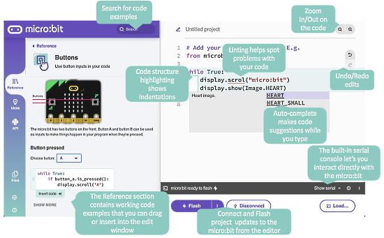
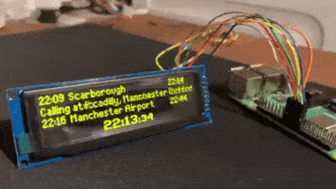
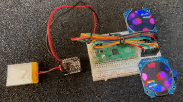
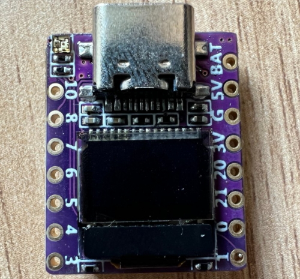
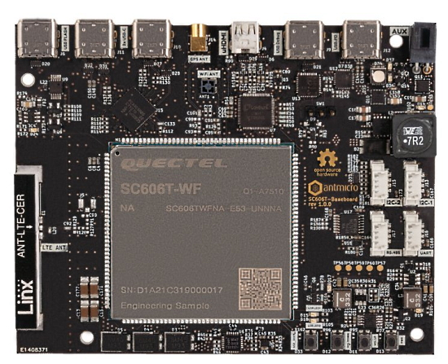
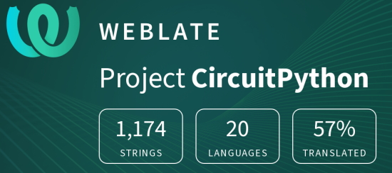

- [X] Kattni updates
- [ ] change date
- [ ] update title
- [ ] Feature story
- [ ] Update  for images
- [ ] Update ICYDNCI
- [ ] All images 550w max only
- [ ] Link "View this email in your browser."

News Sources

- [python.org](https://www.python.org/)
- [Python Insider - dev team blog](https://pythoninsider.blogspot.com/)
- [MicroPython Meetup Blog](https://melbournemicropythonmeetup.github.io/)
- [hackaday.io newest projects MicroPython](https://hackaday.io/projects?tag=micropython&sort=date) and [CircuitPython](https://hackaday.io/projects?tag=circuitpython&sort=date)
- [hackaday CircuitPython](https://hackaday.com/blog/?s=circuitpython) and [MicroPython](https://hackaday.com/blog/?s=micropython)
- [hackster.io CircuitPython](https://www.hackster.io/search?q=circuitpython&i=projects&sort_by=most_recent) and [MicroPython](https://www.hackster.io/search?q=micropython&i=projects&sort_by=most_recent)

View this email in your browser. **Warning: Flashing Imagery**

Welcome to the latest Python on Microcontrollers newsletter! 

We're on [Discord](https://discord.gg/HYqvREz), [Twitter](https://twitter.com/search?q=circuitpython&src=typed_query&f=live), and for past newsletters - [view them all here](https://www.adafruitdaily.com/category/circuitpython/). If you're reading this on the web, [subscribe here](https://www.adafruitdaily.com/). Here's the news this week:

## CircuitPython 7.3.0 Release Candidate 0 Released

CircuitPython 7.3.0 Release Candidate 0 Released - [Adafruit Blog](https://blog.adafruit.com/2022/05/15/circuitpython-7-3-0-release-candidate-0-released/) and [GitHub](https://github.com/adafruit/circuitpython/releases/tag/7.3.0-rc.0).

## The Raspberry Pi Pico Learning Path

The Raspberry Pi Foundation is looking to get kids coding and learning electronics with Raspberry Pi Pico - [Raspberry Pi](https://www.raspberrypi.org/blog/kids-coding-electronics-raspberry-pi-pico-free-learning-resource/) via [Twitter](https://twitter.com/RaspberryPi_org/status/1524329282549559296).

> Now, thanks to our brand-new and free [Introduction to Raspberry Pi Pico](https://projects.raspberrypi.org/en/pathways/pico-intro) learning path, young coders can easily join in and make their own cool Pico projects! This free learning path has six guided projects to help kids to independently develop their coding skills, and their skills in physical computing and electronics.

## PyCon US 2022 Highlights

PyCon US 2022 Highlights: Eric Matthes provides personal highlights from this year’s event - [ehmatthes](https://ehmatthes.com/blog/pycon_2022_highlights/).

##  News from the Python Software Foundation

The 2022 Python Language Summit: There are reports from each of the nine sessions, including "Python without the GIL", The 'Faster CPython' project: 3.12 and beyond", "F-Strings in the grammar", lightning talks, and more - [PSF](https://pyfound.blogspot.com/2022/05/the-2022-python-language-summit_01678898482.html).

## Provide the Micro:bit Educational Foundation Your Feedback

The Micro:bit Educational Foundation recently released a beta version of the new micro:bit Python Editor and they would like to hear about experience using it - [Micro:bit Educational Foundation email](https://mailchi.mp/microbit.org/calling-all-teachers-interested-in-microbit-python-8032695?e=4fa4249cf0).

> We would like teachers to help us test and improve the new micro:bit Python editor by using it with your students and help shape the future of learning text-based coding with the creativity of physical computing. If you are a teacher and are interested in teaching Python with the BBC micro:bit, we would welcome your feedback. Fill out our short form to [apply to join the user study](https://form.jotform.com/221313264750346).

## Keyboard Layouter Plugin for KiCad

Keyboard Layouter is a plugin for KiCad(pcbnew). This plugin places switch footprints in the location specified by JSON of a Keyboard Layout Editor - [GitHub](https://github.com/darakuneko/keyboard-layouter).

## This Week's Python Streams

Python on Hardware is all about building a cooperative ecosphere which allows contributions to be valued and to grow knowledge. Below are the streams within the last week focusing on the community.

### CircuitPython Deep Dive Stream

[This week](https://youtu.be/FK--bFYijBg), Tim streamed work on Advanced DisplayIO Interfaces with TabLayout.

You can see the latest video and past videos on the Adafruit YouTube channel under the Deep Dive playlist - [YouTube](https://www.youtube.com/playlist?list=PLjF7R1fz_OOXBHlu9msoXq2jQN4JpCk8A).

### CircuitPython Parsec

John Park’s CircuitPython Parsec this week is on Cursor Control - [Adafruit Blog](https://blog.adafruit.com/2022/05/13/john-parks-circuitpython-parsec-cursor-control-adafruit-johnedgarpark-adafruit-circuitpython/) and [YouTube](https://youtu.be/RtbfBQ8LUes).

Catch all the episodes in the [YouTube playlist](https://www.youtube.com/playlist?list=PLjF7R1fz_OOWFqZfqW9jlvQSIUmwn9lWr).

### The CircuitPython Show

The CircuitPython Show is an independent podcast hosted by Paul Cutler, talking with people doing awesome things with CircuitPython. Each episode features Paul in conversation with a guest for a short interview – [CircuitPythonShow](https://circuitpythonshow.com/) and [Twitter](https://twitter.com/circuitpyshow).

Liz Clark from Adafruit joins Paul in the latest episode, released May 16.  Liz shares her maker journey and talks about MIDI for beginners – [Show List](https://circuitpythonshow.com/episodes).

### TammyMakesThings is Streaming CircuitPython

Community member and CircuitPython contributor [Tammy Cravit](https://github.com/tammymakesthings) is streaming on Twitch. Her stream focuses on electronics, coding and making, with a focus on CircuitPython. The first few streams have been working on a [MacroPad](https://adafruit.com/product/5128)-based MIDI controller, and she's got lots of other project ideas in the works. An exact schedule for her streams is still being worked out, but she's targeting 2-3 streams per week. Check it out and follow now to be notified of future streams - [Twitch](https://twitch.tv/tammymakesthings).

## Project of the Week: A 3D Printed Stellated Dodecahedron Lit by CircuitPython

A stellated dodecahedron 3D printed and lit with NeoPixels and CircuitPython by GeekMomProjects - [Twitter](https://twitter.com/GeekMomProjects/status/1524843805274275840).

> Printed a stellated dodecahedron with the folding 3D print technique I got from @SignalSkew. Each face prints flat and edges fold to the dihedral angle to form the polyhedron. Sides (and obligatory addressable LED string) are held in place with small zip ties. It's printed in clear PETG at 0.2 mm layer height. Wall thickness 1.5mm. Joined edges are 0.4mm thick. I printed it first with PLA, but flexing the edges more than a dozen or so times while inserting the LEDs broke them. PETG is sturdier.

## News from around the web!

A realistic, real-time, train departure board with Raspberry Pi and Python - [Twitter Thread](https://twitter.com/chrishutchinson/status/1136743837244768257).

Two GC9A01 round TFT LCDs being driven by CircuitPython on a Raspberry Pi Pico, battery powered with an Adafruit QT Py BFF - [Twitter](https://twitter.com/todbot/status/1524482667919552513).

Building a Smart Cooler Monitor Using Circuit Playground Express and CircuitPython - [Adafruit Blog](https://blog.adafruit.com/2022/05/16/smart-cooler-monitor-using-circuit-playground-express/) and [YouTube]().

Using a 74HC595 and a Raspberry Pi Pico with CircuitPython for buttons & LEDs - [Reddit r/CircuitPython](https://www.reddit.com/r/circuitpython/comments/unncb8/ive_been_playing_with_an_74hc595_need_to_get_a/).

Assign chip functions to ANY pin. Both nRF52840 & ESP32-based chips let you do this for many peripherals. A demonstration with CircuitPython - [Twitter](https://twitter.com/todbot/status/1525971406952886272).

text - [site](url).

text - [site](url).

text - [site](url).

text - [site](url).

text - [site](url).

text - [site](url).

text - [site](url).

text - [site](url).

text - [site](url).

A recent Google Protobuf implementation for MicroPython 1.17+ - [GitHub](https://github.com/T0ha/uprotobuf).

> This library in inspired by [micropython-uprotobuf](https://github.com/jazzycamel/micropython-uprotobuf) and [ExProtobuf](https://github.com/elixir-protobuf/protobuf). The main goal is to implement [Google Protocol buffers](https://developers.google.com/protocol-buffers) for MicroPython and embedded systems.

text - [site](url).

Linux commands you should know - a cheatsheet - [Twitter](https://twitter.com/antovtok/status/1521816156063023104/photo/1).

The IoT microconference has been accepted for the 4th year at Linux Plumbers Conference 2022 - [lpc.events](https://lpc.events/event/16/contributions/1152/) via [Twitter](https://twitter.com/cfriedt/status/1524780997027446785).

The Linux Foundation Initiates "World of Open Source" Research Series - [PR Newswire](https://www.prnewswire.com/news-releases/the-linux-foundation-initiates-world-of-open-source-research-series-301547394.html).

Free training course - Ethics for Open Source Development - [Linux Foundation](https://training.linuxfoundation.org/training/ethics-for-open-source-development-lfc104/).

PyDev of the Week:

CircuitPython Weekly Meeting for 

#ICYDNCI What was the most popular, most clicked link, in [last week's newsletter](https://www.adafruitdaily.com/2022/05/10/python-on-microcontrollers-newsletter-python-still-at-1-risc-v-seeks-world-domination-and-more-python-circuitpython-micropython-thepsf/)? [Chip Shortage: ST STM32F405](https://blog.adafruit.com/2022/05/05/chip-shortage-st-stm32f405-chipshortage-adafruit-adafruit-st_world-micropython/).

## New Products

SteamDeck is a tiny board with an LCD screen by [@yongxiangxu251](https://twitter.com/yongxiangxu251). It features an ESP32-C3 processor and can be programed in MicroPython - [Twitter](https://twitter.com/andypiper/status/1524731295917658115).

Open source Qualcomm Snapdragon 625 Baseboard - [Antmicro](https://antmicro.com/blog/2022/05/open-source-snapdragon-625-baseboard/) and [GitHub](https://github.com/antmicro/snapdragon-625-baseboard), via [Twitter](https://twitter.com/antmicro/status/1526153950927409152).

## Feature

text - [site](url).

## New Boards Supported by CircuitPython

The number of supported microcontrollers and Single Board Computers (SBC) grows every week. This section outlines which boards have been included in CircuitPython or added to [CircuitPython.org](https://circuitpython.org/).

This week, there were (#/no) new boards added!

- [Board name](url)
- [Board name](url)
- [Board name](url)

*Note: For non-Adafruit boards, please use the support forums of the board manufacturer for assistance, as Adafruit does not have the hardware to assist in troubleshooting.*

Looking to add a new board to CircuitPython? It's highly encouraged! Adafruit has four guides to help you do so:

- [How to Add a New Board to CircuitPython](https://learn.adafruit.com/how-to-add-a-new-board-to-circuitpython/overview)
- [How to add a New Board to the circuitpython.org website](https://learn.adafruit.com/how-to-add-a-new-board-to-the-circuitpython-org-website)
- [Adding a Single Board Computer to PlatformDetect for Blinka](https://learn.adafruit.com/adding-a-single-board-computer-to-platformdetect-for-blinka)
- [Adding a Single Board Computer to Blinka](https://learn.adafruit.com/adding-a-single-board-computer-to-blinka)

## New Learn Guides!

[RPi Stock Alert Alarm](https://learn.adafruit.com/rpi-stock-alert-alarm) from [John Park](https://learn.adafruit.com/users/johnpark)

[Edit CircuitPython Code on iOS with Runestone](https://learn.adafruit.com/editing-circuitpython-on-ios-with-runestone) from [Melissa LeBlanc-Williams](https://learn.adafruit.com/users/MakerMelissa)

## CircuitPython Libraries!

CircuitPython support for hardware continues to grow. We are adding support for new sensors and breakouts all the time, as well as improving on the drivers we already have. As we add more libraries and update current ones, you can keep up with all the changes right here!

For the latest libraries, download the [Adafruit CircuitPython Library Bundle](https://circuitpython.org/libraries). For the latest community contributed libraries, download the [CircuitPython Community Bundle](https://github.com/adafruit/CircuitPython_Community_Bundle/releases).

If you'd like to contribute, CircuitPython libraries are a great place to start. Have an idea for a new driver? File an issue on [CircuitPython](https://github.com/adafruit/circuitpython/issues)! Have you written a library you'd like to make available? Submit it to the [CircuitPython Community Bundle](https://github.com/adafruit/CircuitPython_Community_Bundle). Interested in helping with current libraries? Check out the [CircuitPython.org Contributing page](https://circuitpython.org/contributing). We've included open pull requests and issues from the libraries, and details about repo-level issues that need to be addressed. We have a guide on [contributing to CircuitPython with Git and GitHub](https://learn.adafruit.com/contribute-to-circuitpython-with-git-and-github) if you need help getting started. You can also find us in the #circuitpython channels on the [Adafruit Discord](https://adafru.it/discord).

You can check out this [list of all the Adafruit CircuitPython libraries and drivers available](https://github.com/adafruit/Adafruit_CircuitPython_Bundle/blob/master/circuitpython_library_list.md). 

The current number of CircuitPython libraries is **356**!

**New Libraries!**

Here's this week's new CircuitPython libraries:

 * [Adafruit_CircuitPython_floppy](https://github.com/adafruit/Adafruit_CircuitPython_floppy)

**Updated Libraries!**

Here's this week's updated CircuitPython libraries:

 * [Adafruit_CircuitPython_BNO055](https://github.com/adafruit/Adafruit_CircuitPython_BNO055)
 * [Adafruit_CircuitPython_Logging](https://github.com/adafruit/Adafruit_CircuitPython_Logging)
 * [Adafruit_CircuitPython_AzureIoT](https://github.com/adafruit/Adafruit_CircuitPython_AzureIoT)
 * [Adafruit_CircuitPython_ImageLoad](https://github.com/adafruit/Adafruit_CircuitPython_ImageLoad)
 * [Adafruit_CircuitPython_JWT](https://github.com/adafruit/Adafruit_CircuitPython_JWT)
 * [Adafruit_CircuitPython_RFM9x](https://github.com/adafruit/Adafruit_CircuitPython_RFM9x)
 * [Adafruit_CircuitPython_VL53L1X](https://github.com/adafruit/Adafruit_CircuitPython_VL53L1X)
 * [Adafruit_CircuitPython_DisplayIO_Layout](https://github.com/adafruit/Adafruit_CircuitPython_DisplayIO_Layout)
 * [Adafruit_CircuitPython_PIOASM](https://github.com/adafruit/Adafruit_CircuitPython_PIOASM)
 * [Adafruit_CircuitPython_MCP9600](https://github.com/adafruit/Adafruit_CircuitPython_MCP9600)
 * [Adafruit_Blinka_Displayio](https://github.com/adafruit/Adafruit_Blinka_Displayio)

## What’s the team up to this week?

What is the team up to this week? Let’s check in!

**Dan**

I'm continuing to work on ESP32-nn I2C issues. I worked with an Espressif engineer, who gave me a fix for one bug, which we've incorporated into our builds. There is another bug appearing only on ESP32-S3, and I've reproduced that in a simple test program outside of CircuitPython and passed on the information.

We should be able to publish the first release candidate for CircuitPython 7.3.0 soon. The final pull requests are being finished.

**Jeff**

Check out the updated guide on using the RP2040's PIO peripheral with CircuitPython: https://learn.adafruit.com/intro-to-rp2040-pio-with-circuitpython/overview

I started out adding support for an arbitrary number of servo motors with PWM, to work with Pimoroni's Servo 2040 board. But this work opened up my inner eye and let me grasp other ways to use PIO to control LEDs & NeoPixels in the background while CircuitPython code keeps on chugging.

I won't be doing weekly updates for a bit, as I'm taking a much needed break. See you in July!

**Kattni**

I'm still settling in from PyCon 2022. Tim put together the numbers from the outcome of the sprints; we had 14 PRs from 8 authors. As I said before, it was an amazing experience, and it was great to see so many new contributors join us for the sprints!

I spent this week getting caught up on guide feedback (down to 0!), and testing PyLeap features with CircuitPython updates. I also taught Liz how to create Fritzing objects. She learned quickly, as usual, and even though she encountered issues (as is expected with Fritzing object creation), she has already done a few on her own!

I also started on a new guide page in the Welcome to CircuitPython guide that explains the three different ways CircuitPython libraries can be placed on or accessed from a microcontroller. We get questions about this regularly, so folks are definitely interested in the content. This page will be a detailed explanation of .mpy files, .py files, and frozen modules in CircuitPython. If you want more information on this, keep an eye out for this new page!

**Melissa**

This past week, after arriving back safely from PyCon, I worked on a bunch of small GitHub issues and reviewed some outstanding Pull Requests. After that, I wrote up [a guide](https://learn.adafruit.com/editing-circuitpython-on-ios-with-runestone/) on using [Runestone](https://runestone.app/) to edit CircuitPython code on iOS devices. One of the things that came out of that guide was realizing we needed the bootloaders of devices to advertise they only used 100ma so that the device wouldn't stop working. Once that was finished, I started working on the final eInk guide for the 2.7" ePaper displays.

**Tim**

I tested out a PR for RFM9x Radios, and in doing so uncovered a potential issue when using them along with SDCards on the same SPI bus. Another one of the larger PRs that I tested this week was for the EMC2101 fan controller breakout. I've used both of these devices before but only briefly so it was a fun to get them set back up and try out the examples and other code on them. My TabLayout displayio widget was merged into the DisplayIO_Layout library this week and I've been helping community member PaulSK prepare some additional examples for it that they worked on. I'll be continuing to build out more advanced examples that use it during Deep Dive this week and throughout the upcoming weekend.

**Scott**

This week I'm booting back up after six weeks of paternity leave. I've gotten through email and given up on past chats. So, I'm onto some bug fixes. First on my list is fixing CircuitPython's reload interaction with transferring files over BLE. Next I'll be updating the NTP library to actually use NTP to fetch the time. Currently it relies on ESP32SPI to get the time.

**Liz**

This week I wrapped up the Laser Harp guide. I'm really pleased with how it turned out. I was able to expand on it a bit and add some more features, such as multiple synth instruments depending on the height that you're playing at, pitchbend and volume control. I'm going to be doing some testing to ensure that the project can also be built with a Feather RP2040 since I ran into some I2C mux issues with the board originally, but in the depths of project assembly it was hard to tell whether it was something on my end or something funkier. I also wrote some code for JP's Raspberry Pi in stock alarm. 

Kattni has shown me how to create Fritzing objects (thanks Kattni!) so I've been working on a few to become familiar with it. So far it's going pretty well. This week I'll be continuing with Fritzing things, writing up a guide for the CP2102N and working on a new project: wireless LED maracas.

## Upcoming events!

The next MicroPython Meetup in Melbourne will be on April 27th – [Meetup](https://www.meetup.com/MicroPython-Meetup/). See the [slides](https://docs.google.com/presentation/d/e/2PACX-1vSYt41VJm6ptM-aFKbnTPhucX-NZ2kXP7B7kbEp6Le9lidSfB7SKoNflvlCgCsJ0AOURAS-tamDVENX/pub?slide=id.p) of the March 23rd meeting.

PyCon Italia is the Italian conference on Python. Organized by Python Italia, it is one of the more important Python conferences in Europe. With over 700 attendees, the next edition will be June 2-5, 2022 - [Ticket Registration](https://pycon.it/en/tickets).

SciPy 2022, the 21st annual Scientific Computing with Python conference, will be held in Austin, Texas, USA from July 11-17, 2022. The annual SciPy Conference brings together attendees from industry, academia, and government to showcase their latest projects, learn from skilled users and developers, and collaborate on code development. The full program will consist of 2 days tutorials (July 11-12), 3 days of talks (July 13-15) and 2 days of developer sprints (July 16-17) - [SciPy 2022](https://www.scipy2022.scipy.org/).

EuroPython 2022 will be held on 11th-17th July 2022 and it will be both in person and virtual. The in-person conference will be held at [The Convention Centre](https://www.theccd.ie/) Dublin (The CCD) in Dublin, Ireland - [EuroPython 2022](https://ep2022.europython.eu/).

PyOhio is a non-profit annual Python community conference usually held in Columbus, OH. It is being held online starting Saturday, Jul 30, 2022. It is free to attend and welcomes anyone with an interest in Python. Content ranges from beginner to advanced and is intended to be relevant to all types of Python users: students, software professionals, scientists, hobbyists, and anyone looking to learn more.

This year’s event will consist of 5 and 10-minute talks and sprints - [PyOhio2022](https://www.pyohio.org/2022/)

**Send Your Events In**

As for other events, with the COVID pandemic, most in-person events are postponed or cancelled. If you know of virtual events or events that may occur in the future, please let us know on Twitter with hashtag #CircuitPython or email to cpnews(at)adafruit(dot)com.

## Latest releases

CircuitPython's stable release is [#.#.#](https://github.com/adafruit/circuitpython/releases/latest) and its unstable release is [#.#.#-##.#](https://github.com/adafruit/circuitpython/releases). New to CircuitPython? Start with our [Welcome to CircuitPython Guide](https://learn.adafruit.com/welcome-to-circuitpython).

[2022####](https://github.com/adafruit/Adafruit_CircuitPython_Bundle/releases/latest) is the latest CircuitPython library bundle.

[v#.#.#](https://micropython.org/download) is the latest MicroPython release. Documentation for it is [here](http://docs.micropython.org/en/latest/pyboard/).

[#.#.#](https://www.python.org/downloads/) is the latest Python release. The latest pre-release version is [#.#.#](https://www.python.org/download/pre-releases/).

[#,### Stars](https://github.com/adafruit/circuitpython/stargazers) Like CircuitPython? [Star it on GitHub!](https://github.com/adafruit/circuitpython)

## Call for help -- Translating CircuitPython is now easier than ever!

One important feature of CircuitPython is translated control and error messages. With the help of fellow open source project [Weblate](https://weblate.org/), we're making it even easier to add or improve translations. 

Sign in with an existing account such as GitHub, Google or Facebook and start contributing through a simple web interface. No forks or pull requests needed! As always, if you run into trouble join us on [Discord](https://adafru.it/discord), we're here to help.

## jobs.adafruit.com - Find a dream job, find great candidates!

[jobs.adafruit.com](https://jobs.adafruit.com/) has returned and folks are posting their skills (including CircuitPython) and companies are looking for talented makers to join their companies - from Digi-Key, to Hackaday, Micro Center, Raspberry Pi and more.

**Job of the Week**

text - [Adafruit Jobs Board](https://jobs.adafruit.com/).

## NUMBER thanks!

The Adafruit Discord community, where we do all our CircuitPython development in the open, reached over NUMBER humans - thank you!  Adafruit believes Discord offers a unique way for Python on hardware folks to connect. Join today at [https://adafru.it/discord](https://adafru.it/discord).

## ICYMI - In case you missed it

Python on hardware is the Adafruit Python video-newsletter-podcast! The news comes from the Python community, Discord, Adafruit communities and more and is broadcast on ASK an ENGINEER Wednesdays. The complete Python on Hardware weekly videocast [playlist is here](https://www.youtube.com/playlist?list=PLjF7R1fz_OOXRMjM7Sm0J2Xt6H81TdDev). The video podcast is on [iTunes](https://itunes.apple.com/us/podcast/python-on-hardware/id1451685192?mt=2), [YouTube](http://adafru.it/pohepisodes), [IGTV (Instagram TV](https://www.instagram.com/adafruit/channel/)), and [XML](https://itunes.apple.com/us/podcast/python-on-hardware/id1451685192?mt=2).

[The weekly community chat on Adafruit Discord server CircuitPython channel - Audio / Podcast edition](https://itunes.apple.com/us/podcast/circuitpython-weekly-meeting/id1451685016) - Audio from the Discord chat space for CircuitPython, meetings are usually Mondays at 2pm ET, this is the audio version on [iTunes](https://itunes.apple.com/us/podcast/circuitpython-weekly-meeting/id1451685016), Pocket Casts, [Spotify](https://adafru.it/spotify), and [XML feed](https://adafruit-podcasts.s3.amazonaws.com/circuitpython_weekly_meeting/audio-podcast.xml).

## Codecademy "Learn Hardware Programming with CircuitPython"

Codecademy, an online interactive learning platform used by more than 45 million people, has teamed up with Adafruit to create a coding course, “Learn Hardware Programming with CircuitPython”. The course is now available in the [Codecademy catalog](https://www.codecademy.com/learn/learn-circuitpython?utm_source=adafruit&utm_medium=partners&utm_campaign=circuitplayground&utm_content=pythononhardwarenewsletter).

## Contribute!

The CircuitPython Weekly Newsletter is a CircuitPython community-run newsletter emailed every Tuesday. The complete [archives are here](https://www.adafruitdaily.com/category/circuitpython/). It highlights the latest CircuitPython related news from around the web including Python and MicroPython developments. To contribute, edit next week's draft [on GitHub](https://github.com/adafruit/circuitpython-weekly-newsletter/tree/gh-pages/_drafts) and [submit a pull request](https://help.github.com/articles/editing-files-in-your-repository/) with the changes. You may also tag your information on Twitter with #CircuitPython. 

Join the Adafruit [Discord](https://adafru.it/discord) or [post to the forum](https://forums.adafruit.com/viewforum.php?f=60) if you have questions.

