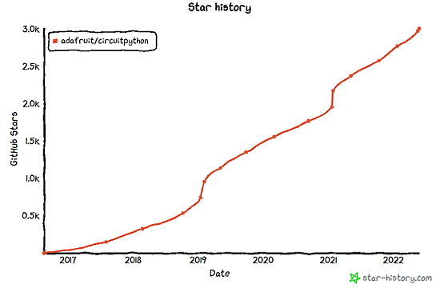
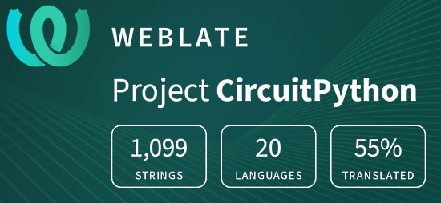

- [ ] Kattni updates
- [ ] change date
- [ ] update title
- [ ] Feature story
- [ ] Update  for images
- [ ] Update ICYDNCI
- [ ] All images 550w max only
- [ ] Link "View this email in your browser."

News Sources

- [python.org](https://www.python.org/)
- [Python Insider - dev team blog](https://pythoninsider.blogspot.com/)
- [MicroPython Meetup Blog](https://melbournemicropythonmeetup.github.io/)
- [hackaday.io newest projects MicroPython](https://hackaday.io/projects?tag=micropython&sort=date) and [CircuitPython](https://hackaday.io/projects?tag=circuitpython&sort=date)
- [hackaday CircuitPython](https://hackaday.com/blog/?s=circuitpython) and [MicroPython](https://hackaday.com/blog/?s=micropython)
- [hackster.io CircuitPython](https://www.hackster.io/search?q=circuitpython&i=projects&sort_by=most_recent) and [MicroPython](https://www.hackster.io/search?q=micropython&i=projects&sort_by=most_recent)

View this email in your browser. **Warning: Flashing Imagery**

Welcome to the latest Python on Microcontrollers newsletter! 

We're on [Discord](https://discord.gg/HYqvREz), [Twitter](https://twitter.com/search?q=circuitpython&src=typed_query&f=live), and for past newsletters - [view them all here](https://www.adafruitdaily.com/category/circuitpython/). If you're reading this on the web, [subscribe here](https://www.adafruitdaily.com/). Here's the news this week:

## Headline Article

text - [site](url).

## The CircuitPython GitHub Repo Reaches 3,000 Stars

The [CircuitPython GitHub repository](https://github.com/adafruit/circuitpython) exceeded 3,000 Stargazers this week! Thank you to all the people who have chosen to star the CircuitPython code repository - [Adafruit Blog](https://blog.adafruit.com/2022/05/27/circuitpython-reaches-3000-stars-on-github-circuitpython-github-adafruit/) and [GitHub](https://github.com/adafruit/circuitpython/stargazers).

## Make: Boards Guide Reviews the Adafruit Metro ESP32-S2

Make reviews the Adafruit Metro ESP32-S2 microcontroller board - [Makezine](https://makezine.com/products/boards/adafruit-metro-esp32-s2/).

> The Adafruit Metro ESP32-S2 packages the best features of Adafruit’s recent microcontroller boards in a traditional Arduino Uno form factor. The heart of the board, the Espressif ESP32-S2, improves on the ESP line of Wi-Fi-enabled microcontrollers by adding native USB support. The addition of USB mass storage to the platform allows drag-and-drop deployment of Adafruit’s [CircuitPython](https://circuitpython.org/), making the board very easy to program. It also allows the board to act as a USB input device (HID).

## Anne Barela talks CircuitPython with CrowdSupply's Helen Leigh

The CrowdSupply Teardown Sessions, a series of interviews and hands-on learning sessions with Crowd Supply creators, staff, and lots of special guests hosts Anne Barela *(your editor)* to discuss CircuitPython and more - [YouTube](https://www.youtube.com/watch?v=zf1SJ5o7F0M).

Also watch CrowdSupply's Teardown Session 22: Python on Hardware with StereoPi - [YouTube](https://www.youtube.com/watch?v=enEAIroczyQ).

## Feature

text - [site](url).

## This Week's Python Streams

Python on Hardware is all about building a cooperative ecosphere which allows contributions to be valued and to grow knowledge. Below are the streams within the last week focusing on the community.

### CircuitPython Deep Dive Stream

[This week](link), Tim streamed work on {subject}.

You can see the latest video and past videos on the Adafruit YouTube channel under the Deep Dive playlist - [YouTube](https://www.youtube.com/playlist?list=PLjF7R1fz_OOXBHlu9msoXq2jQN4JpCk8A).

### CircuitPython Parsec

John Park’s CircuitPython Parsec this week is on {subject} - [Adafruit Blog](link) and [YouTube](link).

Catch all the episodes in the [YouTube playlist](https://www.youtube.com/playlist?list=PLjF7R1fz_OOWFqZfqW9jlvQSIUmwn9lWr).

### The CircuitPython Show

The CircuitPython Show is a new independent podcast, hosted by Paul Cutler, focusing on the people doing awesome things with CircuitPython. Each episode features Paul in conversation with a guest for a short interview – [CircuitPythonShow](https://circuitpythonshow.com/) and [Twitter](https://twitter.com/circuitpyshow).

Pierre Constantineau joins Paul in the latest episode, released May 30th. They have an in-depth conversation about mechanical keyboards and how CircuitPython has helped – [Show List](https://circuitpythonshow.com/episodes).

### TammyMakesThings is Streaming CircuitPython

Community member and CircuitPython contributor [Tammy Cravit](https://github.com/tammymakesthings) is streaming on Twitch. Her stream focuses on electronics, coding and making, with a focus on CircuitPython. The first few streams have been working on a [MacroPad](https://adafruit.com/product/5128)-based MIDI controller, and she's got lots of other project ideas in the works. An exact schedule for her streams is still being worked out, but she's targeting 2-3 streams per week. Check it out and follow now to be notified of future streams - [Twitch](https://twitch.tv/tammymakesthings).

## Project of the Week

text - [site](url).

## News from around the web!

text - [site](url).

text - [site](url).

text - [site](url).

text - [site](url).

text - [site](url).

text - [site](url).

text - [site](url).

text - [site](url).

text - [site](url).

text - [site](url).

text - [site](url).

text - [site](url).

text - [site](url).

text - [site](url).

text - [site](url).

text - [site](url).

text - [site](url).

The unreasonable effectiveness of f‍-‍strings and re.VERBOSE, to look at one or two ways to make life easier when working with Python regular expressions - [death.andgravity](https://death.andgravity.com/f-re).

text - [site](url).

text - [site](url).

Import Tracker is a Python package offering a number of capabilities related to tracking and managing optional dependencies in Python projects - [GitHub](https://github.com/IBM/import-tracker).

PyDev of the Week:

CircuitPython Weekly Meeting for 

#ICYDNCI What was the most popular, most clicked link, in [last week's newsletter](https://www.adafruitdaily.com/2022/05/24/python-on-microcontrollers-newsletter-300-circuitpython-boards-micropython-sponsorship-targets-circuitpython-7-3-more-python-circuitpython-micropython-thepsf/)? [12 Books Recommendation for Embedded Systems Learners](https://www.linkedin.com/feed/update/urn:li:activity:6925242924972568576/).

## Coming Soon

text - [site](url).

text - [site](url).

## New Boards Supported by CircuitPython

The number of supported microcontrollers and Single Board Computers (SBC) grows every week. This section outlines which boards have been included in CircuitPython or added to [CircuitPython.org](https://circuitpython.org/).

This week, there were (#/no) new boards added!

- [Board name](url)
- [Board name](url)
- [Board name](url)

*Note: For non-Adafruit boards, please use the support forums of the board manufacturer for assistance, as Adafruit does not have the hardware to assist in troubleshooting.*

Looking to add a new board to CircuitPython? It's highly encouraged! Adafruit has four guides to help you do so:

- [How to Add a New Board to CircuitPython](https://learn.adafruit.com/how-to-add-a-new-board-to-circuitpython/overview)
- [How to add a New Board to the circuitpython.org website](https://learn.adafruit.com/how-to-add-a-new-board-to-the-circuitpython-org-website)
- [Adding a Single Board Computer to PlatformDetect for Blinka](https://learn.adafruit.com/adding-a-single-board-computer-to-platformdetect-for-blinka)
- [Adding a Single Board Computer to Blinka](https://learn.adafruit.com/adding-a-single-board-computer-to-blinka)

## New Learn Guides!

[title](url) from [name](url)

[title](url) from [name](url)

[title](url) from [name](url)

## Updated Learn Guides!

[title](url) from [name](url)

## CircuitPython Libraries!

CircuitPython support for hardware continues to grow. We are adding support for new sensors and breakouts all the time, as well as improving on the drivers we already have. As we add more libraries and update current ones, you can keep up with all the changes right here!

For the latest libraries, download the [Adafruit CircuitPython Library Bundle](https://circuitpython.org/libraries). For the latest community contributed libraries, download the [CircuitPython Community Bundle](https://github.com/adafruit/CircuitPython_Community_Bundle/releases).

If you'd like to contribute, CircuitPython libraries are a great place to start. Have an idea for a new driver? File an issue on [CircuitPython](https://github.com/adafruit/circuitpython/issues)! Have you written a library you'd like to make available? Submit it to the [CircuitPython Community Bundle](https://github.com/adafruit/CircuitPython_Community_Bundle). Interested in helping with current libraries? Check out the [CircuitPython.org Contributing page](https://circuitpython.org/contributing). We've included open pull requests and issues from the libraries, and details about repo-level issues that need to be addressed. We have a guide on [contributing to CircuitPython with Git and GitHub](https://learn.adafruit.com/contribute-to-circuitpython-with-git-and-github) if you need help getting started. You can also find us in the #circuitpython channels on the [Adafruit Discord](https://adafru.it/discord).

You can check out this [list of all the Adafruit CircuitPython libraries and drivers available](https://github.com/adafruit/Adafruit_CircuitPython_Bundle/blob/master/circuitpython_library_list.md). 

The current number of CircuitPython libraries is **###**!

**New Libraries!**

Here's this week's new CircuitPython libraries:

* [library](url)

**Updated Libraries!**

Here's this week's updated CircuitPython libraries:

* [library](url)

## What’s the team up to this week?

What is the team up to this week? Let’s check in!

**Dan**

I released CircuitPython 7.3.0 final. Thanks to everyone who contributed to this release! We have one known regression from 7.2.5, involving multiple rotary encoders on Espressif boards, which I fixed. I will wait a few days to see what else comes up before doing a 7.3.1.

I've incorporated some of the incompatible changes we planned to make for 8.0.0 onto the `main` branch.

I'm looking at speeding up the GitHub Actions runs by not using the LTO compilation option when not necessary, and changing some LTO settings as well, when space is not at an absolute premium.

I'm also still working on fixing some ESP32SPI problems.

**Kattni**

The last week has been mostly miscellaneous and a couple of new guides. There is a guide in progress about how to add a project to PyLeap. 

I published the Adafruit QT Py ESP32 Pico guide. It has everything you need to get started with the QT Py ESP32 Pico, including pinouts, Arduino set up and examples, and downloads resources. If you managed to pick up one of these new boards, check out the guide!

**Melissa**

This past week I finished going through guide feedback for guides that I had previously worked on updating, but were under another author's name. After that was finished, I went through and updated the [Introducing Adafruit Feather](https://learn.adafruit.com/adafruit-feather) guide with all the new Feathers and FeatherWings that had come out since the guide was last updated, which was not long before I started working with Adafruit.

**Tim**

I tested a network requests issue when making repeated requests to a nodeJS server, I tried with an ESP32-S2 based device to determine if the issue was specific to ESP32SPI or not. I also did some testing and made a PR to resolve a core issue that causes reduced brightness range on the PyPortal Titano display. I'm working on making TileGrid objects have a `contains()` method similar to the Display Button library so that any Bitmap, OnDiskBitmap or other thing that uses TileGrid can be easily integrated with touch interaction. 

**Scott**

This week I've been running some analysis on CircuitPython binaries to try and find some code to remove. I've learned a lot about the ELF file format but haven't found anything significant. My work is in the [elf-section-graph repo](https://github.com/adafruit/elf-section-graph). After visualizing it with Gephi, I've moved to a simpler treemap visualization that is common to look at how big folders and subtrees are. To make viewing a treemap, I created https://treemap.dev. It will make it easy to view treemaps.

I haven't quite finished my DotEnv work because Dan found a bug (thank you!). I hope to squash it tomorrow and get it checked in.

After that I'll be continuing to work on the web workflow when not taking care of our new baby.

**Liz**

This past week I wrapped up the [traffic light conference badge guide](https://learn.adafruit.com/traffic-light-conference-badge), a guide for [installing drivers for WCH USB to serial chips](https://learn.adafruit.com/how-to-install-drivers-for-wch-usb-to-serial-chips/overview) and a getting started guide for the [NAU7802 STEMMA board](https://learn.adafruit.com/adafruit-nau7802-24-bit-adc-stemma-qt-qwiic). Big thanks to Kattni for walking through the Mac install steps for the WCH driver and getting screenshots.

This coming week I'll be working on some CircuitPython IoT projects. I'm going to be doing some projects using Azure and I'll be doing a project with the Ruiz brothers for a weather display. I'll also be working on a new product guide for the QT Py ESP32-S3. It will be my first new dev board guide.

## Upcoming events!

The next MicroPython Meetup in Melbourne will be on April 27th – [Meetup](https://www.meetup.com/MicroPython-Meetup/). See the [slides](https://docs.google.com/presentation/d/e/2PACX-1vSYt41VJm6ptM-aFKbnTPhucX-NZ2kXP7B7kbEp6Le9lidSfB7SKoNflvlCgCsJ0AOURAS-tamDVENX/pub?slide=id.p) of the March 23rd meeting.

PyCon Italia is the Italian conference on Python. Organized by Python Italia, it is one of the more important Python conferences in Europe. With over 700 attendees, the next edition will be June 2-5, 2022 - [Ticket Registration](https://pycon.it/en/tickets).

SciPy 2022, the 21st annual Scientific Computing with Python conference, will be held in Austin, Texas, USA from July 11-17, 2022. The annual SciPy Conference brings together attendees from industry, academia, and government to showcase their latest projects, learn from skilled users and developers, and collaborate on code development. The full program will consist of 2 days tutorials (July 11-12), 3 days of talks (July 13-15) and 2 days of developer sprints (July 16-17) - [SciPy 2022](https://www.scipy2022.scipy.org/).

EuroPython 2022 will be held on 11th-17th July 2022 and it will be both in person and virtual. The in-person conference will be held at [The Convention Centre](https://www.theccd.ie/) Dublin (The CCD) in Dublin, Ireland - [EuroPython 2022](https://ep2022.europython.eu/).

PyOhio is a non-profit annual Python community conference usually held in Columbus, OH. It is being held online starting Saturday, Jul 30, 2022. It is free to attend and welcomes anyone with an interest in Python. Content ranges from beginner to advanced and is intended to be relevant to all types of Python users: students, software professionals, scientists, hobbyists, and anyone looking to learn more - [PyOhio](https://www.pyohio.org/2022/).

**Send Your Events In**

As for other events, with the COVID pandemic, most in-person events are postponed or cancelled. If you know of virtual events or events that may occur in the future, please let us know on Twitter with hashtag #CircuitPython or email to cpnews(at)adafruit(dot)com.

## Latest releases

CircuitPython's stable release is [#.#.#](https://github.com/adafruit/circuitpython/releases/latest) and its unstable release is [#.#.#-##.#](https://github.com/adafruit/circuitpython/releases). New to CircuitPython? Start with our [Welcome to CircuitPython Guide](https://learn.adafruit.com/welcome-to-circuitpython).

[2022####](https://github.com/adafruit/Adafruit_CircuitPython_Bundle/releases/latest) is the latest CircuitPython library bundle.

[v#.#.#](https://micropython.org/download) is the latest MicroPython release. Documentation for it is [here](http://docs.micropython.org/en/latest/pyboard/).

[#.#.#](https://www.python.org/downloads/) is the latest Python release. The latest pre-release version is [#.#.#](https://www.python.org/download/pre-releases/).

[#,### Stars](https://github.com/adafruit/circuitpython/stargazers) Like CircuitPython? [Star it on GitHub!](https://github.com/adafruit/circuitpython)

## Call for help -- Translating CircuitPython is now easier than ever!

One important feature of CircuitPython is translated control and error messages. With the help of fellow open source project [Weblate](https://weblate.org/), we're making it even easier to add or improve translations. 

Sign in with an existing account such as GitHub, Google or Facebook and start contributing through a simple web interface. No forks or pull requests needed! As always, if you run into trouble join us on [Discord](https://adafru.it/discord), we're here to help.

## jobs.adafruit.com - Find a dream job, find great candidates!

[jobs.adafruit.com](https://jobs.adafruit.com/) has returned and folks are posting their skills (including CircuitPython) and companies are looking for talented makers to join their companies - from Digi-Key, to Hackaday, Micro Center, Raspberry Pi and more.

**Job of the Week**

MatrixPortal project utilizing WIFI - BOB PROPERTY LLC - [Adafruit Jobs Board](https://jobs.adafruit.com/job/matrixportal-project-utilizing-wifi/).

## 34,477 thanks!

The Adafruit Discord community, where we do all our CircuitPython development in the open, reached over 34,477 humans - thank you!  Adafruit believes Discord offers a unique way for Python on hardware folks to connect. Join today at [https://adafru.it/discord](https://adafru.it/discord).

## ICYMI - In case you missed it

Python on hardware is the Adafruit Python video-newsletter-podcast! The news comes from the Python community, Discord, Adafruit communities and more and is broadcast on ASK an ENGINEER Wednesdays. The complete Python on Hardware weekly videocast [playlist is here](https://www.youtube.com/playlist?list=PLjF7R1fz_OOXRMjM7Sm0J2Xt6H81TdDev). The video podcast is on [iTunes](https://itunes.apple.com/us/podcast/python-on-hardware/id1451685192?mt=2), [YouTube](http://adafru.it/pohepisodes), [IGTV (Instagram TV](https://www.instagram.com/adafruit/channel/)), and [XML](https://itunes.apple.com/us/podcast/python-on-hardware/id1451685192?mt=2).

[The weekly community chat on Adafruit Discord server CircuitPython channel - Audio / Podcast edition](https://itunes.apple.com/us/podcast/circuitpython-weekly-meeting/id1451685016) - Audio from the Discord chat space for CircuitPython, meetings are usually Mondays at 2pm ET, this is the audio version on [iTunes](https://itunes.apple.com/us/podcast/circuitpython-weekly-meeting/id1451685016), Pocket Casts, [Spotify](https://adafru.it/spotify), and [XML feed](https://adafruit-podcasts.s3.amazonaws.com/circuitpython_weekly_meeting/audio-podcast.xml).

## Codecademy "Learn Hardware Programming with CircuitPython"

Codecademy, an online interactive learning platform used by more than 45 million people, has teamed up with Adafruit to create a coding course, “Learn Hardware Programming with CircuitPython”. The course is now available in the [Codecademy catalog](https://www.codecademy.com/learn/learn-circuitpython?utm_source=adafruit&utm_medium=partners&utm_campaign=circuitplayground&utm_content=pythononhardwarenewsletter).

## Contribute!

The CircuitPython Weekly Newsletter is a CircuitPython community-run newsletter emailed every Tuesday. The complete [archives are here](https://www.adafruitdaily.com/category/circuitpython/). It highlights the latest CircuitPython related news from around the web including Python and MicroPython developments. To contribute, edit next week's draft [on GitHub](https://github.com/adafruit/circuitpython-weekly-newsletter/tree/gh-pages/_drafts) and [submit a pull request](https://help.github.com/articles/editing-files-in-your-repository/) with the changes. You may also tag your information on Twitter with #CircuitPython. 

Join the Adafruit [Discord](https://adafru.it/discord) or [post to the forum](https://forums.adafruit.com/viewforum.php?f=60) if you have questions.
