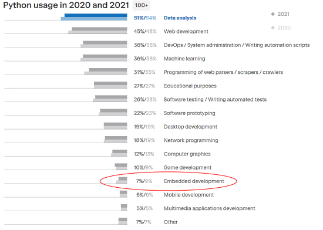
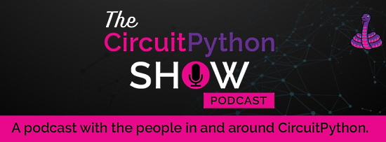
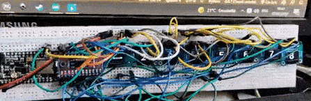
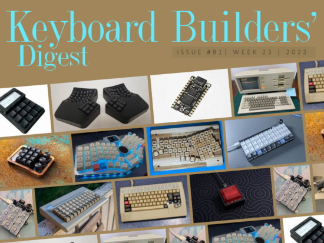
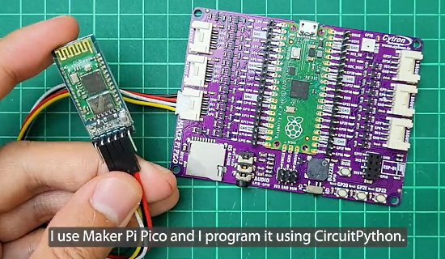
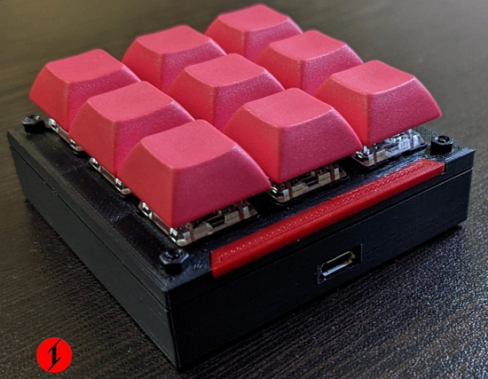
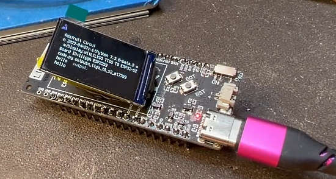
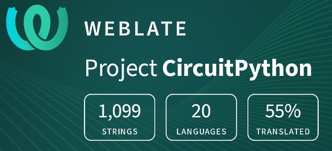

- [X] Kattni updates
- [ ] change date
- [ ] update title
- [ ] Feature story
- [ ] Update  for images
- [ ] Update ICYDNCI
- [ ] All images 550w max only
- [ ] Link "View this email in your browser."

News Sources

- [python.org](https://www.python.org/)
- [Python Insider - dev team blog](https://pythoninsider.blogspot.com/)
- [MicroPython Meetup Blog](https://melbournemicropythonmeetup.github.io/)
- [hackaday.io newest projects MicroPython](https://hackaday.io/projects?tag=micropython&sort=date) and [CircuitPython](https://hackaday.io/projects?tag=circuitpython&sort=date)
- [hackaday CircuitPython](https://hackaday.com/blog/?s=circuitpython) and [MicroPython](https://hackaday.com/blog/?s=micropython)
- [hackster.io CircuitPython](https://www.hackster.io/search?q=circuitpython&i=projects&sort_by=most_recent) and [MicroPython](https://www.hackster.io/search?q=micropython&i=projects&sort_by=most_recent)

Template last updated on 2022-05-19 - add PyOhio

View this email in your browser. **Warning: Flashing Imagery**

Welcome to the latest Python on Microcontrollers newsletter! 

We're on [Discord](https://discord.gg/HYqvREz), [Twitter](https://twitter.com/search?q=circuitpython&src=typed_query&f=live), and for past newsletters - [view them all here](https://www.adafruitdaily.com/category/circuitpython/). If you're reading this on the web, [subscribe here](https://www.adafruitdaily.com/). Here's the news this week:

## The Latest Python Developers Survey Results Are Out

The Python Software Foundation (PSF) announced the results of their fifth official annual Python Developers Survey. The work is done each year as a collaborative effort between the PSF and JetBrains. Late last year, more than 23,000 Python developers and enthusiasts from almost 200 countries/regions participated in the survey to reveal the current state of the language and the ecosystem around it.

)

Python is being used by the vast majority (84%) of survey respondents as their primary language and by many others as just one more tool in their box. - [PSF Blog](https://pyfound.blogspot.com/2022/06/python-developers-survey-2021-python-is.html) and [survey results summary](https://lp.jetbrains.com/python-developers-survey-2021/).

## Python 3.11 is up to 10-60% faster than Python 3.10

Python 3.11.0 has reached beta 1 status and is close to release. It is up to 10-60% faster than Python 3.10. On average, developers measured a 1.25x speedup on the standard benchmark suite. How is this being done? Python 3.11 is the first release to benefit from a project called Faster CPython, where CPython is the standard version of the interpreter. Faster CPython is a project funded by Microsoft, whose members include Python inventor Guido van Rossum - [Analytics Insight](https://www.analyticsinsight.net/welcome-python-3-11-an-upgrade-to-counter-decades-long-speed-issue/).

## Life as a Python Software Foundation Director

Life as a Python Software Foundation Director is a YouTube video window into what it takes to lead the foundation responsible for guiding Python - [YouTube](https://www.youtube.com/watch?v=ZLKj6FaQA4M).

## Google's Plan to Make Chip Development More Like Open Source Software

The Google Hardware Toolchains team is launching a new developer portal, developers.google.com/silicon, to help the developer community get started with its Open MPW shuttle program. This will allow anyone to submit open source integrated circuit designs to get manufactured **at no-cost** - [Google Open Source Blog](https://opensource.googleblog.com/2022/05/Build%20Open%20Silicon%20with%20Google.html) via [Slashdot](https://hardware.slashdot.org/story/22/06/04/2356258/googles-plan-to-make-chip-development-more-like-open-source-software).

## Feature

text - [site](url).

## This Week's Python Streams

Python on Hardware is all about building a cooperative ecosphere which allows contributions to be valued and to grow knowledge. Below are the streams within the last week focusing on the community.

### CircuitPython Deep Dive Stream

)

[This week]([link](https://youtu.be/PapvcfAMHKk)), Tim streamed more fun With touch interaction for displayio TileGrids.

You can see the latest video and past videos on the Adafruit YouTube channel under the Deep Dive playlist - [YouTube](https://www.youtube.com/playlist?list=PLjF7R1fz_OOXBHlu9msoXq2jQN4JpCk8A).

### CircuitPython Parsec

John Park’s CircuitPython Parsec this week is on random tones - [Adafruit Blog](https://blog.adafruit.com/2022/06/02/john-parks-circuitpython-parsec-random-range-tones-adafruit-johnedgarpark-adafruit-circuitpython/) and [YouTube](https://youtu.be/MDyLZzLqS2Q).

Catch all the episodes in the [YouTube playlist](https://www.youtube.com/playlist?list=PLjF7R1fz_OOWFqZfqW9jlvQSIUmwn9lWr).

### The CircuitPython Show

The CircuitPython Show is an independent podcast, hosted by Paul Cutler, focusing on the people doing awesome things with CircuitPython. Each episode features Paul in conversation with a guest for a short interview – [CircuitPythonShow](https://circuitpythonshow.com/) and [Twitter](https://twitter.com/circuitpyshow).

Last week's episode featured Pierre Constantineau discussing mechanical keyboards and next week features Anne Barela from Adafruit *(your editor)* – [Show List](https://circuitpythonshow.com/episodes).

### TammyMakesThings is Streaming CircuitPython

Community member and CircuitPython contributor [Tammy Cravit](https://github.com/tammymakesthings) is streaming on Twitch. Her stream focuses on electronics, coding and making, with a focus on CircuitPython. The first few streams have been working on a [MacroPad](https://adafruit.com/product/5128)-based MIDI controller, and she's got lots of other project ideas in the works. An exact schedule for her streams is still being worked out, but she's targeting 2-3 streams per week. Check it out and follow now to be notified of future streams - [Twitch](https://twitch.tv/tammymakesthings).

## Project of the Week

text - [site](url).

## News from around the web!

> I fell in love with these (small) displays. I wanted to manage 8 of them with CircuitPython, but it's maybe not the best idea. The idea is to put buttons underneath and make a midi sequencer that displays the notes on each step, but I didn't have time to move on - [Twitter](https://twitter.com/us1ni/status/1531908346126684166) and [GitHub]( https://gist.github.com/maditnerd/c0da9b2b81544ecf21220ed2a1321dd7).

Testing the ambient light sensor on the Adafruit PyPortal for a mini smart mirror project. Displaying the sensor values with displayio in CircuitPython - [Twitter](https://twitter.com/ecken/status/1531628803860185088).

An Adafruit MacroPad mod, with 2 encoders and a 14 segment display added over I2C. A 3D printer case in TPU. It runs on CiruitPython - [Reddit](https://www.reddit.com/r/MechanicalKeyboards/comments/v2rusx/first_build_adafruit_macropad_added_2_encoders/).

)

Keyboard Builders' Digest Issue 81 is out with a pack of cool DIY keyboard related projects - [kbd.news](https://kbd.news/issue/81/).

[Adafruit Discord](https://adafru.it/discord) user ofniot notes their new book in Greek on learning Python. In the last two chapters, the reader uses their knowledge to implement Embedded Systems for the Internet of Things by developing programs in CircuitPython for microcontrollers. It covers SAMD21 with CP7.0 and more advanced projects using LoRaWAN - [disigma.gr](https://disigma.gr/collections/karampatzakis-dimitris/products/domimenos-programmatismos-python).

Bluetooth HC-05 master-slave configuration using CircuitPython - [Cytron](https://tutorial.cytron.io/2022/05/31/bluetooth-hc-05-master-slave-configuration-using-circuitpython/) via [Twitter](https://twitter.com/cytrontech/status/1531848011470581760).

> I designed and built my first macropad. There's a Raspberry Pi Pico inside and I used CircuitPython - [Twitter](https://twitter.com/iketsj/status/1530134517058777089).

Lilygo ESP32-S2 TFT display board working great with CircuitPython - [Twitter](https://twitter.com/todbot/status/1529555784387809280).

text - [site](url).

text - [site](url).

text - [site](url).

text - [site](url).

text - [site](url).

text - [site](url).

text - [site](url).

text - [site](url).

text - [site](url).

text - [site](url).

text - [site](url).

text - [site](url).

PyDev of the Week:

CircuitPython Weekly Meeting for 

**#ICYDNCI What was the most popular, most clicked link, in [last week's newsletter](https://link)? [title](url).**

## Coming Soon

text - [site](url).

text - [site](url).

## New Boards Supported by CircuitPython

The number of supported microcontrollers and Single Board Computers (SBC) grows every week. This section outlines which boards have been included in CircuitPython or added to [CircuitPython.org](https://circuitpython.org/).

This week, there were (#/no) new boards added!

- [Board name](url)
- [Board name](url)
- [Board name](url)

*Note: For non-Adafruit boards, please use the support forums of the board manufacturer for assistance, as Adafruit does not have the hardware to assist in troubleshooting.*

Looking to add a new board to CircuitPython? It's highly encouraged! Adafruit has four guides to help you do so:

- [How to Add a New Board to CircuitPython](https://learn.adafruit.com/how-to-add-a-new-board-to-circuitpython/overview)
- [How to add a New Board to the circuitpython.org website](https://learn.adafruit.com/how-to-add-a-new-board-to-the-circuitpython-org-website)
- [Adding a Single Board Computer to PlatformDetect for Blinka](https://learn.adafruit.com/adding-a-single-board-computer-to-platformdetect-for-blinka)
- [Adding a Single Board Computer to Blinka](https://learn.adafruit.com/adding-a-single-board-computer-to-blinka)

## New Learn Guides!

[Mini GIF Players](https://learn.adafruit.com/mini-gif-players) from [Noe and Pedro](https://learn.adafruit.com/users/pixil3d)

## Updated Learn Guides!

[PyLeap App](https://learn.adafruit.com/pyleap-app) from [Trevor Beaton](https://learn.adafruit.com/users/Seekwill)

## CircuitPython Libraries!

CircuitPython support for hardware continues to grow. We are adding support for new sensors and breakouts all the time, as well as improving on the drivers we already have. As we add more libraries and update current ones, you can keep up with all the changes right here!

For the latest libraries, download the [Adafruit CircuitPython Library Bundle](https://circuitpython.org/libraries). For the latest community contributed libraries, download the [CircuitPython Community Bundle](https://github.com/adafruit/CircuitPython_Community_Bundle/releases).

If you'd like to contribute, CircuitPython libraries are a great place to start. Have an idea for a new driver? File an issue on [CircuitPython](https://github.com/adafruit/circuitpython/issues)! Have you written a library you'd like to make available? Submit it to the [CircuitPython Community Bundle](https://github.com/adafruit/CircuitPython_Community_Bundle). Interested in helping with current libraries? Check out the [CircuitPython.org Contributing page](https://circuitpython.org/contributing). We've included open pull requests and issues from the libraries, and details about repo-level issues that need to be addressed. We have a guide on [contributing to CircuitPython with Git and GitHub](https://learn.adafruit.com/contribute-to-circuitpython-with-git-and-github) if you need help getting started. You can also find us in the #circuitpython channels on the [Adafruit Discord](https://adafru.it/discord).

You can check out this [list of all the Adafruit CircuitPython libraries and drivers available](https://github.com/adafruit/Adafruit_CircuitPython_Bundle/blob/master/circuitpython_library_list.md). 

The current number of CircuitPython libraries is **357**!

**Updated Libraries!**

Here's this week's updated CircuitPython libraries:

 * [Adafruit_CircuitPython_floppy](https://github.com/adafruit/Adafruit_CircuitPython_floppy)
 * [Adafruit_CircuitPython_Wiznet5k](https://github.com/adafruit/Adafruit_CircuitPython_Wiznet5k)
 * [Adafruit_CircuitPython_VL53L1X](https://github.com/adafruit/Adafruit_CircuitPython_VL53L1X)
 * [Adafruit_CircuitPython_JWT](https://github.com/adafruit/Adafruit_CircuitPython_JWT)
 * [Adafruit_CircuitPython_Touchscreen](https://github.com/adafruit/Adafruit_CircuitPython_Touchscreen)
 * [Adafruit_CircuitPython_HT16K33](https://github.com/adafruit/Adafruit_CircuitPython_HT16K33)
 * [Adafruit_CircuitPython_ESP32SPI](https://github.com/adafruit/Adafruit_CircuitPython_ESP32SPI)
 * [Adafruit_CircuitPython_BLE](https://github.com/adafruit/Adafruit_CircuitPython_BLE)
 * [Adafruit_CircuitPython_DS1307](https://github.com/adafruit/Adafruit_CircuitPython_DS1307)
 * [Adafruit_Blinka](https://github.com/adafruit/Adafruit_Blinka)
 * [Adafruit_Python_PlatformDetect](https://github.com/adafruit/Adafruit_Python_PlatformDetect)
 * [CircuitPython_Community_Bundle](https://github.com/adafruit/CircuitPython_Community_Bundle)

## What’s the team up to this week?

What is the team up to this week? Let’s check in!

**Kattni**

This past week has been starting a few things at once to accommodate one ending up on hold for reasons. I'm close to finished with the QT Py ESP32 Pico, but need the hardware to complete it. The QT Py will be here tomorrow. 

I worked on getting GIFs of double-pressing reset on various CircuitPython boards to get into the bootloader for adding to the WipperSnapper app. Getting the rhythm right is one of the biggest support issues with anything involving putting boards into the bootloader, and WipperSnapper relies on this. We're hoping that the addition of the GIFs will help alleviate that.

Next up is a guide on fancifying your GitHub profile. There are a number of tools that can get you through using Markdown to add all sorts of information to your profile in simple and more involved ways. This guide will cover some of the available options and link to many more.

**Melissa**

This past week I did some work on the [circuitpython.org](https://circuitpython.org/) website. First I added a bunch of additional checks that are performed on new [Pull Requests](https://github.com/adafruit/circuitpython-org/pulls) that will check things such as the image dimensions and that required fields have values that make sense. I also went through and fixed issues that were caught with these checks on the current boards. This should make reviewing any new boards much easier.

The other thing I did was to add issue labels to the [open issues under the contributing section](https://circuitpython.org/contributing/open-issues) of the website. This will make it easier to see all open issues related to CircuitPython at a glance.

**Tim**

This week I worked on making the PWM frequency used for the display backlight be an argument that can be set when the display is initialized inside the core. This allows for the PyPortal Titano and any devices using its same display driver chip to have better more accurate control over the backlight, especially at lower brightnesses. The argument is working successfully on the Titano, the last thing to do is update all boards with built-in displays to pass the default value to the new argument during display initialization. 

I'm also working on my core PR to add a `contains` method to TileGrid class so it can be touch interactive, I will complete some minor requested changes for that PR and look into making a similar API for Group object as well.

**Scott**

This week I've been wrapping up my work to optimize the [translation code size](https://github.com/adafruit/circuitpython/pull/6440). It trades compile time for code size.

I've also been playing around with changing the CircuitPython's terminal to have a status bar. The status bar would allow us to show all of the different statuses: wifi, ble, usb and usb host. The status bar work is part of the larger web workflow goal which would auto-connect to wifi, advertise with mdns and present a REST API for editing CircuitPython files.

**Liz**

I've been working on some IoT projects this past week. First, I redid the [OpenWeatherMap PyPortal demo project](https://learn.adafruit.com/pyportal-weather-station) to be in portrait mode and to turn the display off and on with the PyPortal's light sensor. It involved rescaling the bitmaps and changing up the coordinates of the text elements. This is for a collaboration project with the Ruiz brothers that will be coming out in a few weeks.

The other IoT adventure I've been on has been using CircuitPython with Microsoft Azure. I'm using the Feather ESP32-S2 TFT with a BME688 sensor. On the TFT screen, I have the temperature, humidity, pressure and battery life data displayed. Every 15 minutes the data is sent up to Microsoft Azure and the TFT shows the timestamp. This learn guide will be out soon and will go through how to setup everything on the Azure side as well.
I'm going to be off next week, but when I return there are some fun music tech/synth projects in the pipeline.

## Upcoming events!

The next MicroPython Meetup in Melbourne will be on April 27th – [Meetup](https://www.meetup.com/MicroPython-Meetup/). See the [slides](https://docs.google.com/presentation/d/e/2PACX-1vSYt41VJm6ptM-aFKbnTPhucX-NZ2kXP7B7kbEp6Le9lidSfB7SKoNflvlCgCsJ0AOURAS-tamDVENX/pub?slide=id.p) of the March 23rd meeting.

PyCon Italia is the Italian conference on Python. Organized by Python Italia, it is one of the more important Python conferences in Europe. With over 700 attendees, the next edition will be June 2-5, 2022 - [Ticket Registration](https://pycon.it/en/tickets).

SciPy 2022, the 21st annual Scientific Computing with Python conference, will be held in Austin, Texas, USA from July 11-17, 2022. The annual SciPy Conference brings together attendees from industry, academia, and government to showcase their latest projects, learn from skilled users and developers, and collaborate on code development. The full program will consist of 2 days tutorials (July 11-12), 3 days of talks (July 13-15) and 2 days of developer sprints (July 16-17) - [SciPy 2022](https://www.scipy2022.scipy.org/).

EuroPython 2022 will be held on 11th-17th July 2022 and it will be both in person and virtual. The in-person conference will be held at [The Convention Centre](https://www.theccd.ie/) Dublin (The CCD) in Dublin, Ireland - [EuroPython 2022](https://ep2022.europython.eu/).

PyOhio is a non-profit annual Python community conference usually held in Columbus, OH. It is being held online starting Saturday, Jul 30, 2022. It is free to attend and welcomes anyone with an interest in Python. Content ranges from beginner to advanced and is intended to be relevant to all types of Python users: students, software professionals, scientists, hobbyists, and anyone looking to learn more - [PyOhio](https://www.pyohio.org/2022/).

**Send Your Events In**

As for other events, with the COVID pandemic, most in-person events are postponed or cancelled. If you know of virtual events or events that may occur in the future, please let us know on Twitter with hashtag #CircuitPython or email to cpnews(at)adafruit(dot)com.

## Latest releases

CircuitPython's stable release is [#.#.#](https://github.com/adafruit/circuitpython/releases/latest) and its unstable release is [#.#.#-##.#](https://github.com/adafruit/circuitpython/releases). New to CircuitPython? Start with our [Welcome to CircuitPython Guide](https://learn.adafruit.com/welcome-to-circuitpython).

[2022####](https://github.com/adafruit/Adafruit_CircuitPython_Bundle/releases/latest) is the latest CircuitPython library bundle.

[v#.#.#](https://micropython.org/download) is the latest MicroPython release. Documentation for it is [here](http://docs.micropython.org/en/latest/pyboard/).

[#.#.#](https://www.python.org/downloads/) is the latest Python release. The latest pre-release version is [#.#.#](https://www.python.org/download/pre-releases/).

[#,### Stars](https://github.com/adafruit/circuitpython/stargazers) Like CircuitPython? [Star it on GitHub!](https://github.com/adafruit/circuitpython)

## Call for help -- Translating CircuitPython is now easier than ever!

One important feature of CircuitPython is translated control and error messages. With the help of fellow open source project [Weblate](https://weblate.org/), we're making it even easier to add or improve translations. 

Sign in with an existing account such as GitHub, Google or Facebook and start contributing through a simple web interface. No forks or pull requests needed! As always, if you run into trouble join us on [Discord](https://adafru.it/discord), we're here to help.

## jobs.adafruit.com - Find a dream job, find great candidates!

[jobs.adafruit.com](https://jobs.adafruit.com/) has returned and folks are posting their skills (including CircuitPython) and companies are looking for talented makers to join their companies - from Digi-Key, to Hackaday, Micro Center, Raspberry Pi and more.

**Job of the Week**

text - [Adafruit Jobs Board](https://jobs.adafruit.com/).

## NUMBER thanks!

The Adafruit Discord community, where we do all our CircuitPython development in the open, reached over NUMBER humans - thank you!  Adafruit believes Discord offers a unique way for Python on hardware folks to connect. Join today at [https://adafru.it/discord](https://adafru.it/discord).

## ICYMI - In case you missed it

Python on hardware is the Adafruit Python video-newsletter-podcast! The news comes from the Python community, Discord, Adafruit communities and more and is broadcast on ASK an ENGINEER Wednesdays. The complete Python on Hardware weekly videocast [playlist is here](https://www.youtube.com/playlist?list=PLjF7R1fz_OOXRMjM7Sm0J2Xt6H81TdDev). The video podcast is on [iTunes](https://itunes.apple.com/us/podcast/python-on-hardware/id1451685192?mt=2), [YouTube](http://adafru.it/pohepisodes), [IGTV (Instagram TV](https://www.instagram.com/adafruit/channel/)), and [XML](https://itunes.apple.com/us/podcast/python-on-hardware/id1451685192?mt=2).

[The weekly community chat on Adafruit Discord server CircuitPython channel - Audio / Podcast edition](https://itunes.apple.com/us/podcast/circuitpython-weekly-meeting/id1451685016) - Audio from the Discord chat space for CircuitPython, meetings are usually Mondays at 2pm ET, this is the audio version on [iTunes](https://itunes.apple.com/us/podcast/circuitpython-weekly-meeting/id1451685016), Pocket Casts, [Spotify](https://adafru.it/spotify), and [XML feed](https://adafruit-podcasts.s3.amazonaws.com/circuitpython_weekly_meeting/audio-podcast.xml).

## Codecademy "Learn Hardware Programming with CircuitPython"

Codecademy, an online interactive learning platform used by more than 45 million people, has teamed up with Adafruit to create a coding course, “Learn Hardware Programming with CircuitPython”. The course is now available in the [Codecademy catalog](https://www.codecademy.com/learn/learn-circuitpython?utm_source=adafruit&utm_medium=partners&utm_campaign=circuitplayground&utm_content=pythononhardwarenewsletter).

## Contribute!

The CircuitPython Weekly Newsletter is a CircuitPython community-run newsletter emailed every Tuesday. The complete [archives are here](https://www.adafruitdaily.com/category/circuitpython/). It highlights the latest CircuitPython related news from around the web including Python and MicroPython developments. To contribute, edit next week's draft [on GitHub](https://github.com/adafruit/circuitpython-weekly-newsletter/tree/gh-pages/_drafts) and [submit a pull request](https://help.github.com/articles/editing-files-in-your-repository/) with the changes. You may also tag your information on Twitter with #CircuitPython. 

Join the Adafruit [Discord](https://adafru.it/discord) or [post to the forum](https://forums.adafruit.com/viewforum.php?f=60) if you have questions.
