- [X] Kattni updates
- [ ] change date
- [ ] update title
- [ ] Feature story
- [ ] Update  for images
- [ ] Update ICYDNCI
- [ ] All images 550w max only
- [ ] Link "View this email in your browser."

News Sources

- [python.org](https://www.python.org/)
- [Python Insider - dev team blog](https://pythoninsider.blogspot.com/)
- [MicroPython Meetup Blog](https://melbournemicropythonmeetup.github.io/)
- [hackaday.io newest projects MicroPython](https://hackaday.io/projects?tag=micropython&sort=date) and [CircuitPython](https://hackaday.io/projects?tag=circuitpython&sort=date)
- [hackaday CircuitPython](https://hackaday.com/blog/?s=circuitpython) and [MicroPython](https://hackaday.com/blog/?s=micropython)
- [hackster.io CircuitPython](https://www.hackster.io/search?q=circuitpython&i=projects&sort_by=most_recent) and [MicroPython](https://www.hackster.io/search?q=micropython&i=projects&sort_by=most_recent)

View this email in your browser. **Warning: Flashing Imagery**

Welcome to the latest Python on Microcontrollers newsletter! The Raspberry Pi Pico W excitement is calming down as there are a number of Python events like EuroPython just concluded. The community is looking to keep cool in the Northern hemisphere with record heat and building a number of projects related to that while looking to stay cool indoors. Do you have news? Send it into cpnews(at)adafruit(dot)com for consideration for upcoming issues.

We're on [Discord](https://discord.gg/HYqvREz), [Twitter](https://twitter.com/search?q=circuitpython&src=typed_query&f=live), and for past newsletters - [view them all here](https://www.adafruitdaily.com/category/circuitpython/). If you're reading this on the web, [subscribe here](https://www.adafruitdaily.com/). Here's the news this week:

## The PyFive RISC-V ASIC Project

[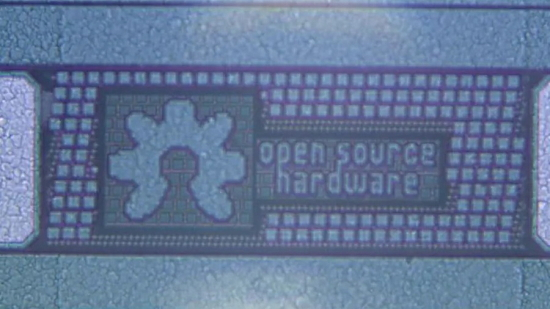](https://www.hackster.io/mwelling/pyfive-a43a61)

The PyFive project is creating a community-driven, RISC-V-based microcontroller with the ability to easily support CircuitPython and MicroPython. They've been documenting progress on hackster.io - [hackster.io](https://www.hackster.io/mwelling/pyfive-a43a61) via [Twitter](https://twitter.com/Hacksterio/status/1547734170486464512).

[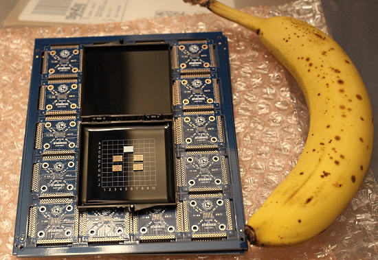](https://groupgets.com/campaigns/1038-pyfive-asic)

The team is fundraising to pay for an engineering team to work on the PyFive ASIC - [GroupGets](https://groupgets.com/campaigns/1038-pyfive-asic).

## Raspberry Pi Staff Make RP2040 Lightsabers

The crew at Raspberry Pi Towers made Star Wars lightsabers using Adafruit RP2040 Feather boards with the Propmaker Featherwing, CircuitPython and 3D printing - [Raspberry Pi News](https://www.raspberrypi.com/news/new-toby-made-us-rp2040-lightsabers-for-silicon/).

The design is based on the Adafruit tutorial [Prop-Maker Lightsaber](https://learn.adafruit.com/lightsaber-featherwing), changing out the Feather M4 Express with the RP2040-based Feather.

## Adafruit Working on New Raspberry Pi Pico Add-on Boards: Bells

Adafruit is working on new add-on boards for the Raspberry Pi Pico form factor. Quote: "whenever we start making add-ons we always do a protoboard first, and so it is that this is Adafruit's first design for a Raspi Pico add-on. it's the simplest and 'cheapest' to start" - [Twitter](https://twitter.com/adafruit/status/1547065264579252224).

With a wide variety of names for add-on boards: shields, capes, FeatherWings, HATs, gizmos, etc., Adafruit wanted a name for their line of boards.

As the new Pico W is being dubbed the "Picow" by the community, cow-themed ideas are being used. Adafruit, after consideration, announced on their Ask an Engineer show, Top Secret segment, their add-on boards will be called "bells" (like cowbell) - [Adafruit Top Secret](https://youtu.be/UAl3oqVa9eY).

## Nicholas Tollervey at EuroPython 2022 Conference

[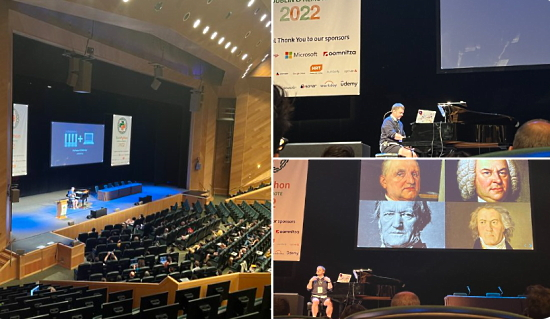](https://ep2022.europython.eu/session/music-and-code)

Pythonista Nick Tollervey gave a talk at the EuroPython conference recently, titled "Music and Code", using Python and Mu, the editor favored by CircuitPython users - [EuroPython 2022](https://ep2022.europython.eu/session/music-and-code).

## PyPI 2FA Security Key Giveaway

In order to improve the general security of the Python ecosystem, PyPI has begun implementing a two-factor authentication (2FA) requirement for critical projects. This requirement will go into effect in the coming months.

To ensure that maintainers of critical projects have the ability to implement strong 2FA with security keys, the Google Open Source Security Team, a sponsor of the Python Software Foundation, has provided a limited number of security keys to distribute to critical project maintainers.

Eligible maintainers will be able to redeem a promo code for two free Titan Security Keys (either USB-C or USB-A), including free shipping - [PyPI](https://pypi.org/security-key-giveaway/).

## This Week's Python Streams

Python on Hardware is all about building a cooperative ecosphere which allows contributions to be valued and to grow knowledge. Below are the streams within the last week focusing on the community.

### CircuitPython Deep Dive Stream

[This week](https://youtu.be/-uCbbnEWAcc), Tim was looking at a CircuitPython powered tablet.

You can see the latest video and past videos on the Adafruit YouTube channel under the Deep Dive playlist - [YouTube](https://www.youtube.com/playlist?list=PLjF7R1fz_OOXBHlu9msoXq2jQN4JpCk8A).

### CircuitPython Parsec

John Park’s CircuitPython Parsec this week is on List Sorting - [Adafruit Blog](https://blog.adafruit.com/2022/07/17/john-parks-circuitpython-parsec-list-sorting-adafruit-johnedgarpark-adafruit-circuitpython/) and [YouTube](https://youtu.be/3J5XTloxPHc).

Catch all the episodes in the [YouTube playlist](https://www.youtube.com/playlist?list=PLjF7R1fz_OOWFqZfqW9jlvQSIUmwn9lWr).

### The CircuitPython Show

The CircuitPython Show is an independent podcast, hosted by Paul Cutler, focusing on the people doing awesome things with CircuitPython. Each episode features Paul in conversation with a guest for a short interview – [CircuitPythonShow](https://circuitpythonshow.com/), [Blog Post](https://paulcutler.org/posts/2022/01/introducing-the-circuitpython-show/) and [Twitter](https://twitter.com/circuitpyshow).

The show is off this week.  Last week featured Nicholas Tollervey, the creator of Mu and circup, and next week long time CircuitPython community member and contributor Kevin Matocha joins the show. [Show List](https://circuitpythonshow.com/episodes/all).

### Chip Shortage

This week's Chip Shortage segment focuses on the ST HTS221 Capacitive Humidity and Temperature Sensor - [YouTube](https://youtu.be/96G92LA0uuo) and [Adafruit Blog](https://blog.adafruit.com/2022/07/14/chip-shortage-st-hts221-capacitive-humidity-temperature-sensor-chipshortage-adafruit/).

## Project of the Week: Picodeck

Picodeck uses tinyusb to turn a Raspberry Pi Pico into a device that works with Elgato's Stream Deck software - [GitHub](https://github.com/DDRBoxman/picodeck).

> Colin Edwards wanted to control Elgato Stream Deck much like the official pedal sold by the company. Using Wireshark with the Elgato pedal helped to determine the communication method of the commercial hardware.

Based on the Adafruit tutorial [Three Button Foot Switch](https://learn.adafruit.com/three-button-foot-switch). You may read more on [Hackaday](https://hackaday.com/2022/07/14/homebrew-stream-deck-pedal-emulates-the-real-thing/).

## News from around the web!

PicoTouch HMI is a Raspberry Pi Pico Carrier for Human-Machine Interface Projects. A single-board design hosting the Raspberry Pi Pico as a surface-mount module, the PicoTouch HMI packs a keypad, screen, speaker, and more with CircuitPython library support - [Twitter](https://twitter.com/bobricius/status/1546982044219199490), [YouTube](https://youtu.be/Z-XI__005VY) and [Hackster.io](https://www.hackster.io/news/bobricius-picotouch-hmi-is-a-raspberry-pi-pico-carrier-for-your-human-machine-interface-projects-794b5957d5d0).

Simulating Raspberry Pi Pico running CircuitPython and some virtual NeoPixels, completely in the browser - [Twitter](https://twitter.com/biglesp/status/1546596352725073920).

[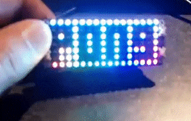](https://twitter.com/JohnChinner/status/1546949116017647616)

A Raspberry Pi Pico-based Pong game with a Pimoroni Pico Unicorn HAT and MicroPython - [Twitter](https://twitter.com/JohnChinner/status/1546949116017647616).

One-shot IR Helper uses a Raspberry Pi Pico with MicroPython as a very simple IR transmitter. Send the code you need based on any trigger you define - [Hackaday.io](https://hackaday.io/project/186319-one-shot-ir-helper-pi-pico) and [Hackaday](https://hackaday.com/2022/07/13/one-shot-ir-helper-is-a-great-beginner-project/).

[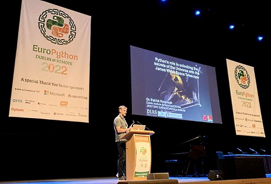](https://twitter.com/whykay/status/1547145453854236672)

Dr Patrick Kavanagh at EuroPython 2022 discussing the Pythonic genius behind the James Webb telescope - [Twitter](https://twitter.com/whykay/status/1547145453854236672).

[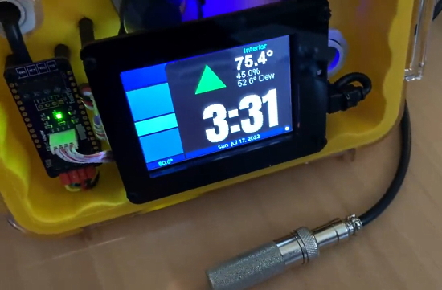](https://twitter.com/CedarGroveMakr/status/1548799880239255554)

> Simple shadow detector using Adafruit PyPortal’s analog light sensor phototransistor. Automatic background light compensation and anti-flicker filter. Needed a way to turn off the TFT backlight of the workshop IoT corrosion monitor to keep things cool - [Twitter](https://twitter.com/CedarGroveMakr/status/1548799880239255554).

[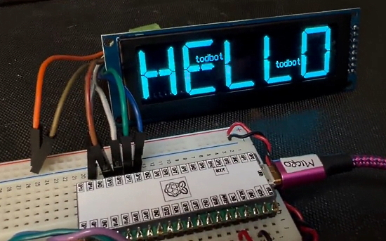](https://twitter.com/todbot/status/1548823663410958336)

> Oh yeah, these 256x64 grayscale OLED displays are nice. (They) look like a VFD but low power & they are still being made, wide viewing angle, fast to refresh, SPI, supported by CircuitPython (this demo running on a Raspberry Pi Pico) - [Twitter](https://twitter.com/todbot/status/1548823663410958336).

A desktop Webb telescope image viewer with a Raspberry Pi Zero and display, using CircuitPython - [Twitter](https://twitter.com/thebotmakes/status/1548988742375022595).

[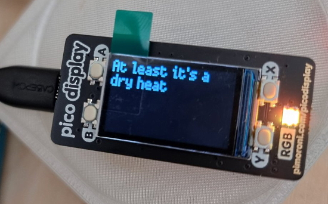](https://twitter.com/conoro/status/1549014135811219458)

A temperature display with a Raspberry Pi Pico, W, Pimoroni Pico Display and MicroPython - [Twitter](https://twitter.com/conoro/status/1549014135811219458).

[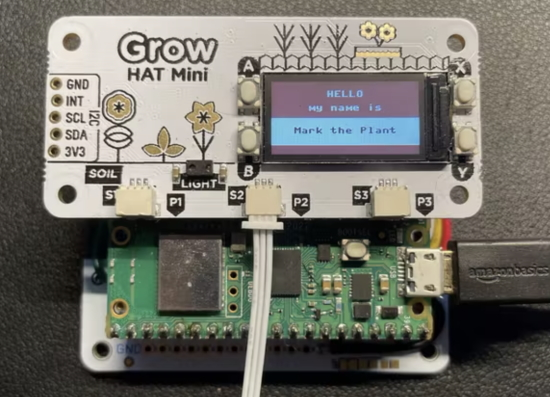](https://www.raspberrypi.com/news/raspberry-pi-pico-w-lets-your-houseplant-text-you/)

Raspberry Pi Pico W lets your houseplant text you using a Pimoroni Grow Kit, Adafruit Perrma-Proto HAT and MicroPython - [Raspberry Pi News](https://www.raspberrypi.com/news/raspberry-pi-pico-w-lets-your-houseplant-text-you/).

Using a Raspberry Pi Pico W with a Pimoroni Inky display, grabbing information from Trello with MicroPython - [Twitter](https://twitter.com/AxWax/status/1548989979828838401).

[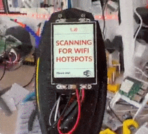](https://twitter.com/kevsmac/status/1548354095550853123)

A Ghostbusters PKE meter which scans for WiFi signals using a Raspberry Pi Pico W, 3D printed case and MicroPython - [Twitter](https://twitter.com/kevsmac/status/1548354095550853123).

[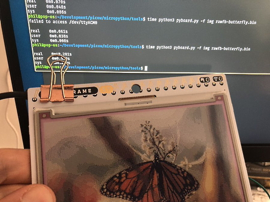](https://twitter.com/Gadgetoid/status/1547935339003531271)

Adding custom functions to MicroPython’s “pyboard.py” to write bin files to PicoGraphic’s buffer - [Twitter](https://twitter.com/Gadgetoid/status/1547935339003531271).

Monitoring pool temperatures (air, surface, bottom) with Raspberry Pi Pico W - [Twitter](https://twitter.com/LeoWhitesTweets/status/1548750222028931072).

text - [site](url).

text - [site](url).

[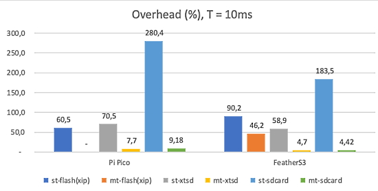](https://forum.micropython.org/viewtopic.php?f=18&t=4725&start=10)

Folks are discussing file write speeds on Micro SD cards - [MicroPython Forum](https://forum.micropython.org/viewtopic.php?f=18&t=4725&start=10).

text - [site](url).

Python-Script-to-Executable is a GitHub Action that builds stand-alone Windows, Mac, and Linux executable binaries from a Python script using the nuitka Python compiler - [GitHub](https://github.com/marketplace/actions/build-exe-from-python-script) and [LinkedIn](https://www.linkedin.com/feed/update/urn:li:activity:6952047034807840768/).

tio is a simple serial device tool which features a straightforward command-line and configuration file interface to easily connect to serial TTY devices for basic I/O operations. It's recently received a rare update - [GitHub](https://github.com/tio/tio) via [Hackaday]().

Technical Things Every Software Developer Should Know About - [GitHub](https://github.com/mtdvio/every-programmer-should-know) via [Twitter](https://twitter.com/pycoders/status/1547916894711099392).

PyDev of the Week: Reindert Jan Ekker on [Mouse vs Python](https://www.blog.pythonlibrary.org/2022/07/18/pydev-of-the-week-reindert-jan-ekker/)

CircuitPython Weekly Meeting for July 18, 2022 ([notes](https://github.com/adafruit/adafruit-circuitpython-weekly-meeting/blob/main/2022/2022-07-18.md)) [on YouTube](https://youtu.be/pIlfkpCsm7U).

#ICYDNCI What was the most popular, most clicked link, in [last week's newsletter](https://www.adafruitdaily.com/2022/07/12/python-on-microcontrollers-newsletter-circuitpython-day-2022-pico-w-availability-and-more-python-circuitpython-micropython-thepsf-raspberry_pi/)? [Make Humble Book Bundle - pay what you want](https://www.humblebundle.com/books/boards-coding-make-co-books).

## Coming Soon

Add high-quality motion, direction, and orientation sensing to projects with this all-in-one 9 Degree of Freedom (9-DoF) sensor with sensors from ST. This little breakout contains two chips that sit side-by-side to provide 9 degrees of full-motion data. The board includes an ST LSM6DS3TR-C (a.k.a LSM6DS3), a great entry-level 6-DoF IMU accelerometer + gyro - [Adafruit](https://www.adafruit.com/product/5543).

[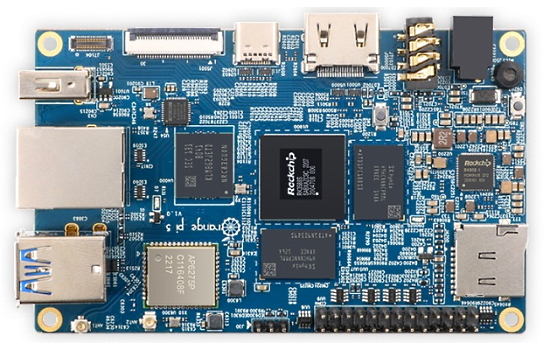](https://www.minimachines.net/actu/orange-pi-5-111082)

Orange Pi 5, with the RK3588S Chip (Quad A76 + Quad A55 ARM cores) - [MiniMachines](https://www.minimachines.net/actu/orange-pi-5-111082).

## New Boards Supported by CircuitPython

The number of supported microcontrollers and Single Board Computers (SBC) grows every week. This section outlines which boards have been included in CircuitPython or added to [CircuitPython.org](https://circuitpython.org/).

This week, there were no new boards added, but several are in the works.

*Note: For non-Adafruit boards, please use the support forums of the board manufacturer for assistance, as Adafruit does not have the hardware to assist in troubleshooting.*

Looking to add a new board to CircuitPython? It's highly encouraged! Adafruit has four guides to help you do so:

- [How to Add a New Board to CircuitPython](https://learn.adafruit.com/how-to-add-a-new-board-to-circuitpython/overview)
- [How to add a New Board to the circuitpython.org website](https://learn.adafruit.com/how-to-add-a-new-board-to-the-circuitpython-org-website)
- [Adding a Single Board Computer to PlatformDetect for Blinka](https://learn.adafruit.com/adding-a-single-board-computer-to-platformdetect-for-blinka)
- [Adding a Single Board Computer to Blinka](https://learn.adafruit.com/adding-a-single-board-computer-to-blinka)

## New Learn Guides!

[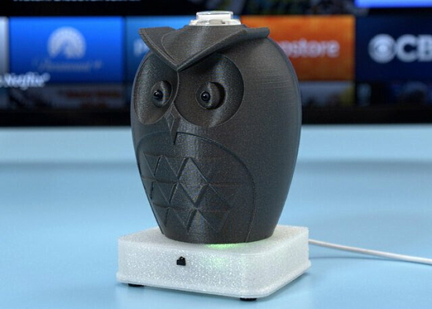](https://learn.adafruit.com/guides/latest)

[Owl IR TV Remote](https://learn.adafruit.com/owl-ir-tv-remote) from [Noe and Pedro](https://learn.adafruit.com/u/pixil3d)

[Super Simple Sunrise Lamp](https://learn.adafruit.com/super-simple-sunrise-lamp) from [Carter Nelson](https://learn.adafruit.com/u/caternuson)

## CircuitPython Libraries!

CircuitPython support for hardware continues to grow. We are adding support for new sensors and breakouts all the time, as well as improving on the drivers we already have. As we add more libraries and update current ones, you can keep up with all the changes right here!

For the latest libraries, download the [Adafruit CircuitPython Library Bundle](https://circuitpython.org/libraries). For the latest community contributed libraries, download the [CircuitPython Community Bundle](https://github.com/adafruit/CircuitPython_Community_Bundle/releases).

If you'd like to contribute, CircuitPython libraries are a great place to start. Have an idea for a new driver? File an issue on [CircuitPython](https://github.com/adafruit/circuitpython/issues)! Have you written a library you'd like to make available? Submit it to the [CircuitPython Community Bundle](https://github.com/adafruit/CircuitPython_Community_Bundle). Interested in helping with current libraries? Check out the [CircuitPython.org Contributing page](https://circuitpython.org/contributing). We've included open pull requests and issues from the libraries, and details about repo-level issues that need to be addressed. We have a guide on [contributing to CircuitPython with Git and GitHub](https://learn.adafruit.com/contribute-to-circuitpython-with-git-and-github) if you need help getting started. You can also find us in the #circuitpython channels on the [Adafruit Discord](https://adafru.it/discord).

You can check out this [list of all the Adafruit CircuitPython libraries and drivers available](https://github.com/adafruit/Adafruit_CircuitPython_Bundle/blob/master/circuitpython_library_list.md). 

The current number of CircuitPython libraries is **357**!

**New Libraries!**

Here's this week's new CircuitPython libraries:

 * [Adafruit_CircuitPython_PCF8574](https://github.com/adafruit/Adafruit_CircuitPython_PCF8574)
 * [Adafruit_CircuitPython_MMC56x3](https://github.com/adafruit/Adafruit_CircuitPython_MMC56x3)

**Updated Libraries!**

Here's this week's updated CircuitPython libraries:

 * [Adafruit_CircuitPython_BME680](https://github.com/adafruit/Adafruit_CircuitPython_BME680)
 * [Adafruit_CircuitPython_VEML7700](https://github.com/adafruit/Adafruit_CircuitPython_VEML7700)
 * [Adafruit_CircuitPython_INA219](https://github.com/adafruit/Adafruit_CircuitPython_INA219)
 * [Adafruit_CircuitPython_RFM9x](https://github.com/adafruit/Adafruit_CircuitPython_RFM9x)
 * [Adafruit_CircuitPython_SHT31D](https://github.com/adafruit/Adafruit_CircuitPython_SHT31D)
 * [Adafruit_CircuitPython_ADT7410](https://github.com/adafruit/Adafruit_CircuitPython_ADT7410)
 * [Adafruit_CircuitPython_DymoScale](https://github.com/adafruit/Adafruit_CircuitPython_DymoScale)
 * [Adafruit_CircuitPython_LIS3MDL](https://github.com/adafruit/Adafruit_CircuitPython_LIS3MDL)
 * [Adafruit_CircuitPython_PortalBase](https://github.com/adafruit/Adafruit_CircuitPython_PortalBase)
 * [Adafruit_CircuitPython_BitmapSaver](https://github.com/adafruit/Adafruit_CircuitPython_BitmapSaver)
 * [Adafruit_CircuitPython_LIDARLite](https://github.com/adafruit/Adafruit_CircuitPython_LIDARLite)
 * [Adafruit_CircuitPython_SSD1306](https://github.com/adafruit/Adafruit_CircuitPython_SSD1306)
 * [Adafruit_CircuitPython_Logging](https://github.com/adafruit/Adafruit_CircuitPython_Logging)
 * [Adafruit_CircuitPython_Display_Shapes](https://github.com/adafruit/Adafruit_CircuitPython_Display_Shapes)

## What’s the team up to this week?

What is the team up to this week? Let’s check in!

**Jeff**

Building on a large amount of work by Dan, I was able to find one big remaining problem with the new ESP32 port. Now, a lot of things work with the Adafruit Feather ESP32 V2 and the experimental version of CircuitPython, and I'll be fixing more as the week continues. As of now it's possible to connect with a terminal program or Thonny and do a lot of basic tasks including I2C, `digitalio`, and `analogio`!

**Kattni**

This past week has been focussed on non-CircuitPython related work. I have been helping out with adding WipperSnapper Setup and Usage pages to supported board guides. I've found bugs both in the background and the UI (all of which have been fixed!). I've also helped out with making a Usage template that works with the rest of the boards (the first two were for Feather and QT Py). I'll be continuing to work on that until I get through the rest of the boards on my list.

**Melissa**

This last week, I spent a lot of the time learning and adding some GitHub Actions to the WipperSnapper code base that was able to look at some JSON files to get some parameters for different boards and process the board differently. This was to fix an issue where the separate files were having trouble being written to board, but a combined file worked fine.

**Tim**

I continued worked on the Octopus Game & Watch game and the guide covering it. I also cleaned up the web workflow edit page implementation and submitted a PR with it. I've received and started looking into an ESP32-S3 based tablet device made by a community member, I'll be trying to solve a few issues and get it into a state where it could be PR'd to add to CircuitPython core. First step is trying to get the branch for it building in my local environment.

**Scott**

This week I've wrapped up WebSocket serial support. It's working pretty well, even on mobile. After that, I've been working on making the web workflow on boards without displays. Thanks to RetiredWizard for helping debug this. I've got a PR out to fix it but they are still seeing some issues (though it's better than what is checked in now I think.) I'm also working on supporting changing the port of the HTTP server so that user code can use 80. While I was at it, I also tweaked the start up code so it doesn't require a full-reset for password and port changes to take effect. It's all getting close! It's also very cool to see on the ESP32.

**Liz**

This week I worked on the NAU7802 Food Scale project. It was a fun challenge to learn about and code up a reliable calibration process for the sensor in CircuitPython. Next, I'll be turning it into an IoT with Azure. I think it will be good to show an inventory IoT project. I'm also working on documenting some new STEMMA boards, like the [LSM6DS3TR-C accelerometer](https://learn.adafruit.com/adafruit-lsm6ds3tr-c-6-dof-accel-gyro-imu).

## Upcoming events!

The next MicroPython Meetup in Melbourne will be on July 27th – [Meetup](https://www.meetup.com/MicroPython-Meetup/). See the [slides](https://docs.google.com/presentation/d/e/2PACX-1vSeLbsVQnmWOr72b94Juo_Y5k_czxQuYFU_UqAkIX4tdXxYfizIqaAlxETmv-2oMTHKx_SV_Xv2669r/pub?start=false&loop=false&delayms=3000&slide=id.p) of the June 22nd meeting.

PyOhio is a non-profit annual Python community conference usually held in Columbus, OH. It is being held online starting Saturday, July 30, 2022. It is free to attend and welcomes anyone with an interest in Python. Content ranges from beginner to advanced and is intended to be relevant to all types of Python users: students, software professionals, scientists, hobbyists, and anyone looking to learn more - [PyOhio](https://www.pyohio.org/2022/).

Kiwi PyCon is the Python community gathered to meet and to mingle, to share experiences, to learn from each other, and to build lasting relationships. Friday the 19th to Sunday the 21st of August, 2022 all over New Zealand and beyond - [Kiwi PyCon 2022](https://kiwipycon.nz/).

**Send Your Events In**

As for other events, with the COVID pandemic, most in-person events are postponed or held online. If you know of virtual events or upcoming events, please let us know on Twitter with hashtag #CircuitPython or email to cpnews(at)adafruit(dot)com.

## Latest releases

CircuitPython's stable release is [7.3.1#](https://github.com/adafruit/circuitpython/releases/latest) and its unstable release is [8.0.0-alpha.1](https://github.com/adafruit/circuitpython/releases). New to CircuitPython? Start with our [Welcome to CircuitPython Guide](https://learn.adafruit.com/welcome-to-circuitpython).

[20220715](https://github.com/adafruit/Adafruit_CircuitPython_Bundle/releases/latest) is the latest CircuitPython library bundle.

[v1.19.1](https://micropython.org/download) is the latest MicroPython release. Documentation for it is [here](http://docs.micropython.org/en/latest/pyboard/).

[3.10.5](https://www.python.org/downloads/) is the latest Python release. The latest pre-release version is [3.11.0b4](https://www.python.org/download/pre-releases/).

[3,095 Stars](https://github.com/adafruit/circuitpython/stargazers) Like CircuitPython? [Star it on GitHub!](https://github.com/adafruit/circuitpython)

## Call for help -- Translating CircuitPython is now easier than ever!

[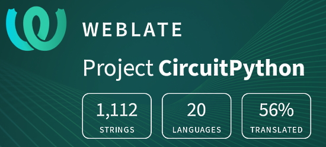](https://hosted.weblate.org/engage/circuitpython/)

One important feature of CircuitPython is translated control and error messages. With the help of fellow open source project [Weblate](https://weblate.org/), we're making it even easier to add or improve translations. 

Sign in with an existing account such as GitHub, Google or Facebook and start contributing through a simple web interface. No forks or pull requests needed! As always, if you run into trouble join us on [Discord](https://adafru.it/discord), we're here to help.

## jobs.adafruit.com - Find a dream job, find great candidates!

[jobs.adafruit.com](https://jobs.adafruit.com/) has returned and folks are posting their skills (including CircuitPython) and companies are looking for talented makers to join their companies - from Digi-Key, to Hackaday, Micro Center, Raspberry Pi and more.

**Job of the Week**

Hardware Engineer (potential for full time CTO) - BRIGHT (smart rings) - [Adafruit Jobs Board](https://jobs.adafruit.com/job/hardware-engineer-potential-for-full-time-cto/).

## 34,987 thanks!

The Adafruit Discord community, where we do all our CircuitPython development in the open, reached over 34,987 humans - thank you!  Adafruit believes Discord offers a unique way for Python on hardware folks to connect. Join today at [https://adafru.it/discord](https://adafru.it/discord).

## ICYMI - In case you missed it

Python on hardware is the Adafruit Python video-newsletter-podcast! The news comes from the Python community, Discord, Adafruit communities and more and is broadcast on ASK an ENGINEER Wednesdays. The complete Python on Hardware weekly videocast [playlist is here](https://www.youtube.com/playlist?list=PLjF7R1fz_OOXRMjM7Sm0J2Xt6H81TdDev). The video podcast is on [iTunes](https://itunes.apple.com/us/podcast/python-on-hardware/id1451685192?mt=2), [YouTube](http://adafru.it/pohepisodes), [IGTV (Instagram TV](https://www.instagram.com/adafruit/channel/)), and [XML](https://itunes.apple.com/us/podcast/python-on-hardware/id1451685192?mt=2).

[The weekly community chat on Adafruit Discord server CircuitPython channel - Audio / Podcast edition](https://itunes.apple.com/us/podcast/circuitpython-weekly-meeting/id1451685016) - Audio from the Discord chat space for CircuitPython, meetings are usually Mondays at 2pm ET, this is the audio version on [iTunes](https://itunes.apple.com/us/podcast/circuitpython-weekly-meeting/id1451685016), Pocket Casts, [Spotify](https://adafru.it/spotify), and [XML feed](https://adafruit-podcasts.s3.amazonaws.com/circuitpython_weekly_meeting/audio-podcast.xml).

## Codecademy "Learn Hardware Programming with CircuitPython"

Codecademy, an online interactive learning platform used by more than 45 million people, has teamed up with Adafruit to create a coding course, “Learn Hardware Programming with CircuitPython”. The course is now available in the [Codecademy catalog](https://www.codecademy.com/learn/learn-circuitpython?utm_source=adafruit&utm_medium=partners&utm_campaign=circuitplayground&utm_content=pythononhardwarenewsletter).

## Contribute!

The CircuitPython Weekly Newsletter is a CircuitPython community-run newsletter emailed every Tuesday. The complete [archives are here](https://www.adafruitdaily.com/category/circuitpython/). It highlights the latest CircuitPython related news from around the web including Python and MicroPython developments. To contribute, edit next week's draft [on GitHub](https://github.com/adafruit/circuitpython-weekly-newsletter/tree/gh-pages/_drafts) and [submit a pull request](https://help.github.com/articles/editing-files-in-your-repository/) with the changes. You may also tag your information on Twitter with #CircuitPython. 

Join the Adafruit [Discord](https://adafru.it/discord) or [post to the forum](https://forums.adafruit.com/viewforum.php?f=60) if you have questions.
