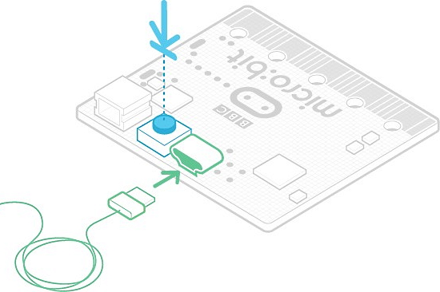
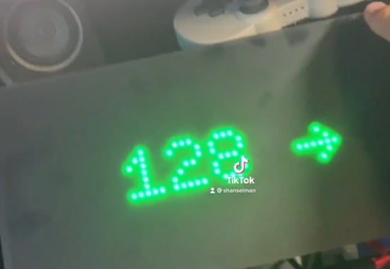
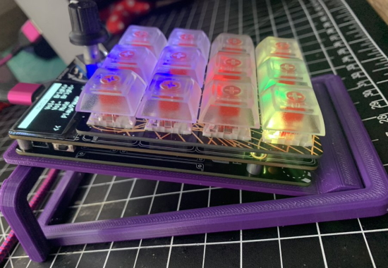
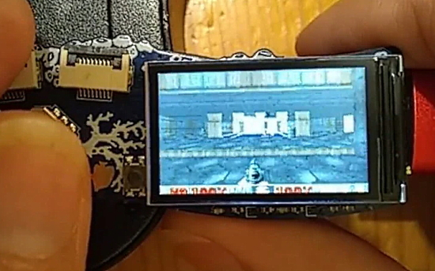
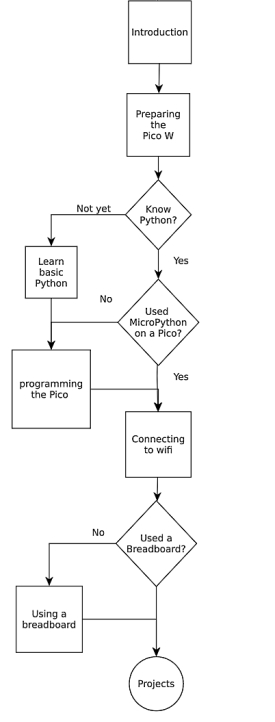
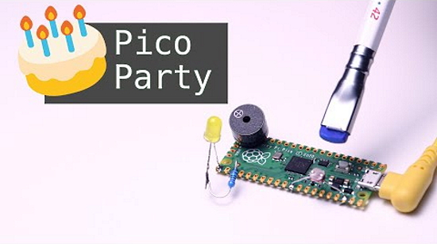
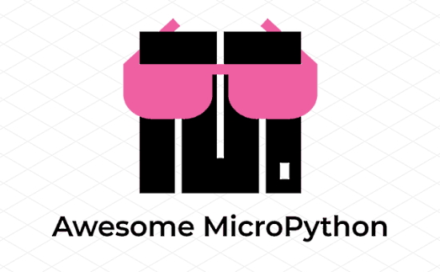
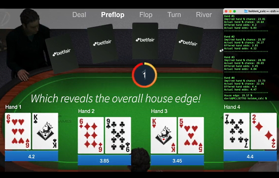

- [X] Kattni updates
- [ ] change date
- [ ] update title
- [ ] Feature story
- [ ] Update  for images
- [ ] Update ICYDNCI
- [ ] All images 550w max only
- [ ] Link "View this email in your browser."

News Sources

- [python.org](https://www.python.org/)
- [Python Insider - dev team blog](https://pythoninsider.blogspot.com/)
- [MicroPython Meetup Blog](https://melbournemicropythonmeetup.github.io/)
- [hackaday.io newest projects MicroPython](https://hackaday.io/projects?tag=micropython&sort=date) and [CircuitPython](https://hackaday.io/projects?tag=circuitpython&sort=date)
- [hackaday CircuitPython](https://hackaday.com/blog/?s=circuitpython) and [MicroPython](https://hackaday.com/blog/?s=micropython)
- [hackster.io CircuitPython](https://www.hackster.io/search?q=circuitpython&i=projects&sort_by=most_recent) and [MicroPython](https://www.hackster.io/search?q=micropython&i=projects&sort_by=most_recent)

View this email in your browser. **Warning: Flashing Imagery**

Welcome to the latest Python on Microcontrollers newsletter! 

We're on [Discord](https://discord.gg/HYqvREz), [Twitter](https://twitter.com/search?q=circuitpython&src=typed_query&f=live), and for past newsletters - [view them all here](https://www.adafruitdaily.com/category/circuitpython/). If you're reading this on the web, [subscribe here](https://www.adafruitdaily.com/). Here's the news this week:

## Milestone: 300 Adafruit CircuitPython Libraries

A major milestone! Adafruit has written 300 Adafruit libraries for interfacing to CircuitPython – drivers, helper functions & more.

> Adafruit invests time and money into providing free, open source code to help you use Adafruit products and much more, in the hope you buy some of your project gear from Adafruit. You can support Adafruit’s efforts by buying Adafruit products.

The Adafruit CircuitPython Library Bundle contain the current libraries available for CircuitPython. CircuitPython libraries are separate files designed to work with CircuitPython code - [Adafruit Blog](https://blog.adafruit.com/2022/08/01/milestone-300-adafruit-provided-open-source-circuitpython-libraries-available-circuitpython-opensource-adafruit/), [GitHub PR](https://github.com/adafruit/Adafruit_CircuitPython_Bundle/pull/389#pullrequestreview-1056471014) and [CircuitPython Library Download Page](https://circuitpython.org/libraries).

## GitHub Sponsors expands globally, bringing the total to 68

GitHub Sponsors expands globally with 30 newly supported regions, bringing the total to 68 - [GitHub Blog](https://github.blog/2022-07-28-github-sponsors-available-in-30-new-regions-2/).

> "We now officially support maintainers joining GitHub Sponsors from Argentina, Bolivia, Chile, Colombia, Costa Rica, Croatia, Dominican Republic, Egypt, Gambia, Gibraltar, Hungary, Iceland, Indonesia, Israel, Kenya, Liechtenstein, Morocco, Paraguay , Peru, Philippines, Saudi Arabia, Serbia, South Africa, South Korea, Thailand, Trinidad and Tobago, Tunisia, Turkey, UAE and Uruguay."

If you are a maker and looking to bolster your income via sponsors, you have a broader audience. 

## CircuitPython Day - August 19, 2022

Friday August 19 (8/19/2022) is CircuitPython Day 2022, being designated the snakiest day this year! The day highlights all things CircuitPython and Python on Hardware.

Below is the latest on events that are developing. Firm times and additional events will be posted in subsequent posts.

Special events will be held during the day – the following is a summary of events known to date:

- A panel discussion with Kattni, Jeff, Dan, and Tim. Hosted by Paul Cutler. More details coming soon!
- A chat with Jeff, Dan and Kattni. This will be the third year in a row that Jeff, Dan and Kattni will sit down and chat about their involvement and latest favorite contribution to CircuitPython.
- Special Edition CircuitPython Themed Show and Tell, hosted by Liz Clark. Details are still being solidified, but start prepping your CircuitPython related projects if you’re interested in participating!
- CircuitPython Project Build with Maker Melissa
Join Maker Melissa on her first ever livestream. This project will be a simple robotics project that uses the Adafruit CLUE to add Bluetooth control to the Ring:bit Buggy robotic car.

Foamyguy CircuitPython Day Game Jam Stream:

> On CircuitPython Day, I’ll be combining 2 of my favorite things, CircuitPython and Games. I will stream the making of a CircuitPython game jam game. My goal will be to make a basic but playable and fun game within the time constraints of a few hours, and I’ll be streaming the process. After the stream, I will publish the code to the game so folks can play on their own CircuitPython devices.

11:00 AM EDT/5:00 PM CEST Reimagining IoT Deployments with CircuitPython

Adafruit’s CircuitPython has helped open up the IoT and place it within reach of developers of all types. Join [blues.io](https://blues.io) on CircuitPython Day as we look at:

- Getting Started with CircuitPython and Wireless IoT
- Walking Through a Real World CircuitPython-based IoT Project
- Remotely Updating CircuitPython Firmware with Cellular IoT(!?!)
    
Register for this particular event [here](https://register.blues.io/reimagining_iot_deployments_circuitpython).

Working with CircuitPython? Tag your projects #CircuitPythonDay2022 on social media and Adafruit will look to highlight them.

Do you have events you’d like to have folks attend or have projects in the works? Email your thoughts to circuitpythonday(at)adafruit(dot)com - [Adafruit Blog](https://blog.adafruit.com/2022/07/20/announcing-circuitpython-day-2022-on-august-19th-circuitpythonday2022-circuitpython-python-copy/).

## PyOhio Talks Including One by Kattni on CircuitPython

PyOhio2022 had some great talks last week. One was "Simplicity and Fun: Learning with CircuitPython" by CircuitPython Team Member Kattni - [YouTube](https://youtu.be/Wp9pK_ndh4g) and [Twitter](https://twitter.com/PyOhio/status/1553372589594005505).

See the entire playlist - [YouTube](https://www.youtube.com/watch?v=3TbeMvlFB9E&list=PL2k6bbM_wgjs2nto4gd8rxxcPjDX0fyn5)

## Wordle on the Badger 2040

Simon has coded the popular game wordle on a Pimoroni Badger 2040 in MicroPython - [GitHub](https://github.com/makeworld-the-better-one/wordle-badger2040) via [Twitter](https://twitter.com/Simon37418224/status/1552740717595860993).

## Help Test New Firmware for the micro:bit

In collaboration with Arm, micro:bit is releasing the first beta of the micro:bit V2.00 firmware built with the GCC open source toolchain. They need your help testing it out to find any bugs before its launched - [Adafruit Blog](https://blog.adafruit.com/2022/07/29/help-microbit-test-v2-00-firmware-microbit-beta/).

## Adafruit Reaches 200,000 Twitter Subscribers

Adafruit reached a major milestone this past weekend, exceeding 200k Twitter followers. Thank you to the Adafruit community for sharing projects, checking out our blog posts and learn guides, and as always – for being excellent to each other - [Adafruit Blog](https://blog.adafruit.com/2022/08/01/were-celebrating-over-200000-followers-on-twitter-adafruit/) and [Twitter](https://twitter.com/adafruit).

## This Week's Python Streams

Python on Hardware is all about building a cooperative ecosphere which allows contributions to be valued and to grow knowledge. Below are the streams within the last week focusing on the community.

### CircuitPython Deep Dive Stream

[This week](https://youtu.be/_MjDofqQrJY), Tim streamed work on Octopus Game final touches.

You can see the latest video and past videos on the Adafruit YouTube channel under the Deep Dive playlist - [YouTube](https://www.youtube.com/playlist?list=PLjF7R1fz_OOXBHlu9msoXq2jQN4JpCk8A).

### CircuitPython Parsec

John Park’s CircuitPython Parsec this week is on discotool - [Adafruit Blog](https://blog.adafruit.com/2022/08/01/john-parks-circuitpython-parsec-discotool-johnedgarpark-adafruit-circuitpython/) and [YouTube](https://youtu.be/Mq3bwmuaA8I).

Catch all the episodes in the [YouTube playlist](https://www.youtube.com/playlist?list=PLjF7R1fz_OOWFqZfqW9jlvQSIUmwn9lWr).

### The CircuitPython Show

The CircuitPython Show is an independent podcast, hosted by Paul Cutler, focusing on the people doing awesome things with CircuitPython. Each episode features Paul in conversation with a guest for a short interview – [CircuitPythonShow](https://circuitpythonshow.com/), and [Twitter](https://twitter.com/circuitpyshow).

The show is off this week.  Last week featured Kevin Matocha, who shared his HACKtablet and TinyUSBFriend projects.  Next week features Joshua Lowe, creator of EduBlocks – [Show List](https://circuitpythonshow.com/episodes/all).

## Project of the Week: LED Headband

CircuitPythonista GeekMomProjects on Twitter documents making a colorful LED headband  - [Twitter Thread](https://twitter.com/GeekMomProjects/status/1552401369578872832).

> "Printed in PETG on a Prusa MINI+. Electronics are a XIAO nrf52840 Sense (hope to add sound/motion reactivity & Bluetooth control) powered by a super slim 400 mAh LiPo. It currently runs patterns from the CircuitPython LED animations library."

## News from around the web!

Using an Adafruit M4 MatrixPortal and CircuitPython to show LIVE blood sugar readings on a large display, powered by a Nightscout Project
server - [Twitter](https://twitter.com/shanselman/status/1551342603529900032) and [TikTok](https://www.tiktok.com/@shanselman/video/7124077572517825835?_t=8UGLvhgeZBu&_r=1).

Using an LED as a photodiode with Raspberry Pi Pico and MicroPython - [Twitter Thread](https://twitter.com/rareblog/status/1551528794581762055).

Programming a MacroPad in CircuitPython - [WebJess' Blog](https://webjess.code.blog/2022/07/25/macros-python-and-hotkeys/) via [Twitter](https://twitter.com/webjessc/status/1551714010424287232).

> "Followed an excellent tutorial by [John Park](https://learn.adafruit.com/pip-boy-2040) and built a CircuitPython Adafruit RP2040-powered Fallout Pip-Boy. Fun summer project for my 15yo programmer and me! Now we're porting to PyPortal with touchscreen" - [Twitter](https://twitter.com/chuckstar/status/1551755698916179968).

Doom running an an EMFCamp Tidal Badge based on an ESP32-S3 which runs MicroPython - [Hackaday](https://hackaday.com/2022/07/26/doom-runs-on-the-emfcamp-tidal-badge/) and [GitHub](https://github.com/phlash/doom-tidal).

Romilly is writing a Getting Started with MicroPython guide - [Twitter](https://twitter.com/rareblog/status/1552193545993437190).

Getting an old railway station clock working with a Raspberry Pi Pico W and MicroPython - [The MagPi Magazine](https://magpi.raspberrypi.com/articles/pico-railway-clock).

A Raspberry Pi Pico birthday candle created by VEEB Projects in honor of Switzerland' birthday - [YouTube](https://www.youtube.com/watch?v=56xwBkNzca4), [GitHub](https://github.com/veebch/hbty) via [Twitter](https://twitter.com/Raspberry_Pi/status/1554062531911897088).

> PewPew game running on #MicroPython in the browser! It kinda works, but it’s pretty unstable - [Twitter](https://twitter.com/isziaui/status/1553764336945987584).

> The Awesome MicroPython page has a shiny new social preview - find lots of resources to learn, explore, and to level up your MicroPython projects - [GitHub](https://awesome-micropython.com/) via [Twitter](https://twitter.com/andypiper/status/1552969844810993664).

text - [site](url).

text - [site](url).

text - [site](url).

text - [site](url).

Log motion sensor events to Google sheets using a Raspberry Pi Pico W - [YouTube](https://youtu.be/OZ60ws-5jP4) via [Twitter](https://twitter.com/kevsmac/status/1553999655045926912).

text - [site](url).

text - [site](url).

text - [site](url).

Revealing the house advantage in online casino games with Python and OpenCV - [Twitter Thread](https://twitter.com/davejavupride/status/1551653460277448704).

Important methods in Python - LinkedIn

PyDev of the Week:

CircuitPython Weekly Meeting for 

#ICYDNCI What was the most popular, most clicked link, in [last week's newsletter](https://www.adafruitdaily.com/2022/07/26/python-on-microcontrollers-newsletter-35k-discord-members-circuitpython-7-update-and-much-more-python-circuitpython-micropython-thepsf-raspberry_pi/)? [Book: Data Structures and Algorithms in Python](https://github.com/aibooks14/DSWA/blob/main/Data%20Structures%20%26%20Algorithms%20With%20Python.pdf).

## Coming Soon

Work in progress: ANAVI Macro Pad 10 with Seeedstudio XIAO RP2040 Coming soon at Crowd Supply - [Twitter](https://twitter.com/AnaviTechnology/status/1552379843928547329).
- 9 hot-swap mechanical switches
- Rotary encoder
- Backlit
- WS2812B under lighting
- Open Source KMK firmware written in CircuitPython

text - [site](url).

## New Boards Supported by CircuitPython

The number of supported microcontrollers and Single Board Computers (SBC) grows every week. This section outlines which boards have been included in CircuitPython or added to [CircuitPython.org](https://circuitpython.org/).

This week, there were (#/no) new boards added!

- [Board name](url)
- [Board name](url)
- [Board name](url)

*Note: For non-Adafruit boards, please use the support forums of the board manufacturer for assistance, as Adafruit does not have the hardware to assist in troubleshooting.*

Looking to add a new board to CircuitPython? It's highly encouraged! Adafruit has four guides to help you do so:

- [How to Add a New Board to CircuitPython](https://learn.adafruit.com/how-to-add-a-new-board-to-circuitpython/overview)
- [How to add a New Board to the circuitpython.org website](https://learn.adafruit.com/how-to-add-a-new-board-to-the-circuitpython-org-website)
- [Adding a Single Board Computer to PlatformDetect for Blinka](https://learn.adafruit.com/adding-a-single-board-computer-to-platformdetect-for-blinka)
- [Adding a Single Board Computer to Blinka](https://learn.adafruit.com/adding-a-single-board-computer-to-blinka)

## New Learn Guides!

[IoT Food Scale with Azure and CircuitPython](https://learn.adafruit.com/iot-food-scale-with-azure-and-circuitpython) from [Liz Clark](https://learn.adafruit.com/u/BlitzCityDIY)

## CircuitPython Libraries!

CircuitPython support for hardware continues to grow. We are adding support for new sensors and breakouts all the time, as well as improving on the drivers we already have. As we add more libraries and update current ones, you can keep up with all the changes right here!

For the latest libraries, download the [Adafruit CircuitPython Library Bundle](https://circuitpython.org/libraries). For the latest community contributed libraries, download the [CircuitPython Community Bundle](https://github.com/adafruit/CircuitPython_Community_Bundle/releases).

If you'd like to contribute, CircuitPython libraries are a great place to start. Have an idea for a new driver? File an issue on [CircuitPython](https://github.com/adafruit/circuitpython/issues)! Have you written a library you'd like to make available? Submit it to the [CircuitPython Community Bundle](https://github.com/adafruit/CircuitPython_Community_Bundle). Interested in helping with current libraries? Check out the [CircuitPython.org Contributing page](https://circuitpython.org/contributing). We've included open pull requests and issues from the libraries, and details about repo-level issues that need to be addressed. We have a guide on [contributing to CircuitPython with Git and GitHub](https://learn.adafruit.com/contribute-to-circuitpython-with-git-and-github) if you need help getting started. You can also find us in the #circuitpython channels on the [Adafruit Discord](https://adafru.it/discord).

You can check out this [list of all the Adafruit CircuitPython libraries and drivers available](https://github.com/adafruit/Adafruit_CircuitPython_Bundle/blob/master/circuitpython_library_list.md). 

The current number of CircuitPython libraries is **360**!

**New Libraries!**

Here's this week's new CircuitPython libraries:

 * [Adafruit_CircuitPython_SI1145](https://github.com/adafruit/Adafruit_CircuitPython_SI1145)

**Updated Libraries!**

Here's this week's updated CircuitPython libraries:

 * [Adafruit_CircuitPython_IterTools](https://github.com/adafruit/Adafruit_CircuitPython_IterTools)
 * [Adafruit_CircuitPython_OV7670](https://github.com/adafruit/Adafruit_CircuitPython_OV7670)
 * [Adafruit_CircuitPython_OV2640](https://github.com/adafruit/Adafruit_CircuitPython_OV2640)
 * [Adafruit_CircuitPython_MagTag](https://github.com/adafruit/Adafruit_CircuitPython_MagTag)
 * [Adafruit_CircuitPython_GFX](https://github.com/adafruit/Adafruit_CircuitPython_GFX)
 * [Adafruit_CircuitPython_FunHouse](https://github.com/adafruit/Adafruit_CircuitPython_FunHouse)
 * [Adafruit_CircuitPython_floppy](https://github.com/adafruit/Adafruit_CircuitPython_floppy)
 * [Adafruit_CircuitPython_Dash_Display](https://github.com/adafruit/Adafruit_CircuitPython_Dash_Display)
 * [Adafruit_CircuitPython_Colorsys](https://github.com/adafruit/Adafruit_CircuitPython_Colorsys)
 * [Adafruit_CircuitPython_CLUE](https://github.com/adafruit/Adafruit_CircuitPython_CLUE)
 * [Adafruit_CircuitPython_CircuitPlayground](https://github.com/adafruit/Adafruit_CircuitPython_CircuitPlayground)
 * [Adafruit_CircuitPython_BoardTest](https://github.com/adafruit/Adafruit_CircuitPython_BoardTest)
 * [Adafruit_CircuitPython_MacroPad](https://github.com/adafruit/Adafruit_CircuitPython_MacroPad)
 * [Adafruit_CircuitPython_MatrixPortal](https://github.com/adafruit/Adafruit_CircuitPython_MatrixPortal)
 * [Adafruit_CircuitPython_PyPortal](https://github.com/adafruit/Adafruit_CircuitPython_PyPortal)
 * [Adafruit_CircuitPython_PYOA](https://github.com/adafruit/Adafruit_CircuitPython_PYOA)
 * [Adafruit_CircuitPython_Ducky](https://github.com/adafruit/Adafruit_CircuitPython_Ducky)
 * [Adafruit_CircuitPython_HTTPServer](https://github.com/adafruit/Adafruit_CircuitPython_HTTPServer)
 * [Adafruit_CircuitPython_PyBadger](https://github.com/adafruit/Adafruit_CircuitPython_PyBadger)
 * [Adafruit_CircuitPython_RTTTL](https://github.com/adafruit/Adafruit_CircuitPython_RTTTL)
 * [Adafruit_CircuitPython_ESP32S2TFT](https://github.com/adafruit/Adafruit_CircuitPython_ESP32S2TFT)
 * [Adafruit_CircuitPython_OV5640](https://github.com/adafruit/Adafruit_CircuitPython_OV5640)
 * [Adafruit_CircuitPython_SHT31D](https://github.com/adafruit/Adafruit_CircuitPython_SHT31D)
 * [Adafruit_CircuitPython_INA219](https://github.com/adafruit/Adafruit_CircuitPython_INA219)
 * [Adafruit_CircuitPython_RFM9x](https://github.com/adafruit/Adafruit_CircuitPython_RFM9x)
 * [Adafruit_CircuitPython_VEML7700](https://github.com/adafruit/Adafruit_CircuitPython_VEML7700)
 * [Adafruit_CircuitPython_BME680](https://github.com/adafruit/Adafruit_CircuitPython_BME680)
 * [Adafruit_CircuitPython_MONSTERM4SK](https://github.com/adafruit/Adafruit_CircuitPython_MONSTERM4SK)
 * [Adafruit_CircuitPython_seesaw](https://github.com/adafruit/Adafruit_CircuitPython_seesaw)
 * [Adafruit_CircuitPython_BusDevice](https://github.com/adafruit/Adafruit_CircuitPython_BusDevice)
 * [Adafruit_CircuitPython_TCA9548A](https://github.com/adafruit/Adafruit_CircuitPython_TCA9548A)
 * [Adafruit_Blinka](https://github.com/adafruit/Adafruit_Blinka)
 * [Adafruit_Python_PlatformDetect](https://github.com/adafruit/Adafruit_Python_PlatformDetect)
 * [CircuitPython_Community_Bundle](https://github.com/adafruit/CircuitPython_Community_Bundle)

## What’s the team up to this week?

What is the team up to this week? Let’s check in!

**Dan**

This past week I debugged some ESP32SPI-related problems, which were due to MQTT timeouts and not handling certain exceptions. I revised a number of Learn Guide projects to fix these potential issues.

I've now gone back to working on the ESP32 port, and am currently debugging builds for boards with no PSRAM available.

**Jeff**

I handed back the ESP32 port to Dan so that I could finish up a guide called [Using QMK on RP2040 Microcontrollers](https://learn.adafruit.com/using-qmk-on-rp2040-microcontrollers). When I returned to CircuitPython land, I started working on some updates to the camera support on Espressif microcontrollers that has since turned into a full rewrite. We hope that when it's done, we'll be able to use a wider range of cameras on ESP32, ESP32-S2 and ESP32-S3 boards with a new API.

**Kattni**

This was another short week for me. I focussed on getting the final WipperSnapper pages completed. Other than that, I finished up a bunch of miscellaneous items I had hanging around or recently assigned.

In CircuitPython Day news, I'm continuing to add more content. Next week I'll be spending more time on planning, and I'm hoping to have a tentative schedule available soon! Keep an eye on it [here](https://blog.adafruit.com/2022/07/27/announcing-circuitpython-day-2022-on-august-19th-circuitpythonday2022-circuitpython-python-copy-copy/).

**Melissa**

This past week, I've spent most of my time working on refactoring [code.circuitpython.org](https://code.circuitpython.org) in order to accommodate additional workflows. Part of it was re-familiarizing myself with the existing code and then coming up with a plan about how it should work and the steps I needed to get there. Once that was figured out, the refactoring itself was relatively quick. While the interface is still almost exactly the same at this point, the underlying code structure is now quite a bit better and more loosely coupled.

**Tim**

This week I continued working on the Octopus game guide and adding comments to the code for it. I believe the game is now set save for some smaller details like potentially highscore saving. I've also still been working on the Hack Tablet build of CircuitPython that is adding dot clock display support for displayio. The giveaway for these tablets was officially announced this week and entry form is available now for those that wish to enter for a chance to receive one. 

**Scott**

This week I've been improving the web workflow. I've just about finished adding dynamic reconfig and changing the port. I improved the responsiveness of the workflow so that it responds as other code is running. I've tweaked the C3's serial transmit code to improve reliability. Currently, I'm reworking the status title bar code so that it is only transmitted as needed and therefore, speed everything up.

**Liz**

This week I wrapped up the [IoT Pet Food Scale](https://learn.adafruit.com/iot-food-scale-with-azure-and-circuitpython) using CircuitPython with Microsoft Azure. I also made a [1-minute video](https://youtube.com/shorts/w9GubS0aSl8) about the project featuring one of the benefactors of the project: my cat Winnie.

I also worked on documenting the new 9-DoF sensor in the shop: the [LSM6DS3TR-C + LIS3MDL Stemma Breakout](https://www.adafruit.com/product/5543). I wrote up a [standalone guide](https://learn.adafruit.com/adafruit-lsm6ds3tr-c-lis3mdl-precision-9-dof-imu) for it, added it to the [ST 9-DoF Combo Breakouts guide](https://learn.adafruit.com/st-9-dof-combo) and went through the [How to Fuse Motion Sensor Data into AHRS Orientation guide](https://learn.adafruit.com/how-to-fuse-motion-sensor-data-into-ahrs-orientation-euler-quaternions) to make sure magnetometer calibration was working as expected.

## Upcoming events!

The next MicroPython Meetup in Melbourne will be on August 24th – [Meetup](https://www.meetup.com/MicroPython-Meetup/). See the [slides](https://docs.google.com/presentation/d/e/2PACX-1vTX8zFXGxgalaJpXkY-NspjncnAuSiqjuzTUWIKtaNDRybb_hPz5dhBtaQA0aS5C4sb8l9xdWZoV1Ft/pub?slide=id.p) of the July 27th meeting.

Kiwi PyCon is the Python community gathered to meet and to mingle, to share experiences, to learn from each other, and to build lasting relationships. Friday the 19th to Sunday the 21st of August, 2022 all over New Zealand and beyond - [Kiwi PyCon 2022](https://kiwipycon.nz/).

PyBay2022 is the 7th annual regional Python Conference in San Francisco. Learn from 25 Python luminaries, sample nearly 20 food trucks, get books signed, meet hiring companies and enjoy live music in the evening. Sept 10, 2022 at San Francisco Parklabs Garden - [PyBay2022](https://pybay.com/).

PyCon UK will be returning to Cardiff City Hall from Friday 16th to Sunday 18th September 2022 - [PyCon  UK](https://2022.pyconuk.org/).

After two years in remote mode, Hackaday is very excited to announce that this year’s Hackaday Supercon will be coming back, live! Nov. 4th, 5th, and 6th in sunny Pasadena, CA for three days of hacks, talks, and socializing with the Hackaday community - [Call for proposals](https://docs.google.com/forms/d/e/1FAIpQLSffBmw2vNLZyzdKnPJhKF6u7nvYnjTZQ-lynOhhr8_S8fAd3w/viewform) and [Hackaday](https://hackaday.com/2022/07/18/the-2022-hackaday-supercon-is-on-and-the-call-for-proposals-is-open/).

**Send Your Events In**

As for other events, with the COVID pandemic, most in-person events are postponed or held online. If you know of virtual events or upcoming events, please let us know on Twitter with hashtag #CircuitPython or email to cpnews(at)adafruit(dot)com.

## Latest releases

CircuitPython's stable release is [#.#.#](https://github.com/adafruit/circuitpython/releases/latest) and its unstable release is [#.#.#-##.#](https://github.com/adafruit/circuitpython/releases). New to CircuitPython? Start with our [Welcome to CircuitPython Guide](https://learn.adafruit.com/welcome-to-circuitpython).

[2022####](https://github.com/adafruit/Adafruit_CircuitPython_Bundle/releases/latest) is the latest CircuitPython library bundle.

[v#.#.#](https://micropython.org/download) is the latest MicroPython release. Documentation for it is [here](http://docs.micropython.org/en/latest/pyboard/).

[#.#.#](https://www.python.org/downloads/) is the latest Python release. The latest pre-release version is [#.#.#](https://www.python.org/download/pre-releases/).

[#,### Stars](https://github.com/adafruit/circuitpython/stargazers) Like CircuitPython? [Star it on GitHub!](https://github.com/adafruit/circuitpython)

## Call for help -- Translating CircuitPython is now easier than ever!

One important feature of CircuitPython is translated control and error messages. With the help of fellow open source project [Weblate](https://weblate.org/), we're making it even easier to add or improve translations. 

Sign in with an existing account such as GitHub, Google or Facebook and start contributing through a simple web interface. No forks or pull requests needed! As always, if you run into trouble join us on [Discord](https://adafru.it/discord), we're here to help.

## jobs.adafruit.com - Find a dream job, find great candidates!

[jobs.adafruit.com](https://jobs.adafruit.com/) has returned and folks are posting their skills (including CircuitPython) and companies are looking for talented makers to join their companies - from Digi-Key, to Hackaday, Micro Center, Raspberry Pi and more.

**Job of the Week**

Hardware Engineer (potential for full time CTO), BRIGHT (smart rings) - [Adafruit Jobs Board](https://jobs.adafruit.com/job/hardware-engineer-potential-for-full-time-cto/).

## NUMBER thanks!

The Adafruit Discord community, where we do all our CircuitPython development in the open, reached over NUMBER humans - thank you!  Adafruit believes Discord offers a unique way for Python on hardware folks to connect. Join today at [https://adafru.it/discord](https://adafru.it/discord).

## ICYMI - In case you missed it

Python on hardware is the Adafruit Python video-newsletter-podcast! The news comes from the Python community, Discord, Adafruit communities and more and is broadcast on ASK an ENGINEER Wednesdays. The complete Python on Hardware weekly videocast [playlist is here](https://www.youtube.com/playlist?list=PLjF7R1fz_OOXRMjM7Sm0J2Xt6H81TdDev). The video podcast is on [iTunes](https://itunes.apple.com/us/podcast/python-on-hardware/id1451685192?mt=2), [YouTube](http://adafru.it/pohepisodes), [IGTV (Instagram TV](https://www.instagram.com/adafruit/channel/)), and [XML](https://itunes.apple.com/us/podcast/python-on-hardware/id1451685192?mt=2).

[The weekly community chat on Adafruit Discord server CircuitPython channel - Audio / Podcast edition](https://itunes.apple.com/us/podcast/circuitpython-weekly-meeting/id1451685016) - Audio from the Discord chat space for CircuitPython, meetings are usually Mondays at 2pm ET, this is the audio version on [iTunes](https://itunes.apple.com/us/podcast/circuitpython-weekly-meeting/id1451685016), Pocket Casts, [Spotify](https://adafru.it/spotify), and [XML feed](https://adafruit-podcasts.s3.amazonaws.com/circuitpython_weekly_meeting/audio-podcast.xml).

## Codecademy "Learn Hardware Programming with CircuitPython"

Codecademy, an online interactive learning platform used by more than 45 million people, has teamed up with Adafruit to create a coding course, “Learn Hardware Programming with CircuitPython”. The course is now available in the [Codecademy catalog](https://www.codecademy.com/learn/learn-circuitpython?utm_source=adafruit&utm_medium=partners&utm_campaign=circuitplayground&utm_content=pythononhardwarenewsletter).

## Contribute!

The CircuitPython Weekly Newsletter is a CircuitPython community-run newsletter emailed every Tuesday. The complete [archives are here](https://www.adafruitdaily.com/category/circuitpython/). It highlights the latest CircuitPython related news from around the web including Python and MicroPython developments. To contribute, edit next week's draft [on GitHub](https://github.com/adafruit/circuitpython-weekly-newsletter/tree/gh-pages/_drafts) and [submit a pull request](https://help.github.com/articles/editing-files-in-your-repository/) with the changes. You may also tag your information on Twitter with #CircuitPython. 

Join the Adafruit [Discord](https://adafru.it/discord) or [post to the forum](https://forums.adafruit.com/viewforum.php?f=60) if you have questions.
