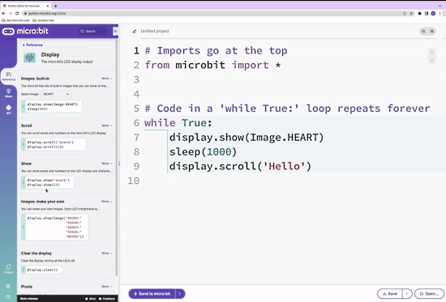
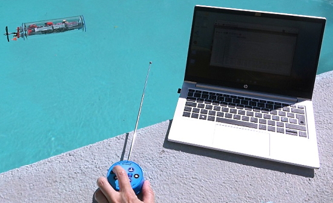
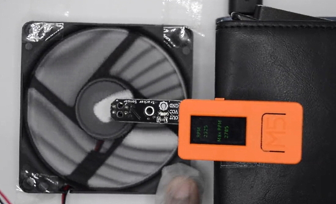
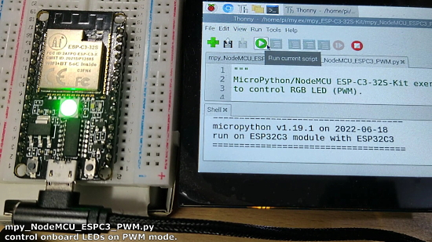
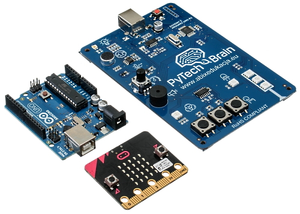
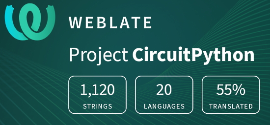

- [X] Kattni updates
- [ ] change date
- [ ] update title
- [ ] Feature story
- [ ] Update  for images
- [ ] Update ICYDNCI
- [ ] All images 550w max only
- [ ] Link "View this email in your browser."

News Sources

- [python.org](https://www.python.org/)
- [Python Insider - dev team blog](https://pythoninsider.blogspot.com/)
- [MicroPython Meetup Blog](https://melbournemicropythonmeetup.github.io/)
- [hackaday.io newest projects MicroPython](https://hackaday.io/projects?tag=micropython&sort=date) and [CircuitPython](https://hackaday.io/projects?tag=circuitpython&sort=date)
- [hackaday CircuitPython](https://hackaday.com/blog/?s=circuitpython) and [MicroPython](https://hackaday.com/blog/?s=micropython)
- [hackster.io CircuitPython](https://www.hackster.io/search?q=circuitpython&i=projects&sort_by=most_recent) and [MicroPython](https://www.hackster.io/search?q=micropython&i=projects&sort_by=most_recent)

View this email in your browser. **Warning: Flashing Imagery**

Welcome to the latest Python on Microcontrollers newsletter! 

We're on [Discord](https://discord.gg/HYqvREz), [Twitter](https://twitter.com/search?q=circuitpython&src=typed_query&f=live), and for past newsletters - [view them all here](https://www.adafruitdaily.com/category/circuitpython/). If you're reading this on the web, [subscribe here](https://www.adafruitdaily.com/). Here's the news this week:

## CircuitPython Day - Friday August 19th - Updated Schedule

Friday August 19 (8/19/2022) is CircuitPython Day 2022, being designated the snakiest day this year! The day highlights all things CircuitPython and Python on Hardware.

Please follow the latest calendar of events on the [Adafruit Blog](https://blog.adafruit.com/2022/08/08/circuitpython-day-2022-schedule-circuitpythonday2022-circuitpython-python/).

Current Schedule (all times are are US Eastern)
* 11:00am ET – CircuitPython Day Introduction
* 11:10am ET – Celebrating Code & Community: A CircuitPython Day Panel Discussion
* 12:50pm ET – CircuitPython Development Sprint Intro Video
* 1:00pm ET – CircuitPython Project Build with Maker Melissa
* 2:00pm ET – Special Edition CircuitPython Themed Show and Tell
* 3:30pm ET – CircuitPython 8 Preview
* 4:00pm ET – CircuitPython Day Chat with Kattni, Jeff and Dan
* 6:00pm ET – Foamyguy CircuitPython Day Game Jam Stream
* 1:00pm-5:00pm ET – CircuitPython Development Sprints (no video content)

**OTHER EVENTS:**

11:00 AM EDT/5:00 PM CEST – **Reimagining IoT Deployments with CircuitPython**

Adafruit’s CircuitPython has helped open up the IoT and place it within reach of developers of all types. Join Blues Wireless on CircuitPython Day as they look at:
* Getting Started with CircuitPython and Wireless IoT
* Walking Through a Real World CircuitPython-based IoT Project
* Remotely Updating CircuitPython Firmware with Cellular IoT(!?!)

Register for this particular event [here](https://register.blues.io/reimagining_iot_deployments_circuitpython).

6:00PM – 9:00 PM ET – **CircuitPython Night at i3Detroit**

Come join for all things CircuitPython:

* CircuitPython demos
* Getting Started with CircuitPython
* Q&A and project help
* Tour a local Makerspace in Ferndale, MI

Location: i3Detroit, 1481 Wordsworth, Ferndale, MI 48220

For more information about the space, visit [i3Detroit.org](https://www.i3detroit.org/).

## Python Gains 2%, Remains Top Programming Language

‘Unstoppable’ Python once again ranked No. 1 in the August updates of both the Tiobe and Pypl indexes of programming language popularity - [TIOBE](https://www.tiobe.com/tiobe-index/) and [Infoworld](https://www.infoworld.com/article/3669232/python-popularity-still-soaring.html).

## New Browser-based micro:bit Python Editor Launching in September

The new micro:bit editor runs in a browser, so it’s quite different to Thonny or Mu. It will be launching in September but the beta is online and can be used now - [Twitter Thread](https://twitter.com/4pip/status/1557714643371675650) and [Beta on the Web](https://python.microbit.org/v/beta).

## The Azure Embedded Wireless Framework APIs for IoT

The Azure Embedded Wireless Framework simplifies the development of internet and cloud connectivity for embedded device software by providing a defined interface for wireless network adapters, host interfaces, platform adaptations, and software stack extensions through a set of APIs.

The goal is to provide a standard framework for writing applications and controlling wireless network adapters (cellular, WiFi, …) while abstracting a driver interface for hardware vendors to plug in modules with self-developed drivers - [GitHub](https://github.com/Azure/embedded-wireless-framework) and [Adafruit Blog](https://blog.adafruit.com/2022/08/12/the-azure-embedded-wireless-framework-apis-opensource-azure-iot-microsoft-azure/).

## Microsoft Emoji and Emoji Tools now Open Source

Looking for open source emojis for your project? Microsoft has released Fluent Emoji, a collection of familiar, friendly, and modern emoji under MIT License - [GitHub](https://github.com/microsoft/fluentui-emoji).

Microsoft open sources its 3D emoji to let creators remix and customize them - [The Verge](https://www.theverge.com/2022/8/10/23299527/microsoft-emoji-open-source-creators).

Why Microsoft is Excited to share their Emoji - [Medium](https://medium.com/microsoft-design/designing-in-the-open-source-5c62be73a599).

## Linux Kernel 6.0 Release Candidate Out

The merge window for Linux 6.0 is now officially closed and the first Release Candidate (RC) milestone is ready for testers and bleeding-edge users who want an early taste of what’s about to be included in the final release, which is expected in early October 2022.

According to Linus Torvalds, all the big changes have been merged and Linux kernel 6.0 looks to be another fairly sizable release with another great set of improvements - [9to5Linux](https://9to5linux.com/linus-torvalds-announces-first-linux-kernel-6-0-release-candidate).

## Ubuntu 22.04.1 LTS is Out

Ubuntu 22.04.1 LTS Arrives with Wider Support for RISC-V Devices - [site](https://linuxiac.com/ubuntu-22-04-1-lts/) via [Twitter](https://twitter.com/linuxiac/status/1557758819450724352).

For a fresh installation from scratch, you can download the ISO image of Ubuntu 22.04.1 available on the [official page](https://ubuntu.com/download/).

Meanwhile, the development of the next Ubuntu version, 22.10 “Kinetic Kudu,” is underway. So if you want to give it a try, download the daily build [from here](https://cdimage.ubuntu.com/daily-live/current/).

## This Week's Python Streams

Python on Hardware is all about building a cooperative ecosphere which allows contributions to be valued and to grow knowledge. Below are the streams within the last week focusing on the community.

### CircuitPython Deep Dive Stream

[This week](https://youtu.be/FbYQfSgV3Lw), Tim streamed work on CircuitPython library memory and size quantification.

You can see the latest video and past videos on the Adafruit YouTube channel under the Deep Dive playlist - [YouTube](https://www.youtube.com/playlist?list=PLjF7R1fz_OOXBHlu9msoXq2jQN4JpCk8A).

### CircuitPython Parsec

John Park’s CircuitPython Parsec this week is on Carriage Returns - [Adafruit Blog](https://blog.adafruit.com/2022/08/12/john-parks-circuitpython-parsec-carriage-return-johnedgarpark-adafruit-circuitpython/) and [YouTube](https://youtu.be/dcOw_higAPk).

Catch all the episodes in the [YouTube playlist](https://www.youtube.com/playlist?list=PLjF7R1fz_OOWFqZfqW9jlvQSIUmwn9lWr).

### The CircuitPython Show

The CircuitPython Show is an independent podcast, hosted by Paul Cutler, focusing on the people doing awesome things with CircuitPython. Each episode features Paul in conversation with a guest for short interview – [CircuitPythonShow](https://circuitpythonshow.com/) and [Twitter](https://twitter.com/circuitpyshow).

The show is off this week.  Last week featured Josh Lowe discussing Edublocks and Brent Rubell joins in the next episode and talks Internet of Things – [Show List](https://circuitpythonshow.com/episodes/all).

## Projects of the Week: Over and Under the Sea

### SearchWing maritime search and rescue drones

SearchWing is a German nonprofit organisation which builds and flies drones for maritime search and rescue (SAR). The drones are built on Raspberry Pi hardware and software. Compute Module 4 is the brains, and dual Raspberry Pi Camera Modules are the eyes of each drone - [Raspberry Pi News](https://www.raspberrypi.com/news/searchwing-maritime-search-and-rescue-drones/).

### A small working submarine with LEGO and Raspberry Pi

This radio-controlled submarine is smart enough to maintain a steady depth and keep a set distance from the bottom of the body of water it’s dropped in. Programmed in Python - [Brick Experiment Channel](https://brickexperimentchannel.wordpress.com/), [Raspberry Pi News](https://brickexperimentchannel.wordpress.com/2022/07/14/rc-submarine-4-0-conclusion-10-10/) and [Adafruit Blog](https://blog.adafruit.com/2022/08/12/making-a-small-working-submarine-with-lego-and-raspberry-pi-piday-lego-raspberry_pi/).

## News from around the web!

A headband with a surprise LED matrix hidden inside! All programmed in CircuitPython.

> "Made with Adafruit NeoPixel strips, an Adafruit QTpy and a Lipo BFF! The diffusion layer is some black tulle wrapped in scrunched-up layers, and I was really pleased with how it turned out" - [Twitter Thread](https://twitter.com/chardane/status/1557966736107847680).

> My little picostepseq MIDI sequencer is getting better. Now you can save/load sequences, while running and without missing a beat - [Twitter](https://twitter.com/todbot/status/1558636696110895104).

> "I created the PiDial to use a Raspberry Pi to control my home theater receiver over the network. I’m going to rebuild it in CircuitPython because I can now talk to my receiver using CircuitPython! I’ll also have to design a new 3D printed enclosure. And add some Neokeys" - [Twitter](https://twitter.com/prcutler/status/1556725004779360257).

Maker and developer Alperen Akküncü has created a custom PCB that turns the Raspberry Pi Pico into a data acquisition (DAQ) tool known as the PlainDAQ, a simple, precision 4-channel oscilloscope and a single channel function generator - [Tom's Hardware](https://www.tomshardware.com/news/raspberry-pi-pico-plaindaq) and [GitHub](https://github.com/AlperenAkkuncu/PlainDAQ).

How To Make A Raspberry Pi Pico W Web Server with MicroPython - [Tom's Hardware](https://www.tomshardware.com/how-to/raspberry-pi-pico-w-web-server).

An LED matrix display shared screen using a browser, with Raspberry Pi Pico W and MicroPython - [Bitluni](https://bitluni.net/screen-sharing-matrix) and [YouTube]().

A simple non-contact DIY Tachometer with M5StickC, IR reflectance sensor and MicroPython - [Twitter](https://twitter.com/ChinnaDevarapu/status/1556020606306484224) and [GitHub](https://github.com/momos123/Tachometer/).

MicroPython/NodeMCU ESP-C3-32S-Kit control onboard LEDs with MicroPython - [coXXect](https://coxxect.blogspot.com/2022/08/micropythonnodemcu-esp-c3-32s-kit.html) and [YouTube](https://youtu.be/eMbPZB7ACCA).

Using a SeedSigner Waveshare display hat with an ESP32-S2, custom MicroPython firmware, and LVGL UI/rendering library - [Twitter](https://twitter.com/KeithMukai/status/1558593720005558281).

Adding auditing to pip - [lwn.net](https://lwn.net/SubscriberLink/904197/9f5cc13b3c352127/).

PyTechBrain: A platform introducing students to the field of IoT - Internet of Things, fully compatible with the new core curriculum - [PyTechBrain](https://pytechbrain.edu.pl/) (Polish).

How to choose the right Python concurrency API - the Python standard library offers 3 concurrency APIs - [SuperFastPython](https://superfastpython.com/python-concurrency-choose-api/).

Raspberry Pi users can now look forward to using tThe previously unsupported Fedora operating system, which will now be fully operable on the Raspberry Pi 4, with approval granted from The Fedora Engineering and Steering Committee (FESCo) in the first week of August 2022 - [techradar](https://www.techradar.com/news/raspberry-pi-users-will-soon-have-a-new-os-to-play-with).

PyDev of the Week:

CircuitPython Weekly Meeting for 

#ICYDNCI What was the most popular, most clicked link, in [last week's newsletter](https://www.adafruitdaily.com/2022/08/09/python-on-microcontrollers-newsletter-esp32-web-workflow-for-circuitpython-circuitpython-day-2022-and-more-circuitpython-micropython-thepsf-raspberry_pi/)? [A first test of CircuitPython on ESP32 web workflow](https://blog.adafruit.com/2022/08/07/a-first-test-of-circuitpython-on-esp32-web-workflow/).

## Coming Soon

3 small open source programmable mechanical keyboards: ANAVI Macro Pad 10, ANAVI Knobs 3 and ANAVI Knob 1. Featuring Seeed XIAO RP2040 with USB-C and the Raspberry Pi RP2040 microcontroller. Powered by the advanced, but easy-to-use KMK open source firmware written in CircuitPython - [CrowdSupply](https://www.crowdsupply.com/anavi-technology/anavi-macro-pad-10).

Father:bit - "Connects Feathers to stuff" with a micro:bit edge connector - [Twitter](https://twitter.com/RosmoRobot/status/1558932538785206278) and [GitHub](https://github.com/rosmo-robot/Feather-Bit/tree/main/v1).

## New Boards Supported by CircuitPython

The number of supported microcontrollers and Single Board Computers (SBC) grows every week. This section outlines which boards have been included in CircuitPython or added to [CircuitPython.org](https://circuitpython.org/).

This week, there were no new boards added, but several are in progress.

*Note: For non-Adafruit boards, please use the support forums of the board manufacturer for assistance, as Adafruit does not have the hardware to assist in troubleshooting.*

Looking to add a new board to CircuitPython? It's highly encouraged! Adafruit has four guides to help you do so:

- [How to Add a New Board to CircuitPython](https://learn.adafruit.com/how-to-add-a-new-board-to-circuitpython/overview)
- [How to add a New Board to the circuitpython.org website](https://learn.adafruit.com/how-to-add-a-new-board-to-the-circuitpython-org-website)
- [Adding a Single Board Computer to PlatformDetect for Blinka](https://learn.adafruit.com/adding-a-single-board-computer-to-platformdetect-for-blinka)
- [Adding a Single Board Computer to Blinka](https://learn.adafruit.com/adding-a-single-board-computer-to-blinka)

## New Learn Guides!

[Two Way Telegraph with Analog Feedback Servos](https://learn.adafruit.com/two-way-display-with-analog-feedback-servos) from [Noe, Pedro](https://learn.adafruit.com/u/pixil3d) and [Liz Clark](https://learn.adafruit.com/u/blitzcitydiy)

## CircuitPython Libraries!

CircuitPython support for hardware continues to grow. We are adding support for new sensors and breakouts all the time, as well as improving on the drivers we already have. As we add more libraries and update current ones, you can keep up with all the changes right here!

For the latest libraries, download the [Adafruit CircuitPython Library Bundle](https://circuitpython.org/libraries). For the latest community contributed libraries, download the [CircuitPython Community Bundle](https://github.com/adafruit/CircuitPython_Community_Bundle/releases).

If you'd like to contribute, CircuitPython libraries are a great place to start. Have an idea for a new driver? File an issue on [CircuitPython](https://github.com/adafruit/circuitpython/issues)! Have you written a library you'd like to make available? Submit it to the [CircuitPython Community Bundle](https://github.com/adafruit/CircuitPython_Community_Bundle). Interested in helping with current libraries? Check out the [CircuitPython.org Contributing page](https://circuitpython.org/contributing). We've included open pull requests and issues from the libraries, and details about repo-level issues that need to be addressed. We have a guide on [contributing to CircuitPython with Git and GitHub](https://learn.adafruit.com/contribute-to-circuitpython-with-git-and-github) if you need help getting started. You can also find us in the #circuitpython channels on the [Adafruit Discord](https://adafru.it/discord).

You can check out this [list of all the Adafruit CircuitPython libraries and drivers available](https://github.com/adafruit/Adafruit_CircuitPython_Bundle/blob/master/circuitpython_library_list.md). 

The current number of CircuitPython libraries is **362**!

**New Libraries!**

Here's this week's new CircuitPython libraries:

 * [Adafruit_CircuitPython_MAX1704x](https://github.com/adafruit/Adafruit_CircuitPython_MAX1704x)

**Updated Libraries!**

Here's this week's updated CircuitPython libraries:

* Every library was updated this week!

## What’s the team up to this week?

What is the team up to this week? Let’s check in!

**Dan**

I fixed about half a dozen issues for the 8.0.0 release, and am continuing to work on more. As Scott mentions below, we're making good progress knocking off the remaining issues.

**Jeff**

The camera functionality I've mentioned in a couple of recent reports has been merged. This code is working really well on the ESP32-S2 and ESP32-S3, which was the main goal. It's also enabled for the original ESP32, but there seem to be some reliability problems. Overall, it's a very nice step forward in how Circuitpython can work with cameras on Espressif microcontrollers. https://github.com/adafruit/circuitpython/pull/6684

I was also learning for myself about asyncio, and found a small change to the "core" which can greatly increase the efficiency of (for instance) waiting for keypad keypresses in one async task and doing other activities in another. This really needs a library (yet to be written) to package it all up, but I was happy to dig a little deeper and learn enough to do this. https://github.com/adafruit/circuitpython/pull/6712

**Kattni**

text

**Melissa**

This past week, I've continued working on [code.circuitpython.org](https://code.circuitpython.org/) and have been adding lots of features as well as revising dialogs and other UI elements. Coming up soon I'll be making preparations for a CircuitPython Day livestream where I build a little project that runs CircuitPython. Be sure to catch in on 8/19/2022 at 1:00 PM EST.

**Tim**

I was out for vacation the majority of the week and did not do much with CircuitPython during that. The tinkering that I did do was starting an effort to measure library RAM size, and .mpy file size as a proxy for RAM. I created a new github actions task that can output the .mpy file size for every PR branch automatically when it's submitted. Next up is trying to measure the RAM usage on a physical device.

**Scott**

This past week has been a continuation of the web workflow and ESP bugfixing of last week. We're trying to fix as many 8.0.0 bugs as we can so that we can get to a stable release. We started with 50 open issues and now have 41. We've fixed more than 9 but also found a few more along the way. Our goal is to have a beta of CircuitPython 8 before CircuitPython Day, August 19th.

I've removed two APIs that were being phased out in 7.x for removal in 8.x. One was ScanEntry.matches(all=) which was replaced by match_all= to avoid the Python keyword all. The other was removing the PWMOut argument to PulseOut. The ESP chips use a different hardware peripheral from PWM so the API didn't fit for it. The new API takes in a pin and then lets the port decide exactly how to implement it.

I've also done a number of reliability fixes for the web workflow and for the title bar.

This is my last week before I go back on paternity leave so I'll be fixing as many bugs as I can before I'm off. Hopefully there won't be much more for Jeff and Dan to fix once I'm done.

**Liz**

This past week I worked on a guide for the new [MMC5603 magnetometer](https://learn.adafruit.com/adafruit-mmc5603-triple-axis-magnetometer) and wrote code for the [Two Way Telegraph with Analog Feedback Servos project](https://learn.adafruit.com/two-way-display-with-analog-feedback-servos). 

I also did a PR and testing for the updated MCP4728 STEMMA board, which may ship with an MCP4728A4 IC. The IC is identical to the MCP4728 but has a different default I2C address. The [PR to the CircuitPython library](https://github.com/adafruit/Adafruit_CircuitPython_MCP4728/pull/13) allows for both I2C addresses and the product guide has documentation for folks to change the I2C address in the code. Big thanks to tekktrik for reviewing the PR since it was my first PR for a CircuitPython library.

## Upcoming events!

The next MicroPython Meetup in Melbourne will be on August 24th – [Meetup](https://www.meetup.com/MicroPython-Meetup/). See the [slides](https://docs.google.com/presentation/d/e/2PACX-1vTX8zFXGxgalaJpXkY-NspjncnAuSiqjuzTUWIKtaNDRybb_hPz5dhBtaQA0aS5C4sb8l9xdWZoV1Ft/pub?slide=id.p) of the July 27th meeting.

Kiwi PyCon is the Python community gathered to meet and to mingle, to share experiences, to learn from each other, and to build lasting relationships. Friday the 19th to Sunday the 21st of August, 2022 all over New Zealand and beyond - [Kiwi PyCon 2022](https://kiwipycon.nz/).

Silicon Valley’s Premier Comic Con Returns! Featuring The Best In Pop Culture, Tech, Science, Makers, Artists, Cosplay, Gaming, Comic Creators, Authors & More! August 27-28, 2022 San Jose McEnery Convention Center - [SiliCon](https://www.siliconsj.com/).

[Virtual Maker Workshops](https://www.siliconsj.com/virtual-workshops/)

PyCon UK will be returning to Cardiff City Hall from Friday 16th to Sunday 18th September 2022 - [PyCon  UK](https://2022.pyconuk.org/).

After two years in remote mode, Hackaday is very excited to announce that this year’s Hackaday Supercon will be coming back, live! Nov. 4th, 5th, and 6th in sunny Pasadena, CA for three days of hacks, talks, and socializing with the Hackaday community - [Call for proposals](https://docs.google.com/forms/d/e/1FAIpQLSffBmw2vNLZyzdKnPJhKF6u7nvYnjTZQ-lynOhhr8_S8fAd3w/viewform) and [Hackaday](https://hackaday.com/2022/07/18/the-2022-hackaday-supercon-is-on-and-the-call-for-proposals-is-open/).

**Send Your Events In**

As for other events, with the COVID pandemic, most in-person events are postponed or held online. If you know of virtual events or upcoming events, please let us know on Twitter with hashtag #CircuitPython or email to cpnews(at)adafruit(dot)com.

## Latest releases

CircuitPython's stable release is [#.#.#](https://github.com/adafruit/circuitpython/releases/latest) and its unstable release is [#.#.#-##.#](https://github.com/adafruit/circuitpython/releases). New to CircuitPython? Start with our [Welcome to CircuitPython Guide](https://learn.adafruit.com/welcome-to-circuitpython).

[2022####](https://github.com/adafruit/Adafruit_CircuitPython_Bundle/releases/latest) is the latest CircuitPython library bundle.

[v#.#.#](https://micropython.org/download) is the latest MicroPython release. Documentation for it is [here](http://docs.micropython.org/en/latest/pyboard/).

[#.#.#](https://www.python.org/downloads/) is the latest Python release. The latest pre-release version is [#.#.#](https://www.python.org/download/pre-releases/).

[#,### Stars](https://github.com/adafruit/circuitpython/stargazers) Like CircuitPython? [Star it on GitHub!](https://github.com/adafruit/circuitpython)

## Call for help -- Translating CircuitPython is now easier than ever!

One important feature of CircuitPython is translated control and error messages. With the help of fellow open source project [Weblate](https://weblate.org/), we're making it even easier to add or improve translations. 

Sign in with an existing account such as GitHub, Google or Facebook and start contributing through a simple web interface. No forks or pull requests needed! As always, if you run into trouble join us on [Discord](https://adafru.it/discord), we're here to help.

## jobs.adafruit.com - Find a dream job, find great candidates!

[jobs.adafruit.com](https://jobs.adafruit.com/) has returned and folks are posting their skills (including CircuitPython) and companies are looking for talented makers to join their companies - from Digi-Key, to Hackaday, Micro Center, Raspberry Pi and more.

**Job of the Week**

Build fun electronics projects and document them - Ohmify - [Adafruit Jobs Board](https://jobs.adafruit.com/job/build-fun-electronics-projects-and-document-them/).

## 35,276 thanks!

The Adafruit Discord community, where we do all our CircuitPython development in the open, reached over 35,276 humans - thank you!  Adafruit believes Discord offers a unique way for Python on hardware folks to connect. Join today at [https://adafru.it/discord](https://adafru.it/discord).

## ICYMI - In case you missed it

Python on hardware is the Adafruit Python video-newsletter-podcast! The news comes from the Python community, Discord, Adafruit communities and more and is broadcast on ASK an ENGINEER Wednesdays. The complete Python on Hardware weekly videocast [playlist is here](https://www.youtube.com/playlist?list=PLjF7R1fz_OOXRMjM7Sm0J2Xt6H81TdDev). The video podcast is on [iTunes](https://itunes.apple.com/us/podcast/python-on-hardware/id1451685192?mt=2), [YouTube](http://adafru.it/pohepisodes), [IGTV (Instagram TV](https://www.instagram.com/adafruit/channel/)), and [XML](https://itunes.apple.com/us/podcast/python-on-hardware/id1451685192?mt=2).

[The weekly community chat on Adafruit Discord server CircuitPython channel - Audio / Podcast edition](https://itunes.apple.com/us/podcast/circuitpython-weekly-meeting/id1451685016) - Audio from the Discord chat space for CircuitPython, meetings are usually Mondays at 2pm ET, this is the audio version on [iTunes](https://itunes.apple.com/us/podcast/circuitpython-weekly-meeting/id1451685016), Pocket Casts, [Spotify](https://adafru.it/spotify), and [XML feed](https://adafruit-podcasts.s3.amazonaws.com/circuitpython_weekly_meeting/audio-podcast.xml).

## Codecademy "Learn Hardware Programming with CircuitPython"

Codecademy, an online interactive learning platform used by more than 45 million people, has teamed up with Adafruit to create a coding course, “Learn Hardware Programming with CircuitPython”. The course is now available in the [Codecademy catalog](https://www.codecademy.com/learn/learn-circuitpython?utm_source=adafruit&utm_medium=partners&utm_campaign=circuitplayground&utm_content=pythononhardwarenewsletter).

## Contribute!

The CircuitPython Weekly Newsletter is a CircuitPython community-run newsletter emailed every Tuesday. The complete [archives are here](https://www.adafruitdaily.com/category/circuitpython/). It highlights the latest CircuitPython related news from around the web including Python and MicroPython developments. To contribute, edit next week's draft [on GitHub](https://github.com/adafruit/circuitpython-weekly-newsletter/tree/gh-pages/_drafts) and [submit a pull request](https://help.github.com/articles/editing-files-in-your-repository/) with the changes. You may also tag your information on Twitter with #CircuitPython. 

Join the Adafruit [Discord](https://adafru.it/discord) or [post to the forum](https://forums.adafruit.com/viewforum.php?f=60) if you have questions.
