- [X] Kattni updates
- [ ] change date
- [ ] update title
- [ ] Feature story
- [ ] Update  for images
- [ ] Update ICYDNCI
- [ ] All images 550w max only
- [ ] Link "View this email in your browser."

View this email in your browser. **Warning: Flashing Imagery**

Welcome to the latest Python on Microcontrollers newsletter! It's clear that the use of Python on hardware projects is accelerating. Just take a look at this week's highlights. Python on LEGO automation controllers, micro:bit, and so many microcontroller boards and single board computers (SBC)! Have fun exploring this week's issue.

We're on [Discord](https://discord.gg/HYqvREz), [Twitter](https://twitter.com/search?q=circuitpython&src=typed_query&f=live), and for past newsletters - [view them all here](https://www.adafruitdaily.com/category/circuitpython/). If you're reading this on the web, [subscribe here](https://www.adafruitdaily.com/). Here's the news this week:

## Check Out the Simulator in the beta micro:bit Python Editor

[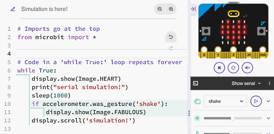](https://mailchi.mp/microbit.org/please-test-the-simulator-in-our-new-python-editor)

A simulator is now available within the beta micro:bit Python Editor. This allows you to try your code before sending it to a micro:bit. The developers are fine tuning it over the next few weeks, so send thems your feedback to help make it even better - [micro:bit newsletter](https://mailchi.mp/microbit.org/please-test-the-simulator-in-our-new-python-editor).

## The MicroPython Forum Migration to GitHub Discussions

After close to 9 years, the MicroPython team has decided to close their [forum](https://forum.micropython.org/) in favor of moving to GitHub Discussions - [MicroPython Forum Post](https://forum.micropython.org/viewtopic.php?f=8&t=12971&sid=329429aeedb4a492901c29391b2c14e6) and [GitHub Discussions](https://github.com/orgs/micropython/discussions).

There's a few key features they really like about GitHub Discussions:

- Much tighter integration with the rest of the development process which is all hosted on GitHub. We can move Discussions to/from Issues, etc, as well as @ members and reference PRs/Issues.
- GitHub Discussions has many more features for posts and replies. Emoji responses, accepted answers, threaded replies, etc.
- GitHub Discussions uses the much more familiar Markdown syntax for writing posts, especially for code snippets (which also support syntax highlighting).
- It's less maintenance for the MicroPython team (--> more time to work on features and fixes!).
- Easier account signup (and for many people who already use GitHub, no new account required at all).

## PyBricks - Python for LEGO

[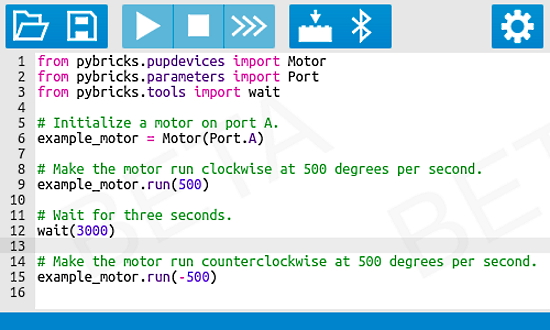](https://pybricks.com/)

Pybricks is Python coding for smart LEGO® hubs. Run MicroPython scripts directly on the hub, and get full control of your motors and sensors. Pybricks runs on LEGO® BOOST, City, Technic, MINDSTORMS®, and SPIKE®. You can code using Windows, Mac, Linux, Chromebook, and Android. MIT License Open Source - [PyBricks](https://pybricks.com/).

## VSCode Upload to via the New CircuitPython 8 Web Workflow

Luke Williams is working on a task definition and Python script to upload from VS Code to CircuitPython board via web workflow REST API. It's a work in progress at this time. It shows how leveraging new features in CircuitPython 8 can help development - [GitHub](https://github.com/ae5au/vscode-circuitpython-webupload).

## Thonny Version 4.0.0

Thonny 4.0.0 has emerged from beta with many changes and fixes. A main change is they dropped support for Python 3.5, 3.6 and 3.7. There are about two dozen changes for MicroPython and CircuitPython - [GitHub](https://github.com/thonny/thonny/releases).

## WipperSnapper Custom Component Visualizations

Adafruit has introduced some new gorgeous default WipperSnapper component visualizations and the ability for users to customize them - [Adafruit IO Blog](https://io.adafruit.com/blog/notebook/2022/08/23/wippersnapper-custom-component-visuals/).

* Custom Labels
* Custom Icons
* Component Contributors Can Set Their Default Visualizations
* I2C Sensors Display Their Appropriate SI Units

There are some new sensor types too - [Adafruit Blog](https://blog.adafruit.com/2022/08/23/adafruit-io-wippersnapper-adds-new-types-of-sensors-nocode-iot/).

## This Week's Python Streams

Python on Hardware is all about building a cooperative ecosphere which allows contributions to be valued and to grow knowledge. Below are the streams within the last week focusing on the community.

### CircuitPython Deep Dive Stream

[This week](https://youtu.be/oLrJ25phZKs), Tim streamed work on CircuitPython Library PR reviews, the Hack Tablet and more.

You can see the latest video and past videos on the Adafruit YouTube channel under the Deep Dive playlist - [YouTube](https://www.youtube.com/playlist?list=PLjF7R1fz_OOXBHlu9msoXq2jQN4JpCk8A).

### CircuitPython Parsec

John Park’s CircuitPython Parsec will return next week.

Catch all the episodes in the [YouTube playlist](https://www.youtube.com/playlist?list=PLjF7R1fz_OOWFqZfqW9jlvQSIUmwn9lWr).

### The CircuitPython Show

The CircuitPython Show is an independent podcast hosted by Paul Cutler, focusing on the people doing awesome things with CircuitPython. Each episode features Paul in conversation with a guest for a short interview – [CircuitPythonShow](https://circuitpythonshow.com/) and [Twitter](https://twitter.com/circuitpyshow).

Last week's episode features Brent Rubell, who discusses IoT, [Wippersnapper firmware](https://learn.adafruit.com/quickstart-adafruit-io-wippersnapper), and more.  Next week Radomir Dopieralski joins the show and shares how he got started, gaming with CircuitPython, and building robots – [Show List](https://circuitpythonshow.com/episodes/all).

### Chip Shortage

The Chip Shortage video this week is the InvenSense TDK ICM-20948 9-DOF IMU - [Adafruit Blog](https://blog.adafruit.com/2022/08/25/chip-shortage-invensense-tdk-icm-20948-chipshortage-invensense-adafruit/) and [YouTube](https://youtu.be/dEiRl4Q4je0).

## Project of the Week: A NASA Astronomy Picture of the Day Viewer

[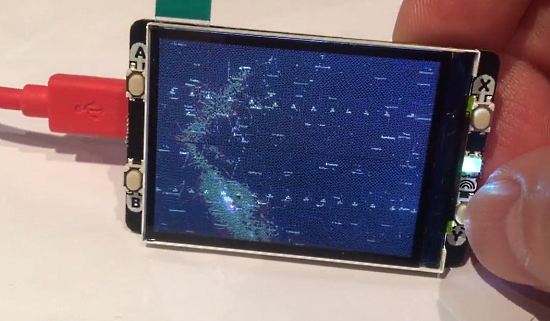](https://twitter.com/thebotmakes/status/1560528878786994176)

A NASA Astronomy Picture of the Day Viewer using MicroPython, a Raspberry Pi Pico W and a Pimoroni Display Pack 2 - [Twitter](https://twitter.com/thebotmakes/status/1560528878786994176).

## News from around the web!

An Adafruit QT Py powered Garden Dashboard project - [Twitter](https://twitter.com/EddieSneed66/status/1561159981814222849).

[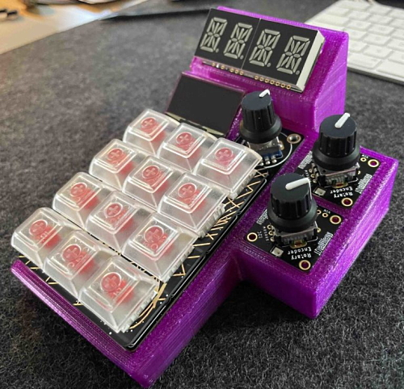](https://blog.adafruit.com/2022/08/25/macropad-rotary-enclosure-3dthursday/)

An Adafruit Macropad RP2040 case + extra encoders and display - [Adafruit Blog](https://blog.adafruit.com/2022/08/25/macropad-rotary-enclosure-3dthursday/) and [Thingiverse](https://www.thingiverse.com/thing:5413512).

[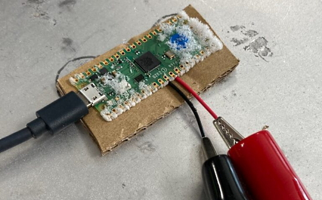](https://www.raspberrypi.com/news/dont-try-this-at-home-overclocking-rp2040-to-1ghz/)

Overclocking RP2040 to 1 GHz - [Raspberry Pi](https://www.raspberrypi.com/news/dont-try-this-at-home-overclocking-rp2040-to-1ghz/).

[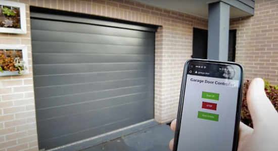](https://www.raspberrypi.com/news/remotely-open-your-garage-door-with-raspberry-pi-pico-w/)

Remotely open your garage door with Raspberry Pi Pico W - [Raspberry Pi](https://www.raspberrypi.com/news/remotely-open-your-garage-door-with-raspberry-pi-pico-w/) and [YouTube](https://youtu.be/bIBQKl_Sots).

Buy more time with Raspberry Pi Pico (and money) - [Raspberry Pi](https://www.raspberrypi.com/news/buy-more-time-with-raspberry-pi-pico-and-money/?mc_cid=342317acd3&mc_eid=d98a11b1f1).

[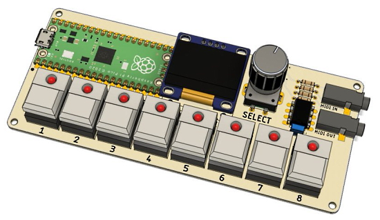](https://www.electromaker.io/blog/article/the-picostepseq-brings-retro-aesthetics-to-a-3d-printed-midi-sequencer)

The PicoStepSeq Brings Retro Aesthetics to a 3D Printed MIDI Sequencer - [electromaker](https://www.electromaker.io/blog/article/the-picostepseq-brings-retro-aesthetics-to-a-3d-printed-midi-sequencer).

Keyboard Builder's Digest Issue #92 is out - [Keyboard Builder's Digest](https://kbd.news/issue/92/).

[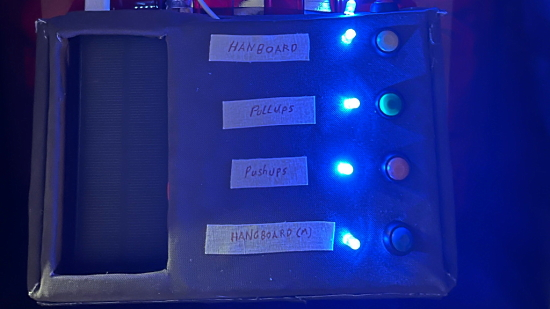](https://hautzenberger.at/posts/blog/2022-08-21_raspberrypi_pico_do_machine/)

A Raspberry Pi Pico To-Do Board using MicroPython - [hautzenberger.at](https://hautzenberger.at/posts/blog/2022-08-21_raspberrypi_pico_do_machine/).

[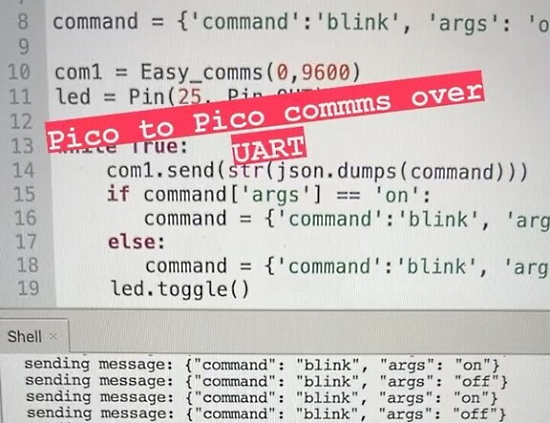](https://www.instagram.com/reel/ChsEvXuA5wC/)

Pico to Pico communication over UART using easy_comms and MicroPython - [Instagram](https://www.instagram.com/reel/ChsEvXuA5wC/) via [Twitter](https://twitter.com/kevsmac/status/1562839714868383746).

Wear your words with this subtitle hoodie, using a Raspberry Pi 3 B+ and Python - [Raspberry Pi](https://www.raspberrypi.com/news/raspberry-pi-wearable-subtitles/).

Mirrored wall art which displays Webb telescope images - [Raspberry Pi](https://www.raspberrypi.com/news/this-mirrored-wall-art-can-see-into-deep-space/) and [YouTube](https://youtu.be/piM59_2R2Wo).

[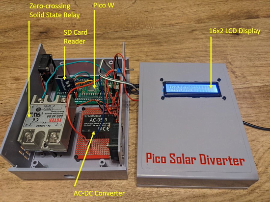](https://twitter.com/JohnStabler/status/1562830269081477126)

A Raspberry Pi Pico powered solar diverter build with MicroPython - [Twitter](https://twitter.com/JohnStabler/status/1562830269081477126).

Read RSS feeds in Python and download the weather with Raspberry Pi - [Sean.co.uk](https://news.sean.co.uk/2022/08/read-rss-feeds-in-python-and-download.html).

[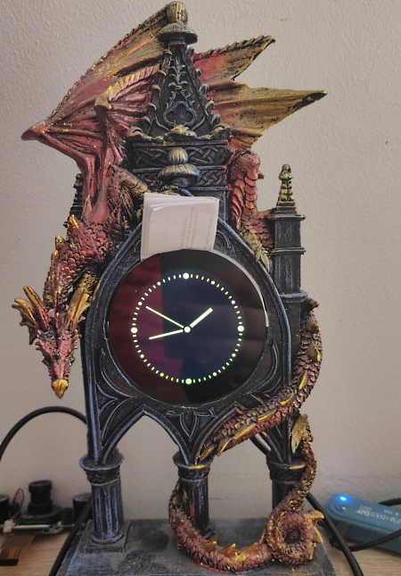](https://twitter.com/TalkTechDOTInfo/status/1562057842084937729)

A Dragon frame clock with a Pimoroni HyperPixel round display and Raspberry Pi Zero W with Python - [Twitter](https://twitter.com/TalkTechDOTInfo/status/1562057842084937729).

831 page free eBook: Python Notes for Professionals book - [Goalkicker](https://goalkicker.com/PythonBook/).

A Practical Introduction to Web Scraping in Python - [Real Python](https://realpython.com/python-web-scraping-practical-introduction/).

[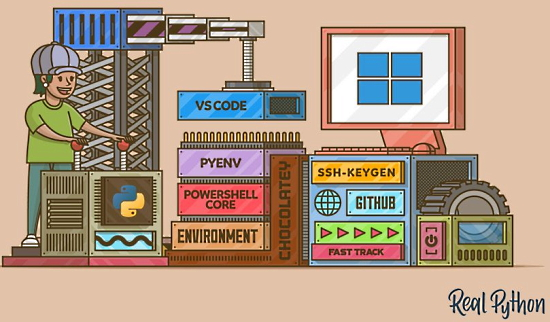](https://realpython.com/python-coding-setup-windows/)

Your Python Coding Environment on Windows: Setup Guide - [Real Python](https://realpython.com/python-coding-setup-windows/).

A cheat sheet for data structures in Python 3 - [Twitter](https://twitter.com/parvezshahshaik/status/1561652811871522819).

A cheat sheet for data visualization - [Novartis](https://twitter.com/Manish_kumar3_1/status/1562705256806760455).

Using colors in data visualization - [Warsaw University of Technology](https://twitter.com/parvezshahshaik/status/1561776203375190019).

PyDev of the Week:

CircuitPython Weekly Meeting for 

#ICYDNCI What was the most popular, most clicked link, in [last week's newsletter](https://www.adafruitdaily.com/2022/08/23/python-on-microcontrollers-newsletter-circuitpython-8-0-0-beta-0-released-and-much-more-circuitpython-micropython-thepsf-raspberry_pi/)? [SQL CheetSheet](https://twitter.com/haneeni61853819/status/1560085069158563840).

## Coming Soon

The first LumosStick PCBs are nearly ready for Tindie. They have an ESP32-S2 and can run CircuitPython - [Twitter](https://twitter.com/bradanlane/status/1561771741063647234).

Wemos S3 - WiFi & Bluetooth 5 (LE) board based on the ESP32-S3-WROOM-1, 16MB Flash, 8MB PSRAM, compatible with MicroPython (default), Arduino and ESP-IDF - [Wemos](https://www.wemos.cc/en/latest/s3/s3.html).

text - [site](url).

## New Boards Supported by CircuitPython

The number of supported microcontrollers and Single Board Computers (SBC) grows every week. This section outlines which boards have been included in CircuitPython or added to [CircuitPython.org](https://circuitpython.org/).

This week, there were (#/no) new boards added!

- [Board name](url)
- [Board name](url)
- [Board name](url)

*Note: For non-Adafruit boards, please use the support forums of the board manufacturer for assistance, as Adafruit does not have the hardware to assist in troubleshooting.*

Looking to add a new board to CircuitPython? It's highly encouraged! Adafruit has four guides to help you do so:

- [How to Add a New Board to CircuitPython](https://learn.adafruit.com/how-to-add-a-new-board-to-circuitpython/overview)
- [How to add a New Board to the circuitpython.org website](https://learn.adafruit.com/how-to-add-a-new-board-to-the-circuitpython-org-website)
- [Adding a Single Board Computer to PlatformDetect for Blinka](https://learn.adafruit.com/adding-a-single-board-computer-to-platformdetect-for-blinka)
- [Adding a Single Board Computer to Blinka](https://learn.adafruit.com/adding-a-single-board-computer-to-blinka)

## New Learn Guides!

[Flying Faders](https://learn.adafruit.com/flying-faders) from [John Park](https://learn.adafruit.com/u/johnpark)

[Raspberry Pi Azure IoT Hub Dashboard with CircuitPython](https://learn.adafruit.com/raspberry-pi-iot-dashboard-with-azure-and-circuitpython) from [Liz Clark](https://learn.adafruit.com/u/BlitzCityDIY)

[Capturing Camera Images with CircuitPython](https://learn.adafruit.com/capturing-camera-images-with-circuitpython) from [Jeff Epler](https://learn.adafruit.com/u/jepler)

[Adafruit ESP32-S3 TFT Feather](https://learn.adafruit.com/adafruit-esp32-s3-tft-feather) from [Kattni](https://learn.adafruit.com/u/kattni)

## CircuitPython Libraries!

CircuitPython support for hardware continues to grow. We are adding support for new sensors and breakouts all the time, as well as improving on the drivers we already have. As we add more libraries and update current ones, you can keep up with all the changes right here!

For the latest libraries, download the [Adafruit CircuitPython Library Bundle](https://circuitpython.org/libraries). For the latest community contributed libraries, download the [CircuitPython Community Bundle](https://github.com/adafruit/CircuitPython_Community_Bundle/releases).

If you'd like to contribute, CircuitPython libraries are a great place to start. Have an idea for a new driver? File an issue on [CircuitPython](https://github.com/adafruit/circuitpython/issues)! Have you written a library you'd like to make available? Submit it to the [CircuitPython Community Bundle](https://github.com/adafruit/CircuitPython_Community_Bundle). Interested in helping with current libraries? Check out the [CircuitPython.org Contributing page](https://circuitpython.org/contributing). We've included open pull requests and issues from the libraries, and details about repo-level issues that need to be addressed. We have a guide on [contributing to CircuitPython with Git and GitHub](https://learn.adafruit.com/contribute-to-circuitpython-with-git-and-github) if you need help getting started. You can also find us in the #circuitpython channels on the [Adafruit Discord](https://adafru.it/discord).

You can check out this [list of all the Adafruit CircuitPython libraries and drivers available](https://github.com/adafruit/Adafruit_CircuitPython_Bundle/blob/master/circuitpython_library_list.md). 

The current number of CircuitPython libraries is **364**!

**New Libraries!**

Here's this week's new CircuitPython libraries:

 * [Adafruit_CircuitPython_TCA8418](https://github.com/adafruit/Adafruit_CircuitPython_TCA8418)
 * [Adafruit_CircuitPython_GUVX_I2C](https://github.com/adafruit/Adafruit_CircuitPython_GUVX_I2C)

**Updated Libraries!**

Here's this week's updated CircuitPython libraries:

* Too many to list this week!

## What’s the team up to this week?

What is the team up to this week? Let’s check in!

**Dan**

I had a great team being on two different live stream panels for CircuitPython Day. Thanks to all who organized and volunteered for the day.

I am continuing to fix bugs for the 8.0.0 release. I've backported some of the more important fixes to the 7.3.x branch, and plan to release 7.3.3 by the time this newsletter comes out.

**Kattni**

This past week, I finished up the [ESP32-S3 TFT Feather guide](https://learn.adafruit.com/adafruit-esp32-s3-tft-feather). It's one of the beefiest board guides yet, as it has all of the compatible CircuitPython Essentials pages added, which we, thus far, have not been consistent about. The guide has been live for a bit, but it wasn't entirely finished until this week.

I also started working with the Feather ESP32 V2 and CircuitPython, and the CircuitPython web workflow. The plan is to redo my LoRa mailbox project with WiFi and AdafruitIO. The reason for using the ESP32 is that we still need more thorough testing, and I'm really good at finding bugs. Found a big one within 10ish minutes of picking it up, which is basically how it goes. This will be in an upcoming guide. I hope to also include the original LoRa version.

**Melissa**

This past week, I did my first livestream. If you missed it, you can still [watch it on YouTube](https://youtu.be/60o6jdvV6ig). I also added around 15 new boards over on [circuitpython.org](https://circuitpython.org). On the Code Editor, I ended up replacing the hterm component, that we use to show the serial terminal, with xterm and web workflow on the code editor now works in Firefox.

**Tim**

For CircuitPython Day, I participated in a panel discussion livestream and in the evening held a special Game Jam live stream where I made a CircuitPython version of a space ship asteroid mining game, inspired by old arcade games Galaga, Space Invaders and similar games. I learned out to make debug builds of CircuitPython and how to parse the stack trace outputs that they generate for hard fault errors. I also learned more about how to use GitHub Actions, enough to figure out how to set up one actions step that outputs some information and a seperate actions step that runs conditionally based on the output of the first. This is utilized in a proposed PR to cookie cutter that will make the actions-bot leave comments on library PRs under certain conditions based around the size of the compiled mpy file.

**Liz**

On CircuitPython Day, I hosted the [special edition Show and Tell livestream](https://www.youtube.com/watch?v=yXK5W3QuyvY). It was a great turnout with a wide variety of projects. Big thanks to Kattni for all of the organization she did to bring the day together.

For guides, this past week I published the final of three Azure CircuitPython guides. This project uses a [Raspberry Pi with Azure IoT Hub](https://learn.adafruit.com/raspberry-pi-iot-dashboard-with-azure-and-circuitpython) to create a dashboard to view your devices' data and subscription information. The Python code on the Raspberry Pi uses the Azure SDK combined with the Blinka DisplayIO PyGame library, which allows for DisplayIO elements to be shown over HDMI. I hope folks will find it to be a good example for not only Azure IoT Hub but also combining Python SDKs with Blinka CircuitPython libraries.

## Upcoming events!

The next MicroPython Meetup in Melbourne will be on September 28th – [Meetup](https://www.meetup.com/MicroPython-Meetup/). See the [slides](https://docs.google.com/presentation/d/e/2PACX-1vQnoz0AsGaxVf8iaqzYszFUnKqRZTUplnzwJoTtqKBmNYIuo5NL-M1bT5Zoz9ajyHwNxIrWi4zNudUF/pub?start=false&loop=false&delayms=3000&slide=id.p) of the August 24th meeting.

PyCon UK will be returning to Cardiff City Hall from Friday 16th to Sunday September 18, 2022 - [PyCon  UK](https://2022.pyconuk.org/).

After two years in remote mode, Hackaday is very excited to announce that this year’s Hackaday Supercon will be coming back, live! Nov. 4th, 5th, and 6th in sunny Pasadena, CA for three days of hacks, talks, and socializing with the Hackaday community - [Call for proposals](https://docs.google.com/forms/d/e/1FAIpQLSffBmw2vNLZyzdKnPJhKF6u7nvYnjTZQ-lynOhhr8_S8fAd3w/viewform) and [Hackaday](https://hackaday.com/2022/07/18/the-2022-hackaday-supercon-is-on-and-the-call-for-proposals-is-open/).

PyCon US 2023 will be April 19-17, 2023, again in Salt Lake City, Utah US - [PyCon US 2023](https://pycon.blogspot.com/2020/12/announcing-pycon-us-20222023.html).

**Send Your Events In**

As for other events, with the COVID pandemic, most in-person events are postponed or held online. If you know of virtual events or upcoming events, please let us know on Twitter with hashtag #CircuitPython or email to cpnews(at)adafruit(dot)com.

## Latest releases

CircuitPython's stable release is [#.#.#](https://github.com/adafruit/circuitpython/releases/latest) and its unstable release is [#.#.#-##.#](https://github.com/adafruit/circuitpython/releases). New to CircuitPython? Start with our [Welcome to CircuitPython Guide](https://learn.adafruit.com/welcome-to-circuitpython).

[2022####](https://github.com/adafruit/Adafruit_CircuitPython_Bundle/releases/latest) is the latest CircuitPython library bundle.

[v#.#.#](https://micropython.org/download) is the latest MicroPython release. Documentation for it is [here](http://docs.micropython.org/en/latest/pyboard/).

[#.#.#](https://www.python.org/downloads/) is the latest Python release. The latest pre-release version is [#.#.#](https://www.python.org/download/pre-releases/).

[#,### Stars](https://github.com/adafruit/circuitpython/stargazers) Like CircuitPython? [Star it on GitHub!](https://github.com/adafruit/circuitpython)

## Call for help -- Translating CircuitPython is now easier than ever!

One important feature of CircuitPython is translated control and error messages. With the help of fellow open source project [Weblate](https://weblate.org/), we're making it even easier to add or improve translations. 

Sign in with an existing account such as GitHub, Google or Facebook and start contributing through a simple web interface. No forks or pull requests needed! As always, if you run into trouble join us on [Discord](https://adafru.it/discord), we're here to help.

## jobs.adafruit.com - Find a dream job, find great candidates!

[jobs.adafruit.com](https://jobs.adafruit.com/) has returned and folks are posting their skills (including CircuitPython) and companies are looking for talented makers to join their companies - from Digi-Key, to Hackaday, Micro Center, Raspberry Pi and more.

**Job of the Week**

text - [Adafruit Jobs Board](https://jobs.adafruit.com/).

## NUMBER thanks!

The Adafruit Discord community, where we do all our CircuitPython development in the open, reached over NUMBER humans - thank you!  Adafruit believes Discord offers a unique way for Python on hardware folks to connect. Join today at [https://adafru.it/discord](https://adafru.it/discord).

## ICYMI - In case you missed it

Python on hardware is the Adafruit Python video-newsletter-podcast! The news comes from the Python community, Discord, Adafruit communities and more and is broadcast on ASK an ENGINEER Wednesdays. The complete Python on Hardware weekly videocast [playlist is here](https://www.youtube.com/playlist?list=PLjF7R1fz_OOXRMjM7Sm0J2Xt6H81TdDev). The video podcast is on [iTunes](https://itunes.apple.com/us/podcast/python-on-hardware/id1451685192?mt=2), [YouTube](http://adafru.it/pohepisodes), [IGTV (Instagram TV](https://www.instagram.com/adafruit/channel/)), and [XML](https://itunes.apple.com/us/podcast/python-on-hardware/id1451685192?mt=2).

[The weekly community chat on Adafruit Discord server CircuitPython channel - Audio / Podcast edition](https://itunes.apple.com/us/podcast/circuitpython-weekly-meeting/id1451685016) - Audio from the Discord chat space for CircuitPython, meetings are usually Mondays at 2pm ET, this is the audio version on [iTunes](https://itunes.apple.com/us/podcast/circuitpython-weekly-meeting/id1451685016), Pocket Casts, [Spotify](https://adafru.it/spotify), and [XML feed](https://adafruit-podcasts.s3.amazonaws.com/circuitpython_weekly_meeting/audio-podcast.xml).

## Codecademy "Learn Hardware Programming with CircuitPython"

Codecademy, an online interactive learning platform used by more than 45 million people, has teamed up with Adafruit to create a coding course, “Learn Hardware Programming with CircuitPython”. The course is now available in the [Codecademy catalog](https://www.codecademy.com/learn/learn-circuitpython?utm_source=adafruit&utm_medium=partners&utm_campaign=circuitplayground&utm_content=pythononhardwarenewsletter).

## Contribute!

The CircuitPython Weekly Newsletter is a CircuitPython community-run newsletter emailed every Tuesday. The complete [archives are here](https://www.adafruitdaily.com/category/circuitpython/). It highlights the latest CircuitPython related news from around the web including Python and MicroPython developments. To contribute, edit next week's draft [on GitHub](https://github.com/adafruit/circuitpython-weekly-newsletter/tree/gh-pages/_drafts) and [submit a pull request](https://help.github.com/articles/editing-files-in-your-repository/) with the changes. You may also tag your information on Twitter with #CircuitPython. 

Join the Adafruit [Discord](https://adafru.it/discord) or [post to the forum](https://forums.adafruit.com/viewforum.php?f=60) if you have questions.
