- [X] Kattni updates
- [ ] change date
- [ ] update title
- [ ] Feature story
- [ ] Update  for images
- [ ] Update ICYDNCI
- [ ] All images 550w max only
- [ ] Link "View this email in your browser."

News Sources

- [python.org](https://www.python.org/)
- [Python Insider - dev team blog](https://pythoninsider.blogspot.com/)
- [MicroPython Meetup Blog](https://melbournemicropythonmeetup.github.io/)
- [hackaday.io newest projects MicroPython](https://hackaday.io/projects?tag=micropython&sort=date) and [CircuitPython](https://hackaday.io/projects?tag=circuitpython&sort=date)
- [hackaday CircuitPython](https://hackaday.com/blog/?s=circuitpython) and [MicroPython](https://hackaday.com/blog/?s=micropython)
- [hackster.io CircuitPython](https://www.hackster.io/search?q=circuitpython&i=projects&sort_by=most_recent) and [MicroPython](https://www.hackster.io/search?q=micropython&i=projects&sort_by=most_recent)

View this email in your browser. **Warning: Flashing Imagery**

Welcome to the latest Python on Microcontrollers newsletter! 

We're on [Discord](https://discord.gg/HYqvREz), [Twitter](https://twitter.com/search?q=circuitpython&src=typed_query&f=live), and for past newsletters - [view them all here](https://www.adafruitdaily.com/category/circuitpython/). If you're reading this on the web, [subscribe here](https://www.adafruitdaily.com/). Here's the news this week:

## CircuitPython 7.3.3 is Released

CircuitPython 7.3.3 is the latest bugfix revision of CircuitPython and is a new stable release - [Adafruit Blog](https://blog.adafruit.com/2022/08/29/circuitpython-7-3-3-released/) and [GitHub](https://github.com/adafruit/circuitpython/releases/tag/7.3.3).

**Notable changes to 7.3.3 since 7.3.2**

* Adafruit MatrixPortal: Turn off `ulab` to allow freezing `adafruit_portalbase`, to create more available RAM.
* Return `None` from `usb_hid.get_last_received_report()` when no report is available or the last report has already been read.
* Don’t reload or enter REPL when autoreloading.
* Fix `\_bleio.PacketBuffer` handling of fixed-length characteristics.
* Update frozen libraries.
* Build macOS `mpy-cross` executables with macOS 11.

Firmware downloads are available from the [downloads page](https://circuitpython.org/downloads) on [circuitpython.org](https://circuitpython.org/). The site makes it easy to select the correct file and language for your board.

## Adafruit Adding CircuitPython Support for Raspberry Pi Pico W

[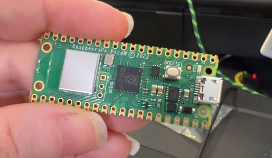](https://blog.adafruit.com/2022/08/30/raspberry-pi-pico-w-circuitpython-blink/)

The firmware UF2 for the Raspberry Pi Pico W LOOKS simple enough... on boot it blinks the onboard LED 3 times and then boots into CircuitPython 8. But, looks can be deceiving! The LED on the Pico W is not connected to a GPIO on the RP2040. It’s connected to a GPIO on the WiFi/BLE module! That blinking means that the bootloader is able to load firmware and communicate with the module in the CircuitPython firmware, an important first step to implementing the rest of the wireless stack. Soon, CircuitPython and the hundreds of libraries and IoT examples will be ready to run on the Pico W - [Adafruit Blog](https://blog.adafruit.com/2022/08/30/raspberry-pi-pico-w-circuitpython-blink/), [YouTube](https://youtu.be/Y7ylUu6esIY) and [Twitter](https://twitter.com/adafruit/status/1564424605602922496).

## Feature

text - [site](url).

## Feature

text - [site](url).

## This Week's Python Streams

Python on Hardware is all about building a cooperative ecosphere which allows contributions to be valued and to grow knowledge. Below are the streams within the last week focusing on the community.

### CircuitPython Deep Dive Stream

[This week](link), Tim streamed work on {subject}.

You can see the latest video and past videos on the Adafruit YouTube channel under the Deep Dive playlist - [YouTube](https://www.youtube.com/playlist?list=PLjF7R1fz_OOXBHlu9msoXq2jQN4JpCk8A).

### CircuitPython Parsec

John Park’s CircuitPython Parsec this week is on {subject} - [Adafruit Blog](link) and [YouTube](link).

Catch all the episodes in the [YouTube playlist](https://www.youtube.com/playlist?list=PLjF7R1fz_OOWFqZfqW9jlvQSIUmwn9lWr).

### The CircuitPython Show

The CircuitPython Show is an independent podcast hosted by Paul Cutler, focusing on the people doing awesome things with CircuitPython. Each episode features Paul in conversation with a guest for a short interview – [CircuitPythonShow](https://circuitpythonshow.com/) and [Twitter](https://twitter.com/circuitpyshow).

The latest episode was released September 5th and features Radomir Dopieralski.  Radomir shares growing up behind the Iron Curtain, gaming on CircuitPython and robots – [Show List](https://circuitpythonshow.com/episodes/all).

## Project of the Week: A CircuitPython Implementation of Conway's Game of Life

[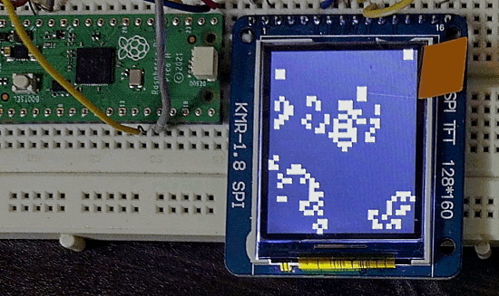](https://github.com/code2k13/GOF_circuitpython)

A CircuitPython implementation of the famous 'Conway's Game of Life'. It uses Adafruit's `adafruit_st7735r` library to draw the game on a 128x160 pixel color TFT LCD and a Raspberry Pi Pico - [GitHub](https://github.com/code2k13/GOF_circuitpython).

## News from around the web!

text - [site](url).

[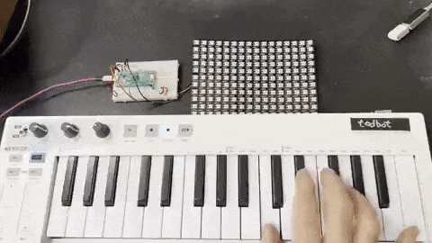](https://twitter.com/todbot/status/1565106334457991170)

Showing incoming MIDI as raining MIDI notes on NeoPixel grid / matrix - [Twitter](https://twitter.com/todbot/status/1565106334457991170) and [GitHub](https://gist.github.com/todbot/ec5c6ed9101fe25bc741e22599f30361).

text - [site](url).

A "Pi Pico Clone" using an RP2040, USB-C, NeoPixel, buttons, and 4 or 16Mb Flash - [Twitter](https://twitter.com/DQSoft/status/1565093687860035584).

text - [site](url).

text - [site](url).

text - [site](url).

[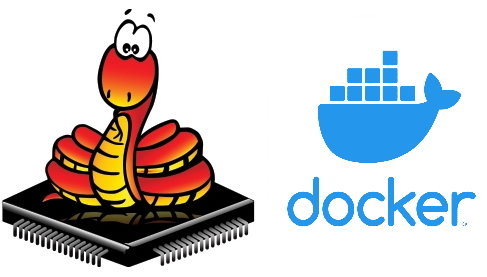](https://hub.docker.com/u/micropython)

MicroPython containers in Docker Hub - [Docker Hub](https://hub.docker.com/u/micropython) via [Twitter](https://twitter.com/matt_trentini/status/1564634828783247365).

[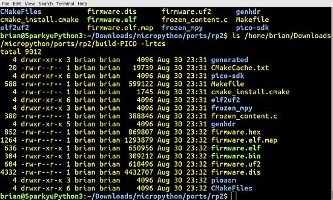](https://twitter.com/BrianLinuxing/status/1564748104653578240)

Using SparkyLinux and MicroPython together - [Twitter](https://twitter.com/BrianLinuxing/status/1564748104653578240).

text - [site](url).

text - [site](url).

text - [site](url).

[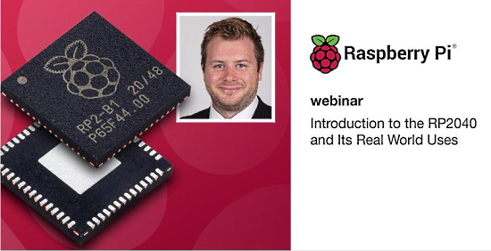](https://community.element14.com/learn/events/c/e/1622?CMP=SOM-TWITTER-PRG-WEBINAR-RASPBERRYPI-RP2040REALWORLDUSES-EVENT-COMM)

Introduction to the RP2040 and its Real World Uses Webinar - [Element14](https://community.element14.com/learn/events/c/e/1622?CMP=SOM-TWITTER-PRG-WEBINAR-RASPBERRYPI-RP2040REALWORLDUSES-EVENT-COMM).

[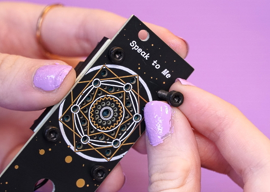](https://blog.thea.codes/raster-vectorization-with-python/)

Using Python to vectorize artwork for PCBs - [thea.codes](https://blog.thea.codes/raster-vectorization-with-python/).

[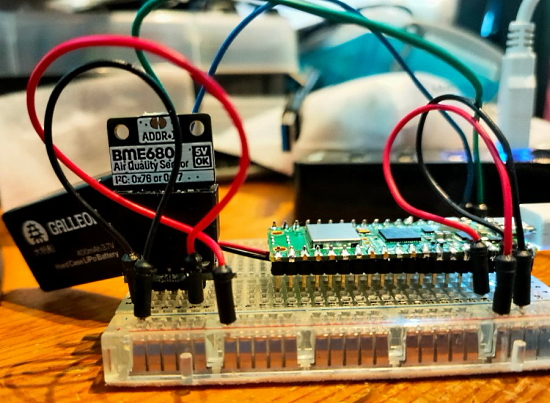](https://twitter.com/rareblog/status/1564971556543074304)

"I've got the Pimoroni BME680 running with a Raspberry Pi Pico W using this MicroPython driver" - [Twitter](https://twitter.com/rareblog/status/1564971556543074304) and [GitHub](https://github.com/robert-hh/BME680-Micropython).

[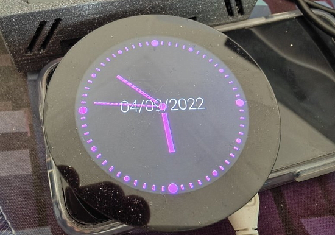](https://twitter.com/TalkTechDOTInfo/status/1566469648606019585)

Making a Pimoroni HyperPixel display based clock in Python - [Twitter](https://twitter.com/TalkTechDOTInfo/status/1566469648606019585).

How I made an ai to watch my cats poop for me with a Python script - [Estefannie](https://www.estefannie.com/blog/f63kkhwgq56u76hjsysy1moy5ttuuf) and [YouTube](https://youtu.be/6jDDZjSyXpc).

Basic Pitch: provide a compatible audio file and basic-pitch will generate a MIDI file, complete with pitch bends. Basic pitch is instrument-agnostic and supports polyphonic instruments, so you can freely enjoy transcription of all your music, no matter what instrument is used. Written in Python - [GitHub](https://github.com/spotify/basic-pitch).

Python Libraries and Frameworks graphic - [Twitter](https://twitter.com/atifaltaf313/status/1564837121080414208).

[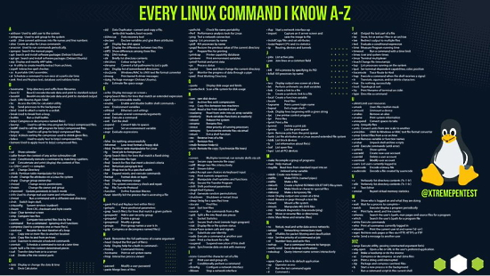](https://twitter.com/Shubham_pen/status/1564474240920862720/photo/1)

Every Linux command I know a-z chart - [Twitter](https://twitter.com/Shubham_pen/status/1564474240920862720/photo/1).

PyDev of the Week:

CircuitPython Weekly Meeting for 

#ICYDNCI What was the most popular, most clicked link, in [last week's newsletter](https://www.adafruitdaily.com/2022/08/30/python-on-microcontrollers-newsletter-python-emulation-on-microbit-python-on-lego-and-more-circuitpython-micropython-thepsf-raspberry_pi/)? [Python Notes for Professionals book](https://goalkicker.com/PythonBook/).

## Coming Soon

[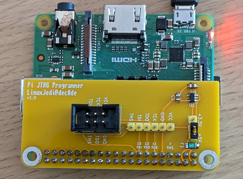](https://twitter.com/LinuxJedi/status/1564554356401356803)

Andrew Hutchings writes "Due to my blog posts about JTAG programming from a Raspberry Pi are quite popular, I have created a small board for JTAG programming from the Pi.I'll make some available as soon as I've documented it" - [Twitter](https://twitter.com/LinuxJedi/status/1564554356401356803).

text - [site](url).

## New Boards Supported by CircuitPython

The number of supported microcontrollers and Single Board Computers (SBC) grows every week. This section outlines which boards have been included in CircuitPython or added to [CircuitPython.org](https://circuitpython.org/).

This week, there were (#/no) new boards added!

- [Board name](url)
- [Board name](url)
- [Board name](url)

*Note: For non-Adafruit boards, please use the support forums of the board manufacturer for assistance, as Adafruit does not have the hardware to assist in troubleshooting.*

Looking to add a new board to CircuitPython? It's highly encouraged! Adafruit has four guides to help you do so:

- [How to Add a New Board to CircuitPython](https://learn.adafruit.com/how-to-add-a-new-board-to-circuitpython/overview)
- [How to add a New Board to the circuitpython.org website](https://learn.adafruit.com/how-to-add-a-new-board-to-the-circuitpython-org-website)
- [Adding a Single Board Computer to PlatformDetect for Blinka](https://learn.adafruit.com/adding-a-single-board-computer-to-platformdetect-for-blinka)
- [Adding a Single Board Computer to Blinka](https://learn.adafruit.com/adding-a-single-board-computer-to-blinka)

## New Learn Guides!

[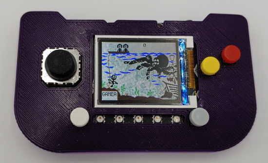](https://learn.adafruit.com/guides/latest)

[Game & Watch Octopus](https://learn.adafruit.com/game-watch-octopus) from [Tim C](https://learn.adafruit.com/u/Foamyguy)

## CircuitPython Libraries!

CircuitPython support for hardware continues to grow. We are adding support for new sensors and breakouts all the time, as well as improving on the drivers we already have. As we add more libraries and update current ones, you can keep up with all the changes right here!

For the latest libraries, download the [Adafruit CircuitPython Library Bundle](https://circuitpython.org/libraries). For the latest community contributed libraries, download the [CircuitPython Community Bundle](https://github.com/adafruit/CircuitPython_Community_Bundle/releases).

If you'd like to contribute, CircuitPython libraries are a great place to start. Have an idea for a new driver? File an issue on [CircuitPython](https://github.com/adafruit/circuitpython/issues)! Have you written a library you'd like to make available? Submit it to the [CircuitPython Community Bundle](https://github.com/adafruit/CircuitPython_Community_Bundle). Interested in helping with current libraries? Check out the [CircuitPython.org Contributing page](https://circuitpython.org/contributing). We've included open pull requests and issues from the libraries, and details about repo-level issues that need to be addressed. We have a guide on [contributing to CircuitPython with Git and GitHub](https://learn.adafruit.com/contribute-to-circuitpython-with-git-and-github) if you need help getting started. You can also find us in the #circuitpython channels on the [Adafruit Discord](https://adafru.it/discord).

You can check out this [list of all the Adafruit CircuitPython libraries and drivers available](https://github.com/adafruit/Adafruit_CircuitPython_Bundle/blob/master/circuitpython_library_list.md). 

The current number of CircuitPython libraries is **364**!

**New Libraries!**

Here's this week's new CircuitPython libraries:

 * [Adafruit_CircuitPython_ENS160](https://github.com/adafruit/Adafruit_CircuitPython_ENS160)
 * [Adafruit_CircuitPython_LTR329_LTR303](https://github.com/adafruit/Adafruit_CircuitPython_LTR329_LTR303)
 * [Adafruit_CircuitPython_PCF8575](https://github.com/adafruit/Adafruit_CircuitPython_PCF8575)

**Updated Libraries!**

Here's this week's updated CircuitPython libraries:

 * [Adafruit_CircuitPython_floppy](https://github.com/adafruit/Adafruit_CircuitPython_floppy)
 * [Adafruit_CircuitPython_Colorsys](https://github.com/adafruit/Adafruit_CircuitPython_Colorsys)
 * [Adafruit_CircuitPython_BLE_File_Transfer](https://github.com/adafruit/Adafruit_CircuitPython_BLE_File_Transfer)
 * [Adafruit_CircuitPython_MSA301](https://github.com/adafruit/Adafruit_CircuitPython_MSA301)
 * [Adafruit_CircuitPython_BLE_BerryMed_Pulse_Oximeter](https://github.com/adafruit/Adafruit_CircuitPython_BLE_BerryMed_Pulse_Oximeter)
 * [Adafruit_CircuitPython_SI1145](https://github.com/adafruit/Adafruit_CircuitPython_SI1145)
 * [Adafruit_CircuitPython_PortalBase](https://github.com/adafruit/Adafruit_CircuitPython_PortalBase)
 * [Adafruit_CircuitPython_SSD1675](https://github.com/adafruit/Adafruit_CircuitPython_SSD1675)
 * [Adafruit_CircuitPython_SSD1680](https://github.com/adafruit/Adafruit_CircuitPython_SSD1680)
 * [Adafruit_CircuitPython_INA260](https://github.com/adafruit/Adafruit_CircuitPython_INA260)
 * [Adafruit_CircuitPython_INA219](https://github.com/adafruit/Adafruit_CircuitPython_INA219)
 * [Adafruit_CircuitPython_GUVX_I2C](https://github.com/adafruit/Adafruit_CircuitPython_GUVX_I2C)
 * [Adafruit_CircuitPython_SSD1327](https://github.com/adafruit/Adafruit_CircuitPython_SSD1327)
 * [Adafruit_CircuitPython_SCD30](https://github.com/adafruit/Adafruit_CircuitPython_SCD30)
 * [Adafruit_CircuitPython_HID](https://github.com/adafruit/Adafruit_CircuitPython_HID)
 * [Adafruit_CircuitPython_MiniMQTT](https://github.com/adafruit/Adafruit_CircuitPython_MiniMQTT)
 * [Adafruit_CircuitPython_ADS1x15](https://github.com/adafruit/Adafruit_CircuitPython_ADS1x15)
 * [Adafruit_CircuitPython_BLE](https://github.com/adafruit/Adafruit_CircuitPython_BLE)
 * [Adafruit_CircuitPython_GPS](https://github.com/adafruit/Adafruit_CircuitPython_GPS)
 * [Adafruit_CircuitPython_LIS2MDL](https://github.com/adafruit/Adafruit_CircuitPython_LIS2MDL)
 * [Adafruit_CircuitPython_SCD4X](https://github.com/adafruit/Adafruit_CircuitPython_SCD4X)
 * [circuitpython](https://github.com/adafruit/circuitpython)
 * [Adafruit_Blinka_bleio](https://github.com/adafruit/Adafruit_Blinka_bleio)
 * [Adafruit_Python_PlatformDetect](https://github.com/adafruit/Adafruit_Python_PlatformDetect)
 * [CircuitPython_Community_Bundle](https://github.com/adafruit/CircuitPython_Community_Bundle)

## What’s the team up to this week?

What is the team up to this week? Let’s check in!

**Dan**

I implemented the ability to turn the CircuitPython status bar on and off, in case it might be found to be interfering with something else, or the user did not want to be present. We were having trouble with the Thonny editor and the status bar, when there were errors present. But this might have been due to an existing bug that was not really related to the status bar but was exercised by it.

I also spent time determining why deep sleep on certain ESP32 boards was using more power than expected in some situations. It appears to be due to not shutting down some power-control pins.

**Kattni**

This week I've been working with CircuitPython on the ESP32 V2 Feather. I'm working on a guide to build a WiFi mailbox notifier. The reason the project was switched to WiFi was to simplify the build, and give me a chance to work with the ESP32 CircuitPython workflow and the new web workflow. I've already found a couple of bugs.

I also created a new template showing how to install CircuitPython on ESP32 boards - we have explanations in multiple places, but not a board-specific version of it for each board guide.

**Melissa**

This past week I made a lot of progress with adding Web Workflow features to [code.circuitpython.org](https://code.circuitpython.org). I finished adding Device Discovery and made the workflow much smoother. One of the things I'm particularly proud of is adding functionality to be able to transfer your work between different URLs. This solves one of the big problems with users starting work in one place and realizing they needed to save the work on a different device. 

Originally we had planned to have everything happen on code.circuitpython.org, but browser security made this difficult and while the workaround of loading the website from the device worked, it made other things more challenging. However, this removes one of the largest remaining obstacles.

**Tim**

I updated the mpy size measurement PR based on feedback received. I tested and reviewed several library PRs including one for an alternative mode of operation for LSM303 accelerometers. I also worked on PIL based scripts to generate number sprites and create animation frames representing the top and bottom half of the numbers flipping down. I've have gotten it worked out so the number of animation frames can be specified so that we can try a few variations to find a good balance between having a smooth animation, and keeping the spritesheets as small as possible to preserve file storage space and memory. 

**Liz**

This week I worked on something that was not CircuitPython related: [a guide showing how to use Unity with Arduino and a 9 DoF sensor](https://learn.adafruit.com/controlling-objects-in-unity-with-arduino). It would be cool to maybe revisit at some point with CircuitPython. However, in my research for the project, integrating Arduino and Unity seems to be a common question without a lot of written examples and code so I'm excited to have this resource available for folks.

I also worked on a new product guide for the [MAX17048 Battery Monitor](https://learn.adafruit.com/adafruit-max17048-lipoly-liion-fuel-gauge-and-battery-monitor). That guide does include CircuitPython. I'm out on vacation next week, but I'm brainstorming a few projects at the moment that I'll be working on when I return.

## Upcoming events!

The next MicroPython Meetup in Melbourne will be on September 28th – [Meetup](https://www.meetup.com/MicroPython-Meetup/). See the [slides](https://docs.google.com/presentation/d/e/2PACX-1vQnoz0AsGaxVf8iaqzYszFUnKqRZTUplnzwJoTtqKBmNYIuo5NL-M1bT5Zoz9ajyHwNxIrWi4zNudUF/pub?start=false&loop=false&delayms=3000&slide=id.p) of the August 24th meeting.

PyCon UK will be returning to Cardiff City Hall from Friday 16th to Sunday 18th September 2022 - [PyCon  UK](https://2022.pyconuk.org/).

After two years in remote mode, Hackaday is very excited to announce that this year’s Hackaday Supercon will be coming back, live! Nov. 4th, 5th, and 6th in sunny Pasadena, CA for three days of hacks, talks, and socializing with the Hackaday community - [Call for proposals](https://docs.google.com/forms/d/e/1FAIpQLSffBmw2vNLZyzdKnPJhKF6u7nvYnjTZQ-lynOhhr8_S8fAd3w/viewform) and [Hackaday](https://hackaday.com/2022/07/18/the-2022-hackaday-supercon-is-on-and-the-call-for-proposals-is-open/).

RISC-V Global Summit, December 12-15, 2022 San Jose, California US - [Linux Foundation](https://events.linuxfoundation.org/riscv-summit/), [YouTube](https://youtu.be/VecaMNCuuF0) via [Twitter](https://twitter.com/risc_v/status/1564719040588926979).

PyCon US 2023 will be April 19-17, 2023, again in Salt Lake City, Utah US - [PyCon US 2023](https://pycon.blogspot.com/2020/12/announcing-pycon-us-20222023.html).

**Send Your Events In**

As for other events, with the COVID pandemic, most in-person events are postponed or held online. If you know of virtual events or upcoming events, please let us know on Twitter with hashtag #CircuitPython or email to cpnews(at)adafruit(dot)com.

## Latest releases

CircuitPython's stable release is [#.#.#](https://github.com/adafruit/circuitpython/releases/latest) and its unstable release is [#.#.#-##.#](https://github.com/adafruit/circuitpython/releases). New to CircuitPython? Start with our [Welcome to CircuitPython Guide](https://learn.adafruit.com/welcome-to-circuitpython).

[2022####](https://github.com/adafruit/Adafruit_CircuitPython_Bundle/releases/latest) is the latest CircuitPython library bundle.

[v#.#.#](https://micropython.org/download) is the latest MicroPython release. Documentation for it is [here](http://docs.micropython.org/en/latest/pyboard/).

[#.#.#](https://www.python.org/downloads/) is the latest Python release. The latest pre-release version is [#.#.#](https://www.python.org/download/pre-releases/).

[#,### Stars](https://github.com/adafruit/circuitpython/stargazers) Like CircuitPython? [Star it on GitHub!](https://github.com/adafruit/circuitpython)

## Call for help -- Translating CircuitPython is now easier than ever!

One important feature of CircuitPython is translated control and error messages. With the help of fellow open source project [Weblate](https://weblate.org/), we're making it even easier to add or improve translations. 

Sign in with an existing account such as GitHub, Google or Facebook and start contributing through a simple web interface. No forks or pull requests needed! As always, if you run into trouble join us on [Discord](https://adafru.it/discord), we're here to help.

## jobs.adafruit.com - Find a dream job, find great candidates!

[jobs.adafruit.com](https://jobs.adafruit.com/) has returned and folks are posting their skills (including CircuitPython) and companies are looking for talented makers to join their companies - from Digi-Key, to Hackaday, Micro Center, Raspberry Pi and more.

**Job of the Week**

text - [Adafruit Jobs Board](https://jobs.adafruit.com/).

## NUMBER thanks!

The Adafruit Discord community, where we do all our CircuitPython development in the open, reached over NUMBER humans - thank you!  Adafruit believes Discord offers a unique way for Python on hardware folks to connect. Join today at [https://adafru.it/discord](https://adafru.it/discord).

## ICYMI - In case you missed it

Python on hardware is the Adafruit Python video-newsletter-podcast! The news comes from the Python community, Discord, Adafruit communities and more and is broadcast on ASK an ENGINEER Wednesdays. The complete Python on Hardware weekly videocast [playlist is here](https://www.youtube.com/playlist?list=PLjF7R1fz_OOXRMjM7Sm0J2Xt6H81TdDev). The video podcast is on [iTunes](https://itunes.apple.com/us/podcast/python-on-hardware/id1451685192?mt=2), [YouTube](http://adafru.it/pohepisodes), [IGTV (Instagram TV](https://www.instagram.com/adafruit/channel/)), and [XML](https://itunes.apple.com/us/podcast/python-on-hardware/id1451685192?mt=2).

[The weekly community chat on Adafruit Discord server CircuitPython channel - Audio / Podcast edition](https://itunes.apple.com/us/podcast/circuitpython-weekly-meeting/id1451685016) - Audio from the Discord chat space for CircuitPython, meetings are usually Mondays at 2pm ET, this is the audio version on [iTunes](https://itunes.apple.com/us/podcast/circuitpython-weekly-meeting/id1451685016), Pocket Casts, [Spotify](https://adafru.it/spotify), and [XML feed](https://adafruit-podcasts.s3.amazonaws.com/circuitpython_weekly_meeting/audio-podcast.xml).

## Codecademy "Learn Hardware Programming with CircuitPython"

Codecademy, an online interactive learning platform used by more than 45 million people, has teamed up with Adafruit to create a coding course, “Learn Hardware Programming with CircuitPython”. The course is now available in the [Codecademy catalog](https://www.codecademy.com/learn/learn-circuitpython?utm_source=adafruit&utm_medium=partners&utm_campaign=circuitplayground&utm_content=pythononhardwarenewsletter).

## Contribute!

The CircuitPython Weekly Newsletter is a CircuitPython community-run newsletter emailed every Tuesday. The complete [archives are here](https://www.adafruitdaily.com/category/circuitpython/). It highlights the latest CircuitPython related news from around the web including Python and MicroPython developments. To contribute, edit next week's draft [on GitHub](https://github.com/adafruit/circuitpython-weekly-newsletter/tree/gh-pages/_drafts) and [submit a pull request](https://help.github.com/articles/editing-files-in-your-repository/) with the changes. You may also tag your information on Twitter with #CircuitPython. 

Join the Adafruit [Discord](https://adafru.it/discord) or [post to the forum](https://forums.adafruit.com/viewforum.php?f=60) if you have questions.
