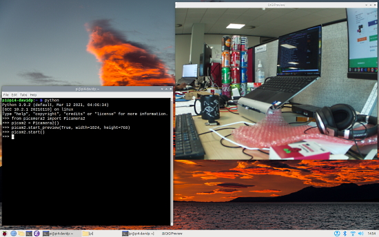
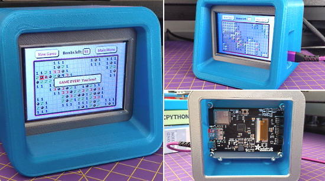
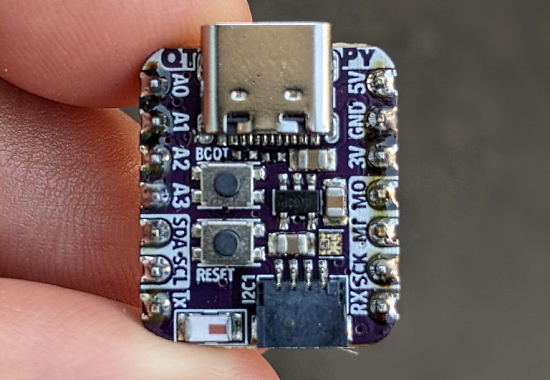
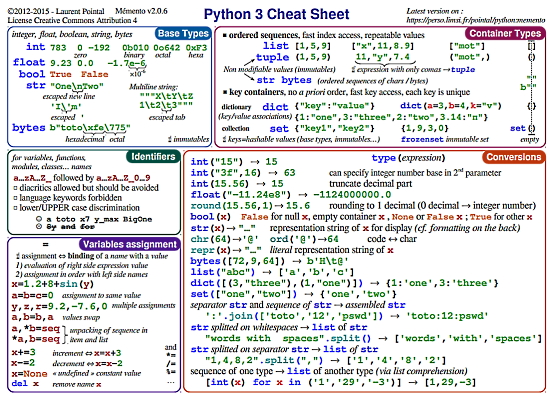
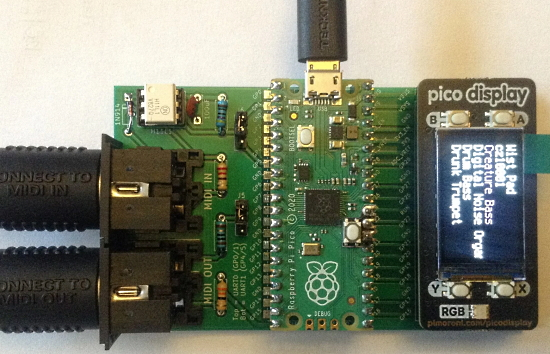
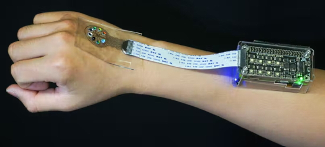
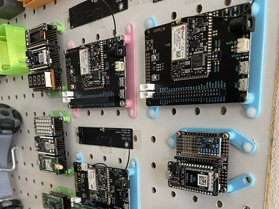
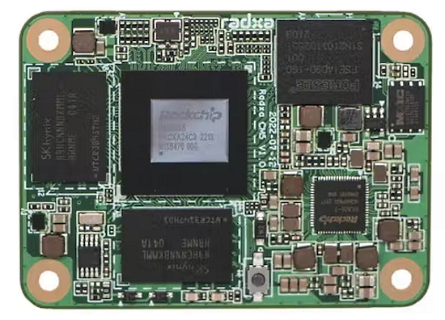
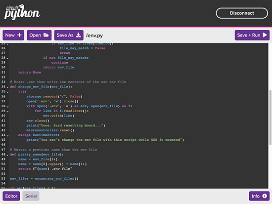

View this email in your browser. **Warning: Flashing Imagery**

Welcome to the latest Python on Microcontrollers newsletter! This has been a wonderful week in Python news with many projects completed over the US holiday weekend. On the other side of the Atlantic, the Raspberry Pi folks have released a new version of their namesake operating system with a new camera app that is much more fully featured and Python friendly. Check out all the projects and resources in this issue, something for everyone.

We're on [Discord](https://discord.gg/HYqvREz), [Twitter](https://twitter.com/search?q=circuitpython&src=typed_query&f=live), and for past newsletters - [view them all here](https://www.adafruitdaily.com/category/circuitpython/). If you're reading this on the web, [subscribe here](https://www.adafruitdaily.com/). Here's the news this week:

## The latest update to Raspberry Pi OS

Raspberry Pi has just released the latest version of Raspberry Pi OS. It is mostly a wrapping-up of all the bug fixes and new versions of software which have been released since the previous image in April; but there are a few small tweaks to the user experience - [Raspberry Pi](https://www.raspberrypi.com/news/the-latest-update-to-raspberry-pi-os/).

)

One of the new features in the latest set of Raspberry Pi OS images are pre-installed beta release versions of the new Picamera2 Python camera library, a replacement for the old PiCamera Python library. This is a higher-level interface and is easier to use. Picamera2 is supported only on recent Bullseye images. It is not supported on Buster or earlier images, nor on Raspberry Pi OS Legacy; nor is it supported on Bullseye images where the legacy camera stack has been re-enabled - [Raspberry Pi](https://www.raspberrypi.com/news/picamera2-beta-release/) and [User's Manual](https://datasheets.raspberrypi.com/camera/picamera2-manual.pdf).

## The 2023 Official Raspberry Pi Handbook is Out Now

The 2023 official Raspberry Pi Handbook is out now. Over 200 pages of Raspberry Pi information including 30 pages on Raspberry Pi Pico. Available in print and as a free PDF download - [MagPi](https://magpi.raspberrypi.com/books/handbook-2023).

## NEW: The Weekly CircuitPython Community Help Desk Every Saturday

Thanks to everyone who came to the first CircuitPython Community Help Desk in the Adafruit Discord and helped make it a success.  Users and developers were able to get help in both text and voice chat.  The Community Help Desk will be held monthly on Saturdays and rotate time zones.   

Come get your questions answered or get help with a project. If you’re looking to help with CircuitPython development, documentation or translations, volunteers will be on hand to help, too - [Adafruit Blog](https://blog.adafruit.com/2022/09/06/new-circuitpython-community-help-desk-this-saturday-circuitpython-support-circuitpython-adafruit/).

## PyCon UK 2022

PyCon UK will be in Cardiff City Hall from this Friday September 16th to Sunday the 18th - [PyCon  UK](https://2022.pyconuk.org/).

### Python on Hardware Community Showcase

Are you going to PyCon UK 2022? There'll be an open session to bring YOUR projects. Join the Python on Hardware Community Showcase - [PyCon UK 2022](https://pretalx.com/pycon-uk-2022/talk/GS8EXT/) via [Twitter](https://twitter.com/carlosperate/status/1567919876282503172).

## Microdot: A Lightweight Web Server API for Python and MicroPython

Microdot is a minimalistic Python web framework inspired by Flask, and designed to run on systems with limited resources such as microcontrollers. It runs on standard Python and on MicroPython - [GitHub](https://github.com/miguelgrinberg/microdot) and [Monk Makes](http://www.doctormonk.com/2022/09/a-better-web-server-for-raspberry-pi.html).

## A Steam-Powered Raspberry Pi Pico

Maker Mike Bell has used a small, steam-powered engine to power a Raspberry Pi Pico along with a few accessories. The Pico can run for around 12 minutes before the water in the boiler dissipates - [Tom's Hardware](https://www.tomshardware.com/news/raspberry-pi-pico-runs-on-steam-engine) and [Twitter](https://twitter.com/mdb036/status/1566017469776625664).

## Companies Hacking Their Way Around the Chip Shortage

The supply chain issues have no end in sight, so manufacturers are being forced to improvise. - [Wired](https://www.wired.com/story/chip-shortage-hacks/).

> “There's desperation in the market,” says Bill Wiseman, a senior partner at the consulting firm McKinsey. “If you’re building a $350,000 mass spectrometer, and you can't ship it because you don't have a 50-cent chip, you’re pretty much willing to pay anything.”

Dan Hutcheson, an analyst at TechInsights, who follows the chip industry, says companies have taken desperate measures to deal with previous shortages, including harvesting chips from other products. He also warns that the shortage could quickly turn into a glut, as the economy cools and demand for new products slows. But he also wonders if the current shortage might have another explanation. “There has to be hoarding out there,” Hutcheson says. “I think chips are the new toilet paper.”

## This Week's Python Streams

Python on Hardware is all about building a cooperative ecosphere which allows contributions to be valued and to grow knowledge. Below are the streams within the last week focusing on the community.

### CircuitPython Deep Dive Stream

[This week](https://youtu.be/0btMy3jpOPk), Tim streamed work on CircuitPython cookie cutting the Flip Clock displayio widget.

You can see the latest video and past videos on the Adafruit YouTube channel under the Deep Dive playlist - [YouTube](https://www.youtube.com/playlist?list=PLjF7R1fz_OOXBHlu9msoXq2jQN4JpCk8A).

### CircuitPython Parsec

John Park’s CircuitPython Parsec this week is on Progress Bars - [Adafruit Blog](https://blog.adafruit.com/2022/09/09/john-parks-circuitpython-parsec-progress-bars-adafruit-johnedgarpark-adafruit-circuitpython/) and [YouTube](https://youtu.be/cxq6j3l75-8).

Catch all the episodes in the [YouTube playlist](https://www.youtube.com/playlist?list=PLjF7R1fz_OOWFqZfqW9jlvQSIUmwn9lWr).

### The CircuitPython Show

The CircuitPython Show is an independent podcast hosted by Paul Cutler, focusing on the people doing awesome things with CircuitPython. Each episode features Paul in conversation with a guest for a short interview – [CircuitPythonShow](https://circuitpythonshow.com/) and [Twitter](https://twitter.com/circuitpyshow).

Last week's episode features Radomir Dopieralski and gaming with CircuitPython. Next week Thea Flowers joins the show and talks about CircuitPyton and her synthesizer company, Winterbloom – [Show List](https://circuitpythonshow.com/episodes/all).

## Project of the Week: Minesweeper Game on an Adafruit PyPortal Titano with CircuitPython

A CircuitPython implementation of the classic MineSweeper game on an Adafruit PyPortal Titano. It uses Adafruit's retro PC design for the 3D printed enclosure - [Twitter](https://twitter.com/snkYmkrct/status/1565768487603240961) and [GitHub](https://github.com/snkYmkrct/CircuitPython_Projects/tree/main/MineSweeper%20on%20PyPortal).

## News from around the web!

)

A CircuitPython program downloading the [Google Cloud Serivce Health page](https://status.cloud.google.com/) and displaying the best rows on an Adafruit MagTag every five minutes with [deep sleep](https://learn.adafruit.com/deep-sleep-with-circuitpython) - [YouTube](https://www.youtube.com/watch?v=qpd9zQPtjrE).

A free DIY mini IoT workshop for the Adafruit QT Py ESP32-S2 - [GitHub](https://github.com/tamberg/circuitpython-workshop) via [Twitter](https://twitter.com/tamberg/status/1566527870595391490).

Using a Raspberry Pi Pico with an Adafruit Sharp Memory display for gaming - [Twitter](https://twitter.com/bateskecom/status/1569211888017506304).

A promising PR to add generic RP2040 DMA support for MicroPython - [GitHub](https://github.com/micropython/micropython/pull/7641) via [Twitter](https://twitter.com/matt_trentini/status/1568215328366407680).

A 2-Key Keyboard with XIAO RP2040 and CircuitPython - [Twitter](https://twitter.com/arduinopraxis/status/1566398838939721729).

A how-to on connecting a MCP9808 digital temperature sensor to a Raspberry Pi Pico running CircuitPython - [rp2040learning](http://www.rp2040learning.com/code/circuitpython/raspberry-pi-pico-and-mcp9808-digital-temperature-sensor-circuitpython-example.php).

More CircuitPython programming for the C64 USB/Serial/Wireless adapter board - [Twitch](https://www.twitch.tv/videos/1586221701).

> "Woot LumosStick showed up this evening in the post and already have it clocking via local Raspberry Pi NTP server, thanks to great design and code by Bradan Lane and of course CircuitPython code from tannewt" - [Twitter](https://twitter.com/k5em/status/1568833806253330432).

A Pi Pico powered plant monitor that reports ambient temperature and soil moisture without using an lcd or screen. The vertical thermometer shows temperature, and the scales tip to indicate dry or wet soil using MicroPython - [Twitter](https://twitter.com/LewisWorkshop/status/1567825457612988417).

Keyboard Builders' Digest Issue 94 is out - [site](https://kbd.news/issue/94/).

A comprehensive Python 3 "cheat sheet", single page double sided - [Sheet (PDF)](https://perso.limsi.fr/pointal/_media/python:cours:mementopython3-english.pdf).

Raspberry Pi Pico MIDI Proto Expander, Part 2 - [DiyElectronicMusic](https://diyelectromusic.wordpress.com/2022/09/06/raspberry-pi-pico-midi-proto-expander-part-2/).

A Wearable, wholly 3D-printed lightsensor could help track the causes of lupus flare-ups. Driven by a Raspberry Pi Zero W and a Python script, this wearable could provide vital insights into light-sensitive conditions - [hackster.io](https://www.hackster.io/news/this-wearable-wholly-3d-printed-light-sensor-could-help-track-the-causes-of-lupus-flare-ups-118510f4619f).

NASA selects SiFive and makes RISC-V the go-to ecosystem for future space missions - [BusinessWire](https://www.businesswire.com/news/home/20220906005374/en/NASA-Selects-SiFive-and-Makes-RISC-V-the-Go-to-Ecosystem-for-Future-Space-Missions) via [Twitter](https://twitter.com/SiFive/status/1567186316336709635).

A wireless message display with Raspberry Pi Pico and uLisp - [uLisp Forum](http://forum.ulisp.com/t/wireless-message-display/1062).

Mohit Bhoite has designed 3D printed holders for development boards, allowing them to be mounted on pegboard - [Twitter](https://twitter.com/MohitBhoite/status/1569046502164828163).

PyDev of the Week:

CircuitPython Weekly Meeting for 

#ICYDNCI What was the most popular, most clicked link, in [last week's newsletter](https://www.adafruitdaily.com/2022/09/06/python-on-microcontrollers-newsletter-circuitpython-7-3-3-circuitpython-coming-to-picow-and-more-circuitpython-micropython-thepsf-raspberry_pi/)? [Every Linux command I know a-z chart](https://twitter.com/Shubham_pen/status/1564474240920862720).

## Coming Soon

Radxa has announced a new system-on-module (SOM) designed for compatibility with Raspberry Pi Compute Module 4 (CM4) carrier boards. Radxa ROCK5 Computing Module (Radxa CM5) is a System-on-Module based on the ROCK5 boards (RK3588/RK3588S inside), containing processor, memory, eMMC flash, and Power Management Unit - [hackster.io](https://www.hackster.io/news/radxa-announces-rock5-cm5-alternative-to-raspberry-pi-s-cm4-teases-nvidia-jetson-compatible-nx5-too-4fb4ee088b99).

Adafruit is coming closer to a new EZ-Link Bluefruit serial module based on an ESP32 - [Adafruit Blog](https://blog.adafruit.com/2022/09/08/adafruit-top-secret-september-7-2022-adafruit-adafruittopsecret-adafruit/) and [Adafruit Top Secret](https://youtu.be/JR-FD5Ieni0).

## New Boards Supported by CircuitPython

The number of supported microcontrollers and Single Board Computers (SBC) grows every week. This section outlines which boards have been included in CircuitPython or added to [CircuitPython.org](https://circuitpython.org/).

This week there were two new boards added!

- [ESP32-S3 Box Lite](https://circuitpython.org/board/espressif_esp32s3_box_lite/)
- [LOLIN S3](https://circuitpython.org/board/lolin_s3/)

*Note: For non-Adafruit boards, please use the support forums of the board manufacturer for assistance, as Adafruit does not have the hardware to assist in troubleshooting.*

Looking to add a new board to CircuitPython? It's highly encouraged! Adafruit has four guides to help you do so:

- [How to Add a New Board to CircuitPython](https://learn.adafruit.com/how-to-add-a-new-board-to-circuitpython/overview)
- [How to add a New Board to the circuitpython.org website](https://learn.adafruit.com/how-to-add-a-new-board-to-the-circuitpython-org-website)
- [Adding a Single Board Computer to PlatformDetect for Blinka](https://learn.adafruit.com/adding-a-single-board-computer-to-platformdetect-for-blinka)
- [Adding a Single Board Computer to Blinka](https://learn.adafruit.com/adding-a-single-board-computer-to-blinka)

## New Learn Guides!

[Tiny LED WiFi Companion Cube](https://learn.adafruit.com/tiny-led-wifi-cube) from [Charlyn G](https://learn.adafruit.com/u/chardane)

[CircuitPython Web Workflow Code Editor Quick Start](https://learn.adafruit.com/getting-started-with-web-workflow-using-the-code-editor) from [Melissa LeBlanc-Williams](https://learn.adafruit.com/u/MakerMelissa)

## CircuitPython Libraries!

CircuitPython support for hardware continues to grow. We are adding support for new sensors and breakouts all the time, as well as improving on the drivers we already have. As we add more libraries and update current ones, you can keep up with all the changes right here!

For the latest libraries, download the [Adafruit CircuitPython Library Bundle](https://circuitpython.org/libraries). For the latest community contributed libraries, download the [CircuitPython Community Bundle](https://github.com/adafruit/CircuitPython_Community_Bundle/releases).

If you'd like to contribute, CircuitPython libraries are a great place to start. Have an idea for a new driver? File an issue on [CircuitPython](https://github.com/adafruit/circuitpython/issues)! Have you written a library you'd like to make available? Submit it to the [CircuitPython Community Bundle](https://github.com/adafruit/CircuitPython_Community_Bundle). Interested in helping with current libraries? Check out the [CircuitPython.org Contributing page](https://circuitpython.org/contributing). We've included open pull requests and issues from the libraries, and details about repo-level issues that need to be addressed. We have a guide on [contributing to CircuitPython with Git and GitHub](https://learn.adafruit.com/contribute-to-circuitpython-with-git-and-github) if you need help getting started. You can also find us in the #circuitpython channels on the [Adafruit Discord](https://adafru.it/discord).

You can check out this [list of all the Adafruit CircuitPython libraries and drivers available](https://github.com/adafruit/Adafruit_CircuitPython_Bundle/blob/master/circuitpython_library_list.md). 

The current number of CircuitPython libraries is **366**!

**New Libraries!**

There are no new libraries this week!

**Updated Libraries!**

Here's this week's updated CircuitPython libraries:

 * [Adafruit_CircuitPython_Register](https://github.com/adafruit/Adafruit_CircuitPython_Register)
 * [Adafruit_CircuitPython_UC8151D](https://github.com/adafruit/Adafruit_CircuitPython_UC8151D)
 * [Adafruit_CircuitPython_TSL2591](https://github.com/adafruit/Adafruit_CircuitPython_TSL2591)
 * [Adafruit_CircuitPython_Touchscreen](https://github.com/adafruit/Adafruit_CircuitPython_Touchscreen)
 * [Adafruit_CircuitPython_US100](https://github.com/adafruit/Adafruit_CircuitPython_US100)
 * [Adafruit_CircuitPython_VEML6075](https://github.com/adafruit/Adafruit_CircuitPython_VEML6075)
 * [Adafruit_CircuitPython_VCNL4010](https://github.com/adafruit/Adafruit_CircuitPython_VCNL4010)
 * [Adafruit_CircuitPython_TSL2561](https://github.com/adafruit/Adafruit_CircuitPython_TSL2561)
 * [Adafruit_CircuitPython_DisplayIO_SSD1305](https://github.com/adafruit/Adafruit_CircuitPython_DisplayIO_SSD1305)
 * [Adafruit_CircuitPython_DisplayIO_SSD1306](https://github.com/adafruit/Adafruit_CircuitPython_DisplayIO_SSD1306)
 * [Adafruit_CircuitPython_DisplayIO_SH1106](https://github.com/adafruit/Adafruit_CircuitPython_DisplayIO_SH1106)
 * [Adafruit_CircuitPython_VEML7700](https://github.com/adafruit/Adafruit_CircuitPython_VEML7700)
 * [Adafruit_CircuitPython_DisplayIO_SH1107](https://github.com/adafruit/Adafruit_CircuitPython_DisplayIO_SH1107)
 * [Adafruit_CircuitPython_TC74](https://github.com/adafruit/Adafruit_CircuitPython_TC74)
 * [Adafruit_CircuitPython_Waveform](https://github.com/adafruit/Adafruit_CircuitPython_Waveform)
 * [Adafruit_CircuitPython_TrellisM4](https://github.com/adafruit/Adafruit_CircuitPython_TrellisM4)
 * [Adafruit_CircuitPython_ADS1x15](https://github.com/adafruit/Adafruit_CircuitPython_ADS1x15)
 * [Adafruit_CircuitPython_Trellis](https://github.com/adafruit/Adafruit_CircuitPython_Trellis)
 * [Adafruit_CircuitPython_TFmini](https://github.com/adafruit/Adafruit_CircuitPython_TFmini)
 * [Adafruit_CircuitPython_asyncio](https://github.com/adafruit/Adafruit_CircuitPython_asyncio)
 * [Adafruit_CircuitPython_TLV493D](https://github.com/adafruit/Adafruit_CircuitPython_TLV493D)
 * [Adafruit_CircuitPython_HID](https://github.com/adafruit/Adafruit_CircuitPython_HID)
 * [Adafruit_Blinka](https://github.com/adafruit/Adafruit_Blinka)
 * [Adafruit_Python_PlatformDetect](https://github.com/adafruit/Adafruit_Python_PlatformDetect)
 * [CircuitPython_Community_Bundle](https://github.com/adafruit/CircuitPython_Community_Bundle)

## What’s the team up to this week?

What is the team up to this week? Let’s check in!

**Dan**

I'm adding the ability to preserve the state of pins when entering deep sleep in CircuitPython. This will allow keeping devices powered up, maintaining static signaling on pins, and the like.

**Kattni**

This week I continued work on the WiFi Mailbox Notifier guide. I also continued to run into bugs and hardware issues. So it hasn't been the smoothest experience. The guide is coming along. It's a very simple build with a very useful result, so if you're interested in knowing when you have new mail, check out this guide once it's published.

**Melissa**

This past week I wrote up a learn guide called [CircuitPython Web Workflow Code Editor Quick Start](https://learn.adafruit.com/getting-started-with-web-workflow-using-the-code-editor). The guide covers getting most features on all the Web Workflow features I've added over the past couple of months. The guide includes a handy script I came up with to allow switching between multiple WiFi networks while USB Mass Storage is disabled.

**Tim**

This week I created FlipDigit and FlipClock widget classes that make use of pre-generated spritesheets to show an animated flip clock style transition from one number to another with displayio. The Digit represents a single number that can flip and change between the numbers 0-9. The FlipClock holds 4 digits, and draws a colon between them. To serve as the first test program using these widgets I used the NTP library to create a flip clock that stays in sync with the real time that it fetched from the server. 

## Upcoming events!

The next MicroPython Meetup in Melbourne will be on September 28th – [Meetup](https://www.meetup.com/MicroPython-Meetup/). See the [slides](https://docs.google.com/presentation/d/e/2PACX-1vQnoz0AsGaxVf8iaqzYszFUnKqRZTUplnzwJoTtqKBmNYIuo5NL-M1bT5Zoz9ajyHwNxIrWi4zNudUF/pub?start=false&loop=false&delayms=3000&slide=id.p) of the August 24th meeting.

After two years in remote mode, Hackaday is very excited to announce that this year’s Hackaday Supercon will be coming back, live! Nov. 4th, 5th, and 6th in sunny Pasadena, CA for three days of hacks, talks, and socializing with the Hackaday community - [Call for proposals](https://docs.google.com/forms/d/e/1FAIpQLSffBmw2vNLZyzdKnPJhKF6u7nvYnjTZQ-lynOhhr8_S8fAd3w/viewform) and [Hackaday](https://hackaday.com/2022/07/18/the-2022-hackaday-supercon-is-on-and-the-call-for-proposals-is-open/).

RISC-V Global Summit, December 12-15, 2022 San Jose, California US - [Linux Foundation](https://events.linuxfoundation.org/riscv-summit/), [YouTube](https://youtu.be/VecaMNCuuF0) via [Twitter](https://twitter.com/risc_v/status/1564719040588926979).

PyCon US 2023 will be April 19-17, 2023, again in Salt Lake City, Utah US - [PyCon US 2023](https://pycon.blogspot.com/2020/12/announcing-pycon-us-20222023.html).

**Send Your Events In**

As for other events, with the COVID pandemic, most in-person events are postponed or held online. If you know of virtual events or upcoming events, please let us know on Twitter with hashtag #CircuitPython or email to cpnews(at)adafruit(dot)com.

## Latest releases

CircuitPython's stable release is [#.#.#](https://github.com/adafruit/circuitpython/releases/latest) and its unstable release is [#.#.#-##.#](https://github.com/adafruit/circuitpython/releases). New to CircuitPython? Start with our [Welcome to CircuitPython Guide](https://learn.adafruit.com/welcome-to-circuitpython).

[2022####](https://github.com/adafruit/Adafruit_CircuitPython_Bundle/releases/latest) is the latest CircuitPython library bundle.

[v#.#.#](https://micropython.org/download) is the latest MicroPython release. Documentation for it is [here](http://docs.micropython.org/en/latest/pyboard/).

[#.#.#](https://www.python.org/downloads/) is the latest Python release. The latest pre-release version is [#.#.#](https://www.python.org/download/pre-releases/).

[#,### Stars](https://github.com/adafruit/circuitpython/stargazers) Like CircuitPython? [Star it on GitHub!](https://github.com/adafruit/circuitpython)

## Call for help -- Translating CircuitPython is now easier than ever!

One important feature of CircuitPython is translated control and error messages. With the help of fellow open source project [Weblate](https://weblate.org/), we're making it even easier to add or improve translations. 

Sign in with an existing account such as GitHub, Google or Facebook and start contributing through a simple web interface. No forks or pull requests needed! As always, if you run into trouble join us on [Discord](https://adafru.it/discord), we're here to help.

## jobs.adafruit.com - Find a dream job, find great candidates!

[jobs.adafruit.com](https://jobs.adafruit.com/) has returned and folks are posting their skills (including CircuitPython) and companies are looking for talented makers to join their companies - from Digi-Key, to Hackaday, Micro Center, Raspberry Pi and more.

## 35,498 thanks!

The Adafruit Discord community, where we do all our CircuitPython development in the open, reached over 35,498 humans - thank you!  Adafruit believes Discord offers a unique way for Python on hardware folks to connect. Join today at [https://adafru.it/discord](https://adafru.it/discord).

## ICYMI - In case you missed it

Python on hardware is the Adafruit Python video-newsletter-podcast! The news comes from the Python community, Discord, Adafruit communities and more and is broadcast on ASK an ENGINEER Wednesdays. The complete Python on Hardware weekly videocast [playlist is here](https://www.youtube.com/playlist?list=PLjF7R1fz_OOXRMjM7Sm0J2Xt6H81TdDev). The video podcast is on [iTunes](https://itunes.apple.com/us/podcast/python-on-hardware/id1451685192?mt=2), [YouTube](http://adafru.it/pohepisodes), [IGTV (Instagram TV](https://www.instagram.com/adafruit/channel/)), and [XML](https://itunes.apple.com/us/podcast/python-on-hardware/id1451685192?mt=2).

[The weekly community chat on Adafruit Discord server CircuitPython channel - Audio / Podcast edition](https://itunes.apple.com/us/podcast/circuitpython-weekly-meeting/id1451685016) - Audio from the Discord chat space for CircuitPython, meetings are usually Mondays at 2pm ET, this is the audio version on [iTunes](https://itunes.apple.com/us/podcast/circuitpython-weekly-meeting/id1451685016), Pocket Casts, [Spotify](https://adafru.it/spotify), and [XML feed](https://adafruit-podcasts.s3.amazonaws.com/circuitpython_weekly_meeting/audio-podcast.xml).

## Codecademy "Learn Hardware Programming with CircuitPython"

Codecademy, an online interactive learning platform used by more than 45 million people, has teamed up with Adafruit to create a coding course, “Learn Hardware Programming with CircuitPython”. The course is now available in the [Codecademy catalog](https://www.codecademy.com/learn/learn-circuitpython?utm_source=adafruit&utm_medium=partners&utm_campaign=circuitplayground&utm_content=pythononhardwarenewsletter).

## Contribute!

The CircuitPython Weekly Newsletter is a CircuitPython community-run newsletter emailed every Tuesday. The complete [archives are here](https://www.adafruitdaily.com/category/circuitpython/). It highlights the latest CircuitPython related news from around the web including Python and MicroPython developments. To contribute, edit next week's draft [on GitHub](https://github.com/adafruit/circuitpython-weekly-newsletter/tree/gh-pages/_drafts) and [submit a pull request](https://help.github.com/articles/editing-files-in-your-repository/) with the changes. You may also tag your information on Twitter with #CircuitPython. 

Join the Adafruit [Discord](https://adafru.it/discord) or [post to the forum](https://forums.adafruit.com/viewforum.php?f=60) if you have questions.
