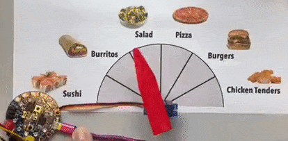
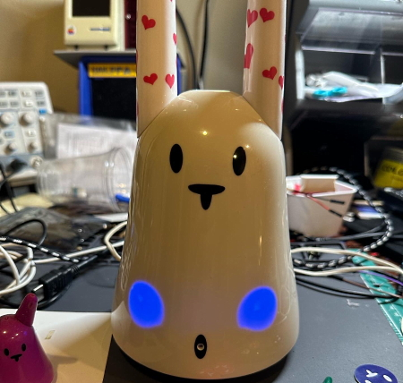
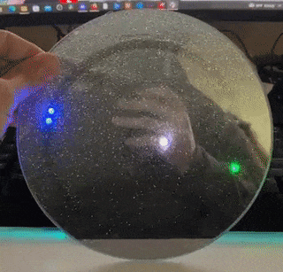
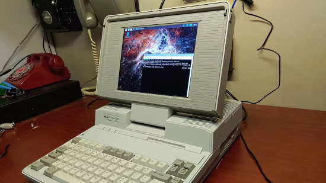
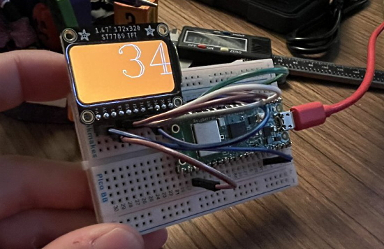

- [X] Kattni updates
- [ ] change date
- [ ] update title
- [ ] Feature story
- [ ] Update  for images
- [ ] Update ICYDNCI
- [ ] All images 550w max only
- [ ] Link "View this email in your browser."

News Sources

- [python.org](https://www.python.org/)
- [Python Insider - dev team blog](https://pythoninsider.blogspot.com/)
- [MicroPython Meetup Blog](https://melbournemicropythonmeetup.github.io/)
- [hackaday.io newest projects MicroPython](https://hackaday.io/projects?tag=micropython&sort=date) and [CircuitPython](https://hackaday.io/projects?tag=circuitpython&sort=date)
- [hackaday CircuitPython](https://hackaday.com/blog/?s=circuitpython) and [MicroPython](https://hackaday.com/blog/?s=micropython)
- [hackster.io CircuitPython](https://www.hackster.io/search?q=circuitpython&i=projects&sort_by=most_recent) and [MicroPython](https://www.hackster.io/search?q=micropython&i=projects&sort_by=most_recent)

View this email in your browser. **Warning: Flashing Imagery**

Welcome to the latest Python on Microcontrollers newsletter! 

We're on [Discord](https://discord.gg/HYqvREz), [Twitter](https://twitter.com/search?q=circuitpython&src=typed_query&f=live), and for past newsletters - [view them all here](https://www.adafruitdaily.com/category/circuitpython/). If you're reading this on the web, [subscribe here](https://www.adafruitdaily.com/). Here's the news this week:

## CircuitPython 8.0.0 Beta.1 Released

Adafruit has released **CircuitPython 8.0.0-beta.1**, a beta release for 8.0.0. It is relatively stable, but there will be further additions and fixes before final release.

**Notable changes to 8.0.0 since 7.3.0:**
- Added WiFi workflow with browser-based device discovery, filesystem browsing, upload, download, file editing, serial/REPL connection.
- Added a one-line status bar, which displays connection status, last exception, and version on a terminal window title or on the top line of
an attached display. Support for status bar display is also being added to the Mu and Thonny editors.
- `.env` file in **CIRCUITPY** specifies WiFI connection parameters, BLE name, and other startup values.
- `dotenv` support: `os.getenv()` values can be set in the `.env` file.
- Preliminary implementation of WiFi on the Pi Pico W.
- Revised Espressif camera support, now available on ESP32, ESP32-S2, and ESP32-S3.
- Bulk analog input: `analogbufio` (available only on RP2040 for now).
- Pin state can be preserved during deep sleep (available only on Espressif for now).
- Allow setting USB VID, PID, manufacturer, and product ids at runtime.
- `AnalogIn` values are full range from 0 to 65535, instead of having zeros on low-order bits.
- `OneWire` is only in `onewireio`, and is no longer in `busio` or `bitbangio`.
- `gamepadshift` has been removed: use `keypad.ShiftRegisterKeys` instead.
- `MP3Decoder` and `WaveFile` can now take a filename instead of an open file.
- `PulseOut` no longer accepts a `PWMOut`. Use a `Pin` instead.
- Added `TileGrid.contains()`.
- `i2ctarget.I2CTarget` is the new name for `i2cperipheral.I2CPeripheral`. Accept both for now. `I2CPeripheral` will be removed in 9.0.0.
- Auto-brightness support in `displayio` and `framebufferio` has been removed. It was never implemented completely.
- Restored `rainbowio` and `onewireio` to a number of boards.
- Print out whole-number floats exactly and correctly.
- Enabled `collections.deque` on most builds.

text - [site](url).

## Hacktoberfest 2022

Hacktoberfest 2022 is here! Whether it's your first time or not, it's time to hack out four (or more) pristine open source pull/merge requests. All of October, DigitalOcean sponsors Hacktoberfest - [Hacktoberfest](https://hacktoberfest.com/).

## USB Simplifies Branding

Every time the USB Implementers Forum posted a new set of logos describing ever more USB speeds, electrical power possibilities, and display parameters, it resulted in an outpouring of confusion, ridicule, and anger — yes, anger. But at long last, the USB-IF has finally made things better, with a simplified set of USB logos!

> Instead of forcing consumers to use versioning terminology such as USB 3.2 Gen 2×2 or messing around with marketing terms like “SuperSpeed+,” the USB-IF has simplified things so you can now just write something like “USB 20Gbps.” The version details still exist and have meaning for developers and engineers, but most of the consumer-level branding now boils down to just the following four packaging labels, indicating the maximum supported data rate.

A similar set of logos will appear on cable plugs. As USB data rates and standards’ names became more complicated, the options for charging wattage have been distilled down to just two: 60 watts and 240 watts, with future USB chargers using the new logos - [Adafruit Blog](https://blog.adafruit.com/2022/09/30/usb-simplifies-branding-but-reintroduces-active-cables-usb-tidbits/) and [TidBITS](https://tidbits.com/2022/09/29/usb-simplifies-branding/).

## KiCad Version 6.0.8 Released

The KiCad 6.0.8 stable version contains critical bug fixes and other minor improvements since the previous release. This release contains several critical bug fixes so please consider upgrading as soon as possible - [KiCad.org](https://www.kicad.org/blog/2022/09/KiCad-6.0.8-Release/).

## Feature

text - [site](url).

## Sunsetting the Atom Editor

The Atom editor development team has decided to retire Atom in order to further their commitment to bringing fast and reliable software development to the cloud via Microsoft Visual Studio Code and GitHub Codespaces.

They have announced they are sunsetting Atom and will archive all projects under the organization on December 15, 2022 - [GitHub Blog](https://github.blog/2022-06-08-sunsetting-atom/) and [Repository](https://github.com/atom/atom).

## Feature

text - [site](url).

## This Week's Python Streams

Python on Hardware is all about building a cooperative ecosphere which allows contributions to be valued and to grow knowledge. Below are the streams within the last week focusing on the community.

### CircuitPython Deep Dive Stream

[This week](link), Tim streamed work on {subject}.

You can see the latest video and past videos on the Adafruit YouTube channel under the Deep Dive playlist - [YouTube](https://www.youtube.com/playlist?list=PLjF7R1fz_OOXBHlu9msoXq2jQN4JpCk8A).

### CircuitPython Parsec

John Park’s CircuitPython Parsec this week is on {subject} - [Adafruit Blog](link) and [YouTube](link).

Catch all the episodes in the [YouTube playlist](https://www.youtube.com/playlist?list=PLjF7R1fz_OOWFqZfqW9jlvQSIUmwn9lWr).

### The CircuitPython Show

The CircuitPython Show is an independent podcast hosted by Paul Cutler, focusing on the people doing awesome things with CircuitPython. Each episode features Paul in conversation with a guest for a short interview – [CircuitPythonShow](https://circuitpythonshow.com/) and [Twitter](https://twitter.com/circuitpyshow).

The latest episode was released Monday, October 3rd and features Bradán Lane.  Bradán shares how CircuitPython has helped create his products, including the JoyPad and LumosRing.– [Show List](https://circuitpythonshow.com/episodes/all).

## Project of the Week: Turn your houseplant into a pet

Fytó is a project by [CodersCafeTech](https://www.instructables.com/member/CodersCafeTech/) which incorporates Raspberry Pi Zero and sensors to turn your basic houseplant into a pet. Fytó can show six different emotions based on its interpretation of three sensors measuring soil moisture, temperature, and light levels. It uses a Raspberry Pi Zero 2 W running Python with the Adafruit Blinka compatibility software, allowing use of CircuitPython code - [Raspberry Pi](https://www.raspberrypi.com/news/turn-your-houseplant-into-a-pet/) and [YouTube](https://youtu.be/zNNZdUzXV7M).

## News from around the web!

The JägerMachine is an IoT shot pouring machine powered by a Raspberry Pi 3B+. It features a full GUI that allows the user to configure the device, pour a shot, and also check previous messages sent to the machine. Once paired with it's own GMail account, the JägerMachine waits for emails containing a secret user defined subject line and a custom message that gets displayed on the screen. Once an email is received a shot is poured. It uses Adafruit Blinka allowing use of CircuitPython libraries - [GitLab](https://gitlab.com/_Pegor/jagermachine).

Using Circuit Playground Express and CircuitPython to randomly choose the dinner menu - [Twitter](https://twitter.com/gallaugher/status/1575155681761824768).

Nabaztag Rabbit Robot Bunny Upgrade with Raspberry Pi Zero W and Python - [Twitter](https://twitter.com/JohnKennedyEsq/status/1575731221824671744).

An Artemis launch hoodie with NeoPixels, an Adafruit ItsyBitsy and CircuitPython - [Twitter](https://twitter.com/caitlinsdad/status/1575572905387511809).

A follow-on to last week's Project of the Week, John hooks a modern rectangular color display to a Raspberry Pi for the display and processor for the Tandy Radio Shack Model 100 portable upgrade - [Twitter](https://twitter.com/JohnKennedyEsq/status/1575333990638452736).

A clock prototype with a NeoPixel ring, a Raspberry Pi Pico and CircuitPython - [Twitter](https://twitter.com/NickRuffilo/status/1575937146351161345).

MidiCommander for Adafruit PyGamer and CircuitPython, a portable patch library - [ChromaKinetics](http://chromakinetics.com/midicommander/), [GitHub](https://github.com/gmeader/pybadge/tree/master/MidiCommander) and [YouTube](https://youtu.be/xjDKXFzHlWw).

Vintage NEC ProSpeed 286 computer revived with Raspberry Pi - [hackster.io](https://www.hackster.io/news/vintage-nec-prospeed-286-computer-revived-with-raspberry-pi-17be9b6cf6ac) and [Adafruit Blog](https://blog.adafruit.com/2022/09/30/vintage-nec-286-computer-revived-with-raspberry-pi-piday-raspberrypi-raspberry_pi-hacksterio/).

A Raspberry Pi Pico W based Halloween countdown widget with MicroPython - [Twitter](https://twitter.com/MattRichardson/status/1574916578029850624).

text - [site](url).

text - [site](url).

text - [site](url).

text - [site](url).

text - [site](url).

text - [site](url).

text - [site](url).

How Can You Install a Pre-Release Version of Python? - [Real Python](https://realpython.com/python-pre-release/).

text - [site](url).

PyDev of the Week:

CircuitPython Weekly Meeting for 

**#ICYDNCI What was the most popular, most clicked link, in [last week's newsletter](https://link)? [title](url).**

## Coming Soon

text - [site](url).

text - [site](url).

## New Boards Supported by CircuitPython

The number of supported microcontrollers and Single Board Computers (SBC) grows every week. This section outlines which boards have been included in CircuitPython or added to [CircuitPython.org](https://circuitpython.org/).

This week, there were (#/no) new boards added!

- [Board name](url)
- [Board name](url)
- [Board name](url)

*Note: For non-Adafruit boards, please use the support forums of the board manufacturer for assistance, as Adafruit does not have the hardware to assist in troubleshooting.*

Looking to add a new board to CircuitPython? It's highly encouraged! Adafruit has four guides to help you do so:

- [How to Add a New Board to CircuitPython](https://learn.adafruit.com/how-to-add-a-new-board-to-circuitpython/overview)
- [How to add a New Board to the circuitpython.org website](https://learn.adafruit.com/how-to-add-a-new-board-to-the-circuitpython-org-website)
- [Adding a Single Board Computer to PlatformDetect for Blinka](https://learn.adafruit.com/adding-a-single-board-computer-to-platformdetect-for-blinka)
- [Adding a Single Board Computer to Blinka](https://learn.adafruit.com/adding-a-single-board-computer-to-blinka)

## New Learn Guides!

[Tandy 1000 Keyboard to USB with CircuitPython](https://learn.adafruit.com/tandy-1000-keyboard-to-usb-with-circuitpython) from [Jeff Epler](https://learn.adafruit.com/u/jepler)

[Adafruit ENS160 MOX Gas Sensor](https://learn.adafruit.com/adafruit-ens160-mox-gas-sensor) from [Liz Clark](https://learn.adafruit.com/u/BlitzCityDIY)

## CircuitPython Libraries!

CircuitPython support for hardware continues to grow. We are adding support for new sensors and breakouts all the time, as well as improving on the drivers we already have. As we add more libraries and update current ones, you can keep up with all the changes right here!

For the latest libraries, download the [Adafruit CircuitPython Library Bundle](https://circuitpython.org/libraries). For the latest community contributed libraries, download the [CircuitPython Community Bundle](https://github.com/adafruit/CircuitPython_Community_Bundle/releases).

If you'd like to contribute, CircuitPython libraries are a great place to start. Have an idea for a new driver? File an issue on [CircuitPython](https://github.com/adafruit/circuitpython/issues)! Have you written a library you'd like to make available? Submit it to the [CircuitPython Community Bundle](https://github.com/adafruit/CircuitPython_Community_Bundle). Interested in helping with current libraries? Check out the [CircuitPython.org Contributing page](https://circuitpython.org/contributing). We've included open pull requests and issues from the libraries, and details about repo-level issues that need to be addressed. We have a guide on [contributing to CircuitPython with Git and GitHub](https://learn.adafruit.com/contribute-to-circuitpython-with-git-and-github) if you need help getting started. You can also find us in the #circuitpython channels on the [Adafruit Discord](https://adafru.it/discord).

You can check out this [list of all the Adafruit CircuitPython libraries and drivers available](https://github.com/adafruit/Adafruit_CircuitPython_Bundle/blob/master/circuitpython_library_list.md). 

The current number of CircuitPython libraries is **372**!

**Updated Libraries!**

Here's this week's updated CircuitPython libraries:
  * [Adafruit_CircuitPython_TCA8418](https://github.com/adafruit/Adafruit_CircuitPython_TCA8418)
  * [Adafruit_CircuitPython_TestRepo](https://github.com/adafruit/Adafruit_CircuitPython_TestRepo)
  * [Adafruit_CircuitPython_MCP9600](https://github.com/adafruit/Adafruit_CircuitPython_MCP9600)
  * [Adafruit_CircuitPython_Wiznet5k](https://github.com/adafruit/Adafruit_CircuitPython_Wiznet5k)
  * [Adafruit_CircuitPython_MiniMQTT](https://github.com/adafruit/Adafruit_CircuitPython_MiniMQTT)
  * [Adafruit_CircuitPython_MAX31855](https://github.com/adafruit/Adafruit_CircuitPython_MAX31855)
  * [Adafruit_CircuitPython_BME280](https://github.com/adafruit/Adafruit_CircuitPython_BME280)
  * [Adafruit_CircuitPython_LTR390](https://github.com/adafruit/Adafruit_CircuitPython_LTR390)
  * [Adafruit_CircuitPython_HX8357](https://github.com/adafruit/Adafruit_CircuitPython_HX8357)
  * [Adafruit_CircuitPython_DPS310](https://github.com/adafruit/Adafruit_CircuitPython_DPS310)
  * [Adafruit_CircuitPython_HT16K33](https://github.com/adafruit/Adafruit_CircuitPython_HT16K33)
  * [Adafruit_CircuitPython_HTU31D](https://github.com/adafruit/Adafruit_CircuitPython_HTU31D)
  * [Adafruit_CircuitPython_LPS35HW](https://github.com/adafruit/Adafruit_CircuitPython_LPS35HW)
  * [Adafruit_CircuitPython_74HC595](https://github.com/adafruit/Adafruit_CircuitPython_74HC595)
  * [Adafruit_CircuitPython_LC709203F](https://github.com/adafruit/Adafruit_CircuitPython_LC709203F)
  * [Adafruit_CircuitPython_LPS2X](https://github.com/adafruit/Adafruit_CircuitPython_LPS2X)
  * [Adafruit_CircuitPython_DS2413](https://github.com/adafruit/Adafruit_CircuitPython_DS2413)
  * [Adafruit_Blinka](https://github.com/adafruit/Adafruit_Blinka)
  * [Adafruit_Python_PlatformDetect](https://github.com/adafruit/Adafruit_Python_PlatformDetect)
  * [CircuitPython_Community_Bundle](https://github.com/adafruit/CircuitPython_Community_Bundle)

## What’s the team up to this week?

What is the team up to this week? Let’s check in!

**Dan**

During the past week, I improved the status bar code a bit, making it less likely that partial status bar codes will be output to the REPL. But it may need further work.

I also figured out why CircuitPython on the ESP32 was consuming more power during deep sleep than Arduino. The "pin holding" mechanism in ESP32, which allows setting pin levels during deep sleep, itself consumes extra current when enabled. I now turn it on only when necessary, and the power consumption levels are as expected.

I'll probably release CircuitPython 8.0.0-beta.1 sometime in the next week.

**Kattni**

text - [site](url).

**Melissa**

This past week I've mostly focused on the [Code Editor](https://code.circuitpython.org/). I added USB Workflow and improved the BLE workflow as well as some bug fixes and UI improvements. There's still a little bit more to do, but it's coming along nicely. I also spent a little time helping Brent get the WipperSnapper LittleFS partitioning working again, which broke due to recent a Board Support Package update.

**Tim**

This week I tested and reviewed a PR with refactored BME280 driver that allows us to cut down on repeated code. I completed some additional testing and fixes for the mpy filesize actions task. During the Deep Dive I tested and showed off a new community library that provides some neat new functionality with displayio.Palette's. It makes it easy to set several similar colors to all be transparent, without any need to manually manually manipulate the palette order within BMP files.

**Jeff**

I split this past week between a Learn project, version 8 bugfixes, and work on the Pico W.

The Learn project is another vintage keyboard to USB converter. This time, it was the Tandy 1000 keyboard. The keyboard uses a clocked serial protocol, which can be captured and decoded by the PIO peripheral of the Adafruit QT Py RP2040. [Check out the guide!](https://learn.adafruit.com/tandy-1000-keyboard-to-usb-with-circuitpython/overview) I was keen to publish this guide in September, which is known in the retrocomputing community as the month of "#SepTandy".

I grabbed and fixed a couple of reported issues in the core, bringing us closer to the next 8.0.0 beta release. Most notably, I upgraded ulab to version 5.1.1, bringing in a number of good bug-fixes and improvements.

Finally, Pico W. I really appreciated the community feedback about this work on the GitHub issue and pull request, as well as on DIscord! I identified and fixed one major bug, which meant sockets stopped working after 8 sockets were ever opened, and marked the Pull Request as ready for review. With any luck, this will be part of the next version 8 beta, and we can get feedback from a wider range of users.

**Liz**

This week I worked on a new product guide for the [ENS160 MOX Gas Sensor](https://learn.adafruit.com/adafruit-ens160-mox-gas-sensor) and a guide to bring the [CLUE Sensor Plotter project into PyLeap](https://learn.adafruit.com/pyleap-clue-sensor-plotter). The [CLUE Sensor Plotter](https://learn.adafruit.com/clue-sensor-plotter-circuitpython) was originally a guide by Kevin Walters and I added the code files to be pulled into PyLeap.

## Upcoming events!

The next MicroPython Meetup in Melbourne will be on October 28th – [Meetup](https://www.meetup.com/MicroPython-Meetup/). See the [slides](https://www.youtube.com/watch?v=xIVE4KeflFY) of the September 28th meeting.

October is Open Hardware Month! OSHWA kicks it off October 3rd [Open Hardware Ask Me Anything (AMA) with Alicia Gibb](https://ohm.oshwa.org/event/open-hardware-ama-with-alicia-gibb/) at 11:00 am - 12:00 pm MDT US time - [OSHWA](https://ohm.oshwa.org/).

After two years in remote mode, Hackaday is very excited to announce that this year’s Hackaday Supercon will be coming back, live! Nov. 4th, 5th, and 6th in sunny Pasadena, CA for three days of hacks, talks, and socializing with the Hackaday community - [Call for proposals](https://docs.google.com/forms/d/e/1FAIpQLSffBmw2vNLZyzdKnPJhKF6u7nvYnjTZQ-lynOhhr8_S8fAd3w/viewform) and [Hackaday](https://hackaday.com/2022/07/18/the-2022-hackaday-supercon-is-on-and-the-call-for-proposals-is-open/).

RISC-V Global Summit, December 12-15, 2022 San Jose, California US - [Linux Foundation](https://events.linuxfoundation.org/riscv-summit/), [YouTube](https://youtu.be/VecaMNCuuF0) via [Twitter](https://twitter.com/risc_v/status/1564719040588926979).

PyCon US 2023 will be April 19-17, 2023, again in Salt Lake City, Utah US - [PyCon US 2023](https://pycon.blogspot.com/2020/12/announcing-pycon-us-20222023.html).

**Send Your Events In**

As for other events, with the COVID pandemic, most in-person events are postponed or held online. If you know of virtual events or upcoming events, please let us know on Twitter with hashtag #CircuitPython or email to cpnews(at)adafruit(dot)com.

## Latest releases

CircuitPython's stable release is [#.#.#](https://github.com/adafruit/circuitpython/releases/latest) and its unstable release is [#.#.#-##.#](https://github.com/adafruit/circuitpython/releases). New to CircuitPython? Start with our [Welcome to CircuitPython Guide](https://learn.adafruit.com/welcome-to-circuitpython).

[2022####](https://github.com/adafruit/Adafruit_CircuitPython_Bundle/releases/latest) is the latest CircuitPython library bundle.

[v#.#.#](https://micropython.org/download) is the latest MicroPython release. Documentation for it is [here](http://docs.micropython.org/en/latest/pyboard/).

[#.#.#](https://www.python.org/downloads/) is the latest Python release. The latest pre-release version is [#.#.#](https://www.python.org/download/pre-releases/).

[#,### Stars](https://github.com/adafruit/circuitpython/stargazers) Like CircuitPython? [Star it on GitHub!](https://github.com/adafruit/circuitpython)

## Call for help -- Translating CircuitPython is now easier than ever!

One important feature of CircuitPython is translated control and error messages. With the help of fellow open source project [Weblate](https://weblate.org/), we're making it even easier to add or improve translations. 

Sign in with an existing account such as GitHub, Google or Facebook and start contributing through a simple web interface. No forks or pull requests needed! As always, if you run into trouble join us on [Discord](https://adafru.it/discord), we're here to help.

## jobs.adafruit.com - Find a dream job, find great candidates!

[jobs.adafruit.com](https://jobs.adafruit.com/) has returned and folks are posting their skills (including CircuitPython) and companies are looking for talented makers to join their companies - from Digi-Key, to Hackaday, Micro Center, Raspberry Pi and more.

**Job of the Week**

text - [Adafruit Jobs Board](https://jobs.adafruit.com/).

## NUMBER thanks!

The Adafruit Discord community, where we do all our CircuitPython development in the open, reached over NUMBER humans - thank you!  Adafruit believes Discord offers a unique way for Python on hardware folks to connect. Join today at [https://adafru.it/discord](https://adafru.it/discord).

## ICYMI - In case you missed it

Python on hardware is the Adafruit Python video-newsletter-podcast! The news comes from the Python community, Discord, Adafruit communities and more and is broadcast on ASK an ENGINEER Wednesdays. The complete Python on Hardware weekly videocast [playlist is here](https://www.youtube.com/playlist?list=PLjF7R1fz_OOXRMjM7Sm0J2Xt6H81TdDev). The video podcast is on [iTunes](https://itunes.apple.com/us/podcast/python-on-hardware/id1451685192?mt=2), [YouTube](http://adafru.it/pohepisodes), [IGTV (Instagram TV](https://www.instagram.com/adafruit/channel/)), and [XML](https://itunes.apple.com/us/podcast/python-on-hardware/id1451685192?mt=2).

[The weekly community chat on Adafruit Discord server CircuitPython channel - Audio / Podcast edition](https://itunes.apple.com/us/podcast/circuitpython-weekly-meeting/id1451685016) - Audio from the Discord chat space for CircuitPython, meetings are usually Mondays at 2pm ET, this is the audio version on [iTunes](https://itunes.apple.com/us/podcast/circuitpython-weekly-meeting/id1451685016), Pocket Casts, [Spotify](https://adafru.it/spotify), and [XML feed](https://adafruit-podcasts.s3.amazonaws.com/circuitpython_weekly_meeting/audio-podcast.xml).

## Codecademy "Learn Hardware Programming with CircuitPython"

Codecademy, an online interactive learning platform used by more than 45 million people, has teamed up with Adafruit to create a coding course, “Learn Hardware Programming with CircuitPython”. The course is now available in the [Codecademy catalog](https://www.codecademy.com/learn/learn-circuitpython?utm_source=adafruit&utm_medium=partners&utm_campaign=circuitplayground&utm_content=pythononhardwarenewsletter).

## Contribute!

The CircuitPython Weekly Newsletter is a CircuitPython community-run newsletter emailed every Tuesday. The complete [archives are here](https://www.adafruitdaily.com/category/circuitpython/). It highlights the latest CircuitPython related news from around the web including Python and MicroPython developments. To contribute, edit next week's draft [on GitHub](https://github.com/adafruit/circuitpython-weekly-newsletter/tree/gh-pages/_drafts) and [submit a pull request](https://help.github.com/articles/editing-files-in-your-repository/) with the changes. You may also tag your information on Twitter with #CircuitPython. 

Join the Adafruit [Discord](https://adafru.it/discord) or [post to the forum](https://forums.adafruit.com/viewforum.php?f=60) if you have questions.
