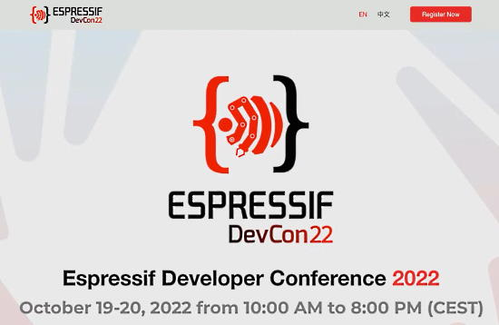
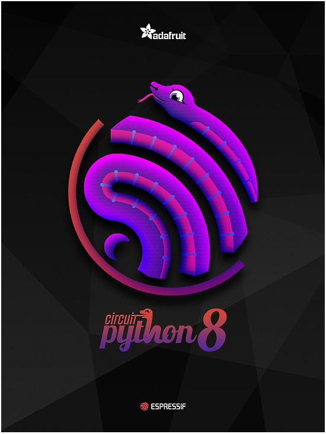
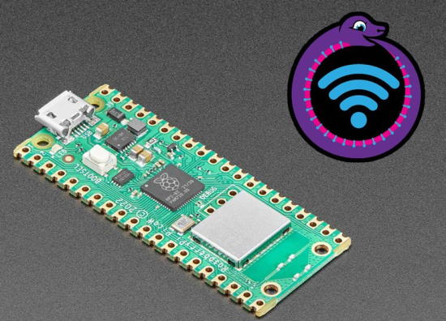
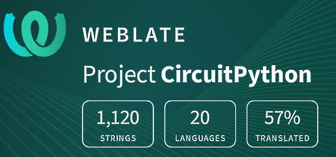

- [ ] Kattni updates
- [ ] change date
- [ ] update title
- [ ] Feature story
- [ ] Update  for images
- [ ] Update ICYDNCI
- [ ] All images 550w max only
- [ ] Link "View this email in your browser."

News Sources

- [python.org](https://www.python.org/)
- [Python Insider - dev team blog](https://pythoninsider.blogspot.com/)
- [MicroPython Meetup Blog](https://melbournemicropythonmeetup.github.io/)
- [hackaday.io newest projects MicroPython](https://hackaday.io/projects?tag=micropython&sort=date) and [CircuitPython](https://hackaday.io/projects?tag=circuitpython&sort=date)
- [hackaday CircuitPython](https://hackaday.com/blog/?s=circuitpython) and [MicroPython](https://hackaday.com/blog/?s=micropython)
- [hackster.io CircuitPython](https://www.hackster.io/search?q=circuitpython&i=projects&sort_by=most_recent) and [MicroPython](https://www.hackster.io/search?q=micropython&i=projects&sort_by=most_recent)

View this email in your browser. **Warning: Flashing Imagery**

Welcome to the latest Python on Microcontrollers newsletter!  - *Ed.*

We're on [Discord](https://discord.gg/HYqvREz), [Twitter](https://twitter.com/search?q=circuitpython&src=typed_query&f=live), and for past newsletters - [view them all here](https://www.adafruitdaily.com/category/circuitpython/). If you're reading this on the web, [subscribe here](https://www.adafruitdaily.com/). Here's the news this week:

## Espressif Developer Conference 2022 This Week With Ladyada

Espressif DevCon22 is the first official for Espressif developers. This two-day online conference October 19-20 will bring to you content about products and solutions created by Espressif and its partners. You can expect over 30 talks on topics including Matter, RainMaker, ESP-IDF, Privilege Separation, Embedded Rust, Components Manager, Board Support Packages, 3rd-party frameworks, and more - [Espressif](https://devcon.espressif.com/#program).

Limor "Ladyada" Fried of Adafruit will speak about CircuitPython on ESP32 at 1900 Central European Time on October 19th - [Espressif](https://devcon.espressif.com/#program).

## CircuitPython 8.0.0 Beta 2 Released!

CircuitPython 8.0.0-beta.2 was released! It is relatively stable, but there will be further additions and fixes before final release - [Adafruit Blog](https://blog.adafruit.com/2022/10/13/circuitpython-8-0-0-beta-2-released/).

**Warning: The flash partitioning for the Raspberry Pi Pico W has changed since 8.0.0-beta.1. When you load 8.0.0-beta.2 over beta.1 (or vice versa), on the Pico W only, CIRCUITPY will be erased and reformatted.**

Notable changes to 8.0.0 since 7.3.0

* Added WiFi workflow with browser-based device discovery, filesystem browsing, upload, download, file editing, serial/REPL connection.
* Added a one-line status bar, which displays connection status, last exception, and version on a terminal window title or on the top line of an attached display. Support for status bar display is also being added to the Mu and Thonny editors.
* `.env` file in CIRCUITPY specifies WiFi connection parameters, BLE name, and other startup values.
* `dotenv` support: `os.getenv()` values are set by values in `.env` file. Values can be fetched from other `dotenv`-format files.
* WiFi functionality implemented on the Pi Pico W.
* Revised Espressif camera support, now available on ESP32, ESP32-S2, and ESP32-S3.
* Bulk analog input: `analogbufio` (available only on RP2040 for now).
* Pin state can be preserved during deep sleep (available only on Espressif for now).
* Allow setting USB VID, PID, manufacturer, and product ids at runtime.
* Enabled `collections.deque` on most builds.
* `MP3Decoder` and `WaveFile` can now take a filename instead of an open file.
* `AnalogIn` values are full range from 0 to 65535, instead of having zeros on low-order bits.
* In-place firmware update (`dualbank`) capability may be disabled in favor of a larger CIRCUITPY drive.
* Added `TileGrid.contains()`.
* Added `os.utime()`.

[Full Release Notes](https://github.com/adafruit/circuitpython/releases/tag/8.0.0-beta.2).

## Join the Python Developers Survey 2022: Share and learn about the community

The Python Software Foundation (PSF) is conducting the sixth iteration of the official Python Developers Survey. The goal is to capture the current state of the language and the ecosystem around it. By comparing the results with last year’s, they can identify and share with everyone the hottest trends in the Python community and the key insights into it. The PSF encourages you to contribute to our community’s knowledge. [The survey](https://pyfound.blogspot.com/2022/10/join-python-developers-survey-2022.html) should only take about 10-15 minutes to complete.

The survey is organized in partnership between the Python Software Foundation and JetBrains. After the survey is over, the PSF will publish the aggregated results and randomly choose 20 winners (among those who complete the survey in its entirety), who will each receive a $100 Amazon Gift Card or a local equivalent - [PSF](https://pyfound.blogspot.com/2022/10/join-python-developers-survey-2022.html).

## Feature

text - [site](url).

## Feature

text - [site](url).

## Looking for Testers

River Wang writes:

> Alpha version of the new CircuitPython online IDE is out! If you want to help me test it out, please visit [https://urfdvw.github.io/cpy-ol-ide-tests/#](https://urfdvw.github.io/cpy-ol-ide-tests/#). Sorry the Github repo is a bit messy right now. It is going public soon. For now, please use "Help->Feedback" to send me some suggestions - [Twitter](https://twitter.com/River___Wang/status/1579552619613519873) and [GitHub](https://urfdvw.github.io/cpy-ol-ide-tests/#).

## This Week's Python Streams

Python on Hardware is all about building a cooperative ecosphere which allows contributions to be valued and to grow knowledge. Below are the streams within the last week focusing on the community.

### CircuitPython Deep Dive Stream

[This week](link), Tim streamed work on {subject}.

You can see the latest video and past videos on the Adafruit YouTube channel under the Deep Dive playlist - [YouTube](https://www.youtube.com/playlist?list=PLjF7R1fz_OOXBHlu9msoXq2jQN4JpCk8A).

### CircuitPython Parsec

John Park’s CircuitPython Parsec this week is on {subject} - [Adafruit Blog](link) and [YouTube](link).

Catch all the episodes in the [YouTube playlist](https://www.youtube.com/playlist?list=PLjF7R1fz_OOWFqZfqW9jlvQSIUmwn9lWr).

### The CircuitPython Show

The CircuitPython Show is an independent podcast hosted by Paul Cutler, focusing on the people doing awesome things with CircuitPython. Each episode features Paul in conversation with a guest for a short interview – [CircuitPythonShow](https://circuitpythonshow.com/) and [Twitter](https://twitter.com/circuitpyshow).

The latest episode was released October 17th and features Jim Mussared, a MicroPython maintainer – [Show List](https://circuitpythonshow.com/episodes/all).

## Project of the Week

text - [site](url).

## News from around the web!

text - [site](url).

text - [site](url).

text - [site](url).

text - [site](url).

text - [site](url).

text - [site](url).

text - [site](url).

text - [site](url).

text - [site](url).

text - [site](url).

text - [site](url).

text - [site](url).

text - [site](url).

text - [site](url).

text - [site](url).

text - [site](url).

text - [site](url).

Python Community News is a podcast, livestream, and newsletter that focuses on the Non-Pipable news in the Python Community.

Join Jon Banafato, experienced conference organizer, and Jay Miller, community organizer and advocate, each week as they look at the top stories affecting Pythonistas around the world.

You can tune in live every friday at 6pm EST/3pm PST. If you miss them live you can check out the podcast or watch the VODs on Youtube. - [Python Community News](https://pythoncommunitynews.com/) via [Twitter](https://twitter.com/PyCommunityNews).

PyDev of the Week: NAME on [Mouse vs Python]()

CircuitPython Weekly Meeting for DATE ([notes]()) [on YouTube]()

#ICYDNCI What was the most popular, most clicked link, in [last week's newsletter](https://www.adafruitdaily.com/2022/10/11/python-on-microcontrollers-newsletter-circuitpython-supports-pico-w-in-latest-beta-and-much-more-circuitpython-micropython-thepsf-raspberry_pi/)? [Free Python Books (pdf)](https://twitter.com/clcoding/status/1578072143140556800).

## Coming Soon and New

PINE64 Uunveils the Ox64, a low-cost dual-core RISC-V Single-Board Computer with breadboard support. With 64MB of RAM and up to 16MB of flash, this low-cost embedded machine will run Linux and a RTOS in a Raspberry Pi Pico form factor - [hackster.io](https://www.hackster.io/news/pine64-unveils-the-ox64-a-low-cost-dual-core-risc-v-single-board-computer-with-breadboard-support-36465495dcbe).

ROCK 4 is a Single Board Computer (SBC) in an ultra-small form factor that offers class-leading performance while leveraging outstanding mechanical compatibility. The ROCK 4 offers makers, IoT enthusiasts, hobbyists, PC DIY enthusiasts and others a reliable and extremely capable platform for building and tinkering their ideas into reality - [Review](https://rock.talktech.info/2022/10/12/welcome-to-the-radxa-rock-%f0%9f%a4%98-4-model-se/) and [Radxa](https://rockpi.org/).

text - [site](url).

## New Boards Supported by CircuitPython

The number of supported microcontrollers and Single Board Computers (SBC) grows every week. This section outlines which boards have been included in CircuitPython or added to [CircuitPython.org](https://circuitpython.org/).

This week, there were (#/no) new boards added!

- [Board name](url)
- [Board name](url)
- [Board name](url)

*Note: For non-Adafruit boards, please use the support forums of the board manufacturer for assistance, as Adafruit does not have the hardware to assist in troubleshooting.*

Looking to add a new board to CircuitPython? It's highly encouraged! Adafruit has four guides to help you do so:

- [How to Add a New Board to CircuitPython](https://learn.adafruit.com/how-to-add-a-new-board-to-circuitpython/overview)
- [How to add a New Board to the circuitpython.org website](https://learn.adafruit.com/how-to-add-a-new-board-to-the-circuitpython-org-website)
- [Adding a Single Board Computer to PlatformDetect for Blinka](https://learn.adafruit.com/adding-a-single-board-computer-to-platformdetect-for-blinka)
- [Adding a Single Board Computer to Blinka](https://learn.adafruit.com/adding-a-single-board-computer-to-blinka)

## New Learn Guides!

[title](url) from [name](url)

[title](url) from [name](url)

[title](url) from [name](url)

## Updated Learn Guides!

[title](url) from [name](url)

## CircuitPython Libraries!

CircuitPython support for hardware continues to grow. We are adding support for new sensors and breakouts all the time, as well as improving on the drivers we already have. As we add more libraries and update current ones, you can keep up with all the changes right here!

For the latest libraries, download the [Adafruit CircuitPython Library Bundle](https://circuitpython.org/libraries). For the latest community contributed libraries, download the [CircuitPython Community Bundle](https://github.com/adafruit/CircuitPython_Community_Bundle/releases).

If you'd like to contribute, CircuitPython libraries are a great place to start. Have an idea for a new driver? File an issue on [CircuitPython](https://github.com/adafruit/circuitpython/issues)! Have you written a library you'd like to make available? Submit it to the [CircuitPython Community Bundle](https://github.com/adafruit/CircuitPython_Community_Bundle). Interested in helping with current libraries? Check out the [CircuitPython.org Contributing page](https://circuitpython.org/contributing). We've included open pull requests and issues from the libraries, and details about repo-level issues that need to be addressed. We have a guide on [contributing to CircuitPython with Git and GitHub](https://learn.adafruit.com/contribute-to-circuitpython-with-git-and-github) if you need help getting started. You can also find us in the #circuitpython channels on the [Adafruit Discord](https://adafru.it/discord).

You can check out this [list of all the Adafruit CircuitPython libraries and drivers available](https://github.com/adafruit/Adafruit_CircuitPython_Bundle/blob/master/circuitpython_library_list.md). 

The current number of CircuitPython libraries is **###**!

**New Libraries!**

Here's this week's new CircuitPython libraries:

* [library](url)

**Updated Libraries!**

Here's this week's updated CircuitPython libraries:

* [library](url)

## What’s the team up to this week?

What is the team up to this week? Let’s check in!

**Dan**

I released CircuitPython 8.0.0-beta.2 on October 13. It has much more complete Pico W WiFi support, courtesy Jeff, including SSL. There are also many other fixes and additions.

By upgrading to a newer version of the ESP-IDF, I was able to fix a couple of problems in the Espressif WiFi code, including a crash and a scanning problem. Unfortunately, this version does not yet fix the ESP32-S3 I2C problems we are seeing.

I am still chipping away at the remaining issues for the 8.0.0 final release.

**Kattni**

text - [site](url).

**Melissa**

This past week I worked on updating the Running [TensorFlow Lite Object Recognition on the Raspberry Pi 4](https://learn.adafruit.com/running-tensorflow-lite-on-the-raspberry-pi-4) guide so that it can now be used with the latest Bullseye release. This involved a lot of trial and error to find what settings played nicest together.

**Tim**

text - [site](url).

**Liz**

This past week I worked on a guide to import the [CLUE Custom Badge project into PyLeap](https://learn.adafruit.com/pyleap-clue-custom-conference-badge). Since folks will be using PyLeap for this project, I included instructions on editing the code with the File Glider app to customize the badge. This is a great way for folks to use and edit CircuitPython projects without a computer.

I also updated the [Arduino to CircuitPython](https://learn.adafruit.com/arduino-to-circuitpython) guide. There was some guide feedback relating to updates that have occurred with CircuitPython over the last few releases so everything should be up to date now.

## Upcoming events!

The next MicroPython Meetup in Melbourne will be on October 28th – [Meetup](https://www.meetup.com/MicroPython-Meetup/). See the [slides](https://www.youtube.com/watch?v=xIVE4KeflFY) of the September 28th meeting.

October is Open Hardware Month – OSHWA.

After two years in remote mode, Hackaday is very excited to announce that this year’s Hackaday Supercon will be coming back, live! Nov. 4th, 5th, and 6th in sunny Pasadena, CA for three days of hacks, talks, and socializing with the Hackaday community - [Call for proposals](https://docs.google.com/forms/d/e/1FAIpQLSffBmw2vNLZyzdKnPJhKF6u7nvYnjTZQ-lynOhhr8_S8fAd3w/viewform) and [Hackaday](https://hackaday.com/2022/07/18/the-2022-hackaday-supercon-is-on-and-the-call-for-proposals-is-open/).

RISC-V Global Summit, December 12-15, 2022 San Jose, California US - [Linux Foundation](https://events.linuxfoundation.org/riscv-summit/), [YouTube](https://youtu.be/VecaMNCuuF0) via [Twitter](https://twitter.com/risc_v/status/1564719040588926979).

PyCon US 2023 will be April 19-17, 2023, again in Salt Lake City, Utah US - [PyCon US 2023](https://pycon.blogspot.com/2020/12/announcing-pycon-us-20222023.html).

**Send Your Events In**

As for other events, with the COVID pandemic, most in-person events are postponed or held online. If you know of virtual events or upcoming events, please let us know on Twitter with hashtag #CircuitPython or email to cpnews(at)adafruit(dot)com.

## Latest releases

CircuitPython's stable release is [#.#.#](https://github.com/adafruit/circuitpython/releases/latest) and its unstable release is [#.#.#-##.#](https://github.com/adafruit/circuitpython/releases). New to CircuitPython? Start with our [Welcome to CircuitPython Guide](https://learn.adafruit.com/welcome-to-circuitpython).

[2022####](https://github.com/adafruit/Adafruit_CircuitPython_Bundle/releases/latest) is the latest CircuitPython library bundle.

[v#.#.#](https://micropython.org/download) is the latest MicroPython release. Documentation for it is [here](http://docs.micropython.org/en/latest/pyboard/).

[#.#.#](https://www.python.org/downloads/) is the latest Python release. The latest pre-release version is [#.#.#](https://www.python.org/download/pre-releases/).

[#,### Stars](https://github.com/adafruit/circuitpython/stargazers) Like CircuitPython? [Star it on GitHub!](https://github.com/adafruit/circuitpython)

## Call for help -- Translating CircuitPython is now easier than ever!

One important feature of CircuitPython is translated control and error messages. With the help of fellow open source project [Weblate](https://weblate.org/), we're making it even easier to add or improve translations. 

Sign in with an existing account such as GitHub, Google or Facebook and start contributing through a simple web interface. No forks or pull requests needed! As always, if you run into trouble join us on [Discord](https://adafru.it/discord), we're here to help.

## jobs.adafruit.com - Find a dream job, find great candidates!

[jobs.adafruit.com](https://jobs.adafruit.com/) has returned and folks are posting their skills (including CircuitPython) and companies are looking for talented makers to join their companies - from Digi-Key, to Hackaday, Micro Center, Raspberry Pi and more.

## 35,688 thanks!

The Adafruit Discord community, where we do all our CircuitPython development in the open, reached over 35,688 humans - thank you!  Adafruit believes Discord offers a unique way for Python on hardware folks to connect. Join today at [https://adafru.it/discord](https://adafru.it/discord).

## ICYMI - In case you missed it

Python on hardware is the Adafruit Python video-newsletter-podcast! The news comes from the Python community, Discord, Adafruit communities and more and is broadcast on ASK an ENGINEER Wednesdays. The complete Python on Hardware weekly videocast [playlist is here](https://www.youtube.com/playlist?list=PLjF7R1fz_OOXRMjM7Sm0J2Xt6H81TdDev). The video podcast is on [iTunes](https://itunes.apple.com/us/podcast/python-on-hardware/id1451685192?mt=2), [YouTube](http://adafru.it/pohepisodes), [IGTV (Instagram TV](https://www.instagram.com/adafruit/channel/)), and [XML](https://itunes.apple.com/us/podcast/python-on-hardware/id1451685192?mt=2).

[The weekly community chat on Adafruit Discord server CircuitPython channel - Audio / Podcast edition](https://itunes.apple.com/us/podcast/circuitpython-weekly-meeting/id1451685016) - Audio from the Discord chat space for CircuitPython, meetings are usually Mondays at 2pm ET, this is the audio version on [iTunes](https://itunes.apple.com/us/podcast/circuitpython-weekly-meeting/id1451685016), Pocket Casts, [Spotify](https://adafru.it/spotify), and [XML feed](https://adafruit-podcasts.s3.amazonaws.com/circuitpython_weekly_meeting/audio-podcast.xml).

## Codecademy "Learn Hardware Programming with CircuitPython"

Codecademy, an online interactive learning platform used by more than 45 million people, has teamed up with Adafruit to create a coding course, “Learn Hardware Programming with CircuitPython”. The course is now available in the [Codecademy catalog](https://www.codecademy.com/learn/learn-circuitpython?utm_source=adafruit&utm_medium=partners&utm_campaign=circuitplayground&utm_content=pythononhardwarenewsletter).

## Contribute!

The CircuitPython Weekly Newsletter is a CircuitPython community-run newsletter emailed every Tuesday. The complete [archives are here](https://www.adafruitdaily.com/category/circuitpython/). It highlights the latest CircuitPython related news from around the web including Python and MicroPython developments. To contribute, edit next week's draft [on GitHub](https://github.com/adafruit/circuitpython-weekly-newsletter/tree/gh-pages/_drafts) and [submit a pull request](https://help.github.com/articles/editing-files-in-your-repository/) with the changes. You may also tag your information on Twitter with #CircuitPython. 

Join the Adafruit [Discord](https://adafru.it/discord) or [post to the forum](https://forums.adafruit.com/viewforum.php?f=60) if you have questions.
