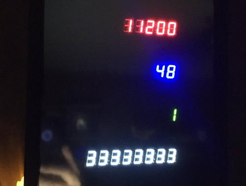
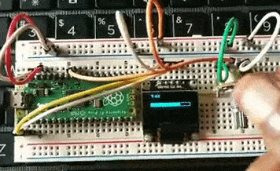
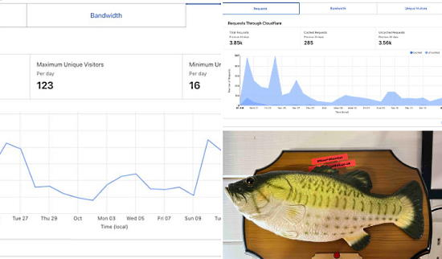
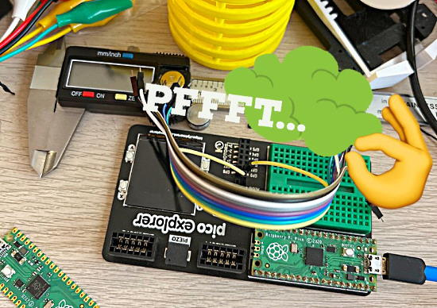
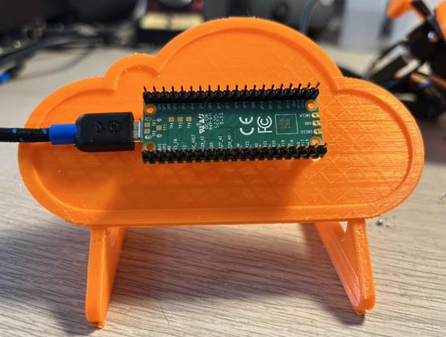
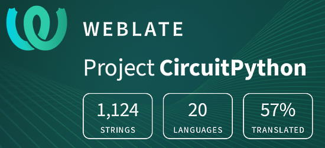

- [ ] Kattni updates
- [ ] change date
- [ ] update title
- [ ] Feature story
- [ ] Update  for images
- [ ] Update ICYDNCI
- [ ] All images 550w max only
- [ ] Link "View this email in your browser."

News Sources

- [python.org](https://www.python.org/)
- [Python Insider - dev team blog](https://pythoninsider.blogspot.com/)
- [MicroPython Meetup Blog](https://melbournemicropythonmeetup.github.io/)
- [hackaday.io newest projects MicroPython](https://hackaday.io/projects?tag=micropython&sort=date) and [CircuitPython](https://hackaday.io/projects?tag=circuitpython&sort=date)
- [hackaday CircuitPython](https://hackaday.com/blog/?s=circuitpython) and [MicroPython](https://hackaday.com/blog/?s=micropython)
- [hackster.io CircuitPython](https://www.hackster.io/search?q=circuitpython&i=projects&sort_by=most_recent) and [MicroPython](https://www.hackster.io/search?q=micropython&i=projects&sort_by=most_recent)
- [https://opensource.com/tags/python](https://opensource.com/tags/python)

View this email in your browser. **Warning: Flashing Imagery**

Welcome to the latest Python on Microcontrollers newsletter!  - *Ed.*

We're on [Discord](https://discord.gg/HYqvREz), [Twitter](https://twitter.com/search?q=circuitpython&src=typed_query&f=live), and for past newsletters - [view them all here](https://www.adafruitdaily.com/category/circuitpython/). If you're reading this on the web, [subscribe here](https://www.adafruitdaily.com/). Here's the news this week:

## CircuitPython 8.0.0 Beta 3 Released

Developers have released CircuitPython 8.0.0-beta.3, a beta release for 8.0.0. It is relatively stable, but there will be further additions and fixes before final release  - [Adafruit Blog](https://blog.adafruit.com/2022/10/20/circuitpython-8-0-0-beta-3-released/).

**NOTE: ESP32-C3** board builds are not functional since 8.0.0-beta.2. Use 8.0.0-beta.1.

**Notable changes to 8.0.0 since 7.3.0**

* Added WiFi workflow with browser-based device discovery, filesystem browsing, upload, download, file editing, serial/REPL connection (available only on Espressif for now).
* Added a one-line status bar, which displays connection status, last exception, and version on a terminal window title or on the top line of an attached display. Support for status bar display is also being added to the Mu and Thonny editors.
* `.env` file in CIRCUITPY specifies WiFI connection parameters, BLE name, and other startup values.
* `dotenv` support: `os.getenv()` values are set by values in `.env` file. Values can be fetched from other dotenv-format files.
* WiFi functionality implemented on the Pi Pico W.
* Revised Espressif camera support, now available on ESP32, ESP32-S2, and ESP32-S3.
* Bulk analog input: `analogbufio` (available only on RP2040 for now).
* Pin state can be preserved during deep sleep (available only on Espressif for now).
* Allow setting USB VID, PID, manufacturer, and product ids at runtime.
* Enabled `collections.deque` on most builds.
* `MP3Decoder` and `WaveFile` can now take a filename instead of an open file.
* `AnalogIn` values are full range from 0 to 65535, instead of having zeros on low-order bits.
* In-place firmware update (`dualbank`) capability may be disabled in favor of a larger CIRCUITPY drive.
* Added `TileGrid.contains()`.
* Added `os.utime()`.
* Added `coproc` module, for running programs on an on-chip co-processor. Currently available for the RISC-V core on the ESP32-S2 and ESP32-S3.

See more - [GitHub](https://github.com/adafruit/circuitpython/releases/tag/8.0.0-beta.3).

## Feature

text - [site](url).

## Feature

text - [site](url).

## MicroPython Code Optimization

Techniques for optrimizing MicroPython code - [Ohidur](https://blog.ohidur.com/posts/micropython-code-optimization/).

## This Week's Python Streams

Python on Hardware is all about building a cooperative ecosphere which allows contributions to be valued and to grow knowledge. Below are the streams within the last week focusing on the community.

### CircuitPython Deep Dive Stream

[This week](link), Tim streamed work on {subject}.

You can see the latest video and past videos on the Adafruit YouTube channel under the Deep Dive playlist - [YouTube](https://www.youtube.com/playlist?list=PLjF7R1fz_OOXBHlu9msoXq2jQN4JpCk8A).

### CircuitPython Parsec

John Park’s CircuitPython Parsec this week is on {subject} - [Adafruit Blog](link) and [YouTube](link).

Catch all the episodes in the [YouTube playlist](https://www.youtube.com/playlist?list=PLjF7R1fz_OOWFqZfqW9jlvQSIUmwn9lWr).

### The CircuitPython Show

The CircuitPython Show is an independent podcast hosted by Paul Cutler, focusing on the people doing awesome things with CircuitPython. Each episode features Paul in conversation with a guest for a short interview – [CircuitPythonShow](https://circuitpythonshow.com/) and [Twitter](https://twitter.com/circuitpyshow).

The CircuitPythonShow is off this week.  Last week featured Jim Mussared of MicroPython and next week is a special Halloween episode.  Paul took the podcast on the road and visited Jason Pecor and the River Prairie Trolls. – [Show List](https://circuitpythonshow.com/episodes/all).

CircuitPython community members Paul Cutler and Tod Kurt have started a new podcast, The Bootloader. In episode three, among the topics Paul and Tod discuss include facial recognition using CircuitPython; and Tod shares a deep dive into CircuitPython's ulab library. - [The Bootloader website](https://thebootloader.net) and [Twitter](https://twitter.com/thebootloader).

### Chip Shortage

text - [site](url).

## Project of the Week: Fasster CircuitPython LED Animations with ulab

Tod writes about achieving a 10x speedup on NeoPixel LED animations in CircuitPython using the Numpy-like ulab library - [Twitter](https://twitter.com/todbot/status/1583524068963164160), [Blog](https://todbot.com/blog/2022/10/21/speed-up-circuitpython-led-animations-10x/) and [Code](https://github.com/todbot/circuitpython_led_effects).

For a simple fire animation that was optimized, the results are striking:

* fire_no_ulab.py: ~40 milliseconds per frame for 256 LEDs on an RP2040
* fire_with_ulab.py: ~4 milliseconds per frame for 256 LEDs on an RP2040

> The technique is to create a “working copy” of the LED data in a ulab/numpy array, and use ulab functions as much as possible. Then at the last possible moment, copy the info from the working copy to the real LEDs object. It only adds a few lines of code to existing solutions and you get access to all tehse cool ulab array functions! (It would be really cool if the neopixel object could take a ulab array to avoid this copy).

## News from around the web!

𝘾𝙮𝙗𝙚𝙧 𝘾𝙞𝙩𝙮 𝘾𝙞𝙧𝙘𝙪𝙞𝙩𝙨 is building a round display powered by an RP2040 microcontroller. They have it running CircuitPython to make gauges and the Adafruit eye demo - [Twitter](https://twitter.com/MakeAugusta/status/1572303829609103361).

Using 7-segment displays, Raspberry Pi Pico W and CircuitPython to display different APIs like GitHub and YouTube - [Twitter](https://twitter.com/TreasureDev/status/1582674236044214272) and [Here](https://twitter.com/TreasureDev/status/1583014848283058176).

A Raspberry Pi Pico and MicroPython animated skull, ready for the launch of an 8th grade “Intro to Animatronics” unit - [Twitter](https://twitter.com/MsHaughs/status/1582492642973085696).

A progress bar using a Raspberry Pi Pico, OLED and MicroPython - [Twitter](https://twitter.com/judenkereuwem/status/1582665718050410499) and [GitHub](https://github.com/judenkereuwem/Raspberry_Pi_Pico_MicroPython/blob/main/Project%20ideas/pico_barGraph_OLED.py).

3D Printed Adafruit MacroPad RP2040 Build - [Reddit](https://www.reddit.com/r/adafruit/comments/y6mp3x/3d_printed_adafruit_macropad_rp2040_build/).

Putting together a simple and affordable robot kit with a Raspberry Pi Pico to educate about microcontrollers and MicroPython - [Twitter](https://twitter.com/sagecodes/status/1582077789624479744).

Turning a Big Mouth Billy Bass into a Raspberry Pi Pico W controllable robot hosting its own website at https://mouthpi.co - [Twitter](https://twitter.com/kevsmac/status/1546436665614401537).

How to customize a USB HID device with CircuitPython - [STEAM Tokyo](https://steam-tokyo.com/circuitpython-hid/) (Japanese).

Making Raspberry Pi Pico fart noises with CircuitPython - [Twitter](https://twitter.com/kevsmac/status/1583011538247421953).

text - [site](url).

text - [site](url).

text - [site](url).

text - [site](url).

A 3D printed cloud mount for a Raspberry Pi Pico - [Twitter](https://twitter.com/kevsmac/status/1582405614130499584).

text - [site](url).

Sorting a Python Dictionary: Values, Keys, and more - [Real Python](https://realpython.com/sort-python-dictionary/).

text - [site](url).

PyDev of the Week: NAME on [Mouse vs Python]()

CircuitPython Weekly Meeting for DATE ([notes]()) [on YouTube]()

**#ICYDNCI What was the most popular, most clicked link, in [last week's newsletter](https://link)? [title](url).**

## Coming Soon

text - [site](url).

text - [site](url).

## New Boards Supported by CircuitPython

The number of supported microcontrollers and Single Board Computers (SBC) grows every week. This section outlines which boards have been included in CircuitPython or added to [CircuitPython.org](https://circuitpython.org/).

This week, there were (#/no) new boards added!

- [Board name](url)
- [Board name](url)
- [Board name](url)

*Note: For non-Adafruit boards, please use the support forums of the board manufacturer for assistance, as Adafruit does not have the hardware to assist in troubleshooting.*

Looking to add a new board to CircuitPython? It's highly encouraged! Adafruit has four guides to help you do so:

- [How to Add a New Board to CircuitPython](https://learn.adafruit.com/how-to-add-a-new-board-to-circuitpython/overview)
- [How to add a New Board to the circuitpython.org website](https://learn.adafruit.com/how-to-add-a-new-board-to-the-circuitpython-org-website)
- [Adding a Single Board Computer to PlatformDetect for Blinka](https://learn.adafruit.com/adding-a-single-board-computer-to-platformdetect-for-blinka)
- [Adding a Single Board Computer to Blinka](https://learn.adafruit.com/adding-a-single-board-computer-to-blinka)

## New Learn Guides!

[title](url) from [name](url)

[title](url) from [name](url)

[title](url) from [name](url)

## Updated Learn Guides!

[title](url) from [name](url)

## CircuitPython Libraries!

CircuitPython support for hardware continues to grow. We are adding support for new sensors and breakouts all the time, as well as improving on the drivers we already have. As we add more libraries and update current ones, you can keep up with all the changes right here!

For the latest libraries, download the [Adafruit CircuitPython Library Bundle](https://circuitpython.org/libraries). For the latest community contributed libraries, download the [CircuitPython Community Bundle](https://github.com/adafruit/CircuitPython_Community_Bundle/releases).

If you'd like to contribute, CircuitPython libraries are a great place to start. Have an idea for a new driver? File an issue on [CircuitPython](https://github.com/adafruit/circuitpython/issues)! Have you written a library you'd like to make available? Submit it to the [CircuitPython Community Bundle](https://github.com/adafruit/CircuitPython_Community_Bundle). Interested in helping with current libraries? Check out the [CircuitPython.org Contributing page](https://circuitpython.org/contributing). We've included open pull requests and issues from the libraries, and details about repo-level issues that need to be addressed. We have a guide on [contributing to CircuitPython with Git and GitHub](https://learn.adafruit.com/contribute-to-circuitpython-with-git-and-github) if you need help getting started. You can also find us in the #circuitpython channels on the [Adafruit Discord](https://adafru.it/discord).

You can check out this [list of all the Adafruit CircuitPython libraries and drivers available](https://github.com/adafruit/Adafruit_CircuitPython_Bundle/blob/master/circuitpython_library_list.md). 

The current number of CircuitPython libraries is **###**!

**New Libraries!**

Here's this week's new CircuitPython libraries:

* [library](url)

**Updated Libraries!**

Here's this week's updated CircuitPython libraries:

* [library](url)

## What’s the team up to this week?

What is the team up to this week? Let’s check in!

**Dan**

I released CircuitPython 8.0.0-beta.3 on October 20. This has some more Pico W WiFi additions and fixes from Jeff. It also fixes some ESP32 board builds that would not run. I'm still working on figuring out why our ESP32-C3 builds stopped working after an update to the Espressif ESP-IDF library, which we use for all Espressif ports. The update fixed a bunch of WiFi problems, but also broke the C3 builds, apparently due to a compiler update.

We are whittling down the remaining issues for 8.0.0 final, but a couple of dozen remain.

**Kattni**

I'm back this week after a couple of weeks out sick. I finished up the LTR-329 and LTR-303 light sensors guide. This guide has everything you need to get started with your LTR-329 or LTR-303. Next up is the PCF8575 guide. The breakout is very similar to its cousin the PCF8574 which already has a guide, so this should prove to be a quick one.

**Melissa**

This past week I spent some time working on a guide for the live stream robot build I did on CircuitPython day. I also merged in some new [Blinka boards](https://circuitpython.org/blinka). We’re almost up to 100 now.

**Tim**

text - [site](url).

**Jeff**

I've continued whittling away at user-reported problems with the Pico W. However, for about two days this week we put my CircuitPython work on hold so that I could [port Doom to a candy bar](https://blog.adafruit.com/2022/10/21/parents-please-carefully-inspect-your-kids-halloween-candy/). It's not playable (there are no controls, so it just loops the demo videos), but the demos run great; you can get the (binary and source code on Adafruit's GitHub)[https://github.com/adafruit/esp32-s3-boy_fw].

**Liz**

I published the [Quick-Start the Pico W WiFi with CircuitPython guide](https://learn.adafruit.com/pico-w-wifi-with-circuitpython). I was excited to finish it up for the weekend as 8.0.0-beta2 was released in case folks were doing weekend hacking with the Pico W. The guide has examples for a basic WiFi test, the Adafruit quotes API, the OpenWeatherMap API, Twitter API, Adafruit IO and Azure IoT Central. I also included a page on using Environmental Variables, aka an .env file, in place of secrets.py for credentials since that concept was a little confusing to me at first.

I also worked on a new product guide for the [PCA9548 I2C multiplexer](https://learn.adafruit.com/adafruit-pca9548-8-channel-stemma-qt-qwiic-i2c-multiplexer). This board is really cool because it has STEMMA QT connectors making it solderless. I also [updated the TCA9548A guide](https://learn.adafruit.com/adafruit-tca9548a-1-to-8-i2c-multiplexer-breakout/circuitpython-python) to include a page on usage with CircuitPython.

## Upcoming events!

The next MicroPython Meetup in Melbourne will be on October 28th – [Meetup](https://www.meetup.com/MicroPython-Meetup/). See the [slides](https://www.youtube.com/watch?v=xIVE4KeflFY) of the September 28th meeting.

October is Open Hardware Month – OSHWA.

After two years in remote mode, Hackaday is very excited to announce that this year’s Hackaday Supercon will be coming back, live! Nov. 4th, 5th, and 6th in sunny Pasadena, CA for three days of hacks, talks, and socializing with the Hackaday community - [Call for proposals](https://docs.google.com/forms/d/e/1FAIpQLSffBmw2vNLZyzdKnPJhKF6u7nvYnjTZQ-lynOhhr8_S8fAd3w/viewform) and [Hackaday](https://hackaday.com/2022/07/18/the-2022-hackaday-supercon-is-on-and-the-call-for-proposals-is-open/).

RISC-V Global Summit, December 12-15, 2022 San Jose, California US - [Linux Foundation](https://events.linuxfoundation.org/riscv-summit/), [YouTube](https://youtu.be/VecaMNCuuF0) via [Twitter](https://twitter.com/risc_v/status/1564719040588926979).

PyCon US 2023 will be April 19-17, 2023, again in Salt Lake City, Utah US - [PyCon US 2023](https://pycon.blogspot.com/2020/12/announcing-pycon-us-20222023.html).

**Send Your Events In**

As for other events, with the COVID pandemic, most in-person events are postponed or held online. If you know of virtual events or upcoming events, please let us know on Twitter with hashtag #CircuitPython or email to cpnews(at)adafruit(dot)com.

## Latest releases

CircuitPython's stable release is [#.#.#](https://github.com/adafruit/circuitpython/releases/latest) and its unstable release is [#.#.#-##.#](https://github.com/adafruit/circuitpython/releases). New to CircuitPython? Start with our [Welcome to CircuitPython Guide](https://learn.adafruit.com/welcome-to-circuitpython).

[2022####](https://github.com/adafruit/Adafruit_CircuitPython_Bundle/releases/latest) is the latest CircuitPython library bundle.

[v#.#.#](https://micropython.org/download) is the latest MicroPython release. Documentation for it is [here](http://docs.micropython.org/en/latest/pyboard/).

[#.#.#](https://www.python.org/downloads/) is the latest Python release. The latest pre-release version is [#.#.#](https://www.python.org/download/pre-releases/).

[#,### Stars](https://github.com/adafruit/circuitpython/stargazers) Like CircuitPython? [Star it on GitHub!](https://github.com/adafruit/circuitpython)

## Call for help -- Translating CircuitPython is now easier than ever!

One important feature of CircuitPython is translated control and error messages. With the help of fellow open source project [Weblate](https://weblate.org/), we're making it even easier to add or improve translations. 

Sign in with an existing account such as GitHub, Google or Facebook and start contributing through a simple web interface. No forks or pull requests needed! As always, if you run into trouble join us on [Discord](https://adafru.it/discord), we're here to help.

## jobs.adafruit.com - Find a dream job, find great candidates!

[jobs.adafruit.com](https://jobs.adafruit.com/) has returned and folks are posting their skills (including CircuitPython) and companies are looking for talented makers to join their companies - from Digi-Key, to Hackaday, Micro Center, Raspberry Pi and more.

**Job of the Week**

text - [Adafruit Jobs Board](https://jobs.adafruit.com/).

## NUMBER thanks!

The Adafruit Discord community, where we do all our CircuitPython development in the open, reached over NUMBER humans - thank you!  Adafruit believes Discord offers a unique way for Python on hardware folks to connect. Join today at [https://adafru.it/discord](https://adafru.it/discord).

## ICYMI - In case you missed it

Python on hardware is the Adafruit Python video-newsletter-podcast! The news comes from the Python community, Discord, Adafruit communities and more and is broadcast on ASK an ENGINEER Wednesdays. The complete Python on Hardware weekly videocast [playlist is here](https://www.youtube.com/playlist?list=PLjF7R1fz_OOXRMjM7Sm0J2Xt6H81TdDev). The video podcast is on [iTunes](https://itunes.apple.com/us/podcast/python-on-hardware/id1451685192?mt=2), [YouTube](http://adafru.it/pohepisodes), [IGTV (Instagram TV](https://www.instagram.com/adafruit/channel/)), and [XML](https://itunes.apple.com/us/podcast/python-on-hardware/id1451685192?mt=2).

[The weekly community chat on Adafruit Discord server CircuitPython channel - Audio / Podcast edition](https://itunes.apple.com/us/podcast/circuitpython-weekly-meeting/id1451685016) - Audio from the Discord chat space for CircuitPython, meetings are usually Mondays at 2pm ET, this is the audio version on [iTunes](https://itunes.apple.com/us/podcast/circuitpython-weekly-meeting/id1451685016), Pocket Casts, [Spotify](https://adafru.it/spotify), and [XML feed](https://adafruit-podcasts.s3.amazonaws.com/circuitpython_weekly_meeting/audio-podcast.xml).

## Codecademy "Learn Hardware Programming with CircuitPython"

Codecademy, an online interactive learning platform used by more than 45 million people, has teamed up with Adafruit to create a coding course, “Learn Hardware Programming with CircuitPython”. The course is now available in the [Codecademy catalog](https://www.codecademy.com/learn/learn-circuitpython?utm_source=adafruit&utm_medium=partners&utm_campaign=circuitplayground&utm_content=pythononhardwarenewsletter).

## Contribute!

The CircuitPython Weekly Newsletter is a CircuitPython community-run newsletter emailed every Tuesday. The complete [archives are here](https://www.adafruitdaily.com/category/circuitpython/). It highlights the latest CircuitPython related news from around the web including Python and MicroPython developments. To contribute, edit next week's draft [on GitHub](https://github.com/adafruit/circuitpython-weekly-newsletter/tree/gh-pages/_drafts) and [submit a pull request](https://help.github.com/articles/editing-files-in-your-repository/) with the changes. You may also tag your information on Twitter with #CircuitPython. 

Join the Adafruit [Discord](https://adafru.it/discord) or [post to the forum](https://forums.adafruit.com/viewforum.php?f=60) if you have questions.
